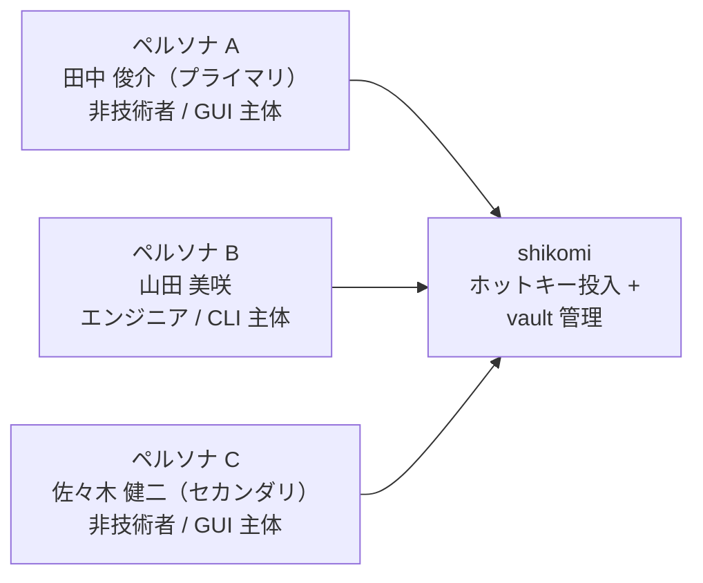

# ペルソナ定義 — shikomi

<!-- 配置先: docs/analysis/personas.md -->
<!-- 出典: docs/architecture/context/overview.md §3.2 を正規化して移植。overview.md §3.2 は本ファイルを正規参照先とする -->
<!-- 更新時は本ファイルのみ編集し、overview.md はこちらへの参照として扱う -->

## 概要

設計判断の軸とする代表ペルソナを 3 名定義する。feature の要件定義・UX 検討は「このペルソナにどんな価値を届けるか」で判断する。

---

## ペルソナ A: 田中 俊介（35歳 / SaaS 営業職）— **プライマリ**

| 項目 | 内容 |
|------|------|
| OS | Windows 11（仕事 PC）/ iPhone（私用） |
| 技術レベル | ChatGPT・Slack は自力操作可。PowerShell・コマンドプロンプトは触れない |
| 利用シーン | 顧客への定型返信文、社内共有サーバのネットワークパス（`\\server\share`）、顧客名・社員番号、法人ログインのパスワード |
| 期待 | ダブルクリックでインストール完了 / タスクトレイから瞬時に呼べる / `Ctrl+Alt+1〜9` 1 回で入力 |
| ペインポイント | Clibor（Windows 専用）を使っていたが MacBook では代替がなかった。パスワード平文保管への漠然とした不安はあるが、設定が複雑ならオフで使い続ける |
| 設計への制約 | SmartScreen 警告でインストールを中断しないよう、OV/EV 署名が必須。GUI で全操作を完結。CLI は使わない前提で設計する |

---

## ペルソナ B: 山田 美咲（28歳 / フロントエンドエンジニア）

| 項目 | 内容 |
|------|------|
| OS | macOS 14（M2 MacBook Pro）/ Ubuntu 24.04（自宅 dual-boot） |
| 技術レベル | Homebrew・apt は日常操作。Wayland/X11 の差異も把握。GitHub の issue を読んで解決できる |
| 利用シーン | よく使う SSH コマンド・`git rebase -i HEAD~N` 等の長いコマンド、開発用パスワード、PR テンプレート文 |
| 期待 | `brew install --cask shikomi` で入る / CLI で設定が完結 / Wayland で動く / GitHub で issue を追える |
| ペインポイント | Wayland 対応が「実は X11 だけ」な OSS に何度も遭遇。权限ダイアログで止まった時に macOS の解除手順が分からない OSS が多い |
| 設計への制約 | Wayland 経路は正確に実装する（タッチ対応等の特殊 API は不要）。CLI の設計品質が高ければ GUI は使わなくてもよい |

---

## ペルソナ C: 佐々木 健二（52歳 / 総務担当）— **セカンダリ**

| 項目 | 内容 |
|------|------|
| OS | Windows 10（社給 PC） |
| 技術レベル | インストーラの「次へ」を押せる。赤い警告ダイアログは意味が分からず怖くて閉じる |
| 利用シーン | 全社員のメールアドレス一覧の一部、社長の携帯番号（メール本文に定型挿入）、社内申請フォームの定型語 |
| 期待 | 「赤い警告が出たらサポートページに飛ばしてほしい」/ 「マスターパスワードを忘れたら問い合わせたい」 |
| ペインポイント | SmartScreen の「Windows によって PC が保護されました」画面でインストールをやめた経験が複数回 |
| 設計への制約 | EV 署名または段階的評判構築でSmartScreen 回避が優先課題。パスワード忘れ時は「vault 再作成」が唯一の回答と明示し、復旧不能のリスクをオンボーディング時に可視化する |

---

## ペルソナが設計に与える構造的制約

| 制約 | 根拠ペルソナ | 設計への反映 |
|------|------------|------------|
| **インストール UX が最優先** | A / C | Developer ID / EV / OV 署名、Notarization、NSIS インストーラ — `docs/architecture/tech-stack.md §2.2` |
| **GUI で全操作を完結** | A / C | CLI なしで vault 管理・ホットキー設定・暗号化オプトインが完結する GUI — `docs/features/shikomi-gui/feature-spec.md` |
| **デフォルトはマスターパスワードなし** | A / C | 平文 vault がデフォルト。暗号化はオプトイン — `docs/architecture/context/overview.md §1` |
| **暗号化オプトイン時の失念対策** | A / C | BIP-39 24 語リカバリコード（一度のみ表示）— `docs/architecture/tech-stack.md §2.4` |
| **Wayland 経路の正確な実装** | B | X11/Wayland 実行時プローブ、XDG GlobalShortcuts Portal — `docs/architecture/tech-stack.md §3.1` |
| **SmartScreen / Gatekeeper 対応** | C | OV 証明書（移行で EV 検討）、Notarization — `docs/architecture/tech-stack.md §2.2` |
