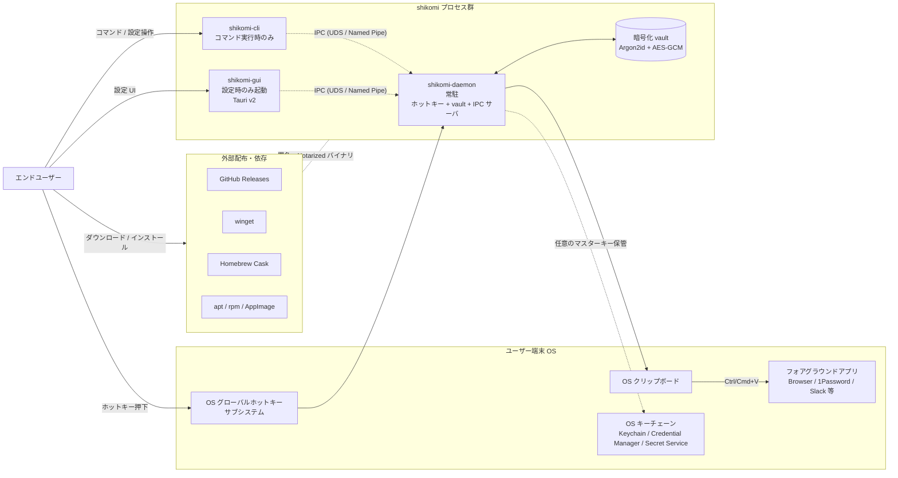
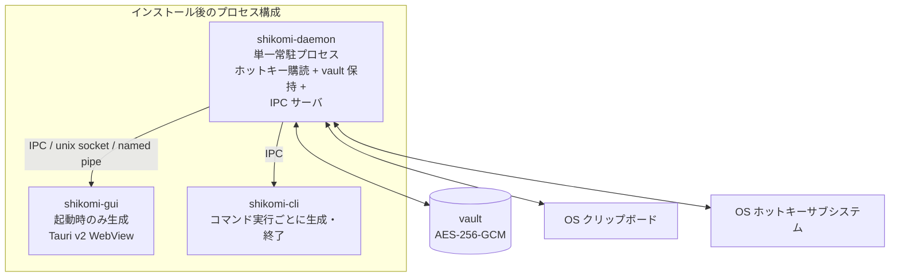

# System Context — shikomi

## 1. プロダクト概要

**shikomi**（仕込み）は、任意のグローバルホットキー（例: `Ctrl+Alt+1`）を押下すると、事前登録した文字列をクリップボード経由でフォアグラウンドアプリへ即時投入する、マルチプラットフォーム対応（Windows / macOS / Linux）のクリップボード管理ツール。Windows 専用ツール Clibor の OSS 代替を志向する。

- **CLI ファースト**: ドメインロジックを `shikomi-core` crate に閉じ込め、`shikomi-cli`（操作用）と `shikomi-gui`（Tauri v2 設定 GUI）が共有する
- **パスワード等の機密文字列**を第一級市民として扱う（自動クリア・シークレットヒントメタデータ・OS キーチェーン連携）
- **インストーラ配布**でエンドユーザに技術知識を要求しない（Developer ID 署名・Notarization・EV/OV 署名を前提）

## 2. システムコンテキスト図

## 3. アクター / ペルソナ

### 3.1 アクター一覧

| アクター | 役割 | 期待 |
|---------|-----|------|
| エンドユーザー | パスワード・定型文を多用する一般〜準熟練ユーザー | 3 クリック以内にインストール完了、ホットキー 1 回で投入完了 |
| 開発貢献者 | OSS コントリビュータ | CLI だけで完結する開発フロー、OS 依存を抑えたテスト |
| 配布チャネル | GitHub Releases / winget / Homebrew / APT | 署名済みアーティファクトと SBOM 提供 |

### 3.2 ペルソナ

設計判断の軸とするため、代表ペルソナを 3 名定義する。後続 feature の要件定義・UX 検討はこのペルソナに対する価値で判断する。

#### ペルソナ A: 田中 俊介（35, SaaS 営業職）— **プライマリ**
- **OS**: Windows 11（仕事）/ iPhone（Safari で私用）
- **技術レベル**: ChatGPT や Slack は自力で使える、PowerShell は触れない
- **利用シーン**: 顧客への定型返信文、社内共有サーバのネットワークパス、よく使う顧客名、自分の社員番号、法人ログインのパスワード
- **期待**: 「ダブルクリックでインストール」「タスクトレイから呼べる」「Ctrl+Alt+1〜9 で瞬間投入」
- **ペインポイント**: Clibor を使っていたが、私用で買った MacBook では代替がない。パスワード平文保管は怖い

#### ペルソナ B: 山田 美咲（28, フロントエンドエンジニア）
- **OS**: macOS 14（M2 MacBook Pro）+ Ubuntu 24.04（自宅 WSL 併用不可のため dual-boot）
- **技術レベル**: Homebrew / apt は日常使用、Wayland と X11 の違いも認識
- **利用シーン**: よく使う SSH コマンド、`git rebase -i HEAD~` のような長いコマンド、開発用パスワード、定型 PR テンプレート
- **期待**: 「Homebrew Cask で入る」「CLI で設定同期できる」「Wayland でもちゃんと動く」「GitHub で issue が追える」
- **ペインポイント**: macOS の権限ダイアログで止まった時に、どうすれば解除できるか分からない OSS が多い

#### ペルソナ C: 佐々木 健二（52, 総務担当）— **セカンダリ**
- **OS**: Windows 10（社給 PC）
- **技術レベル**: インストーラの `Next` を押せる、警告ダイアログは読んで分からなければ怖くて閉じる
- **利用シーン**: 全社員のメールアドレス、社長の携帯番号（メール本文に入れる）、社内申請フォームの定型語
- **期待**: 「赤い警告が出てきたら即座にサポートページに飛んでほしい」「マスターパスワードを忘れたら聞ける窓口」
- **ペインポイント**: SmartScreen の「Windows によって PC が保護されました」警告は意味が分からず、そこでインストールをやめる経験が複数回

#### ペルソナが設計に与える制約

- ペルソナ A / C が多数派想定 → **インストール UX と SmartScreen / Gatekeeper 対応は最優先**（詳細は `environment-diff.md` §5 の初回セットアップ UX フロー）
- ペルソナ B → CLI だけで完結する `shikomi export` / `import`、Wayland ネイティブ経路の正しさ
- ペルソナ A / C は「マスターパスワード失念＝復旧不能」を受け入れられない可能性がある → リカバリコード方式（印刷用 recovery phrase）を後続 feature でスコープ化

## 4. プロセスモデル・プロセス間境界

### 4.1 プロセス構成とライフサイクル

**設計ルール**:

1. **単一 daemon が真実源**: ホットキー登録・vault 保持・セッションキーキャッシュ・クリップボード操作は全て `shikomi-daemon` の責務。`shikomi-cli` / `shikomi-gui` は**直接 vault を開かない**。IPC 経由でのみ daemon に依頼する
2. **シングルインスタンス保証**: daemon は起動時に PID ファイル（OS 標準位置、`dirs` crate で解決）＋ advisory ロック（Win: `LockFileEx`、Unix: `flock`）で**多重起動を拒否**。既に動いていたら新プロセスは fail fast で終了
3. **自動起動**: OS 標準機構を使う。Tauri プラグイン `tauri-plugin-autostart` を第一選択とし、使えない箇所は OS API を直接呼ぶ
   - **Windows**: タスクスケジューラにユーザ領域タスク登録（`schtasks /Create /SC ONLOGON /TN "shikomi-daemon" /TR ...`）。レジストリ Run キーは UAC プロンプトで不利なため避ける
   - **macOS**: `launchd` LaunchAgent（`~/Library/LaunchAgents/dev.shikomi.daemon.plist`）、`launchctl bootstrap gui/$(id -u) <plist>`
   - **Linux (systemd 環境)**: systemd user unit（`~/.config/systemd/user/shikomi-daemon.service`）、`systemctl --user enable --now shikomi-daemon.service`
   - **Linux (systemd 非搭載環境)**: XDG Autostart（`~/.config/autostart/shikomi-daemon.desktop`）へフォールバック
4. **GUI 起動時の daemon 起動**: GUI が IPC 接続に失敗した場合、GUI は **daemon を子プロセスとして fork せず**、OS 自動起動機構を介して起動要求する（親子関係を作らないことで GUI 終了と daemon 常駐を独立化）。具体起動コマンド:
   - **Windows**: `schtasks /Run /TN "shikomi-daemon"`
   - **macOS**: `launchctl kickstart gui/$(id -u)/dev.shikomi.daemon`
   - **Linux (systemd)**: `systemctl --user start shikomi-daemon.service`
   - **Linux (Autostart)**: 直接 `shikomi-daemon` をバックグラウンド起動（`setsid nohup`）。failsafe 経路
5. **CLI の動作**: 常時 daemon に IPC 接続。daemon 未起動の場合は「起動せよ」と案内（`shikomi daemon start` を提示）

### 4.2 プロセス間通信（IPC）設計

**経路**: OS 標準のユーザ権限ローカル通信。**TCP は使わない**（同ネットワーク上の他端末から攻撃されない保証が必要なため）。

| OS | IPC トランスポート | アクセス制御 |
|----|-----------------|-----------------|
| Linux / macOS | Unix domain socket（`$XDG_RUNTIME_DIR/shikomi/daemon.sock` / `~/Library/Caches/shikomi/daemon.sock`） | ソケットファイルのパーミッションを **`0700`**（所有者のみ）。ディレクトリも `0700` を強制（mkdir 時・起動時に stat で確認し、異常なら fail fast） |
| Windows | Named Pipe（`\\.\pipe\shikomi-daemon-{user-sid}`） | **SDDL で現在ログオンセッション SID のみに `GENERIC_READ \| GENERIC_WRITE` を許可**、Everyone / Anonymous / NetworkService は明示的に拒否 |

**認証（なりすまし対策）**:

1. **ピア資格情報検証**: Unix は `SO_PEERCRED`（Linux）/ `LOCAL_PEERCRED`（macOS）で接続元 UID を取得し、daemon 所有者 UID と一致しない接続は即切断。Windows は `GetNamedPipeClientProcessId` → `OpenProcessToken` で接続元のユーザ SID を取得し検証
2. **セッショントークン**: daemon 起動時に 32 バイトの CSPRNG トークンを生成し、IPC 初回ハンドシェイクで検証（同ユーザ内の他プロセスに対する二重防御）。トークンはソケットと同一の `0700` 権限ファイルに保存、daemon 終了時に削除
3. **暗号化は不要**: localhost UDS / Named Pipe は OS のプロセス境界で保護されるため TLS は過剰設計（ただし将来リモート実行をサポートするなら別途再設計）

**通信プロトコル**: MessagePack over framed stream（長さプレフィックス 4 バイト LE + payload）。JSON は文字列 escape の差異でクロスプラットフォームバグを呼ぶため避ける。スキーマは `shikomi-core` crate の型定義で共有（`serde` + `rmp-serde`）。

**Fail Fast**:
- ピア資格情報検証失敗 → 即切断、`tracing::warn!` でログ
- トークンミスマッチ → 3 回連続失敗でそのソケットを閉じ、再生成
- ソケット／パイプのパーミッション異常検出 → daemon 起動拒否

### 4.3 セッションキーキャッシュ戦略

**課題**: Argon2id `m=19456 KiB, t=2, p=1` は設計上 数百 ms かかる。非機能要件のホットキー p95 100 ms とは毎回 KDF を走らせては両立しない。

**方針**: **Envelope Encryption + VEK キャッシュ**（詳細な鍵階層は `tech-stack.md` §2.4 参照）。アンロック時に `Argon2id(pw) → KEK_pw → AES-GCM-unwrap → VEK` を実行し、daemon メモリに VEK のみ保持する。KEK は使用直後に `zeroize`。

| 状態 | 保持 | タイムアウト |
|-----|------|------------|
| アンロック | `secrecy::SecretBox<[u8; 32]>`（VEK）**のみ** daemon プロセスメモリに保持。マスターパスワード本体・KEK_pw は使用直後に `zeroize` | — |
| アンロック継続条件 | 明示ロック / アイドルタイムアウト（既定 **15 分**、設定可能、範囲 1 分〜24 時間）/ スクリーンロック連動（OS シグナル購読）/ サスペンド復帰 | — |
| VEK 保持中 | 各 vault 操作は VEK で AES-256-GCM 復号のみ。p95 100 ms を満たす | — |
| ロック時 | VEK バッファを即 `zeroize`、以降の操作はマスターパスワード再入力が必要 | — |

**OS キーチェーン連携（オプトイン）**:
- ユーザが「OS ログイン連動で自動アンロック」を有効にした場合のみ、派生鍵を OS キーチェーン（`keyring` crate 経由）に保管。次回 daemon 起動時に取得して即時アンロック
- このモードは**マスターパスワード方式と共存**（デフォルトはマスターパスワード再入力、オプトインのみキーチェーン自動取得）
- **OS ごとの保護レベル**（同じ機能でも保証度が異なる、正直に明記）:
  - **Windows (Credential Manager / DPAPI)**: ユーザログオンセッション鍵で暗号化、他ユーザプロセスからの取得を OS が拒否
  - **macOS (Keychain)**: ACL とアプリ署名識別子（Code Signing Identity）で保護、他アプリからの取得時はユーザ承認プロンプト
  - **Linux (Secret Service / GNOME Keyring / KWallet)**: **ACL 非対応**（freedesktop Secret Service API 仕様上、同一セッションの全アプリが取得可能）。従って Linux では**他の同ユーザプロセスからの取得を OS が拒否しない**
- **残存リスク（Linux）**: この機能を Linux で有効化した場合、他アプリが同 Secret Service コレクションから VEK を読み出しうる。Linux でのオプトイン時は UI で**「この機能は Windows/macOS に比べ保護が弱い」と明示警告**し、デフォルトは無効を維持
- **対策代替案**: Linux では**マスターパスワード方式を強く推奨**し、キーチェーン方式は「日常の利便性 > 防御度」を受容した上級者向けオプションとする
- 出典: freedesktop Secret Service API 仕様 https://specifications.freedesktop.org/secret-service/latest/

**スクリーンロック・サスペンド連動**:
- Windows: `WTSRegisterSessionNotification`（`WTS_SESSION_LOCK` / `WTS_SESSION_UNLOCK`）
- macOS: `DistributedNotificationCenter` の `com.apple.screenIsLocked` / `com.apple.screensaver.didstart`
- Linux: `org.freedesktop.login1` DBus シグナル `Lock` / `PrepareForSleep`
- 受信時に派生鍵を即 `zeroize`（fail secure）

## 5. 解決する課題

1. Clibor が Windows 専用で、macOS / Ubuntu に同等機能の軽量ツールがない
2. 既存の代替（AutoKey / Espanso 等）は設定が複雑、または GUI が前世紀風
3. パスワードマネージャの「Auto-Type」は特定アプリ内限定で、任意アプリでは動作しない
4. クリップボード管理系は履歴保持が既定で、機密情報がクリップボード履歴や Cloud Clipboard に流出する

## 6. スコープ

### In Scope（MVP）
- ホットキー → クリップボードへの平文投入（`Ctrl/Cmd+V` は呼ばない。貼り付け操作はユーザ）
- 自動クリア（既定 30 秒、設定可能）
- クリップボードセンシティブヒントメタデータ付与
- マスターパスワード方式の暗号化 vault（Argon2id + AES-256-GCM）
- CLI（`add` / `list` / `rm` / `export` / `import` / `daemon`）
- Tauri v2 GUI（一覧・編集・ホットキー設定・テーマ）
- 署名済みインストーラ配布（Win: NSIS / macOS: DMG+Notarization / Linux: deb+rpm+AppImage）

### Out of Scope（MVPでは対象外、将来拡張）
- キーストローク注入によるアプリ直接入力（macOS Secure Event Input で失敗する、UX 不安定）
- クラウド同期（設計上の単一障害点。ローカル export/import のみ提供）
- ブラウザ拡張連携
- TOTP / パスワード生成
- モバイル（iOS/Android）

## 7. 脅威モデル（STRIDE ベース）

| 脅威カテゴリ | 具体 | 対策 |
|------------|-----|------|
| **S**poofing | 他プロセスが shikomi を名乗りホットキーを横取り／同ユーザ内の別プロセスが IPC ソケットへ偽装接続 | OS 署名（Developer ID / EV 証明書）、Wayland は Portal 同意ダイアログ、IPC は §4.2 の UDS `0700` + ピア UID 検証 + セッショントークン |
| **T**ampering | vault ファイルの改竄・途中書込でのファイル破損 | AEAD（AES-256-GCM）認証タグ検証、改竄時は `fail fast`。書込は **atomic write**（§7.1）で耐クラッシュ |
| **R**epudiation | 対象外（単独ローカルアプリ） | 該当なし — 理由: 外部へ操作ログを送出しない |
| **I**nformation Disclosure | 平文パスワードのクリップボード流出、履歴保持、Cloud Clipboard 同期、スワップ経由ディスク書出、IPC 通信盗聴 | 自動クリア（§7.2）、`x-kde-passwordManagerHint=secret` / `application/x-nspasteboard-concealed-type` / Windows `CanIncludeInClipboardHistory=0` / `CanUploadToCloudClipboard=0` / `ExcludeClipboardContentFromMonitorProcessing=1`、`secrecy` + `zeroize` によるメモリ上保護、best-effort `mlock`/`VirtualLock`、IPC は UDS パーミッション `0700` でカーネル境界に委譲 |
| **D**enial of Service | ホットキー登録衝突、daemon 多重起動、vault 破損 | 起動時検出 → ユーザに再割当を促す（fail fast）、PID + advisory lock による単一インスタンス、atomic write による部分書込防止 |
| **E**levation of Privilege | 管理者権限を要求しない設計 | 通常ユーザ権限で動作、setuid 等は使用しない |

### 7.1 vault の atomic write

- 書込先は `vault.db`（SQLite）本体ではなく `vault.db.new`（同一ディレクトリ、パーミッション `0600`）に書き、`fsync(2)` / `FlushFileBuffers` → `rename(2)` / `ReplaceFileW` で差替
- `rename` は POSIX の atomicity を利用。Windows は `ReplaceFileW` で旧ファイルを保持したままメタデータ差替（同一ボリューム内限定）
- 失敗時は `.new` を削除（部分書込を残さない）。起動時に `.new` の残存を検出したら破損扱い → リカバリ UI へ誘導
- SQLite 利用時は `PRAGMA journal_mode=WAL` ではなく `DELETE` を採用（WAL はチェックポイント不整合を生みやすく、export バックアップが取りにくい）

### 7.2 クリップボード自動クリア既定 30 秒の根拠

- **1Password**: 90 秒（`support.1password.com/copy-passwords/`）
- **KeePassXC**: 既定 10 秒（変更可）
- **Bitwarden**: 既定 "Never"（セキュリティ観点で問題あり、ユーザ設定前提）

shikomi は「ホットキーで投入 → ユーザが即貼付」が主ユースケース。10 秒は慌ただしい業務で短すぎ、90 秒は残存リスクが大きい。間を取って **30 秒** を既定とし、ユーザ設定で `5〜300` 秒の範囲を許可する。**クリア時は「書き込み時点の値と一致する場合のみ消す」ロジック**（KeePassXC 方式）で上書き誤消去を回避する。

#### 7.2.1 クリア時のユーザーフィードバック方針（アーキテクチャ決定）

**決定**: **カウントダウン表示 + クリア完了通知の二段構え**。単純な「消えて終わり」は UX 盲点（ペルソナ田中が「なぜ突然 Ctrl+V できなくなったのか」を理解できない）。ただし**通知の内容に秘密は含めない**。

| 段階 | タイミング | 表示 | 技術 |
|-----|---------|------|------|
| 投入直後 | ホットキー押下 → クリップボード書込完了時 | トレイアイコンを「シークレット投入中」色（例: オレンジ）に変更、ツールチップに残秒数を表示 | OS トレイ API（Tauri tray icon）。**内容は一切表示しない**、残秒数のみ |
| クリア中 | カウントダウン進行中 | トレイアイコンのツールチップを毎秒更新、最後の 5 秒は点滅 | 同上 |
| クリア完了 | クリアタイマー満了時 | OS 標準の非ブロッキング通知（macOS `UNUserNotificationCenter` / Windows `ToastNotification` / Linux `org.freedesktop.Notifications`）で「クリップボードをクリアしました」とのみ表示 | Tauri `tauri-plugin-notification`。**内容・入力元レコード名は含めない**（Alt+Tab 先の画面共有で漏洩する事故防止） |
| 上書き検出時 | 他アプリが同時期にクリップボードを書換 → shikomi が上書きを検出 | 通知せず静かに監視停止（誤消去防止） | — |

**ユーザ設定**:
- 全通知の**完全オフ**も許可（`shikomi settings --notifications=off`）。画面共有の多い利用者向け
- トレイアイコン非表示モード（完全な「見えない常駐」）も許可

**NG パターン（設計上拒否）**:
- モーダルダイアログでの通知（UX 破壊、Alt+Tab 前提の業務で操作を妨げる）
- 通知メッセージにレコード名やプレビュー文字を含める（画面共有・肩越し閲覧で情報漏洩）
- サウンド通知（デフォルト off、オプトイン）

## 8. OWASP Top 10 対応表（2021 版・デスクトップアプリ適用）

OWASP Top 10 はもともと Web アプリ向けだが、サーバを持たないデスクトップアプリでも**多くが該当する**（認可・ログ・暗号失敗・依存コンポーネント等）。設計上の取扱を以下に明示する。

| カテゴリ | 該当性 | shikomi での扱い |
|---------|-------|-----------------|
| **A01: Broken Access Control** | 該当（ローカル多重プロセス・多重ユーザ） | IPC の UID 検証＋ソケット `0700`（§4.2）。vault ファイルパーミッション `0600`、ディレクトリ `0700`。Windows は同等の ACL を SDDL で設定 |
| **A02: Cryptographic Failures** | 該当（最重要） | AEAD（AES-256-GCM）＋ Argon2id（OWASP 推奨 `m=19456, t=2, p=1`）。nonce は CSPRNG から毎回 96bit 生成、vault 内に per-record 記録（`tech-stack.md` §2.1 参照）。派生鍵は `secrecy` + `zeroize`。MAC（GMAC タグ）で改竄検知 |
| **A03: Injection** | 該当（SQL / コマンド引数） | SQLite 操作は `rusqlite` の parameter binding のみ使用し生 SQL 連結禁止。CLI → daemon IPC は MessagePack 型付きスキーマ、文字列として shell に渡す経路なし |
| **A04: Insecure Design** | 該当 | 本ドキュメント全体で扱う（プロセスモデル・Threat Model・Fail Secure 方針） |
| **A05: Security Misconfiguration** | 該当 | 既定値を安全側に（自動クリア 30 秒、アイドルタイムアウト 15 分、テレメトリ off、キーチェーン連携 off）。デバッグビルドは別バイナリでリリースチャネルに混入しない |
| **A06: Vulnerable and Outdated Components** | 該当 | `cargo-deny` + `cargo-audit` + Dependabot（`dev.md` §5）。`Cargo.lock` をコミットし lock 書換え監査。SBOM（CycloneDX）をリリースに添付 |
| **A07: Identification and Authentication Failures** | 該当 | マスターパスワード：Argon2id で総当たり耐性。レート制限：連続失敗 5 回で **非同期タイマー（`tokio::time::sleep`）による指数バックオフを該当 IPC リクエストにのみ適用**（プロセス全体を blocking sleep させない＝ホットキー購読を継続、`tech-stack.md` §2.4 参照）。IPC 認証：UID + セッショントークン。リカバリコード：BIP-39 24 語、1 度だけ表示、再発行不可 |
| **A08: Software and Data Integrity Failures** | 該当 | コード署名（Win: Authenticode、Mac: Developer ID + Notarization、Linux: GPG + minisign）。更新時は `tauri-plugin-updater` の minisign 署名検証、検証失敗で更新中断 |
| **A09: Security Logging and Monitoring Failures** | 該当（ただしテレメトリ送信なし方針） | ローカルログのみ、`tracing` で構造化。シークレットは `secrecy` の `Debug` マスクで自動秘匿。ログファイルはローテート（サイズ・日数）、`0600` 権限。プライバシ懸念のため操作ログはユーザが明示的に opt-in した場合のみ詳細化 |
| **A10: Server-Side Request Forgery** | 該当なし — サーバサイドリクエストを行わない | 該当なし。更新チェック（`tauri-plugin-updater`）のみ固定ホストへアクセス。任意 URL への HTTP 発行 API は提供しない |

### 8.1 残存リスク（受容する）

- **OS が侵害された場合**: プロセスメモリ読取・kernel keylogger・LD_PRELOAD 等にはアプリ側で防御不能。README / SECURITY.md に明記
- **サスペンド／ハイバネーション**: `mlock(2)` man-page 記載の通り、RAM 全体がスワップへ書き出される。メモリロックは best-effort
- **macOS Secure Event Input**: パスワード入力欄がフォーカスされている間、貼付後のキー入力も含め他プロセスからの注入はブロックされる。機能仕様として明示（仕様不具合ではない）

### 8.2 参考一次情報

- OWASP Secrets Management Cheat Sheet: https://cheatsheetseries.owasp.org/cheatsheets/Secrets_Management_Cheat_Sheet.html
- OWASP Password Storage Cheat Sheet（Argon2id 推奨パラメータ）: https://cheatsheetseries.owasp.org/cheatsheets/Password_Storage_Cheat_Sheet.html
- KeePassXC Clipboard 実装（sensitive hint の OS 別 MIME）: https://github.com/keepassxreboot/keepassxc/blob/develop/src/gui/Clipboard.cpp
- KDE `x-kde-passwordManagerHint` 由来: https://phabricator.kde.org/D12539
- 1Password 90 秒自動クリア既定: https://support.1password.com/copy-passwords/
- Wayland セキュリティモデル: https://wayland.freedesktop.org/architecture.html
- `mlock(2)` とサスペンド制約: https://man7.org/linux/man-pages/man2/mlock.2.html
- Apple Technote TN2150（Secure Event Input）: https://developer.apple.com/library/archive/technotes/tn2150/_index.html

## 9. 非機能要件（概要、詳細は各 feature の requirements.md に展開）

| 区分 | 指標 | 目標 |
|-----|------|------|
| パフォーマンス | ホットキー押下 → クリップボード書込完了（daemon がアンロック済＝派生鍵キャッシュ保持中） | p95 100 ms 以下 |
| 認証処理 | マスターパスワード入力 → アンロック完了（Argon2id 実行） | p95 1 秒以下（OWASP 推奨パラメータ前提） |
| バイナリサイズ | GUI インストーラ展開後 | 30 MB 以下（Tauri 実績 ~10 MB に安全マージン） |
| メモリ常駐 | アイドル時 | 50 MB 以下 |
| 起動時間 | コールドスタート（GUI） | 1 秒以下 |
| 対応 OS | 最低ライン | Windows 10+、macOS 12+（Monterey）、Ubuntu 22.04+ / Fedora 40+ |
| ライセンス | — | MIT（OSS 公開・貢献容易性優先） |
| 署名 | 全 OS | 製品リリースでは全プラットフォーム署名必須 |
