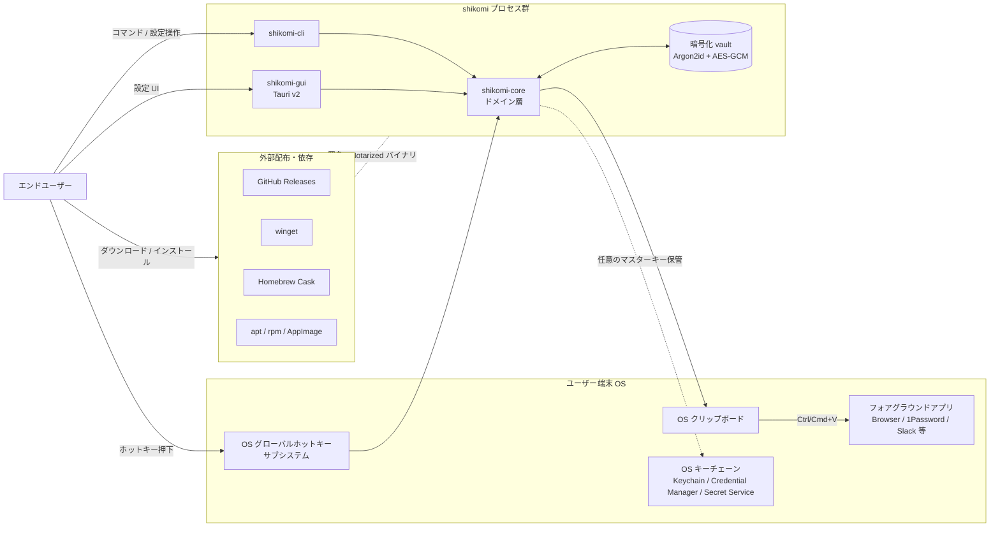

# System Context — shikomi

## 1. プロダクト概要

**shikomi**（仕込み）は、任意のグローバルホットキー（例: `Ctrl+Alt+1`）を押下すると、事前登録した文字列をクリップボード経由でフォアグラウンドアプリへ即時投入する、マルチプラットフォーム対応（Windows / macOS / Linux）のクリップボード管理ツール。Windows 専用ツール Clibor の OSS 代替を志向する。

- **CLI ファースト**: ドメインロジックを `shikomi-core` crate に閉じ込め、`shikomi-cli`（操作用）と `shikomi-gui`（Tauri v2 設定 GUI）が共有する
- **パスワード等の機密文字列**を第一級市民として扱う（自動クリア・シークレットヒントメタデータ・OS キーチェーン連携）
- **インストーラ配布**でエンドユーザに技術知識を要求しない（Developer ID 署名・Notarization・EV/OV 署名を前提）

## 2. システムコンテキスト図

## 3. アクター

| アクター | 役割 | 期待 |
|---------|-----|------|
| エンドユーザー | パスワード・定型文を多用する一般ユーザー | 3 クリック以内にインストール完了、ホットキー 1 回で投入完了 |
| 開発貢献者 | OSS コントリビュータ | CLI だけで完結する開発フロー、OS 依存を抑えたテスト |
| 配布チャネル | GitHub Releases / winget / Homebrew / APT | 署名済みアーティファクトと SBOM 提供 |

## 4. 解決する課題

1. Clibor が Windows 専用で、macOS / Ubuntu に同等機能の軽量ツールがない
2. 既存の代替（AutoKey / Espanso 等）は設定が複雑、または GUI が前世紀風
3. パスワードマネージャの「Auto-Type」は特定アプリ内限定で、任意アプリでは動作しない
4. クリップボード管理系は履歴保持が既定で、機密情報がクリップボード履歴や Cloud Clipboard に流出する

## 5. スコープ

### In Scope（MVP）
- ホットキー → クリップボードへの平文投入（`Ctrl/Cmd+V` は呼ばない。貼り付け操作はユーザ）
- 自動クリア（既定 30 秒、設定可能）
- クリップボードセンシティブヒントメタデータ付与
- マスターパスワード方式の暗号化 vault（Argon2id + AES-256-GCM）
- CLI（`add` / `list` / `rm` / `export` / `import` / `daemon`）
- Tauri v2 GUI（一覧・編集・ホットキー設定・テーマ）
- 署名済みインストーラ配布（Win: NSIS / macOS: DMG+Notarization / Linux: deb+rpm+AppImage）

### Out of Scope（MVPでは対象外、将来拡張）
- キーストローク注入によるアプリ直接入力（macOS Secure Event Input で失敗する、UX 不安定）
- クラウド同期（設計上の単一障害点。ローカル export/import のみ提供）
- ブラウザ拡張連携
- TOTP / パスワード生成
- モバイル（iOS/Android）

## 6. 脅威モデル（STRIDE ベース）

| 脅威カテゴリ | 具体 | 対策 |
|------------|-----|------|
| **S**poofing | 他プロセスが shikomi を名乗りホットキーを横取り | OS 署名（Developer ID / EV 証明書）、Wayland は Portal 同意ダイアログ |
| **T**ampering | vault ファイルの改竄 | AEAD（AES-256-GCM）認証タグ検証、改竄時は `fail fast` でエラー |
| **R**epudiation | 対象外（単独ローカルアプリ） | 該当なし — 理由: 外部へ操作ログを送出しない |
| **I**nformation Disclosure | 平文パスワードのクリップボード流出、履歴保持、Cloud Clipboard 同期、スワップ経由ディスク書出 | 自動クリア、`x-kde-passwordManagerHint=secret` / `application/x-nspasteboard-concealed-type` / Windows `CanIncludeInClipboardHistory=0` / `CanUploadToCloudClipboard=0` / `ExcludeClipboardContentFromMonitorProcessing=1`、`secrecy` + `zeroize` によるメモリ上保護、best-effort `mlock`/`VirtualLock` |
| **D**enial of Service | ホットキー登録衝突 | 起動時検出 → ユーザに再割当を促す（fail fast）、ロック/強制終了時のファイル破損検出 |
| **E**levation of Privilege | 管理者権限を要求しない設計 | 通常ユーザ権限で動作、setuid 等は使用しない |

### 6.1 残存リスク（受容する）

- **OS が侵害された場合**: プロセスメモリ読取・kernel keylogger・LD_PRELOAD 等にはアプリ側で防御不能。README / SECURITY.md に明記
- **サスペンド／ハイバネーション**: `mlock(2)` man-page 記載の通り、RAM 全体がスワップへ書き出される。メモリロックは best-effort
- **macOS Secure Event Input**: パスワード入力欄がフォーカスされている間、貼付後のキー入力も含め他プロセスからの注入はブロックされる。機能仕様として明示（仕様不具合ではない）

### 6.2 参考一次情報

- OWASP Secrets Management Cheat Sheet: https://cheatsheetseries.owasp.org/cheatsheets/Secrets_Management_Cheat_Sheet.html
- OWASP Password Storage Cheat Sheet（Argon2id 推奨パラメータ）: https://cheatsheetseries.owasp.org/cheatsheets/Password_Storage_Cheat_Sheet.html
- KeePassXC Clipboard 実装（sensitive hint の OS 別 MIME）: https://github.com/keepassxreboot/keepassxc/blob/develop/src/gui/Clipboard.cpp
- KDE `x-kde-passwordManagerHint` 由来: https://phabricator.kde.org/D12539
- 1Password 90 秒自動クリア既定: https://support.1password.com/copy-passwords/
- Wayland セキュリティモデル: https://wayland.freedesktop.org/architecture.html
- `mlock(2)` とサスペンド制約: https://man7.org/linux/man-pages/man2/mlock.2.html
- Apple Technote TN2150（Secure Event Input）: https://developer.apple.com/library/archive/technotes/tn2150/_index.html

## 7. 非機能要件（概要、詳細は各 feature の requirements.md に展開）

| 区分 | 指標 | 目標 |
|-----|------|------|
| パフォーマンス | ホットキー押下 → クリップボード書込完了 | p95 100 ms 以下 |
| バイナリサイズ | GUI インストーラ展開後 | 30 MB 以下（Tauri 実績 ~10 MB に安全マージン） |
| メモリ常駐 | アイドル時 | 50 MB 以下 |
| 起動時間 | コールドスタート（GUI） | 1 秒以下 |
| 対応 OS | 最低ライン | Windows 10+、macOS 12+（Monterey）、Ubuntu 22.04+ / Fedora 40+ |
| ライセンス | — | MIT（OSS 公開・貢献容易性優先） |
| 署名 | 全 OS | 製品リリースでは全プラットフォーム署名必須 |
