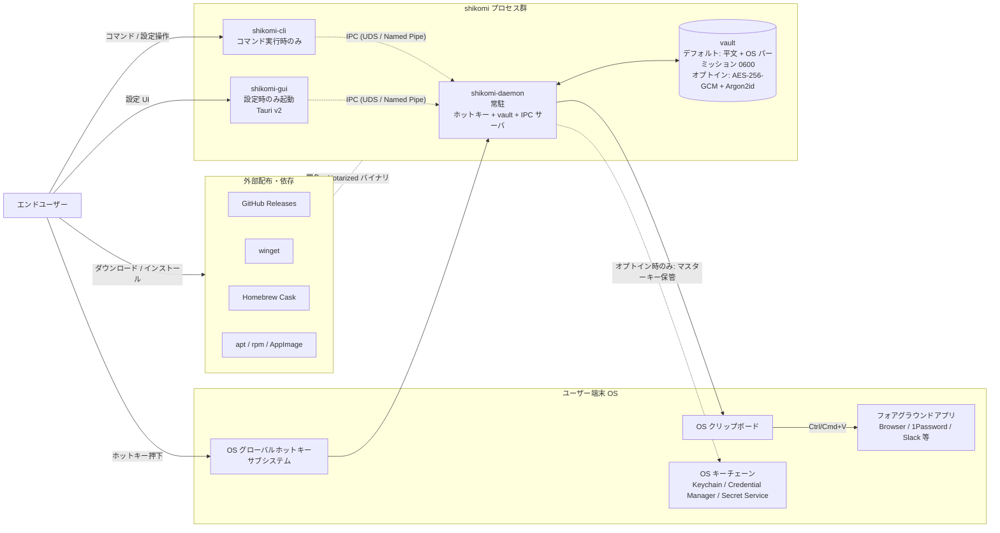

# System Context — Overview（shikomi）

> **本書の位置づけ**: `docs/architecture/context/` 配下 4 ファイル構成の**概要編**。システム全体像・アクター・ペルソナを扱う。プロセスモデル / IPC / vault 保護モードは `process-model.md`、脅威モデル / OWASP は `threat-model.md`、課題 / スコープ / 非機能要件は `nfr.md` を参照。

## 1. プロダクト概要

**shikomi**（仕込み）は、任意のグローバルホットキー（例: `Ctrl+Alt+1`）を押下すると、事前登録した文字列をクリップボード経由でフォアグラウンドアプリへ即時投入する、マルチプラットフォーム対応（Windows / macOS / Linux）のクリップボード管理ツール。Windows 専用ツール Clibor の OSS 代替を志向する。

- **CLI ファースト**: ドメインロジックを `shikomi-core` crate に閉じ込め、`shikomi-cli`（操作用）と `shikomi-gui`（Tauri v2 設定 GUI）が共有する
- **パスワード等の機密文字列**を第一級市民として扱う（自動クリア・シークレットヒントメタデータ・OS キーチェーン連携）
- **インストーラ配布**でエンドユーザに技術知識を要求しない（Developer ID 署名・Notarization・EV/OV 署名を前提）
- **vault 保護方針（最重要のデフォルト値）**: **デフォルトは平文 vault**。OS ファイルパーミッション（Unix `0600` / Windows ACL 所有者のみ）のみで保護する。**マスターパスワードによる暗号化保護はオプトイン**で、ユーザが設定画面または `shikomi vault encrypt` コマンドで明示的に有効化した場合のみ Argon2id + AES-256-GCM を適用する。ペルソナ A/C（技術知識不要層）が初回セットアップで心理的障壁を負わないこと、ペルソナ B が「まずは試しに使う」段階で暗号化のオンボーディングを強制されないことを優先する設計判断である（詳細は `process-model.md` §4.3 / `threat-model.md` §7）

## 2. システムコンテキスト図

## 3. アクター / ペルソナ

### 3.1 アクター一覧

| アクター | 役割 | 期待 |
|---------|-----|------|
| エンドユーザー | パスワード・定型文を多用する一般〜準熟練ユーザー | 3 クリック以内にインストール完了、ホットキー 1 回で投入完了 |
| 開発貢献者 | OSS コントリビュータ | CLI だけで完結する開発フロー、OS 依存を抑えたテスト |
| 配布チャネル | GitHub Releases / winget / Homebrew / APT | 署名済みアーティファクトと SBOM 提供 |

### 3.2 ペルソナ

設計判断の軸とするため、代表ペルソナを 3 名定義する。後続 feature の要件定義・UX 検討はこのペルソナに対する価値で判断する。

#### ペルソナ A: 田中 俊介（35, SaaS 営業職）— **プライマリ**
- **OS**: Windows 11（仕事）/ iPhone（Safari で私用）
- **技術レベル**: ChatGPT や Slack は自力で使える、PowerShell は触れない
- **利用シーン**: 顧客への定型返信文、社内共有サーバのネットワークパス、よく使う顧客名、自分の社員番号、法人ログインのパスワード
- **期待**: 「ダブルクリックでインストール」「タスクトレイから呼べる」「Ctrl+Alt+1〜9 で瞬間投入」
- **ペインポイント**: Clibor を使っていたが、私用で買った MacBook では代替がない。パスワード平文保管は怖い

#### ペルソナ B: 山田 美咲（28, フロントエンドエンジニア）
- **OS**: macOS 14（M2 MacBook Pro）+ Ubuntu 24.04（自宅 WSL 併用不可のため dual-boot）
- **技術レベル**: Homebrew / apt は日常使用、Wayland と X11 の違いも認識
- **利用シーン**: よく使う SSH コマンド、`git rebase -i HEAD~` のような長いコマンド、開発用パスワード、定型 PR テンプレート
- **期待**: 「Homebrew Cask で入る」「CLI で設定同期できる」「Wayland でもちゃんと動く」「GitHub で issue が追える」
- **ペインポイント**: macOS の権限ダイアログで止まった時に、どうすれば解除できるか分からない OSS が多い

#### ペルソナ C: 佐々木 健二（52, 総務担当）— **セカンダリ**
- **OS**: Windows 10（社給 PC）
- **技術レベル**: インストーラの `Next` を押せる、警告ダイアログは読んで分からなければ怖くて閉じる
- **利用シーン**: 全社員のメールアドレス、社長の携帯番号（メール本文に入れる）、社内申請フォームの定型語
- **期待**: 「赤い警告が出てきたら即座にサポートページに飛んでほしい」「マスターパスワードを忘れたら聞ける窓口」
- **ペインポイント**: SmartScreen の「Windows によって PC が保護されました」警告は意味が分からず、そこでインストールをやめる経験が複数回

#### ペルソナが設計に与える制約

- ペルソナ A / C が多数派想定 → **インストール UX と SmartScreen / Gatekeeper 対応は最優先**（詳細は `../environment-diff.md` §5 の初回セットアップ UX フロー）
- ペルソナ B → CLI だけで完結する `shikomi export` / `import`、Wayland ネイティブ経路の正しさ
- ペルソナ A / C は「マスターパスワード失念＝復旧不能」を受け入れられない可能性がある → **そもそもデフォルトはマスターパスワード不要（平文 vault）**とし、暗号化保護はオプトインとする。オプトイン時は BIP-39 24 語リカバリコードで失念に備える
- 「暗号化がオンになっていることに気付かず使い始める」逆の事故（初期オンボ中に長いパスワードを強制されて離脱）を防ぐため、**デフォルト OFF** を恒久方針とする。暗号化オプトインの利点・リスクは GUI 設定画面と `shikomi vault --help` で明示的に説明する
