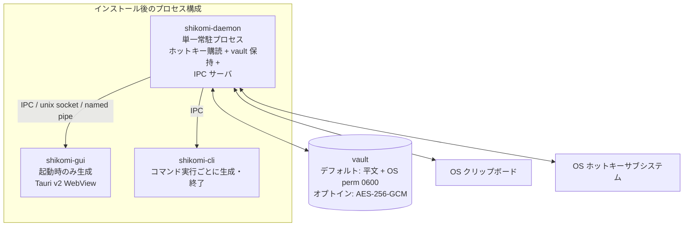

# System Context — Process Model（shikomi）

> **本書の位置づけ**: `docs/architecture/context/` 配下の**プロセスモデル・IPC・vault 保護モード編**。システム概要・ペルソナは `overview.md`、脅威モデル / OWASP は `threat-model.md`、課題 / スコープ / 非機能要件は `nfr.md` を参照。

## 4. プロセスモデル・プロセス間境界

### 4.1 プロセス構成とライフサイクル

**設計ルール**:

1. **単一 daemon が真実源**: ホットキー登録・vault 保持・セッションキーキャッシュ（暗号化モード時のみ）・クリップボード操作は全て `shikomi-daemon` の責務。`shikomi-cli` / `shikomi-gui` は**直接 vault を開かない**。IPC 経由でのみ daemon に依頼する
2. **シングルインスタンス保証**: daemon は起動時に PID ファイル（OS 標準位置、`dirs` crate で解決）＋ advisory ロック（Win: `LockFileEx`、Unix: `flock`）で**多重起動を拒否**。既に動いていたら新プロセスは fail fast で終了
3. **自動起動**: OS 標準機構を使う。Tauri プラグイン `tauri-plugin-autostart` を第一選択とし、使えない箇所は OS API を直接呼ぶ
   - **Windows**: タスクスケジューラにユーザ領域タスク登録（`schtasks /Create /SC ONLOGON /TN "shikomi-daemon" /TR ...`）。レジストリ Run キーは UAC プロンプトで不利なため避ける
   - **macOS**: `launchd` LaunchAgent（`~/Library/LaunchAgents/dev.shikomi.daemon.plist`）、`launchctl bootstrap gui/$(id -u) <plist>`
   - **Linux (systemd 環境)**: systemd user unit（`~/.config/systemd/user/shikomi-daemon.service`）、`systemctl --user enable --now shikomi-daemon.service`
   - **Linux (systemd 非搭載環境)**: XDG Autostart（`~/.config/autostart/shikomi-daemon.desktop`）へフォールバック
4. **GUI 起動時の daemon 起動**: GUI が IPC 接続に失敗した場合、GUI は **daemon を子プロセスとして fork せず**、OS 自動起動機構を介して起動要求する（親子関係を作らないことで GUI 終了と daemon 常駐を独立化）。具体起動コマンド:
   - **Windows**: `schtasks /Run /TN "shikomi-daemon"`
   - **macOS**: `launchctl kickstart gui/$(id -u)/dev.shikomi.daemon`
   - **Linux (systemd)**: `systemctl --user start shikomi-daemon.service`
   - **Linux (Autostart)**: 直接 `shikomi-daemon` をバックグラウンド起動（`setsid nohup`）。failsafe 経路
5. **CLI の動作**: 常時 daemon に IPC 接続。daemon 未起動の場合は「起動せよ」と案内（`shikomi daemon start` を提示）

### 4.2 プロセス間通信（IPC）設計

**経路**: OS 標準のユーザ権限ローカル通信。**TCP は使わない**（同ネットワーク上の他端末から攻撃されない保証が必要なため）。

| OS | IPC トランスポート | アクセス制御 |
|----|-----------------|-----------------|
| Linux / macOS | Unix domain socket（`$XDG_RUNTIME_DIR/shikomi/daemon.sock` / `~/Library/Caches/shikomi/daemon.sock`） | ソケットファイルのパーミッションを **`0700`**（所有者のみ）。ディレクトリも `0700` を強制（mkdir 時・起動時に stat で確認し、異常なら fail fast） |
| Windows | Named Pipe（`\\.\pipe\shikomi-daemon-{user-sid}`） | **SDDL で現在ログオンセッション SID のみに `GENERIC_READ \| GENERIC_WRITE` を許可**、Everyone / Anonymous / NetworkService は明示的に拒否 |

**認証（なりすまし対策）**:

1. **ピア資格情報検証**: Unix は `SO_PEERCRED`（Linux）/ `LOCAL_PEERCRED`（macOS）で接続元 UID を取得し、daemon 所有者 UID と一致しない接続は即切断。Windows は `GetNamedPipeClientProcessId` → `OpenProcessToken` で接続元のユーザ SID を取得し検証
2. **セッショントークン**: daemon 起動時に 32 バイトの CSPRNG トークンを生成し、IPC 初回ハンドシェイクで検証（同ユーザ内の他プロセスに対する二重防御）。トークンはソケットと同一の `0700` 権限ファイルに保存、daemon 終了時に削除
3. **暗号化は不要**: localhost UDS / Named Pipe は OS のプロセス境界で保護されるため TLS は過剰設計（ただし将来リモート実行をサポートするなら別途再設計）

**通信プロトコル**: MessagePack over framed stream（長さプレフィックス 4 バイト LE + payload）。JSON は文字列 escape の差異でクロスプラットフォームバグを呼ぶため避ける。スキーマは `shikomi-core` crate の型定義で共有（`serde` + `rmp-serde`）。

**Fail Fast**:
- ピア資格情報検証失敗 → 即切断、`tracing::warn!` でログ
- トークンミスマッチ → 3 回連続失敗でそのソケットを閉じ、再生成
- ソケット／パイプのパーミッション異常検出 → daemon 起動拒否

### 4.3 vault 保護モードと鍵キャッシュ戦略

**前提**: vault 保護は **2 モードのうちユーザが選択した 1 つ**で動作する。モードは vault ヘッダに記録し、daemon は起動時に読み取って分岐する（Tell, Don't Ask）。

| モード | デフォルト | 保護手段 | daemon 内メモリ挙動 | ユーザ入力 |
|-------|---------|---------|-----------------|----------|
| **平文モード** | **✔ デフォルト** | OS ファイルパーミッション `0600`（Unix）/ 所有者 ACL（Windows）+ ディレクトリ `0700` | vault 内容をそのまま読込。KDF/KEK/VEK の概念なし | 不要 |
| **暗号化モード**（オプトイン） | — | Argon2id + AES-256-GCM + Envelope Encryption（`../tech-stack.md` §2.4） | VEK のみ `secrecy::SecretBox<[u8; 32]>` で保持、KEK・マスターパスワードは使用直後に `zeroize` | マスターパスワード（または BIP-39 リカバリコード）でアンロック |

**モード切替の UX**:
- **有効化**: `shikomi vault encrypt` CLI または GUI「vault 保護を有効化」ボタン → マスターパスワード入力 → リカバリコード 24 語生成・表示・転記確認 → 既存レコードを VEK で再暗号化して atomic write
- **無効化**: `shikomi vault decrypt` CLI または GUI 同等ボタン → 現在のマスターパスワードで認証 → 全レコードを平文に戻して atomic write。**警告モーダル必須**（「この操作後、vault は OS パーミッションのみで保護されます」）
- **モード判定**: vault ヘッダの `protection_mode` フィールド（`"plaintext"` / `"encrypted"`）で decide。不明値は fail fast

#### 平文モードの課題（Argon2id 遅延）は発生しない
- 平文モードでは KDF を走らせないため、ホットキー応答時間は I/O とシリアライズのみに支配される（p95 100 ms を余裕で達成）
- 暗号化モード時のみ §4.3.1 の VEK キャッシュが必要

#### 4.3.1 暗号化モード時の VEK キャッシュ

| 状態 | 保持 | タイムアウト |
|-----|------|------------|
| アンロック | `secrecy::SecretBox<[u8; 32]>`（VEK）**のみ** daemon プロセスメモリに保持。マスターパスワード本体・KEK_pw は使用直後に `zeroize` | — |
| アンロック継続条件 | 明示ロック / アイドルタイムアウト（既定 **15 分**、設定可能、範囲 1 分〜24 時間）/ スクリーンロック連動（OS シグナル購読）/ サスペンド復帰 | — |
| VEK 保持中 | 各 vault 操作は VEK で AES-256-GCM 復号のみ。p95 100 ms を満たす | — |
| ロック時 | VEK バッファを即 `zeroize`、以降の操作はマスターパスワード再入力が必要 | — |

**OS キーチェーン連携（暗号化モードの追加オプトイン）**:
- 暗号化モードが有効で、かつユーザが「OS ログイン連動で自動アンロック」をさらにオプトインした場合のみ、`wrapped_VEK_by_keychain` を OS キーチェーン（`keyring` crate 経由）に保管。次回 daemon 起動時に取得して即時アンロック
- **平文モードでは本機能は無意味**（守るべき鍵が存在しないため）＝ UI で非活性化
- **OS ごとの保護レベル**（同じ機能でも保証度が異なる、正直に明記）:
  - **Windows (Credential Manager / DPAPI)**: ユーザログオンセッション鍵で暗号化、他ユーザプロセスからの取得を OS が拒否
  - **macOS (Keychain)**: ACL とアプリ署名識別子（Code Signing Identity）で保護、他アプリからの取得時はユーザ承認プロンプト
  - **Linux (Secret Service / GNOME Keyring / KWallet)**: **ACL 非対応**（freedesktop Secret Service API 仕様上、同一セッションの全アプリが取得可能）。従って Linux では**他の同ユーザプロセスからの取得を OS が拒否しない**
- **残存リスク（Linux）**: この機能を Linux で有効化した場合、他アプリが同 Secret Service コレクションから VEK を読み出しうる。Linux でのオプトイン時は UI で**「この機能は Windows/macOS に比べ保護が弱い」と明示警告**し、デフォルトは無効を維持
- **対策代替案**: Linux では**マスターパスワード手動入力**を強く推奨し、キーチェーン方式は「日常の利便性 > 防御度」を受容した上級者向けオプションとする
- 出典: freedesktop Secret Service API 仕様 https://specifications.freedesktop.org/secret-service/latest/

**スクリーンロック・サスペンド連動（暗号化モードのみ）**:
- Windows: `WTSRegisterSessionNotification`（`WTS_SESSION_LOCK` / `WTS_SESSION_UNLOCK`）
- macOS: `DistributedNotificationCenter` の `com.apple.screenIsLocked` / `com.apple.screensaver.didstart`
- Linux: `org.freedesktop.login1` DBus シグナル `Lock` / `PrepareForSleep`
- 受信時に VEK を即 `zeroize`（fail secure）。平文モードでは購読不要
