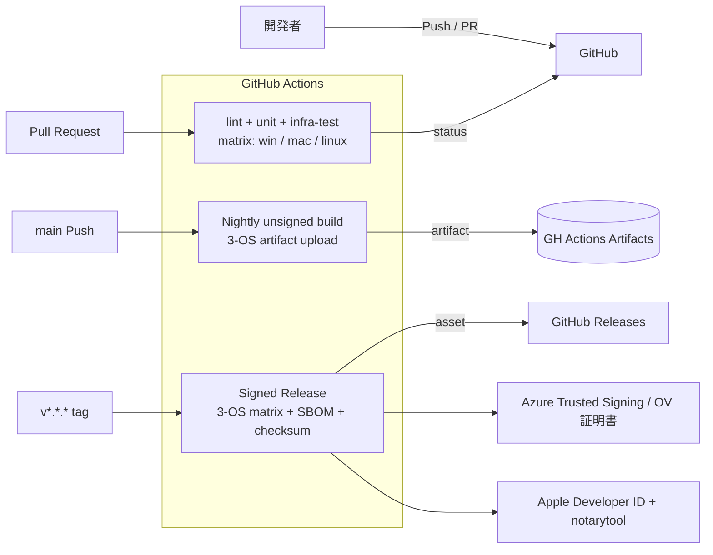

# Development / CI Environment — shikomi

## 1. 位置づけ

shikomi はクラウド「dev 環境」を持たないデスクトップ OSS のため、本ドキュメントでは **GitHub Actions 上の CI／Preview ビルド環境**を「開発環境」とみなす。本番（production.md）は署名済みリリースビルドと配布チャネルを指す。

## 2. CI/CD 全体図

## 3. ジョブ定義（責務レベル）

| ジョブ | トリガ | 役割 | OS matrix |
|-------|-------|------|----------|
| `lint` | PR / push | `cargo fmt --check`, `cargo clippy -D warnings`, `pnpm lint` | ubuntu-latest 単一（高速化） |
| `unit-core` | PR / push | `shikomi-core` ユニットテスト、`cargo nextest` | ubuntu-latest 単一（I/O なし、OS 非依存） |
| `test-infra` | PR / push | `shikomi-infra` の OS 依存テスト | Win / macOS / Ubuntu（22.04 x11 + 24.04 wayland）の matrix |
| `audit` | PR / push / nightly | `cargo-deny check`, Dependabot alerts 集約 | ubuntu-latest |
| `build-preview` | PR `labeled: preview` | 未署名の 3-OS ビルドを artifact として PR に添付 | matrix |
| `build-nightly` | 日次 cron | 未署名バイナリ、main から | matrix |
| `release` | タグ `v*.*.*` push | 署名済み・公証済み・SBOM 付き成果物を Releases に登録 | matrix |
| `pages` | main push（`docs/` 差分時） | `mdBook` / Astro 等で設計書＆ランディングページを GitHub Pages へ | ubuntu-latest |

**Ubuntu は X11 と Wayland の両セッションでテストする**（Wayland のホットキー実装は X11 と別経路のため）。GitHub Actions の `ubuntu-24.04` は既定で Wayland セッション、`ubuntu-22.04` は X11 セッションを使える。詳細は環境差分ドキュメント（`environment-diff.md`）を参照。

## 4. 署名・秘密情報の管理

| 秘密情報 | 保管 | 参照方法 |
|---------|------|---------|
| Apple Developer ID 証明書（`.p12`） | GitHub Actions Secrets（base64 encoded） | `release` ジョブで macOS ランナーに復号→keychain import→ビルド後破棄 |
| App Store Connect API Key（notarization） | GitHub Actions Secrets | `xcrun notarytool submit --apple-id --team-id --key` |
| Windows コード署名証明書 | **Azure Trusted Signing** 経由（キーはクラウド KMS に保管、CI から OIDC で呼び出す。ローカル `.pfx` を Secrets に置く運用は避ける） | OIDC Federation → `AzureSignTool` |
| GitHub Releases PAT | 不要（`GITHUB_TOKEN` で十分） | — |

**方針**: 秘密鍵ファイルを直接 Secrets にコミットする運用は行わない。Apple は `.p12` を base64 で Secrets に置かざるを得ないが、Windows はクラウド KMS 経由に寄せる。

## 5. 依存と脆弱性の監視

- `cargo-deny` の `advisory` / `licenses` / `bans` / `sources` を全部有効化
- Dependabot: Rust (`cargo`), npm (`shikomi-gui/ui`), GitHub Actions の 3 エコシステムに対し週次
- **lock file ガード**: `cargo --locked` / `pnpm install --frozen-lockfile` は「lock 再生成の禁止」しか検知できない。Cargo.toml 無変更で lock が書き換わった PR を検知するには追加ステップが必要:
  1. CI 冒頭で `cargo --locked fetch --offline` / `pnpm install --frozen-lockfile` を実行し、lock と manifest が一致しない場合 fail
  2. **PR diff ガード**: `git diff --name-only origin/main...HEAD` で `Cargo.lock` / `pnpm-lock.yaml` が変更されているかつ `Cargo.toml` / `shikomi-*/Cargo.toml` / `package.json` に変更がない場合、**PR ラベル `deps-lockfile-only`** の付与をマージ条件に要求。ラベルは意図的な更新（`cargo update -p <crate>` 等）である根拠を PR 本文に記載した場合のみレビュアが付与する
  3. 上記により「意図せず `cargo update` が発火して lock 全体が書換わる」事故を PR レビューで確実に止める
- CVE 検知時: Dependabot alert → Severity High 以上は `security` ラベル付 Issue 自動起票、72h 以内にトリアージ

## 6. テスト戦略

| 階層 | 対応設計書 | 実行環境 |
|-----|----------|---------|
| ユニット | `shikomi-core` の pure 関数（暗号・モデル・バリデーション） | CI ubuntu 単一 |
| 結合 | `shikomi-infra` のアダプタ（keyring mock、arboard fake、ashpd モック） | CI 3-OS matrix |
| E2E | Tauri `WebDriverIO` で GUI 操作、`expect-test` で CLI ゴールデン | CI 3-OS matrix（Linux は X11 ヘッドレス `Xvfb`） |

Wayland のホットキー portal は**対話的同意ダイアログ**が前提のため、CI では portal モック（`ashpd::backend` の test fixture）で代替する。

## 7. ブランチ保護・マージ戦略

- `main` ブランチは保護：直接 push 禁止、PR 必須、required checks は `lint` / `unit-core` / `test-infra` / `audit`
- レビュー: CODEOWNERS による最低 1 名承認必須
- マージ戦略: **squash merge** 既定（履歴を線形に保つ、CHANGELOG 生成が容易）
- Conventional Commits 準拠を PR テンプレートで促し、`release-please` で自動 CHANGELOG と タグ付け

## 8. コスト

GitHub Actions の Public リポジトリ無料枠内を想定。macOS ランナーは無料枠の倍率係数が高いため、`test-infra` は PR では `macos-latest` を通常使用し、`build-nightly` は Linux のみ毎日、macOS/Windows は週次に抑制する設計（最適化は運用開始後に調整）。

## 9. 本番との差分（コスト・スケール）

| 項目 | CI（開発） | 本番（リリース） |
|------|----------|----------------|
| 署名 | なし（preview/nightly） | あり（Developer ID、EV/OV、公証） |
| 配布 | artifact（Actions 内） | GitHub Releases + winget + Homebrew Cask + apt/rpm repo（将来） |
| SBOM | 生成するが添付任意 | 必ず添付（`*.cdx.json`） |
| ビルドフラグ | `--debug` 可 | `--release --locked`、LTO 有効、strip 済 |
