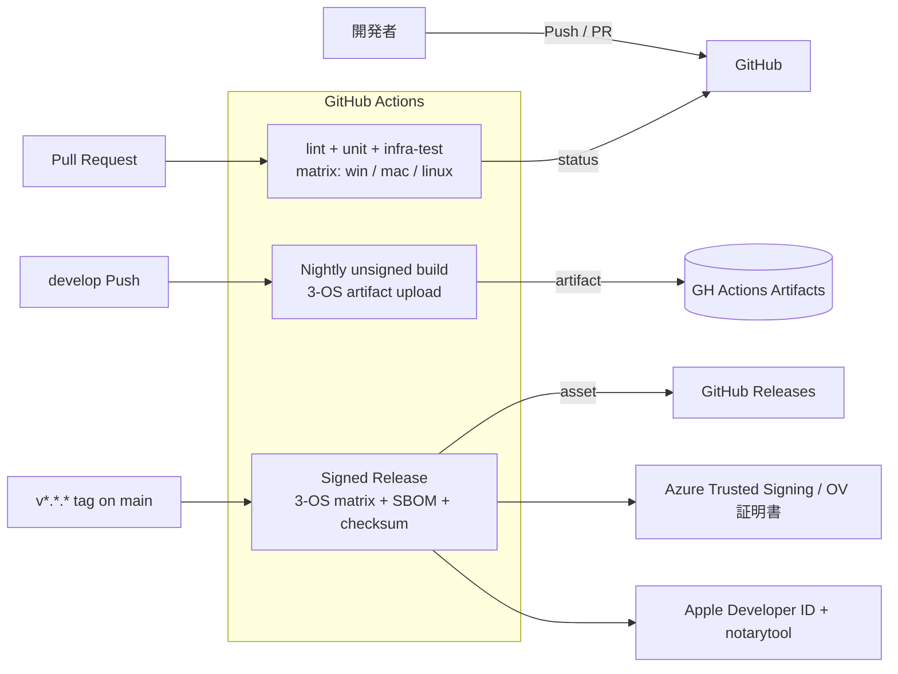
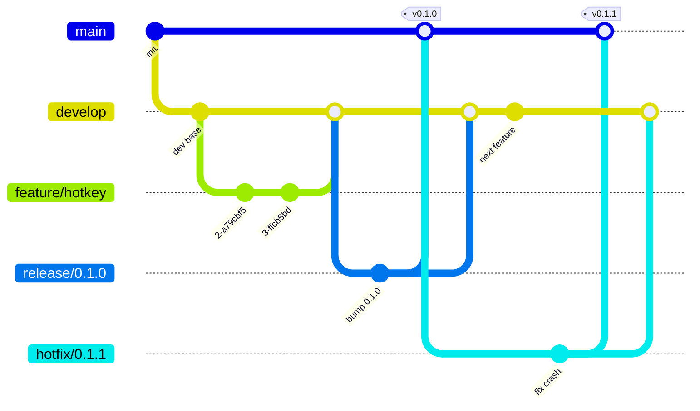

# Development / CI Environment — shikomi

## 1. 位置づけ

shikomi はクラウド「dev 環境」を持たないデスクトップ OSS のため、本ドキュメントでは **GitHub Actions 上の CI／Preview ビルド環境**を「開発環境」とみなす。本番（production.md）は署名済みリリースビルドと配布チャネルを指す。

## 2. CI/CD 全体図

## 3. ジョブ定義（責務レベル）

| ジョブ | トリガ | 役割 | OS matrix |
|-------|-------|------|----------|
| `lint` | PR / push | `cargo fmt --check`, `cargo clippy -D warnings`, `pnpm lint` | ubuntu-latest 単一（高速化） |
| `unit-core` | PR / push | `shikomi-core` ユニットテスト、`cargo nextest` | ubuntu-latest 単一（I/O なし、OS 非依存） |
| `test-infra` | PR / push | `shikomi-infra` の OS 依存テスト | Win / macOS / Ubuntu（22.04 x11 + 24.04 wayland）の matrix |
| `audit` | PR / push / nightly | `cargo-deny check`, Dependabot alerts 集約 | ubuntu-latest |
| `build-preview` | PR `labeled: preview` | 未署名の 3-OS ビルドを artifact として PR に添付 | matrix |
| `build-nightly` | 日次 cron | 未署名バイナリ、`develop` から（main は常にタグ付きリリース状態のため nightly 対象ではない） | matrix |
| `release` | タグ `v*.*.*` push（`main` への release/hotfix マージ後に付与） | 署名済み・公証済み・SBOM 付き成果物を Releases に登録 | matrix |
| `pages` | main push（`docs/` 差分時） | `mdBook` / Astro 等で設計書＆ランディングページを GitHub Pages へ | ubuntu-latest |

**Ubuntu は X11 と Wayland の両セッションでテストする**（Wayland のホットキー実装は X11 と別経路のため）。GitHub Actions の `ubuntu-24.04` は既定で Wayland セッション、`ubuntu-22.04` は X11 セッションを使える。詳細は環境差分ドキュメント（`environment-diff.md`）を参照。

## 4. 署名・秘密情報の管理

| 秘密情報 | 保管 | 参照方法 |
|---------|------|---------|
| Apple Developer ID 証明書（`.p12`） | GitHub Actions Secrets（base64 encoded） | `release` ジョブで macOS ランナーに復号→keychain import→ビルド後破棄 |
| App Store Connect API Key（notarization） | GitHub Actions Secrets | `xcrun notarytool submit --apple-id --team-id --key` |
| Windows コード署名証明書 | **Azure Trusted Signing** 経由（キーはクラウド KMS に保管、CI から OIDC で呼び出す。ローカル `.pfx` を Secrets に置く運用は避ける） | OIDC Federation → `AzureSignTool` |
| GitHub Releases PAT | 不要（`GITHUB_TOKEN` で十分） | — |

**方針**: 秘密鍵ファイルを直接 Secrets にコミットする運用は行わない。Apple は `.p12` を base64 で Secrets に置かざるを得ないが、Windows はクラウド KMS 経由に寄せる。

## 5. 依存と脆弱性の監視

- `cargo-deny` の `advisory` / `licenses` / `bans` / `sources` を全部有効化
- Dependabot: Rust (`cargo`), npm (`shikomi-gui/ui`), GitHub Actions の 3 エコシステムに対し週次
- **lock file ガード**: `cargo --locked` / `pnpm install --frozen-lockfile` は「lock 再生成の禁止」しか検知できない。Cargo.toml 無変更で lock が書き換わった PR を検知するには追加ステップが必要:
  1. CI 冒頭で `cargo --locked fetch --offline` / `pnpm install --frozen-lockfile` を実行し、lock と manifest が一致しない場合 fail
  2. **PR diff ガード**: `git diff --name-only origin/${GITHUB_BASE_REF}...HEAD`（GitFlow 上、feature PR は `develop`、release/hotfix PR は `main` が base になる）で `Cargo.lock` / `pnpm-lock.yaml` が変更されているかつ `Cargo.toml` / `shikomi-*/Cargo.toml` / `package.json` に変更がない場合、**PR ラベル `deps-lockfile-only`** の付与をマージ条件に要求。ラベルは意図的な更新（`cargo update -p <crate>` 等）である根拠を PR 本文に記載した場合のみレビュアが付与する
  3. 上記により「意図せず `cargo update` が発火して lock 全体が書換わる」事故を PR レビューで確実に止める
- CVE 検知時: Dependabot alert → Severity High 以上は `security` ラベル付 Issue 自動起票、72h 以内にトリアージ

## 6. テスト戦略

| 階層 | 対応設計書 | 実行環境 |
|-----|----------|---------|
| ユニット | `shikomi-core` の pure 関数（暗号・モデル・バリデーション） | CI ubuntu 単一 |
| 結合 | `shikomi-infra` のアダプタ（keyring mock、arboard fake、ashpd モック） | CI 3-OS matrix |
| E2E | Tauri `WebDriverIO` で GUI 操作、`expect-test` で CLI ゴールデン | CI 3-OS matrix（Linux は X11 ヘッドレス `Xvfb`） |

Wayland のホットキー portal は**対話的同意ダイアログ**が前提のため、CI では portal モック（`ashpd::backend` の test fixture）で代替する。

## 7. ブランチ戦略・保護ルール・リリース運用（GitFlow）

**方針**: **GitFlow** を採用する。shikomi は「署名付き tagged リリースの世代管理」「nightly での先行検証」「hotfix による緊急リリース」の 3 つをきれいに分離できる分岐モデルが必須で、trunk-based + release-please ではリリース前の release candidate 期間（署名・公証・キーチェーン連携の最終確認）を保持できないため GitFlow が適合する。

### 7.1 ブランチモデル

| ブランチ | 役割 | 起点 | マージ先 | 命名規則 | 生存期間 |
|---------|-----|-----|---------|---------|---------|
| `main` | **リリース済み** の唯一の真実源。各コミットはタグ付きリリースに対応 | （永続） | — | `main` | 永続 |
| `develop` | 次期リリースの統合ブランチ。全 feature がここに集約 | （永続、初期は `main` から分岐） | release → main 経由で反映 | `develop` | 永続 |
| `feature/*` | 単一機能・単一 Issue の作業ブランチ | `develop` | `develop` | `feature/{issue-number}-{slug}` または `feature/{slug}`（例: `feature/12-hotkey-registrar`） | マージ後削除 |
| `release/*` | 機能凍結後の RC 期間。バージョン bump / CHANGELOG 確定 / 署名動作確認 / 小修正のみ | `develop` | `main`（tag 付与）＋ `develop`（back-merge） | `release/{version}`（例: `release/0.1.0`、**`v` 接頭辞なし**、タグ側に `v` を付ける） | RC 完了後削除 |
| `hotfix/*` | リリース済み版への緊急修正 | `main` | `main`（tag 付与）＋ `develop`（back-merge） | `hotfix/{version}`（例: `hotfix/0.1.1`） | 修正リリース後削除 |

**設計原則との整合**:
- **Fail Fast**: `develop` は CI required checks を通らない限り他ブランチから影響を受けない。release/hotfix が `main` にマージされた瞬間 tag push が release ジョブを起動し、署名・公証失敗は即座に可視化される
- **Tell, Don't Ask**: release/hotfix の back-merge は**強制ルール**（`develop` に取り込まないと次リリースで退行する）。CI で back-merge 未実施を検知し fail させる（§7.6）
- **DRY**: Conventional Commits を 1 つの真実源として、CI・CHANGELOG・PR テンプレが全て参照する

### 7.2 ブランチ保護ルール

GitHub のブランチ保護設定は下表の通り。**include administrators = true**（管理者も規則に従う）、**force push = disabled**、**delete = disabled** は全保護ブランチ共通。

| 設定項目 | `main` | `develop` | `release/*` | `hotfix/*` |
|---------|--------|-----------|-------------|-----------|
| 直接 push | ❌ 禁止 | ❌ 禁止 | ❌ 禁止（PR 経由のみ） | ❌ 禁止（PR 経由のみ） |
| PR 必須 | ✅ | ✅ | ✅ | ✅ |
| 必須 status checks | `lint` / `unit-core` / `test-infra` / `audit` / `build-preview` / `back-merge-check` | `lint` / `unit-core` / `test-infra` / `audit` | `lint` / `unit-core` / `test-infra` / `audit` / `build-preview` | 同左 |
| 必須レビュー人数 | **2 名**（CODEOWNERS 必須） | 1 名（CODEOWNERS 必須） | 2 名（CODEOWNERS 必須） | 2 名（CODEOWNERS 必須、緊急時は 1 名＋事後レビュー） |
| PR ソース制限 | `release/*` または `hotfix/*` のみ（branch naming rule で強制） | `feature/*` / `release/*` / `hotfix/*` のみ | `develop` から作成 | `main` から作成 |
| マージ方法許可 | **merge commit のみ**（release/hotfix の分岐履歴を保持） | squash merge（feature）＋ merge commit（release/hotfix back-merge） | merge commit | merge commit |
| linear history 強制 | ❌（merge commit 必須のため） | ❌ | ❌ | ❌ |
| Conversation 解決必須 | ✅ | ✅ | ✅ | ✅ |
| Signed commits 必須 | ✅（GPG/SSH/Sigstore いずれか） | ✅ | ✅ | ✅ |
| 古い承認の再取得 | 新 commit で承認無効化 | 新 commit で承認無効化 | 新 commit で承認無効化 | 同左 |

**PR ソース制限の実現**:
- GitHub ブランチ保護ルールネイティブでは「どのブランチから PR できるか」を直接制限できない。代わりに `.github/workflows/branch-policy.yml` で PR 作成時に source branch 名を検査し、`main` への PR が `release/*` / `hotfix/*` 以外なら即 fail させる（required status check として登録）
- `develop` への直接 `feature/*` 以外の commit 流入も同様に検知

**CODEOWNERS**:
- `docs/architecture/` は設計責任者（複数名）
- `.github/` は全体オーナー
- `shikomi-core/` / `shikomi-infra/` は Rust チーム
- `shikomi-gui/` は GUI チーム
- ルート直下（`LICENSE`, `README.md`, `SECURITY.md`, `CONTRIBUTING.md`）は全体オーナー

### 7.3 リリース手順（release ブランチ）

1. **開始**: `develop` の機能が整った時点で、リリース責任者が `release/X.Y.Z` を `develop` から切る。この瞬間以降 `develop` には**次期リリース対象の feature のみマージ可**（今回のリリースには含めない）
2. **RC 作業**: `release/X.Y.Z` 上で以下のみ許可
   - ワークスペース版数の bump（`Cargo.toml` の `workspace.package.version`、`tauri.conf.json`、`package.json`）
   - `CHANGELOG.md` の確定（§7.6 の `git-cliff` により自動生成 → 人間が校正）
   - RC ビルドの署名・公証動作確認（macOS notarytool、Windows Azure Trusted Signing、Linux minisign）
   - RC で発見された bug 修正のみ（新機能は**絶対に**入れない）
3. **main への昇格**: `release/X.Y.Z` → `main` への PR を作成し、CODEOWNERS 2 名承認＋全 required checks 通過で **merge commit** マージ。直後に `vX.Y.Z` タグを付与して push（tag push が `release` ジョブを起動）
4. **back-merge**: 同じ `release/X.Y.Z` を `develop` にも merge commit で戻す。これを忘れると `develop` のバージョンが `main` より古くなり、次回 release で衝突する。§7.6 の `back-merge-check` CI で検知・強制
5. **片付け**: `release/X.Y.Z` ブランチ削除（GitHub 設定 "Automatically delete head branches" で自動化）

### 7.4 hotfix 手順

1. **開始**: `main`（= 現行リリース）でバグが報告されたら、ホットフィックス責任者が `hotfix/X.Y.(Z+1)` を `main` から切る
2. **修正作業**: `hotfix/X.Y.(Z+1)` 上でバグ修正のみ実施。バージョン bump は patch のみ
3. **main への昇格**: `hotfix/X.Y.(Z+1)` → `main` への PR を作成し、CODEOWNERS 2 名承認＋required checks 通過で **merge commit**。`vX.Y.(Z+1)` タグ付与
4. **back-merge**: 同じ hotfix を `develop` へも merge commit で戻す
5. **片付け**: ブランチ削除

**緊急時例外**: セキュリティ脆弱性（`SECURITY.md` 経由の報告）は 1 名承認＋事後レビュー可。事後レビュー期限は main マージから 72h。未実施は Issue として自動起票（`security-post-review` ラベル）

### 7.5 マージ戦略とコミット規約

| PR 種別 | ソース | 宛先 | マージ方法 | 理由 |
|--------|-------|------|----------|------|
| feature | `feature/*` | `develop` | **squash merge** | feature ブランチ内の作業コミットは履歴に残さない。PR タイトルが 1 commit のメッセージになる。Conventional Commits（例: `feat(hotkey): add Wayland portal fallback`） |
| release → main | `release/*` | `main` | **merge commit**（`--no-ff`） | 「このコミットはリリース分岐から来た」という事実を history に残す。タグと 1:1 対応 |
| release → develop | `release/*` | `develop` | **merge commit**（`--no-ff`） | 同上（back-merge 痕跡を残す） |
| hotfix → main | `hotfix/*` | `main` | **merge commit**（`--no-ff`） | 同上 |
| hotfix → develop | `hotfix/*` | `develop` | **merge commit**（`--no-ff`） | 同上 |

**Conventional Commits 必須**（§7.6 の CHANGELOG 自動化の前提）:
- `feat:` / `fix:` / `docs:` / `chore:` / `refactor:` / `test:` / `ci:` / `build:` / `perf:` のいずれか
- Breaking change は `feat!:` または `BREAKING CHANGE:` フッター
- PR 作成時に `.github/workflows/pr-title-check.yml` で PR タイトルを正規表現検証し、違反は required check fail（squash merge 時の commit メッセージとして採用されるため）

### 7.6 CHANGELOG 自動化（release-please からの移行）

**決定**: `release-please` は trunk-based 前提で GitFlow と噛み合わないため **`git-cliff` に切替**。

- `git-cliff` は Rust 製、Conventional Commits を読み、任意のリビジョン範囲で CHANGELOG を生成できる
- 設定: リポジトリ直下の `cliff.toml` にグルーピングルールを記載（`feat` → `Features`、`fix` → `Bug Fixes` 等）
- 生成タイミング:
  1. `release/*` ブランチ作成直後に `git-cliff --tag vX.Y.Z` で未リリース区間を CHANGELOG.md に確定追記
  2. 人間が release PR 上で文言校正
  3. `main` マージ＆ tag push 後、GitHub Actions が `git-cliff --current` で GitHub Release の release note を自動生成
- 出典: https://git-cliff.org/docs/configuration

**back-merge 検知 CI（`back-merge-check`）**:
- `release/*` / `hotfix/*` が `main` にマージされた後、**同じ branch を `develop` にもマージする PR が存在するか**を GitHub API で確認
- 24h 以内に back-merge PR が開かれていない場合、自動的に Issue 起票（`back-merge-missing` ラベル）し、release 担当者にアサイン
- これにより「`main` だけにマージして `develop` 退行」を Fail Fast で検知

## 8. コスト

GitHub Actions の Public リポジトリ無料枠内を想定。macOS ランナーは無料枠の倍率係数が高いため、`test-infra` は PR では `macos-latest` を通常使用し、`build-nightly` は Linux のみ毎日、macOS/Windows は週次に抑制する設計（最適化は運用開始後に調整）。

## 9. 本番との差分（コスト・スケール）

| 項目 | CI（開発） | 本番（リリース） |
|------|----------|----------------|
| 署名 | なし（preview/nightly） | あり（Developer ID、EV/OV、公証） |
| 配布 | artifact（Actions 内） | GitHub Releases + winget + Homebrew Cask + apt/rpm repo（将来） |
| SBOM | 生成するが添付任意 | 必ず添付（`*.cdx.json`） |
| ビルドフラグ | `--debug` 可 | `--release --locked`、LTO 有効、strip 済 |
