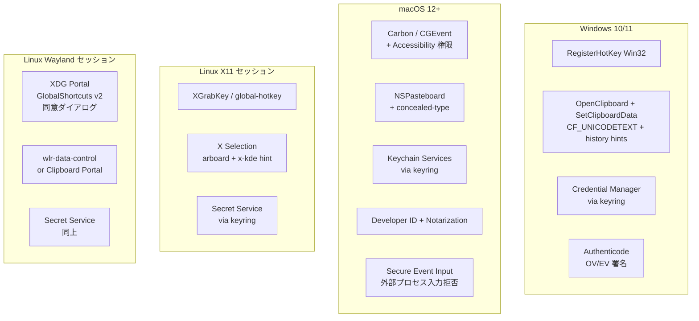

# Environment Diff — shikomi

## 1. 位置づけ

通常「ローカル / dev / prod」の差分を扱う書式だが、shikomi はクラウド環境を持たないため、主要な差分は **実行 OS 間**の差分となる。本書は下記 2 種類の差分表を含む：

- §2: **OS 間差分**（Windows / macOS / Linux-X11 / Linux-Wayland）
- §3: **Local / CI / Release 差分**（ビルド・署名・配布）

## 2. OS 間差分

### 2.1 ホットキー登録

| OS/セッション | 実装 | ユーザ同意 | 備考 |
|--------------|------|----------|------|
| Windows | `global-hotkey` / `tauri-plugin-global-shortcut`（`RegisterHotKey`） | 不要 | 衝突時は登録失敗→UI で再割当を促す |
| macOS | 同上（Carbon `RegisterEventHotKey` / `CGEventTap` の組合せ） | Accessibility + Input Monitoring 両方 | `AXIsProcessTrusted()` 判定 → 未許可なら System Settings を起動 |
| Linux X11 | 同上（`XGrabKey`） | 不要 | 複合キー衝突時は登録失敗 |
| Linux Wayland | `ashpd` v0.13 + `org.freedesktop.portal.GlobalShortcuts` v2 | compositor 側の同意ダイアログ必須 | 同意ダイアログは compositor ごとに UI が異なる |

### 2.2 クリップボード書込と sensitive hint

| OS | 使用 API / crate | sensitive hint |
|----|---------------|---------------|
| Windows | `arboard` → `SetClipboardData` + `CF_TEXT`＋以下の補助フォーマット: `CanIncludeInClipboardHistory=0`, `CanUploadToCloudClipboard=0`, `ExcludeClipboardContentFromMonitorProcessing=1` | Cloud Clipboard・履歴マネージャへの流出遮断 |
| macOS | `arboard` → `NSPasteboard` + `application/x-nspasteboard-concealed-type` | macOS 標準のクリップボード履歴非保存 |
| Linux X11 | `arboard` → X Selection + `x-kde-passwordManagerHint = "secret"` MIME | Klipper / CopyQ / wl-clipboard が履歴保持を拒否 |
| Linux Wayland | `arboard` の `wayland-data-control` feature、あるいは `Clipboard Portal` | 同上 hint を付与、Portal 経路は Flatpak/Snap サンドボックス下で必須 |

出典: KeePassXC Clipboard.cpp、KDE Phabricator D12539（§context.md §6.2）

### 2.3 入力シミュレーション（フォールバック）

| OS | 使用 crate | 制約 |
|----|---------|------|
| Windows | `enigo` (`SendInput`) | UAC 昇格アプリへは入力不可、通常アプリは可 |
| macOS | `enigo` (`CGEventPost`) | **Secure Event Input 有効時はサイレント失敗**。1Password などパスワードフォーカス中アプリ全般に及ぶ |
| Linux X11 | `enigo` (XTestFakeKeyEvent) | — |
| Linux Wayland | `enigo` の libei/experimental 実装、または compositor 固有プロトコル（`wlr-virtual-keyboard-unstable-v1` 等） | 同意ダイアログ必須・compositor 依存 |

**方針**: shikomi は「クリップボードに置くだけ」を第一モードとし、キー注入は `--paste-mode=inject` で明示的にオプトインした場合のみ使用。macOS Secure Event Input の制約を回避する魔法はない、とドキュメントに明記する。

### 2.4 キーチェーン連携

| OS | ストア | `keyring` feature |
|----|-------|------------------|
| Windows | Credential Manager（DPAPI） | `windows-native` |
| macOS | Keychain（Secure Enclave 連携可） | `apple-native` |
| Linux | Secret Service（GNOME Keyring / KWallet） | `sync-secret-service` |

### 2.5 署名・配布

| OS | 署名種別 | 公証 | 未署名時の UX |
|----|--------|------|-------------|
| Windows | Authenticode（OV / EV） | — | SmartScreen 警告「Windows によって PC が保護されました」 |
| macOS | Developer ID Application | Apple notarytool で stapled | Gatekeeper「壊れている/開発元を確認できない」 |
| Linux (AppImage/deb/rpm) | GPG detached 署名 | — | 署名検証は distro 任せ、警告はなし（代わりに checksum + minisign を併用） |

## 3. Local / CI / Release 差分

| 項目 | Local | CI（PR / Nightly） | Release（タグ） |
|------|-------|-------------------|----------------|
| ビルドフラグ | `cargo build`（debug） | `cargo build --locked`（debug + release 両方） | `cargo build --release --locked` + LTO + strip |
| コード署名（Win） | なし | なし | Azure Trusted Signing（OV） |
| 公証（Mac） | なし | なし（ビルドのみ検証） | `xcrun notarytool submit --wait` |
| Linux GPG 署名 | なし | なし | あり（Release ジョブ） |
| SBOM 生成 | 任意 | 生成するが artifact 添付任意 | 必ず添付（`*.cdx.json`） |
| テスト範囲 | ローカルの現在 OS のみ | 3-OS matrix + X11/Wayland 両セッション | 同 CI + smoke test（インストール→起動） |
| 秘密情報 | なし（ダミー vault） | なし | GitHub Actions Secrets（OIDC 優先、`.p12` は base64） |
| 配布 | しない | GH Actions artifact（PR preview / nightly） | GitHub Releases + winget + Homebrew Cask |
| クラッシュ時挙動 | パニック出力 | CI fail | ユーザ端末でローカルログ出力のみ、テレメトリ送信なし |

## 4. SLA / コスト差分

| 項目 | Local | CI | Release |
|------|-------|-----|--------|
| SLA | なし | GitHub Actions の SLA に従う | GitHub Releases の CDN SLA に従う（アプリ単独では保証なし） |
| コスト | $0 | Public リポで無料枠内、macOS は倍率係数を考慮し週次へ寄せる | 署名証明書年額（OV 約 $100–300／EV 約 $300–700／Apple Developer $99／年）＋ GitHub 無料枠 |
| スケール | 1 開発者 | concurrency 5 並列想定 | 配布は GitHub CDN に委譲、スケール懸念なし |
| セキュリティ境界 | 開発者マシン内 | OIDC Federation（Azure）＋ base64 Secrets（Apple） | エンドユーザ端末の OS 境界に依存 |
| バックアップ | なし | GH Actions 履歴 90 日保持 | Releases 永続、ソースは Git 履歴 |
| モニタリング | なし | CI ダッシュボード（Actions UI） | 該当なし — クライアントテレメトリなし方針 |

## 5. 該当なし項目

| 項目 | 理由 |
|------|------|
| dev / staging / prod のクラウド 3 面 | サーバコンポーネントなし。代わりに OS 間・ビルドフェーズ間を差分として扱う |
| Multi-AZ / マルチリージョン | サーバなし |
| VPC Endpoint / fck-nat | サーバなし |
| DNS 切替（dev.shikomi / stg.shikomi） | サーバなし、公式サイトは単一の GitHub Pages を想定 |
