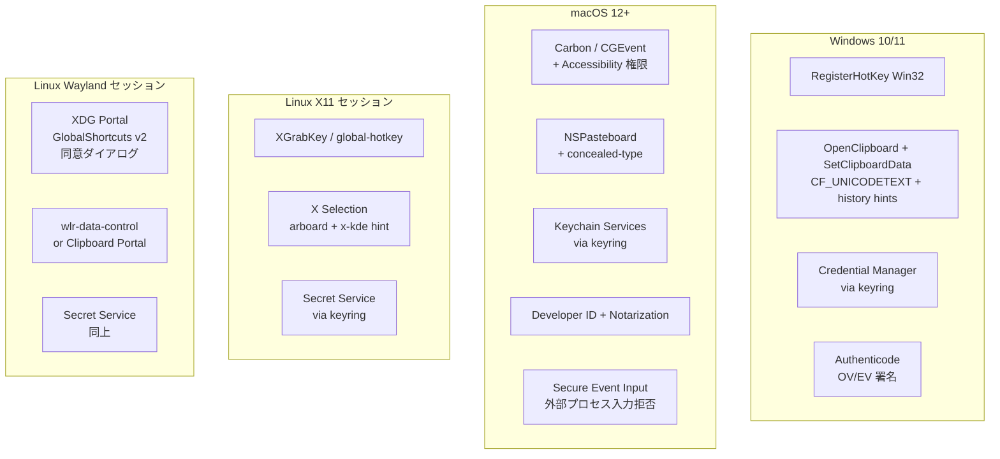
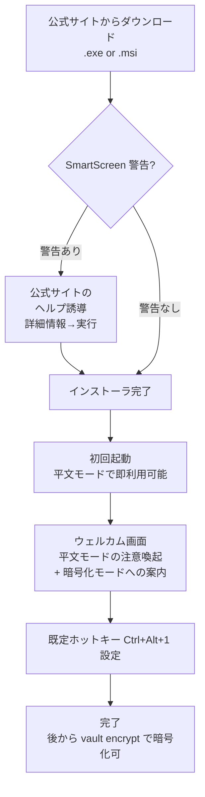
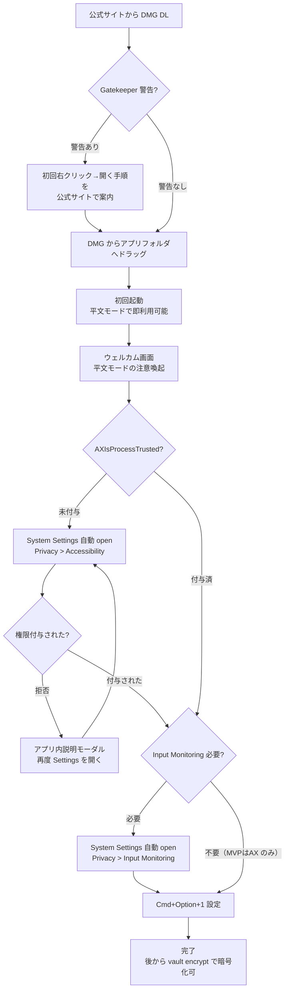
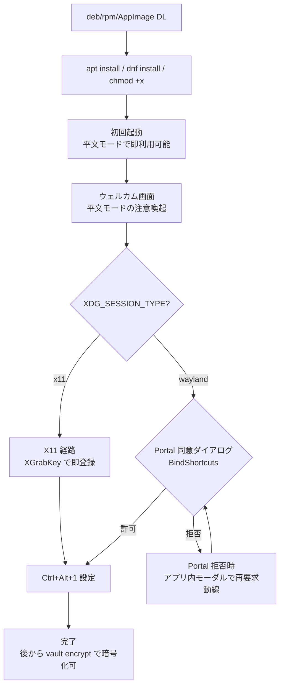

# Environment Diff — shikomi

## 1. 位置づけ

通常「ローカル / dev / prod」の差分を扱う書式だが、shikomi はクラウド環境を持たないため、主要な差分は **実行 OS 間**の差分となる。本書は下記 2 種類の差分表を含む：

- §2: **OS 間差分**（Windows / macOS / Linux-X11 / Linux-Wayland）
- §3: **Local / CI / Release 差分**（ビルド・署名・配布）

## 2. OS 間差分



### 2.1 ホットキー登録

| OS/セッション | 実装 | ユーザ同意 | 備考 |
|--------------|------|----------|------|
| Windows | `global-hotkey` / `tauri-plugin-global-shortcut`（`RegisterHotKey`） | 不要 | 衝突時は登録失敗→UI で再割当を促す |
| macOS | 同上（Carbon `RegisterEventHotKey` / `CGEventTap` の組合せ） | Accessibility + Input Monitoring 両方 | `AXIsProcessTrusted()` 判定 → 未許可なら System Settings を起動 |
| Linux X11 | 同上（`XGrabKey`） | 不要 | 複合キー衝突時は登録失敗 |
| Linux Wayland | `ashpd` v0.13 + `org.freedesktop.portal.GlobalShortcuts` v2 | compositor 側の同意ダイアログ必須 | 同意ダイアログは compositor ごとに UI が異なる |

### 2.2 クリップボード書込と sensitive hint

| OS | 使用 API / crate | sensitive hint |
|----|---------------|---------------|
| Windows | `arboard` → `SetClipboardData` + `CF_TEXT`＋以下の補助フォーマット: `CanIncludeInClipboardHistory=0`, `CanUploadToCloudClipboard=0`, `ExcludeClipboardContentFromMonitorProcessing=1` | Cloud Clipboard・履歴マネージャへの流出遮断 |
| macOS | `arboard` → `NSPasteboard` + `application/x-nspasteboard-concealed-type` | macOS 標準のクリップボード履歴非保存 |
| Linux X11 | `arboard` → X Selection + `x-kde-passwordManagerHint = "secret"` MIME | Klipper / CopyQ が履歴保持を拒否（X11 対応クリップボードマネージャのみ、wl-clipboard は Wayland 専用のため X11 経路とは無関係） |
| Linux Wayland | `arboard` の `wayland-data-control` feature、あるいは `Clipboard Portal` | 同上 hint を付与、Portal 経路は Flatpak/Snap サンドボックス下で必須 |

出典: KeePassXC Clipboard.cpp、KDE Phabricator D12539（`context/threat-model.md` §8.2）

### 2.3 入力シミュレーション（フォールバック）

| OS | 使用 crate | 制約 |
|----|---------|------|
| Windows | `enigo` (`SendInput`) | UAC 昇格アプリへは入力不可、通常アプリは可 |
| macOS | `enigo` (`CGEventPost`) | **Secure Event Input 有効時はサイレント失敗**。1Password などパスワードフォーカス中アプリ全般に及ぶ |
| Linux X11 | `enigo` (XTestFakeKeyEvent) | — |
| Linux Wayland | `enigo` の libei/experimental 実装、または compositor 固有プロトコル（`wlr-virtual-keyboard-unstable-v1` 等） | 同意ダイアログ必須・compositor 依存 |

**方針**: shikomi は「クリップボードに置くだけ」を第一モードとし、キー注入は `--paste-mode=inject` で明示的にオプトインした場合のみ使用。macOS Secure Event Input の制約を回避する魔法はない、とドキュメントに明記する。

### 2.4 キーチェーン連携

| OS | ストア | `keyring` feature |
|----|-------|------------------|
| Windows | Credential Manager（DPAPI） | `windows-native` |
| macOS | Keychain（Secure Enclave 連携可） | `apple-native` |
| Linux | Secret Service（GNOME Keyring / KWallet） | `sync-secret-service` |

### 2.5 署名・配布

| OS | 署名種別 | 公証 | 未署名時の UX |
|----|--------|------|-------------|
| Windows | Authenticode（OV / EV） | — | SmartScreen 警告「Windows によって PC が保護されました」 |
| macOS | Developer ID Application | Apple notarytool で stapled | Gatekeeper「壊れている/開発元を確認できない」 |
| Linux (AppImage/deb/rpm) | GPG detached 署名 | — | 署名検証は distro 任せ、警告はなし（代わりに checksum + minisign を併用） |

## 3. Local / CI / Release 差分

| 項目 | Local | CI（PR / Nightly） | Release（タグ） |
|------|-------|-------------------|----------------|
| ビルドフラグ | `cargo build`（debug） | `cargo build --locked`（debug + release 両方） | `cargo build --release --locked` + LTO + strip |
| コード署名（Win） | なし | なし | Azure Trusted Signing（OV） |
| 公証（Mac） | なし | なし（ビルドのみ検証） | `xcrun notarytool submit --wait` |
| Linux GPG 署名 | なし | なし | あり（Release ジョブ） |
| SBOM 生成 | 任意 | 生成するが artifact 添付任意 | 必ず添付（`*.cdx.json`） |
| テスト範囲 | ローカルの現在 OS のみ | 3-OS matrix + X11/Wayland 両セッション | 同 CI + smoke test（インストール→起動） |
| 秘密情報 | なし（ダミー vault） | なし | GitHub Actions Secrets（OIDC 優先、`.p12` は base64） |
| 配布 | しない | GH Actions artifact（PR preview / nightly） | GitHub Releases + winget + Homebrew Cask |
| クラッシュ時挙動 | パニック出力 | CI fail | ユーザ端末でローカルログ出力のみ、テレメトリ送信なし |

## 4. SLA / コスト差分

| 項目 | Local | CI | Release |
|------|-------|-----|--------|
| SLA | なし | GitHub Actions の SLA に従う | GitHub Releases の CDN SLA に従う（アプリ単独では保証なし） |
| コスト | $0 | Public リポで無料枠内、macOS は倍率係数を考慮し週次へ寄せる | 署名証明書年額（OV 約 $100–300／EV 約 $300–700／Apple Developer $99／年）＋ GitHub 無料枠 |
| スケール | 1 開発者 | concurrency 5 並列想定 | 配布は GitHub CDN に委譲、スケール懸念なし |
| セキュリティ境界 | 開発者マシン内 | OIDC Federation（Azure）＋ base64 Secrets（Apple） | エンドユーザ端末の OS 境界に依存 |
| バックアップ | なし | GH Actions 履歴 90 日保持 | Releases 永続、ソースは Git 履歴 |
| モニタリング | なし | CI ダッシュボード（Actions UI） | 該当なし — クライアントテレメトリなし方針 |

## 5. 初回セットアップ UX フロー（OS 別）

本書では UX の骨格を示し、画面遷移・文言・ワイヤーフレームは後続 feature `onboarding` の `requirements.md` / `basic-design.md` で具体化する。ここでは OS 差分とエッジケースの網羅性を担保する。

### 5.1 Windows 初回起動フロー



**注意点**:
- **デフォルトは平文モード**。マスターパスワード・リカバリコードのセットアップは初回フローに**含めない**（ペルソナ A/C のオンボーディング障壁を最小化）
- ウェルカム画面で「現在は平文モードです。機密情報を扱う場合は `shikomi vault encrypt` で暗号化モードへ切替できます」を必ず表示（スキップ可、ただし隠さない）
- 暗号化モード移行フローは §5.5 に別立て
- SmartScreen 警告時の UX は**アプリ側では介入不能**（インストール前のため）。配布側（公式サイト・README・DMG 同梱 README）のみで対応（`production.md` §4.2）
- 管理者権限は不要。ユーザ権限のみでインストール可能（`%LOCALAPPDATA%\shikomi\`）

### 5.2 macOS 初回起動フロー



**権限要求の段階設計**:
- **MVP ではクリップボード投入のみを主モード**とし、キー注入フォールバック（`--paste-mode=inject`）は後続 feature でオプトイン化する。従って MVP の初回フローで必須なのは **Accessibility（ホットキー購読用）のみ**
- **Input Monitoring は後続 feature 時に追加モーダルで要求**し、要求タイミングを明示（権限取得は「機能を使おうとしたとき」に遅延、オンボーディングを軽くする）
- 権限拒否時のリカバリー: アプリ再起動後も初期化済み vault は保持、起動時に「権限未付与」バナーを常時表示し、タップで Settings に飛ぶ動線を維持
- **Secure Event Input 下のサイレント失敗**: キー注入モード有効時、macOS で `IsSecureEventInputEnabled()` を呼び、`true` ならその旨をユーザに通知してクリップボード投入にフォールバック（ログと UI 両方で明示、Fail Fast / Fail Transparent）

### 5.3 Linux 初回起動フロー



**注意点**:
- Wayland の `BindShortcuts` は compositor 側 UI を経由するため、**compositor により見た目が異なる**（GNOME / KDE / sway / Hyprland 等）。アプリ側は「compositor の同意画面を見てください」と誘導
- Portal が利用不可な compositor（存在する）では明示エラー表示（「非対応 compositor です」）し fail fast

### 5.4 全 OS 共通のリカバリー UX

| シナリオ | 平文モード（デフォルト）の対応 | 暗号化モード（オプトイン）の対応 |
|---------|--------------------------|--------------------------|
| マスターパスワード忘れ | 該当なし — 平文モードにはパスワードがない | 作成時に発行した **BIP-39 24 語リカバリコード**を入力 → VEK を復元し、直後に新マスターパスワードを設定（詳細は `production.md` §7.2.2 / `tech-stack.md` §2.4）。マスターパスワード**と**リカバリコード**両方**を失った場合のみ復旧不能 |
| リカバリコード入力画面への到達手段 | 該当なし | CLI `shikomi unlock --recovery` / GUI 初期画面「パスワードをお忘れですか？」リンクから遷移 |
| vault ファイル破損（atomic write の `.new` 残存等） | 起動時に検出 → リカバリ UI（バックアップからの復元・新規作成） | 同左 + AEAD タグ失敗時の `fail fast` |
| 権限喪失（macOS Settings で切られた） | 起動時バナー + タップで Settings へ | 同左 |
| VEK キャッシュが突然切れた（スクリーンロック連動） | 該当なし（VEK そのものがない） | 次のホットキー押下時に通知 + マスターパスワード再入力モーダル（daemon は常駐、GUI/CLI 不要でロック画面風モーダル表示） |

### 5.5 暗号化モードへのオプトイン移行フロー（全 OS 共通）

```mermaid
flowchart TB
    Trigger[ユーザ操作: GUI「vault 保護を有効化」<br/>または CLI: shikomi vault encrypt]
    Warn[警告モーダル:<br/>パスワード失念 + リカバリコード紛失 = 復旧不能<br/>紙保管の必要性]
    PwSet[マスターパスワード作成<br/>強度メータで OWASP 最低要件確認]
    Argon[Argon2id 計算<br/>~1 秒]
    RecoveryGen[BIP-39 24 語生成<br/>画面フル表示 + 印刷ボタン]
    RecoveryConfirm[転記確認画面<br/>3 語ランダム抜き打ち入力で確認]
    Migrate[全レコードを VEK で暗号化<br/>atomic write で .new → rename]
    Done[暗号化モード有効<br/>CLI プロンプト / GUI バッジで [encrypted] 表示]

    Trigger --> Warn --> PwSet --> Argon --> RecoveryGen --> RecoveryConfirm
    RecoveryConfirm -- 失敗 --> RecoveryGen
    RecoveryConfirm -- 成功 --> Migrate --> Done
```

**設計ポイント**:
- **警告モーダルのスキップは不可**（Fail Visible）。ユーザが「復旧不能の可能性」を必ず読むフローにする
- リカバリコード転記確認は 24 語中ランダム 3 語の抜き打ち入力（全 24 語入力は UX 負荷過大、0 語は確認の意味がない、3 語は中庸）
- 移行中のクラッシュ耐性: atomic write により `.new` が残存した場合は起動時に検出し、「暗号化移行が中断しました。継続しますか？」のリカバリ UI を提示
- 逆方向（暗号化 → 平文）も `shikomi vault decrypt` で提供。警告モーダル（「暗号保護がなくなります」）＋ マスターパスワード再認証を必須化

## 6. 該当なし項目

| 項目 | 理由 |
|------|------|
| dev / staging / prod のクラウド 3 面 | サーバコンポーネントなし。代わりに OS 間・ビルドフェーズ間を差分として扱う |
| Multi-AZ / マルチリージョン | サーバなし |
| VPC Endpoint / fck-nat | サーバなし |
| DNS 切替（dev.shikomi / stg.shikomi） | サーバなし、公式サイトは単一の GitHub Pages を想定 |

## 7. 参考一次情報（§5 UX フロー）

- macOS System Settings URL scheme（`x-apple.systempreferences:com.apple.preference.security?Privacy_Accessibility`）: https://developer.apple.com/documentation/devicemanagement/systempreferences
- `AXIsProcessTrusted` / `AXIsProcessTrustedWithOptions`: https://developer.apple.com/documentation/applicationservices/1462089-axisprocesstrusted
- Apple TN2150（Secure Event Input）: https://developer.apple.com/library/archive/technotes/tn2150/_index.html
- XDG Desktop Portal GlobalShortcuts v2: https://flatpak.github.io/xdg-desktop-portal/docs/doc-org.freedesktop.portal.GlobalShortcuts.html
- BIP-39（暗号化モード時のリカバリコード）: https://github.com/bitcoin/bips/blob/master/bip-0039.mediawiki
