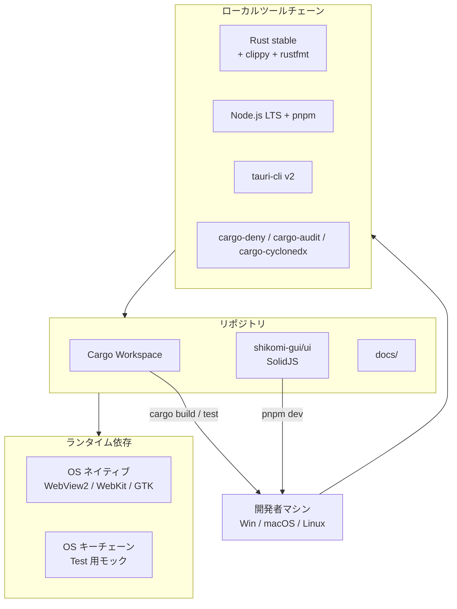

# Local Development Environment — shikomi

## 1. 前提

shikomi はデスクトップアプリであり、ローカル開発はコントリビュータの手元 OS 上で直接行う。コンテナ化はしない（GUI のクロスプラットフォームテストが目的なので、ホスト OS 上で動かすことに価値がある）。

## 2. ローカル環境構成図

## 3. 開発者セットアップ手順

### 3.1 共通
- Rust stable（`rustup` 経由）: `clippy`, `rustfmt` コンポーネント同梱
- Node.js LTS + `pnpm`（GUI フロント用、Tauri v2 公式ドキュメントで推奨）
- Tauri CLI v2: `cargo install tauri-cli --version '^2.0'`
- `cargo-deny`, `cargo-audit`, `cargo-cyclonedx`, `cargo-nextest`（CI と同一ツール）
- `pre-commit` フック: `rustfmt --check` / `clippy -D warnings` / `cargo-deny check` / SECRET 検知（`gitleaks`）

### 3.2 OS 別必須依存

| OS | 追加依存 | 備考 |
|----|---------|------|
| Windows 10/11 | Microsoft Edge WebView2 Runtime、Visual Studio Build Tools（MSVC） | WebView2 は Win11 標準搭載、Win10 はインストール必要 |
| macOS 12+ | Xcode Command Line Tools（WebKit 同梱） | Apple Silicon / Intel 両対応。Universal Binary は `rustup target add aarch64-apple-darwin x86_64-apple-darwin` |
| Ubuntu 22.04+ / Debian 12+ | `libwebkit2gtk-4.1-dev`, `libgtk-3-dev`, `libayatana-appindicator3-dev`, `librsvg2-dev`, `libxdo-dev`（入力シミュレーション）, `libdbus-1-dev`（ashpd） | 公式 `apt` で取得可能 |
| Fedora 40+ | `webkit2gtk4.1-devel`, `gtk3-devel`, `libappindicator-gtk3-devel`, `librsvg2-devel`, `libxdo-devel` | `dnf` |

Tauri v2 公式の prerequisites ドキュメントに従う: https://v2.tauri.app/start/prerequisites/

### 3.3 Linux セッション種別の確認

開発者は `XDG_SESSION_TYPE` 環境変数で現在セッションを確認する（`x11` または `wayland`）。shikomi は両方で動作検証が必要なため、Ubuntu 22.04+ の開発者は GDM のログイン画面で X11/Wayland を切替えて最低 1 度ずつ smoke test を実施する。

## 4. ビルド・起動フロー

| ステップ | コマンド（代表例） | 所要目安 |
|---------|-----------------|---------|
| コアのユニットテスト | `cargo nextest run -p shikomi-core` | 1 秒 |
| ワークスペース全体ビルド | `cargo build --workspace` | 初回 3〜5 分、以降 10 秒 |
| CLI 実行 | `cargo run -p shikomi-cli -- add "hello"` | — |
| GUI 開発サーバ | `cargo tauri dev`（`shikomi-gui/` 内） | フロント HMR 対応 |
| GUI 本番ビルド検証 | `cargo tauri build` | 2〜5 分、インストーラまで生成 |
| リント | `cargo clippy --workspace --all-targets -- -D warnings` | 30 秒 |
| フォーマット確認 | `cargo fmt --all --check` | 1 秒 |
| 依存監査 | `cargo deny check` | 5 秒 |

具体的なコマンドは `CONTRIBUTING.md` および `Makefile` / `justfile` に記載（本設計書では運用方針のみ定義し、具体コマンドはリポジトリの実ファイルに書く＝二重管理防止）。

## 5. テストデータ・機密情報の扱い

- **実パスワードをコミットしない**。`gitleaks` を pre-commit で必須化
- ユニットテスト用の vault は `tests/fixtures/` にダミー値のみで作成
- 開発中の vault は `$XDG_CONFIG_HOME/shikomi/` / `~/Library/Application Support/shikomi/` / `%APPDATA%\shikomi\` に配置（OS 標準位置、`dirs` crate で解決）
- 開発用 vault は `.gitignore` で全除外

## 6. デバッグビルドでの安全弁

- `--debug` ビルドでは**クリップボードへの書込前に標準出力へ値をプレビュー出力しない**（開発時の事故防止。ログは `tracing` の `Debug` レベル以下は `secrecy::SecretString` の `Debug` 実装でマスクされる）
- ホットキー常駐デーモンはデバッグビルド時に**プロセスタイトルに `[DEBUG]` プレフィックス**を付与、トレイアイコンを警告色に切り替え

## 7. 当面の割り切り

- Windows / macOS の署名は**ローカルでは実施しない**（CI のみ）。ローカルビルドは未署名で OS が警告を出す前提
- Linux の Flatpak/Snap 対応はローカル開発では不要（MVP スコープ外）
