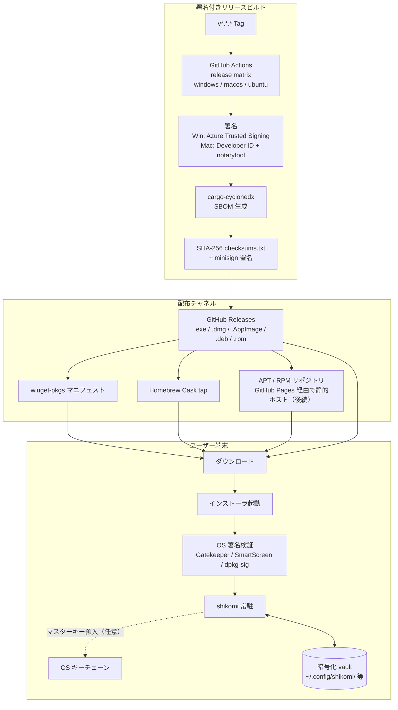
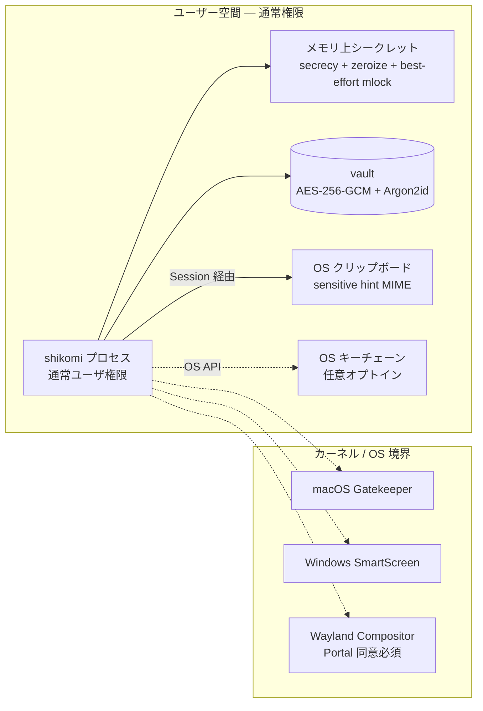

# Production / Distribution Environment — shikomi

## 1. 位置づけ

「本番」はサーバ環境ではなく、**エンドユーザの手元で実行される署名済みバイナリ**と、そこに至る配布経路すべてを指す。外部レビューで最も厳しく評価される項目は「技術知識不要でインストールできる UX」「パスワード扱いに耐えるセキュリティ境界」「署名と改竄検出」の 3 点である。

## 2. 配布アーキテクチャ全景

## 3. 配布物一覧（成果物 SKU）

| OS | 成果物 | 署名 | 公証 | 配布チャネル |
|----|-------|------|------|-------------|
| Windows x64 | `shikomi-{ver}-x64-setup.exe`（NSIS） | OV 以上 | — | GitHub Releases / winget |
| Windows x64 | `shikomi-{ver}-x64.msi` | OV 以上 | — | GitHub Releases / winget |
| macOS Universal | `shikomi-{ver}-universal.dmg` | Developer ID Application | notarytool で stapled | GitHub Releases / Homebrew Cask |
| Linux x86_64 | `shikomi-{ver}-x86_64.AppImage` | GPG (detached `.asc`) | — | GitHub Releases |
| Linux x86_64 | `shikomi_{ver}_amd64.deb` | GPG + `dpkg-sig` | — | GitHub Releases（将来 apt repo） |
| Linux x86_64 | `shikomi-{ver}-1.x86_64.rpm` | GPG（`rpmsign`） | — | GitHub Releases（将来 rpm repo） |
| 全 OS | `shikomi-{ver}-sbom.cdx.json` | — | — | GitHub Releases |
| 全 OS | `checksums.txt` + `checksums.txt.minisig` | minisign | — | GitHub Releases |

aarch64（Apple Silicon ネイティブ・Linux ARM64）は Universal DMG と将来リリースで対応。Windows arm64 は MVP スコープ外。

## 4. セキュリティ境界

### 4.1 境界ごとの保護

| 境界 | 保護 | 検出 |
|-----|------|------|
| インストーラ → OS | OS 署名（Developer ID / Authenticode）＋ SHA-256 checksum + minisign | 改竄時は OS が起動拒否 |
| プロセス → vault ファイル | AES-256-GCM の認証タグ | 改竄時は `fail fast` でアプリ起動中断、ユーザへ警告 |
| プロセス → クリップボード | sensitive hint MIME（Win: `CanIncludeInClipboardHistory=0` 等 / KDE: `x-kde-passwordManagerHint=secret` / macOS: `application/x-nspasteboard-concealed-type`）＋ タイマー自動クリア | — |
| プロセス → OS キーチェーン | `keyring` crate 経由、デフォルトオフ | — |
| 他プロセス → shikomi | 同ユーザ権限内では OS 側保護は弱い（Wayland は compositor が制限、X11/macOS/Win は同ユーザプロセス間で可視） | メモリ保護は best-effort、残存リスクを SECURITY.md に明記 |

## 5. 更新・チャネル

| 項目 | 方針 |
|------|------|
| 更新通知 | Tauri v2 の `tauri-plugin-updater` を組み込み。`latest.json` を GitHub Releases に配置、minisign で署名、クライアントで検証 |
| 署名鍵 | minisign キーは CI Secrets（公開鍵はアプリにバンドル）。compromised 時はアプリ内で更新停止する kill switch を設計 |
| チャネル | `stable`（デフォルト）/ `beta`（オプトイン、pre-release タグで配信）。`nightly` は配布しない（internal artifact のみ） |
| ロールバック | GitHub Releases の旧バージョンも保持、ユーザは手動ダウングレード可能 |

**注意**: `tauri-plugin-updater` のエンドポイントとして GitHub Releases の `latest.json` を直接指す構成は、CDN としての可用性は GitHub に委譲する。将来的に配信専用 CDN（Cloudflare R2 等）へ移す余地を残す。

## 6. 冗長性・SLA（該当なし／該当あり）

| 項目 | 判定 | 説明 |
|------|------|------|
| サーバ冗長性 | 該当なし — サーバコンポーネントなし | 配布チャネル（GitHub）の SLA に委譲 |
| 自動フェイルオーバ | 該当なし | 同上 |
| Multi-AZ | 該当なし | 同上 |
| クライアント側データ冗長性 | 該当あり | vault は export/import でユーザが手動バックアップ可能。クラウド同期は MVP 対象外（ユーザ自身の Drive/S3 等に export ファイルを置くことを想定） |
| 更新サーバ（GitHub Releases）障害時 | 該当あり | アプリは更新チェック失敗で継続動作、次回起動時に再試行。障害通知は STATUS ページ（GitHub Status）へリンクのみ |

## 7. バックアップ・リカバリ

- **vault バックアップ**: ユーザ手動 export（`shikomi export --output <path>`）。暗号化状態のまま書き出す
- **マスターパスワード喪失時**: 復旧不能（設計上の仕様、README / SECURITY.md に明記）。export 時に紙での記録を UI で警告
- **vault 破損時**: 認証タグ失敗で起動をブロックし、バックアップからの復元を促す

## 8. モニタリング・ログ

- **クラッシュレポート**: MVP では**無し**。ユーザのローカルファイルへクラッシュダンプを保存するのみ（opt-in でのみ `sentry-rust` を検討）
- **テレメトリ**: 既定で**一切送信しない**。パスワードマネージャ類似ツールがテレメトリを送ることへの OSS コミュニティの忌避感を尊重
- **ログ**: `tracing` で OS 標準ログディレクトリへローテート書込（既定 `warn` 以上、`--verbose` で引き上げ）。`secrecy` でシークレットは自動マスク

## 9. インシデント対応

- `SECURITY.md` に脆弱性報告窓口（GitHub Security Advisories + security@shikomi.dev 将来）を明記
- 秘密鍵（コード署名・minisign・GPG）漏洩時は証明書失効 → kill switch 発動 → 新鍵で再リリース、旧バイナリは Releases で明示非推奨化
- CVE 開示は `cargo-deny` + Dependabot の結果を週次で SECURITY.md / CHANGELOG に反映

## 10. 法的・OSS 要件

- ライセンス: **MIT**
- 依存ライセンス監査: `cargo-deny licenses` で MIT / Apache-2.0 / BSD / ISC / MPL-2.0 のみ許可。GPL は `bans` で拒否（LGPL-3.0-only のダイナミックリンクは個別検討）
- サードパーティライセンス表示: Tauri の `cargo-about` / `tauri-plugin-log` 連携で `Licenses.txt` をバンドル

## 11. 該当なし項目（本番要素のうち不要なもの）

| 項目 | 理由 |
|------|------|
| VPC / Subnet / AZ / IAM 境界 | サーバインフラなし |
| ALB / CloudFront / Route 53 | 同上（GitHub Pages と GitHub Releases CDN に委譲） |
| RDS / DynamoDB バックアップ | ローカル SQLite のみ |
| SES メール送信 | アプリからメール送信しない |
| CloudWatch / Datadog | サーバなし、クライアント側テレメトリはゼロ方針 |
