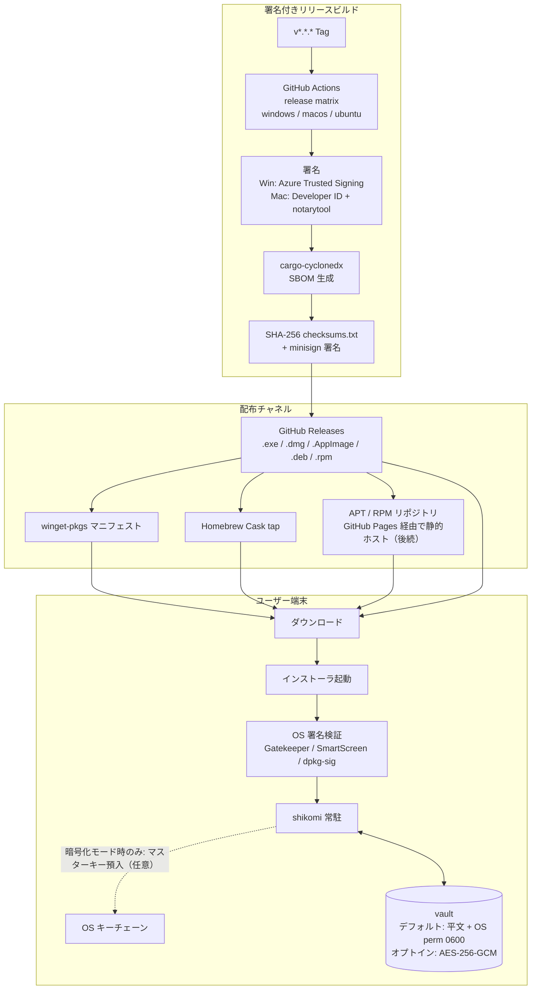
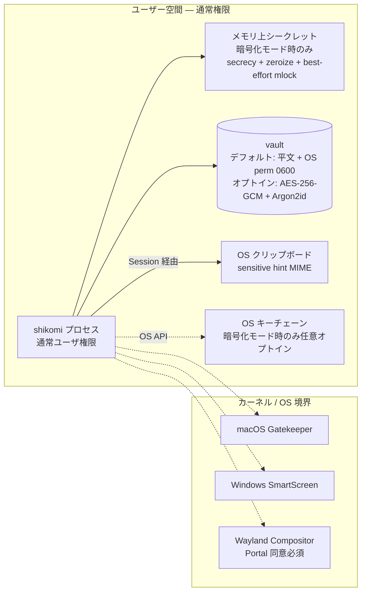

# Production / Distribution Environment — shikomi

## 1. 位置づけ

「本番」はサーバ環境ではなく、**エンドユーザの手元で実行される署名済みバイナリ**と、そこに至る配布経路すべてを指す。外部レビューで最も厳しく評価される項目は「技術知識不要でインストールできる UX」「パスワード扱いに耐えるセキュリティ境界」「署名と改竄検出」の 3 点である。

## 2. 配布アーキテクチャ全景

## 3. 配布物一覧（成果物 SKU）

| OS | 成果物 | 署名 | 公証 | 配布チャネル |
|----|-------|------|------|-------------|
| Windows x64 | `shikomi-{ver}-x64-setup.exe`（NSIS） | OV 以上 | — | GitHub Releases / winget |
| Windows x64 | `shikomi-{ver}-x64.msi` | OV 以上 | — | GitHub Releases / winget |
| macOS Universal | `shikomi-{ver}-universal.dmg` | Developer ID Application | notarytool で stapled | GitHub Releases / Homebrew Cask |
| Linux x86_64 | `shikomi-{ver}-x86_64.AppImage` | GPG (detached `.asc`) | — | GitHub Releases |
| Linux x86_64 | `shikomi_{ver}_amd64.deb` | GPG + `dpkg-sig` | — | GitHub Releases（将来 apt repo） |
| Linux x86_64 | `shikomi-{ver}-1.x86_64.rpm` | GPG（`rpmsign`） | — | GitHub Releases（将来 rpm repo） |
| 全 OS | `shikomi-{ver}-sbom.cdx.json` | — | — | GitHub Releases |
| 全 OS | `checksums.txt` + `checksums.txt.minisig` | minisign | — | GitHub Releases |

aarch64（Apple Silicon ネイティブ・Linux ARM64）は Universal DMG と将来リリースで対応。Windows arm64 は MVP スコープ外。

## 4. セキュリティ境界

### 4.1 境界ごとの保護

| 境界 | 保護 | 検出 |
|-----|------|------|
| インストーラ → OS | OS 署名（Developer ID / Authenticode）＋ SHA-256 checksum + minisign | 改竄時は OS が起動拒否 |
| プロセス → vault ファイル（**平文モード・デフォルト**） | OS ファイルパーミッション `0600`（Unix）/ 所有者 ACL（Windows）+ ディレクトリ `0700`。書込は **atomic write**（`.new` → `fsync` → `rename` / `ReplaceFileW`） | OS パーミッション突破・同ユーザ他プロセスによる読取は**検出不能**（vault は平文）。**ユーザ自己責任として `context/threat-model.md` §7.0 で明示** |
| プロセス → vault ファイル（**暗号化モード・オプトイン**） | AES-256-GCM の認証タグ + レコード AAD（レコード ID + version + 作成日時）。書込は atomic write（同上） | 改竄時は AEAD タグ検証失敗で `fail fast`、`.new` 残存は起動時にリカバリ UI へ誘導 |
| プロセス → クリップボード | sensitive hint MIME（Win: `CanIncludeInClipboardHistory=0` 等 / KDE: `x-kde-passwordManagerHint=secret` / macOS: `application/x-nspasteboard-concealed-type`）＋ タイマー自動クリア（既定 30 秒、`context/threat-model.md` §7.2） | — |
| プロセス → OS キーチェーン | 暗号化モード時のみ利用可能、`keyring` crate 経由、デフォルトオフ | — |
| daemon ↔ CLI/GUI (IPC) | UDS `0700` / Named Pipe SDDL + ピア UID 検証 + セッショントークン（`context/process-model.md` §4.2） | 不正接続は即切断、`tracing::warn!` |
| 他プロセス → shikomi | 同ユーザ権限内では OS 側保護は弱い（Wayland は compositor が制限、X11/macOS/Win は同ユーザプロセス間で可視）。**平文モードでは vault 直読みを阻止できない**、暗号化モードなら AEAD で保護 | メモリ保護は best-effort、残存リスクを SECURITY.md / `context/threat-model.md` §7.0 に明記 |

### 4.2 初回インストール警告への対応方針（非技術者向け UX）

**課題**: ペルソナ C（佐々木）のように、SmartScreen / Gatekeeper の警告ダイアログで怯んでインストールを中断する層が最大のリスク。署名・公証を全 OS で行っても、未登録評判の初期は OV 署名の SmartScreen 警告や macOS 初回起動警告は避けられない。

**方針**: 「警告は出る前提で、出た時のガイドを完備する」

| OS | 警告発生条件 | アプリ側対応 | 配布側対応 |
|----|-----------|-----------|-----------|
| Windows (OV 署名期間中) | SmartScreen reputation 未蓄積時に「Windows によって PC が保護されました」 | — | **公式サイトのインストール手順に警告ダイアログのスクリーンショット + 「詳細情報 → 実行」手順を明記**、警告回避のために EV 証明書移行を評判蓄積後に検討（`tech-stack.md` §2.2） |
| Windows (署名なしビルドが流通した場合) | "unknown publisher" | **そもそも署名なしは Release では配布しない**（CI でガード） | 配布しない |
| macOS (初回起動) | Gatekeeper「インターネットからダウンロードされたアプリケーション」 | 初回起動時に Finder 右クリック→「開く」の手順を **アプリ内ヘルプではなく公式サイトに誘導**（まだアプリが起動していないため、アプリ内誘導は不可能） | DMG に README.txt を同梱し、警告時の対処 1 文を明記 |
| macOS (未公証配布の誤流通) | 「壊れているため開けません」 | — | **未公証バイナリは Release に上げない**（CI の `notarize` ステップが失敗したらタグを reject） |
| Linux | 署名検証は distro 依存、通常はユーザが `gpg --verify` | — | `checksums.txt` + minisign 公開鍵を GitHub Releases に掲載、コマンド例を README で明示 |

**公式サイトのトラブルシュート導線**（`https://shikomi.dev/install/` を GitHub Pages に構築想定）:
- 「ダウンロードしたけど警告が出た」の FAQ を最上段に配置
- OS 別タブで **実際の警告ダイアログのスクリーンショット + 赤枠で次に押すボタンをハイライト**
- 「警告が怖い」層向けに「なぜこの警告が出るのか（技術者向けの免罪符ではなく、非技術者向けの『新しいアプリだからです』）」の 2 文説明
- 問い合わせ先（GitHub Discussions）を明示

**アプリ側 UX 要件（後続 feature `onboarding` で具体化）**:
- 初回起動時に macOS Accessibility / Input Monitoring 権限が未付与なら、System Settings の該当ページを**直接 open**（`x-apple.systempreferences:com.apple.preference.security?Privacy_Accessibility` URL scheme）してから、アプリ内の説明モーダルを表示
- 権限拒否時のリカバリー: アプリ再起動後も同じモーダルを表示し、「権限がないとホットキーが動作しない」ことと再度 System Settings を開く動線を提供
- 詳細な初回セットアップ UX フローは `environment-diff.md` §5 に規定

## 5. 更新・チャネル

| 項目 | 方針 |
|------|------|
| 更新通知 | Tauri v2 の `tauri-plugin-updater` を組み込み。`latest.json` を GitHub Releases に配置、minisign で署名、クライアントで検証 |
| 署名鍵 | minisign キーは CI Secrets（公開鍵はアプリにバンドル）。compromised 時はアプリ内で更新停止する kill switch を設計 |
| チャネル | `stable`（デフォルト）/ `beta`（オプトイン、pre-release タグで配信）。`nightly` は配布しない（internal artifact のみ） |
| ロールバック | GitHub Releases の旧バージョンも保持、ユーザは手動ダウングレード可能 |

**注意**: `tauri-plugin-updater` のエンドポイントとして GitHub Releases の `latest.json` を直接指す構成は、CDN としての可用性は GitHub に委譲する。将来的に配信専用 CDN（Cloudflare R2 等）へ移す余地を残す。

## 6. 冗長性・SLA（該当なし／該当あり）

| 項目 | 判定 | 説明 |
|------|------|------|
| サーバ冗長性 | 該当なし — サーバコンポーネントなし | 配布チャネル（GitHub）の SLA に委譲 |
| 自動フェイルオーバ | 該当なし | 同上 |
| Multi-AZ | 該当なし | 同上 |
| クライアント側データ冗長性 | 該当あり | vault は export/import でユーザが手動バックアップ可能。クラウド同期は MVP 対象外（ユーザ自身の Drive/S3 等に export ファイルを置くことを想定） |
| 更新サーバ（GitHub Releases）障害時 | 該当あり | アプリは更新チェック失敗で継続動作、次回起動時に再試行。障害通知は STATUS ページ（GitHub Status）へリンクのみ |

## 7. バックアップ・リカバリ

### 7.1 vault バックアップ（両モード共通）

- ユーザ手動 export（`shikomi export --output <path>`）
  - **平文モード**: SQLite ダンプをそのまま出力。書き出しファイルは平文のためユーザが責任を持って保管（OS の `umask` / 手動 `chmod 600` 推奨、UI でも注意喚起）
  - **暗号化モード**: VEK でラップされたレコードをそのまま、ヘッダの `wrapped_VEK_by_pw` / `wrapped_VEK_by_recovery` 付きで暗号化状態のまま書き出す
- 自動バックアップは MVP スコープ外。ユーザが export ファイルをクラウドストレージ等に置くかは利用者判断

### 7.2 リカバリ経路（vault 保護モード別）

リカバリ戦略は **vault 保護モード**に依存する。

#### 7.2.1 平文モードのリカバリ

| シナリオ | 対応 |
|---------|------|
| マシン故障・OS 再インストール | バックアップ export ファイル（§7.1）を新マシンに持ち込み、`shikomi import` で復元 |
| vault ファイル破損（`.new` 残存等） | §7.3 のリカバリ UI へ |
| パスワード／リカバリコードの概念 | **存在しない**（平文モードには認証がない）。vault ファイル自体がアクセスできれば中身は読める |

#### 7.2.2 暗号化モードのリカバリ（二本立て）

暗号化モードでは、vault 暗号鍵（VEK）を **2 つの独立した KEK 経路**で保護する（詳細は `tech-stack.md` §2.4）。どちらか片方の秘密があれば vault を復号できる。

| 経路 | 秘密 | 想定シナリオ |
|-----|------|-----------|
| マスターパスワード経路 | 日常使用のパスワード（Argon2id で派生 → `wrapped_VEK_by_pw`） | 日常のアンロック |
| **リカバリコード経路** | **BIP-39 24 語（256 bit エントロピー）**。**暗号化モードを有効化した時点で 1 度だけ提示、以降二度と取得不可** | **マスターパスワード失念時**。リカバリコードを入力して VEK を復元し、直後に新マスターパスワードを設定 |

**重要な性質（暗号化モード時のみ）**:
- リカバリコードは**マスターパスワード同等の完全な秘密**。紙で物理保護することをユーザに強く要求（UI で印刷ボタン・書写確認ステップを必須化）
- リカバリコードが漏洩した場合の対処: 新規 vault 作成 → 全レコード手動再登録 → 旧 vault 破棄。**古いリカバリコードを無効化する手段はない**（vault 自体を捨てるしかない、これは OWASP 認証 Cheat Sheet の「バックアップコード漏洩時の標準対応」に整合）
- リカバリコード紛失のみ（マスターパスワード無事）: 新規 vault を作成し直すか、そのまま日常運用継続。後から recovery を再生成する機能は**提供しない**（二度目の紙保管を誘導すると運用が緩む＝設計判断）
- **マスターパスワードとリカバリコードを両方同時に失った場合のみ復旧不能**。README / SECURITY.md / 暗号化モード有効化 UX に明記
- **重要**: 平文モードではリカバリコードは生成・保持されない。暗号化モードへ**オプトインした瞬間**に初めて生成・表示される

### 7.3 vault 破損時

- **暗号化モード**: AES-256-GCM 認証タグ失敗時は `fail fast` で起動ブロック → リカバリ UI（バックアップからの復元・新規作成・開発者向け export 等）を提示
- **平文モード**: SQLite 整合性（`PRAGMA integrity_check`）失敗、または `.new` 残存時に同様のリカバリ UI
- `vault.db.new` の残存（atomic write 中のクラッシュ）を起動時に検出 → 同上のリカバリ UI へ

## 8. モニタリング・ログ

- **クラッシュレポート**: MVP では**無し**。ユーザのローカルファイルへクラッシュダンプを保存するのみ（opt-in でのみ `sentry-rust` を検討）
- **テレメトリ**: 既定で**一切送信しない**。パスワードマネージャ類似ツールがテレメトリを送ることへの OSS コミュニティの忌避感を尊重
- **ログ**: `tracing` で OS 標準ログディレクトリへローテート書込（既定 `warn` 以上、`--verbose` で引き上げ）。`secrecy` でシークレットは自動マスク

## 9. インシデント対応

- `SECURITY.md` に脆弱性報告窓口（GitHub Security Advisories + security@shikomi.dev 将来）を明記
- 秘密鍵（コード署名・minisign・GPG）漏洩時は証明書失効 → kill switch 発動 → 新鍵で再リリース、旧バイナリは Releases で明示非推奨化
- CVE 開示は `cargo-deny` + Dependabot の結果を週次で SECURITY.md / CHANGELOG に反映

## 10. 法的・OSS 要件

- ライセンス: **MIT**
- 依存ライセンス監査: `cargo-deny licenses` で MIT / Apache-2.0 / BSD / ISC / MPL-2.0 のみ許可。GPL は `bans` で拒否（LGPL-3.0-only のダイナミックリンクは個別検討）
- サードパーティライセンス表示: Tauri の `cargo-about` / `tauri-plugin-log` 連携で `Licenses.txt` をバンドル

## 11. 該当なし項目（本番要素のうち不要なもの）

| 項目 | 理由 |
|------|------|
| VPC / Subnet / AZ / IAM 境界 | サーバインフラなし |
| ALB / CloudFront / Route 53 | 同上（GitHub Pages と GitHub Releases CDN に委譲） |
| RDS / DynamoDB バックアップ | ローカル SQLite のみ |
| SES メール送信 | アプリからメール送信しない |
| CloudWatch / Datadog | サーバなし、クライアント側テレメトリはゼロ方針 |
