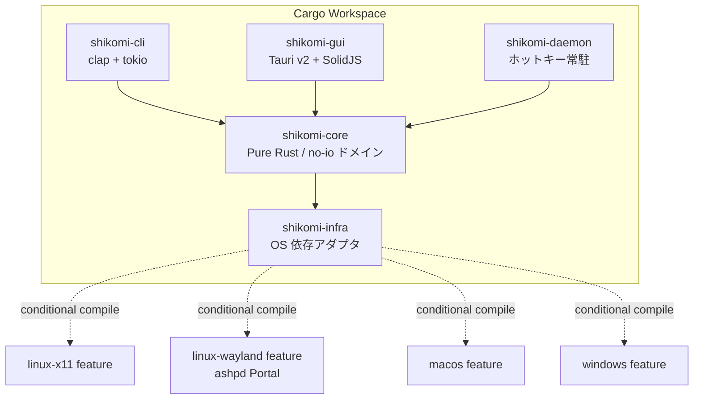

# Technology Stack — shikomi

## 0. 選定の前提

shikomi はクラウドリソースを持たないデスクトップ OSS であるため、`config/templates` の技術選定表のうちクラウド関連項目（App Runner、RDS、CDN、ALB、VPC、IaC、SES 等）は**該当なし**とする。代わりに、デスクトップアプリとして実際に判断が必要となる**言語・ランタイム・クロスプラットフォーム層・セキュリティ関連 crate・配布経路**を同フォーマットで扱う。

## 1. 全体構成図

## 2. 技術選定表

### 2.1 デスクトップ固有項目

| 要素 | 候補 | 採用 | 根拠 |
|-----|------|------|------|
| 言語 | Rust / Go / C++ / TypeScript(Electron) | **Rust** | メモリ安全性はパスワード扱いで必須、`zeroize`/`secrecy`/`keyring` のエコシステムが成熟、バイナリサイズが 10MB 級で収まる（Electron は 200MB 級で要件「インストールに技術知識不要」を悪化させる） |
| アプリ実行環境 | ネイティブ（Tauri / Electron / Flutter / Qt） / Web（論外） | **Tauri v2** | バイナリ ~10MB、プラットフォーム公式バンドラ（`tauri-bundler`）で MSI/NSIS/DMG/AppImage/deb/rpm 一括生成、Rust コアと同一言語で `shikomi-core` を共有。Electron は肥大、Flutter は Rust コア共有が困難、Qt はライセンス（LGPL）運用が OSS コントリビュータへ負担 |
| GUI フロントエンド | React / SolidJS / Svelte / Vue | **SolidJS** | Tauri 公式が推すフレームワークの一つ、初期バンドル小、1 ペイン構成の設定 GUI で十分。React は依存膨張、Svelte はエコシステムがやや薄い |
| CLI パーサ | `clap` / `structopt`（非推奨）/ 手書き | **`clap` v4（derive）** | Rust エコシステムの事実上標準、`shell-completion` と `man-page` 生成が公式提供 |
| 非同期ランタイム | `tokio` / `async-std` / `smol` | **`tokio`** | `tauri` が `tokio` 前提、`ashpd` が `zbus` 経由で `tokio` feature を持つ |
| グローバルホットキー | `global-hotkey` / `tauri-plugin-global-shortcut` / `rdev::grab` / XDG Portal 直叩き | **`tauri-plugin-global-shortcut` (X11/macOS/Windows) + `ashpd` (Wayland)** | `global-hotkey` v0.7.0 の README に「Linux (X11 Only)」と明記、Wayland は XDG `org.freedesktop.portal.GlobalShortcuts` portal 必須。`ashpd` v0.13 で `global_shortcuts` feature が安定。二段実装を`shikomi-infra` の feature flag で切り替える 出典: https://github.com/tauri-apps/global-hotkey, https://v2.tauri.app/plugin/global-shortcut/, https://flatpak.github.io/xdg-desktop-portal/docs/doc-org.freedesktop.portal.GlobalShortcuts.html, https://github.com/bilelmoussaoui/ashpd |
| クリップボード | `arboard` / `tauri-plugin-clipboard-manager` / `copypasta` | **`arboard` v3.6+（直接利用）** | sensitive hint メタデータ（`x-kde-passwordManagerHint=secret` 等）は `arboard` が issue #129 / PR #155 で対応、`tauri-plugin-clipboard-manager` は text/html/image のみで拡張 MIME を扱えず機密用途に不足。Wayland は `wayland-data-control` feature を有効化 出典: https://github.com/1Password/arboard, https://phabricator.kde.org/D12539 |
| 入力シミュレーション（フォールバック） | `enigo` / `rdev` / `autopilot-rs` | **`enigo`（最小限のフォールバック用途のみ）** | Wayland/libei が experimental ながら前進、`rdev` は Wayland 不可と README 明記。ただし MVP では**クリップボード投入が第一優先**で、キー注入は macOS Secure Event Input によるサイレント失敗のリスクがあるため CLI の `--paste-mode=inject` など明示オプトインに留める 出典: https://github.com/enigo-rs/enigo, https://github.com/enigo-rs/enigo/blob/main/Permissions.md, https://developer.apple.com/library/archive/technotes/tn2150/_index.html |
| シークレット保護 | `zeroize` / `secrecy` / 自前 | **`secrecy` + `zeroize`** | `secrecy::SecretBox` で `Debug`/`Serialize`/`Clone` の誤実装リークを型レベルで封じる。`zeroize` は LLVM の最適化除去防止を `volatile write` + `compiler_fence` で保証 出典: https://docs.rs/secrecy/latest/secrecy/, https://docs.rs/zeroize/latest/zeroize/ |
| OS キーチェーン連携 | `keyring` / 自前 D-Bus / 自前 CFI | **`keyring` crate** | `apple-native` / `windows-native` / `linux-native` / `sync-secret-service` feature でプラットフォーム backend を明示選択可、デフォルト feature なし方針が安全 出典: https://docs.rs/keyring/latest/keyring/ |
| Vault 暗号 | AES-256-GCM / ChaCha20-Poly1305 | **AES-256-GCM（RustCrypto `aes-gcm`）+ Argon2id（`argon2` crate）** | AEAD で認証タグ検証による tampering 検出、OWASP Password Storage 推奨値 `m=19456 KiB, t=2, p=1` 出典: https://cheatsheetseries.owasp.org/cheatsheets/Password_Storage_Cheat_Sheet.html |
| 永続化フォーマット | SQLite / JSON / TOML | **SQLite（`rusqlite` + SQLCipher 任意）** | 件数が増えても O(log n) で検索、`rusqlite` のバンドル feature で外部依存ゼロ、SQLCipher は任意オプション（OSS ビルドはバンドル版で足りる） |
| ログ | `tracing` / `log` | **`tracing`** | 構造化ログ、`tracing-subscriber` で環境変数レベル制御、secret スパン属性の漏洩防止も `secrecy` 連携で可能 |

### 2.2 配布・CI/CD 項目

| 要素 | 候補 | 採用 | 根拠 |
|-----|------|------|------|
| バンドラー | `tauri-bundler` / `cargo-bundle` / 自前 | **`tauri-bundler` v2.8+** | Tauri v2 公式、3 OS 全インストーラ形式を同一 YAML (`tauri.conf.json`) から生成 出典: https://v2.tauri.app/distribute/ |
| Windows インストーラ | MSI (WiX v3) / NSIS / MSIX | **NSIS（主）+ MSI（任意）** | NSIS はクロスコンパイル可・単一で多言語、MSI は Windows ホスト必須・言語別分離。`winget` は両形式受容 出典: https://v2.tauri.app/distribute/windows-installer/ |
| Windows 署名 | OV / EV / 未署名 | **段階移行（当面 OV、評判構築後 EV 検討）** | SmartScreen 警告回避、EV は即時 reputation だが年額コスト高、OSS 初期は OV で運用後に移行検討 出典: https://v2.tauri.app/distribute/sign/windows/ |
| macOS 署名 | Developer ID + Notarization / Ad-hoc / 未署名 | **Developer ID + Notarization（必須）** | Notarization なしは Gatekeeper で「壊れている」と表示される UX 悪化、要件「技術知識不要」に反する 出典: https://v2.tauri.app/distribute/sign/macos/ |
| Linux 配布形式 | AppImage / deb / rpm / Flatpak / Snap / tarball | **deb + rpm + AppImage（初期）、Flatpak は後続** | Ubuntu/Debian・Fedora/RHEL・distro 非依存の 3 本で主要ユーザをカバー。Flatpak は XDG Portal 前提でホットキー実装の再確認が必要なため MVP スコープ外 出典: https://v2.tauri.app/distribute/appimage/ / debian/ / rpm/ |
| 配布チャネル | GitHub Releases / winget / Homebrew / APT repo / snap store | **GitHub Releases（主）+ winget + Homebrew Cask（副）** | OSS 初期は GitHub Releases を SSoT、winget と Homebrew Cask は YAML マニフェスト更新のみで低コスト 出典: https://github.com/microsoft/winget-pkgs |
| CI/CD | GitHub Actions / CircleCI / 自前 | **GitHub Actions** | リポジトリ所在と同一、matrix build で Win/Mac/Linux ランナーを標準提供、`taiki-e/upload-rust-binary-action` 等のエコシステム |
| 依存監査 | `cargo-audit` / `cargo-deny` / Dependabot | **`cargo-deny` + Dependabot** | `cargo-deny` でライセンス / advisory / 重複バージョン / 禁止 crate を CI で fail fast、Dependabot で自動 PR |
| SBOM | `cargo-cyclonedx` / `syft` | **`cargo-cyclonedx`** | Rust ネイティブ、CycloneDX 1.5 形式をリリースに添付 |

### 2.3 クラウド・サーバ系項目（該当なし）

下記はデスクトップ OSS のため**該当なし**。理由を各項目に明記する。

| 要素 | 判定 | 理由 |
|-----|------|------|
| アプリ実行環境（App Runner / ECS / Lambda 等） | 該当なし | サーバサイドコンポーネントを持たない |
| コンテナレジストリ | 該当なし | コンテナ配布しない |
| DB（RDS / DynamoDB 等） | 該当なし | ローカル SQLite のみ |
| キャッシュ（ElastiCache 等） | 該当なし | 同上 |
| オブジェクトストレージ（S3 等） | 該当なし | 同上 |
| CDN | 該当なし | GitHub Releases の CDN に委譲 |
| ネットワーク構成 / ロードバランサ / VPC | 該当なし | サーバなし |
| 認証基盤（Cognito 等） | 該当なし | ローカル認証のみ（マスターパスワード + 任意 OS キーチェーン） |
| 秘密情報管理（Secrets Manager 等） | 該当なし | OS ネイティブキーチェーン（`keyring` crate）で代替 |
| IaC | 該当なし | インフラなし |
| 監視・ログ（CloudWatch / Datadog / Sentry 等） | 該当なし | 初期は最小限、将来オプトインのクラッシュレポータ（`sentry-rust` 等）を検討するが MVP 対象外 |
| メール送信（SES 等） | 該当なし | メール送信しない |
| DNS | 該当なし | ドメインは `shikomi-dev/shikomi` GitHub Pages で静的ページのみ（後続） |
| リージョン | 該当なし | クラウドなし |

## 3. プラットフォーム差分の扱い（アーキテクチャ方針）

- `shikomi-core` は `no_std` 志向ではないが **I/O を持たない純粋ドメイン**とする
- プラットフォーム依存は `shikomi-infra` crate に閉じ込め、feature flag（`linux-x11`, `linux-wayland`, `macos`, `windows`）で切替
- `shikomi-core` から `shikomi-infra` への依存方向を**一方向**に保ち、Clean Architecture の依存ルールを守る
- Linux では**起動時に Wayland/X11 セッション判定**を行い、Wayland なら `ashpd` Portal 経路、X11 なら `tauri-plugin-global-shortcut` 経路を選択（Tell, Don't Ask: `HotkeyBackend::register()` を呼び出すだけで、呼び出し側は実装差を意識しない）

## 4. クレートバージョンピン方針

- Tauri は **v2 系**にピン（major 固定、minor/patch は Dependabot 追従）
- セキュリティクリティカルな `aes-gcm` / `argon2` / `zeroize` / `secrecy` は minor もピン、patch のみ追従
- `Cargo.lock` を**リポジトリにコミット**（バイナリ crate の推奨プラクティス、再現ビルド担保）
