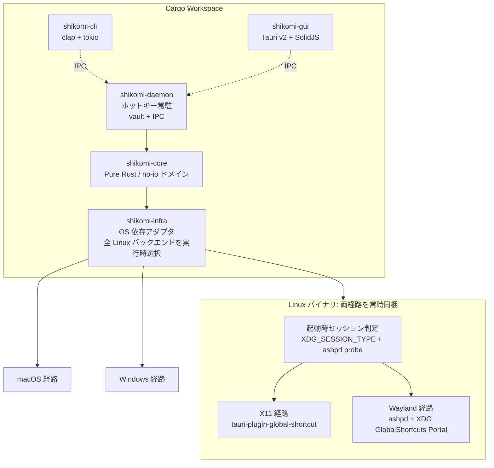
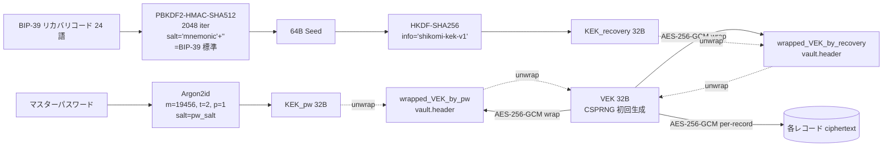

# Technology Stack — shikomi

## 0. 選定の前提

shikomi はクラウドリソースを持たないデスクトップ OSS であるため、`config/templates` の技術選定表のうちクラウド関連項目（App Runner、RDS、CDN、ALB、VPC、IaC、SES 等）は**該当なし**とする。代わりに、デスクトップアプリとして実際に判断が必要となる**言語・ランタイム・クロスプラットフォーム層・セキュリティ関連 crate・配布経路**を同フォーマットで扱う。

### 0.1 vault 保護モード（選定全体に波及する大前提）

**vault の暗号化はデフォルト OFF（平文モード）**。暗号化はユーザが明示的にオプトインした時のみ適用する（`context/process-model.md` §4.3）。これにより**技術選定の一部の項目は「オプトイン時のみ必須」となる**ため、以下の各表でその条件を明記する。

| モード | デフォルト | 暗号スタック | KDF |
|-------|---------|-----------|-----|
| **平文モード** | ✔ | なし（OS パーミッション `0600` のみ） | なし |
| **暗号化モード**（オプトイン） | — | AES-256-GCM (`aes-gcm`) + AEAD AAD | Argon2id (`argon2`) + HKDF-SHA256 + PBKDF2-HMAC-SHA512（BIP-39） |

`aes-gcm` / `argon2` / `hkdf` / `pbkdf2` / `bip39` などの crate は**両モードのバイナリに常時同梱**する（feature flag で切り分けない）。理由:
- 暗号化モード切替（`shikomi vault encrypt`）は実行時操作。ビルドを差し替える運用は UX として破綻する
- 全 crate をコンパイルしても Rust の dead-code elimination と LTO で、平文モードで未使用コードは最終バイナリからほぼ消える（バイナリサイズ影響は数百 KB レベルで許容範囲）

## 1. 全体構成図

**Linux での feature flag は使わない**: Linux バイナリは X11 / Wayland 両経路を常時同梱し、**起動時に `HotkeyBackend` を選択**（Tell, Don't Ask）。これにより deb/rpm/AppImage は単一ビルドで両セッションをサポートし、将来 Flatpak 化する際も portal 経路が既に組み込まれているため追加ビルドマトリクスを生まない。

**OS 境界の feature flag は残す**: `target_os = "linux" | "macos" | "windows"` の cfg 属性は Rust の標準機構で、異なる OS のコードを物理的に同一バイナリに入れる意味はないため `target_os` によるコンパイル時分岐のみ使用する。あくまで**Linux 内部での実行時分岐**のために `linux-x11` / `linux-wayland` のような独自 feature flag は設けない、という方針。

## 2. 技術選定表

### 2.1 デスクトップ固有項目

| 要素 | 候補 | 採用 | 根拠 |
|-----|------|------|------|
| 言語 | Rust / Go / C++ / TypeScript(Electron) | **Rust** | メモリ安全性はパスワード扱いで必須、`zeroize`/`secrecy`/`keyring` のエコシステムが成熟、バイナリサイズが 10MB 級で収まる（Electron は 200MB 級で要件「インストールに技術知識不要」を悪化させる） |
| アプリ実行環境 | ネイティブ（Tauri / Electron / Flutter / Qt） / Web（論外） | **Tauri v2** | バイナリ ~10MB、プラットフォーム公式バンドラ（`tauri-bundler`）で MSI/NSIS/DMG/AppImage/deb/rpm 一括生成、Rust コアと同一言語で `shikomi-core` を共有。Electron は肥大、Flutter は Rust コア共有が困難、Qt はライセンス（LGPL）運用が OSS コントリビュータへ負担 |
| GUI フロントエンド | React / SolidJS / Svelte / Vue | **SolidJS** | Tauri 公式が推すフレームワークの一つ、初期バンドル小、1 ペイン構成の設定 GUI で十分。React は依存膨張、Svelte はエコシステムがやや薄い |
| CLI パーサ | `clap` / `structopt`（非推奨）/ 手書き | **`clap` v4（derive）** | Rust エコシステムの事実上標準、`shell-completion` と `man-page` 生成が公式提供 |
| 非同期ランタイム | `tokio` / `async-std` / `smol` | **`tokio`** | `tauri` が `tokio` 前提、`ashpd` が `zbus` 経由で `tokio` feature を持つ |
| グローバルホットキー | `global-hotkey` / `tauri-plugin-global-shortcut` / `rdev::grab` / XDG Portal 直叩き | **`tauri-plugin-global-shortcut` (X11/macOS/Windows) + `ashpd` (Wayland)** | `global-hotkey` v0.7.0 の README に「Linux (X11 Only)」と明記、Wayland は XDG `org.freedesktop.portal.GlobalShortcuts` portal 必須。`ashpd` v0.13 で `global_shortcuts` feature が安定。**両経路を Linux バイナリに常時同梱し §3.1 の起動時プローブで実行時選択**（feature flag ではない） 出典: https://github.com/tauri-apps/global-hotkey, https://v2.tauri.app/plugin/global-shortcut/, https://flatpak.github.io/xdg-desktop-portal/docs/doc-org.freedesktop.portal.GlobalShortcuts.html, https://github.com/bilelmoussaoui/ashpd |
| クリップボード | `arboard` / `tauri-plugin-clipboard-manager` / `copypasta` | **`arboard` v3.6+（直接利用）** | sensitive hint メタデータ（`x-kde-passwordManagerHint=secret` 等）は `arboard` が issue #129 / PR #155 で対応、`tauri-plugin-clipboard-manager` は text/html/image のみで拡張 MIME を扱えず機密用途に不足。Wayland は `wayland-data-control` feature を有効化 出典: https://github.com/1Password/arboard, https://phabricator.kde.org/D12539 |
| 入力シミュレーション（フォールバック） | `enigo` / `rdev` / `autopilot-rs` | **`enigo`（最小限のフォールバック用途のみ）** | Wayland/libei が experimental ながら前進、`rdev` は Wayland 不可と README 明記。ただし MVP では**クリップボード投入が第一優先**で、キー注入は macOS Secure Event Input によるサイレント失敗のリスクがあるため CLI の `--paste-mode=inject` など明示オプトインに留める 出典: https://github.com/enigo-rs/enigo, https://github.com/enigo-rs/enigo/blob/main/Permissions.md, https://developer.apple.com/library/archive/technotes/tn2150/_index.html |
| シークレット保護 | `zeroize` / `secrecy` / 自前 | **`secrecy` + `zeroize`** | `secrecy::SecretBox` で `Debug`/`Serialize`/`Clone` の誤実装リークを型レベルで封じる。`zeroize` は LLVM の最適化除去防止を `volatile write` + `compiler_fence` で保証 出典: https://docs.rs/secrecy/latest/secrecy/, https://docs.rs/zeroize/latest/zeroize/ |
| OS キーチェーン連携 | `keyring` / 自前 D-Bus / 自前 CFI | **`keyring` crate** | `apple-native` / `windows-native` / `linux-native` / `sync-secret-service` feature でプラットフォーム backend を明示選択可、デフォルト feature なし方針が安全 出典: https://docs.rs/keyring/latest/keyring/ |
| Vault 暗号（オプトイン時のみ） | AES-256-GCM / ChaCha20-Poly1305 | **AES-256-GCM（RustCrypto `aes-gcm`）+ Argon2id（`argon2` crate）** | **暗号化モード有効時のみ適用**。デフォルト（平文モード）では暗号処理なし。AEAD で認証タグ検証による tampering 検出、OWASP Password Storage 推奨値 `m=19456 KiB, t=2, p=1`。nonce 管理・AAD・鍵階層は §2.4 に詳述 出典: https://cheatsheetseries.owasp.org/cheatsheets/Password_Storage_Cheat_Sheet.html |
| Vault 保護（デフォルト） | OS ファイルパーミッション / 暗号化必須 | **Unix: ファイル `0600` + ディレクトリ `0700`**（所有者のみ read/write）／ **Windows: NTFS ACL を所有者 SID のみに `GENERIC_READ \| GENERIC_WRITE` 許可、Everyone / Users / Authenticated Users など全ての組込みグループから継承を破棄 + 明示拒否**。実装は Windows API `SetNamedSecurityInfo` + `BuildExplicitAccessWithName`、または Rust `windows-acl` crate。ディレクトリ ACL も同等に設定 | ペルソナ A/C のオンボーディング障壁を最小化する設計判断（`context/overview.md` §1 / `context/process-model.md` §4.3）。機密情報を入れるユーザは `shikomi vault encrypt` で暗号化モードへ切替。リスクは `context/threat-model.md` §7.0 で明示 |
| IPC シリアライズ | JSON / MessagePack / bincode / Protocol Buffers | **MessagePack（`rmp-serde`）** | 型付き `serde` 統合、バイナリ高速、文字列 escape のクロス OS バグを回避。スキーマは `shikomi-core` 型で共有し二重管理を避ける |
| 永続化フォーマット | SQLite / JSON / TOML | **SQLite（`rusqlite` + SQLCipher 任意）** | 件数が増えても O(log n) で検索、`rusqlite` のバンドル feature で外部依存ゼロ、SQLCipher は任意オプション（OSS ビルドはバンドル版で足りる） |
| ログ | `tracing` / `log` | **`tracing`** | 構造化ログ、`tracing-subscriber` で環境変数レベル制御、secret スパン属性の漏洩防止も `secrecy` 連携で可能 |

### 2.2 配布・CI/CD 項目

| 要素 | 候補 | 採用 | 根拠 |
|-----|------|------|------|
| バンドラー | `tauri-bundler` / `cargo-bundle` / 自前 | **`tauri-bundler` v2.8+** | Tauri v2 公式、3 OS 全インストーラ形式を同一 YAML (`tauri.conf.json`) から生成 出典: https://v2.tauri.app/distribute/ |
| Windows インストーラ | MSI (WiX v3) / NSIS / MSIX | **NSIS（主）+ MSI（任意）** | NSIS はクロスコンパイル可・単一で多言語、MSI は Windows ホスト必須・言語別分離。`winget` は両形式受容 出典: https://v2.tauri.app/distribute/windows-installer/ |
| Windows 署名 | OV / EV / 未署名 | **段階移行（当面 OV、評判構築後 EV 検討）** | SmartScreen 警告回避、EV は即時 reputation だが年額コスト高、OSS 初期は OV で運用後に移行検討 出典: https://v2.tauri.app/distribute/sign/windows/ |
| macOS 署名 | Developer ID + Notarization / Ad-hoc / 未署名 | **Developer ID + Notarization（必須）** | Notarization なしは Gatekeeper で「壊れている」と表示される UX 悪化、要件「技術知識不要」に反する 出典: https://v2.tauri.app/distribute/sign/macos/ |
| Linux 配布形式 | AppImage / deb / rpm / Flatpak / Snap / tarball | **deb + rpm + AppImage（初期）、Flatpak は後続** | Ubuntu/Debian・Fedora/RHEL・distro 非依存の 3 本で主要ユーザをカバー。Flatpak は XDG Portal 前提でホットキー実装の再確認が必要なため MVP スコープ外 出典: https://v2.tauri.app/distribute/appimage/ / debian/ / rpm/ |
| 配布チャネル | GitHub Releases / winget / Homebrew / APT repo / snap store | **GitHub Releases（主）+ winget + Homebrew Cask（副）** | OSS 初期は GitHub Releases を SSoT、winget と Homebrew Cask は YAML マニフェスト更新のみで低コスト 出典: https://github.com/microsoft/winget-pkgs |
| CI/CD | GitHub Actions / CircleCI / 自前 | **GitHub Actions** | リポジトリ所在と同一、matrix build で Win/Mac/Linux ランナーを標準提供、`taiki-e/upload-rust-binary-action` 等のエコシステム |
| 依存監査 | `cargo-audit` / `cargo-deny` / Dependabot | **`cargo-deny` + Dependabot** | `cargo-deny` でライセンス / advisory / 重複バージョン / 禁止 crate を CI で fail fast、Dependabot で自動 PR |
| SBOM | `cargo-cyclonedx` / `syft` | **`cargo-cyclonedx`** | Rust ネイティブ、CycloneDX 1.5 形式をリリースに添付 |

### 2.3 クラウド・サーバ系項目（該当なし）

下記はデスクトップ OSS のため**該当なし**。理由を各項目に明記する。

| 要素 | 判定 | 理由 |
|-----|------|------|
| アプリ実行環境（App Runner / ECS / Lambda 等） | 該当なし | サーバサイドコンポーネントを持たない |
| コンテナレジストリ | 該当なし | コンテナ配布しない |
| DB（RDS / DynamoDB 等） | 該当なし | ローカル SQLite のみ |
| キャッシュ（ElastiCache 等） | 該当なし | 同上 |
| オブジェクトストレージ（S3 等） | 該当なし | 同上 |
| CDN | 該当なし | GitHub Releases の CDN に委譲 |
| ネットワーク構成 / ロードバランサ / VPC | 該当なし | サーバなし |
| 認証基盤（Cognito 等） | 該当なし | ローカル認証のみ。デフォルトは認証なし（平文モード）、暗号化モード時はマスターパスワード + 任意 OS キーチェーン |
| 秘密情報管理（Secrets Manager 等） | 該当なし | OS ネイティブキーチェーン（`keyring` crate）で代替 |
| IaC | 該当なし | インフラなし |
| 監視・ログ（CloudWatch / Datadog / Sentry 等） | 該当なし | 初期は最小限、将来オプトインのクラッシュレポータ（`sentry-rust` 等）を検討するが MVP 対象外 |
| メール送信（SES 等） | 該当なし | メール送信しない |
| DNS | 該当なし | ドメインは `shikomi-dev/shikomi` GitHub Pages で静的ページのみ（後続） |
| リージョン | 該当なし | クラウドなし |

### 2.4 暗号運用の詳細（暗号化モード有効時のみ適用）

**適用条件**: 本節は **vault が暗号化モード**（`shikomi vault encrypt` でユーザがオプトイン済み）の場合に**のみ**適用される。平文モード（デフォルト）では本節の全要素は動作しない。

**鍵階層（Envelope Encryption / VEK + KEK パターン）**:

レコード暗号鍵とユーザ認証経路（マスターパスワード・リカバリコード）を**分離**する。これによりマスターパスワード変更やリカバリコード入力で**レコード全件の再暗号化は発生しない**（`wrapped_VEK` のみ書換）。

| 項目 | 方針 | 根拠 |
|-----|------|-----|
| **VEK**（Vault Encryption Key） | 初回 vault 作成時に 32 バイト CSPRNG 生成、以後不変。実レコード暗号鍵 | マスターパスワード変更でも VEK 不変＝全件再暗号化不要（O(1) 操作） |
| **KEK_pw**（パスワード経路 KEK） | `Argon2id(password, salt_pw, m=19456, t=2, p=1)` の 32 バイト出力 | OWASP Password Storage Cheat Sheet 推奨値 |
| **KEK_recovery**（リカバリ経路 KEK） | `HKDF-SHA256(PBKDF2-HMAC-SHA512(mnemonic, "mnemonic"+passphrase, 2048), info="shikomi-kek-v1")` の 32 バイト | BIP-39 標準 seed 導出＋用途分離のため HKDF で app 固有にドメイン分離 |
| **wrapped_VEK**（vault ヘッダ） | `AES-256-GCM(KEK, VEK)` を 2 通り（pw 用・recovery 用）vault ヘッダに並置 | どちらの経路でも同一 VEK が取り出せる |
| KDF ソルト（pw 経路） | vault ごとに 16 バイト CSPRNG、vault ヘッダに平文保管 | ソルトはレインボーテーブル対策のため秘匿不要 |
| リカバリコードの受入 | **BIP-39 24 語**（256 bit エントロピー）。12 語は 128 bit でパスワード相当を下回るため採用しない | BIP-39 24 語は本物のマスターパスワード**同等**の秘密として扱う。紛失・漏洩どちらも vault 全滅 |
| リカバリコード保存方針 | **1 度だけ表示し二度と取得不可**。ユーザが紙に転記するまで UI をブロック | 再発行可能にすると攻撃面が増える（OWASP A07 推奨） |
| リカバリコード提示順序 | マスターパスワード作成直後に生成・表示・転記確認 → 以降いかなる操作でも再表示しない | マスターパスワードを先に作らせてから recovery を表示することで「recovery だけで済ませる」誤用を防止 |
| リカバリコード使用時の流れ | `KEK_recovery → wrapped_VEK_by_recovery アンラップ → VEK 復元 → 新マスターパスワード設定 → 新 KEK_pw で wrapped_VEK_by_pw を再書込`。**リカバリコード自体は vault に保存しない** | 紙の物理保護にリスクを移譲。侵害時は新規 vault 再作成を促す |
| レコード暗号 | **AES-256-GCM、レコード単位** | レコード削除時にタグ再計算不要、部分復号で平文展開範囲を最小化 |
| nonce（IV）生成 | **CSPRNG 由来 96 bit / レコード**。同一 VEK での nonce 衝突確率を $2^{-32}$ 以下に抑えるため、**同一 VEK での暗号化回数上限を $2^{32}$ に制限**（NIST SP 800-38D §8.3 "Uniqueness Requirement on IVs"）。上限接近時は **VEK を新規生成し全レコード再暗号化**（rekey 操作、ユーザ明示トリガか到達時に警告） | nonce 再利用は認証タグ偽造と平文漏洩に直結するため最厳戒 |
| nonce 保存場所 | 各レコードの AEAD ciphertext 先頭 12 バイトに prepend（標準レイアウト） | rusqlite BLOB カラムに `nonce \|\| ciphertext \|\| tag` 形式で保存 |
| AAD（追加認証データ） | レコード ID（UUIDv7）・バージョン番号・作成日時を AAD に含める | レコード入れ替え攻撃（ciphertext を別レコードへ移植）を検出 |
| VEK キャッシュ | `secrecy::SecretBox<[u8; 32]>` として daemon プロセスメモリ上のみ。アイドル 15 分 / スクリーンロック / サスペンドで即 `zeroize`（`context/process-model.md` §4.3） | ホットキー p95 100 ms と Argon2id 実行時間の矛盾を解消 |
| マスターパスワード／リカバリコード保持 | KDF 実行直後に即 `zeroize`。**VEK のみ**を保持 | 秘密はメモリ上で最小時間のみ存在 |
| レート制限（認証） | 連続失敗 5 回で **非同期タイマー（`tokio::time::sleep`）による指数バックオフ** を該当 IPC リクエストに適用。**daemon イベントループ全体は停止させない**（ホットキー購読継続） | 総当たり攻撃緩和、Fail Secure。blocking sleep は daemon 全体が硬直しホットキー反応停止＝ DoS と同義なので禁止 |
| 更新パッケージ署名 | `minisign`（公開鍵はアプリにバンドル、検証失敗で更新中断） | `tauri-plugin-updater` 準拠 |

**脅威モデル上の位置づけ（暗号化モード時）**:
- マスターパスワード単独で vault 全復号可能 ⇔ リカバリコード単独でも vault 全復号可能（対称）
- 両方同時に失うと復旧不能（これは受容する残存リスク）
- リカバリコード漏洩は即時かつ完全な侵害 → ユーザは vault 再作成と新リカバリコード再生成が必須（UI で明示）

**平文モードとの相互排他**:
- vault ヘッダの `protection_mode` フィールドで `"plaintext"` / `"encrypted"` を排他管理。「一部レコードだけ暗号化」のような半端な状態は作らない（KISS / Fail Fast）
- モード変更時は全レコードを一括変換する atomic write 操作。途中クラッシュ時は `.new` 残存で検出してリカバリ UI（`context/threat-model.md` §7.1）

**将来拡張（MVP 外）**:
- OS キーチェーン経由の自動アンロック（`context/process-model.md` §4.3）は**第 3 の KEK 経路**として `wrapped_VEK_by_keychain` を追加する形で実装。同じ Envelope パターンで拡張可能

出典:
- OWASP Password Storage Cheat Sheet: https://cheatsheetseries.owasp.org/cheatsheets/Password_Storage_Cheat_Sheet.html
- NIST SP 800-38D "Recommendation for Block Cipher Modes of Operation: Galois/Counter Mode (GCM) and GMAC": https://nvlpubs.nist.gov/nistpubs/Legacy/SP/nistspecialpublication800-38d.pdf
- RustCrypto `aes-gcm`: https://docs.rs/aes-gcm/latest/aes_gcm/
- BIP-39 "Mnemonic code for generating deterministic keys": https://github.com/bitcoin/bips/blob/master/bip-0039.mediawiki
- RFC 5869 "HKDF: HMAC-based Extract-and-Expand Key Derivation Function": https://www.rfc-editor.org/rfc/rfc5869
- OWASP Authentication Cheat Sheet（リカバリコード方針）: https://cheatsheetseries.owasp.org/cheatsheets/Authentication_Cheat_Sheet.html

## 3. プラットフォーム差分の扱い（アーキテクチャ方針）

- `shikomi-core` は `no_std` 志向ではないが **I/O を持たない純粋ドメイン**とする
- プラットフォーム依存は `shikomi-infra` crate に閉じ込め、**OS 境界（`target_os`）のみコンパイル時分岐**、**同一 OS 内のバックエンド選択は実行時分岐**に統一する
- `shikomi-core` から `shikomi-infra` への依存方向を**一方向**に保ち、Clean Architecture の依存ルールを守る
- **Linux は単一バイナリに X11 / Wayland 両経路を同梱**し、起動時に `XDG_SESSION_TYPE` と `ashpd::Session::is_available()` を組合せたプローブで `HotkeyBackend` / `ClipboardBackend` を選択する（Tell, Don't Ask: 呼び出し側は `backend.register(hotkey)` を呼ぶだけで実装差を意識しない）
- Wayland セッション下で portal が利用不可な極端ケースは `HotkeyBackendError::Unavailable` を返し、ユーザに「Wayland + Portal 非対応 compositor」と明示して fail fast

### 3.1 実行時バックエンド選択ロジック（概念）

| 検出順 | 検査内容 | 採用バックエンド |
|-------|---------|---------------|
| 1 | `target_os = "linux"` かつ `XDG_SESSION_TYPE == "wayland"` | Wayland portal（`ashpd`） |
| 2 | `target_os = "linux"` かつ `XDG_SESSION_TYPE == "x11"`／未設定 | X11（`tauri-plugin-global-shortcut`） |
| 3 | `target_os = "linux"` かつ上記検出失敗 | D-Bus への `org.freedesktop.portal.Desktop` 存在プローブ → あれば Wayland 扱い、なければ X11 扱い |
| 4 | `target_os = "macos"` | macOS backend（Carbon + Accessibility） |
| 5 | `target_os = "windows"` | Windows backend（`RegisterHotKey`） |

## 4. Cargo workspace 構成と依存管理

### 4.1 workspace 初期設定（実装規約）

§1 の 5 crate を単一 Cargo workspace として管理する。各 crate は `crates/{name}/` 配下に置き、ルートには workspace 定義ファイルのみを置く。

| 設定項目 | 値 | 根拠 |
|---------|----|------|
| `resolver` | `"2"` | workspace と feature unification の挙動が v1 と非互換。crate の feature が OS 別に分岐する shikomi では v2 必須（Cargo Book: Features / Feature resolver version 2） |
| `[workspace.package] edition` | `"2021"` | 全 crate 共通。`2024` は Rust 1.85 以降で安定化したが、Tauri v2 / ashpd 等のエコシステムは 2021 想定のため合わせる |
| `[workspace.package] rust-version` | `rust-toolchain.toml` と同値 | MSRV を workspace 横断で一元管理 |
| `[workspace.package] license` | `"MIT"` | `nfr.md` §9 に準拠 |
| `[workspace.package] authors` / `repository` | workspace 側で定義 | DRY: crate 個別の `Cargo.toml` には書かない |
| 各 crate の `publish` | `false` | shikomi はデスクトップアプリ本体であり、crate 個別に crates.io へ公開しない |
| `Cargo.lock` コミット | **必須** | §4.3 参照。バイナリ crate の標準プラクティス |

**crate 配置と依存方向**:

| crate | 配置 | エントリ | 責務境界 | 依存してよい crate |
|-------|------|---------|---------|------------------|
| `shikomi-core` | `crates/shikomi-core/` | `lib.rs` | pure Rust / no-I/O ドメイン | なし（最下層） |
| `shikomi-infra` | `crates/shikomi-infra/` | `lib.rs` | OS 依存アダプタ | `shikomi-core` |
| `shikomi-daemon` | `crates/shikomi-daemon/` | `main.rs` | 常駐プロセス / IPC サーバ | `shikomi-core`, `shikomi-infra` |
| `shikomi-cli` | `crates/shikomi-cli/` | `main.rs` | CLI（IPC クライアント） | `shikomi-core`, `shikomi-infra` |
| `shikomi-gui` | `crates/shikomi-gui/` | `lib.rs`（Tauri 初期化は後続 Issue） | 設定 GUI（IPC クライアント） | `shikomi-core`, `shikomi-infra` |

**依存方向ルール**（Clean Architecture、違反時は `cargo-deny` 相当の検査で fail fast）:
- `shikomi-core` は他 crate に依存しない
- `shikomi-infra → shikomi-core` の一方向のみ
- `daemon` / `cli` / `gui` は相互依存しない
- 実装 crate（`daemon` / `cli` / `gui`）が `core` を迂回して互いを参照することは禁止

**外部 crate の参照方法**: 各 crate の `Cargo.toml` では外部 crate のバージョンを直接書かず、**workspace ルートで一元定義したものを `{ workspace = true }` で参照する**（§4.4）。これにより同一依存の version drift を構造的に防ぐ。ワークスペース内の 5 crate 間参照（`shikomi-infra` → `shikomi-core` 等）も同方式で定義する（path 依存＋バージョン併記）。

### 4.2 toolchain / lint / format 規約

| ファイル | 項目 | 値 / 方針 |
|---------|------|----------|
| `rust-toolchain.toml` | `channel` | `"stable"`（最新安定版、CI と開発環境で統一） |
| 〃 | `components` | `["rustfmt", "clippy"]` |
| 〃 | `profile` | `"minimal"`（不要コンポーネントを取らず CI 時間を短縮） |
| `rustfmt.toml` | 方針 | Rust 公式デフォルトを基本。`edition = "2021"` を明示。意図的な逸脱項目のみ追記 |
| `.clippy.toml` | 方針 | `msrv` を `rust-toolchain.toml` と一致させる。カテゴリレベル設定は CI コマンド側の `-D warnings` で強制 |
| CI clippy 呼び出し | コマンド | `cargo clippy --workspace --all-targets -- -D warnings` |
| CI fmt 呼び出し | コマンド | `cargo fmt --all -- --check` |

### 4.3 `cargo-deny` 初期ポリシー

`deny.toml` は shikomi が「パスワードを扱うデスクトップ OSS」であるため、ライセンス / advisory / 依存の重複を CI で fail fast させる。

| セクション | 初期方針 | 根拠 |
|----------|---------|------|
| `[licenses] allow` | `MIT`, `Apache-2.0`, `Apache-2.0 WITH LLVM-exception`, `BSD-2-Clause`, `BSD-3-Clause`, `ISC`, `Unicode-DFS-2016`, `Unicode-3.0`, `Zlib`, `CC0-1.0` | OSS デスクトップ配布で商用互換性を保つ範囲。GPL 系は shikomi 本体のライセンス（MIT）と衝突するため allow しない |
| `[licenses] confidence-threshold` | `0.93` | デフォルト値。極端に低くすると誤検知が出る |
| `[advisories] vulnerability` | `deny` | RustSec advisory DB 由来の脆弱性は CI で即 fail |
| `[advisories] unmaintained` | `warn`（Issue #4 時点のみ）→ **#5 shikomi-core ドメイン型定義 PR マージと同時に `deny` 昇格** | §4.3.1 に昇格トリガを厳密化。shikomi-infra（SQLite / `keyring` / `aes-gcm` / `argon2` 等の実 crate 導入）より前に必ず `deny` とする |
| `[advisories] yanked` | `deny` | yanked 版を引いたままのビルドは再現不能 |
| `[bans] multiple-versions` | `warn`（Issue #4 時点のみ）→ **`shikomi-infra` の初回 PR マージ直後に `deny` 昇格** | 外部 crate を本格導入する shikomi-infra の完成時点で version drift を禁止。§4.3.1 参照 |
| `[bans] wildcards` | `deny` | `*` バージョン指定は Cargo.lock との整合を破壊する |
| `[sources] unknown-registry` / `unknown-git` | `deny` | crates.io 以外からの取得は明示的に `allow` リストへ追加する運用 |

**セキュリティクリティカル crate の個別扱い**: 以下は **Issue #4 時点から例外として即 `deny`** を適用する（`[advisories]` の `unmaintained` が workspace 全体で `warn` のときも、この列挙 crate だけは `unmaintained = deny` 相当の扱い）。手段は `deny.toml` の `[bans].deny` リストに「unmaintained になった時点で必ず fail する crate 名」として明示登録するか、`cargo-deny` の `[advisories].unmaintained-ignore` を空に保ったまま「このリストの crate は shikomi-infra 導入と同時に全体 `deny` になるのを先取りする」ポリシーを `deny.toml` の先頭コメントに宣言する方式をとる。

対象 crate: `aes-gcm` / `argon2` / `zeroize` / `secrecy` / `hkdf` / `pbkdf2` / `bip39` / `rand_core` / `subtle`

根拠: 暗号運用（§2.4）は **unmaintained crate を引きずるだけでゼロデイ脆弱性放置と同義**。パスワードを扱うアプリである shikomi は、暗号周辺の unmaintained を「いずれ昇格」では遅い。

### 4.3.1 昇格トリガー一覧（曖昧さ排除）

| 項目 | 初期値 | 昇格後の値 | 昇格タイミング（PR マージ完了時点） | 昇格責任者 |
|------|-------|-----------|----------------------------------|----------|
| `[advisories] unmaintained`（workspace 全体） | `warn` | `deny` | **次の Issue「shikomi-core ドメイン型定義」PR マージ時点** | セキュリティ担当（服部） — 同 Issue のチェックリストに「`deny.toml` の `unmaintained` を `deny` に昇格」を**必須項目**として追加 |
| `[bans] multiple-versions` | `warn` | `deny` | **`shikomi-infra` の初回 PR マージ直後** | セキュリティ担当（服部） — 同 Issue に同上の必須項目 |
| 暗号クリティカル crate 列挙 | **既に `deny` 相当** | — | Issue #4 で確定 | 設計担当（セル）が `deny.toml` 初期コミットに明記 |

**昇格を忘れた場合の検知**: 上記の 2 項目は、該当 Issue の acceptance criteria に `deny.toml` 差分行を要求することで PR レビュアが fail fast 判断できる。昇格トリガを跨いで `warn` のまま残っている場合、服部は当該 PR を却下する。

出典: https://embarkstudios.github.io/cargo-deny/

### 4.4 クレートバージョンピン方針

- Tauri は **v2 系**にピン（major 固定、minor/patch は Dependabot 追従）
- セキュリティクリティカルな `aes-gcm` / `argon2` / `zeroize` / `secrecy` は minor もピン、patch のみ追従
- `Cargo.lock` を**リポジトリにコミット**（バイナリ crate の推奨プラクティス、再現ビルド担保）
- `[workspace.dependencies]` セクションに**外部 crate のバージョンを一元集約**し、各 crate の `Cargo.toml` からは `foo = { workspace = true }` で参照する（DRY、バージョン drift 防止）
