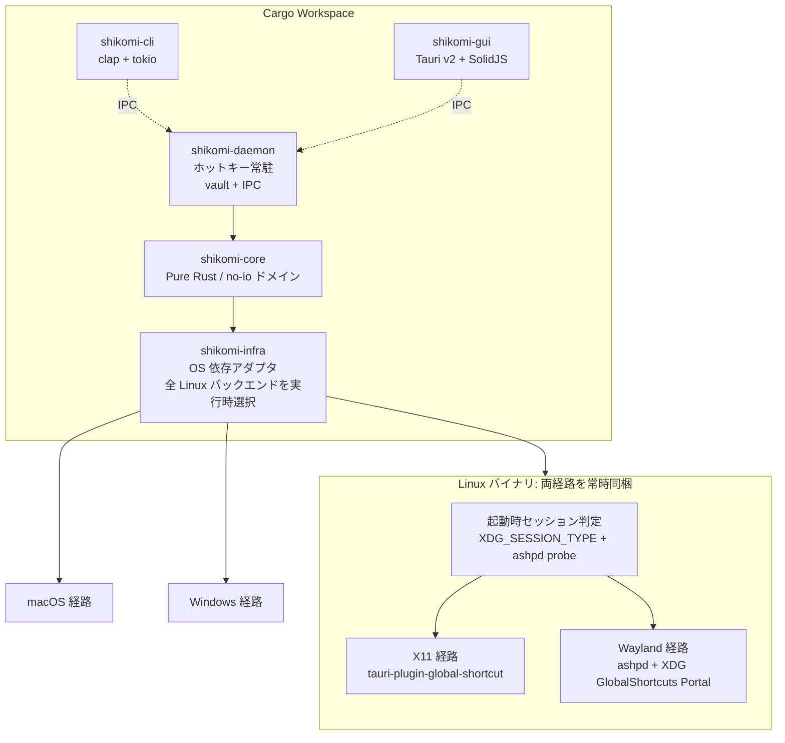
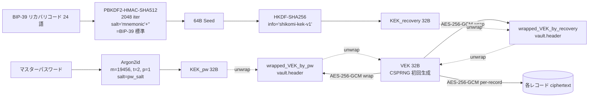

# Technology Stack — shikomi

## 0. 選定の前提

shikomi はクラウドリソースを持たないデスクトップ OSS であるため、`config/templates` の技術選定表のうちクラウド関連項目（App Runner、RDS、CDN、ALB、VPC、IaC、SES 等）は**該当なし**とする。代わりに、デスクトップアプリとして実際に判断が必要となる**言語・ランタイム・クロスプラットフォーム層・セキュリティ関連 crate・配布経路**を同フォーマットで扱う。

### 0.1 vault 保護モード（選定全体に波及する大前提）

**vault の暗号化はデフォルト OFF（平文モード）**。暗号化はユーザが明示的にオプトインした時のみ適用する（`context/process-model.md` §4.3）。これにより**技術選定の一部の項目は「オプトイン時のみ必須」となる**ため、以下の各表でその条件を明記する。

| モード | デフォルト | 暗号スタック | KDF |
|-------|---------|-----------|-----|
| **平文モード** | ✔ | なし（OS パーミッション `0600` のみ） | なし |
| **暗号化モード**（オプトイン） | — | AES-256-GCM (`aes-gcm`) + AEAD AAD | Argon2id (`argon2`) + HKDF-SHA256 + PBKDF2-HMAC-SHA512（BIP-39） |

`aes-gcm` / `argon2` / `hkdf` / `pbkdf2` / `bip39` などの crate は**両モードのバイナリに常時同梱**する（feature flag で切り分けない）。理由:
- 暗号化モード切替（`shikomi vault encrypt`）は実行時操作。ビルドを差し替える運用は UX として破綻する
- 全 crate をコンパイルしても Rust の dead-code elimination と LTO で、平文モードで未使用コードは最終バイナリからほぼ消える（バイナリサイズ影響は数百 KB レベルで許容範囲）

## 1. 全体構成図

**Linux での feature flag は使わない**: Linux バイナリは X11 / Wayland 両経路を常時同梱し、**起動時に `HotkeyBackend` を選択**（Tell, Don't Ask）。これにより deb/rpm/AppImage は単一ビルドで両セッションをサポートし、将来 Flatpak 化する際も portal 経路が既に組み込まれているため追加ビルドマトリクスを生まない。

**OS 境界の feature flag は残す**: `target_os = "linux" | "macos" | "windows"` の cfg 属性は Rust の標準機構で、異なる OS のコードを物理的に同一バイナリに入れる意味はないため `target_os` によるコンパイル時分岐のみ使用する。あくまで**Linux 内部での実行時分岐**のために `linux-x11` / `linux-wayland` のような独自 feature flag は設けない、という方針。

## 2. 技術選定表

### 2.1 デスクトップ固有項目

| 要素 | 候補 | 採用 | 根拠 |
|-----|------|------|------|
| 言語 | Rust / Go / C++ / TypeScript(Electron) | **Rust** | メモリ安全性はパスワード扱いで必須、`zeroize`/`secrecy`/`keyring` のエコシステムが成熟、バイナリサイズが 10MB 級で収まる（Electron は 200MB 級で要件「インストールに技術知識不要」を悪化させる） |
| アプリ実行環境 | ネイティブ（Tauri / Electron / Flutter / Qt） / Web（論外） | **Tauri v2** | バイナリ ~10MB、プラットフォーム公式バンドラ（`tauri-bundler`）で MSI/NSIS/DMG/AppImage/deb/rpm 一括生成、Rust コアと同一言語で `shikomi-core` を共有。Electron は肥大、Flutter は Rust コア共有が困難、Qt はライセンス（LGPL）運用が OSS コントリビュータへ負担 |
| GUI フロントエンド | React / SolidJS / Svelte / Vue | **SolidJS** | Tauri 公式が推すフレームワークの一つ、初期バンドル小、1 ペイン構成の設定 GUI で十分。React は依存膨張、Svelte はエコシステムがやや薄い |
| CLI パーサ | `clap` / `structopt`（非推奨）/ 手書き | **`clap` v4（derive）** | Rust エコシステムの事実上標準、`shell-completion` と `man-page` 生成が公式提供 |
| 非同期ランタイム | `tokio` / `async-std` / `smol` | **`tokio`** | `tauri` が `tokio` 前提、`ashpd` が `zbus` 経由で `tokio` feature を持つ |
| グローバルホットキー | `global-hotkey` / `tauri-plugin-global-shortcut` / `rdev::grab` / XDG Portal 直叩き | **`tauri-plugin-global-shortcut` (X11/macOS/Windows) + `ashpd` (Wayland)** | `global-hotkey` v0.7.0 の README に「Linux (X11 Only)」と明記、Wayland は XDG `org.freedesktop.portal.GlobalShortcuts` portal 必須。`ashpd` v0.13 で `global_shortcuts` feature が安定。**両経路を Linux バイナリに常時同梱し §3.1 の起動時プローブで実行時選択**（feature flag ではない） 出典: https://github.com/tauri-apps/global-hotkey, https://v2.tauri.app/plugin/global-shortcut/, https://flatpak.github.io/xdg-desktop-portal/docs/doc-org.freedesktop.portal.GlobalShortcuts.html, https://github.com/bilelmoussaoui/ashpd |
| クリップボード | `arboard` / `tauri-plugin-clipboard-manager` / `copypasta` | **`arboard` v3.6+（直接利用）** | sensitive hint メタデータ（`x-kde-passwordManagerHint=secret` 等）は `arboard` が issue #129 / PR #155 で対応、`tauri-plugin-clipboard-manager` は text/html/image のみで拡張 MIME を扱えず機密用途に不足。Wayland は `wayland-data-control` feature を有効化 出典: https://github.com/1Password/arboard, https://phabricator.kde.org/D12539 |
| 入力シミュレーション（フォールバック） | `enigo` / `rdev` / `autopilot-rs` | **`enigo`（最小限のフォールバック用途のみ）** | Wayland/libei が experimental ながら前進、`rdev` は Wayland 不可と README 明記。ただし MVP では**クリップボード投入が第一優先**で、キー注入は macOS Secure Event Input によるサイレント失敗のリスクがあるため CLI の `--paste-mode=inject` など明示オプトインに留める 出典: https://github.com/enigo-rs/enigo, https://github.com/enigo-rs/enigo/blob/main/Permissions.md, https://developer.apple.com/library/archive/technotes/tn2150/_index.html |
| シークレット保護 | `zeroize` / `secrecy` / 自前 | **`secrecy` + `zeroize`** | `secrecy::SecretBox` で `Debug`/`Serialize`/`Clone` の誤実装リークを型レベルで封じる。`zeroize` は LLVM の最適化除去防止を `volatile write` + `compiler_fence` で保証 出典: https://docs.rs/secrecy/latest/secrecy/, https://docs.rs/zeroize/latest/zeroize/ |
| OS キーチェーン連携 | `keyring` / 自前 D-Bus / 自前 CFI | **`keyring` crate** | `apple-native` / `windows-native` / `linux-native` / `sync-secret-service` feature でプラットフォーム backend を明示選択可、デフォルト feature なし方針が安全 出典: https://docs.rs/keyring/latest/keyring/ |
| Vault 暗号（オプトイン時のみ） | AES-256-GCM / ChaCha20-Poly1305、暗号スイート: **RustCrypto** / `ring` / `boring` / 自前 | **AES-256-GCM（RustCrypto `aes-gcm`）+ Argon2id（`argon2` crate）** | **暗号化モード有効時のみ適用**。デフォルト（平文モード）では暗号処理なし。AEAD で認証タグ検証による tampering 検出、OWASP Password Storage 推奨値 `m=19456 KiB, t=2, p=1`。nonce 管理・AAD・鍵階層は §2.4 に詳述、crate version pin は §4.7 に集約 **RustCrypto を採用し `ring` を不採用とした根拠**: ① `ring` は内部に C/asm を保持し `unsafe_code = deny`（ルート `Cargo.toml`）方針との審査負担が増す、② `ring` は MSVC ABI Windows ターゲットで build 周りの摩擦がある（cross-compile 配布の現実コスト）、③ shikomi は既に `secrecy` / `zeroize` で RustCrypto エコシステムを採用済みで整合性が高い、④ RustCrypto はアルゴリズムごとに crate が分離され（`aes-gcm` / `argon2` / `hkdf` / `pbkdf2`）feature 切替と `cargo-deny` 監査の粒度を細かく取れる、⑤ pure Rust で `cargo vet` 等のサプライチェーン監査が容易、⑥ RustCrypto AEAD は RustCrypto 公式の継続的なテストベクトル検証（NIST CAVP 等）を含み active メンテ 出典: https://cheatsheetseries.owasp.org/cheatsheets/Password_Storage_Cheat_Sheet.html / https://github.com/RustCrypto / https://github.com/briansmith/ring |
| Vault 保護（デフォルト） | OS ファイルパーミッション / 暗号化必須 | **Unix: ファイル `0600` + ディレクトリ `0700`**（所有者のみ read/write）／ **Windows: NTFS owner-only DACL**（所有者 SID に ACE ちょうど 1 個、ファイル `FILE_GENERIC_READ \| FILE_GENERIC_WRITE` ／ ディレクトリ `+ FILE_TRAVERSE` を直値で付与、`PROTECTED_DACL_SECURITY_INFORMATION` で継承破棄、Everyone / Users / Authenticated Users / CREATOR_OWNER 等の組込みトラスティを DACL に含めない）。実装は **Microsoft 公式 `windows` crate（`Win32_Security_Authorization` / `Win32_Security` / `Win32_Foundation` / `Win32_Storage_FileSystem` / `Win32_System_Threading` feature）の `SetNamedSecurityInfoW` + `SetEntriesInAclW` + `EXPLICIT_ACCESS_W`**。検証は `GetNamedSecurityInfoW` で DACL と所有者 SID を 1 回取得し、4 不変条件（`SE_DACL_PROTECTED` 立ち / ACE 数 1 / トラスティ SID 一致 / AccessMask 完全一致）で確認。詳細は `docs/features/vault-persistence/basic-design/security.md` §Windows owner-only DACL の適用戦略（`unsafe_code` lint 例外は同 §`unsafe_code` 整合方針）。**`windows-acl` 等のサードパーティ crate は採用しない**（Microsoft 公式 crate が継続メンテされ API 範囲が広い、§4.3.2 暗号クリティカル登録禁止リスト対象外だが major ピンで昇格レビュー必須）| ペルソナ A/C のオンボーディング障壁を最小化する設計判断（`context/overview.md` §1 / `context/process-model.md` §4.3）。機密情報を入れるユーザは `shikomi vault encrypt` で暗号化モードへ切替。リスクは `context/threat-model.md` §7.0 で明示 |
| Windows OS API（ACL / ファイル置換 / advisory lock） | `windows` / `windows-sys` / `windows-acl` | **`windows` 0.58+（major ピン）** | Microsoft 公式 crate、`Win32_*` feature で必要領域のみ取り込み可（バイナリサイズ最小化）、`windows-sys` より高レベルで `HSTRING` / RAII 系の人間工学が良い、`windows-acl` は unmaintained 疑惑で §4.3.2 方針に反する。`[target.'cfg(windows)'.dependencies]` で `shikomi-infra` に限定、Linux / macOS ビルドへ混入させない 出典: https://microsoft.github.io/windows-docs-rs/ / https://github.com/microsoft/windows-rs / Microsoft Learn "SetNamedSecurityInfoW" https://learn.microsoft.com/en-us/windows/win32/api/aclapi/nf-aclapi-setnamedsecurityinfow |
| IPC シリアライズ | JSON / MessagePack / bincode / Protocol Buffers | **MessagePack（`rmp-serde` `>= 1.3.0, < 2.0.0` major ピン、`^1.3` 記法で Cargo に記載）** | 型付き `serde` 統合、バイナリ高速、文字列 escape のクロス OS バグを回避。スキーマは `shikomi-core::ipc` の型で単一真実源化（DRY、daemon / cli / gui の三者で再定義しない）。`bincode` は v1→v2 の破壊的変更履歴があり長期互換性が不安、Protocol Buffers は `.proto` の別言語ファイル二重管理が発生しスキーマの単一真実源方針に反する、JSON は文字列 escape の差異と数値表現で型不一致バグを引きやすい **RustSec 履歴**: `RUSTSEC-2022-0092`（`rmp_serde::Raw` / `RawRef` の unsound: 任意バイト列を UTF-8 と誤認し得る）は v1.1.1 で patched、v1.3 は完全安全圏。**契約として `shikomi-core::ipc` では `rmp_serde::Raw` / `RawRef` を使用せず、全フィールドを `String` / `Vec<u8>` / `SecretBytes` 等の型付き値で表現する**（該当 unsound 経路への再接触を構造的に遮断） 出典: https://docs.rs/rmp-serde/latest/rmp_serde/ / https://github.com/3Hren/msgpack-rust / RustSec: https://rustsec.org/advisories/RUSTSEC-2022-0092.html |
| IPC トランスポート | gRPC（TCP + TLS）/ UDS・Named Pipe / Tauri Commands / 自前 TCP + 自前プロトコル | **Unix: `tokio::net::UnixListener` / Windows: `tokio::net::windows::named_pipe::NamedPipeServer`（`tokio` `>= 1.44.2, < 2.0.0` major ピン、`^1.44.2` 記法で Cargo に記載）** | ローカル OS プロセス境界での通信は UDS / Named Pipe が OS カーネルの信頼境界で保護され TLS/TCP 不要（`context/process-model.md` §4.2）。`tokio` 同梱のため追加依存ゼロ、`AsyncRead` / `AsyncWrite` で 3 OS 同一コード経路。gRPC + TCP は同一ネットワーク上の他端末からの攻撃面を増やし shikomi の「ローカル単一ユーザ」要件に過剰、Tauri Commands は GUI 文脈に縛られ CLI から利用不能 **RustSec 履歴**: `RUSTSEC-2025-0023`（tokio broadcast channel の `Sender::clone` unsound / memory-corruption、2025-04-07 公表）の patched 範囲は `>= 1.38.2, < 1.39.0` / `>= 1.42.1, < 1.43.0` / `>= 1.43.1, < 1.44.0` / `>= 1.44.2`。**shikomi は最新 patched 列の `1.44.2` 以上を下限とし、1.42.0 / 1.43.0 が resolver で選ばれる可能性を排除**する。`cargo-deny` advisory で `RUSTSEC-2025-0023` 検出 → ビルド失敗を二重防御として機能させる 出典: https://docs.rs/tokio/latest/tokio/net/struct.UnixListener.html / https://docs.rs/tokio/latest/tokio/net/windows/named_pipe/ / https://learn.microsoft.com/en-us/windows/win32/ipc/named-pipe-security-and-access-rights / RustSec: https://rustsec.org/advisories/RUSTSEC-2025-0023.html |
| IPC フレーミング | 自前 4 バイト prefix 実装 / `tokio-util::codec::LengthDelimitedCodec` / netstring 等の可変長 | **`tokio-util::codec::LengthDelimitedCodec`（`tokio-util` `>= 0.7, < 0.8` minor ピン、`^0.7` 記法で Cargo に記載）** | 4 バイト LE unsigned length prefix + payload の標準実装、`tokio::Stream` / `Sink` 統合で `Framed<_, LengthDelimitedCodec>` に載るだけで完成。自前実装は境界条件バグ（short read / EOF 扱い / 上限設定漏れ）を呼ぶ。**最大フレーム長 16 MiB を daemon 側で強制**（`LengthDelimitedCodec::builder().max_frame_length(16 * 1024 * 1024)`）して DoS 対策 **RustSec 履歴**: `tokio-util` crate 単体で現在 active な advisory は無し（2026-04-24 時点、RustSec advisory-db 照合）。tokio 本体の `RUSTSEC-2025-0023` とは独立パッケージで影響を受けない。今後の昇格レビュー時は本行の RustSec クリーン証跡を起点に再確認する 出典: https://docs.rs/tokio-util/latest/tokio_util/codec/struct.LengthDelimitedCodec.html / RustSec advisory-db: https://github.com/rustsec/advisory-db |
| IPC プロトコルバージョニング | 無ヘッダ / ヘッダバージョン数値 / `IpcProtocolVersion` enum | **`shikomi-core::ipc::IpcProtocolVersion`（`#[non_exhaustive] enum`）でハンドシェイク** | 破壊的変更はバリアント追加で明示、`VaultVersion` の前例踏襲。接続直後に `Handshake { client_version }` フレームで一致判定し、不一致時は `ProtocolVersionMismatch` 返送 → 切断（Fail Fast、`context/process-model.md` §4.2）。`#[non_exhaustive]` により将来 variant 追加が非破壊変更として扱える |
| 永続化フォーマット | SQLite / JSON / TOML | **SQLite（`rusqlite` + SQLCipher 任意）** | 件数が増えても O(log n) で検索、`rusqlite` のバンドル feature で外部依存ゼロ、SQLCipher は任意オプション（OSS ビルドはバンドル版で足りる） |
| ログ | `tracing` / `log` | **`tracing`** | 構造化ログ、`tracing-subscriber` で環境変数レベル制御、secret スパン属性の漏洩防止も `secrecy` 連携で可能 |

### 2.2 配布・CI/CD 項目

| 要素 | 候補 | 採用 | 根拠 |
|-----|------|------|------|
| バンドラー | `tauri-bundler` / `cargo-bundle` / 自前 | **`tauri-bundler` v2.8+** | Tauri v2 公式、3 OS 全インストーラ形式を同一 YAML (`tauri.conf.json`) から生成 出典: https://v2.tauri.app/distribute/ |
| Windows インストーラ | MSI (WiX v3) / NSIS / MSIX | **NSIS（主）+ MSI（任意）** | NSIS はクロスコンパイル可・単一で多言語、MSI は Windows ホスト必須・言語別分離。`winget` は両形式受容 出典: https://v2.tauri.app/distribute/windows-installer/ |
| Windows 署名 | OV / EV / 未署名 | **段階移行（当面 OV、評判構築後 EV 検討）** | SmartScreen 警告回避、EV は即時 reputation だが年額コスト高、OSS 初期は OV で運用後に移行検討 出典: https://v2.tauri.app/distribute/sign/windows/ |
| macOS 署名 | Developer ID + Notarization / Ad-hoc / 未署名 | **Developer ID + Notarization（必須）** | Notarization なしは Gatekeeper で「壊れている」と表示される UX 悪化、要件「技術知識不要」に反する 出典: https://v2.tauri.app/distribute/sign/macos/ |
| Linux 配布形式 | AppImage / deb / rpm / Flatpak / Snap / tarball | **deb + rpm + AppImage（初期）、Flatpak は後続** | Ubuntu/Debian・Fedora/RHEL・distro 非依存の 3 本で主要ユーザをカバー。Flatpak は XDG Portal 前提でホットキー実装の再確認が必要なため MVP スコープ外 出典: https://v2.tauri.app/distribute/appimage/ / debian/ / rpm/ |
| 配布チャネル | GitHub Releases / winget / Homebrew / APT repo / snap store | **GitHub Releases（主）+ winget + Homebrew Cask（副）** | OSS 初期は GitHub Releases を SSoT、winget と Homebrew Cask は YAML マニフェスト更新のみで低コスト 出典: https://github.com/microsoft/winget-pkgs |
| CI/CD | GitHub Actions / CircleCI / 自前 | **GitHub Actions** | リポジトリ所在と同一、matrix build で Win/Mac/Linux ランナーを標準提供、`taiki-e/upload-rust-binary-action` 等のエコシステム |
| 依存監査 | `cargo-audit` / `cargo-deny` / Dependabot | **`cargo-deny` + Dependabot** | `cargo-deny` でライセンス / advisory / 重複バージョン / 禁止 crate を CI で fail fast、Dependabot で自動 PR |
| SBOM | `cargo-cyclonedx` / `syft` | **`cargo-cyclonedx`** | Rust ネイティブ、CycloneDX 1.5 形式をリリースに添付 |

### 2.3 クラウド・サーバ系項目（該当なし）

下記はデスクトップ OSS のため**該当なし**。理由を各項目に明記する。

| 要素 | 判定 | 理由 |
|-----|------|------|
| アプリ実行環境（App Runner / ECS / Lambda 等） | 該当なし | サーバサイドコンポーネントを持たない |
| コンテナレジストリ | 該当なし | コンテナ配布しない |
| DB（RDS / DynamoDB 等） | 該当なし | ローカル SQLite のみ |
| キャッシュ（ElastiCache 等） | 該当なし | 同上 |
| オブジェクトストレージ（S3 等） | 該当なし | 同上 |
| CDN | 該当なし | GitHub Releases の CDN に委譲 |
| ネットワーク構成 / ロードバランサ / VPC | 該当なし | サーバなし |
| 認証基盤（Cognito 等） | 該当なし | ローカル認証のみ。デフォルトは認証なし（平文モード）、暗号化モード時はマスターパスワード + 任意 OS キーチェーン |
| 秘密情報管理（Secrets Manager 等） | 該当なし | OS ネイティブキーチェーン（`keyring` crate）で代替 |
| IaC | 該当なし | インフラなし |
| 監視・ログ（CloudWatch / Datadog / Sentry 等） | 該当なし | 初期は最小限、将来オプトインのクラッシュレポータ（`sentry-rust` 等）を検討するが MVP 対象外 |
| メール送信（SES 等） | 該当なし | メール送信しない |
| DNS | 該当なし | ドメインは `shikomi-dev/shikomi` GitHub Pages で静的ページのみ（後続） |
| リージョン | 該当なし | クラウドなし |

### 2.4 暗号運用の詳細（暗号化モード有効時のみ適用）

**適用条件**: 本節は **vault が暗号化モード**（`shikomi vault encrypt` でユーザがオプトイン済み）の場合に**のみ**適用される。平文モード（デフォルト）では本節の全要素は動作しない。

**鍵階層（Envelope Encryption / VEK + KEK パターン）**:

レコード暗号鍵とユーザ認証経路（マスターパスワード・リカバリコード）を**分離**する。これによりマスターパスワード変更やリカバリコード入力で**レコード全件の再暗号化は発生しない**（`wrapped_VEK` のみ書換）。

| 項目 | 方針 | 根拠 |
|-----|------|-----|
| **VEK**（Vault Encryption Key） | 初回 vault 作成時に 32 バイト CSPRNG 生成、以後不変。実レコード暗号鍵 | マスターパスワード変更でも VEK 不変＝全件再暗号化不要（O(1) 操作） |
| **KEK_pw**（パスワード経路 KEK） | `Argon2id(password, salt_pw, m=19456, t=2, p=1)` の 32 バイト出力 | OWASP Password Storage Cheat Sheet 推奨値 |
| **KEK_recovery**（リカバリ経路 KEK） | `HKDF-SHA256(PBKDF2-HMAC-SHA512(mnemonic, "mnemonic"+passphrase, 2048), info="shikomi-kek-v1")` の 32 バイト | BIP-39 標準 seed 導出＋用途分離のため HKDF で app 固有にドメイン分離 |
| **wrapped_VEK**（vault ヘッダ） | `AES-256-GCM(KEK, VEK)` を 2 通り（pw 用・recovery 用）vault ヘッダに並置 | どちらの経路でも同一 VEK が取り出せる |
| KDF ソルト（pw 経路） | vault ごとに 16 バイト CSPRNG、vault ヘッダに平文保管 | ソルトはレインボーテーブル対策のため秘匿不要 |
| リカバリコードの受入 | **BIP-39 24 語**（256 bit エントロピー）。12 語は 128 bit でパスワード相当を下回るため採用しない | BIP-39 24 語は本物のマスターパスワード**同等**の秘密として扱う。紛失・漏洩どちらも vault 全滅 |
| リカバリコード保存方針 | **1 度だけ表示し二度と取得不可**。ユーザが紙に転記するまで UI をブロック | 再発行可能にすると攻撃面が増える（OWASP A07 推奨） |
| リカバリコード提示順序 | マスターパスワード作成直後に生成・表示・転記確認 → 以降いかなる操作でも再表示しない | マスターパスワードを先に作らせてから recovery を表示することで「recovery だけで済ませる」誤用を防止 |
| リカバリコード使用時の流れ | `KEK_recovery → wrapped_VEK_by_recovery アンラップ → VEK 復元 → 新マスターパスワード設定 → 新 KEK_pw で wrapped_VEK_by_pw を再書込`。**リカバリコード自体は vault に保存しない** | 紙の物理保護にリスクを移譲。侵害時は新規 vault 再作成を促す |
| レコード暗号 | **AES-256-GCM、レコード単位** | レコード削除時にタグ再計算不要、部分復号で平文展開範囲を最小化 |
| nonce（IV）生成 | **CSPRNG 由来 96 bit / レコード**。同一 VEK での nonce 衝突確率を $2^{-32}$ 以下に抑えるため、**同一 VEK での暗号化回数上限を $2^{32}$ に制限**（NIST SP 800-38D §8.3 "Uniqueness Requirement on IVs"）。上限接近時は **VEK を新規生成し全レコード再暗号化**（rekey 操作、ユーザ明示トリガか到達時に警告） | nonce 再利用は認証タグ偽造と平文漏洩に直結するため最厳戒 |
| nonce 保存場所 | 各レコードの AEAD ciphertext 先頭 12 バイトに prepend（標準レイアウト） | rusqlite BLOB カラムに `nonce \|\| ciphertext \|\| tag` 形式で保存 |
| AAD（追加認証データ） | レコード ID（UUIDv7）・バージョン番号・作成日時を AAD に含める | レコード入れ替え攻撃（ciphertext を別レコードへ移植）を検出 |
| VEK キャッシュ | `secrecy::SecretBox<[u8; 32]>` として daemon プロセスメモリ上のみ。アイドル 15 分 / スクリーンロック / サスペンドで即 `zeroize`（`context/process-model.md` §4.3） | ホットキー p95 100 ms と Argon2id 実行時間の矛盾を解消 |
| マスターパスワード／リカバリコード保持 | KDF 実行直後に即 `zeroize`。**VEK のみ**を保持 | 秘密はメモリ上で最小時間のみ存在 |
| レート制限（認証） | 連続失敗 5 回で **非同期タイマー（`tokio::time::sleep`）による指数バックオフ** を該当 IPC リクエストに適用。**daemon イベントループ全体は停止させない**（ホットキー購読継続） | 総当たり攻撃緩和、Fail Secure。blocking sleep は daemon 全体が硬直しホットキー反応停止＝ DoS と同義なので禁止 |
| 更新パッケージ署名 | `minisign`（公開鍵はアプリにバンドル、検証失敗で更新中断） | `tauri-plugin-updater` 準拠 |

**脅威モデル上の位置づけ（暗号化モード時）**:
- マスターパスワード単独で vault 全復号可能 ⇔ リカバリコード単独でも vault 全復号可能（対称）
- 両方同時に失うと復旧不能（これは受容する残存リスク）
- リカバリコード漏洩は即時かつ完全な侵害 → ユーザは vault 再作成と新リカバリコード再生成が必須（UI で明示）

**平文モードとの相互排他**:
- vault ヘッダの `protection_mode` フィールドで `"plaintext"` / `"encrypted"` を排他管理。「一部レコードだけ暗号化」のような半端な状態は作らない（KISS / Fail Fast）
- モード変更時は全レコードを一括変換する atomic write 操作。途中クラッシュ時は `.new` 残存で検出してリカバリ UI（`context/threat-model.md` §7.1）

**将来拡張（MVP 外）**:
- OS キーチェーン経由の自動アンロック（`context/process-model.md` §4.3）は**第 3 の KEK 経路**として `wrapped_VEK_by_keychain` を追加する形で実装。同じ Envelope パターンで拡張可能

出典:
- OWASP Password Storage Cheat Sheet: https://cheatsheetseries.owasp.org/cheatsheets/Password_Storage_Cheat_Sheet.html
- NIST SP 800-38D "Recommendation for Block Cipher Modes of Operation: Galois/Counter Mode (GCM) and GMAC": https://nvlpubs.nist.gov/nistpubs/Legacy/SP/nistspecialpublication800-38d.pdf
- RustCrypto `aes-gcm`: https://docs.rs/aes-gcm/latest/aes_gcm/
- BIP-39 "Mnemonic code for generating deterministic keys": https://github.com/bitcoin/bips/blob/master/bip-0039.mediawiki
- RFC 5869 "HKDF: HMAC-based Extract-and-Expand Key Derivation Function": https://www.rfc-editor.org/rfc/rfc5869
- OWASP Authentication Cheat Sheet（リカバリコード方針）: https://cheatsheetseries.owasp.org/cheatsheets/Authentication_Cheat_Sheet.html

### 2.5 開発ワークフロー（Git フック / タスクランナー）

**適用範囲**: 本節は **開発者ローカル環境と GitHub Actions ランナー**でのみ使用するツールの選定を扱う。配布バイナリ（`shikomi-cli` / `shikomi-daemon` / `shikomi-gui` / `shikomi-core` / `shikomi-infra`）には一切同梱されない。`[workspace.dependencies]` / `dev-dependencies` への追加もしない（§4.5 / §4.6 のリストに登場しない）。

**選定方針の出発点**（`docs/features/dev-workflow/requirements-analysis.md` §背景・目的）:

- **CI を最後の砦に置く**: ローカルで fmt / clippy / test / audit を強制し、CI は `--no-verify` バイパス検知の再実行役として機能させる
- **clone 直後から最短手順で有効化**: `git clone` 後に `scripts/setup.{sh,ps1}` を 1 回実行するのみで、以後の `git commit` / `git push` は自動検証
- **ローカル / CI で単一実行経路**: フック定義・CI ワークフロー・開発者手動実行が**同一 `just <recipe>`** を参照し DRY を成立させる

| 要素 | 候補 | 採用 | 根拠 |
|-----|------|------|------|
| Git フックマネージャ | `cargo-husky` / `pre-commit` framework (Python) / `lefthook` / `core.hooksPath` + 生シェル / `rusty-hook` / `build.rs` 方式 | **`lefthook`** | `cargo-husky` と `rusty-hook` は「`cargo test` 初回実行で `.git/hooks/` に書き込む」設計で clone 直後要件に不適合。`pre-commit` は Python ランタイム依存で Windows 開発者のノイズ増。`core.hooksPath` + 生シェルは CRLF / 実行ビット / POSIX 互換シェル依存の罠が多く、並列化を自前実装するコストが生じる。`build.rs` 方式は `cargo check`/IDE/CI が暗黙に叩くたびに git config を書換える副作用で Fail Fast 原則違反。`lefthook` は Go 製単一バイナリで Windows ネイティブ対応、YAML 設定、pre-commit / pre-push / commit-msg を一元管理、**`parallel: true`** で fmt-check / clippy / audit-secrets を同時実行可能 **注意**: `lefthook` は **crates.io 非配布** のため `cargo install --locked lefthook` は実行不能。GitHub Releases の公式バイナリを取得し SHA256 を setup スクリプトのピン定数と照合して配置する（`docs/features/dev-workflow/detailed-design/setup.md` §lefthook / gitleaks の配布経路と SHA256 検証） 出典: https://lefthook.dev/ / https://github.com/evilmartians/lefthook / https://github.com/evilmartians/lefthook/releases |
| タスクランナー | `just`（`justfile`）/ `Makefile` / `cargo xtask` / `npm scripts` | **`just`** | `Makefile` は Windows ネイティブで動かない（GNU Make 別途必要）。`cargo xtask` は別 crate 追加のメンテコスト + 起動時に Rust コンパイルが走り setup / フック / CI の呼び出しごとに秒単位の遅延。`npm scripts` は Node.js 依存を開発必須化し、shikomi のコア技術スタック（Rust）外。`just` は Rust 製単一バイナリ、Windows ネイティブ、**`cargo install --locked just`** で統一導入可能、`just --list` で全レシピを 1 行説明つきで自動列挙 出典: https://just.systems/ / https://github.com/casey/just |
| コミットメッセージ検査 | `commitlint` (Node.js) / 生正規表現シェル / `convco` | **`convco`** | `commitlint` は Node.js 依存で上記同様スタック外。生正規表現は BREAKING CHANGE footer や Conventional Commits 1.0 の表記ゆれ（`feat!:` / `BREAKING CHANGE:` footer など）を網羅しにくい。`convco` は Rust 製で **`cargo install --locked convco`** により統一導入可、Conventional Commits 1.0 に準拠。commit-msg フックからは `convco check-message <file>` を呼ぶ 出典: https://github.com/convco/convco / https://www.conventionalcommits.org/ja/v1.0.0/ |
| Secret 検知ツール | `gitleaks` / `trufflehog` / 正規表現自前 / 無対策 | **`gitleaks` + shikomi 独自 `audit-secret-paths.sh` の 2 本立て** | `gitleaks` は業界標準の汎用 secret スキャナで Go 製、`protect --staged` サブコマンドで pre-commit から staged 差分のみを高速検査可能。`trufflehog` は機能競合だが CI 統合の多様性と Go バイナリ導入の重さで差が小さく、先行採用の大きいほう（gitleaks）を選択。shikomi 独自契約（TC-CI-012〜015: `expose_secret` / panic hook / `SqliteVaultRepository` 参照）は `scripts/ci/audit-secret-paths.sh` で静的検証し、こちらは本 feature で改変禁止（引き回し専用） **配布**: gitleaks も crates.io 非配布のため、lefthook と同じく GitHub Releases + SHA256 検証経路で setup 出典: https://github.com/gitleaks/gitleaks / https://github.com/gitleaks/gitleaks/releases |
| セットアップ自動化方式 | `build.rs` / `cargo xtask setup` / `scripts/setup.{sh,ps1}` / Git template directory | **`scripts/setup.{sh,ps1}` の 2 本** | `build.rs` は上記の副作用問題、`cargo xtask setup` は別 crate overhead と初回コンパイル時間、Git template directory（`init.templateDir`）は clone 前に事前設定が必要で「新規参画者 / エージェントが即使える」要件に逆行。`scripts/setup.sh`（bash）+ `scripts/setup.ps1`（**PowerShell 7+ 必須**）は Rust toolchain 前提環境で `cargo install --locked`（just / convco）+ GitHub Releases バイナリ取得 & SHA256 検証（lefthook / gitleaks）+ `lefthook install` を冪等に実行するのみで KISS。Windows 5.1 は `setup.ps1` 冒頭で Fail Fast し `winget install Microsoft.PowerShell` を案内 |
| インストール指定 | `cargo install --locked`（Rust 製）/ GitHub Releases + SHA256 検証（Go 製）/ 各 OS パッケージマネージャ（brew / scoop / apt） | **Rust 製は `cargo install --locked`、Go 製は GitHub Releases + SHA256 ピン検証（setup 内統一）** | `--locked` で配布 crate 側の `Cargo.lock` を使い依存解決を固定し再現性を担保（`--locked` なしは最新依存へ解決し直し毎回異なるバイナリになりうる）。Go 製は crates.io 非配布のため `curl -sSfL` + `sha256sum` / `Get-FileHash` による改ざん検知（A02 / A08 / T4 脅威対策）。OS パッケージマネージャ併用は 3 OS × 4 ツールで 12 経路になり README が肥大化。Rust toolchain 前提環境では Rust 製は `cargo install`、Go 製はリリースバイナリ直配置で一本化 出典: https://doc.rust-lang.org/cargo/commands/cargo-install.html |
| CI ワークフロー呼び出し | 直接 `cargo ...` を `run:` に列挙 / `just <recipe>` 経由 | **`just <recipe>` 経由（`cargo-deny-action` も廃止し `just audit` に統一）** | DRY: ローカルフック / 手動 / CI の 3 経路が完全一致。`justfile` 1 ファイル変更で 3 経路へ同時反映。`audit.yml` の `EmbarkStudios/cargo-deny-action@v2` は **廃止確定**、`cargo install --locked cargo-deny` → `just audit` に統一（`docs/features/dev-workflow/detailed-design/classes.md` §確定 B） |
| `--no-verify` バイパス対策 | サーバ側フック（GitHub で未提供）/ CI 再実行 / pre-receive hook 有料プラン | **CI 再実行による最終検知 + 履歴書換え運用（`git filter-repo`）** | GitHub 無料プランは pre-receive hook を提供しない。**CI が同一 `just <recipe>` を再実行**することで `--no-verify` でバイパスしたコミットも必ず落ちる。secret が push 済みになった場合は `git filter-repo` による履歴書換えと即 revoke を CONTRIBUTING.md §Secret 混入時の緊急対応に明記 出典: https://github.com/newren/git-filter-repo |
| 開発ワークフロー設定の保護 | `.github/CODEOWNERS` / branch protection のみ / 無対策 | **CODEOWNERS で 5 パス保護** | `/lefthook.yml` / `/justfile` / `/scripts/setup.sh` / `/scripts/setup.ps1` / `/scripts/ci/` を CODEOWNERS に登録し、検知スキップ目的の改変 PR を機械的に遮断（T5 / T8 脅威対策） |

**セキュリティ境界（サプライチェーン）**:

- `just` / `convco` は Rust 製で `cargo install --locked` 経路、`lefthook` / `gitleaks` は Go 製で GitHub Releases + SHA256 検証経路。いずれも**開発者ローカル環境と CI ランナーのみ**で動く。配布バイナリには混入しない。よって §4.3.2 「暗号クリティカル crate ignore 禁止リスト」とは独立な領域
- ただし `cargo install --locked` での crates.io 配布物のサプライチェーン監査は、将来 `cargo-deny` のポリシーを `deny.toml` で別途定義するか、`cargo vet` の導入を Sub-issue A 完了後に検討する（現時点では YAGNI）
- GitHub Releases からのバイナリ配置は setup スクリプト内にピンされた SHA256 定数で完全性検証。バージョン更新は PR 差分で明示され CODEOWNERS レビュー必須

## 3. プラットフォーム差分の扱い（アーキテクチャ方針）

- `shikomi-core` は `no_std` 志向ではないが **I/O を持たない純粋ドメイン**とする
- プラットフォーム依存は `shikomi-infra` crate に閉じ込め、**OS 境界（`target_os`）のみコンパイル時分岐**、**同一 OS 内のバックエンド選択は実行時分岐**に統一する
- `shikomi-core` から `shikomi-infra` への依存方向を**一方向**に保ち、Clean Architecture の依存ルールを守る
- **Linux は単一バイナリに X11 / Wayland 両経路を同梱**し、起動時に `XDG_SESSION_TYPE` と `ashpd::Session::is_available()` を組合せたプローブで `HotkeyBackend` / `ClipboardBackend` を選択する（Tell, Don't Ask: 呼び出し側は `backend.register(hotkey)` を呼ぶだけで実装差を意識しない）
- Wayland セッション下で portal が利用不可な極端ケースは `HotkeyBackendError::Unavailable` を返し、ユーザに「Wayland + Portal 非対応 compositor」と明示して fail fast

### 3.1 実行時バックエンド選択ロジック（概念）

| 検出順 | 検査内容 | 採用バックエンド |
|-------|---------|---------------|
| 1 | `target_os = "linux"` かつ `XDG_SESSION_TYPE == "wayland"` | Wayland portal（`ashpd`） |
| 2 | `target_os = "linux"` かつ `XDG_SESSION_TYPE == "x11"`／未設定 | X11（`tauri-plugin-global-shortcut`） |
| 3 | `target_os = "linux"` かつ上記検出失敗 | D-Bus への `org.freedesktop.portal.Desktop` 存在プローブ → あれば Wayland 扱い、なければ X11 扱い |
| 4 | `target_os = "macos"` | macOS backend（Carbon + Accessibility） |
| 5 | `target_os = "windows"` | Windows backend（`RegisterHotKey`） |

## 4. Cargo workspace 構成と依存管理

### 4.1 workspace 初期設定（実装規約）

§1 の 5 crate を単一 Cargo workspace として管理する。各 crate は `crates/{name}/` 配下に置き、ルートには workspace 定義ファイルのみを置く。

| 設定項目 | 値 | 根拠 |
|---------|----|------|
| `resolver` | `"2"` | workspace と feature unification の挙動が v1 と非互換。crate の feature が OS 別に分岐する shikomi では v2 必須（Cargo Book: Features / Feature resolver version 2） |
| `[workspace.package] edition` | `"2021"` | 全 crate 共通。`2024` は Rust 1.85 以降で安定化したが、Tauri v2 / ashpd 等のエコシステムは 2021 想定のため合わせる |
| `[workspace.package] rust-version` | `rust-toolchain.toml` と同値 | MSRV を workspace 横断で一元管理 |
| `[workspace.package] license` | `"MIT"` | `nfr.md` §9 に準拠 |
| `[workspace.package] authors` / `repository` | workspace 側で定義 | DRY: crate 個別の `Cargo.toml` には書かない |
| 各 crate の `publish` | `false` | shikomi はデスクトップアプリ本体であり、crate 個別に crates.io へ公開しない |
| `Cargo.lock` コミット | **必須** | §4.3 参照。バイナリ crate の標準プラクティス |

**crate 配置と依存方向**:

| crate | 配置 | エントリ | 責務境界 | 依存してよい crate |
|-------|------|---------|---------|------------------|
| `shikomi-core` | `crates/shikomi-core/` | `lib.rs` | pure Rust / no-I/O ドメイン | なし（最下層） |
| `shikomi-infra` | `crates/shikomi-infra/` | `lib.rs` | OS 依存アダプタ | `shikomi-core` |
| `shikomi-daemon` | `crates/shikomi-daemon/` | `main.rs` | 常駐プロセス / IPC サーバ | `shikomi-core`, `shikomi-infra` |
| `shikomi-cli` | `crates/shikomi-cli/` | `main.rs` | CLI（IPC クライアント） | `shikomi-core`, `shikomi-infra` |
| `shikomi-gui` | `crates/shikomi-gui/` | `lib.rs`（Tauri 初期化は後続 Issue） | 設定 GUI（IPC クライアント） | `shikomi-core`, `shikomi-infra` |

**依存方向ルール**（Clean Architecture、違反時は `cargo-deny` 相当の検査で fail fast）:
- `shikomi-core` は他 crate に依存しない
- `shikomi-infra → shikomi-core` の一方向のみ
- `daemon` / `cli` / `gui` は相互依存しない
- 実装 crate（`daemon` / `cli` / `gui`）が `core` を迂回して互いを参照することは禁止

**外部 crate の参照方法**: 各 crate の `Cargo.toml` では外部 crate のバージョンを直接書かず、**workspace ルートで一元定義したものを `{ workspace = true }` で参照する**（§4.4）。これにより同一依存の version drift を構造的に防ぐ。ワークスペース内の 5 crate 間参照（`shikomi-infra` → `shikomi-core` 等）も同方式で定義する（path 依存＋バージョン併記）。

### 4.2 toolchain / lint / format 規約

| ファイル | 項目 | 値 / 方針 |
|---------|------|----------|
| `rust-toolchain.toml` | `channel` | `"stable"`（最新安定版、CI と開発環境で統一） |
| 〃 | `components` | `["rustfmt", "clippy"]` |
| 〃 | `profile` | `"minimal"`（不要コンポーネントを取らず CI 時間を短縮） |
| `rustfmt.toml` | 方針 | Rust 公式デフォルトを基本。`edition = "2021"` を明示。意図的な逸脱項目のみ追記 |
| `.clippy.toml` | 方針 | `msrv` を `rust-toolchain.toml` と一致させる。カテゴリレベル設定は CI コマンド側の `-D warnings` で強制 |
| CI clippy 呼び出し | コマンド | `cargo clippy --workspace --all-targets -- -D warnings` |
| CI fmt 呼び出し | コマンド | `cargo fmt --all -- --check` |

### 4.3 `cargo-deny` 初期ポリシー

`deny.toml` は shikomi が「パスワードを扱うデスクトップ OSS」であるため、ライセンス / advisory / 依存の重複を CI で fail fast させる。

| セクション | 初期方針 | 根拠 |
|----------|---------|------|
| `[licenses] allow` | `MIT`, `Apache-2.0`, `Apache-2.0 WITH LLVM-exception`, `BSD-2-Clause`, `BSD-3-Clause`, `ISC`, `Unicode-DFS-2016`, `Unicode-3.0`, `Zlib`, `CC0-1.0` | OSS デスクトップ配布で商用互換性を保つ範囲。GPL 系は shikomi 本体のライセンス（MIT）と衝突するため allow しない |
| `[licenses] confidence-threshold` | `0.93` | cargo-deny デフォルト `0.8` から**厳格化**。低閾値はライセンス誤検知（短い SPDX 記述や曖昧な表記を別ライセンスとして通過させる）を許容するため、パスワードを扱う本プロダクトでは高信頼要求として `0.93` を設定。出典: https://embarkstudios.github.io/cargo-deny/checks/licenses/cfg.html |
| `[advisories] vulnerability` | **設定不要（cargo-deny 0.19 以降 deprecated、常時 `deny` 相当で動作）** | cargo-deny 0.19 で `[advisories].vulnerability` キーは deprecated となり、**vulnerability severity はデフォルトで常時 `deny` 相当**（ハードコード動作、無効化不可）。`deny.toml` へ書いても CI で `[unexpected-field]` になる。**省略が正**、ただし意図を明示するため `deny.toml` に短いコメントで「vulnerability は deprecated で常時 deny」と書き残す運用とする。出典: https://github.com/EmbarkStudios/cargo-deny/blob/main/CHANGELOG.md |
| `[advisories] unmaintained` | **`"all"`（Issue #4 時点から）** | cargo-deny 0.19 で有効値が列挙型（`"all"` / `"workspace"` / `"transitive"` / `"none"`）に変更。`"all"` = workspace 直接・間接の全依存に対して unmaintained を `deny`。反転方式: 外せない個別 crate のみ `[advisories].ignore` に RustSec advisory ID を登録して**一時的に例外化**する（§4.3.1）。暗号クリティカル crate は **ignore リストへの追加を禁止**（§4.3.2） |
| `[advisories] yanked` | `"deny"` | yanked 版を引いたままのビルドは再現不能 |
| `[bans] multiple-versions` | **`"deny"`（Issue #4 時点から）** | 反転方式: 初期から `deny`。外せない重複は `[bans].skip` で個別 crate と version を列挙して暫定除外（§4.3.1）。外部 crate を持たない Issue #4 時点では `skip` リストは空 |
| `[bans] wildcards` | `"deny"` | `*` バージョン指定は Cargo.lock との整合を破壊する |
| `[sources] unknown-registry` / `unknown-git` | `"deny"` | crates.io 以外からの取得は明示的に `allow` リストへ追加する運用 |

### 4.3.1 反転方式の運用（`warn` 段階を持たない `deny` + 一時 `ignore` 方式）

**前回ドラフトで検討した「初期 `warn` → 後続 Issue で `deny` 昇格」方式は採用しない**（Boy Scout Rule 違反かつ、後続 Issue での昇格忘れ検知が人間の注意力に依存し Fail Fast でないため）。代わりに **cargo-deny 標準機能である個別 ignore リストで運用する反転方式**を採用する。

| 方向 | 初期値 | 一時例外手段 | 例外解除トリガ |
|-----|-------|-------------|---------------|
| `[advisories] unmaintained` | `deny` | `[advisories].ignore` に RustSec advisory ID（例: `"RUSTSEC-2024-XXXX"`）を列挙 | ignore に記載した ID ごとに「代替 crate 移行 Issue」を `gh issue create` で発行。**Issue の acceptance criteria に `deny.toml` から該当 ID 削除を必須項目化** |
| `[bans] multiple-versions` | `deny` | `[bans].skip = [{ name = "foo", version = "=1.2.3" }]` に個別登録 | 同上。依存元を新しい major に追随した Issue で `skip` エントリを削除 |

**ignore / skip リストは PR 内でインラインコメント必須**（`# RUSTSEC-YYYY-NNNN: <crate>, 解除 Issue #NNN` 等）。コメントなしの匿名 ignore は服部が PR レビュー時に却下する。

**Issue #4 時点の ignore / skip リスト初期値**: いずれも**空**。workspace にはまだ外部 crate が無いため、暫定例外を登録する対象がない。

### 4.3.2 セキュリティクリティカル crate のリスト（ignore 禁止）

下記 crate が将来 `unmaintained` 警告を受けた場合、**`[advisories].ignore` への追加を禁止**する。必ず代替 crate への移行 Issue を優先する（`unmaintained` = `deny` のまま維持、ビルド失敗を受けて即時対応）。

対象 crate: `aes-gcm` / `argon2` / `zeroize` / `secrecy` / `hkdf` / `pbkdf2` / `bip39` / `rand_core` / `getrandom` / `subtle`

**重要**: `getrandom` は `rand_core::OsRng` の唯一の OS エントロピー syscall ゲートウェイ。これが unmaintained 化して ignore で握り潰されると、`OsRng` 経由で生成される **VEK 32B / nonce 12B / KdfSalt 16B 全てが攻撃者予測可能領域に転落**する（鍵生成経路の根本崩壊）。`rand_core` だけ守って `getrandom` を野に放つことを禁ずるため本リストに含める。

根拠: 暗号運用（§2.4）は **unmaintained crate を引きずるだけでゼロデイ脆弱性放置と同義**。パスワードを扱うアプリである shikomi は、暗号周辺の unmaintained を「一時 ignore」で済ませない。構造的には「workspace 全体で `unmaintained = deny` が有効で、かつこのリストは `ignore` への登録を禁止」の二重防護とする。

**検知手段**: `deny.toml` の `[advisories].ignore` に本リストの crate の RustSec ID が入った場合、服部が PR レビューで却下する。機械的検知を追加するには、CI に「`deny.toml` をパースし、`ignore` 配列に本リスト crate 名を含む advisory ID が登録されていないか」を検査するスクリプトジョブを置く選択肢もあるが、当面は服部の目視レビュー + 本節への明示で運用する（YAGNI: 実被害が出るまで自動化しない）。

出典: https://embarkstudios.github.io/cargo-deny/ (`[advisories].ignore` / `[bans].skip` セクション)

### 4.4 クレートバージョンピン方針

- Tauri は **v2 系**にピン（major 固定、minor/patch は Dependabot 追従）
- セキュリティクリティカルな `aes-gcm` / `argon2` / `zeroize` / `secrecy` は minor もピン、patch のみ追従
- `Cargo.lock` を**リポジトリにコミット**（バイナリ crate の推奨プラクティス、再現ビルド担保）
- `[workspace.dependencies]` セクションに**外部 crate のバージョンを一元集約**し、各 crate の `Cargo.toml` からは `foo = { workspace = true }` で参照する（DRY、バージョン drift 防止）
- **バージョンピン・feature 指定は `[workspace.dependencies]` が単一の真実源**。個別 crate の**採用根拠**は §2（技術選定表）か各 feature の `requirements.md` に記載し、本節には**導入履歴を書かない**（git log で追える）

### 4.5 `shikomi-core` ドメイン層で共通に使う crate（方針）

`shikomi-core` は pure Rust / no-I/O で、ドメイン型表現に**軽量な serde・エラー・UUID・時刻・秘密値ラッパ**のみを許可する。OS 依存 crate（`rusqlite` / `keyring` / `ashpd` 等）は**依存させない**（Clean Architecture）。

| 用途 | 採用 crate | バージョン方針 | 根拠 |
|-----|---------|-------------|------|
| 一意 ID | `uuid`（feature `v7` / `serde`） | minor ピン、patch 追従 | `tech-stack.md` §2.4 AAD に UUIDv7 を要求。v7 は `uuid` crate v1.10+ で安定化 |
| シリアライズ属性 | `serde` + `serde_derive`（feature `derive`） | major ピン | Rust エコシステム事実上標準。vault ヘッダ・レコードの永続化・MessagePack IPC で共通利用 |
| 秘密値ラッパ | `secrecy`（feature 最小、`serde` 連携は使わない） | minor ピン（§4.3.2 暗号クリティカル） | §2.1 「シークレット保護」採用根拠。本 crate は `serde` シリアライズを意図的に無効化する |
| メモリ消去 | `zeroize`（feature `derive`） | minor ピン（§4.3.2 暗号クリティカル） | 同上 |
| エラー型 | `thiserror` | major ピン | `DomainError` の `Error` trait 自動派生。`anyhow` は型情報が失われるため**採用しない** |
| 時刻型 | `time`（feature `serde`, `macros`） | minor ピン | `chrono` より保守性が高く、`OffsetDateTime` の UTC 固定運用が明確。§2.4 の `created_at` を RFC3339 で統一 |

**`shikomi-core` が採用しないもの**:
- `std::time::SystemTime`（タイムゾーン非対応）
- `anyhow` / `eyre`（動的エラー型、呼び出し側がエラー種別で分岐できない）
- `async_trait` / `tokio` 等の非同期ランタイム（`shikomi-core` は同期のみ、async は境界層で委譲）

### 4.6 `shikomi-cli` 層で追加する crate（feature `cli-vault-commands` で導入）

Phase 1 CLI（`list` / `add` / `edit` / `remove`）の実装に伴い `[workspace.dependencies]` へ以下を追加する。`shikomi-core` とは独立した上位層の依存であり、ドメイン層へは波及させない。

| 用途 | 採用 crate | バージョン方針 | 根拠 |
|-----|---------|-------------|------|
| CLI パーサ | `clap`（feature `derive` / `env` / `wrap_help`） | major ピン（v4） | §2.1 CLI パーサ行の既定採用。`env` feature で `SHIKOMI_VAULT_DIR` の吸収を clap に一任し、アプリ層で `std::env::var` を重ねて呼ばない（真実源の二重化防止） |
| アプリ層エラー包み | `anyhow` | major ピン（v1） | `shikomi-core` ドメインエラーは `thiserror` で厳密な型表現を維持しつつ、CLI / 将来のアプリ層で扱う上位の総合エラーは `anyhow` でラップする。`shikomi-core` では採用禁止（§4.5）、CLI 層限定 |
| TTY 判定 | `is-terminal`（feature なし、v0.4 系） | minor ピン | stdin/stdout の TTY 判定に使用。MSRV 1.80 では `std::io::IsTerminal` が利用可能だが、テスト差し替え容易性のため crate 経由を採用 |
| 非エコー stdin 入力 | `rpassword` | major ピン（v7） | secret 値入力時の非エコー読取。Unix `termios` / Windows `SetConsoleMode` を薄くラップする業界標準 |
| tracing init | `tracing-subscriber`（feature `fmt` / `env-filter`） | minor ピン | CLI 起動時に `tracing` subscriber を初期化するため（ログ出力の標準化、RUST_LOG 連携）。`shikomi-core` / `shikomi-infra` 側は `tracing` マクロのみ使用し subscriber 選定は bin 側に任せる |
| E2E プロセス起動 | `assert_cmd`（dev-dep） | major ピン（v2） | `crates/shikomi-cli/tests/e2e_*.rs` でサブプロセス起動 + stdout / stderr / exit code 検証 |
| `assert_cmd` 補助 | `predicates`（dev-dep） | major ピン（v3） | `assert_cmd` の assertion 記述で併用する業界標準 |
| **i18n 翻訳辞書読込（Sub-F #44）**| **`toml`** | minor ピン v0.8+（既存 workspace 依存）| `shikomi-cli/locales/{ja-JP,en-US}/messages.toml` の読込。RustSec advisory-db クリーン（2026-04 時点）、unsafe 経路なし、追加リスクなし |
| **OS ロケール検出（Sub-F #44）**| **`sys-locale`** | minor ピン v0.3+ | `SHIKOMI_LOCALE` env 未指定時の OS ロケール検出（macOS `defaults` / Windows `GetUserDefaultLocaleName` / Linux `LANG` env のラッパ）。**RustSec advisory-db 照合（2026-04 時点）**: active な advisory なし、unsafe 経路なし。1 年以内 commit 確認済 |
| **PDF 出力（Sub-F #44、MSG-S18）**| **`printpdf`** | major ピン v0.7+ | `vault {encrypt, rekey, rotate-recovery} --output print` でハイコントラスト PDF を stdout にメモリ生成（中間ファイル不在）。**RustSec advisory-db 照合（2026-04 時点）**: active な advisory なし、純 Rust（unsafe FFI 経路なし）、1 年以内 commit 確認済。WCAG 2.1 AA 対応の最大 36pt + 黒地白文字を `printpdf::Mm` 等で凍結 |
| **点字 BRF 出力（Sub-F #44、MSG-S18）**| **自前 wordlist 変換テーブル**（追加 crate なし）| - | `liblouis-rs` / 同等 FFI bindings は **不採用**（unsafe FFI 経路を増やさない設計判断、§4.3.2 暗号クリティカル方針との整合）。BIP-39 24 語の Grade 2 英語点字は 24 行のシンプル変換テーブルで完全表現可能、軽量で監査容易。実装は `shikomi-cli/src/accessibility/braille_brf.rs` 内に閉じる |

**CI との連携**: 本 feature の契約（`SecretString::expose_secret()` を `shikomi-cli/src/` 内で呼ばない / panic hook で `tracing::*` を呼ばず payload を参照しない）は `scripts/ci/audit-secret-paths.sh` で静的検証する（`TC-CI-012〜015`）。audit ワークフロー（`.github/workflows/audit.yml`）に組込み済み。

**Sub-F #44 で追加する 4 行**（`toml` は既存、`sys-locale` / `printpdf` / liblouis 不採用方針）の根拠詳細は `docs/features/vault-encryption/detailed-design/cli-subcommands.md` §セキュリティ設計 §新規依存の監査 を参照。**unsafe FFI を拒否する設計判断**は服部工程2 内部レビュー指摘（liblouis FFI の C ライブラリリンクで新規 unsafe 経路が開く重大変更）を反映。

### 4.7 `shikomi-infra` 暗号アダプタ層で追加する crate（feature `vault-encryption` で導入）

Epic #37「vault 暗号化モード実装」の Sub-issue B / C / D で `[workspace.dependencies]` へ追加する暗号系 crate を本節に集約する。**全て RustCrypto エコシステム + 周辺 pure Rust crate**で統一し、§2.1 Vault 暗号行の選定方針（`ring` 不採用）と整合する。

| 用途 | 採用 crate | バージョン方針 | feature | 採用根拠 |
|-----|---------|-------------|---------|---------|
| AEAD（per-record 暗号 / wrap_VEK） | **`aes-gcm`**（RustCrypto） | minor ピン（§4.3.2 暗号クリティカル） | `aes` `alloc`、`std` は不要、`zeroize` 連携 feature を有効化 | §2.4 「レコード暗号 = AES-256-GCM」確定値の唯一の pure Rust 実装系。NIST CAVP テストベクトルの自己検証が公式リポジトリに含まれる（Sub-issue C の KAT で再実行）。**nonce 戦略は random nonce 96 bit + birthday bound 制約**（§2.4 `nonce` 行参照）: `rand_core::OsRng` から毎回 12 バイトを取得、同一 VEK での暗号化回数を vault ヘッダ `nonce_counter` で監視し $2^{32}$ 到達で `CryptoError::NonceLimitExceeded` を返して **rekey 強制**（NIST SP 800-38D §8.3 "Random Construction" 衝突確率 $\le 2^{-32}$ の運用範囲を超えない）。counter nonce ではなく random nonce を採用するのは vault が**マルチプロセス書込（CLI / GUI / daemon の 3 経路）**を許す設計のため、グローバルカウンタの一貫性を `flock` だけに頼ると race の余地があり、各書込側が独立に CSPRNG から取る方が衝突確率の上限を**プロセス調整不要で**保証できる 出典: https://docs.rs/aes-gcm/latest/aes_gcm/ / https://nvlpubs.nist.gov/nistpubs/Legacy/SP/nistspecialpublication800-38d.pdf |
| パスワード KDF | **`argon2`**（RustCrypto） | minor ピン（§4.3.2 暗号クリティカル） | `alloc`、`password-hash` feature は使わず raw `Argon2::hash_password_into` を直接呼ぶ | §2.4 KEK_pw 凍結値 `m=19456, t=2, p=1` を `Params::new(...)` で**直接指定**する運用。`password-hash` の PHC 文字列パースは vault ヘッダ管理と二重管理になり DRY 違反のため使わない。RFC 9106 Appendix A の KAT を CI で実行。**性能契約**: NFR「アンロック p95 1 秒以下」を **`criterion` ベンチで継続検証**し、3 OS（Win/macOS/Linux、CI runner で代替）の最低スペック相当で逸脱したらリリースブロッカ。**4 年ごと、または CI ベンチが p95 1 秒を超えた時にパラメータ再評価**（OWASP 推奨更新サイクル）。**salt 契約**: pw 経路 salt 16 B は **`rand_core::OsRng` 由来の CSPRNG** で初回 vault 作成時に生成、以降 vault ヘッダに平文保管（salt の秘匿は不要、§2.4 KDF ソルト行）。salt の取り違え事故を防ぐため `KdfSalt::generate()` の単一コンストラクタに `OsRng` を閉じ込め、ad-hoc な byte 配列からの構築を型レベルで禁止する（Sub-issue A のドメイン型契約） 出典: https://docs.rs/argon2/latest/argon2/ / https://www.rfc-editor.org/rfc/rfc9106 / https://cheatsheetseries.owasp.org/cheatsheets/Password_Storage_Cheat_Sheet.html |
| HKDF（リカバリ経路） | **`hkdf`**（RustCrypto） | minor ピン（§4.3.2 暗号クリティカル） | `std` は不要、`sha2` 経由 SHA-256 | §2.4 「`HKDF-SHA256(info='shikomi-kek-v1')`」確定値の実装。RFC 5869 Appendix A の KAT を CI で実行 出典: https://docs.rs/hkdf/latest/hkdf/ |
| PBKDF2（BIP-39 seed 導出） | **`pbkdf2`**（RustCrypto） | minor ピン（§4.3.2 暗号クリティカル） | `simple` feature は使わず raw `pbkdf2_hmac` を直接呼ぶ。`hmac` + `sha2` 経由で HMAC-SHA512 を構成 | BIP-39 標準は PBKDF2-HMAC-SHA512 で `iter=2048, salt='mnemonic'+passphrase`。`simple` feature の PHC 文字列形式は BIP-39 の bare seed 出力と整合せず、raw API のみ使用。BIP-39 公式テストベクトル（trezor/python-mnemonic `vectors.json`）で KAT 出典: https://docs.rs/pbkdf2/latest/pbkdf2/ |
| BIP-39 mnemonic | **`bip39`**（rust-bitcoin/rust-bip39） | major ピン v2 系（§4.3.2 暗号クリティカル） | `std`、`zeroize` feature を有効化 | §2.4「BIP-39 24語」確定値の実装。**`tiny-bip39` は不採用**（2021 年以降 active メンテなし、§4.3.2 unmaintained リスク）。`bip39` v2 は rust-bitcoin org 配下で active メンテ、`zeroize` feature で `Mnemonic` のメモリゼロ化が可能 出典: https://docs.rs/bip39/latest/bip39/ / https://github.com/rust-bitcoin/rust-bip39 |
| CSPRNG（`RngCore` 提供層） | **`rand_core` v0.6 系の `OsRng`** | minor ピン（§4.3.2 暗号クリティカル） | `getrandom` feature を有効化（`rand_core` の `OsRng` 型は `getrandom` バックエンドを呼ぶ thin wrapper として提供される） | nonce 12B / VEK 32B / KdfSalt 16B の生成に使用。**正確な path は `rand_core::OsRng`**（`rand::rngs::OsRng` ではない、`rand` フル crate を引き込まないため）。`rand::thread_rng` のような thread-local PRNG seed-from-OS は採用しない（決定性混入を排除し**毎回 OS syscall を強制**）。`OsRng` を返す関数は `shikomi-infra::crypto::Rng` の単一エントリ点に閉じ込め、`shikomi-core` のドメイン型は CSPRNG を直接呼ばない（Clean Architecture） 出典: https://docs.rs/rand_core/latest/rand_core/struct.OsRng.html |
| CSPRNG（OS syscall ゲートウェイ） | **`getrandom`** | minor ピン（§4.3.2 暗号クリティカル） | デフォルト feature（`std`） | `rand_core::OsRng` の唯一のバックエンド。Linux: `getrandom(2)` syscall、macOS: `getentropy(2)`、Windows: `BCryptGenRandom`。**RustSec advisory-db 照合（2026-04-25 時点）**: `getrandom` 単体で active な advisory なし、`RUSTSEC-2024-0405`（過去の wasm 系低品質 entropy 議論）は v0.2.15 以降で対処済みで shikomi の対象 OS（Linux/macOS/Windows）は影響を受けない。本 crate を独立行で扱うのは「`rand_core` だけ守って `getrandom` を野に放つ」事故防止のため（§4.3.2 リスト本文に明記） 出典: https://docs.rs/getrandom/latest/getrandom/ / https://github.com/rust-random/getrandom / https://rustsec.org/advisories/ |
| Constant-time 比較 | **`subtle`** | major ピン v2 系（§4.3.2 暗号クリティカル） | `std`、`Choice` / `ConstantTimeEq` のみ使用 | AEAD 認証タグ検証は `aes-gcm` 内部で constant-time だが、ドメイン層で「マスターパスワードハッシュ一致確認」「リカバリコード転記確認」を実装する場合に side-channel を排除するため標準採用。**LLVM 最適化リスクへの対処**: 近年「LLVM 最適化が constant-time 性質を破壊する事例」が議論されているため、`subtle` v2.5+ が内部で行う `core::hint::black_box` 防御に依存することを**運用ルール**として明記する（v2.5 未満を `[workspace.dependencies]` に書くことを禁止、Sub-issue C 着手時点の最新 stable を確認して下限を決める）。**自前で `==` 演算子を使った定数比較を書くことは禁止**（Boy Scout Rule: PR レビューで却下） 出典: https://docs.rs/subtle/latest/subtle/ / https://github.com/dalek-cryptography/subtle/blob/main/CHANGELOG.md |
| パスワード強度検証 | **`zxcvbn`** | major ピン v3 系 | デフォルト feature | Sub-issue D の `vault encrypt` 入口で「強度 ≥ 3」を Fail Fast チェック。Dropbox 由来の業界標準アルゴリズムの Rust 実装。**ユーザー体験契約（Fail Kindly）**: 強度不足での拒否は単なる「弱いです」で終わらせず、`zxcvbn` の `Feedback`（`warning` + `suggestions`）を**そのまま CLI / GUI に提示**し「**なぜ弱いか・どう強くするか**」をユーザに渡す（`vault-encryption/basic-design/security.md` で詳細化）。**unmaintained 契約**: `zxcvbn` は暗号アルゴリズムではなく品質ゲートのため §4.3.2 リスト本文には登録しないが、**ignore 禁止 + 代替移行 Issue 即発行**の契約は §4.3.2 暗号クリティカル crate と**同等**として扱う。`vault encrypt` 入口の Fail Fast がサイレント素通りすると弱パスワードで暗号化された偽装堅牢 vault が量産されるため、暗号アルゴリズムでなくとも「セキュリティ機能を担う crate」として ignore 禁止リストに**機能等価**で扱う 出典: https://docs.rs/zxcvbn/latest/zxcvbn/ / https://github.com/dropbox/zxcvbn |

**運用ルール**:

- 上記 crate のうち **`aes-gcm` / `argon2` / `hkdf` / `pbkdf2` / `bip39` / `rand_core` / `getrandom` / `subtle`** は §4.3.2「暗号クリティカル crate の ignore 禁止リスト」対象（`zeroize` / `secrecy` と同列）。`unmaintained` 警告は ignore せず代替移行 Issue を即発行する
- **`zxcvbn` は機能等価（ignore 禁止 + 代替移行 Issue 即発行）として扱う**。リスト本文には登録しないが、暗号クリティカル crate と同じく `[advisories].ignore` への登録を PR レビューで却下する（§4.7 表 `zxcvbn` 行参照）
- バージョン pin の更新は **patch のみ Dependabot 追従、minor は §4.3.2 方針に従い昇格レビュー必須**（major は別 Issue で全 KAT 再実行）
- feature 集合は変更時に Sub-issue A〜F の test-design に影響するため、変更は同一 PR で `tech-stack.md` と `requirements.md` の双方を更新（DRY、単一真実源は本節）
- 全 crate の最新版は **Sub-issue A 着手時に `cargo search` + RustSec advisory-db 照合**で確定し、`Cargo.toml` `[workspace.dependencies]` への追記 PR で初めて固定する。本節は「採用 crate と feature の凍結」の真実源、具体的なバージョン番号は `Cargo.toml` が真実源（DRY、二重管理の禁止）
- **RustSec advisory-db 照合の継続運用**: 本節に掲載した crate は **`cargo deny check advisories` を CI 必須**で全 PR に適用済み（`.github/workflows/audit.yml`）。新たな advisory 公表時はビルド失敗 → `[advisories].ignore` へ登録せず代替 crate 移行 Issue を即発行する流れを §4.3.1 反転方式の運用に従う

**§4.3.2 ignore 禁止リスト追補**: 本節で新規導入する `aes-gcm` / `argon2` / `hkdf` / `pbkdf2` / `bip39` / `rand_core` / `subtle` は §4.3.2 リスト本文に既に列挙済み。**`getrandom` を本 PR で §4.3.2 リスト本文に追加**（`rand_core::OsRng` の OS syscall ゲートウェイであり、ここを ignore で握り潰すと VEK / nonce / salt の全ての CSPRNG 経路が攻撃者予測可能領域に転落するため、`rand_core` だけ守って `getrandom` を野に放つことを構造的に禁止する）。`zxcvbn` はリスト本文へは登録しないが、上記運用ルール第 2 項により**機能等価**で扱う。
