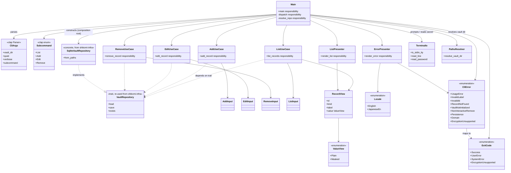
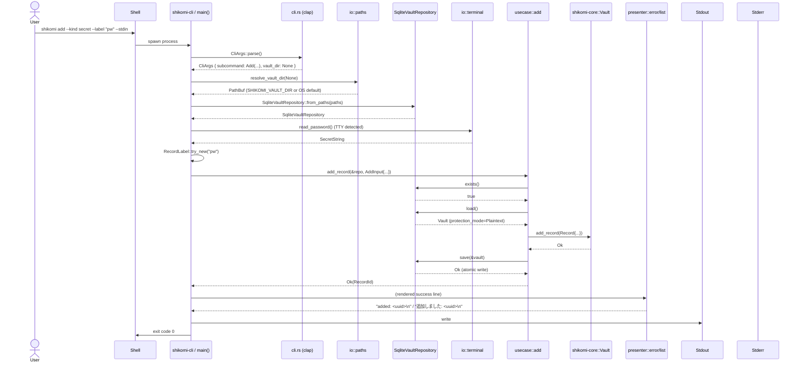

# 基本設計書

<!-- 詳細設計書とは別ファイル。統合禁止 -->
<!-- feature: cli-vault-commands / Issue #TBD -->
<!-- 配置先: docs/features/cli-vault-commands/basic-design.md -->

## 記述ルール（必ず守ること）

基本設計に**疑似コード・サンプル実装（python/ts/go 等の言語コードブロック）を書くな**。
ソースコードと二重管理になりメンテナンスコストしか生まない。
ここでは Rust の関数シグネチャは**プレーンテキスト（インライン `code`）**で示し、実装本体は一切書かない。Mermaid 図 + 表 + 箇条書きで設計判断を記述する。

## モジュール構成

本 feature は `shikomi-cli` crate の内部構造を確定する。

| 機能ID | モジュール | ディレクトリ | 責務 |
|--------|----------|------------|------|
| REQ-CLI-001〜004 + Composition Root | `main` | `crates/shikomi-cli/src/main.rs` | clap パース / コンポジションルート / `SqliteVaultRepository` 具体型の組立 / UseCase ディスパッチ / 終了コード写像 |
| REQ-CLI-001〜004 | `usecase::list` / `usecase::add` / `usecase::edit` / `usecase::remove` | `crates/shikomi-cli/src/usecase/{list,add,edit,remove}.rs` | ドメイン操作の orchestration（`VaultRepository` trait のみに依存、具体型を知らない） |
| REQ-CLI-001 / 008 | `presenter::list` / `presenter::error` | `crates/shikomi-cli/src/presenter/{list,error}.rs` | 出力整形（表 / エラーメッセージ） |
| REQ-CLI-006〜008 | `error` | `crates/shikomi-cli/src/error.rs` | `CliError` / `ExitCode` / `MSG-CLI-xxx` への写像 |
| REQ-CLI-012 共通 DTO | `input` / `view` | `crates/shikomi-cli/src/input.rs` / `src/view.rs` | UseCase の入出力 DTO（`AddInput` / `EditInput` / `RemoveInput` / `RecordView` / `ValueView`） |
| REQ-CLI-005 / 011 | `io::terminal` | `crates/shikomi-cli/src/io/terminal.rs` | TTY 判定 / プロンプト入力 / secret の非エコー読取 |
| REQ-CLI-005 | `io::paths` | `crates/shikomi-cli/src/io/paths.rs` | `--vault-dir` / `SHIKOMI_VAULT_DIR` / OS デフォルトの優先順位解決 |

```
ディレクトリ構造:
crates/shikomi-cli/src/
  main.rs                 # clap derive + main() + Composition Root
  cli.rs                  # clap Parser 派生型（Args 構造体のみ。コマンド分岐は main.rs）
  error.rs                # CliError / ExitCode / MSG-CLI-xxx メッセージ写像
  input.rs                # AddInput / EditInput / RemoveInput / ListInput
  view.rs                 # RecordView / ValueView
  usecase/
    mod.rs                # 各 UseCase の再エクスポート
    list.rs               # list_records
    add.rs                # add_record
    edit.rs               # edit_record
    remove.rs             # remove_record
  presenter/
    mod.rs                # Locale enum + 各 Presenter 再エクスポート
    list.rs               # render_list
    error.rs              # render_error（英語 / 日本語併記）
  io/
    mod.rs                # re-export
    paths.rs              # resolve_vault_dir()
    terminal.rs           # is_stdin_tty / read_line / read_password
```

**モジュール設計方針**:

- **Composition Root を `main.rs` 1 箇所に閉じる**: `SqliteVaultRepository` の具体型参照は `main.rs` のみ。`usecase` / `presenter` からは `&dyn VaultRepository` 経由でしかアクセスしない。**Phase 2（daemon IPC 経由）への移行時は `main.rs` の 1 行（リポジトリ構築位置）だけを `IpcVaultRepository::connect(...)` に差し替える**。
- **`usecase` は I/O を持たない**: UseCase 関数は `&dyn VaultRepository` を引数に取り、TTY 操作・clap パース・stdout 書き出しは一切行わない。これにより UseCase 単位で純粋な結合テストが書ける（モック `VaultRepository` 実装 + 入力 DTO で完結）。
- **`presenter` は副作用を持たない**: `String` を返す pure function のみ。stdout への書き出しは `main.rs` の責務（`println!("{}", rendered)`）。
- **`io::terminal` は副作用を持つ**: TTY 判定 / stdin 読取 / secret 入力はここに隔離。UseCase からは呼ばれず、`main.rs` が薄く wrap して `RemoveInput::confirmed` 等を組み立てる。
- **`cli.rs` は clap 派生型の置き場**: `main.rs` の肥大化を避けるため、`#[derive(Parser)]` 構造体を分離。コマンド分岐 `match` は `main.rs` に残す（コンポジションルートの凝集）。

## クラス設計（概要）

CLI 層の型依存を Mermaid クラス図で示す。具体的な関数シグネチャは詳細設計書を参照。



**設計判断メモ**:

- **`Main` が唯一の `SqliteVaultRepository` 参照者**: これが Phase 2 移行のレバレッジポイント。`usecase` / `presenter` は `VaultRepository` trait しか知らない。grep で `SqliteVaultRepository` の使用箇所が `main.rs` の 1 関数のみであることをレビュー必須条件とする。
- **入力 DTO（`AddInput` 等）を Vault 型で構築済みにする**: clap が渡す `String` / `&str` を `main.rs` 内で `RecordLabel::try_new` / `RecordId::try_from_str` / `SecretString::from_string` に通した**検証済み型**で UseCase へ渡す。UseCase 層で生 `String` を触らせない（Fail Fast を clap 直後に集中）。
- **`presenter` が `Locale` を受け取る**: i18n 切替を presenter 引数で表現。presenter はテスト時に明示的に locale を渡せる（環境変数依存を排除、テスト再現性）。
- **`CliError` と `ExitCode` を分離**: `CliError` はバリアント表現、`ExitCode` は終了コード値。`impl From<&CliError> for ExitCode` で一方向写像（Tell, Don't Ask）。
- **`TerminalIo` と `PathsResolver` を別モジュール**: TTY 判定は `is-terminal` 依存、path 解決は `dirs` / `shikomi-infra::VaultPaths` 依存。責務と依存が異なるため分離。
- **`cli.rs` が clap 派生型専用**: clap の `#[derive(Parser)]` はファイル先頭に `use clap::Parser;` と多数の attribute を要するため、`main.rs` から切り出して凝集を保つ。

## 処理フロー

本 feature の主要フローは「CLI 起動 → clap パース → UseCase 実行 → Presenter 整形 → stdout/stderr 出力 → 終了コード」の 1 本道。コマンドごとに分岐点を示す。

### 共通: 起動〜リポジトリ構築

1. `main()` がプロセス起動
2. `CliArgs::parse()` で clap パース（失敗時は clap の自動終了コード 2 とメッセージが出るが、本 feature の `ExitCode::UserError (1)` と衝突するため**clap の `Command::error_handling(false)` 等で上書き**して 1 に揃える。詳細設計で具体化）
3. `io::paths::resolve_vault_dir(args.vault_dir.as_deref())` で vault ディレクトリ決定
4. `shikomi_infra::persistence::VaultPaths::new(vault_dir)` を構築
5. `shikomi_infra::persistence::SqliteVaultRepository::from_paths(paths)` を構築（**本 feature で新規追加する API**、既存 `new()` のリファクタで内部的に `from_paths` を呼ぶ）
6. `args.subcommand` で分岐してコマンドごとのフロー（後述）へ
7. Ok/Err を `ExitCode` に写像し `std::process::exit(code)`

### REQ-CLI-001: `list` コマンドフロー

1. `usecase::list::list_records(&repo)` を呼ぶ
2. UseCase 内: `repo.exists()` → false なら `CliError::VaultNotInitialized(path)`
3. `repo.load()` → `PersistenceError::Corrupted` なら `CliError::Persistence(...)` / `Io` も同様
4. `vault.protection_mode() == Encrypted` なら `CliError::EncryptionUnsupported`
5. `vault.records()` を走査し、各レコードから `RecordView` を構築（Secret は `ValueView::Masked`、Text は `ValueView::Plain(<先頭 40 文字>)`）
6. `Vec<RecordView>` を返却
7. `main` が `presenter::list::render_list(&views)` で整形
8. stdout に書き出して終了コード 0

**エラー時の流れ**: UseCase が `Result<_, CliError>` を返す → `main` が `presenter::error::render_error(&err, locale)` で整形 → stderr に書き出し → `ExitCode::from(&err)` で終了コード決定

### REQ-CLI-002: `add` コマンドフロー

1. `main` で `--value` と `--stdin` の併用検出 → 併用なら `CliError::UsageError("--value and --stdin are mutually exclusive")`
2. `main` で値取得: `--value` 指定なら `SecretString::from_string(v)` / `--stdin` なら `io::terminal::read_password_or_line(kind)` → `SecretString::from_string(buf)` （kind=secret かつ TTY なら非エコー、それ以外は通常 readline）
3. `main` で警告判定: `--kind secret && --value` なら MSG-CLI-050 を stderr に出力
4. `main` で `RecordLabel::try_new(label)` / `RecordKind` 変換（clap の enum 派生で完了）→ 失敗は即 `CliError::InvalidLabel(...)`
5. `AddInput { kind, label, value }` を構築
6. `usecase::add::add_record(&repo, input)` を呼ぶ
7. UseCase 内:
   - `repo.exists()` → false なら新規 `Vault::new(VaultHeader::new_plaintext(VaultVersion::CURRENT, now)?)` を作成 / true なら `repo.load()` で既存を取得
   - 既存取得時、`vault.protection_mode() == Encrypted` なら `CliError::EncryptionUnsupported`
   - `uuid::Uuid::now_v7()` → `RecordId::new(uuid)` で id 生成
   - `RecordPayload::Plaintext(input.value)` で payload 構築（Text/Secret 両方ともプラテキストバリアント、kind は `input.kind`）
   - `Record::new(id, kind, label, payload, now)` で Record 構築
   - `vault.add_record(record)?` で集約に追加（重複 ID を集約が Fail Fast で検出）
   - `repo.save(&vault)?` で atomic write
   - `Ok(record_id)` を返却
8. `main` が `presenter` で `MSG-CLI-001` 整形 → stdout 出力

### REQ-CLI-003: `edit` コマンドフロー

1. `main` で `--value` と `--stdin` の併用検出 → 併用なら `CliError::UsageError`
2. `main` で `--label` / `--value` / `--stdin` / `--kind` のいずれも無指定 → `CliError::UsageError("at least one of --label/--value/--stdin/--kind is required")`
3. `main` で `RecordId::try_from_str(id)` / `RecordLabel::try_new(label)` 各検証
4. 値取得は REQ-CLI-002 と同じフロー
5. `EditInput { id, kind, label, value }` を構築（各 `Option<T>`）
6. `usecase::edit::edit_record(&repo, input)` を呼ぶ
7. UseCase 内:
   - `repo.exists()` → false なら `CliError::VaultNotInitialized`
   - `repo.load()` → モード検証
   - `vault.find_record(&input.id)` → 無ければ `CliError::RecordNotFound(id)`
   - `Record::with_updated_label` / `with_updated_payload` を集約メソッドで呼ぶ（Tell, Don't Ask）
   - `vault.update_record(&id, |old| ...)` で置換
   - `repo.save(&vault)?` で atomic write
   - `Ok(record_id)` を返却

### REQ-CLI-004: `remove` コマンドフロー

1. `main` で `RecordId::try_from_str(id)` を検証
2. `main` で確認判定:
   - `args.yes == true` → `confirmed = true`
   - `args.yes == false && io::terminal::is_stdin_tty() == true` → プロンプト表示 + 1 行読み取り → `y`/`Y` なら `true`、他は `false` → `false` のときは `main` 側で `println!("cancelled")` + `ExitCode::Success` で早期 return
   - `args.yes == false && is_stdin_tty() == false` → `CliError::NonInteractiveRemove`
3. `RemoveInput { id, confirmed: true }` を構築
4. `usecase::remove::remove_record(&repo, input)` を呼ぶ
5. UseCase 内:
   - `repo.exists()` → false なら `CliError::VaultNotInitialized`
   - `repo.load()` → モード検証
   - `vault.remove_record(&id)` → `DomainError::VaultConsistencyError(RecordNotFound(_))` なら `CliError::RecordNotFound(id)`
   - `repo.save(&vault)?` で atomic write

**確認プロンプトを UseCase の外に出す根拠**: UseCase の純粋性（I/O なし）を守るため、TTY 操作を `main` 側に寄せる。UseCase には「確認済み」のブール値だけ渡す。`RemoveInput { confirmed: bool }` が未確認（`false`）の場合、UseCase は `panic!("confirmed=false must be filtered by caller")` を許容する（`debug_assert!(input.confirmed)` で内部バグ検知）。

## シーケンス図

### 代表シーケンス: `shikomi add --kind secret --label "pw" --stdin`



### 代表シーケンス: 暗号化 vault 検出時の Fail Fast

```mermaid
sequenceDiagram
    actor User
    participant Main as shikomi-cli / main()
    participant Repo as SqliteVaultRepository
    participant UseCase as usecase::list
    participant Presenter as presenter::error
    participant Stderr

    User->>Main: shikomi list
    Main->>Repo: SqliteVaultRepository::from_paths(paths)
    Main->>UseCase: list_records(&repo)
    UseCase->>Repo: load()
    Repo-->>UseCase: Vault (protection_mode=Encrypted)
    UseCase->>UseCase: match mode -> Err(EncryptionUnsupported)
    UseCase-->>Main: Err(CliError::EncryptionUnsupported)
    Main->>Presenter: render_error(&err, locale)
    Presenter-->>Main: "error: this vault is encrypted; ...\nhint: ...\n"
    Main->>Stderr: write
    Main->>User: exit code 3
```

**Phase 2（daemon 経由）での差分**: `Main` が `SqliteVaultRepository::from_paths(...)` を呼ぶ代わりに `IpcVaultRepository::connect(socket_path)` を呼ぶ。`UseCase` / `Presenter` / `Vault` の関与は不変。

## アーキテクチャへの影響

`docs/architecture/` 配下への影響を網羅する。

### `context/process-model.md` §4.1 への追記（必須）

現行の「単一 daemon が真実源」「CLI/GUI は直接 vault を開かない」原則に対し、以下の MVP フェーズ区分を追加する:

- **MVP Phase 1（daemon 実装前、本 feature が該当）**: `shikomi-cli` は `shikomi-infra::VaultRepository` trait の `SqliteVaultRepository` 実装を**直接構築して使用**する。daemon が存在しないため IPC 経由は物理的に不可能。この期間、`shikomi-cli` と `shikomi-daemon`（未実装）が同一 vault.db に同時アクセスする状況は起き得ないため、advisory lock の競合も発生しない。
- **MVP Phase 2（daemon 実装後）**: `shikomi-daemon` が起動している場合、`shikomi-cli` は IPC 経由で daemon に操作を委任する。`IpcVaultRepository`（未実装、将来 feature）が `VaultRepository` trait を実装し、`shikomi-cli` のコンポジションルートが環境（daemon 起動有無）で `SqliteVaultRepository` / `IpcVaultRepository` を選択する。`shikomi-cli` 本体コード（UseCase / Presenter）は Phase 1 から無変更。
- **Phase 1 の受容リスク**: CLI と daemon（将来）の同時起動が発生した場合、既存の `VaultLock`（`shikomi-infra::persistence::lock`）により一方が `PersistenceError::Locked` で Fail Fast する。これは**設計通りの挙動**で、Phase 2 完了までに daemon 実装が追いつけば自動的に解消する。

この追記は `requirements.md` の「アーキテクチャ文書への影響」と `docs/features/cli-vault-commands/` 全体の前提条件として必須。本 feature の PR で同一コミットに含める。

### `tech-stack.md` への追記（軽微）

`[workspace.dependencies]` に `anyhow` / `is-terminal` / `rpassword` / `assert_cmd` / `predicates` を追加する。`clap` は既記載。tech-stack.md §2.1 / §4.4 への表追記は**detailed-design.md でバージョン確定後**に実施。

### `context/overview.md` / `threat-model.md` / `nfr.md` への影響

変更なし。既定のペルソナ / 脅威モデル / 非機能要件の枠内で本 feature を設計している。

## 外部連携

該当なし — 理由: 本 feature は外部サービス（HTTP / gRPC / 他プロセス IPC）と接続しない。TTY / stdin / stdout / stderr / 環境変数 / ファイルシステム（`shikomi-infra` 経由）のみを扱う。

## UX設計

### 成功時の出力テンプレート

```
added: 018f1234-5678-7abc-9def-123456789abc
```

```
updated: 018f1234-5678-7abc-9def-123456789abc
```

```
removed: 018f1234-5678-7abc-9def-123456789abc
```

`LANG=ja_JP.UTF-8` の場合は直下に日本語訳を追加:

```
added: 018f1234-5678-7abc-9def-123456789abc
追加しました: 018f1234-5678-7abc-9def-123456789abc
```

### エラー時の出力テンプレート（stderr）

```
error: invalid label: empty string is not allowed
error: 不正なラベル: 空文字列は使えません
hint: labels must be non-empty and at most 255 graphemes; control chars except \t\n\r are not allowed
hint: ラベルは 1 文字以上 255 grapheme 以下で、\t\n\r 以外の制御文字は禁止です
```

### `list` の出力テンプレート

レコード 0 件の場合: stdout に `no records\n` のみ（i18n で日本語併記）。ヘッダ行は出さない（空 vault を明示）。

### ペルソナごとの UX 考慮

| ペルソナ | 焦点 | 本 feature での実装 |
|---------|------|------------------|
| 山田（FE エンジニア） | CLI で設定同期したい | `SHIKOMI_VAULT_DIR` 環境変数での vault dir 切替、`assert_cmd` で E2E 記述可能 |
| 田中（営業職） | GUI 未実装中の暫定 CLI | エラーメッセージ日本語併記、`--help` 充実 |
| 佐々木（総務） | 本 feature の対象外（GUI ユーザ） | 対応なし。GUI feature で扱う |

## セキュリティ設計

### 脅威モデル（CLI 層の追加視点）

CLI 層は `docs/architecture/context/threat-model.md` で既に定義された脅威を**新たに増やすものではない**が、以下の経路を設計時点で封じる。

| 想定攻撃 / 事故 | 経路 | 保護資産 | 対策 |
|--------------|------|---------|------|
| shell 履歴経由の secret 漏洩 | `shikomi add --kind secret --value "pw"` が `.bash_history` / `zsh_history` に残る | Secret レコードの平文値 | MSG-CLI-050 警告を stderr に出力、`--stdin` 経路を推奨ドキュメント化 |
| stdout / stderr 経由の secret 漏洩 | `list` 出力や panic メッセージに Secret 値が混入 | Secret レコードの平文値 | `SecretString::Debug` が `"[REDACTED]"` 固定、`ValueView::Masked` で `list` 整形時に値を生成しない、panic hook で secret 露出チェック |
| ログ経由の secret 漏洩 | `tracing::{info,debug}!` で `Record` / `Vault` をそのまま出力 | Secret レコードの平文値 | UseCase / Presenter で `tracing` を呼ぶ際、ラベル・ID のみを引数にし、`SecretString` を触らない |
| 非対話スクリプトからの意図せぬ削除 | CI スクリプトで `shikomi remove --id ...` を `--yes` なしで実行 | レコード存在 | REQ-CLI-011: 非 TTY で `--yes` 未指定なら `CliError::NonInteractiveRemove` で Fail Fast |
| 暗号化 vault への誤操作 | 暗号化 vault に `add` / `edit` / `remove` が走り、平文 Record を混在させる | vault 整合性 | REQ-CLI-009: 全コマンドで `load()` 直後にモードチェック、暗号化なら Fail Fast（`ExitCode::EncryptionUnsupported = 3`） |
| vault dir の path traversal | `--vault-dir "/etc/../home/user/evil"` 等 | ファイルシステム | `shikomi-infra::VaultPaths::new` の既存検証（`PROTECTED_PATH_PREFIXES` 他）に一任、CLI 層で独自検証を重ねない（DRY） |
| fail open（エラー握り潰し） | `repo.save()` が失敗したが stdout に `added: ...` を出してしまう | データ整合性 | UseCase は `Result<_, CliError>` を返し、`main` は `Ok` のみ Presenter を呼ぶ（握り潰しの型エラー化） |

### OWASP Top 10 対応

本 feature は CLI 層のため項目ごとに該当度が異なる。

| # | カテゴリ | 対応状況 |
|---|---------|---------|
| A01 | Broken Access Control | **対応** — vault path は OS ファイルパーミッション（既存）と `shikomi-infra::VaultPaths` の `PROTECTED_PATH_PREFIXES` 検証（既存）に委譲。CLI 層で独自のアクセス制御は行わない |
| A02 | Cryptographic Failures | **対応** — 暗号化未対応のため暗号処理は発生しない。`SecretString` が `Debug` / `Serialize` 非露出を型で保証（既存）。本 feature は剥ぎ落とし禁止のルールを徹底 |
| A03 | Injection | **対応** — CLI フラグはすべて `RecordLabel` / `RecordId` / `RecordKind` / `SecretString` などの検証済み型に変換してから UseCase に渡す。生 `String` を SQL / シェルに流さない（SQLite クエリは `rusqlite` のパラメータバインディングを既存 infra が使用） |
| A04 | Insecure Design | **対応** — UseCase / Presenter / IO 分離で責務が明確。`VaultRepository` trait 経由で Phase 2 への移行パスが担保されている |
| A05 | Security Misconfiguration | **対応** — 本 feature で設定項目は `--vault-dir` / `LANG` 環境変数のみ。デフォルトは OS 標準位置で安全 |
| A06 | Vulnerable Components | **対応** — 追加依存は `clap` / `anyhow` / `is-terminal` / `rpassword` / `assert_cmd` / `predicates`。いずれも `cargo-deny` で CI チェック済み。`rpassword` は TOCTOU の既知脆弱性情報なし（最新 7.x を使用）|
| A07 | Auth Failures | 対象外 — 本 feature は認証機能を持たない |
| A08 | Data Integrity Failures | **対応** — vault の atomic write（既存 infra）で書込み失敗時の部分更新を防ぐ。本 feature は save 失敗時の stdout 誤出力を型で防止 |
| A09 | Logging Failures | **対応** — `tracing` 呼び出しで Secret 値を触らないルールを UseCase で徹底。ログ経路の漏洩は panic hook + 結合テストで検証 |
| A10 | SSRF | 対象外 — HTTP リクエストを発行しない |

## ER図

本 feature は独自の永続化スキーマを持たない。vault.db のスキーマは `docs/features/vault-persistence/detailed-design/` で定義済み。以下は CLI 層が扱う**ランタイム DTO の関係**を ER 図で表現する。

```mermaid
erDiagram
    CLI_ARGS ||--|| SUBCOMMAND : parses_to
    SUBCOMMAND ||--o| ADD_INPUT : when_Add
    SUBCOMMAND ||--o| EDIT_INPUT : when_Edit
    SUBCOMMAND ||--o| REMOVE_INPUT : when_Remove
    SUBCOMMAND ||--o| LIST_INPUT : when_List

    ADD_INPUT {
        RecordKind kind
        RecordLabel label
        SecretString value
    }
    EDIT_INPUT {
        RecordId id
        RecordKind kind_opt
        RecordLabel label_opt
        SecretString value_opt
    }
    REMOVE_INPUT {
        RecordId id
        bool confirmed "always true when passed to usecase"
    }
    LIST_INPUT {
        empty "no fields (placeholder for future flags)"
    }

    LIST_INPUT ||--o{ RECORD_VIEW : produces
    RECORD_VIEW {
        RecordId id
        RecordKind kind
        RecordLabel label
        ValueView value
    }
    RECORD_VIEW ||--|| VALUE_VIEW : embeds
    VALUE_VIEW {
        string variant "Plain | Masked"
        string plain_text "set when Plain"
    }

    ADD_INPUT ||--o{ CLI_ERROR : may_produce
    EDIT_INPUT ||--o{ CLI_ERROR : may_produce
    REMOVE_INPUT ||--o{ CLI_ERROR : may_produce
    LIST_INPUT ||--o{ CLI_ERROR : may_produce
    CLI_ERROR ||--|| EXIT_CODE : maps_to
```

**整合性ルール**:

- `REMOVE_INPUT.confirmed == true` が UseCase 呼び出し時の必須事前条件（`debug_assert!` で検出）
- `EDIT_INPUT` の 4 つの Option フィールドのうち少なくとも 1 つは `Some` であること（`main` で検証、UseCase は前提として扱う）
- `RECORD_VIEW.value == Masked` のとき stdout / stderr のどこにも plain 値が流れないこと（結合テストで検証）
- `ADD_INPUT.value` が `SecretString` で保持されていることは Rust 型検査でコンパイル時保証

## エラーハンドリング方針

| 例外種別 | 処理方針 | ユーザへの通知 |
|---------|---------|----------------|
| clap パース失敗（不正フラグ / 未知サブコマンド） | clap の自動エラー表示を使うが、終了コードを 1 に揃える（clap デフォルトは 2） | clap 生成メッセージ + `ExitCode::UserError` |
| フラグ併用違反（`--value` + `--stdin` 等） | `main` で検出 → `CliError::UsageError` | MSG-CLI-100 相当（英語 + 日本語） |
| ドメイン検証失敗（`RecordLabel::try_new` / `RecordId::try_from_str`） | `main` で検出 → `CliError::InvalidLabel(DomainError)` / `InvalidId(DomainError)` | MSG-CLI-101 / 102 |
| vault 未作成（`add` 以外） | UseCase で検出 → `CliError::VaultNotInitialized(PathBuf)` | MSG-CLI-104 |
| 対象レコード不存在 | UseCase で `find_record` → `None` → `CliError::RecordNotFound(id)` | MSG-CLI-106 |
| 暗号化 vault 検出 | UseCase で `protection_mode()` チェック → `CliError::EncryptionUnsupported` | MSG-CLI-103（終了コード 3） |
| 非 TTY で `remove --yes` 未指定 | `main` で検出 → `CliError::NonInteractiveRemove` | MSG-CLI-105 |
| `PersistenceError::{Io,Locked,Permission}` | UseCase で `CliError::Persistence(...)` にラップ | MSG-CLI-107 |
| `PersistenceError::Corrupted` | 同上 | MSG-CLI-108 |
| 想定外の `DomainError`（集約の整合性バグ等） | UseCase で `CliError::Domain(...)` にラップ | MSG-CLI-109（内部バグ報告誘導） |
| panic（プログラムバグ） | `main` の `catch_unwind` または `std::panic::set_hook` で **secret 露出なしの形式**でラップし stderr に出力 | MSG-CLI-109 + 終了コード 2 |

**本 feature での禁止事項**:

- `Result<T, String>` / `Result<T, Box<dyn Error>>` をモジュール公開 API で使わない（情報欠損）
- `unwrap()` / `expect()` を本番コードパスで使わない（テストコードは許容、ただし `expect("reason")` で理由必須）
- `?` を使う前に UseCase 層で `CliError` に `From` 変換を明示的に定義する。UseCase の戻り値は必ず `Result<_, CliError>` で揃える
- エラーを握り潰さない。`if let Err(_) = ... {}` を無言で通過しない
- `eprintln!` / `println!` を UseCase から呼ばない（`main.rs` と `presenter` のみ）
- `tracing` マクロに `SecretString` を含む値を渡さない（`tracing` は type-erase するため `Debug` 経路で redact はされるが、**経路自体を設けない**方針で追加防壁）
