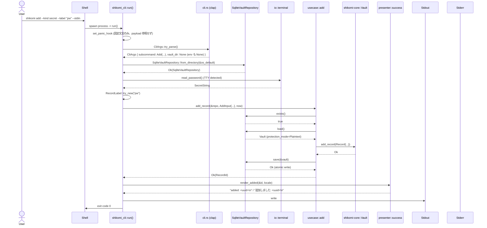

# 基本設計書 — flows（処理フロー / シーケンス図）

<!-- 詳細設計書とは別ファイル。統合禁止 -->
<!-- feature: cli-vault-commands / Issue #TBD -->
<!-- 配置先: docs/features/cli-vault-commands/basic-design/flows.md -->
<!-- 兄弟: ./index.md, ./security.md, ./error.md -->

## 記述ルール

本書には**疑似コード・サンプル実装を書かない**（設計書共通ルール）。処理フローは番号付き箇条書き、シーケンスは Mermaid `sequenceDiagram` で表現する。

## 処理フロー

本 feature の主要フローは「CLI 起動 → clap パース → UseCase 実行 → Presenter 整形 → stdout/stderr 出力 → 終了コード」の 1 本道。コマンドごとに分岐点を示す。

### 共通: 起動〜リポジトリ構築

1. `main()` がプロセス起動 → `shikomi_cli::run()` を呼ぶ
2. `run()` 内で最初に `std::panic::set_hook(Box::new(panic_hook))` を登録（`./security.md §panic hook と secret 漏洩経路の遮断` 参照）
3. `CliArgs::try_parse()` で clap パース
   - `--vault-dir` は `#[arg(long, global = true, env = "SHIKOMI_VAULT_DIR")]` で**env もここで自動吸収**（真実源は clap のみ、`std::env::var` を下流で呼ばない）
   - パース失敗時: `ErrorKind` を判定し `DisplayHelp` / `DisplayVersion` は clap の自動出力 + 終了コード 0、その他は本 feature の `ExitCode::UserError (1)` で揃える
4. `args.vault_dir` を見て repository を構築
   - `Some(path)` → `SqliteVaultRepository::from_directory(&path)`
   - `None` → `io::paths::resolve_os_default_vault_dir()` → `SqliteVaultRepository::from_directory(&os_default)`
5. `args.subcommand` で分岐してコマンドごとのフロー（後述）へ
6. Ok/Err を `ExitCode` に写像し return

### REQ-CLI-001: `list` コマンドフロー

1. `usecase::list::list_records(&repo)` を呼ぶ
2. UseCase 内: `repo.exists()` → false なら `CliError::VaultNotInitialized(path)`
3. `repo.load()` → `PersistenceError::Corrupted` なら `CliError::Persistence(...)` / `Io` も同様
4. `vault.protection_mode() == Encrypted` なら `CliError::EncryptionUnsupported`
5. `vault.records()` を走査し、各レコードから `RecordView` を構築（Secret は `ValueView::Masked`、Text は `ValueView::Plain(<先頭 40 文字>)`）
6. `Vec<RecordView>` を返却
7. `run()` が `presenter::list::render_list(&views, locale)` で整形
8. stdout に書き出して終了コード 0

**エラー時の流れ**: UseCase が `Result<_, CliError>` を返す → `run()` が `presenter::error::render_error(&err, locale)` で整形 → stderr に書き出し → `ExitCode::from(&err)` で終了コード決定

### REQ-CLI-002: `add` コマンドフロー

1. `run()` で `--value` と `--stdin` の併用検出 → 併用なら `CliError::UsageError("--value and --stdin are mutually exclusive")`
2. `run()` で値取得: `--value` 指定なら `SecretString::from_string(v)` / `--stdin` なら `io::terminal::read_password_or_line(kind)` → `SecretString::from_string(buf)` （kind=secret かつ TTY なら非エコー、それ以外は通常 readline）
3. `run()` で警告判定: `--kind secret && --value` なら MSG-CLI-050 を stderr に出力
4. `run()` で `RecordLabel::try_new(label)` / `RecordKind` 変換（clap の enum 派生で完了）→ 失敗は即 `CliError::InvalidLabel(...)`
5. `AddInput { kind, label, value }` を構築 / `now = OffsetDateTime::now_utc()`
6. `usecase::add::add_record(&repo, input, now)` を呼ぶ
7. UseCase 内:
   - `repo.exists()` → false なら新規 `Vault::new(VaultHeader::new_plaintext(VaultVersion::CURRENT, now)?)` を作成 / true なら `repo.load()` で既存を取得
   - 既存取得時、`vault.protection_mode() == Encrypted` なら `CliError::EncryptionUnsupported`
   - `uuid::Uuid::now_v7()` → `RecordId::new(uuid)` で id 生成
   - `RecordPayload::Plaintext(input.value)` で payload 構築（Text/Secret 両方ともプラテキストバリアント、kind は `input.kind`）
   - `Record::new(id, kind, label, payload, now)` で Record 構築
   - `vault.add_record(record)?` で集約に追加（重複 ID を集約が Fail Fast で検出）
   - `repo.save(&vault)?` で atomic write
   - `Ok(record_id)` を返却
8. `run()` が `presenter` で `MSG-CLI-001` 整形 → stdout 出力

### REQ-CLI-003: `edit` コマンドフロー

1. `run()` で `--value` と `--stdin` の併用検出 → 併用なら `CliError::UsageError`
2. `run()` で `--label` / `--value` / `--stdin` のいずれも無指定 → `CliError::UsageError("at least one of --label/--value/--stdin is required")`
3. `run()` で `RecordId::try_from_str(id)` / `RecordLabel::try_new(label)` 各検証
4. 値取得は REQ-CLI-002 と同じフロー
5. `EditInput { id, label, value }` を構築（各 `Option<T>`、`kind` フィールドは持たない）/ `now = OffsetDateTime::now_utc()`
6. `usecase::edit::edit_record(&repo, input, now)` を呼ぶ
7. UseCase 内:
   - `repo.exists()` → false なら `CliError::VaultNotInitialized`
   - `repo.load()` → モード検証
   - `vault.find_record(&input.id)` → 無ければ `CliError::RecordNotFound(id)`
   - `Record::with_updated_label(now)` / `Record::with_updated_payload(now)` を集約メソッドで呼ぶ（Tell, Don't Ask）
   - `vault.update_record(&id, |old| ...)` で置換
   - `repo.save(&vault)?` で atomic write
   - `Ok(record_id)` を返却

### REQ-CLI-004: `remove` コマンドフロー

1. `run()` で `RecordId::try_from_str(id)` を検証
2. `run()` で確認判定:
   - `args.yes == true` → `confirmed = true`
   - `args.yes == false && io::terminal::is_stdin_tty() == true` → プロンプト表示 + 1 行読み取り → `y`/`Y` なら `true`、他は `false` → `false` のときは `run()` 側で `println!("cancelled")` + `ExitCode::Success` で早期 return
   - `args.yes == false && is_stdin_tty() == false` → `CliError::NonInteractiveRemove`
3. `ConfirmedRemoveInput::new(id)` を構築（**`confirmed == true` を経ない経路ではそもそも構築しない**、コンパイル時 Fail Fast）
4. `usecase::remove::remove_record(&repo, input)` を呼ぶ
5. UseCase 内:
   - `repo.exists()` → false なら `CliError::VaultNotInitialized`
   - `repo.load()` → モード検証
   - `vault.remove_record(&input.id)` → `DomainError::VaultConsistencyError(RecordNotFound(_))` なら `CliError::RecordNotFound(id)`
   - `repo.save(&vault)?` で atomic write

**確認プロンプトを UseCase の外に出す根拠**: UseCase の純粋性（I/O なし）を守るため、TTY 操作を `run()` 側に寄せる。UseCase には**確認を経たことを表す型 `ConfirmedRemoveInput`** だけ渡す。`bool` フィールドを持たないため `debug_assert!` 不要、コンパイル時に事前条件が強制される。

## シーケンス図

### 代表シーケンス: `shikomi add --kind secret --label "pw" --stdin`



### 代表シーケンス: 暗号化 vault 検出時の Fail Fast

```mermaid
sequenceDiagram
    actor User
    participant Run as shikomi_cli::run()
    participant Repo as SqliteVaultRepository
    participant UseCase as usecase::list
    participant Presenter as presenter::error
    participant Stderr

    User->>Run: shikomi list
    Run->>Repo: SqliteVaultRepository::from_directory(&path)
    Run->>UseCase: list_records(&repo)
    UseCase->>Repo: load()
    Repo-->>UseCase: Vault (protection_mode=Encrypted)
    UseCase->>UseCase: match mode -> Err(EncryptionUnsupported)
    UseCase-->>Run: Err(CliError::EncryptionUnsupported)
    Run->>Presenter: render_error(&err, locale)
    Presenter-->>Run: "error: this vault is encrypted; ...\nhint: ...\n"
    Run->>Stderr: write
    Run->>User: exit code 3
```

**Phase 2（daemon 経由）での差分**: `Run` が `SqliteVaultRepository::from_directory(...)` を呼ぶ代わりに `IpcVaultRepository::connect(socket_path)` を呼ぶ。`UseCase` / `Presenter` / `Vault` の関与は不変。
