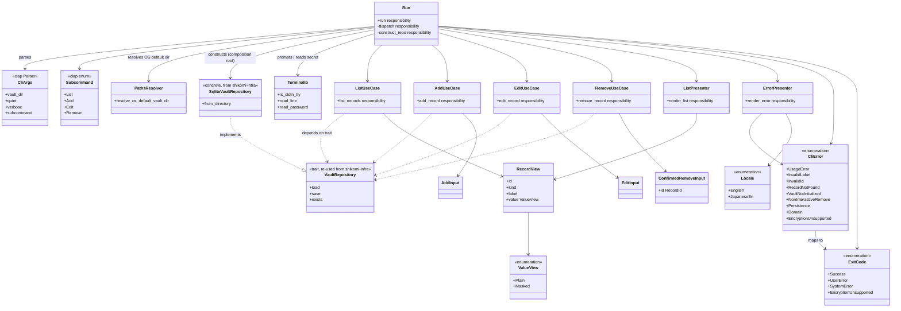
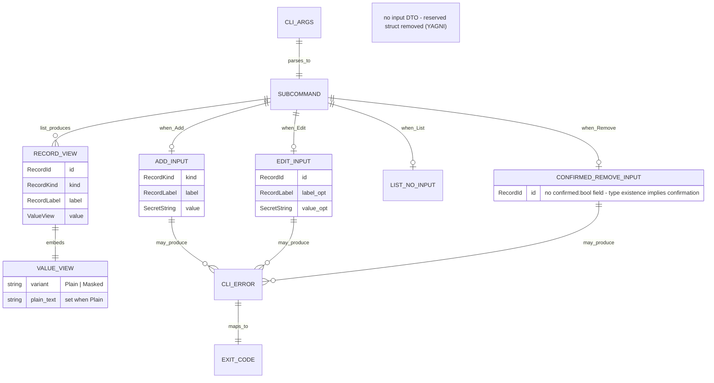

# 基本設計書 — index（モジュール / クラス / 処理フロー / シーケンス / 外部連携 / ER）

<!-- 詳細設計書とは別ファイル。統合禁止 -->
<!-- feature: cli-vault-commands / Issue #TBD -->
<!-- 配置先: docs/features/cli-vault-commands/basic-design/index.md -->
<!-- 兄弟: ./security.md（セキュリティ設計）, ./error.md（エラーハンドリング方針） -->

## 記述ルール（必ず守ること）

基本設計に**疑似コード・サンプル実装（python/ts/go 等の言語コードブロック）を書くな**。
ソースコードと二重管理になりメンテナンスコストしか生まない。
ここでは Rust の関数シグネチャは**プレーンテキスト（インライン `code`）**で示し、実装本体は一切書かない。Mermaid 図 + 表 + 箇条書きで設計判断を記述する。

`basic-design.md` 単一ファイルの 500 行超えを避けるため、本基本設計は次の 3 ファイルに分割する（PR #18 レビューでペガサス指摘）:

| ファイル | 担当領域 |
|---------|---------|
| `index.md` | モジュール構成 / クラス設計（概要）/ アーキテクチャへの影響 / 外部連携 / UX設計 / ER 図 |
| `flows.md` | 処理フロー / シーケンス図 |
| `security.md` | セキュリティ設計 / 脅威モデル / OWASP Top 10 / 依存 crate の CVE 確認結果 / `expose_secret` 経路監査 |
| `error.md` | エラーハンドリング方針 / 禁止事項 |

各ファイルは独立して読めるよう、内部参照は `./security.md §...` / `./error.md §...` 形式で記す。

## モジュール構成

本 feature は `shikomi-cli` crate の内部構造を確定する。**crate 構成は `[lib] + [[bin]]` の 2 ターゲット**（`requirements.md` §API仕様 参照）。

| 機能ID | モジュール | ディレクトリ | 責務 |
|--------|----------|------------|------|
| REQ-CLI-001〜004 + Composition Root | `shikomi_cli::run` | `crates/shikomi-cli/src/lib.rs` | `run() -> ExitCode`。clap パース / コンポジションルート / `SqliteVaultRepository::from_directory` 具体型の組立 / UseCase ディスパッチ / 終了コード写像 |
| （bin エントリ） | `shikomi` bin | `crates/shikomi-cli/src/main.rs` | `fn main() -> ExitCode { shikomi_cli::run() }` の 3 行 |
| REQ-CLI-001〜004 | `usecase::list` / `usecase::add` / `usecase::edit` / `usecase::remove` | `crates/shikomi-cli/src/usecase/{list,add,edit,remove}.rs` | ドメイン操作の orchestration（`VaultRepository` trait のみに依存、具体型を知らない） |
| REQ-CLI-001 / 008 | `presenter::list` / `presenter::error` / `presenter::success` / `presenter::warning` | `crates/shikomi-cli/src/presenter/{list,error,success,warning}.rs` | 出力整形（pure function、副作用なし） |
| REQ-CLI-006〜008 | `error` | `crates/shikomi-cli/src/error.rs` | `CliError` / `ExitCode` / `MSG-CLI-xxx` への写像 |
| REQ-CLI-012 共通 DTO | `input` / `view` | `crates/shikomi-cli/src/input.rs` / `src/view.rs` | UseCase の入出力 DTO（`AddInput` / `EditInput` / `ConfirmedRemoveInput` / `RecordView` / `ValueView`） |
| REQ-CLI-005 / 011 | `io::terminal` | `crates/shikomi-cli/src/io/terminal.rs` | TTY 判定 / プロンプト入力 / secret の非エコー読取 |
| REQ-CLI-005 | `io::paths` | `crates/shikomi-cli/src/io/paths.rs` | OS デフォルト vault ディレクトリの解決（フラグ / env は clap 側に一任） |
| clap 派生型 | `cli` | `crates/shikomi-cli/src/cli.rs` | `#[derive(Parser)]` 構造体（`CliArgs` / `Subcommand` / `*Args` / `KindArg`） |

```
ディレクトリ構造:
crates/shikomi-cli/src/
  lib.rs                  # pub fn run() -> ExitCode   （Composition Root 本体）
  main.rs                 # fn main() -> ExitCode { shikomi_cli::run() }
  cli.rs                  # clap Parser 派生型（Args 構造体群）
  error.rs                # CliError / ExitCode / From 実装
  input.rs                # AddInput / EditInput / ConfirmedRemoveInput
  view.rs                 # RecordView / ValueView
  usecase/
    mod.rs                # 各 UseCase の再エクスポート
    list.rs               # list_records
    add.rs                # add_record
    edit.rs               # edit_record
    remove.rs             # remove_record
  presenter/
    mod.rs                # Locale enum + 各 Presenter 再エクスポート
    list.rs               # render_list
    error.rs              # render_error（英語 / 日本語併記）
    success.rs            # render_added / render_updated / render_removed / render_cancelled / render_initialized_vault
    warning.rs            # render_shell_history_warning
  io/
    mod.rs                # re-export
    paths.rs              # resolve_os_default_vault_dir()
    terminal.rs           # is_stdin_tty / read_line / read_password
```

**lib + bin 2 ターゲット構成の理由**:

- `[lib]` は結合テスト（`tests/` 配下）から `shikomi_cli::usecase::add::add_record(&MockRepo, input, now)` のように**UseCase 関数を直接呼ぶ**目的。bin only だと結合テストはプロセス起動 E2E でしか書けず、テストピラミッドの中段が欠落する（テスト設計と整合）。
- **全 `pub` 項目に `#[doc(hidden)]`** を付け、`cargo doc` で隠す。crate は `publish = false`（workspace.package 既定）のまま、crates.io 公開もしない。外部から参照される公開 API 契約を増やさない方針を型属性レベルで明示。
- `main.rs` は 3 行ラッパ（`fn main() -> ExitCode { shikomi_cli::run() }`）に絞り、ロジックは `lib.rs::run()` に集約。bin のテスト容易性・DX の両方を満たす。

**モジュール設計方針**:

- **Composition Root を `lib.rs::run()` 1 箇所に閉じる**: `SqliteVaultRepository` の具体型参照は `run()` のみ。`usecase` / `presenter` からは `&dyn VaultRepository` 経由でしかアクセスしない。**Phase 2（daemon IPC 経由）への移行時は `run()` の 1 行（リポジトリ構築位置）だけを `IpcVaultRepository::connect(...)` に差し替える**。
- **`usecase` は I/O を持たない**: UseCase 関数は `&dyn VaultRepository` と入力 DTO と `now: OffsetDateTime` を引数に取り、TTY 操作・clap パース・stdout 書き出し・`OffsetDateTime::now_utc()` 呼び出しは一切行わない。これにより UseCase 単位で純粋な結合テストが書ける（モック `VaultRepository` 実装 + 入力 DTO + 固定時刻で完結、再現性 100%）。
- **`presenter` は副作用を持たない**: `String` を返す pure function のみ。stdout への書き出しは `run()` の責務（`println!("{}", rendered)`）。
- **`io::terminal` は副作用を持つ**: TTY 判定 / stdin 読取 / secret 入力はここに隔離。UseCase からは呼ばれず、`run()` が薄く wrap して `ConfirmedRemoveInput::new(id)` 等を組み立てる。
- **`cli.rs` は clap 派生型の置き場**: `run()` の肥大化を避けるため、`#[derive(Parser)]` 構造体を分離。コマンド分岐 `match` は `run()` に残す。

## クラス設計（概要）

CLI 層の型依存を Mermaid クラス図で示す。具体的な関数シグネチャは詳細設計書（`../detailed-design/`）を参照。



**設計判断メモ**:

- **`Run` が唯一の `SqliteVaultRepository` 参照者**: これが Phase 2 移行のレバレッジポイント。`usecase` / `presenter` は `VaultRepository` trait しか知らない。grep で `SqliteVaultRepository` の使用箇所が `lib.rs` の 1 関数のみであることを CI と設計レビューの両方で検証する（`./security.md §expose_secret 経路監査` 同様の静的チェック方式）。
- **入力 DTO を Vault 型で構築済みにする**: clap が渡す `String` / `&str` を `run()` 内で `RecordLabel::try_new` / `RecordId::try_from_str` / `SecretString::from_string` に通した**検証済み型**で UseCase へ渡す。UseCase 層で生 `String` を触らせない（Fail Fast を clap 直後に集中、Parse, don't validate）。
- **`ConfirmedRemoveInput` の型強制**: `bool` フィールドを持たず、型の構築そのものが「確認経由」を意味する。TTY プロンプト or `--yes` の経路を通らなければこの型を作れない設計（`./error.md §確認強制の型レベル実装` 参照）。
- **`presenter` が `Locale` を受け取る**: `std::env::var("LANG")` を presenter 内部で呼ぶとテスト再現性が落ちるため、`run()` で 1 度決定した `Locale` を引数で渡す。
- **`CliError` と `ExitCode` を分離**: `CliError` はバリアント表現、`ExitCode` は終了コード値。`impl From<&CliError> for ExitCode` で一方向写像（Tell, Don't Ask）。
- **`TerminalIo` と `PathsResolver` を別モジュール**: TTY 判定は `is-terminal` 依存、path 解決は `dirs` 依存。責務と依存が異なるため分離。
- **`cli.rs` が clap 派生型専用**: clap の `#[derive(Parser)]` はファイル先頭に `use clap::Parser;` と多数の attribute を要するため、`lib.rs::run()` から切り出して凝集を保つ。

## 処理フロー / シーケンス図

`./flows.md` を参照（分割先）。起動〜リポジトリ構築、各コマンド（`list` / `add` / `edit` / `remove`）の処理フロー、代表シーケンス図（`add --stdin` 正常系 / 暗号化 vault Fail Fast）を含む。

## アーキテクチャへの影響

`docs/architecture/` 配下への影響を網羅する。

### `context/process-model.md` §4.1 への追記（実施済み）

本 feature の同一 PR で §4.1.1「MVP フェーズ区分」を追記済み。Phase 1（CLI 直結）/ Phase 2（daemon IPC 経由）の区分と移行戦略を明示。

### `tech-stack.md` への追記（軽微）

`[workspace.dependencies]` に `anyhow` / `is-terminal` / `rpassword` / `assert_cmd` / `predicates` を追加する。`clap` は既記載。`time` は既に workspace 管理。tech-stack.md への具体テーブル追記は**詳細設計（`../detailed-design/infra-changes.md`）でバージョン確定後**に実施。

### `context/overview.md` / `threat-model.md` / `nfr.md` への影響

変更なし。既定のペルソナ / 脅威モデル / 非機能要件の枠内で本 feature を設計している。

## 外部連携

該当なし — 理由: 本 feature は外部サービス（HTTP / gRPC / 他プロセス IPC）と接続しない。TTY / stdin / stdout / stderr / 環境変数 / ファイルシステム（`shikomi-infra` 経由）のみを扱う。

## UX設計

### 成功時の出力テンプレート

```
added: 018f1234-5678-7abc-9def-123456789abc
```

```
updated: 018f1234-5678-7abc-9def-123456789abc
```

```
removed: 018f1234-5678-7abc-9def-123456789abc
```

`LANG=ja_JP.UTF-8` の場合は直下に日本語訳を追加:

```
added: 018f1234-5678-7abc-9def-123456789abc
追加しました: 018f1234-5678-7abc-9def-123456789abc
```

### エラー時の出力テンプレート（stderr）

```
error: invalid label: empty string is not allowed
error: 不正なラベル: 空文字列は使えません
hint: labels must be non-empty and at most 255 graphemes; control chars except \t\n\r are not allowed
hint: ラベルは 1 文字以上 255 grapheme 以下で、\t\n\r 以外の制御文字は禁止です
```

### `list` の出力テンプレート

レコード 0 件の場合: stdout に `no records\n` のみ（i18n で日本語併記）。ヘッダ行は出さない（空 vault を明示）。

レコード 1 件以上の場合: 以下のテンプレートで stdout に整形出力（`requirements.md §出力フォーマット` と整合）。

```
ID                                    KIND    LABEL                                     VALUE
--                                    ----    -----                                     -----
018f1234-5678-7abc-9def-123456789abc  text    SSH: prod                                 ssh -J bastion prod01
018f9abc-cdef-7012-8345-67890abcdef0  secret  my password                               ****
```

- **ID カラムは UUIDv7 全長 36 文字をそのまま出力する**。トランケート / 短縮形（`018f1234-...-7890` 等）は行わない（ペガサス指摘による案 A 採用）
- 根拠: `list` で表示された ID を `remove --id` / `edit --id` にコピペしても `RecordId::try_from_str` を通過する導線を保つ（短縮形を採用すると `RecordId` 検証で Fail Fast され、ユーザの次の一手が詰む）
- 短縮表示は Phase 2 以降の別 feature（`cli-list-short-id` 相当、未起票）で検討。`RecordId` の prefix match は domain 型の変更を伴うため本 feature のスコープ外
- ラベル / 値カラムのみ 40 文字トランケート + 省略記号 `…` 付与（`presenter::list` の責務、詳細設計 `../detailed-design/public-api.md §presenter::list` 参照）

### ペルソナごとの UX 考慮

| ペルソナ | 焦点 | 本 feature での実装 |
|---------|------|------------------|
| 山田（FE エンジニア） | CLI で設定同期したい | `--vault-dir` フラグでの vault dir 切替、`assert_cmd` で E2E 記述可能 |
| 田中（営業職） | GUI 未実装中の暫定 CLI | エラーメッセージ日本語併記、`--help` 充実 |
| 佐々木（総務） | 本 feature の対象外（GUI ユーザ） | 対応なし。GUI feature で扱う |

## ER図

本 feature は独自の永続化スキーマを持たない。vault.db のスキーマは `docs/features/vault-persistence/detailed-design/` で定義済み。以下は CLI 層が扱う**ランタイム DTO の関係**を ER 図で表現する。



**整合性ルール**:

- `CONFIRMED_REMOVE_INPUT` は**値の存在そのものが確認経由を表す**。`confirmed: bool` フィールドは存在しないため、「未確認で削除」は型システムで封じられる。
- `EDIT_INPUT` の 2 つの `Option` フィールドのうち少なくとも 1 つは `Some` であること（`run()` で検証、UseCase は前提として扱う）
- `RECORD_VIEW.value == Masked` のとき stdout / stderr のどこにも plain 値が流れないこと（`./security.md §secret 漏洩監査 + CI grep` + E2E テストで検証）
- `ADD_INPUT.value` が `SecretString` で保持されていることは Rust 型検査でコンパイル時保証
- `list` UseCase は入力 DTO を取らない（`repo: &dyn VaultRepository` のみ）。空構造体の予約は不採用（YAGNI）

エラーハンドリング方針および禁止事項は `./error.md` 参照。セキュリティ設計および依存 crate の CVE 確認結果は `./security.md` 参照。
