# 詳細設計書

<!-- 基本設計書とは別ファイル。統合禁止 -->
<!-- feature: cli-vault-commands / Issue #TBD -->
<!-- 配置先: docs/features/cli-vault-commands/detailed-design.md -->

## 記述ルール（必ず守ること）

詳細設計に**疑似コード・サンプル実装（python/ts/go 等の言語コードブロック）を書くな**。
ソースコードと二重管理になりメンテナンスコストしか生まない。

本書では Rust の関数シグネチャは**プレーンテキスト（インライン `code`）**で示し、実装本体は一切書かない。Mermaid 図 + 表 + 箇条書きで設計判断を記述する。

## クラス設計（詳細）

### 全体像

```mermaid
classDiagram
    direction TB

    class CliArgs {
        <<struct derive Parser>>
        -vault_dir: Option~PathBuf~
        -quiet: bool
        -verbose: bool
        -subcommand: Subcommand
        +parse() CliArgs
    }

    class Subcommand {
        <<enum derive Subcommand>>
        +List
        +Add(AddArgs)
        +Edit(EditArgs)
        +Remove(RemoveArgs)
    }

    class AddArgs {
        -kind: KindArg
        -label: String
        -value: Option~String~
        -stdin: bool
    }
    class EditArgs {
        -id: String
        -kind: Option~KindArg~
        -label: Option~String~
        -value: Option~String~
        -stdin: bool
    }
    class RemoveArgs {
        -id: String
        -yes: bool
    }

    class KindArg {
        <<enum derive ValueEnum>>
        +Text
        +Secret
    }

    class AddInput {
        -kind: RecordKind
        -label: RecordLabel
        -value: SecretString
    }
    class EditInput {
        -id: RecordId
        -kind: Option~RecordKind~
        -label: Option~RecordLabel~
        -value: Option~SecretString~
    }
    class RemoveInput {
        -id: RecordId
        -confirmed: bool
    }
    class ListInput

    class RecordView {
        -id: RecordId
        -kind: RecordKind
        -label: RecordLabel
        -value: ValueView
    }
    class ValueView {
        <<enumeration>>
        +Plain(String_max_40)
        +Masked
    }

    class CliError {
        <<enumeration>>
        +UsageError(String)
        +InvalidLabel(DomainError)
        +InvalidId(DomainError)
        +RecordNotFound(RecordId)
        +VaultNotInitialized(PathBuf)
        +NonInteractiveRemove
        +Persistence(PersistenceError)
        +Domain(DomainError)
        +EncryptionUnsupported
    }

    class ExitCode {
        <<enumeration>>
        +Success = 0
        +UserError = 1
        +SystemError = 2
        +EncryptionUnsupported = 3
        +from_cli_error(err) ExitCode
    }

    class Locale {
        <<enumeration>>
        +English
        +JapaneseEn
        +detect_from_env() Locale
    }

    class ListUseCase {
        +list_records(repo) Result~Vec_RecordView_, CliError~
    }
    class AddUseCase {
        +add_record(repo, input, now) Result~RecordId, CliError~
    }
    class EditUseCase {
        +edit_record(repo, input, now) Result~RecordId, CliError~
    }
    class RemoveUseCase {
        +remove_record(repo, input) Result~RecordId, CliError~
    }

    class ListPresenter {
        +render_list(views, locale) String
        +render_empty(locale) String
    }
    class SuccessPresenter {
        +render_added(id, locale) String
        +render_updated(id, locale) String
        +render_removed(id, locale) String
        +render_cancelled(locale) String
        +render_initialized_vault(path, locale) String
    }
    class ErrorPresenter {
        +render_error(err, locale) String
    }
    class WarningPresenter {
        +render_shell_history_warning(locale) String
    }

    class TerminalIo {
        +is_stdin_tty() bool
        +read_line(prompt) io_Result~String~
        +read_password(prompt) io_Result~SecretString~
    }

    class PathsResolver {
        +resolve_vault_dir(flag_opt) Result~PathBuf, CliError~
    }

    class VaultRepository {
        <<trait re-used>>
    }
    class SqliteVaultRepository {
        <<concrete re-used from shikomi-infra>>
        +from_paths(paths) Self
    }

    CliArgs --> Subcommand
    Subcommand --> AddArgs
    Subcommand --> EditArgs
    Subcommand --> RemoveArgs

    AddArgs ..> AddInput : converts via main
    EditArgs ..> EditInput
    RemoveArgs ..> RemoveInput

    AddInput --> RecordKind
    AddInput --> RecordLabel
    AddInput --> SecretString

    AddUseCase --> AddInput
    EditUseCase --> EditInput
    RemoveUseCase --> RemoveInput
    ListUseCase --> ListInput
    ListUseCase --> RecordView
    RecordView --> ValueView

    ListPresenter --> RecordView
    ListPresenter --> Locale
    SuccessPresenter --> Locale
    ErrorPresenter --> CliError
    ErrorPresenter --> Locale
    WarningPresenter --> Locale

    ListUseCase ..> VaultRepository
    AddUseCase ..> VaultRepository
    EditUseCase ..> VaultRepository
    RemoveUseCase ..> VaultRepository

    SqliteVaultRepository ..|> VaultRepository : implements

    CliError --> ExitCode : maps via From
    ListUseCase ..> CliError
    AddUseCase ..> CliError
    EditUseCase ..> CliError
    RemoveUseCase ..> CliError
```

### 設計判断の補足

**1. なぜ `AddArgs` / `EditArgs` / `RemoveArgs` と `AddInput` / `EditInput` / `RemoveInput` を分けるか**:
- `*Args` は clap 派生型で**生の `String` / `bool` / `Option<String>`** を持つ。ユーザ入力を忠実に表現する DTO。
- `*Input` は**ドメイン検証済み型**（`RecordLabel` / `RecordId` / `SecretString`）で UseCase に渡すデータ。
- 分離することで「clap が変わっても UseCase は変わらない」「UseCase が変わっても clap は変わらない」を型境界で担保（SRP）。`main` のみが両者の変換役。

**2. なぜ `KindArg` と `RecordKind` を分けるか**:
- `RecordKind` は `shikomi-core` のドメイン列挙（本 feature で変更しない）。
- `KindArg` は clap `ValueEnum` 派生の CLI 用列挙。`clap::builder::EnumValueParser` が要求する trait 境界（`Clone + ValueEnum`）を `shikomi-core` に持ち込むと、`shikomi-core` が `clap` に依存することになり**Clean Arch の下層汚染**が起きる。
- `impl From<KindArg> for RecordKind` を CLI 側に置いて 1 方向写像。

**3. なぜ `ListUseCase::list_records` は `ListInput` を取らないか**:
- 現行 `ListInput` は空構造体（`struct ListInput;`）。将来 `--json` / `--kind <filter>` / `--limit <n>` 等のフラグを追加する余地として型を**先に確保**。
- 将来フラグ追加時、`main` の clap パース部分と `ListUseCase` の引数だけ変えれば済む（Presenter は別 feature で `--json` 対応）。
- 本 feature では実質的にフィールドなしだが、**型を作っておく**ことで Phase 2 / 将来 feature の変更インパクトを抑える（YAGNI 違反ではなく、**将来の 1 箇所変更のためのコスト 0 の投資**。空構造体は Rust の ZST でバイナリ影響なし）。

**4. なぜ `confirmed: bool` を `RemoveInput` に持たせるか**:
- UseCase の I/O フリー原則を守るため、TTY 判定 / プロンプト入力は `main` 側で完結させる。
- `RemoveInput { confirmed: false }` を UseCase に渡すのは**呼び出し側のバグ**として `debug_assert!` で検出。release ビルドでは UseCase はそれでも安全に削除実行してしまうが、「`main` が `confirmed=false` を UseCase に渡さない」ことを型境界＋テストで保証（結合テストで non-TTY + `--yes` 未指定時に UseCase が呼ばれないことを確認）。

**5. なぜ `SuccessPresenter` を `ListPresenter` と別にするか**:
- `list` 表出力と `added: {id}` のような 1 行出力は責務が異なる（前者はカラム整形、後者はテンプレート埋め込み）。
- `WarningPresenter` も同様に分離。stderr 出力専用の presenter を 1 箇所に集め、テスト対象を明確化。

**6. なぜ `SqliteVaultRepository::from_paths` を新規追加するか（infra 変更の正当化）**:
- 現行 `SqliteVaultRepository::new()` は `SHIKOMI_VAULT_DIR` 環境変数または OS デフォルトを内部で解決する。
- CLI で `--vault-dir` フラグを受け取った場合、環境変数を**一時的に上書き**する案（案 A）は `std::env::set_var` が thread-unsafe なため並列 E2E テストでレースを起こす。
- `SqliteVaultRepository::from_paths(paths: VaultPaths) -> Self` を新設し、既存 `new()` は内部で `paths::resolve_default_or_env()` → `from_paths()` に委譲する**リファクタ**として実装（Boy Scout Rule）。
- `VaultPaths` は既に `pub(crate)` として存在。**`pub` 昇格のみで API 公開**は完了する。パス検証ロジック（`PROTECTED_PATH_PREFIXES` 等）は既存のままでよい。

**7. なぜ `Locale` を presenter の引数として明示的に渡すか**:
- `std::env::var("LANG")` を presenter 関数内で呼ぶと、テストで環境変数を操作する必要が出て再現性が落ちる。
- `main` 起動時に 1 度 `Locale::detect_from_env()` で決定し、以降は値として渡す（Dependency Injection の軽量版）。
- テストでは `render_error(&err, Locale::English)` のように明示指定できる。

**8. なぜ `ExitCode::from_cli_error` を `impl From<&CliError> for ExitCode` で実装するか**:
- `CliError` は所有権を持つが、終了コード算出では参照で十分（Presenter にも渡すため、消費したくない）。
- `From<&CliError>` にすることで `ExitCode::from(&err)` の簡潔な記法が使える。

**9. なぜ main.rs が `catch_unwind` / `set_hook` 相当で panic を扱うか**:
- `unwrap()` / `expect()` を本番コードで禁止するが、`shikomi-infra` や依存 crate が panic することはあり得る。
- panic メッセージに `SecretString` が混入しない保証のため、`std::panic::set_hook` で「panic 発生時に stderr に `MSG-CLI-109` 相当を出し、secret 値を含まない形にサニタイズ」する処理を `main()` 先頭で登録する。
- 詳細な hook 実装は詳細設計外（実装担当への注記）: `panic_info.payload()` から `&str` / `&String` を取り出し、定型文で stderr 出力。`SecretString::Debug` は既に `"[REDACTED]"` 固定なので、`Debug` 経由の漏洩は起きない。

## データ構造

**定数・境界値の一覧**。CLI 層で使う定数を以下で固定する。

| 名前 | 型 | 用途 | 値 |
|------|---|------|------|
| `LIST_LABEL_MAX_WIDTH` | 定数 | `list` のラベルカラム最大幅（超過は省略記号） | `40` |
| `LIST_VALUE_PREVIEW_MAX` | 定数 | `list` の値プレビュー最大文字数（Text kind、Secret は該当なし） | `40` |
| `LIST_VALUE_MASKED_STR` | 定数 | `list` の Secret マスク文字列 | `"****"` |
| `LIST_TRUNCATION_SUFFIX` | 定数 | 省略記号 | `"…"` |
| `MSG_CLI_VERSION` | 定数 | `shikomi --version` で表示するバージョン | `env!("CARGO_PKG_VERSION")` |
| `PROMPT_REMOVE_CONFIRM_EN` | 定数 | `remove` の確認プロンプト英語 | `"Delete record {id} ({label})? [y/N]: "` |
| `PROMPT_REMOVE_CONFIRM_JA` | 定数 | 日本語版 | `"レコード {id} ({label}) を削除しますか? [y/N]: "` |
| `EXIT_SUCCESS` | `ExitCode` | 成功 | `0` |
| `EXIT_USER_ERROR` | `ExitCode` | ユーザ入力エラー | `1` |
| `EXIT_SYSTEM_ERROR` | `ExitCode` | システムエラー | `2` |
| `EXIT_ENCRYPTION_UNSUPPORTED` | `ExitCode` | 暗号化モード検出 | `3` |
| `ENV_VAR_LANG` | 定数 | ロケール検出用環境変数 | `"LANG"` |
| `LANG_JA_PREFIX` | 定数 | 日本語判定プレフィックス | `"ja"`（`ja_JP.UTF-8` / `ja` を網羅、先頭 2 文字で判定） |

**`CliError` バリアント詳細**:

| バリアント | フィールド | 発生箇所 | 写像 `ExitCode` |
|-----------|-----------|---------|--------------|
| `UsageError(String)` | 人間可読の原因文（英語） | `main` のフラグ併用違反 / フラグ不足 | `UserError (1)` |
| `InvalidLabel(DomainError)` | 原因の `DomainError::InvalidRecordLabel(_)` を保持 | `RecordLabel::try_new` 失敗 | `UserError (1)` |
| `InvalidId(DomainError)` | 原因の `DomainError::InvalidRecordId(_)` を保持 | `RecordId::try_from_str` 失敗 | `UserError (1)` |
| `RecordNotFound(RecordId)` | 対象 id | UseCase `edit` / `remove` | `UserError (1)` |
| `VaultNotInitialized(PathBuf)` | 検出した vault dir | UseCase `list` / `edit` / `remove` | `UserError (1)` |
| `NonInteractiveRemove` | なし | `main` の TTY 判定 | `UserError (1)` |
| `Persistence(PersistenceError)` | 原因の `PersistenceError` | UseCase 全般 | `SystemError (2)` |
| `Domain(DomainError)` | 原因の `DomainError`（上記以外のバリアント） | UseCase 全般（想定外の集約整合性エラー） | `SystemError (2)` |
| `EncryptionUnsupported` | なし | UseCase の `protection_mode` チェック | `EncryptionUnsupported (3)` |

**`CliError` の `From` 実装**:

- `From<PersistenceError> for CliError` → `CliError::Persistence(err)`
- `From<DomainError> for CliError` → **実装しない**（`DomainError` のバリアントごとに適切な `CliError` へ写像する必要があるため、UseCase 側で明示的に `match` する。`?` で安易にラップしないことで、設計意図の可視化）

**`Locale` 検出ルール**:

- `std::env::var("LANG")` を取得
- `"ja"` で**大文字小文字無視で** `starts_with` → `Locale::JapaneseEn`（英語 + 日本語の 2 段表示）
- それ以外（`"C"` / `"en_US.UTF-8"` / 未設定） → `Locale::English`（英語のみ）
- 将来 `--locale ja|en|auto` フラグで上書き可能にする余地（本 feature では実装しない）

### 公開 API（`shikomi-cli` 内部モジュール境界）

**注記**: `shikomi-cli` は `[[bin]]` crate であり、**lib として公開するのは本 feature のスコープ外**（将来、`shikomi-gui` が UseCase を lib 経由で再利用する案があるが本 feature では対応しない）。以下は crate 内部モジュール間の境界 API。

`shikomi_cli::usecase::list`:
- `fn list_records(repo: &dyn VaultRepository) -> Result<Vec<RecordView>, CliError>`

`shikomi_cli::usecase::add`:
- `fn add_record(repo: &dyn VaultRepository, input: AddInput, now: OffsetDateTime) -> Result<RecordId, CliError>`

`shikomi_cli::usecase::edit`:
- `fn edit_record(repo: &dyn VaultRepository, input: EditInput, now: OffsetDateTime) -> Result<RecordId, CliError>`

`shikomi_cli::usecase::remove`:
- `fn remove_record(repo: &dyn VaultRepository, input: RemoveInput) -> Result<RecordId, CliError>`

`shikomi_cli::presenter::list`:
- `fn render_list(views: &[RecordView], locale: Locale) -> String`
- `fn render_empty(locale: Locale) -> String`

`shikomi_cli::presenter::success`:
- `fn render_added(id: &RecordId, locale: Locale) -> String`
- `fn render_updated(id: &RecordId, locale: Locale) -> String`
- `fn render_removed(id: &RecordId, locale: Locale) -> String`
- `fn render_cancelled(locale: Locale) -> String`
- `fn render_initialized_vault(path: &Path, locale: Locale) -> String`

`shikomi_cli::presenter::error`:
- `fn render_error(err: &CliError, locale: Locale) -> String`

`shikomi_cli::presenter::warning`:
- `fn render_shell_history_warning(locale: Locale) -> String`

`shikomi_cli::io::terminal`:
- `fn is_stdin_tty() -> bool`
- `fn read_line(prompt: &str) -> io::Result<String>`
- `fn read_password(prompt: &str) -> io::Result<SecretString>`

`shikomi_cli::io::paths`:
- `fn resolve_vault_dir(flag: Option<&Path>) -> Result<PathBuf, CliError>`

`shikomi_cli::error`:
- `enum CliError` / `enum ExitCode`
- `impl From<&CliError> for ExitCode`
- `impl From<PersistenceError> for CliError`
- `impl fmt::Display for CliError` （英語原文のみ、日本語併記は `ErrorPresenter` の責務）

`shikomi_cli::input`:
- `struct AddInput { kind: RecordKind, label: RecordLabel, value: SecretString }`
- `struct EditInput { id: RecordId, kind: Option<RecordKind>, label: Option<RecordLabel>, value: Option<SecretString> }`
- `struct RemoveInput { id: RecordId, confirmed: bool }`
- `struct ListInput;`
- 各構造体は `Debug` を実装するが、`SecretString` 経由で秘密値は `"[REDACTED]"` 固定となる

`shikomi_cli::view`:
- `struct RecordView { id: RecordId, kind: RecordKind, label: RecordLabel, value: ValueView }`
- `enum ValueView { Plain(String), Masked }` — `Plain` は Text kind のプレビュー（最大 40 文字）、`Masked` は Secret kind
- `impl RecordView { pub fn from_record(record: &Record) -> Self }`（Secret は自動 `Masked`、Text は先頭 40 文字抽出）

`shikomi_cli::cli`:
- `#[derive(Parser)] struct CliArgs { vault_dir: Option<PathBuf>, quiet: bool, verbose: bool, #[command(subcommand)] subcommand: Subcommand }`
- `#[derive(Subcommand)] enum Subcommand { List, Add(AddArgs), Edit(EditArgs), Remove(RemoveArgs) }`
- `#[derive(Args)] struct AddArgs { #[arg(long, value_enum)] kind: KindArg, #[arg(long)] label: String, #[arg(long)] value: Option<String>, #[arg(long)] stdin: bool }`
- `#[derive(Args)] struct EditArgs { #[arg(long)] id: String, #[arg(long, value_enum)] kind: Option<KindArg>, #[arg(long)] label: Option<String>, #[arg(long)] value: Option<String>, #[arg(long)] stdin: bool }`
- `#[derive(Args)] struct RemoveArgs { #[arg(long)] id: String, #[arg(long)] yes: bool }`
- `#[derive(ValueEnum, Clone)] enum KindArg { Text, Secret }` + `impl From<KindArg> for RecordKind`

### clap 設定の詳細（`CliArgs` の attribute）

| フラグ / コマンド | clap attribute | 備考 |
|-----------------|--------------|------|
| `--vault-dir` | `#[arg(long, global = true, env = "SHIKOMI_VAULT_DIR")]` | `global = true` で全サブコマンドから使用可。`env` 属性は clap が自動で環境変数からフォールバック読み取り（`SHIKOMI_VAULT_DIR` 優先度: フラグ > 環境変数）。**ただし `shikomi-infra` 側も同じ環境変数を見る**ため、CLI で `--vault-dir` が指定された場合は `SqliteVaultRepository::from_paths(paths)` を直接呼び、環境変数との重複解決は詳細設計外で行わせない（`from_paths` 経路は env を見ない） |
| `--quiet` / `-q` | `#[arg(long, short, global = true)]` | 成功出力抑止 |
| `--verbose` / `-v` | `#[arg(long, short, global = true)]` | `tracing` を `debug` に上げる（`info` デフォルト） |
| 各サブコマンド | `#[command(subcommand)]` | 必須。サブコマンドなし `shikomi` は help 表示 |
| `add --value` と `add --stdin` | **clap の `conflicts_with` は使わない** | clap の衝突エラーメッセージは `CliError::UsageError` への写像が煩雑。`main` 側で `(args.value.is_some(), args.stdin)` の 4 パターンを明示的に評価し、`CliError::UsageError` を返す方が i18n 対応が統一的 |
| `--kind` | `#[arg(long, value_enum)]` | `ValueEnum` trait 派生で `text` / `secret` 文字列を受ける |

**clap のエラー扱い**:

- clap が返す `clap::Error`（不正フラグ / ヘルプ要求 / バージョン要求）は `ErrorKind` を判定:
  - `DisplayHelp` / `DisplayVersion` → clap の自動出力をそのまま使い、終了コード `0`（これは clap のデフォルト挙動と同じ）
  - その他（`InvalidValue` / `MissingRequiredArgument` 等） → clap のメッセージを **`stderr` に出し、本 feature の終了コード `1`（`ExitCode::UserError`）**で終了
- 詳細実装: `CliArgs::try_parse()` → `match err.kind()` → 上記分岐（`shikomi-cli/src/main.rs` の起動直後で処理）

### モジュール別公開メソッドのシグネチャ（要点）

**（Rust のシグネチャをインラインで示す。`Result` は `Result<_, CliError>` の略記を各所で使う）**

**`usecase::list`**:
- `pub fn list_records(repo: &dyn VaultRepository) -> Result<Vec<RecordView>, CliError>`
  - 手順: `exists()` → false は `VaultNotInitialized`、true なら `load()` → 暗号化モード検証 → `records().iter().map(RecordView::from_record).collect()`
  - `PersistenceError` → `CliError::Persistence` に `?` で写像（`From<PersistenceError>` 実装経由）

**`usecase::add`**:
- `pub fn add_record(repo: &dyn VaultRepository, input: AddInput, now: OffsetDateTime) -> Result<RecordId, CliError>`
  - 手順:
    1. `exists()` で分岐
    2. false: `VaultHeader::new_plaintext(VaultVersion::CURRENT, now)?` → `Vault::new(header)`
    3. true: `repo.load()?` → 暗号化モードチェック
    4. `uuid::Uuid::now_v7()` → `RecordId::new(uuid)?`（`DomainError::InvalidRecordId` は通常発生しないが、`Domain(DomainError)` として保険）
    5. `payload = RecordPayload::Plaintext(input.value)` / `record = Record::new(id, input.kind, input.label, payload, now)`
    6. `vault.add_record(record).map_err(CliError::Domain)?` → `repo.save(&vault)?`
    7. `Ok(id)`
  - **注記**: Phase 1 は Text も Secret も `RecordPayload::Plaintext` バリアントで保存する。`RecordKind` は「Secret として扱う」ヒントメタデータであり、vault モードは `Plaintext` のまま（ヘッダ mode と payload variant の整合は保たれる）。

**`usecase::edit`**:
- `pub fn edit_record(repo: &dyn VaultRepository, input: EditInput, now: OffsetDateTime) -> Result<RecordId, CliError>`
  - 手順:
    1. `exists()` false なら `VaultNotInitialized`
    2. `repo.load()?` → 暗号化モードチェック
    3. `vault.find_record(&input.id)` で存在確認 → `None` なら `RecordNotFound`
    4. `vault.update_record(&input.id, |old_record| { ... })` のクロージャ内で:
       - label 更新時: `old.with_updated_label(input.label.unwrap(), now)?`
       - kind 更新時: kind は `Record::with_updated_kind` メソッド（**`shikomi-core` に未実装、本 feature で追加検討 OR edit の kind 変更を Phase 1 スコープ外にする**。詳細設計の判断: **kind 変更は本 feature スコープ外**とし、`EditArgs::kind` は将来用の予約フィールドに留め、`main` 側で `--kind` 指定時は `CliError::UsageError("--kind change is not supported in this version")` を返す。これにより `shikomi-core` の既存 Record API を本 feature で変更しない）
       - value 更新時: `old.with_updated_payload(RecordPayload::Plaintext(input.value.unwrap()), now)?`
       - label + value 両方: `with_updated_label` を先に適用、その `Record` に `with_updated_payload` を連鎖
    5. `repo.save(&vault)?` → `Ok(input.id)`

**`usecase::remove`**:
- `pub fn remove_record(repo: &dyn VaultRepository, input: RemoveInput) -> Result<RecordId, CliError>`
  - 事前条件: `debug_assert!(input.confirmed)`（release では untrusted な呼び出しでも進むが、`main` 側の TTY チェックが保証する）
  - 手順:
    1. `exists()` false なら `VaultNotInitialized`
    2. `repo.load()?` → 暗号化モードチェック
    3. `vault.remove_record(&input.id)` → `DomainError::VaultConsistencyError(RecordNotFound(_))` をキャッチして `CliError::RecordNotFound`
    4. `repo.save(&vault)?` → `Ok(input.id)`

**`presenter::list::render_list`**:
- `pub fn render_list(views: &[RecordView], locale: Locale) -> String`
  - 空なら `render_empty(locale)` を返す
  - それ以外: ヘッダ行 `ID\tKIND\tLABEL\tVALUE\n` と区切り行 `----\t----\t-----\t-----\n`、各 `RecordView` を 1 行に整形
  - ラベル / 値のトランケート: Unicode grapheme（`unicode-segmentation` crate は `shikomi-core` で既に使用、presenter は `String` の char 単位で簡易実装でも十分。UI ではなく CLI のため grapheme 単位必須ではない）
  - 整形ルール詳細は実装時に `tabwriter` crate 導入の検討余地（現時点では `std::fmt` の `{:<width$}` で実装）。**`tabwriter` 採用可否は本 feature 実装時に判断**し、導入するなら tech-stack.md に追記
  - `ValueView::Masked` → `"****"`
  - `ValueView::Plain(s)` → `s.chars().take(40).collect::<String>()` + 必要に応じ `"…"`

**`presenter::error::render_error`**:
- `pub fn render_error(err: &CliError, locale: Locale) -> String`
  - `match err` で各バリアントを `MSG-CLI-xxx` テーブルに写像
  - `locale == English` なら英語 1 行 + hint 1 行の計 2 行
  - `locale == JapaneseEn` なら英語 1 行 + 日本語 1 行 + hint 英語 + hint 日本語 の計 4 行

**`io::terminal`**:
- `pub fn is_stdin_tty() -> bool`
  - 実装: `is_terminal::IsTerminal::is_terminal(&std::io::stdin())` を返すだけの薄い wrapper
  - 薄い wrapper にする理由: テストで差し替え可能にするため、将来 `dyn TerminalIo` trait 化する余地を残す（本 feature では trait 化しない、関数で十分）
- `pub fn read_line(prompt: &str) -> io::Result<String>`
  - `std::io::stdout` に prompt を書き（TTY でない場合も書く、リダイレクトで消えてもよい）、`std::io::stdin().read_line(&mut buf)` で 1 行取得
  - 末尾 `\n` / `\r\n` を trim
- `pub fn read_password(prompt: &str) -> io::Result<SecretString>`
  - `rpassword::prompt_password(prompt)` で非エコー入力（Unix `termios` / Windows `SetConsoleMode`）
  - 返り値を `SecretString::from_string(s)` に即座にラップ
  - **注記**: `rpassword::prompt_password` は内部で `String` を返すため、返却直前まで生文字列がスタックに存在する。**`zeroize` は行わない**（本 feature で `rpassword` の内部実装に手を入れない。将来、独自 secret 入力実装に置換する余地）

**`io::paths::resolve_vault_dir`**:
- `pub fn resolve_vault_dir(flag: Option<&Path>) -> Result<PathBuf, CliError>`
  - 手順:
    1. `flag` が `Some(p)` なら `p.to_path_buf()` を返す（env var よりフラグ優先）
    2. `std::env::var("SHIKOMI_VAULT_DIR")` が取れれば `PathBuf::from(s)`
    3. それ以外: `dirs::data_dir().ok_or(...)?.join("shikomi")`
  - 返却: `Ok(PathBuf)`
  - エラー: `dirs::data_dir()` が `None` の場合は `CliError::Persistence(PersistenceError::CannotResolveVaultDir)`（既存 infra エラー型を流用）

### main.rs のコンポジションルート（`fn main() -> ExitCode`）

**シグネチャ**: `fn main() -> ExitCode`
- Rust の `std::process::Termination` trait で `ExitCode` を返す。`exit()` 呼び出しでなく型で表現（テスト容易性）

**処理順序**:

1. `std::panic::set_hook(Box::new(panic_hook))` で `MSG-CLI-109` 相当の secret-safe panic 表示を登録
2. `tracing_subscriber` の初期化（`verbose` フラグは clap パース後に再調整する 2 段階戦略、詳細は実装担当に委ねる）
3. `let args = match CliArgs::try_parse() { ... }` で clap パース + エラー写像
4. `let locale = Locale::detect_from_env();`
5. `let vault_dir = io::paths::resolve_vault_dir(args.vault_dir.as_deref());` → エラー時は `render_error` + `ExitCode::from(&err)`
6. `let paths = shikomi_infra::persistence::VaultPaths::new(vault_dir).map_err(CliError::Persistence)?;`
7. `let repo = shikomi_infra::persistence::SqliteVaultRepository::from_paths(paths);`
8. `match args.subcommand { Subcommand::List => { ... }, Subcommand::Add(add_args) => { ... }, ... }` で分岐
9. 各分岐で:
   - `AddArgs` → `AddInput` 変換（`main` 側で `RecordLabel::try_new` / 値取得 / `SecretString::from_string`）
   - UseCase 呼び出し
   - `Ok(result)` → Presenter 呼び出し → stdout 出力 → `ExitCode::Success`
   - `Err(err)` → `render_error(&err, locale)` → stderr 出力 → `ExitCode::from(&err)`
10. `ExitCode` を return

**panic hook**:
- シグネチャ: `fn panic_hook(info: &std::panic::PanicHookInfo<'_>)`
- 処理: `eprintln!("error: internal bug\nhint: please report this issue to https://github.com/shikomi-dev/shikomi/issues")` の固定文言のみ出力
- `info.payload()` からの文字列抽出は**行わない**（SecretString 経由の Debug リーク経路を物理的に封じるため、payload は無視）
- 代わりに `tracing::error!(panic = ?info)` で開発者向けログは残す（`SecretString::Debug` は `"[REDACTED]"` 固定なので安全）

### infra 側の変更点（`shikomi-infra` への追加）

本 feature で **`shikomi-infra` に以下の変更を加える**（最小限）:

| 変更 | ファイル | 内容 |
|-----|---------|------|
| `VaultPaths` の `pub` 昇格 | `crates/shikomi-infra/src/persistence/mod.rs` / `paths.rs` | 既存 `pub(crate)` → `pub` に変更。公開 API として正式に認識させる |
| `SqliteVaultRepository::from_paths` 追加 | `crates/shikomi-infra/src/persistence/repository.rs` | `pub fn from_paths(paths: VaultPaths) -> Self`。既存 `new()` は内部で `paths::default_or_env()` → `from_paths()` に委譲するリファクタ |
| `paths::default_or_env` 関数追加（crate private） | `crates/shikomi-infra/src/persistence/paths.rs` | 既存の `new()` 内で env / default 解決していたロジックを切り出し、`from_paths` 経路でも再利用可能にする |

**`VaultPaths::new` の公開メソッドは既存のまま**（パス検証の 7 ステップは維持）。CLI 側は `VaultPaths::new(flag_or_env_or_default_path)` → `SqliteVaultRepository::from_paths(paths)` の 2 ステップで構築する。

**Sub-issue 化の検討**: infra 変更と CLI 追加を 1 PR に含めるか分けるかは工程 2 で議論したが、**1 PR にまとめる**（リファクタ単体は動作に影響せず、CLI がその API を使うので同一 PR でないと build が通らない期間が生じる）。ペテルギウス案の「縦串優先」と整合。

### テスト観点の注記（テスト担当向けメモ）

以下はテスト設計担当（涅マユリ）への引き継ぎメモ。テスト設計書は別途 `test-design.md` で作成される。

**ユニットテスト（詳細設計由来）**:

- `ExitCode::from_cli_error` の全バリアント写像（9 バリアント × 4 ExitCode）
- `Locale::detect_from_env` の `LANG` 値ごとの判定（`ja_JP.UTF-8` / `ja` / `en_US.UTF-8` / `C` / 未設定）
- `RecordView::from_record` が Secret を `Masked`、Text を `Plain(先頭 40 文字)` にすること
- `presenter::list::render_list` の空 / 1 件 / 複数件 / ラベル truncate / Secret マスク の整形
- `presenter::error::render_error` の全 9 バリアント × 2 locale（18 パターン）
- `io::paths::resolve_vault_dir` のフラグ / env var / デフォルト の優先順位
- `CliError` の `Display` 実装が英語固定であること（Presenter の i18n 責務との分離）

**結合テスト（UseCase 単位、モック `VaultRepository`）**:

- `list_records`: 空 vault / 暗号化 vault / 正常 vault / `exists()` false
- `add_record`: vault 未作成自動生成 / 既存 vault への追加 / 暗号化モード検出 / id 重複（モック repo が常に同じ id を発行するケースを作る）
- `edit_record`: label のみ / value のみ / label + value / kind 変更試行（scope 外エラー）/ 存在しない id
- `remove_record`: 正常 / 存在しない id / `confirmed=false` は本来 UseCase に渡らないが `debug_assert` 検証

**E2E テスト（`assert_cmd` + `tempfile`）**:

- REQ-CLI-001〜012 の全受入基準を `tempfile::TempDir` ごとに独立した vault で検証
- 並列実行で env var の衝突が起きないよう、`--vault-dir <tempdir>` フラグで明示指定（`SHIKOMI_VAULT_DIR` の `std::env::set_var` はテスト並列実行と相性が悪いため、フラグ渡しを採用）
- Secret 漏洩検証: `add --kind secret --stdin` で `"SECRET_TEST_VALUE"` を投入し、続く `list` の stdout に含まれないこと を `predicates::str::contains("SECRET_TEST_VALUE").not()` でアサート
- 非 TTY 環境での `remove`: `assert_cmd::Command::cargo_bin("shikomi").args(&["remove", "--id", uuid])` を `.stdin(Stdio::piped())` で非 TTY 化した状態で実行し、終了コード 1 を確認

## バイナリ正規形仕様 / 外部プロトコル互換性の契約

該当なし — 理由: 本 feature は CLI 層のみで、永続化フォーマット（vault.db）や外部プロトコル（IPC / HTTP）を新たに定義しない。vault.db のバイナリ正規形仕様は `docs/features/vault/detailed-design.md` §バイナリ正規形仕様 で既に定義済みで、本 feature は `shikomi-infra` 経由でのみアクセスするため互換性契約に触れない。

CLI の外部 I/F（サブコマンド名 / フラグ名 / 終了コード / メッセージ ID）は**ユーザ向けの互換性契約**として以下を守る:

- サブコマンド名（`list` / `add` / `edit` / `remove`）の**削除・改名は major バージョンアップ時のみ許可**
- フラグ名（`--kind` / `--label` / `--value` / `--stdin` / `--yes` / `--id` / `--vault-dir` / `--quiet` / `--verbose`）の**削除・意味変更は major バージョンアップ時のみ許可**
- 終了コードの意味（`0` / `1` / `2` / `3`）の**再割当禁止**（追加は可、`4` 以降を将来予約）
- `MSG-CLI-xxx` ID の**削除・意味変更禁止**（メッセージ文言の改善は可、ID は固定）

## ビジュアルデザイン

該当なし — 理由: CLI のため UI ビジュアルなし。ターミナル出力のフォーマット（表 / エラー 2 段表示）は本書 UX 設計セクションおよび `basic-design.md` §UX設計 を参照。

## 将来拡張のための設計フック

Phase 2（daemon 経由）・将来 feature への移行パスを明示する。

| 将来機能 | 本 feature の設計フック | 変更インパクト |
|---------|------------------|-------------|
| daemon 経由 IPC（Phase 2） | `UseCase` が `&dyn VaultRepository` にのみ依存、コンポジションルートが `main.rs` 1 箇所 | `main.rs` で `SqliteVaultRepository::from_paths` を `IpcVaultRepository::connect` に差し替え。`UseCase` / `Presenter` は無変更 |
| `shikomi vault encrypt` / `decrypt` | `CliError::EncryptionUnsupported` が明示的な誘導先を保持、`MSG-CLI-103` のヒントが `shikomi vault decrypt` に言及済み | `shikomi-infra` 側の暗号化実装 feature とセットで `usecase::vault::encrypt` / `decrypt` を新設。本 feature の `list` / `add` / `edit` / `remove` は暗号化 vault への対応を `Vault::add_record` 等の既存集約 API 経由で追加可能（`RecordPayload::Encrypted` バリアントを扱うだけ） |
| `shikomi list --json` | `ListPresenter::render_list` が `String` を返す pure function、`presenter` に `render_list_json` を追加するだけ | `clap` に `--format json` フラグ追加、`main` で分岐。UseCase は無変更 |
| `shikomi export` / `import` | 本 feature の UseCase パターンを踏襲、`usecase::export` / `import` を新設 | `VaultRepository::load` / `save` を使う。`tempfile` で中間ファイル管理 |
| `shikomi --locale ja` 明示指定 | `Locale::detect_from_env` に並んで `Locale::from_flag(arg)` を追加 | `clap` のグローバルフラグ追加、`main` で `locale` 決定処理に 1 分岐追加 |
| `shikomi show <id>`（単一レコード値表示） | `RecordView::Plain` の full-length 出力モードを追加。Secret の `--reveal` フラグは別途慎重設計 | 新 UseCase `usecase::show`、新 Presenter `render_show` |

## 実装時の注意点（実装担当 `坂田銀時` への引き継ぎメモ）

- **`SqliteVaultRepository::from_paths` のリファクタは既存テストを壊さないこと**。`new()` の既存テストはそのまま通る必要がある（Boy Scout Rule の逆: 既存のテストを落とすリファクタは NG）
- **`std::env::set_var` を本番コードで使わない**。`main.rs` / `usecase/` / `presenter/` / `io/` のいずれでも禁止。テストでも使わない（`assert_cmd` の `.env()` メソッドを使う）
- **`SecretString` の `expose_secret()` 呼び出しは `Record::new` / `RecordPayload::Plaintext` 構築の直前 1 箇所のみ**。Presenter / Error 層で呼ばない
- **`clap` の `#[arg(env = "SHIKOMI_VAULT_DIR")]` は `global = true` と組み合わせて使う**。サブコマンド個別の `#[arg(env)]` は非対応パターンが多いため、トップレベル `CliArgs` に置く
- **panic hook は `main()` の**最初の行**で登録する**。clap パース前に panic が起きる可能性も考慮
- **`anyhow` は `main.rs` の戻り値ラップにのみ使う**。UseCase / Presenter の戻り値は `CliError` で型固定（情報欠損の防止）
- **`is_terminal` crate のバージョンは `0.4` 系を使う**（`std::io::IsTerminal` の Rust 1.70 安定化と互換）。MSRV は `rust-toolchain.toml` の `1.80.0` のため、`std::io::IsTerminal` 直接利用でも可だが、テスト差し替え容易性のため crate 経由を推奨
