# 詳細設計書 — index（クラス設計 / 分割概要）

<!-- 基本設計書とは別ファイル。統合禁止 -->
<!-- feature: cli-vault-commands / Issue #TBD -->
<!-- 配置先: docs/features/cli-vault-commands/detailed-design/index.md -->
<!-- 兄弟: ./data-structures.md, ./public-api.md, ./clap-config.md, ./composition-root.md, ./infra-changes.md, ./future-extensions.md -->

## 記述ルール（必ず守ること）

詳細設計に**疑似コード・サンプル実装（python/ts/go 等の言語コードブロック）を書くな**。
ソースコードと二重管理になりメンテナンスコストしか生まない。

本書では Rust の関数シグネチャは**プレーンテキスト（インライン `code`）**で示し、実装本体は一切書かない。Mermaid 図 + 表 + 箇条書きで設計判断を記述する。

## 分割構成（500 行超え回避）

`detailed-design.md` 単一ファイルの 500 行超えを避けるため、本詳細設計は次の 6 ファイルに分割する（PR #18 レビューでペガサス指摘）:

| ファイル | 担当領域 |
|---------|---------|
| `index.md` | クラス設計（全体像 Mermaid）/ 設計判断の補足 |
| `data-structures.md` | 定数・境界値 / `CliError` バリアント詳細 / `Locale` 検出ルール |
| `public-api.md` | モジュール別公開メソッドのシグネチャ（UseCase / Presenter / IO） |
| `clap-config.md` | clap attribute 詳細 / エラー扱い |
| `composition-root.md` | `shikomi_cli::run()` の処理順序 / panic hook の詳細 |
| `infra-changes.md` | `shikomi-infra` 側の変更点（`SqliteVaultRepository::from_directory` 追加）/ tech-stack.md 反映 |
| `future-extensions.md` | 将来拡張のための設計フック / 実装担当への引き継ぎ事項 |

各ファイルは独立して読めるよう、内部参照は `./xxx.md §...` 形式で記す。

## クラス設計（詳細）— 全体像

```mermaid
classDiagram
    direction TB

    class CliArgs {
        <<struct derive Parser>>
        -vault_dir: Option~PathBuf~ "#[arg(long, global, env = SHIKOMI_VAULT_DIR)]"
        -quiet: bool
        -verbose: bool
        -subcommand: Subcommand
        +try_parse() Result~CliArgs, clap_Error~
    }

    class Subcommand {
        <<enum derive Subcommand>>
        +List
        +Add(AddArgs)
        +Edit(EditArgs)
        +Remove(RemoveArgs)
    }

    class AddArgs {
        -kind: KindArg
        -label: String
        -value: Option~String~
        -stdin: bool
    }
    class EditArgs {
        -id: String
        -label: Option~String~
        -value: Option~String~
        -stdin: bool
        "NOTE: no kind field (Phase 1 scope)"
    }
    class RemoveArgs {
        -id: String
        -yes: bool
    }

    class KindArg {
        <<enum derive ValueEnum>>
        +Text
        +Secret
    }

    class AddInput {
        -kind: RecordKind
        -label: RecordLabel
        -value: SecretString
    }
    class EditInput {
        -id: RecordId
        -label: Option~RecordLabel~
        -value: Option~SecretString~
        "NOTE: no kind field"
    }
    class ConfirmedRemoveInput {
        -id: RecordId
        "NOTE: no confirmed:bool field"
        +new(id) ConfirmedRemoveInput
    }

    class RecordView {
        -id: RecordId
        -kind: RecordKind
        -label: RecordLabel
        -value: ValueView
        +from_record(record) RecordView
    }
    class ValueView {
        <<enumeration>>
        +Plain(String_max_40)
        +Masked
    }

    class CliError {
        <<enumeration>>
        +UsageError(String)
        +InvalidLabel(DomainError)
        +InvalidId(DomainError)
        +RecordNotFound(RecordId)
        +VaultNotInitialized(PathBuf)
        +NonInteractiveRemove
        +Persistence(PersistenceError)
        +Domain(DomainError)
        +EncryptionUnsupported
    }

    class ExitCode {
        <<enumeration>>
        +Success = 0
        +UserError = 1
        +SystemError = 2
        +EncryptionUnsupported = 3
    }

    class Locale {
        <<enumeration>>
        +English
        +JapaneseEn
        +detect_from_env() Locale
    }

    class ListUseCase {
        +list_records(repo) Result~Vec_RecordView_, CliError~
    }
    class AddUseCase {
        +add_record(repo, input, now) Result~RecordId, CliError~
    }
    class EditUseCase {
        +edit_record(repo, input, now) Result~RecordId, CliError~
    }
    class RemoveUseCase {
        +remove_record(repo, input) Result~RecordId, CliError~
    }

    class ListPresenter {
        +render_list(views, locale) String
        +render_empty(locale) String
    }
    class SuccessPresenter {
        +render_added(id, locale) String
        +render_updated(id, locale) String
        +render_removed(id, locale) String
        +render_cancelled(locale) String
        +render_initialized_vault(path, locale) String
    }
    class ErrorPresenter {
        +render_error(err, locale) String
    }
    class WarningPresenter {
        +render_shell_history_warning(locale) String
    }

    class TerminalIo {
        +is_stdin_tty() bool
        +read_line(prompt) io_Result~String~
        +read_password(prompt) io_Result~SecretString~
    }

    class PathsResolver {
        +resolve_os_default_vault_dir() Result~PathBuf, CliError~
    }

    class Run {
        <<lib.rs fn>>
        +run() ExitCode
    }

    class PanicHook {
        <<module hook, stderr fixed message>>
        +handler payload_non_reference
    }

    class VaultRepository {
        <<trait re-used>>
    }
    class SqliteVaultRepository {
        <<concrete re-used from shikomi-infra>>
        +from_directory(path) Result~Self, PersistenceError~
    }

    CliArgs --> Subcommand
    Subcommand --> AddArgs
    Subcommand --> EditArgs
    Subcommand --> RemoveArgs

    AddArgs ..> AddInput : converts via run()
    EditArgs ..> EditInput
    RemoveArgs ..> ConfirmedRemoveInput : only after confirmation

    AddInput --> RecordKind
    AddInput --> RecordLabel
    AddInput --> SecretString

    AddUseCase --> AddInput
    EditUseCase --> EditInput
    RemoveUseCase --> ConfirmedRemoveInput
    ListUseCase --> RecordView
    RecordView --> ValueView

    ListPresenter --> RecordView
    ListPresenter --> Locale
    SuccessPresenter --> Locale
    ErrorPresenter --> CliError
    ErrorPresenter --> Locale
    WarningPresenter --> Locale

    ListUseCase ..> VaultRepository
    AddUseCase ..> VaultRepository
    EditUseCase ..> VaultRepository
    RemoveUseCase ..> VaultRepository

    SqliteVaultRepository ..|> VaultRepository : implements

    Run --> CliArgs : parse
    Run --> PathsResolver : OS default only
    Run --> SqliteVaultRepository : constructs via from_directory
    Run --> TerminalIo : prompt / read secret
    Run --> ListUseCase
    Run --> AddUseCase
    Run --> EditUseCase
    Run --> RemoveUseCase
    Run --> ListPresenter
    Run --> SuccessPresenter
    Run --> ErrorPresenter
    Run --> WarningPresenter
    Run --> PanicHook : set_hook at entry

    CliError --> ExitCode : maps via From~CliError_ref~
    ListUseCase ..> CliError
    AddUseCase ..> CliError
    EditUseCase ..> CliError
    RemoveUseCase ..> CliError
```

## 設計判断の補足

**1. なぜ `AddArgs` / `EditArgs` / `RemoveArgs` と `AddInput` / `EditInput` / `ConfirmedRemoveInput` を分けるか**:
- `*Args` は clap 派生型で**生の `String` / `bool` / `Option<String>`** を持つ。ユーザ入力を忠実に表現する DTO
- `*Input` は**ドメイン検証済み型**（`RecordLabel` / `RecordId` / `SecretString`）で UseCase に渡すデータ
- 分離することで「clap が変わっても UseCase は変わらない」「UseCase が変わっても clap は変わらない」を型境界で担保（SRP）。`run()` のみが両者の変換役

**2. なぜ `KindArg` と `RecordKind` を分けるか**:
- `RecordKind` は `shikomi-core` のドメイン列挙（本 feature で変更しない）
- `KindArg` は clap `ValueEnum` 派生の CLI 用列挙。`clap::builder::EnumValueParser` が要求する trait 境界を `shikomi-core` に持ち込むと、`shikomi-core` が `clap` に依存することになり**Clean Arch の下層汚染**が起きる
- `impl From<KindArg> for RecordKind` を CLI 側に置いて 1 方向写像

**3. なぜ `ListUseCase::list_records` は入力 DTO を取らないか（YAGNI）**:
- **空構造体 `ListInput` を予約として置かない**（ペテルギウス指摘 ⑥「今不要なら作るな」に対応）
- 将来 `--json` / `--kind <filter>` / `--limit <n>` 等のフラグを追加する際、**その時点で**入力 DTO を導入する。YAGNI を守り、現在不要なコードは書かない
- 本 feature では `list_records(repo: &dyn VaultRepository) -> Result<Vec<RecordView>, CliError>` のみ

**4. なぜ `ConfirmedRemoveInput` は `bool` フィールドを持たないか**:
- 初版設計では `RemoveInput { id, confirmed: bool }` + `debug_assert!(input.confirmed)` を採用していたが、ペテルギウス指摘 ⑤で **release ビルドで無効化される** 脆弱性が指摘された
- 本設計では**型の存在そのもの**が「確認経由」を意味する。`ConfirmedRemoveInput::new(id)` を呼ぶには呼び出し側が事前条件を満たしていることが文脈的に保証される（`run()` のプロンプト経路 or `--yes` 経路のみ構築）
- Parse, don't validate パターン。`../basic-design/error.md §確認強制の型レベル実装` 参照

**5. なぜ `SuccessPresenter` を `ListPresenter` と別にするか**:
- `list` 表出力と `added: {id}` のような 1 行出力は責務が異なる（前者はカラム整形、後者はテンプレート埋め込み）
- `WarningPresenter` も同様に分離。stderr 出力専用の presenter を 1 箇所に集め、テスト対象を明確化

**6. なぜ `SqliteVaultRepository::from_directory(path: &Path)` を新規追加するか**:
- 現行 `SqliteVaultRepository::new()` は `SHIKOMI_VAULT_DIR` 環境変数または OS デフォルトを内部で解決する
- CLI で `--vault-dir` フラグを受け取った場合、環境変数を**一時的に上書き**する案（案 A）は `std::env::set_var` が thread-unsafe なため並列 E2E テストでレースを起こす
- **プリミティブ引数** `path: &Path` を取る `from_directory` を新設し、既存 `new()` は内部で `paths::resolve_os_default_or_env()` → `from_directory()` に委譲する**リファクタ**として実装（Boy Scout Rule）
- `VaultPaths` 値型を pub 昇格しない方針（ペテルギウス指摘 ⑦）。`VaultPaths` は crate 内部型のまま。`from_directory` の内部で `VaultPaths::new(path)` を呼ぶが、公開 API では `VaultPaths` を露出しない

**7. なぜ `Locale` を presenter の引数として明示的に渡すか**:
- `std::env::var("LANG")` を presenter 関数内で呼ぶと、テストで環境変数を操作する必要が出て再現性が落ちる
- `run()` 起動時に 1 度 `Locale::detect_from_env()` で決定し、以降は値として渡す（Dependency Injection の軽量版）
- テストでは `render_error(&err, Locale::English)` のように明示指定できる

**8. なぜ `ExitCode::from(&CliError)` を `impl From<&CliError> for ExitCode` で実装するか**:
- `CliError` は所有権を持つが、終了コード算出では参照で十分（Presenter にも渡すため、消費したくない）
- `From<&CliError>` にすることで `ExitCode::from(&err)` の簡潔な記法が使える

**9. なぜ `run()` が `catch_unwind` / `set_hook` 相当で panic を扱うか**:
- `unwrap()` / `expect()` を本番コードで禁止するが、`shikomi-infra` や依存 crate が panic することはあり得る
- panic メッセージに `SecretString` が混入しない保証のため、`std::panic::set_hook` で「固定文言のみ stderr 出力、payload 非参照、`tracing` 呼ばない」を強制する
- 詳細は `./composition-root.md §panic hook` および `../basic-design/security.md §panic hook` 参照

**10. なぜ `[lib] + [[bin]]` の 2 ターゲット構成にするか**:
- `[[bin]]` のみの場合、結合テスト（`tests/` 配下）から UseCase の pure 関数を直接呼べず、テストピラミッド中段が欠落する
- `[lib]` 化で `shikomi_cli::usecase::add::add_record(&MockRepo, input, now)` 形式の結合テストが書ける
- 公開 API 契約化は避けるため全 `pub` 項目に `#[doc(hidden)]` を付ける（`../basic-design/index.md §モジュール構成` 参照）

以降の詳細は以下のファイルを参照:

- **定数・型詳細**: `./data-structures.md`
- **モジュール公開 API**: `./public-api.md`
- **clap 設定**: `./clap-config.md`
- **コンポジションルート**: `./composition-root.md`
- **infra 側変更**: `./infra-changes.md`
- **将来拡張 + 実装注意**: `./future-extensions.md`
