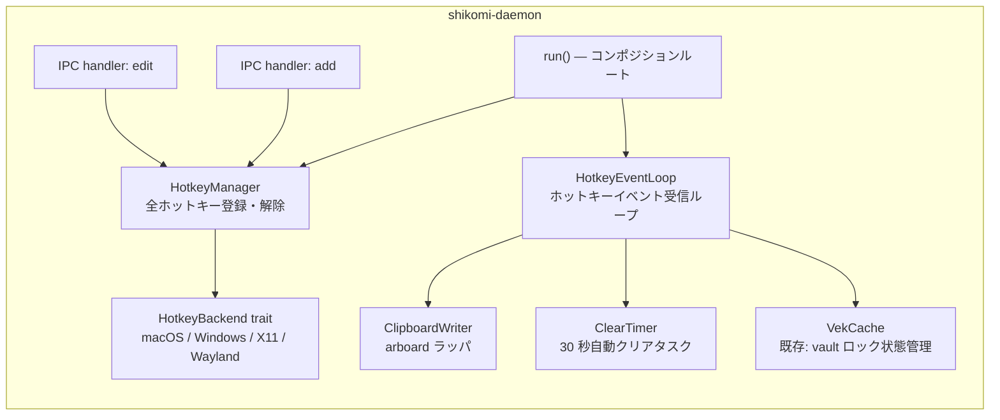
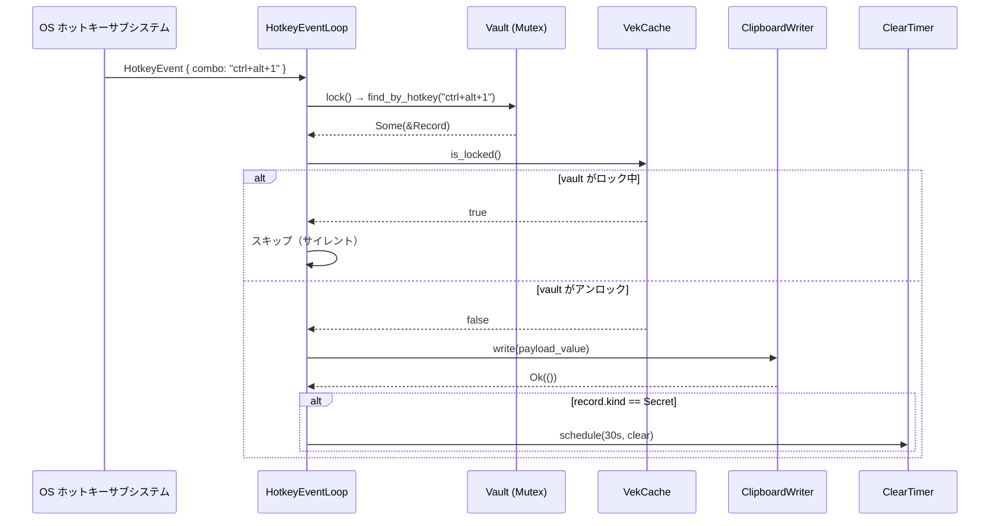
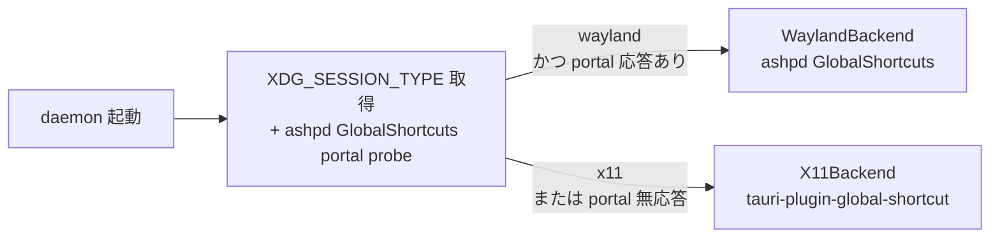

# 基本設計書 — daemon（daemon-hotkey-clipboard）

<!-- feature: daemon-hotkey-clipboard / sub-feature: daemon / Issue #89 -->
<!-- 配置先: docs/features/daemon-hotkey-clipboard/daemon/basic-design.md -->
<!-- 疑似コード・実装コードブロック禁止 -->

## §モジュール契約（機能要件マッピング）

| 要件 ID | 契約 |
|---------|------|
| R1-HK-01 | daemon 起動時に `HotkeyManager::register_all` が vault の全ホットキーエントリを OS に登録する |
| R1-HK-04 | `ClipboardWriter::write` が `arboard::Clipboard` 経由で OS クリップボードに値を書き込む |
| R1-HK-05 | `ClearTimer::schedule` が 30 秒後に `ClipboardWriter::clear` を実行するタスクを spawn する |
| R1-HK-06 | `HotkeyBackend` trait を実装する `X11Backend` と `WaylandBackend` を Linux 起動時に動的選択する |
| R1-HK-07 | vault がロック中の場合、`HotkeyEventLoop` はクリップボード書き込みをスキップする（サイレント失敗） |
| R1-HK-08 | IPC ハンドラ `add.rs` / `edit.rs` が `hotkey` フィールドを処理し `Vault::assign_hotkey` を呼ぶ |
| R1-HK-09 | IPC ハンドラ `edit.rs` が `clear_hotkey` フラグを処理し `Vault::clear_hotkey` を呼ぶ |

## 1. モジュール構成

変更対象 crate: **`shikomi-daemon`**（主）/ **`shikomi-infra`**（`arboard` 依存追加）/ **`shikomi-cli`**（`--hotkey` CLI オプション追加）

```
crates/shikomi-daemon/src/
  hotkey/
    mod.rs              ← HotkeyManager, HotkeyBackend trait, session detection
    backend/
      mod.rs            ← BackendEnum（実行時ディスパッチ）
      macos.rs          ← macOS バックエンド (tauri-plugin-global-shortcut)
      windows.rs        ← Windows バックエンド (tauri-plugin-global-shortcut)
      linux_x11.rs      ← Linux X11 バックエンド
      linux_wayland.rs  ← Linux Wayland バックエンド (ashpd)
    event_loop.rs       ← HotkeyEventLoop（ホットキー → クリップボード投入ループ）
    clipboard.rs        ← ClipboardWriter（arboard ラッパ）
    clear_timer.rs      ← ClearTimer（secret エントリ 30 秒クリア）
  ipc/
    handler/
      add.rs            ← hotkey フィールド処理追加（既存ファイル更新）
      edit.rs           ← hotkey / clear_hotkey 処理追加（既存ファイル更新）
  lib.rs                ← run() に HotkeyManager + HotkeyEventLoop を注入

crates/shikomi-cli/src/
  cli.rs                ← --hotkey / --clear-hotkey オプション追加（既存ファイル更新）
  input/
    hotkey.rs           ← ホットキー文字列入力パーサ（新設）
  usecase/
    add.rs              ← hotkey フィールドを IPC リクエストに渡す（既存更新）
    edit.rs             ← hotkey / clear_hotkey を IPC リクエストに渡す（既存更新）
```

## 2. コンポーネント設計



### 2.1 `HotkeyBackend` trait

OS ホットキー登録・解除の抽象インターフェース。3 OS / 4 バックエンドの実装を統一する。

| メソッド | シグネチャ（プレーンテキスト） | 説明 |
|---------|---------------------------|------|
| `register` | `fn register(&self, combo: &str) -> Result<(), HotkeyError>` | 指定コンボを OS に登録 |
| `unregister` | `fn unregister(&self, combo: &str) -> Result<(), HotkeyError>` | 指定コンボの OS 登録を解除 |
| `event_stream` | `fn event_stream(&self) -> BoxStream<HotkeyEvent>` | 登録済みホットキーのイベントストリーム |

`BoxStream<HotkeyEvent>` は `futures_util::Stream` の動的ディスパッチ型。`async_trait` を使用（既存 `OsLockSignal` と同パターン）。

### 2.2 `HotkeyEvent` 型

| フィールド | 型 | 説明 |
|-----------|----|------|
| `combo` | `String` | 発火したホットキー正規化文字列 |

### 2.3 `HotkeyManager`

vault 内の全ホットキーを OS バックエンドに登録・管理する RAII オブジェクト。

| メソッド | 説明 |
|---------|------|
| `new(backend, vault)` | コンストラクタ |
| `register_all()` | vault の全ホットキー登録済みエントリを `backend.register` で一括登録 |
| `register_one(combo)` | 単一ホットキーを OS 登録（IPC add/edit ハンドラから呼ばれる） |
| `unregister_one(combo)` | 単一ホットキーを OS 解除（IPC edit ハンドラから呼ばれる） |

Drop 時に全登録済みホットキーを `backend.unregister` で解除（RAII）。

### 2.4 `HotkeyEventLoop`

daemon のホットキーイベント受信ループ。`HotkeyBackend::event_stream` から `HotkeyEvent` を受信し、クリップボード投入を行う。



### 2.5 `ClipboardWriter`

`arboard::Clipboard` の薄いラッパ。

| メソッド | 説明 |
|---------|------|
| `new()` | `arboard::Clipboard::new()` でインスタンス化。失敗時は daemon 起動を継続し警告ログのみ（クリップボード未対応環境でも CLI は動く） |
| `write(value: &[u8])` | `clipboard.set_text(...)` で OS クリップボードに書き込み |
| `clear()` | `clipboard.set_text("")` で空文字書き込み |

**Linux Wayland**: `arboard` v3.6+ の `wayland-data-control` feature を有効化することで Wayland プロトコルに対応。feature flag ではなく依存 feature での切り替え。

### 2.6 `ClearTimer`

secret エントリの自動クリアタスク管理。

| 状態 | 説明 |
|------|------|
| Idle | タイマー未設定 |
| Running(JoinHandle) | 30 秒カウントダウン中 |

動作:
1. `schedule(duration, writer)` を呼ぶと既存 Running タイマーを `abort()` し新しいタスクを spawn
2. タスク内: `tokio::time::sleep(duration)` → `writer.clear()`
3. shutdown シグナル受信時: タイマータスクを `abort()`

### 2.7 Linux バックエンド選択（セッション検出）



- `XDG_SESSION_TYPE=wayland` かつ `ashpd::desktop::global_shortcuts::GlobalShortcuts::new()` が成功した場合のみ Wayland バックエンドを選択
- portal 応答がない（GNOME 43 以前 / KDE Plasma 5 以前）場合は X11 バックエンドにフォールバック
- フォールバック時は `tracing::warn!` でセッション種別と理由を記録

## 3. CLI 変更（`shikomi-cli`）

### 3.1 `add` サブコマンド拡張

| 追加オプション | 型 | 説明 |
|--------------|-----|------|
| `--hotkey <COMBO>` | `Option<String>` | 例: `--hotkey "ctrl+alt+1"` |

### 3.2 `edit` サブコマンド拡張

| 追加オプション | 型 | 説明 |
|--------------|-----|------|
| `--hotkey <COMBO>` | `Option<String>` | ホットキーを変更 |
| `--clear-hotkey` | `bool` (flag) | ホットキーを解除 |

`--hotkey` と `--clear-hotkey` を同時指定した場合: `clap` の排他グループで CLI バリデーション。

### 3.3 `list` 出力変更

`[ctrl+alt+1]` を `label` の後に括弧付きで追加表示。例:
```
1  メールアドレス  [ctrl+alt+1]  plaintext
```

## 4. 外部連携（新規依存 crate）

| crate | バージョン方針 | 追加先 | 根拠 |
|-------|-------------|--------|------|
| `arboard` | `^3.6` (minor ピン) | `shikomi-daemon` | Wayland `wayland-data-control` feature が 3.6+ で安定。`1Password` メンテ、MIT ライセンス |
| `tauri-plugin-global-shortcut` | `^2.2` (minor ピン) | `shikomi-daemon` | Tauri v2 公式プラグイン。macOS / Windows / Linux X11 対応 |
| `ashpd` | `^0.13` (minor ピン) | `shikomi-daemon` | Wayland XDG Portal の Rust バインディング。`global_shortcuts` feature が 0.13 で安定 |

**Linux-only feature**: `ashpd` は `#[cfg(target_os = "linux")]` ガードで Linux ビルドにのみ依存させる。macOS / Windows ビルドへ混入しない。

## 5. セキュリティ設計

| 脅威 | 対策 |
|------|------|
| 暗号化 vault ロック中のクリップボード投入 | `VekCache::is_locked()` チェックでサイレントスキップ（`R1-HK-07`） |
| クリップボード内 secret の残留 | `ClearTimer` が 30 秒後に `clear()` を実行（`R1-HK-05`） |
| HotkeyEvent の偽装 | UDS / Named Pipe のピア UID 検証は IPC 層で担保済み。ホットキーイベントは OS カーネル経由のため偽装不可 |
| ホットキー組み合わせ列挙攻撃 | 同一プロセス（daemon）内のみがイベントを受信。他プロセスへの露出なし |
| `arboard` による機密値のメモリ残留 | クリップボード API は OS が管理するヒープを使用。`zeroize` の適用範囲外。`ClearTimer` が上書きするまでの 30 秒は acceptable リスクとして文書化 |

## 6. エラーハンドリング方針

| エラー発生箇所 | 方針 |
|-------------|------|
| `HotkeyBackend::register` 失敗 | `tracing::error!` + そのホットキーをスキップ（他のホットキーは登録継続） |
| `ClipboardWriter::new()` 失敗 | `tracing::warn!` + `ClipboardWriter` を無効状態に（ホットキー押下時はスキップ）。daemon 起動は継続 |
| `ClipboardWriter::write()` 失敗 | `tracing::warn!` でログのみ。エラーを握り潰さず記録する |
| `ClearTimer` abort エラー | 無視（tokio task abort は `JoinError::is_cancelled()` で正常扱い） |
| Linux セッション検出失敗 | `tracing::warn!` + X11 バックエンドへフォールバック |
