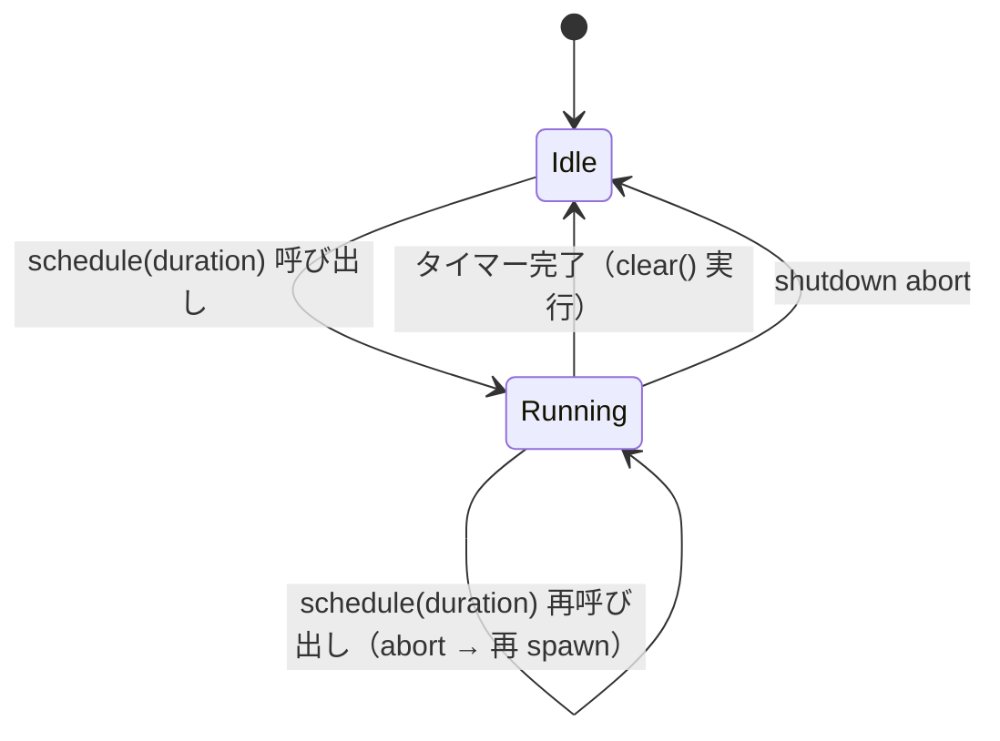

# 詳細設計書 — daemon（daemon-hotkey-clipboard）

<!-- feature: daemon-hotkey-clipboard / sub-feature: daemon / Issue #89 -->
<!-- 配置先: docs/features/daemon-hotkey-clipboard/daemon/detailed-design.md -->
<!-- 疑似コード・実装コードブロック禁止 -->

## 1. `HotkeyBackend` trait 詳細

### 1.1 trait 定義要件

- `async_trait` マクロを使用（既存 `OsLockSignal` と同パターン、`vek-cache-and-ipc.md` §OsLockSignal 参照）
- `Send + Sync + 'static` 境界を要求（tokio spawn 内で共有するため）
- `event_stream` の返り値 `BoxStream<'_, HotkeyEvent>` は `futures_util::BoxStream` を使用

### 1.2 バックエンド実装一覧

| 実装型 | 対象 OS / セッション | 依存 crate |
|--------|------------------|-----------|
| `MacosBackend` | macOS | `tauri-plugin-global-shortcut` |
| `WindowsBackend` | Windows | `tauri-plugin-global-shortcut` |
| `X11Backend` | Linux X11 | `tauri-plugin-global-shortcut` |
| `WaylandBackend` | Linux Wayland | `ashpd` |

### 1.3 `BackendEnum`（実行時ディスパッチ）

`dyn HotkeyBackend` の代わりに `enum BackendEnum` で静的ディスパッチを実現。バリアントは OS / セッション別に 4 種。`HotkeyBackend` の各メソッドを `match self` で委譲する。

**理由**: `dyn HotkeyBackend` は `async_trait` と組み合わせると `Box<dyn Future + Send>` が連鎖してヒープ確保が増える。`BackendEnum` は enum の match で静的ディスパッチし、ホットキーイベントループの hot path でのアロケーションを避ける。

## 2. `CLEAR_TIMEOUT` 定数

`shikomi-core::constants::CLEAR_TIMEOUT_SECS: u64 = 30` に定義する（`crates/shikomi-core/src/constants.rs`）。

`ClearTimer::schedule` は `Duration::from_secs(shikomi_core::constants::CLEAR_TIMEOUT_SECS)` を使用する。テストコードも同定数を参照し、マジックナンバー 30 をソースに散在させない。

## 3. `HotkeyManager` 詳細

### 3.1 フィールド

| フィールド | 型 | 説明 |
|-----------|----|------|
| `backend` | `Arc<BackendEnum>` | ホットキー OS バックエンド |
| `registered` | `HashSet<String>` | 登録済みコンボ文字列の集合（Drop 時解除に使用） |
| `notifier` | `Arc<dyn Notifier>` | OS 通知送信（ホットキー登録失敗時に使用。`basic-design §2.7` 参照）|

### 3.2 `register_all` 処理順序

1. `vault.hotkey_entries()` をイテレート
2. 各エントリの `hotkey.as_str()` を `backend.register(combo)` に渡す
3. 成功した場合のみ `registered.insert(combo)` する
4. 失敗時は `tracing::error!` でログ出力 + `self.notifier.notify(Normal, "shikomi", "ホットキー {combo} の登録に失敗しました。他のアプリと競合している可能性があります")` を呼び継続（他ホットキーは登録する）

### 3.3 `register_one` / `unregister_one` の使用コンテキストと正規化責務

IPC `add` / `edit` ハンドラが `Vault::assign_hotkey` の後に呼ぶ。`assign_hotkey` が成功した場合のみ OS 登録を試みる（ドメイン層が一次防衛、OS 登録は二次）。

#### 正規化責務（P1-③ / H-003）

**`register_one` / `unregister_one` の entry point で `Hotkey::parse` による正規化を行う。**

`"ctrl+alt+1"` と `"alt+ctrl+1"` は同一コンボとして扱われるべきであり、この正規化は呼び出し元（`dispatch_v2` / `sync_hotkey`）に依存せず `HotkeyManager` 自身の責務とする。これにより：

- IPC リクエストに含まれる未正規化文字列と vault 内の正規化済み文字列の比較一致が保証される
- `registered: HashSet<String>` に格納されるコンボは常に正規化形式になる
- `Drop` での `backend.unregister` も正規化済み文字列で呼ばれる

正規化に失敗した場合（解析不能なコンボ）は `HotkeyError::ParseFailed` を返す（Fail Fast）。

#### `sync_hotkey` の責務（P1-② Tell, Don't Ask）

`edit` 後の OS ホットキー状態同期は `HotkeyManager::sync_hotkey(old, new, clear)` に委譲し、`dispatch_v2` 側で個別に `unregister_one` / `register_one` を呼ばない。これにより：

- `dispatch_v2` が「ホットキーの変更有無を判定して操作」という Tell, Don't Ask 違反を回避
- 同一コンボの無駄な再登録防止ロジックが `HotkeyManager` に集約される

`edit` でホットキーを変更した場合の `sync_hotkey` 内部処理順序:
1. `old_combo` と `new_combo` を正規化形式で比較。同一なら noop
2. 旧コンボを `unregister_one` で解除（best-effort、失敗は `warn!` のみ）
3. 新コンボを `register_one` で OS 登録（Fail Fast、失敗は `Err` を返す）

### 3.4 Drop 実装

`drop()` で `registered` の全コンボを `backend.unregister` でループ解除。失敗は無視（`tracing::warn!` のみ）。

## 4. `HotkeyEventLoop` 詳細

### 4.1 フィールド

| フィールド | 型 | 説明 |
|-----------|----|------|
| `backend` | `Arc<BackendEnum>` | イベントストリーム取得元 |
| `vault` | `Arc<Mutex<Vault>>` | ホットキー → レコード解決 |
| `vek_cache` | `VekCache` | ロック状態判定 |
| `clipboard` | `Arc<Mutex<dyn ClipboardWriter>>` | クリップボード書き込み（trait オブジェクト、テスト時に `MockClipboardWriter` に差し替え可能） |
| `notifier` | `Arc<dyn Notifier>` | OS 通知送信（trait オブジェクト、テスト時に `MockNotifier` に差し替え可能。`basic-design §2.7` 参照）|
| `clear_timer` | `ClearTimer` | 自動クリアタイマー |

### 4.1.5 ペイロード取得とMutex保持時間

`Vault::find_by_hotkey` は `Option<&Record>` を返す（借用）。Mutex Guard 存命中にペイロード値を **`clone()` して `Vec<u8>` に取り出してから** Mutex Guard を drop する。クリップボード書き込み（OS API）は Mutex 外で実行する。

処理順序（Mutex 保持の明示）:
1. `vault.lock().await` で MutexGuard 取得
2. `guard.find_by_hotkey(combo)` → `Option<&Record>`
3. `record.payload.clone_value()` でペイロードを `Vec<u8>` にコピー（clone）
4. `record.kind` を `RecordKind` としてコピー
5. **MutexGuard を drop**（`drop(guard)`）
6. `clipboard.write(&cloned_value)` で OS クリップボードに書き込み（Mutex 外）

### 4.2 イベントループ処理

`tokio::select!` で `backend.event_stream()` と `shutdown_rx` を多重化。

各イベント受信時の処理順序は **§4.1.5 のステップ定義を正とする**。要点を以下に転記:

1. vault Mutex 取得 → `find_by_hotkey` でレコード検索
2. レコードが `None` → `tracing::debug!` でログのみ（スキップ）
3. `vek_cache.is_locked()` が `true` → OS 通知「vault がロック中」を送信（R1-HK-13）してスキップ（R1-HK-07）
4. ペイロードを `clone()` して `Vec<u8>` に取り出し → **vault Mutex を drop**
5. `clipboard.write(&cloned_value)` でクリップボード書き込み（Mutex 外）
6. 書き込み失敗 → OS 通知「クリップボードへの書き込みに失敗しました」（R1-HK-14）
7. `record.kind == RecordKind::Secret` ならば `clear_timer.schedule(CLEAR_TIMEOUT, clipboard)` を呼ぶ

**Mutex 保持時間の最小化**: vault の Mutex はステップ 1〜4 の「レコード検索 + ペイロード clone」のみに限定し、OS API 呼び出し（クリップボード・通知）は Mutex 外で行う。

## 5. `ClipboardWriter` 詳細

### 5.1 構成

`ArboardClipboardWriter` は `Arc<Mutex<dyn ClipboardWriter>>` として `HotkeyEventLoop` に注入される。`arboard::Clipboard` は `Send` だが `Sync` ではないため、`ArboardClipboardWriter` 内部で `Mutex` で包む。

### 5.2 ヘッドレス CI 対応

`arboard::Clipboard::new()` は X11 / Wayland display 接続を要求する。CI ヘッドレス環境では:
- Linux: `Xvfb` を起動して `DISPLAY=:99` を設定（`test-daemon.yml` ジョブで制御）
- または: `SHIKOMI_DISABLE_CLIPBOARD=1` 環境変数でクリップボード機能を無効化し daemon を起動できる（テスト用エスケープハッチ）

### 5.3 Wayland `arboard` 設定

`arboard` v3.6+ の依存 feature: `wayland-data-control`。`shikomi-daemon/Cargo.toml` で `arboard = { version = "^3.6", features = ["wayland-data-control"] }` と宣言。Linux 以外のビルドでは `target_os` 条件で feature が不要になるが、cargo は feature の有無を binary に影響させない。

## 6. `ClearTimer` 詳細

### 6.1 状態遷移

### 6.2 フィールド

| フィールド | 型 | 説明 |
|-----------|----|------|
| `handle` | `Option<JoinHandle<()>>` | 実行中タイマータスクのハンドル |

### 6.3 `schedule` 処理

1. `self.handle.take().map(|h| h.abort())` で既存タイマーをキャンセル
2. `tokio::spawn(async move { tokio::time::sleep(duration).await; writer.clear().await; })` で新タスクを spawn
3. `self.handle = Some(handle)` でハンドルを保存

## 7. Linux セッション検出詳細

### 7.1 検出アルゴリズム

| ステップ | 処理 |
|---------|------|
| 1 | `std::env::var("XDG_SESSION_TYPE")` を取得 |
| 2 | 値が `"wayland"` でない → X11 バックエンドを返す（即断） |
| 3 | 値が `"wayland"` → `ashpd::desktop::global_shortcuts::GlobalShortcuts::new().await` を試みる |
| 4 | 成功（Some）→ Wayland バックエンドを返す |
| 5 | 失敗（portal 未対応）→ `tracing::warn!` + X11 バックエンドを返す |

タイムアウト: ステップ 3 の ashpd probe は `tokio::time::timeout(Duration::from_secs(3), ...)` でガードする。3 秒以内に応答がなければ X11 バックエンドにフォールバック。

### 7.2 `cfg` 分岐方針

- `WaylandBackend` と `ashpd` 依存は `#[cfg(target_os = "linux")]` で囲む
- macOS / Windows ビルドに ashpd が混入しないことを `cargo check --target x86_64-pc-windows-msvc` で CI 検証する

## 8. IPC ハンドラ変更詳細

### 8.1 `add.rs` 拡張

`IpcRequest::AddRecord` の `hotkey: Option<String>` フィールドを処理する追加ステップ:

1. `hotkey` が `Some(s)` → `Hotkey::parse(s)` を呼ぶ。`HotkeyParseError` → `IpcErrorCode::HotkeyParseError` に写像して返す
2. 成功した `Hotkey` を `Vault::assign_hotkey(new_id, hotkey)` に渡す
3. `HotkeyConflict` → `IpcErrorCode::HotkeyConflict` に写像
4. vault 更新後に `manager.register_one(combo)` で OS 登録

### 8.2 `edit.rs` 拡張

| 条件 | 処理 |
|------|------|
| `clear_hotkey == true` かつ `hotkey.is_some()` | `IpcErrorCode::HotkeyParseError` で返す（矛盾入力） |
| `clear_hotkey == true` | `manager.unregister_one(旧combo)` → `Vault::clear_hotkey(id)` |
| `hotkey.is_some()` | `Hotkey::parse` → `manager.unregister_one(旧combo)` → `Vault::assign_hotkey` → `manager.register_one(新combo)` |
| どちらでもない | ホットキー変更なし（従来動作） |

## 9. `run()` コンポジションルート変更

既存の `run()` に以下を追加注入:

1. `detect_backend().await`（Linux のみ非同期、他 OS は同期）でバックエンド選択
2. `HotkeyManager::new(backend, &vault)` を構築し `register_all()` を呼ぶ
3. `HotkeyEventLoop::new(...)` を構築し `tokio::spawn(event_loop.run(shutdown_rx))` でスポーン
4. shutdown 時に `event_loop_task.abort()` と `drop(manager)` を明示実施

**既存コンポーネントへの影響**: `IpcServer::new` のシグネチャに `Arc<HotkeyManager>` を追加し、ハンドラ層に注入する。

## 10. 依存 crate バージョンピン方針

| crate | バージョン制約 | ピン根拠 |
|-------|-------------|---------|
| `arboard` | `^3.6` | Wayland `wayland-data-control` feature が 3.6 で安定。major ピン（3→4 は破壊的）|
| `tauri-plugin-global-shortcut` | `^2.2` | Tauri v2 系列。major ピン必須 |
| `ashpd` | `^0.13` | `global_shortcuts` feature が 0.13 で stable API。minor ピン |
| `notify-rust` | `^4.11` | OS 通知（R1-HK-13 / R1-HK-14）。Linux: libnotify / macOS: NSUserNotification / Windows: Toast API。4.x 系は API 安定、5.x 移行時は破壊的変更あり。minor ピン |

`cargo-deny` の `deny.toml` に上記 crate を追加し、major バージョン外への漂流をビルド失敗で検出する。
