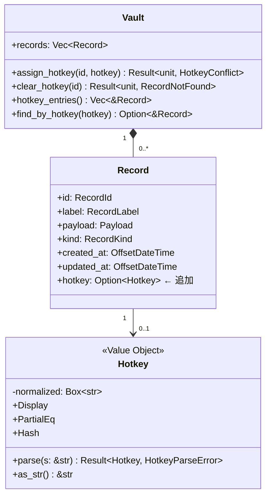

# 基本設計書 — domain（daemon-hotkey-clipboard）

<!-- feature: daemon-hotkey-clipboard / sub-feature: domain / Issue #89 -->
<!-- 配置先: docs/features/daemon-hotkey-clipboard/domain/basic-design.md -->
<!-- 疑似コード・実装コードブロック禁止。Mermaid + 表 + プレーンテキストのみ -->

## §モジュール契約（機能要件マッピング）

| 要件 ID | 契約 |
|---------|------|
| R1-HK-01 | `Vault::hotkey_entries()` で全ホットキー登録済みエントリを取得可能 |
| R1-HK-02 | `Hotkey::parse(s: &str)` が `"ctrl+alt+1"` 形式を解析し、不正形式は `HotkeyParseError` で Fail Fast |
| R1-HK-03 | `Vault::assign_hotkey(id, hotkey)` はホットキー重複を事前検査し `HotkeyConflict` で拒否 |
| R1-HK-08 | `IpcRequest::AddRecord` / `EditRecord` に `hotkey: Option<Hotkey>` フィールドを追加 |
| R1-HK-09 | `IpcRequest::EditRecord` に `clear_hotkey: bool` フィールドを追加 |
| R1-HK-11 | `RecordSummary` に `hotkey: Option<String>` フィールドを追加し list 出力に反映 |

## 1. モジュール構成

本 sub-feature は **`shikomi-core`** の変更のみ。I/O を持たない pure Rust 型定義・バリデーション層。

```
crates/shikomi-core/src/
  vault/
    record/
      mod.rs          ← Record に hotkey: Option<Hotkey> フィールド追加
      hotkey.rs       ← Hotkey 値オブジェクト（新設）
    mod.rs            ← Vault::assign_hotkey / Vault::hotkey_entries 追加
  ipc/
    request.rs        ← AddRecord / EditRecord に hotkey / clear_hotkey 追加
    response.rs       ← 変更なし
    summary.rs        ← RecordSummary に hotkey: Option<String> 追加
    error_code.rs     ← HotkeyConflict / HotkeyParseError バリアント追加
```

## 2. ドメインモデル変更



### 2.1 `Hotkey` 値オブジェクト

- **唯一の内部状態**: `normalized: Box<str>`（正規化済み文字列のみ。`modifiers` / `key` の個別フィールドは廃止）
- **不変条件**: 修飾キーを少なくとも 1 つ含み、主キーが ASCII 英数字 1 文字または F1〜F12 のいずれか（`parse` で検証済み）
- **文字列表現**: `"alt+ctrl+1"` 形式（修飾キーはアルファベット順に正規化）。`Display` / `as_str()` が正規化文字列を返す
- **等価性**: `normalized` 文字列で比較（`PartialEq` / `Eq` / `Hash`）
- **ゼロ化**: `Hotkey` は機密情報を含まないため `zeroize` 不要

### 2.2 `Vault` ドメインメソッド追加

| メソッド | 入力 | 処理 | 出力 | エラー |
|---------|------|------|------|--------|
| `assign_hotkey(id, hotkey)` | `RecordId`, `Hotkey` | ① 対象レコード存在確認 ② 同一 Hotkey を持つ他レコードがないか全件走査 ③ 対象レコードの `hotkey` を更新 | `()` | `RecordNotFound` / `HotkeyConflict { assigned_to: RecordId }` |
| `clear_hotkey(id)` | `RecordId` | 対象レコードの `hotkey` を `None` に更新 | `()` | `RecordNotFound` |
| `hotkey_entries()` | なし | `hotkey.is_some()` なレコードのイテレーション | `impl Iterator<Item = &Record>` | なし |
| `find_by_hotkey(hotkey)` | `&Hotkey` | `hotkey_entries()` 線形探索（件数 < 100 を前提、O(n) で十分） | `Option<&Record>` | なし |

**Tell, Don't Ask 設計**: ホットキー競合チェックを `Vault` 外で行わない。`assign_hotkey` が競合状態の全権を持つ。

## 3. IPC プロトコル拡張

### 3.1 `IpcRequest` 変更

| バリアント | 追加フィールド | 型 |
|------------|-------------|-----|
| `AddRecord` | `hotkey` | `Option<String>` （正規化文字列、daemon 側で `Hotkey::parse` する） |
| `EditRecord` | `hotkey` | `Option<String>` |
| `EditRecord` | `clear_hotkey` | `bool` |

**テスト用 `TriggerHotkey` variant の不採用**: E2E テストは `HotkeyEventLoop` に `MockBackend::send_event()` でイベントを直接注入する（`daemon/test-design.md §2`）。本番 enum に裏口 variant を混入しない（ブラックボックステスト原則）。

**`hotkey` を `Option<String>` にする理由**: `Hotkey` 型は `shikomi-core` の内部型であり、IPC は文字列境界を経由する。デシリアライズ後に daemon / cli 各層でパースし Fail Fast させることで、core 型を IPC スキーマに漏らさない（依存方向の一方向を維持）。

### 3.2 `IpcErrorCode` 追加バリアント

| バリアント | 意味 | HTTP 類似 |
|-----------|------|----------|
| `HotkeyConflict` | 指定ホットキーが既に別エントリに登録済み | 409 Conflict |
| `HotkeyParseError` | ホットキー文字列の形式不正 | 422 Unprocessable Entity |

### 3.3 `RecordSummary` 変更

`hotkey: Option<String>` フィールドを追加。`None` の場合は list 出力で非表示。`Some("ctrl+alt+1")` の場合は `[ctrl+alt+1]` 形式で表示。

## 4. SQLite スキーマ変更（`shikomi-infra` 側への要求仕様）

本 sub-feature のスコープ外（`shikomi-infra` の変更）だが、domain 層が永続化に課す要求仕様を明記する。

| カラム | 型 | デフォルト | 制約 |
|-------|----|-----------|------|
| `hotkey_combo` | `TEXT` | `NULL` | `UNIQUE`（`NULL` を除く） |

- `UNIQUE` 制約は DB レベルのセーフガード。ドメイン層の `assign_hotkey` が一次防衛
- 既存レコードへのマイグレーション: `ALTER TABLE records ADD COLUMN hotkey_combo TEXT DEFAULT NULL`
- `vault_migration` モジュール（`shikomi-infra`）に `VaultVersion::V3` を追加して対応

## 5. 外部連携

該当なし — 本 sub-feature は pure domain 型定義のみ。I/O・OS API 依存なし。

### 5.5 `CLEAR_TIMEOUT` 定数の配置

30 秒クリア時間は `shikomi-core::constants::CLEAR_TIMEOUT_SECS: u64 = 30` として `crates/shikomi-core/src/constants.rs` に定義する。`ClearTimer` / event_loop / テストコードが全てこの定数を参照することで DRY を保つ。定数を分散させてはならない。

## 6. セキュリティ設計

| 脅威 | 対策 |
|------|------|
| ホットキー文字列にインジェクション試行 | `Hotkey::parse` のホワイトリスト検証（許可文字以外は即 `HotkeyParseError`） |
| `RecordSummary` 経由での機密値漏洩 | `hotkey` フィールドはキー組み合わせ文字列のみ。payload 値は含まない |

## 7. エラーハンドリング方針

- `Hotkey::parse` は `Result` を返す。`unwrap` / `expect` 禁止
- `assign_hotkey` の `HotkeyConflict` は上位層（handler）がエラーコードに写像する
- エラーを握り潰して `None` にフォールバックすることを禁止（Fail Fast）
