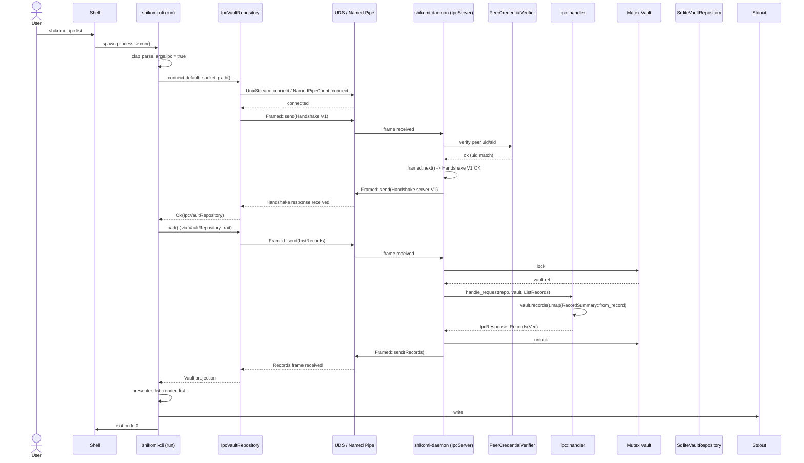
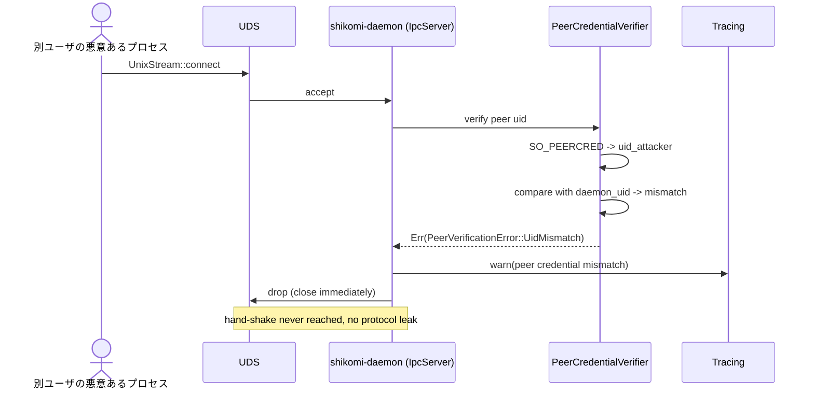
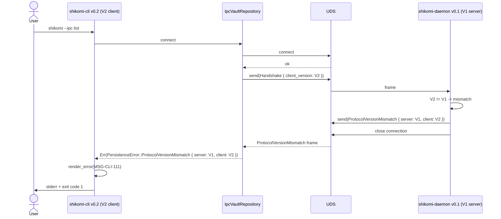
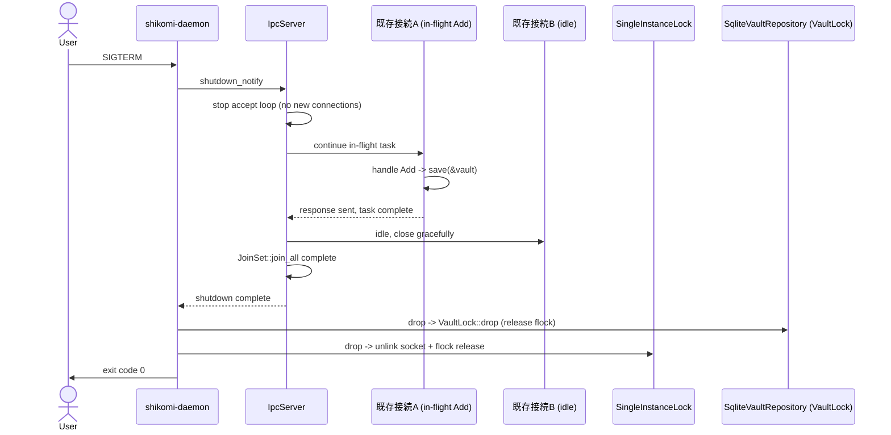

# 基本設計書 — flows（処理フロー / シーケンス図）

<!-- 詳細設計書とは別ファイル。統合禁止 -->
<!-- feature: daemon-ipc / Issue #26 -->
<!-- 配置先: docs/features/daemon-ipc/basic-design/flows.md -->
<!-- 兄弟: ./index.md, ./security.md, ./error.md, ./ipc-protocol.md -->

## 記述ルール

本書には**疑似コード・サンプル実装を書かない**（設計書共通ルール）。処理フローは番号付き箇条書き、シーケンスは Mermaid `sequenceDiagram` で表現する。

## 処理フロー

本 feature の主要フローは「daemon 起動 → IPC 接続受付 → ハンドシェイク → vault 操作 → graceful shutdown」と、CLI クライアント側「`--ipc` 指定 → 接続 → ハンドシェイク → 操作 → 出力」の 2 系統。

### 共通: `shikomi-daemon` 起動〜listener 開始

1. `main()` が `#[tokio::main]` で `tokio` 多重スレッドランタイム起動 → `shikomi_daemon::run().await` を呼ぶ
2. `run()` 内で最初に `std::panic::set_hook(Box::new(panic_hook_fn))` を登録（`./security.md §panic hook` 参照、CLI と同型 fixed-message）
3. `tracing-subscriber` を `EnvFilter::try_from_env("SHIKOMI_DAEMON_LOG").unwrap_or_else(|_| EnvFilter::new("info"))` で初期化
4. `SingleInstanceLock::acquire(&socket_dir)?` で **3 段階先取り**:
   - **Unix**: `flock(LOCK_EX|LOCK_NB)` 獲得 → 既存 socket `unlink` → `UnixListener::bind`（順序厳守、`./security.md §シングルインスタンスの race-safe 保証`）
   - **Windows**: `NamedPipeServer::new` を `first_pipe_instance(true)` 付きで作成
   - 失敗時は `tracing::error!` + `ExitCode::SingleInstanceUnavailable (2)` で early return
5. `SqliteVaultRepository::from_directory(&resolve_vault_dir())?` で repo 構築（既存 `cli-vault-commands` で追加された API を再利用、`SHIKOMI_VAULT_DIR` env / OS デフォルトの解決は infra 内部）
6. `repo.load()?` で `Vault` ロード → `vault.protection_mode()` が `Encrypted` なら `tracing::error!("vault is encrypted; daemon does not support encrypted vaults yet")` + `ExitCode::EncryptionUnsupported (3)` で early return
7. `Arc<Mutex<Vault>>` 構築 → `Arc<R>` で repo を共有
8. `IpcServer::new(listener, repo, vault).start().await?` で listen ループ起動
9. 並行で `lifecycle::shutdown::wait_for_signal()` を spawn し、`SIGTERM` / `SIGINT` / `CTRL_CLOSE_EVENT` 受信を待機
10. シグナル受信 → server に `shutdown.notify()` → server が in-flight 完了待機 → `SingleInstanceLock` Drop（ソケット削除 + flock 解放）→ `ExitCode::Success (0)`

### 共通: 接続受付〜ハンドシェイク

1. `listener.accept().await` で接続待機（loop）
2. 接続受付時に `peer_credential::verify(&stream)?`:
   - **Unix**: `getsockopt(fd, SOL_SOCKET, SO_PEERCRED, ...)`（Linux）/ `getsockopt(fd, SOL_LOCAL, LOCAL_PEERCRED, ...)`（macOS）で UID 取得 → `geteuid()` と比較
   - **Windows**: `GetNamedPipeClientProcessId` → `OpenProcessToken` → `GetTokenInformation(TokenUser)` で SID 取得 → 自プロセス SID と比較
   - 不一致 → 即切断 + `tracing::warn!("peer credential mismatch...")` → loop 先頭へ
3. `Framed::new(stream, LengthDelimitedCodec::builder().max_frame_length(16 MiB).little_endian().length_field_length(4).new_codec())` で stream をフレーム化
4. `tokio::spawn` でこの接続用ハンドラタスクを spawn（並行接続対応）
5. ハンドラタスクの最初: `framed.next().await` で初回フレーム受信 → タイムアウト 5 秒（`tokio::time::timeout`）
6. `rmp_serde::from_slice::<IpcRequest>(&frame)` でデコード → `IpcRequest::Handshake { client_version }` でなければ即切断 + `tracing::warn!("first frame must be Handshake")`
7. `client_version == IpcProtocolVersion::V1` 判定:
   - 一致 → `framed.send(rmp_serde::to_vec(&IpcResponse::Handshake { server_version: V1 }).into()).await?` → 通常リクエスト受付ループへ
   - 不一致 → `framed.send(rmp_serde::to_vec(&IpcResponse::ProtocolVersionMismatch { server: V1, client: <受信値> }).into()).await?` → 切断 + `tracing::warn!`

### 共通: 通常リクエスト受付ループ（ハンドシェイク後）

1. `framed.next().await` で次フレーム受信
2. `rmp_serde::from_slice::<IpcRequest>(&frame)` でデコード:
   - 失敗 → 該当接続のみ切断 + `tracing::warn!("MessagePack decode failed: {}")` + バッファ即解放（daemon プロセスはクラッシュさせない）
   - フレーム長 16 MiB 超過 → `Codec` がエラー返却 → 該当接続のみ切断 + `tracing::warn!("frame length exceeds 16 MiB")`
3. `vault_mutex.lock().await` でロック取得
4. `handler::handle_request(&*repo, &mut vault, request)` で `IpcResponse` を pure 写像で得る
5. `vault_mutex` 解放
6. `framed.send(rmp_serde::to_vec(&response).into()).await?` で応答
7. loop 先頭に戻る（接続切断は client 側または shutdown 側で発生、サーバ側からは常時応答可能）

### REQ-DAEMON-007: List 応答フロー

1. `IpcRequest::ListRecords` 受信
2. `vault_mutex.lock().await`
3. `vault.records().iter().map(RecordSummary::from_record).collect::<Vec<_>>()` で投影:
   - `RecordSummary { id, kind, label, value_preview: record.text_preview(40), value_masked: record.kind() == Secret }`
   - `text_preview` は `shikomi-core::Record` の既存メソッド（`cli-vault-commands` で追加済み）
4. `IpcResponse::Records(summaries)` を返す

### REQ-DAEMON-008: Add 応答フロー

1. `IpcRequest::AddRecord { kind, label, value: SerializableSecretBytes(secret_bytes), now }` 受信
2. `vault_mutex.lock().await`
3. `let payload = RecordPayload::Plaintext(SecretString::from_bytes(secret_bytes))`（`shikomi-core::SecretString::from_bytes` API、`expose_secret` を呼ばずバイト列から直接構築）
4. `let record_id = RecordId::new(uuid::Uuid::now_v7())?`
5. `let record = Record::new(record_id, kind, label, payload, now)?`
6. `vault.add_record(record)?` で集約に追加 → 失敗時は `IpcResponse::Error(IpcErrorCode::Domain { reason })`
7. `repo.save(&vault)?` → 失敗時は `IpcResponse::Error(IpcErrorCode::Persistence { reason })`
8. `IpcResponse::Added { id: record_id }` を返す

### REQ-DAEMON-009: Edit 応答フロー

1. `IpcRequest::EditRecord { id, label, value, now }` 受信
2. `vault_mutex.lock().await`
3. `vault.find_record(&id)` → `None` なら `IpcResponse::Error(NotFound { id })`
4. `vault.update_record(&id, |old| { ... })` のクロージャ内で:
   - `label.is_some()` → `record = old.with_updated_label(label.unwrap(), now)?`
   - `value.is_some()` → `record = record.with_updated_payload(RecordPayload::Plaintext(SecretString::from_bytes(value.unwrap().0)), now)?`
5. `repo.save(&vault)?` → `IpcResponse::Edited { id }` を返す

### REQ-DAEMON-010: Remove 応答フロー

1. `IpcRequest::RemoveRecord { id }` 受信
2. `vault_mutex.lock().await`
3. `vault.find_record(&id)` → `None` なら `IpcResponse::Error(NotFound { id })`
4. `vault.remove_record(&id)?` → 失敗時は `IpcResponse::Error(Domain { reason })`
5. `repo.save(&vault)?` → `IpcResponse::Removed { id }` を返す

### REQ-DAEMON-014: graceful shutdown フロー

1. `tokio::signal::unix::signal(SignalKind::terminate())` / `tokio::signal::ctrl_c` / `tokio::signal::windows::ctrl_close` で受信
2. `IpcServer::shutdown_notify()` を発火 → `accept` ループが新規接続受付を停止
3. 既存接続のハンドラタスクが in-flight リクエストの応答送信完了するまで `JoinSet::join_all` で待機（タイムアウト 30 秒、実装時調整可）
4. `Mutex<Vault>` Drop → `repo` Drop → `VaultLock` 解放（既存 `shikomi-infra::persistence::lock::VaultLock` の `Drop` 実装）
5. `SingleInstanceLock` Drop → ソケットファイル `unlink`（Unix のみ、Windows はカーネルが解放）+ lock ファイル close（`flock` 解放）
6. `tracing::info!("graceful shutdown complete")` → `ExitCode::Success (0)` を return

### CLI 側: `shikomi --ipc list` フロー

1. `shikomi-cli` の `main()` → `shikomi_cli::run()` を呼ぶ
2. `run()` で panic hook 登録（既存）→ Locale 決定 → tracing 初期化 → clap パース
3. パース結果 `args.ipc == true` → `IpcVaultRepository::connect(default_socket_path()?).await?` で daemon 接続:
   - `default_socket_path()` は `dirs` を使い OS 規約に従ってソケットパス解決（Unix: `$XDG_RUNTIME_DIR/shikomi/daemon.sock`、Windows: `\\.\pipe\shikomi-daemon-{user-sid}`）
   - `connect` は内部で `UnixStream::connect` / `NamedPipeClient::connect` → `Framed` 構築 → `IpcRequest::Handshake { V1 }` 送信 → `IpcResponse::Handshake { V1 }` or `ProtocolVersionMismatch` 受信
   - 接続失敗 → `PersistenceError::DaemonNotRunning(socket_path)` → `CliError::DaemonNotRunning` 経由で stderr に `MSG-CLI-110` + 終了コード 1
   - プロトコル不一致 → `CliError::ProtocolVersionMismatch { server, client }` → stderr に `MSG-CLI-111` + 終了コード 1
4. `args.ipc == false` → 既存 `SqliteVaultRepository::from_directory(...)` 経路（変更なし）
5. 構築した `Box<dyn VaultRepository>` を `usecase::list::list_records(&*repo)` に渡す（`UseCase` は trait 越しのアクセスのみで、IPC か SQLite かを意識しない = Clean Arch 原則の体現）
6. `presenter::list::render_list(&views, locale)` で整形 → stdout 出力 → `ExitCode::Success`

### CLI 側: `shikomi --ipc list` 内部の IPC 往復

1. `IpcVaultRepository::load()` 呼出（trait method）
2. 内部で `IpcRequest::ListRecords` を MessagePack シリアライズ → `framed.send(...).await?`
3. `framed.next().await?` で `IpcResponse::Records(summaries)` 受信 → デコード
4. `RecordSummary` → `Vault` 集約相当の値（`Record` 列）に変換して返却
   - **注記**: `IpcVaultRepository::load()` は本来 `Vault` を返すが、IPC 経路では完全な `Vault` 集約を取得しない（投影された `RecordSummary` の Vec のみ）。`VaultRepository::load` の戻り型を IPC 経路でも満たすには 2 案:
     - **案 A**: `RecordSummary` から `Record` を再構築するが、Secret 値を持たない `Vault` を返す（list 用途のみで `add` / `edit` には別 IPC 操作経由）
     - **案 B**: `IpcVaultRepository` が `VaultRepository` trait を**部分的にしか実装しない**（`load` は List を内部で呼び `RecordSummary` を `Vec<Record>` に詰める、`save` は no-op で `add` / `edit` / `remove` は別 trait 経由）
   - 詳細設計 `../detailed-design/ipc-vault-repository.md` で **案 A** を採用予定（理由: trait 境界を変えずに Phase 2 移行契約 1 行差し替えを実現するため、Secret 値が要求されない `list` UseCase で初期実装。`add` / `edit` / `remove` UseCase は IPC 経由で daemon に直接送る別経路を `IpcVaultRepository` 内に実装）

## シーケンス図

### 代表シーケンス: `shikomi --ipc list`（正常系）



### 代表シーケンス: ピア検証失敗（不正なクライアントから接続）



**注記**: UDS `0600` / Named Pipe owner-only DACL で OS レイヤが先に拒否するため、このケースは**通常発生しない**。検証は多層防御として動作する（OS 拒否を回避された場合のバックアップ）。

### 代表シーケンス: プロトコルバージョン不一致



**Phase 2 完了後**: `--ipc` を既定経路にする際は別 Issue で扱う。本 feature は `--ipc` オプトインのみ。

### 代表シーケンス: graceful shutdown



### 代表シーケンス: 暗号化 vault 検出（daemon 起動失敗）

```mermaid
sequenceDiagram
    actor User
    participant Daemon as shikomi-daemon
    participant Repo as SqliteVaultRepository
    participant Tracing
    participant Stderr

    User->>Daemon: shikomi-daemon
    Daemon->>Daemon: panic_hook set, tracing init, single_instance acquire ok
    Daemon->>Repo: from_directory + load
    Repo-->>Daemon: Vault { protection_mode: Encrypted }
    Daemon->>Tracing: error!("vault is encrypted; daemon does not support encrypted vaults yet")
    Daemon->>Stderr: tracing fmt layer writes
    Daemon->>User: exit code 3 (EncryptionUnsupported)
    Note over Daemon: socket NOT created, single_instance lock dropped (flock release)
```

### 代表シーケンス: daemon 二重起動失敗

```mermaid
sequenceDiagram
    participant DaemonA as 既存 daemon (running)
    participant DaemonB as 新しい daemon プロセス
    participant Lock as daemon.lock (flock)
    participant Tracing
    participant Stderr

    DaemonA->>Lock: holds flock LOCK_EX
    DaemonB->>DaemonB: start
    DaemonB->>Lock: open + flock(LOCK_EX | LOCK_NB)
    Lock-->>DaemonB: Err(EWOULDBLOCK)
    DaemonB->>Tracing: error!("another daemon is running; flock acquisition failed")
    DaemonB->>Stderr: tracing fmt
    DaemonB->>DaemonB: exit code 2 (SingleInstanceUnavailable)
    Note over DaemonA: continues normally
    Note over DaemonB: socket NEVER touched (race-safe ordering)
```

**Phase 2（daemon 経由）が既定になった後の差分**: `--ipc` フラグは廃止または `--no-ipc` 反転フラグへ。本 feature の範囲外（後続 Issue）。
