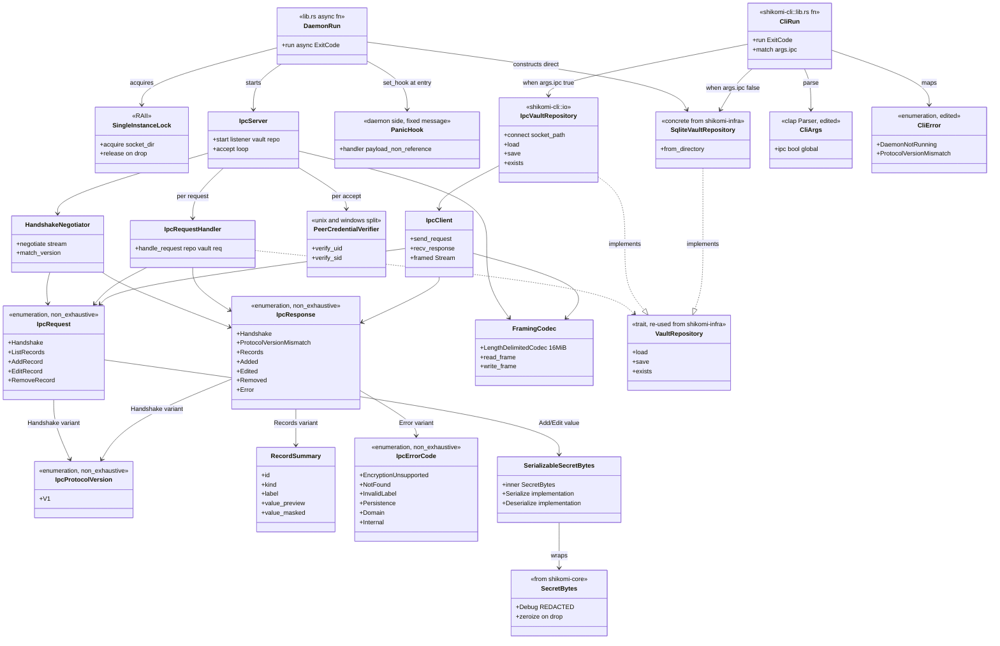

# 基本設計書 — index（モジュール / クラス / 処理フロー / シーケンス / 外部連携 / ER）

<!-- 詳細設計書とは別ファイル。統合禁止 -->
<!-- feature: daemon-ipc / Issue #26 -->
<!-- 配置先: docs/features/daemon-ipc/basic-design/index.md -->
<!-- 兄弟: ./flows.md, ./security.md, ./error.md, ./ipc-protocol.md -->

## 記述ルール（必ず守ること）

基本設計に**疑似コード・サンプル実装（python/ts/go 等の言語コードブロック）を書くな**。
ソースコードと二重管理になりメンテナンスコストしか生まない。
ここでは Rust の関数シグネチャは**プレーンテキスト（インライン `code`）**で示し、実装本体は一切書かない。Mermaid 図 + 表 + 箇条書きで設計判断を記述する。

`basic-design.md` 単一ファイルの 500 行超えを避けるため、本基本設計は次の 5 ファイルに分割する（`cli-vault-commands` の前例を踏襲、ipc-protocol は本 feature 固有）:

| ファイル | 担当領域 |
|---------|---------|
| `index.md` | モジュール構成 / クラス設計（概要）/ アーキテクチャへの影響 / 外部連携 / UX設計（DX観点）/ ER 図 |
| `flows.md` | 処理フロー / シーケンス図 |
| `security.md` | セキュリティ設計 / 脅威モデル / OWASP Top 10 / 依存 crate の CVE 確認 / `expose_secret` 経路監査 / `SecretBytes` シリアライズ契約 |
| `error.md` | エラーハンドリング方針 / 禁止事項 / Fail Fast 集約 |
| `ipc-protocol.md` | IPC プロトコル論理スキーマ（型表形式）/ ハンドシェイク仕様 / バージョニングルール |

各ファイルは独立して読めるよう、内部参照は `./xxx.md §...` 形式で記す。

## モジュール構成

本 feature は **3 crate に跨る変更**を伴う:

1. **`shikomi-core`**: `ipc` モジュールを新設（IPC スキーマの単一真実源）+ `secret::SecretBytes`（未存在の場合）追加
2. **`shikomi-daemon`**: 骨格実装（ライフサイクル + IPC サーバ + リクエストハンドラ）
3. **`shikomi-cli`**: `io::IpcVaultRepository` 追加 + `--ipc` フラグ + コンポジションルート分岐

### `shikomi-core::ipc` モジュール（新設、単一真実源）

| 機能ID | モジュール | ディレクトリ | 責務 |
|--------|----------|------------|------|
| REQ-DAEMON-018, 019 | `shikomi_core::ipc::version` | `crates/shikomi-core/src/ipc/version.rs` | `IpcProtocolVersion` enum（`#[non_exhaustive]`、`V1` 初期）|
| REQ-DAEMON-018, 020 | `shikomi_core::ipc::request` | `crates/shikomi-core/src/ipc/request.rs` | `IpcRequest` enum（5 バリアント: `Handshake`, `ListRecords`, `AddRecord`, `EditRecord`, `RemoveRecord`、`#[non_exhaustive]`）|
| REQ-DAEMON-007〜010, 021 | `shikomi_core::ipc::response` | `crates/shikomi-core/src/ipc/response.rs` | `IpcResponse` enum（`#[non_exhaustive]`、`Records` / `Added` / `Edited` / `Removed` / `Handshake` / `ProtocolVersionMismatch` / `Error`）|
| REQ-DAEMON-007 | `shikomi_core::ipc::summary` | `crates/shikomi-core/src/ipc/summary.rs` | `RecordSummary` struct（機密値非含有な投影型）|
| REQ-DAEMON-021 | `shikomi_core::ipc::error_code` | `crates/shikomi-core/src/ipc/error_code.rs` | `IpcErrorCode` enum（`#[non_exhaustive]`） |
| REQ-DAEMON-020 | `shikomi_core::ipc::secret_bytes` | `crates/shikomi-core/src/ipc/secret_bytes.rs` | `SerializableSecretBytes` ラッパ（`expose_secret` 不使用な `Serialize` / `Deserialize` 実装、`./security.md §SecretBytes のシリアライズ契約` 参照）|
| REQ-DAEMON-020 | `shikomi_core::secret::SecretBytes` | `crates/shikomi-core/src/secret/bytes.rs`（既存の場合スキップ）| `Vec<u8>` 系 secret ラッパ（`Debug` で `[REDACTED]` 固定、`zeroize` 対応）|

```
ディレクトリ構造:
crates/shikomi-core/src/
  ipc/
    mod.rs                    # 再エクスポート
    version.rs                # IpcProtocolVersion
    request.rs                # IpcRequest
    response.rs               # IpcResponse
    summary.rs                # RecordSummary
    error_code.rs             # IpcErrorCode
    secret_bytes.rs           # SerializableSecretBytes
    tests.rs                  # IpcRequest/Response の round-trip テスト（rmp-serde は dev-dep として shikomi-core に追加するか、shikomi-daemon の integration test に置く——詳細設計で確定）
  secret/
    mod.rs                    # 既存
    bytes.rs                  # SecretBytes（本 feature で新規 or 既存確認）
```

### `shikomi-daemon` crate（骨格実装）

| 機能ID | モジュール | ディレクトリ | 責務 |
|--------|----------|------------|------|
| REQ-DAEMON-001 + Composition Root | `shikomi_daemon::run` | `crates/shikomi-daemon/src/lib.rs` | `pub async fn run() -> ExitCode`。`tokio` 多重スレッドランタイム / panic_hook / tracing 初期化 / シングルインスタンス先取り / `repo` 構築 / IPC サーバ起動 / graceful shutdown |
| （bin エントリ） | `shikomi-daemon` bin | `crates/shikomi-daemon/src/main.rs` | `#[tokio::main] async fn main() -> ExitCode { shikomi_daemon::run().await }` の数行 |
| REQ-DAEMON-002, 003 | `lifecycle::single_instance` | `crates/shikomi-daemon/src/lifecycle/single_instance.rs` | OS 別シングルインスタンス先取り。`SingleInstanceLock` 構造体（RAII）|
| REQ-DAEMON-014 | `lifecycle::shutdown` | `crates/shikomi-daemon/src/lifecycle/shutdown.rs` | `tokio::signal` 受信 / in-flight 待機 / `VaultLock` 解放 / ソケット削除 |
| REQ-DAEMON-004, 005 | `ipc::server` | `crates/shikomi-daemon/src/ipc/server.rs` | listener 生成 / `accept` ループ / ピア検証 / 接続ごとのタスク spawn |
| REQ-DAEMON-006, 011, 012 | `ipc::framing` | `crates/shikomi-daemon/src/ipc/framing.rs` | `LengthDelimitedCodec` 設定（16 MiB 上限）/ `Framed::next` / `Framed::send` の薄い wrapper |
| REQ-DAEMON-006 | `ipc::handshake` | `crates/shikomi-daemon/src/ipc/handshake.rs` | 初回フレーム検証 / `IpcProtocolVersion` 一致判定 / `ProtocolVersionMismatch` 返送 |
| REQ-DAEMON-007〜010, 013, 023 | `ipc::handler` | `crates/shikomi-daemon/src/ipc/handler.rs` | `IpcRequest` → `IpcResponse` の pure 写像（`Mutex<Vault>` / `&dyn VaultRepository` 注入）|
| REQ-DAEMON-005 | `permission::peer_credential` | `crates/shikomi-daemon/src/permission/peer_credential.rs` | OS 別ピア UID / SID 取得（`unix.rs` / `windows.rs` 分割）|
| REQ-DAEMON-022 | `panic_hook` | `crates/shikomi-daemon/src/panic_hook.rs` | fixed-message panic hook（CLI と同型）|

```
ディレクトリ構造:
crates/shikomi-daemon/src/
  main.rs                     # tokio::main エントリ
  lib.rs                      # pub async fn run() -> ExitCode
  panic_hook.rs               # CLI 同型 fixed-message
  lifecycle/
    mod.rs
    single_instance.rs        # SingleInstanceLock RAII（unix/windows 分岐）
    shutdown.rs               # signal 受信 + graceful 停止
  ipc/
    mod.rs
    server.rs                 # IpcServer<R: VaultRepository>
    framing.rs                # LengthDelimitedCodec wrapper
    handshake.rs              # IpcProtocolVersion 一致判定
    handler.rs                # handle_request pure 写像
    transport/
      mod.rs                  # cfg 分岐の入口
      unix.rs                 # cfg(unix): UnixListener / UnixStream
      windows.rs              # cfg(windows): NamedPipeServer / NamedPipeClient
  permission/
    mod.rs
    peer_credential/
      mod.rs                  # OS 非依存エントリ
      unix.rs                 # cfg(unix): SO_PEERCRED / LOCAL_PEERCRED
      windows.rs              # cfg(windows): GetNamedPipeClientProcessId
```

### `shikomi-cli` crate（既存編集）

| 機能ID | モジュール | ディレクトリ | 責務 |
|--------|----------|------------|------|
| REQ-DAEMON-015, 020 | `shikomi_cli::io::ipc_vault_repository` | `crates/shikomi-cli/src/io/ipc_vault_repository.rs` | `IpcVaultRepository` 実装（`VaultRepository` trait）/ `connect` / `default_socket_path` |
| REQ-DAEMON-015 | `shikomi_cli::io::ipc_client` | `crates/shikomi-cli/src/io/ipc_client.rs` | IPC 送受信の細部（`Framed` 保持 / `send_request` / `recv_response`） |
| REQ-DAEMON-016 | `shikomi_cli::cli` | `crates/shikomi-cli/src/cli.rs`（既存編集）| `--ipc` グローバルフラグ追加 |
| REQ-DAEMON-016, 017 | `shikomi_cli::run` | `crates/shikomi-cli/src/lib.rs`（既存編集）| `args.ipc` 分岐で `IpcVaultRepository::connect` or `SqliteVaultRepository::from_directory` |
| REQ-DAEMON-017 | `shikomi_cli::error` | `crates/shikomi-cli/src/error.rs`（既存編集）| `CliError::DaemonNotRunning` / `ProtocolVersionMismatch` バリアント追加 |
| REQ-DAEMON-017 | `shikomi_cli::presenter::error` | `crates/shikomi-cli/src/presenter/error.rs`（既存編集）| `MSG-CLI-110` / `MSG-CLI-111` の英語/日本語併記 |

```
ディレクトリ構造（追加分のみ）:
crates/shikomi-cli/src/io/
  mod.rs                      # ipc_vault_repository / ipc_client を追加 export
  ipc_vault_repository.rs     # 新規
  ipc_client.rs               # 新規
```

**モジュール設計方針**:

- **`shikomi-core::ipc` は I/O を持たない**: `tokio` / `rmp-serde` / `tokio-util` を依存に入れない。`serde::{Serialize, Deserialize}` の derive のみで完結する。MessagePack シリアライズ実装（`rmp_serde::to_vec` / `from_slice`）は呼び出し側 crate（`shikomi-daemon` / `shikomi-cli`）の責務。これにより `shikomi-core` の純粋ドメイン性を維持する（`tech-stack.md` §4.5 と整合）
- **ハンドラは pure 写像**: `ipc::handler::handle_request(repo: &R, vault: &mut Vault, req: IpcRequest) -> IpcResponse` は I/O をしない pure な構造体写像。`Mutex<Vault>` ロック取得とハンドラ呼び出しは `ipc::server` 側の責務。これによりハンドラ単独で結合テストが容易（モック `VaultRepository` + 固定 `Vault` で UseCase 単位の検証）
- **OS 依存の集約**: `permission::peer_credential::{unix,windows}` と `ipc::transport::{unix,windows}` の 2 領域に閉じ込める。それ以外のロジック（ハンドラ / フレーミング / ハンドシェイク）は OS 非依存
- **`SqliteVaultRepository` 直結を維持**: daemon は `shikomi-infra::SqliteVaultRepository` を**直接保持**する。daemon 自身は `IpcVaultRepository` を使わない（自分自身に IPC 接続する意味がない、サーバ側の貫通が `IpcVaultRepository` の責務範囲外）
- **CLI のコンポジションルート 1 行差し替え**: `args.ipc` 分岐は `lib.rs::run()` 内の Repository 構築箇所のみ。`usecase` / `presenter` / `input` / `view` / `error` レイヤは無変更（`cli-vault-commands` の Phase 2 移行契約を実体化）

## クラス設計（概要）

daemon 層と CLI クライアント層の型依存を Mermaid クラス図で示す。具体的なメソッドシグネチャは詳細設計書（`../detailed-design/`）を参照。



**設計判断メモ**:

- **`shikomi-core::ipc` は `Serialize` / `Deserialize` のみを背負う**: MessagePack シリアライズの実体は呼び出し側に委ねる。`shikomi-core` に `rmp-serde` を依存させると、純粋ドメインクレートの方針（`tech-stack.md` §4.5）が崩れる
- **`SerializableSecretBytes` を別型にする理由**: `shikomi-core::SecretBytes` 自体は serde シリアライズを**意図的に持たない**（永続化フォーマット側で誤って `serde_json` 等に流れることを型で防ぐため）。IPC 経路でのみ秘密を運搬する文脈を `SerializableSecretBytes` newtype で明示化し、その型に **`expose_secret` を呼ばないシリアライズ実装**を用意する（`./security.md §SecretBytes のシリアライズ契約`）
- **ハンドラを pure に保つ**: `IpcRequestHandler::handle_request(repo, vault, req)` は `&mut Vault` と `&dyn VaultRepository` を受け取る pure な写像。タスク分離・タイムアウト・キャンセルは server 層の責務。これにより全ハンドラケースを単独 UT で網羅可能
- **`SingleInstanceLock` RAII**: lock ファイル `flock` 取得 → `unlink` → `bind` の 3 段階を構造体の `acquire` メソッドで完結させ、`Drop` で `flock` 解放 + ソケット削除を行う。ライフサイクル制御を型で表現（Tell, Don't Ask）
- **`PeerCredentialVerifier` の OS 分割**: `cfg(unix)` / `cfg(windows)` で実装を分け、共通インターフェイス `verify(stream) -> Result<(), PeerVerificationError>` に揃える。OS 境界は `cfg`、それ以外は実行時分岐（`tech-stack.md` §3 と整合）
- **CLI 側の最小変更**: `args.ipc` 分岐を `run()` 内に置き、UseCase / Presenter は無変更。Phase 2 移行契約の実体化が型システムレベルで完了する
- **`#[non_exhaustive]` の活用**: `IpcProtocolVersion` / `IpcRequest` / `IpcResponse` / `IpcErrorCode` の 4 つに付与。後続 feature のバリアント追加が**全て非破壊変更**として扱える（`match` 強制 wildcard、新 variant の追加で既存コードが壊れない）

## 処理フロー / シーケンス図

`./flows.md` を参照（分割先）。daemon 起動 → シングルインスタンス確保 → IPC 接続受付 → ハンドシェイク → vault 操作 → graceful shutdown の主要フローと、CLI `--ipc list` のシーケンス図を含む。

## アーキテクチャへの影響

`docs/architecture/` 配下への影響を網羅する。

### `context/process-model.md` への影響

**変更なし**。工程 0（PR #27）で §4.1 ルール 2（シングルインスタンス保証 3 段階）/ §4.1.1（Phase 1 → Phase 2 移行 / `IpcVaultRepository` 配置先）/ §4.2（IPC 認証 2 階層 / プロトコルバージョニング / 対応操作 5 バリアント）が**Issue #26 の実装スコープに合わせて既に確定済み**。本 feature の設計はこれを**準拠する側**であり、再規定しない。

### `tech-stack.md` への影響

**変更なし**（設計 PR では）。工程 0 で §2.1 IPC 4 行（シリアライズ / トランスポート / フレーミング / バージョニング）が確定済み。`tokio` `^1.44.2` / `tokio-util` `^0.7` / `rmp-serde` `^1.3` のピン根拠と RustSec 履歴も明文化済み。

実装 PR で `[workspace.dependencies]` に `tokio-util` / `rmp-serde` / `bytes` / `nix` / `windows-sys` を追加する際、§4.5（shikomi-core の crate）/ §4.6（shikomi-cli の crate）に**追加**項目が出るが、本設計 PR では tech-stack.md を変更しない（`cli-vault-commands` の `infra-changes.md` 同方針: 「変更理由の根拠が実装時の確定バージョンと連動するため」）。

### `context/threat-model.md` への影響

**変更なし**。§S 行（Spoofing）と §A07 行（Auth Failures）で「ピア UID 検証は Issue #26 で実装、セッショントークンは後続 Issue で `V2` 拡張」が PR #27 で整合済み。本 feature の `security.md` は arch threat-model の規定を実装層に降ろす役割。

### `context/overview.md` / `nfr.md` への影響

**変更なし**。本 feature のホットキー応答時間バジェット（p95 50 ms / IPC 単発）は `nfr.md` §9 と整合する。

## 外部連携

該当なし — 理由: 本 feature は外部サービス（HTTP / gRPC / クラウド API）と接続しない。ローカル UDS / Named Pipe / `tracing` ログのみを扱う。

## UX設計（DX 観点）

UI 不在のため、エンドユーザ体験ではなく**実装者・後続 feature 担当者の DX** を扱う。

### 後続 feature 担当者の DX

| シナリオ | 本 feature の設計フック | 担当者の作業量 |
|---------|------------------|--------------|
| ホットキー登録 IPC を追加したい | `IpcRequest` の `#[non_exhaustive] enum` に `HotkeyRegister { ... }` バリアント追加 + ハンドラ実装 | 型 1 バリアント + ハンドラ 1 関数 |
| 暗号化操作（unlock / lock）を追加したい | `IpcRequest` に `Unlock { master_password: SerializableSecretBytes }` 追加 + daemon 状態遷移実装 | 型追加 + daemon 内 `VaultUnlocker` モジュール |
| daemon ログレベルを動的変更したい | `IpcRequest::SetLogLevel { level }` 追加 + `tracing_subscriber::reload` で hot reload | 型追加 + reload handle 注入 |
| GUI が IPC クライアントを使いたい | `IpcVaultRepository` を `shikomi-gui` から再利用するか、`shikomi-cli::io::ipc_vault_repository` を別 crate（`shikomi-ipc-client` 仮）に切出 | GUI feature 内で判断（本 feature は選択肢を狭めない） |

### CLI ユーザの体験（`--ipc` オプトイン）

| ペルソナ | 体験 |
|---------|------|
| 山田 美咲 | `shikomi --ipc list` で daemon 経由動作を確認、`shikomi list` と bit 同一の結果が得られる |
| 田中 俊介 | `--ipc` を指定しないため挙動変更なし。daemon の存在を意識しない |
| 野木 拓海 | daemon を `shikomi-daemon &` で手動起動 → `shikomi --ipc <cmd>` で動作確認、後続 feature の足場とする |
| 志摩 凛 | `IpcVaultRepository` のコードを読み、IPC 接続〜ハンドシェイク〜操作の順序が明確で PR を投げやすい |

### daemon 運用者向け（手動起動時の体験）

OS 自動起動は後続 feature（`process-model.md` §4.1 ルール 3）で扱う。本 feature 時点では **3 OS いずれも手動起動**が基本。以下は 3 OS 並記の起動例（**`MSG-CLI-110` の hint 文面と同じバイナリ名・コマンドで揃える**、ペガサス指摘 ②）:

| OS | 基本起動 | サービス経由（任意、手動配置必要） |
|----|---------|--------------------------------|
| **Linux** | `shikomi-daemon &`（フォアグラウンド shell からバックグラウンド起動）| `systemctl --user start shikomi-daemon`（`~/.config/systemd/user/shikomi-daemon.service` 事前配置、`process-model.md` §4.1 ルール 3 Linux 節）|
| **macOS** | `shikomi-daemon &`（同上） | `launchctl kickstart gui/$(id -u)/dev.shikomi.daemon`（`~/Library/LaunchAgents/dev.shikomi.daemon.plist` 事前配置）|
| **Windows** | PowerShell で `Start-Process -NoNewWindow shikomi-daemon`（hidden プロセス起動）| タスクスケジューラへのユーザ領域タスク登録（`process-model.md` §4.1 ルール 3 Windows 節）。本 feature では自動配置なし、手動登録が必要 |

**停止方法**:
- **Linux / macOS**: `Ctrl+C`（フォアグラウンド起動時）/ `kill <pid>`（バックグラウンド）/ `systemctl --user stop shikomi-daemon` / `launchctl kill TERM gui/$(id -u)/dev.shikomi.daemon`
- **Windows**: `Stop-Process -Name shikomi-daemon`

いずれも内部的に `SIGTERM` / `SIGINT` / `CTRL_CLOSE_EVENT` を daemon に送り graceful shutdown（`./flows.md §REQ-DAEMON-014`）。

**ログ確認**:
- 環境変数 `SHIKOMI_DAEMON_LOG` で `tracing` レベル制御（`info` デフォルト）
- Linux (systemd): `journalctl --user -u shikomi-daemon -f`
- macOS (launchd): `log stream --predicate 'subsystem == "dev.shikomi.daemon"'`（launchd stdout 経路）or 手動起動時は stderr 直接
- Windows: PowerShell に起動した場合は当該 window に出力、`Start-Process` hidden 時はログファイル出力が必要（`SHIKOMI_DAEMON_LOG_FILE` 拡張は将来 feature、本 feature では stderr のみ）

## ER図

本 feature は永続化スキーマを持たない。**IPC 経路で運搬する DTO の関係**を ER 図で表現する。

```mermaid
erDiagram
    IPC_PROTOCOL_VERSION ||--o| IPC_REQUEST_HANDSHAKE : version_field
    IPC_PROTOCOL_VERSION ||--o| IPC_RESPONSE_HANDSHAKE : version_field
    IPC_PROTOCOL_VERSION ||--o{ IPC_RESPONSE_PROTOCOL_MISMATCH : "server_or_client field"

    IPC_REQUEST ||--o| IPC_REQUEST_HANDSHAKE : variant
    IPC_REQUEST ||--o| IPC_REQUEST_LIST : variant
    IPC_REQUEST ||--o| IPC_REQUEST_ADD : variant
    IPC_REQUEST ||--o| IPC_REQUEST_EDIT : variant
    IPC_REQUEST ||--o| IPC_REQUEST_REMOVE : variant

    IPC_REQUEST_ADD {
        RecordKind kind
        RecordLabel label
        SerializableSecretBytes value "MessagePack bin, no expose_secret"
        OffsetDateTime now "client-generated UTC"
    }
    IPC_REQUEST_EDIT {
        RecordId id
        RecordLabel label_opt
        SerializableSecretBytes value_opt "Option, MessagePack bin"
        OffsetDateTime now
    }
    IPC_REQUEST_REMOVE {
        RecordId id
    }

    IPC_RESPONSE ||--o| IPC_RESPONSE_HANDSHAKE : variant
    IPC_RESPONSE ||--o| IPC_RESPONSE_PROTOCOL_MISMATCH : variant
    IPC_RESPONSE ||--o| IPC_RESPONSE_RECORDS : variant
    IPC_RESPONSE ||--o| IPC_RESPONSE_ADDED : variant
    IPC_RESPONSE ||--o| IPC_RESPONSE_EDITED : variant
    IPC_RESPONSE ||--o| IPC_RESPONSE_REMOVED : variant
    IPC_RESPONSE ||--o| IPC_RESPONSE_ERROR : variant

    IPC_RESPONSE_RECORDS ||--o{ RECORD_SUMMARY : contains
    RECORD_SUMMARY {
        RecordId id
        RecordKind kind
        RecordLabel label
        Option_String value_preview "Some when Text only, None for Secret"
        bool value_masked "true when Secret"
    }
    IPC_RESPONSE_ERROR ||--|| IPC_ERROR_CODE : embeds

    IPC_ERROR_CODE ||--o| ENCRYPTION_UNSUPPORTED : variant
    IPC_ERROR_CODE ||--o| NOT_FOUND : variant
    IPC_ERROR_CODE ||--o| INVALID_LABEL : variant
    IPC_ERROR_CODE ||--o| PERSISTENCE : variant
    IPC_ERROR_CODE ||--o| DOMAIN : variant
    IPC_ERROR_CODE ||--o| INTERNAL : variant

    NOT_FOUND { RecordId id }
    INVALID_LABEL { String reason }
    PERSISTENCE { String reason }
    DOMAIN { String reason }
    INTERNAL { String reason }

    IPC_REQUEST_ADD ||--o| RECORD_SUMMARY : added_id_returned_in_IPC_RESPONSE_ADDED
    IPC_REQUEST_EDIT ||--o| RECORD_SUMMARY : edited_id_returned_in_IPC_RESPONSE_EDITED
    IPC_REQUEST_REMOVE ||--o| RECORD_SUMMARY : removed_id_returned_in_IPC_RESPONSE_REMOVED
```



**整合性ルール**:

- `RECORD_SUMMARY` は**機密値を含まない**（`value_preview` は Text の先頭 40 char、Secret は `None`）。daemon 側で `shikomi-core::Record::text_preview` を呼び生成する（`expose_secret` は core 内に閉じる）
- `IPC_REQUEST_ADD.value` / `IPC_REQUEST_EDIT.value_opt` は `SerializableSecretBytes` 型で**バイト列をそのまま** MessagePack `bin` に直列化する。経路上で `expose_secret` は呼ばれない（`./security.md §SecretBytes のシリアライズ契約` で具体仕様）
- `IPC_RESPONSE_PROTOCOL_MISMATCH` は `server` と `client` の両 `IpcProtocolVersion` を持つ（不一致の具体値を返すことで開発者がバグ追跡可能、ペテルギウス指摘に整合）
- `IPC_REQUEST_ADD.now` / `IPC_REQUEST_EDIT.now` は**クライアント側で `OffsetDateTime::now_utc()`** を取得して送る（既存 `cli-vault-commands` の UseCase が `now` を引数で受ける設計と整合）。daemon 側は受信した `now` を**そのまま信用**して `Record::new` / `Record::with_updated_*` に渡す
- 全 enum バリアントは `#[non_exhaustive]` で、後続 feature のバリアント追加が非破壊変更として扱える

エラーハンドリング方針および禁止事項は `./error.md` 参照。セキュリティ設計および依存 crate の CVE 確認結果は `./security.md` 参照。IPC プロトコルの論理スキーマ（型表 / バイトレイアウト / バージョニングルール）は `./ipc-protocol.md` 参照。
