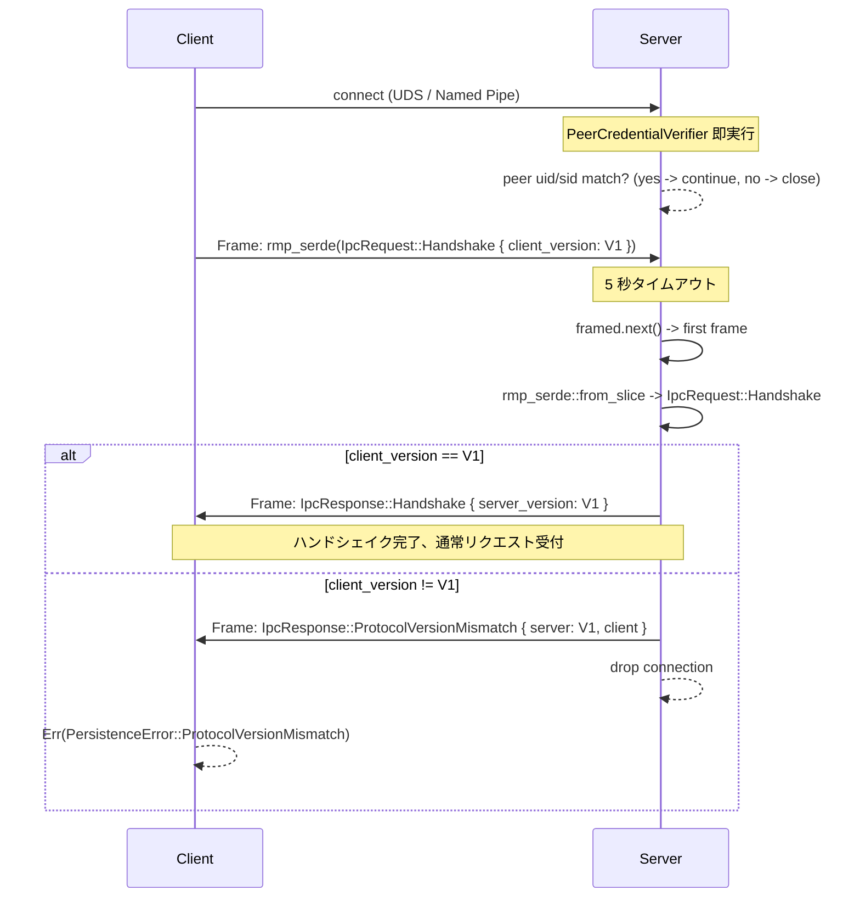
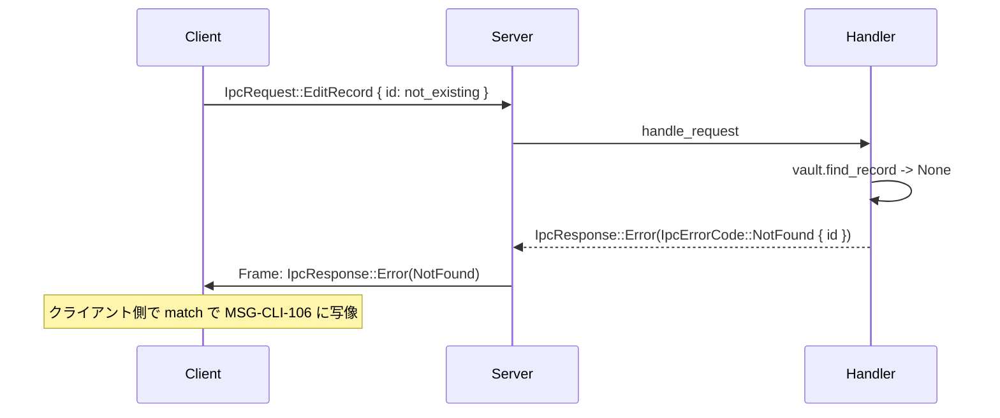

# 基本設計書 — ipc-protocol（IPC プロトコル論理スキーマ / ハンドシェイク仕様 / バージョニングルール）

<!-- 詳細設計書とは別ファイル。統合禁止 -->
<!-- feature: daemon-ipc / Issue #26 (Phase 1: list) / Issue #30 (Phase 1.5: add/edit/remove) -->
<!-- 配置先: docs/features/daemon-ipc/basic-design/ipc-protocol.md -->
<!-- 兄弟: ./index.md, ./flows.md, ./security.md, ./error.md -->

## 記述ルール

本書には**疑似コード・サンプル実装を書かない**（設計書共通ルール）。プロトコル仕様は表 + Mermaid シーケンス図 + 箇条書きで表現する。MessagePack の具体バイト列展開は本書では扱わない（rmp-serde の `Serialize` 実装に委譲、詳細設計 `../detailed-design/protocol-types.md` で型定義レベルの確定を行う）。

## プロトコル概要

| 項目 | 仕様 |
|------|------|
| トランスポート | Unix Domain Socket（Linux / macOS）/ Named Pipe（Windows） |
| シリアライズ | MessagePack（`rmp-serde` `^1.3`） |
| フレーミング | length-delimited、4 バイト LE unsigned prefix + payload |
| 最大フレーム長 | 16 MiB（`tokio_util::codec::LengthDelimitedCodec::max_frame_length`） |
| バージョニング | `IpcProtocolVersion` enum、`#[non_exhaustive]`、初期 `V1` |
| 接続フロー | (1) connect → (2) Handshake 1 往復 → (3) vault 操作リクエスト/応答 N 往復 → (4) close |
| 暗号化 | なし（OS プロセス境界 + ピア UID/SID 検証で保護、TLS は localhost に過剰） |

## 論理スキーマ（型表）

### `IpcProtocolVersion`

`#[non_exhaustive] enum`、`serde(rename_all = "snake_case")`。

| バリアント | wire 表現 | 意味 |
|-----------|---------|------|
| `V1` | `"v1"`（MessagePack string） | 初期バージョン。`Handshake` / `ListRecords` / `AddRecord` / `EditRecord` / `RemoveRecord` の 5 バリアントを `IpcRequest` / `IpcResponse` で扱う。**Phase 1（PR #29）で `Handshake` + `ListRecords` 経路が透過、Phase 1.5（Issue #30）で `AddRecord` / `EditRecord` / `RemoveRecord` 経路が透過**。型定義そのものは Phase 1 で確定済み、Phase 1.5 で wire 仕様の変更なし |

**バージョニングルール**:

- 破壊的変更（バリアント追加 / フィールド追加）時に `V2`、`V3` 等を追加
- `V1` のレイアウト変更は禁止（`V2` バリアント追加で扱う）
- バリアントの**削除 / 改名禁止**（互換性契約）
- 文字列表現（`"v1"` 等）は数値より人間可読、`tracing` ログでも読みやすい

### `IpcRequest`

`#[non_exhaustive] enum`、`serde(rename_all = "snake_case")`。

| バリアント | フィールド | wire 表現（概念） | 意味 |
|-----------|-----------|---------------|------|
| `Handshake` | `client_version: IpcProtocolVersion` | `{"handshake": {"client_version": "v1"}}` | 接続直後の必須 1 往復、プロトコル一致確認 |
| `ListRecords` | なし | `{"list_records": null}` | 全レコードの `RecordSummary` を要求 |
| `AddRecord` | `kind: RecordKind`, `label: RecordLabel`, `value: SerializableSecretBytes`, `now: OffsetDateTime` | `{"add_record": {...}}` | 新規レコード追加 |
| `EditRecord` | `id: RecordId`, `label: Option<RecordLabel>`, `value: Option<SerializableSecretBytes>`, `now: OffsetDateTime` | `{"edit_record": {...}}` | 既存レコード更新（部分） |
| `RemoveRecord` | `id: RecordId` | `{"remove_record": {"id": "..."}}` | レコード削除 |

**約束**:
- `now` フィールドはクライアント側で `OffsetDateTime::now_utc()` を生成して送る（既存 `cli-vault-commands` UseCase が `now` 引数を持つ設計と整合）
- `value` フィールドは `SerializableSecretBytes`（`./security.md §SecretBytes のシリアライズ契約`）。MessagePack の `bin` 型に直列化、`expose_secret` 不使用
- `RecordKind` は `serde` 派生で `"text"` / `"secret"` の文字列表現
- `RecordLabel` は `String` ラッパで内部値をシリアライズ（既存ドメイン型）
- `RecordId` は UUIDv7 を `String` 形式で送る（既存ドメイン型の `Display` / `FromStr` 実装に整合）

### `IpcResponse`

`#[non_exhaustive] enum`、`serde(rename_all = "snake_case")`。

| バリアント | フィールド | 意味 |
|-----------|-----------|------|
| `Handshake` | `server_version: IpcProtocolVersion` | ハンドシェイク成功、プロトコル一致 |
| `ProtocolVersionMismatch` | `server: IpcProtocolVersion`, `client: IpcProtocolVersion` | プロトコル不一致、両側のバージョンを返す。直後に接続切断 |
| `Records` | `Vec<RecordSummary>` | `ListRecords` への応答 |
| `Added` | `id: RecordId` | `AddRecord` 成功 |
| `Edited` | `id: RecordId` | `EditRecord` 成功 |
| `Removed` | `id: RecordId` | `RemoveRecord` 成功 |
| `Error` | `IpcErrorCode` | 各種失敗（NotFound / EncryptionUnsupported / etc） |

### `RecordSummary`

`struct`、`serde(rename_all = "snake_case")`。

| フィールド | 型 | 意味 |
|----------|---|------|
| `id` | `RecordId` | レコード ID |
| `kind` | `RecordKind` | `Text` / `Secret` |
| `label` | `RecordLabel` | ラベル |
| `value_preview` | `Option<String>` | Text の場合は先頭 40 char、Secret は `None`（機密値非含有） |
| `value_masked` | `bool` | Secret は `true`、Text は `false` |

**設計理由**: List 応答に Secret 値を含めない（投影型）。`RecordPayload::Plaintext(SecretString)` をクライアントに送る経路を作らないことで、List ユースケースでの secret 漏洩経路を構造的に閉じる。Secret 値が必要な操作（将来の `show <id>` 等）は専用 IPC リクエストを別途設計する。

### `IpcErrorCode`

`#[non_exhaustive] enum`、`serde(rename_all = "snake_case")`。

| バリアント | フィールド | 意味 |
|-----------|-----------|------|
| `EncryptionUnsupported` | なし | 暗号化 vault は本 Issue 未対応 |
| `NotFound` | `id: RecordId` | 対象 id が vault に存在しない |
| `InvalidLabel` | `reason: String`（英語短文） | ラベル検証失敗 |
| `Persistence` | `reason: String`（英語短文） | `repo.save` 失敗等の I/O / SQLite |
| `Domain` | `reason: String`（英語短文） | `vault.add_record` 等の集約整合性 |
| `Internal` | `reason: String`（英語短文） | 想定外バグ |

**`reason` フィールドの設計規約**: 英語短文のみ、secret 値・絶対パス・ピア UID を含めない（`./error.md §IpcErrorCode バリアント詳細`）。

### `SerializableSecretBytes`

`struct`、手動 `Serialize` / `Deserialize` 実装（`./security.md §SecretBytes のシリアライズ契約`）。

| フィールド | 型 | 意味 |
|----------|---|------|
| `0` | `SecretBytes` | secret 値の `Vec<u8>` ラッパ（`Debug` `[REDACTED]` 固定、`Drop` で `zeroize`） |

**シリアライズ仕様**:
- `Serialize::serialize` → `serializer.serialize_bytes(self.0.as_serialize_slice())`（`expose_secret` を呼ばない、`SecretBytes::as_serialize_slice` は `pub(crate)`）
- `Deserialize::deserialize` → `Vec<u8>` を経由 → `SecretBytes::from_vec(bytes)` で構築
- MessagePack の wire 表現は `bin 8/16/32` 型（バイト列のまま転送）

## ハンドシェイク仕様

### 接続確立直後の必須シーケンス



### ハンドシェイクタイムアウト

- daemon 側: `tokio::time::timeout(Duration::from_secs(5), framed.next()).await` で待機
- タイムアウト時: 接続切断 + `tracing::warn!("handshake timeout")`（攻撃の可能性 / 実装バグ / ネットワーク問題のいずれか）
- 5 秒の根拠: ローカル UDS / Named Pipe で正常クライアントは即時 Handshake 送信できる。5 秒を超える遅延は異常

### 「最初のフレームが Handshake でない」場合

- daemon 側: `IpcRequest::ListRecords` 等が先に届いた場合、即時切断 + `tracing::warn!("first frame must be Handshake; got {variant_name}")`
- 設計理由: ハンドシェイクなしで vault 操作を許すと、プロトコルバージョンの確認をスキップでき将来の互換性破壊リスクが残る。**接続ごとに必ず Handshake を要求**

### `Handshake` の future expansion（後続 Issue）

`IpcProtocolVersion::V2` 追加と同時に `IpcRequest::Handshake { client_version, session_token }` への非破壊拡張を予定（`process-model.md` §4.2 認証 (2) scope-out 規定、本 feature は scope 外）。

- `#[non_exhaustive] enum` の効能で V1 クライアントが V2 daemon に接続しても、daemon 側で `match client_version` し V1 経路に分岐できる
- session token は `SerializableSecretBytes` 型で運搬（同じ secret 経路の信頼境界を再利用）
- 後続 Issue `daemon-session-token`（仮、未起票）で要件分析から取り組む

## バージョニングルール（プロトコル進化規約）

### 破壊的変更とは

以下のいずれかを「破壊的変更」とし、`V2` 等のバリアント追加で表現する:

1. `IpcRequest` / `IpcResponse` の既存バリアントの**フィールド追加 / 削除 / 改名 / 型変更**
2. `IpcRequest` / `IpcResponse` の**既存バリアント削除 / 改名**
3. `RecordSummary` / `IpcErrorCode` の**フィールド削除 / 改名 / 型変更**
4. シリアライズ wire 表現の変更（`rename_all` 規則 / `serde` attribute 変更）

### 非破壊変更とは

以下は **`V1` 内で許容される非破壊変更**（`#[non_exhaustive]` が型システムで保証する）:

1. `IpcProtocolVersion` への新バリアント追加（`V2`）
2. `IpcRequest` / `IpcResponse` への新バリアント追加（後続 feature の `HotkeyRegister` 等）
3. `IpcErrorCode` への新バリアント追加
4. `RecordSummary` への新フィールド追加（**ただし `#[serde(default)]` 必須**で旧クライアントが受信した時の falsy 値を許容）

**重要**: 「フィールド追加」は破壊的変更とみなす場合と非破壊変更とみなす場合がある:
- **破壊的扱い**: 必須フィールド追加（`Option<T>` ではない型でデフォルト不可）→ `V2` バリアント追加で
- **非破壊扱い**: `Option<T>` フィールド追加 + `#[serde(default)]` で旧側が `None` 受信可能

本 feature では破壊的扱いを**保守的に採用**（`V1` を凍結し新フィールドは `V2` で追加）。`Option<T>` の例外運用は将来 feature の判断に委ねる。

### バリアント命名

- スネークケース: `add_record` / `list_records`（`serde(rename_all = "snake_case")`）
- バージョンサフィックスを**つけない**: `AddRecord` であって `AddRecordV1` ではない（バージョンは `IpcProtocolVersion` で別管理）

### 新バリアント追加時の互換性

| 状況 | daemon | client | 期待挙動 |
|------|-------|--------|---------|
| daemon `V2` + client `V1` | `IpcRequest::HotkeyRegister`（V2 で追加）| 受信時の `match` で `_ => unknown variant`（`#[non_exhaustive]` 効能） | daemon 側がハンドシェイクで `ProtocolVersionMismatch` を先に検出して切断（V1 client は V1 daemon 想定） |
| daemon `V1` + client `V2` | 同上 | client が V2 機能を使うなら daemon 側でハンドシェイク `ProtocolVersionMismatch` で拒否 | client 側 `Err(ProtocolVersionMismatch)` |
| daemon `V2` + client `V2` | 全バリアント正常処理 | 同上 | 正常動作 |

**設計原則**: ハンドシェイクで**プロトコル完全一致**を要求する（後方互換 / 前方互換を期待しない）。理由: shikomi はバイナリ更新が容易な **OSS デスクトップアプリ**で、daemon と CLI を同一バージョンで配布する。Web API のような長期互換性は不要。

## フレーミング詳細

### `LengthDelimitedCodec` 設定

```
length_field_length:    4 bytes
length_field_endianness: little_endian
length_field_offset:    0
length_adjustment:      0
max_frame_length:       16 * 1024 * 1024 (16 MiB)
```

設定根拠:
- 4 バイト LE: x86_64 / ARM64 / WASM の標準。big_endian は SPARC 等の古アーキテクチャ向けで shikomi のターゲットには不要
- `length_adjustment: 0`: フレーム長フィールド自体を含まない payload 長を表現（`tokio-util` のデフォルト）
- 16 MiB: vault 100k レコード × 平均 200 byte = 20 MB を計算上超えない範囲。MVP では 16 MiB で十分（`process-model.md` §4.2、PR #27 確定）

### フレーム超過時の挙動

- `Codec::decode` がエラー返却 → `Framed::next` が `Some(Err(_))` を返す
- daemon 側ハンドラがエラー受信 → 該当接続のみ切断 + `tracing::warn!("frame length exceeds 16 MiB; closing connection")` + `Framed` Drop で部分読込バッファ解放
- daemon プロセスは継続（DoS 緩和）

## エラー応答の運搬

### `IpcResponse::Error` パターン

daemon 側で `Result<IpcResponse, IpcErrorCode>` 相当の構造をハンドラ内で扱い、`Err(code)` の場合は最終的に `IpcResponse::Error(code)` でラップして応答する。



### 接続切断 vs エラー応答の判断基準

| 事象 | 接続継続 + エラー応答 | 接続切断のみ |
|------|---------------------|------------|
| `NotFound` / `Domain` / `Persistence` | ✅ `IpcResponse::Error(...)` | — |
| `EncryptionUnsupported`（vault 操作中、防御的）| ✅ | — |
| `ProtocolVersionMismatch`（ハンドシェイク） | ✅ `IpcResponse::ProtocolVersionMismatch(...)` 直後に切断 | — |
| MessagePack デコード失敗 | — | ✅（プロトコル違反、応答できない） |
| フレーム長超過 | — | ✅（同上） |
| ピア UID/SID 不一致 | — | ✅（攻撃の可能性、即切断） |
| ハンドシェイクタイムアウト | — | ✅ |

**設計原則**: プロトコル整合性が保てる範囲では `IpcResponse::Error` で構造化応答、整合性が崩れた場合のみ切断（クライアント側で `Err(IpcIo)` 等として観測される）。

## バイナリ wire レイアウト（参考）

具体的な MessagePack バイト列展開は本書では扱わず、`rmp-serde` の `Serialize` 実装に委ねる。詳細設計 `../detailed-design/protocol-types.md` で型定義（`#[derive(Serialize, Deserialize)]` + `serde` attribute）まで確定する。

**確認手段**: 実装後、`crates/shikomi-core/src/ipc/tests.rs` の round-trip テスト（`rmp_serde::to_vec(&request)` → `rmp_serde::from_slice` で同値）で wire 表現の安定性を CI 検証する。バイト列の hex dump をテストに固定値として書く案もあるが、`rmp-serde` の最適化で MessagePack `fixmap` / `map16` 切替が起こる可能性があり、過度に脆いテストになるため**採用しない**（YAGNI、互換性は型 round-trip + プロトコルバージョン管理で十分）。
