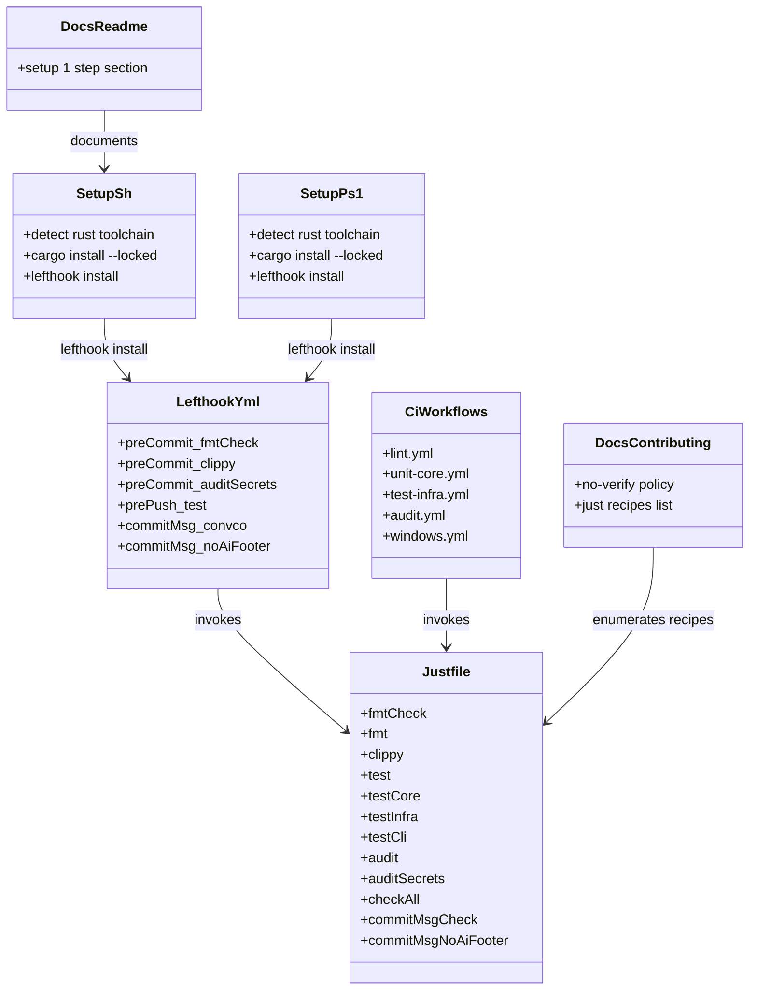
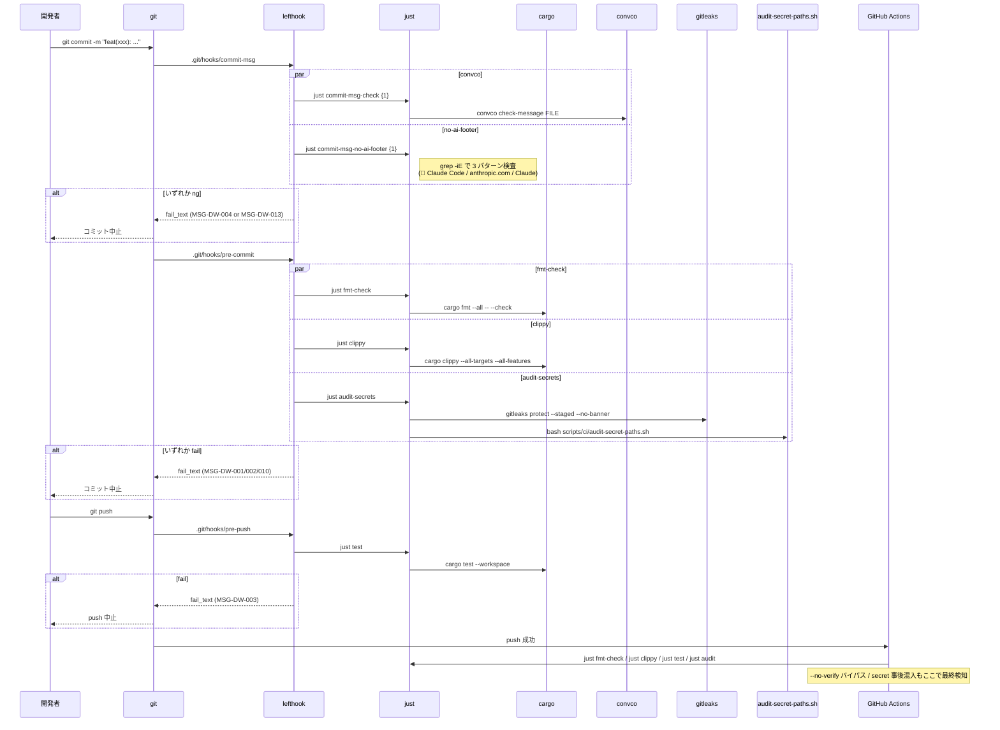
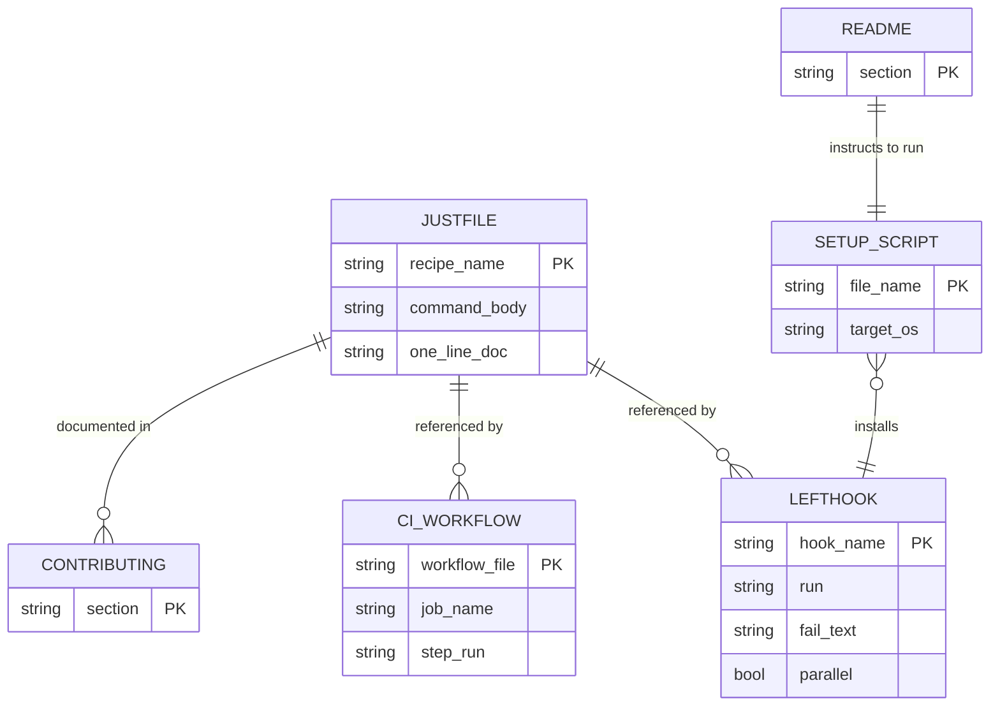

# 基本設計書

<!-- 詳細設計書とは別ファイル。統合禁止 -->
<!-- feature単位で1ファイル。新規featureならテンプレートコピー、既存featureなら既存ファイルをREAD→EDIT -->
<!-- 配置先: docs/features/dev-workflow/basic-design.md -->

## 記述ルール（必ず守ること）

基本設計に**疑似コード・サンプル実装（python/ts/go等の言語コードブロック）を書くな**。
ソースコードと二重管理になりメンテナンスコストしか生まない。

## モジュール構成

本 feature は Rust ソースコードを追加せず、**リポジトリルート直下の設定ファイル群**と **`scripts/` のセットアップスクリプト**のみで構成される。`crates/*` には一切触れない。

| 機能ID | モジュール | ディレクトリ | 責務 |
|--------|----------|------------|------|
| REQ-DW-001, 002, 003, 004, 012, 013, 018 | `lefthook.yml` | リポジトリルート | Git フック定義（pre-commit / pre-push / commit-msg）と静的 `fail_text`（2 行構造）。commit-msg は `convco` と `no-ai-footer` の 2 コマンド並列 |
| REQ-DW-005, 018 | `justfile` | リポジトリルート | タスクランナー定義。fmt / clippy / test / audit / audit-secrets / check-all / commit-msg-check / **commit-msg-no-ai-footer** レシピ集約 |
| REQ-DW-006 | `.github/workflows/*.yml`（既存 **5 本** を編集） | `.github/workflows/` | CI ワークフロー（`lint` / `unit-core` / `test-infra` / `audit` / `windows`）から `just <recipe>` を呼ぶ形に統一。`audit.yml` は `cargo-deny-action` を廃止し `just audit` 経由へ |
| REQ-DW-007, 015 | `scripts/setup.sh` | `scripts/` | Unix 向けセットアップ。Rust toolchain 検知 → Rust 製ツール `cargo install --locked` → Go 製ツール GitHub Releases + SHA256 検証 → `lefthook install` |
| REQ-DW-008, 014, 015 | `scripts/setup.ps1` | `scripts/` | Windows 向け。PowerShell 7+ 検査 → 以降は `setup.sh` と同等ロジック |
| REQ-DW-010, 017, 018 | `README.md`, `CONTRIBUTING.md` | リポジトリルート | setup 1 ステップ、`--no-verify` 禁止ポリシー、Secret 混入時の緊急対応手順、**AI 生成フッター禁止ポリシー**を記載 |
| REQ-DW-011 | 既存 CI（`lint.yml` 他 5 本）| `.github/workflows/` | 同一 `just <recipe>` を CI 側でも再実行（バイパス検知） |
| REQ-DW-013 | `scripts/ci/audit-secret-paths.sh`（既存、本 feature で改変禁止） | `scripts/ci/` | shikomi 独自の secret 経路契約（TC-CI-012〜015）の静的検証。本 feature は **引き回し専用**で、検知ロジックの追加・改変はスコープ外 |
| REQ-DW-013 | `gitleaks` 設定（`.gitleaks.toml` は初期採用せずデフォルトルールのみ使用） | リポジトリルート | 汎用 secret パターン（API キー / AWS / GCP 等）の staged diff スキャン。除外ルールが必要になった時点で `.gitleaks.toml` を Sub-issue で追加（YAGNI） |
| REQ-DW-016 | `.github/CODEOWNERS` | `.github/` | `/lefthook.yml`、`/justfile`、`/scripts/setup.sh`、`/scripts/setup.ps1`、`/scripts/ci/` を保護対象に追記 |

```
ディレクトリ構造（本 feature で追加・変更されるファイル）:
.
├── lefthook.yml                         [新規, CODEOWNERS保護]
├── justfile                             [新規, CODEOWNERS保護]
├── scripts/
│   ├── setup.sh                         [新規, CODEOWNERS保護]
│   ├── setup.ps1                        [新規, CODEOWNERS保護]
│   └── ci/                              [既存, CODEOWNERS保護]
│       └── audit-secret-paths.sh        [既存: 引き回し専用・本featureで改変禁止]
├── .github/
│   ├── CODEOWNERS                       [編集: dev-workflow関連5パスを追加]
│   └── workflows/
│       ├── lint.yml                     [編集: just fmt-check / just clippy]
│       ├── unit-core.yml                [編集: just test-core]
│       ├── test-infra.yml               [編集: just test-infra]
│       ├── audit.yml                    [編集: cargo-deny-action廃止→just audit]
│       └── windows.yml                  [編集: shell: pwsh → just test-infra]
├── README.md                            [編集: setup 1ステップ / PowerShell 7+必須]
└── CONTRIBUTING.md                      [編集: --no-verify禁止 / Secret混入時の緊急対応 / just レシピ一覧]
```

## クラス設計（概要）

本 feature は Rust クラスを持たない。代わりに「設定ファイル間の参照関係」を同等の図として示す。



**凝集のポイント**:
- **`justfile` が単一の真実源**（SSoT）。フック / CI / 開発者手動操作のいずれも同じレシピを呼ぶ（DRY）
- **依存方向は一方向**: setup → lefthook → justfile、CI → justfile。`justfile` は他設定を参照しない最下層
- **ドキュメントは参照のみ**: README / CONTRIBUTING は設定ファイルを書き換えず、記述だけ同期する

## 処理フロー

### REQ-DW-001〜004, 012, 013: 開発者の通常フロー（コミットから push まで）

1. 開発者が作業ツリーでファイルを変更
2. `git add` → `git commit -m "feat(xxx): ..."`
3. `commit-msg` フックが発火 → **`just commit-msg-check {1}`（convco 検証）と `just commit-msg-no-ai-footer {1}`（AI 生成フッター検出）を並列実行**
4. convco 規約違反: MSG-DW-004 で中止 / AI フッター検出: MSG-DW-013 で中止（両方違反時は lefthook が両方の `fail_text` を表示）
5. 両者 OK: 続いて `pre-commit` フックが発火 → **`just fmt-check` / `just clippy` / `just audit-secrets` を並列実行**（`parallel: true`）
6. fmt 違反: 「`[FAIL] cargo fmt 違反を検出しました。` / `次のコマンド: just fmt`」で中止（MSG-DW-001）
7. clippy 違反: MSG-DW-002 で中止
8. secret 検出（gitleaks / audit-secret-paths.sh のいずれか）: MSG-DW-010 で中止。検出箇所は `file:line` 形式で stderr
9. 全成功: コミット完了
10. `git push` → `pre-push` フック発火 → `just test` 実行
11. テスト失敗: MSG-DW-003 で中止
12. テスト成功: push 実行 → GitHub Actions が同一 `just <recipe>` を再実行（`--no-verify` バイパス時の最終検知）

### REQ-DW-007〜009, 014, 015: 新規参画者のセットアップフロー

1. `git clone git@github.com:shikomi-dev/shikomi.git`
2. `cd shikomi`
3. Unix: `bash scripts/setup.sh` / **Windows: `pwsh scripts/setup.ps1`**（PowerShell 7+ 必須）を実行
4. **Windows のみ**: `setup.ps1` 冒頭で `$PSVersionTable.PSVersion.Major -lt 7` 検査 → 不一致なら MSG-DW-011 で Fail Fast、`winget install Microsoft.PowerShell` を案内
5. `.git/` 存在確認 → 無ければ MSG-DW-009 で Fail Fast
6. `rustc --version` / `cargo --version` 検査 → 失敗時は MSG-DW-008（rustup 導入案内）
7. **Rust 製ツール**（`just` / `convco`）を `cargo install --locked <tool>` で導入。既存は `--version` で存在確認のみ（MSG-DW-006 表示）
8. **Go 製ツール**（`lefthook` / `gitleaks`）を GitHub Releases からダウンロード（URL は `{VERSION}` と `{PLATFORM}` を setup スクリプトのピン定数から合成）→ `sha256sum` / `Get-FileHash` で実測値を取得 → setup スクリプトのピン値と照合 → 不一致なら MSG-DW-012 で Fail Fast、一致なら `~/.cargo/bin/`（Windows は `$env:USERPROFILE\.cargo\bin\`）へ配置
9. `lefthook install` 実行（`.git/hooks/` へラッパを配置）
10. MSG-DW-005 を表示して exit 0

### REQ-DW-006, 011: CI 側の実行フロー

1. PR / push トリガで各ワークフローが起動
2. 共通ステップ: `actions/checkout@v4` → `dtolnay/rust-toolchain@stable` → `Swatinem/rust-cache@v2` → `cargo install --locked just`
3. ワークフロー固有ステップ: `just <recipe>`（例: `lint.yml` は `just fmt-check` と `just clippy`）
4. いずれか失敗で job が fail。`--no-verify` でバイパスした場合もここで必ず検知

## シーケンス図



## アーキテクチャへの影響

`docs/architecture/tech-stack.md` に **§2.5 開発ワークフロー（Git フック / タスクランナー）** セクションを追加する（同一 PR で更新）。内容:

- 採用: `lefthook` / `just` / `convco` の 3 ツール
- 不採用候補と却下根拠（cargo-husky / pre-commit / rusty-hook / build.rs / cargo-xtask / core.hooksPath + 生シェル / Makefile / commitlint / npm scripts）
- セットアップ経路: `scripts/setup.{sh,ps1}` の 1 ステップ方式
- CI ワークフローとローカルフックが **同一 `just <recipe>` を参照**する DRY 原則

アーキ図（`docs/architecture/production.md` 等）には影響しない（本 feature は配布バイナリに含まれない開発者ツールチェーンのみ）。

## 外部連携

| 連携先 | 目的 | 認証 | タイムアウト / リトライ |
|-------|------|-----|--------------------|
| crates.io | `cargo install --locked` での `just` / `lefthook` / `convco` 取得 | 不要（公開 registry） | cargo のデフォルト（30 秒 / リトライなし）。失敗時は Fail Fast で setup スクリプト中断 |
| GitHub Actions ランナー | CI 側での同ツール導入 | GitHub 自動 | Swatinem/rust-cache@v2 でキャッシュ後は高速化 |

**外部サービスの増設なし**: shikomi は元々 crates.io と GitHub に依存しており、本 feature は新規外部依存を持ち込まない。

## UX設計

本 feature の UX は「**開発者が Git 操作を普段通り行うだけで、ローカル検証が自動で走る**」こと。以下の体験を必ず保証する。

| シナリオ | 期待される挙動 |
|---------|------------|
| clone 直後に `git commit` | `scripts/setup.{sh,ps1}` が未実行なら、README 冒頭に「先に setup スクリプトを実行してください」の明示がある。setup 1 回で以後は自動 |
| コミット失敗時 | 失敗した検査名（**fmt / clippy / audit-secrets / convco / no-ai-footer** の 5 種）と **次に打つべきコマンド** が MSG-DW-001〜004, 010, 013 の **2 行構造**（`[FAIL] <要約>` / `次のコマンド: <復旧 1 行>`）で表示される。長文の cargo / gitleaks / grep 出力に埋もれない |
| push 失敗時 | 失敗テスト名と `just test` コマンドが案内される |
| `just` レシピ一覧 | `just` を引数なしで実行すると `just --list` が走り、全レシピが 1 行コメントつきで表示 |
| Windows 開発者 | **PowerShell 7+ 必須**。`setup.ps1` 冒頭で `$PSVersionTable.PSVersion.Major -lt 7` を検査し、未満なら即 Fail Fast（MSG-DW-011、`winget install Microsoft.PowerShell` を案内）。Windows PowerShell 5.1 は非対応と明示（REQ-DW-014 / 確定 A） |
| `--no-verify` 使用 | CONTRIBUTING に「原則禁止。やむを得ない場合は PR 本文で理由を明記し、CI で代替検証」と記載 |

**アクセシビリティ方針**: 本 feature は CLI のみ。色付け出力は `just` / `lefthook` / `cargo` のデフォルトに従い、色非対応端末でも `[FAIL]` / `[OK]` 等のテキストラベルで識別できる状態を維持する。

## セキュリティ設計

### 脅威モデル

| 想定攻撃者 | 攻撃経路 | 保護資産 | 対策 |
|-----------|---------|---------|------|
| **T1: 悪意のある PR 作者（内部バイパス）** | `--no-verify` でローカルフックをバイパスし、fmt 違反・脆弱依存追加・秘密経路追加（TC-CI-012〜015 契約違反）を push | shikomi のコード品質・秘密経路監査契約 | 全 CI ワークフロー（`lint` / `unit-core` / `test-infra` / `audit` / `windows`）が同一 `just <recipe>` を再実行。`just audit` は `cargo deny` + `audit-secret-paths.sh` を常時実行、`just audit-secrets` は pre-commit で追加実行 |
| **T2: 悪意ある secret コミッタ（水際突破）** | API キー / AWS 認証情報 / `.env` / 秘密鍵 を誤ってコミット。push 後は git history に残留し GitHub CDN にキャッシュされ得る | 開発者秘密情報、取引先・ユーザー情報、shikomi インフラ資源 | **pre-commit で gitleaks + audit-secret-paths.sh を並列実行（REQ-DW-013）**。CI 側でも同一チェックを再実行。push 後判明時は REQ-DW-017 の緊急対応手順（即 revoke → `git filter-repo` → secret scanning resolve）|
| **T3: サプライチェーン攻撃者（crates.io 経路）** | `just` / `convco` の悪意あるバージョンを crates.io に混入 | 開発者ローカル環境（配布バイナリは無関係） | `cargo install --locked` で配布 crate 側の Cargo.lock を使い依存解決を固定。`deny.toml` の `advisories` / `sources` チェックでレジストリ監査 |
| **T4: サプライチェーン攻撃者（GitHub Releases 経路）** | `lefthook` / `gitleaks` のリリースアーティファクトを改ざん | 同上 | **setup スクリプト内の SHA256 ピン定数で完全性検証（REQ-DW-015）**。バージョン更新時は PR で SHA256 差分を明示し、CODEOWNERS レビュー必須 |
| **T5: 悪意あるフック / レシピ定義（内部改変）** | 他開発者が PR で `lefthook.yml` / `justfile` / `scripts/setup.{sh,ps1}` / `scripts/ci/audit-secret-paths.sh` を改変し、任意コマンド実行・検知回避を仕込む | 他の開発者のローカル環境、secret 検知契約 | **`.github/CODEOWNERS` で上記 5 パスを保護対象に登録（REQ-DW-016）**。該当 PR は `@kkm-horikawa` のレビュー必須。3 人レビューチーム（ペテルギウス / ペガサス / 服部平次）も脅威観点でレビュー |
| **T6: Git 履歴情報漏洩（事後）** | `--no-verify` または secret 検知すり抜け後に push 済みとなった secret | 同 T2 | CONTRIBUTING.md §Secret 混入時の緊急対応に `git filter-repo` 手順と GitHub secret scanning 連携を記載（REQ-DW-017）。`main` / `develop` の force-push は引き続き禁止、feature ブランチ限定で実施 |
| **T7: フック失敗メッセージでの情報漏洩** | `fail_text` に絶対パス・ユーザ名・環境変数値が含まれ、CI ログ（外部閲覧可能な場合あり）に露出 | ユーザプライバシー | `fail_text` は**静的文字列のみ**。`${variables}` や `{files}` による動的展開を禁止。検出ファイル名が必要な場合は gitleaks / audit 側の stdout に出し、`fail_text` は 2 行構造（要約 + 復旧コマンド）のみとする |
| **T8: 設定ファイル改変後の検知スキップ** | `lefthook.yml` から `audit-secrets` コマンドを削除する PR が merge されれば、以降 pre-commit で secret 検知が作動しない | shikomi の secret 混入防止契約 | T5 の CODEOWNERS 保護に加え、**CI 側で独立に `just audit-secrets` を再実行**（`audit.yml` に組込み）。ローカル検知が無効化されても CI 側で再検知、二重防護 |
| **T9: AI 生成フッターの混入** | コントリビュータ / エージェント（Claude Code 等）が `🤖 Generated with Claude Code` / `Co-Authored-By: Claude <noreply@anthropic.com>` 等の trailer を含むコミットを発行。コミット履歴に AI 生成の痕跡が残留 | コミット履歴の真実源性、オーナー方針（`@kkm-horikawa`）、将来的な企業利用でのコード所有権明確化要求 | **commit-msg フックで `just commit-msg-no-ai-footer` が 3 パターン（🤖 Generated with Claude / Co-Authored-By: @anthropic.com / Co-Authored-By: Claude）を case-insensitive 照合して reject**（REQ-DW-018）。CONTRIBUTING.md §AI 生成フッターの禁止に規約として明記。`--no-verify` バイパス時は人間のレビュワーと `@kkm-horikawa` が PR レビューで検知する（pre-receive hook 不在のため機械的遮断は不可能、Agent-C ペルソナ向けには CONTRIBUTING の明示で教示） |

### OWASP Top 10 対応

| # | カテゴリ | 対応状況 |
|---|---------|---------|
| A01 | Broken Access Control | **CODEOWNERS でワークフロー設定 5 パスを保護（REQ-DW-016、T5 対策）**。GitHub 側で feature ブランチ保護と合わせ、未承認変更を遮断 |
| A02 | Cryptographic Failures | **lefthook / gitleaks バイナリを SHA-256 で完全性検証（REQ-DW-015、T4 対策）**。暗号処理そのものは扱わないが、サプライチェーン完全性に暗号ハッシュを使用 |
| A03 | Injection | `justfile` レシピは静的コマンド列、ユーザ入力の埋め込みなし。`commit-msg-check` は `convco check-message` に**ファイルパスのみ**を渡し、メッセージ本文はツール側で安全に処理。`fail_text` は静的文字列のみ（T7 対策） |
| A04 | Insecure Design | Fail Fast / DRY / Tell-Don't-Ask を基本原則として設計。`build.rs` による暗黙副作用方式を明示却下（§要求分析 §議論結果）。secret 検知は **pre-commit + CI の二重防護**（T2・T8 対策） |
| A05 | Security Misconfiguration | `lefthook install` は `.git/hooks/` の既定パスに書き、`core.hooksPath` の変更を伴わない。他リポジトリへの影響なし。setup スクリプトは `set -euo pipefail` / `$ErrorActionPreference = 'Stop'` で Fail Fast |
| A06 | Vulnerable Components | `cargo-deny` の `advisories` / `bans` / `licenses` / `sources` チェックを `just audit` として統合。CI の `audit.yml` で常時実行。lefthook / gitleaks はバイナリ固定 + SHA256 検証 |
| A07 | Auth Failures | 該当なし — 理由: 本 feature は認証機構を持たない |
| A08 | Data Integrity Failures | `cargo install --locked` で依存解決を固定。`lefthook` / `gitleaks` は SHA-256 検証つきで配置（T4 対策）。GitHub Actions の `Swatinem/rust-cache@v2` は公式 action を採用 |
| A09 | Logging Failures | フック失敗メッセージは stderr に明示、**5 プレフィックス統一 `[FAIL] / [OK] / [SKIP] / [WARN] / [INFO]`**（詳細設計書 §プレフィックス統一）で視認性確保。CI ログは GitHub Actions 標準の保持ポリシーに従う。`fail_text` 動的展開禁止で PII 漏洩回避（T7 対策） |
| A10 | SSRF | 該当なし — 理由: 本 feature は外部 URL へのリクエストを動的に発行しない。GitHub Releases URL は setup スクリプトにハードコードで固定 |

## ER図

本 feature はデータベースエンティティを持たない。設定ファイル間の参照関係を簡易 ER 図として示す。



## エラーハンドリング方針

| 例外種別 | 処理方針 | ユーザーへの通知 |
|---------|---------|----------------|
| `rustc` / `cargo` 未検出 | setup スクリプトが即 exit（`set -euo pipefail` / `$ErrorActionPreference = 'Stop'`） | MSG-DW-008（rustup 導入案内） |
| `cargo install` 失敗（ネットワーク断・crates.io 障害） | setup スクリプト中断、失敗ツール名を stderr に表示 | 「ネットワークを確認のうえ再実行してください」を追記 |
| `lefthook install` 失敗（`.git/` 不在） | setup スクリプト中断 | MSG-DW-009 |
| pre-commit / pre-push / commit-msg 各失敗 | lefthook が exit 非 0 を git へ伝搬、git が操作を中止 | lefthook の `fail_text`（MSG-DW-001〜004） |
| `just` レシピ未定義 | just が usage を表示、exit 非 0 | CI が fail → PR レビューで捕捉 |
| `justfile` / `lefthook.yml` パースエラー | ツールが構文エラーを stderr に表示 | 設定変更 PR の pre-commit 段階で fail（自己適用） |
