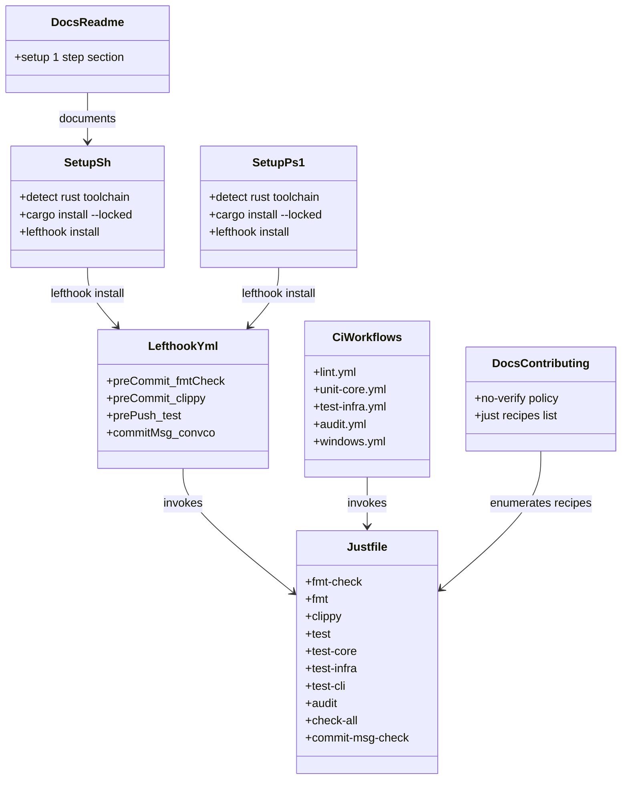
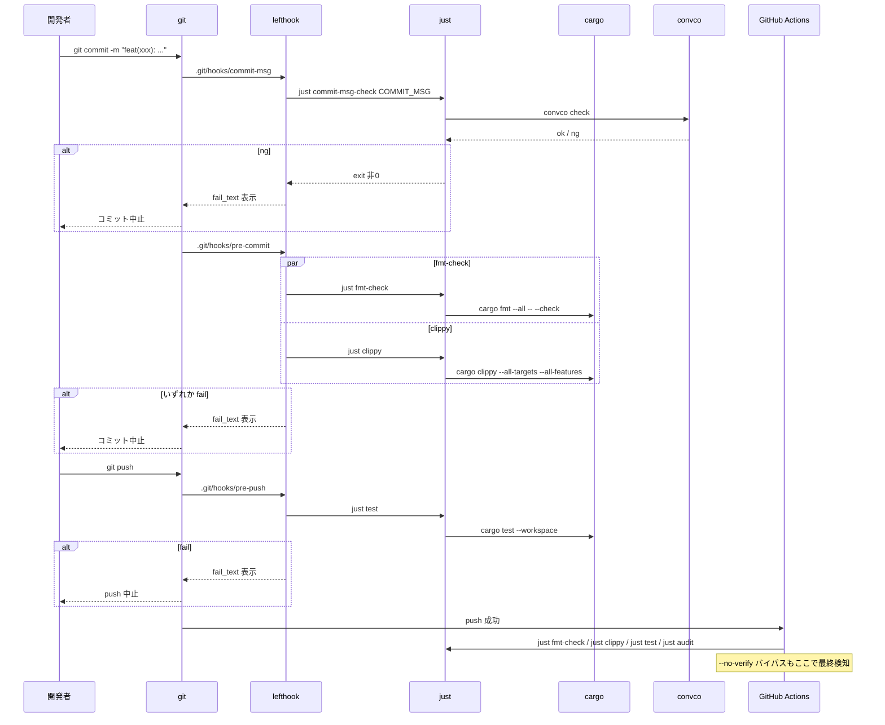
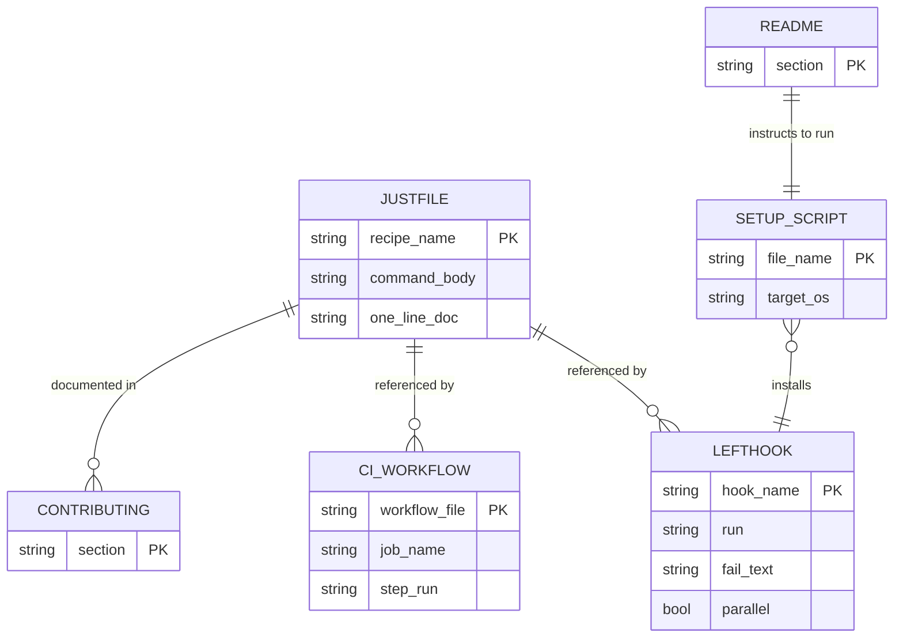

# 基本設計書

<!-- 詳細設計書とは別ファイル。統合禁止 -->
<!-- feature単位で1ファイル。新規featureならテンプレートコピー、既存featureなら既存ファイルをREAD→EDIT -->
<!-- 配置先: docs/features/dev-workflow/basic-design.md -->

## 記述ルール（必ず守ること）

基本設計に**疑似コード・サンプル実装（python/ts/go等の言語コードブロック）を書くな**。
ソースコードと二重管理になりメンテナンスコストしか生まない。

## モジュール構成

本 feature は Rust ソースコードを追加せず、**リポジトリルート直下の設定ファイル群**と **`scripts/` のセットアップスクリプト**のみで構成される。`crates/*` には一切触れない。

| 機能ID | モジュール | ディレクトリ | 責務 |
|--------|----------|------------|------|
| REQ-DW-001, 002, 003, 004, 012 | `lefthook.yml` | リポジトリルート | Git フック定義（pre-commit / pre-push / commit-msg）と失敗時メッセージ |
| REQ-DW-005 | `justfile` | リポジトリルート | タスクランナー定義。fmt / clippy / test / audit / check-all 等のレシピ集約 |
| REQ-DW-006 | `.github/workflows/*.yml`（既存 5 本を編集） | `.github/workflows/` | CI ワークフローから `just <recipe>` を呼ぶ形に置換 |
| REQ-DW-007 | `scripts/setup.sh` | `scripts/` | Unix 向けセットアップ。Rust toolchain 検知 → `cargo install --locked` → `lefthook install` |
| REQ-DW-008 | `scripts/setup.ps1` | `scripts/` | Windows 向けセットアップ。同等ロジックを PowerShell で表現 |
| REQ-DW-010 | `README.md`, `CONTRIBUTING.md` | リポジトリルート | setup 1 ステップと `--no-verify` 禁止ポリシーを記載 |
| REQ-DW-011 | 既存 CI（`lint.yml` 他）| `.github/workflows/` | 同一 `just <recipe>` を CI 側でも再実行（バイパス検知） |

```
ディレクトリ構造（本 feature で追加・変更されるファイル）:
.
├── lefthook.yml                         [新規]
├── justfile                             [新規]
├── scripts/
│   ├── setup.sh                         [新規]
│   ├── setup.ps1                        [新規]
│   └── ci/                              [既存・変更なし]
│       └── audit-secret-paths.sh
├── .github/workflows/
│   ├── lint.yml                         [編集: just 呼出しへ]
│   ├── unit-core.yml                    [編集]
│   ├── test-infra.yml                   [編集]
│   ├── audit.yml                        [編集]
│   └── windows.yml                      [編集: windows-shell を pwsh にした just 呼出しへ]
├── README.md                            [編集: setup 1 ステップ追記]
└── CONTRIBUTING.md                      [編集: --no-verify 禁止、just レシピ一覧]
```

## クラス設計（概要）

本 feature は Rust クラスを持たない。代わりに「設定ファイル間の参照関係」を同等の図として示す。



**凝集のポイント**:
- **`justfile` が単一の真実源**（SSoT）。フック / CI / 開発者手動操作のいずれも同じレシピを呼ぶ（DRY）
- **依存方向は一方向**: setup → lefthook → justfile、CI → justfile。`justfile` は他設定を参照しない最下層
- **ドキュメントは参照のみ**: README / CONTRIBUTING は設定ファイルを書き換えず、記述だけ同期する

## 処理フロー

### REQ-DW-001〜004, 012: 開発者の通常フロー（コミットから push まで）

1. 開発者が作業ツリーでファイルを変更
2. `git add` → `git commit -m "feat(xxx): ..."`
3. `commit-msg` フックが発火 → `just commit-msg-check <msg file>` 実行 → `convco check` が規約検証
4. 規約違反: メッセージ修正を促して中止（MSG-DW-004）
5. 規約 OK: 続いて `pre-commit` フックが発火 → `just fmt-check` と `just clippy` を並列実行
6. fmt 違反: 「`just fmt` で自動修正」ヒントを表示して中止（MSG-DW-001）
7. clippy 違反: 「`just clippy` の出力に従って修正」ヒントを表示して中止（MSG-DW-002）
8. 全成功: コミット完了
9. `git push` → `pre-push` フック発火 → `just test` 実行
10. テスト失敗: 「`just test` でローカル再現後に push」ヒントを表示して中止（MSG-DW-003）
11. テスト成功: push 実行 → GitHub Actions が同一 `just <recipe>` を再実行（セーフティネット）

### REQ-DW-007, 008, 009: 新規参画者のセットアップフロー

1. `git clone git@github.com:shikomi-dev/shikomi.git`
2. `cd shikomi`
3. Unix: `bash scripts/setup.sh` / Windows: `pwsh scripts/setup.ps1` を実行
4. スクリプトは `rustc --version` / `cargo --version` の成功可否を確認 → 失敗時は rustup 導入案内（MSG-DW-008）
5. `just` / `lefthook` / `convco` のバイナリ存在を `command -v` で確認
6. 未インストールのものだけ `cargo install --locked <tool>` を順次実行
7. `lefthook install` を実行し、`.git/hooks/` へラッパを配置
8. 「Setup complete.」（MSG-DW-005）を表示して exit 0

### REQ-DW-006, 011: CI 側の実行フロー

1. PR / push トリガで各ワークフローが起動
2. 共通ステップ: `actions/checkout@v4` → `dtolnay/rust-toolchain@stable` → `Swatinem/rust-cache@v2` → `cargo install --locked just`
3. ワークフロー固有ステップ: `just <recipe>`（例: `lint.yml` は `just fmt-check` と `just clippy`）
4. いずれか失敗で job が fail。`--no-verify` でバイパスした場合もここで必ず検知

## シーケンス図



## アーキテクチャへの影響

`docs/architecture/tech-stack.md` に **§2.5 開発ワークフロー（Git フック / タスクランナー）** セクションを追加する（同一 PR で更新）。内容:

- 採用: `lefthook` / `just` / `convco` の 3 ツール
- 不採用候補と却下根拠（cargo-husky / pre-commit / rusty-hook / build.rs / cargo-xtask / core.hooksPath + 生シェル / Makefile / commitlint / npm scripts）
- セットアップ経路: `scripts/setup.{sh,ps1}` の 1 ステップ方式
- CI ワークフローとローカルフックが **同一 `just <recipe>` を参照**する DRY 原則

アーキ図（`docs/architecture/production.md` 等）には影響しない（本 feature は配布バイナリに含まれない開発者ツールチェーンのみ）。

## 外部連携

| 連携先 | 目的 | 認証 | タイムアウト / リトライ |
|-------|------|-----|--------------------|
| crates.io | `cargo install --locked` での `just` / `lefthook` / `convco` 取得 | 不要（公開 registry） | cargo のデフォルト（30 秒 / リトライなし）。失敗時は Fail Fast で setup スクリプト中断 |
| GitHub Actions ランナー | CI 側での同ツール導入 | GitHub 自動 | Swatinem/rust-cache@v2 でキャッシュ後は高速化 |

**外部サービスの増設なし**: shikomi は元々 crates.io と GitHub に依存しており、本 feature は新規外部依存を持ち込まない。

## UX設計

本 feature の UX は「**開発者が Git 操作を普段通り行うだけで、ローカル検証が自動で走る**」こと。以下の体験を必ず保証する。

| シナリオ | 期待される挙動 |
|---------|------------|
| clone 直後に `git commit` | `scripts/setup.{sh,ps1}` が未実行なら、README 冒頭に「先に setup スクリプトを実行してください」の明示がある。setup 1 回で以後は自動 |
| コミット失敗時 | 失敗した検査名（fmt / clippy / convco）と **次に打つべきコマンド** が 1 行で表示される。長文の cargo 出力に埋もれない |
| push 失敗時 | 失敗テスト名と `just test` コマンドが案内される |
| `just` レシピ一覧 | `just` を引数なしで実行すると `just --list` が走り、全レシピが 1 行コメントつきで表示 |
| Windows 開発者 | `pwsh` での setup を README で明示。PowerShell 5.1+（Win10 デフォルト）と 7+ 両方で動作 |
| `--no-verify` 使用 | CONTRIBUTING に「原則禁止。やむを得ない場合は PR 本文で理由を明記し、CI で代替検証」と記載 |

**アクセシビリティ方針**: 本 feature は CLI のみ。色付け出力は `just` / `lefthook` / `cargo` のデフォルトに従い、色非対応端末でも `[FAIL]` / `[OK]` 等のテキストラベルで識別できる状態を維持する。

## セキュリティ設計

### 脅威モデル

| 想定攻撃者 | 攻撃経路 | 保護資産 | 対策 |
|-----------|---------|---------|------|
| 悪意のある PR 作者 | `--no-verify` でローカルフックをバイパスし、fmt 違反・脆弱依存追加・秘密経路追加を push | shikomi のコード品質・秘密経路監査契約（TC-CI-012〜015）| 全 CI ワークフローが同一 `just <recipe>` を再実行。`audit.yml` は `cargo deny` + `audit-secret-paths.sh` を常時実行 |
| サプライチェーン攻撃者 | `just` / `lefthook` / `convco` の悪意あるバージョンを crates.io に混入 | 開発者ローカル環境（配布バイナリは無関係） | `cargo install --locked` で Cargo.lock 相当の固定解決を強制。将来、setup スクリプトでバージョンピンを検討（YAGNI、実被害が出たら対応） |
| 悪意のあるフック定義 | 他開発者が PR で `lefthook.yml` を改変し、任意コマンド実行を仕込む | 他の開発者のローカル環境 | `lefthook.yml` 変更を含む PR は CODEOWNERS レビュー必須。pre-commit が未知のコマンドを実行することを PR diff で目視検知 |
| フック失敗メッセージでの情報漏洩 | `fail_text` にソースパス・ユーザ名が含まれ、CI ログに露出 | ユーザプライバシー | `fail_text` は静的文字列のみ。`${variables}` による動的展開を禁止 |

### OWASP Top 10 対応

| # | カテゴリ | 対応状況 |
|---|---------|---------|
| A01 | Broken Access Control | 該当なし — 理由: 本 feature はユーザ認可を扱わず、開発者ローカル環境のみに影響 |
| A02 | Cryptographic Failures | 該当なし — 理由: 暗号処理を扱わない |
| A03 | Injection | 低リスク。`justfile` レシピは静的コマンド列、ユーザ入力の埋め込みなし。`commit-msg-check` は引数にファイルパスを受けるが `convco` が安全に処理 |
| A04 | Insecure Design | Fail Fast / DRY / Tell-Don't-Ask を基本原則として設計。`build.rs` による暗黙副作用方式を明示却下（§要求分析 §議論結果） |
| A05 | Security Misconfiguration | `lefthook install` は `.git/hooks/` の既定パスに書き、`core.hooksPath` の変更を伴わない。他リポジトリへの影響なし |
| A06 | Vulnerable Components | `cargo-deny` の `advisories` / `bans` / `licenses` / `sources` チェックを `just audit` として統合。CI の `audit.yml` で常時実行 |
| A07 | Auth Failures | 該当なし |
| A08 | Data Integrity Failures | `cargo install --locked` で依存解決を固定。GitHub Actions の `Swatinem/rust-cache@v2` は公式 action を採用 |
| A09 | Logging Failures | フック失敗メッセージは stderr に明示。CI ログは GitHub Actions 標準の保持ポリシーに従う |
| A10 | SSRF | 該当なし |

## ER図

本 feature はデータベースエンティティを持たない。設定ファイル間の参照関係を簡易 ER 図として示す。



## エラーハンドリング方針

| 例外種別 | 処理方針 | ユーザーへの通知 |
|---------|---------|----------------|
| `rustc` / `cargo` 未検出 | setup スクリプトが即 exit（`set -euo pipefail` / `$ErrorActionPreference = 'Stop'`） | MSG-DW-008（rustup 導入案内） |
| `cargo install` 失敗（ネットワーク断・crates.io 障害） | setup スクリプト中断、失敗ツール名を stderr に表示 | 「ネットワークを確認のうえ再実行してください」を追記 |
| `lefthook install` 失敗（`.git/` 不在） | setup スクリプト中断 | MSG-DW-009 |
| pre-commit / pre-push / commit-msg 各失敗 | lefthook が exit 非 0 を git へ伝搬、git が操作を中止 | lefthook の `fail_text`（MSG-DW-001〜004） |
| `just` レシピ未定義 | just が usage を表示、exit 非 0 | CI が fail → PR レビューで捕捉 |
| `justfile` / `lefthook.yml` パースエラー | ツールが構文エラーを stderr に表示 | 設定変更 PR の pre-commit 段階で fail（自己適用） |
