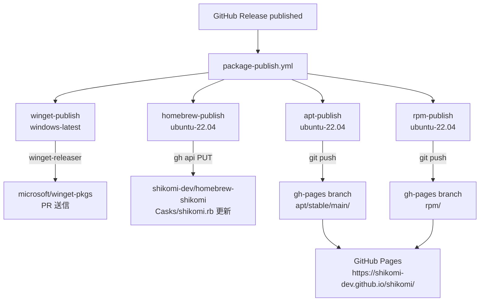

# basic-design: package-distribution / ci

<!-- 階層 3 — sub-feature モジュール基本設計 | Issue #154 -->

## メタデータ

| 項目 | 内容 |
|---|---|
| Sub-feature | `ci` |
| Feature | `package-distribution` |
| Issue | #154 |
| 親 feature-spec | `docs/features/package-distribution/feature-spec.md` |
| 対応 detailed-design | `docs/features/package-distribution/ci/detailed-design.md` |

## モジュール概要

GitHub Release の `published` イベントを起点として、winget / Homebrew / APT / RPM の各パッケージマネージャー向けメタデータを自動更新する CI パイプライン。実装は `.github/workflows/package-publish.yml` に集約する。

## コンポーネント構成

全ジョブは並列実行。1 ジョブの失敗は他ジョブに影響しない。

## §モジュール契約

### REQ-PKG-CI-001: winget-publish

| 区分 | 内容 |
|---|---|
| 入力 | GitHub Release タグ (`v*`) + GitHub Releases の MSI / NSIS インストーラー |
| 処理 | `vedantmgoyal9/winget-releaser` アクションが winget-pkgs へ自動 PR を送信 |
| 出力 | `microsoft/winget-pkgs` への PR（外部審査フロー） |
| エラー時 | `WINGET_TOKEN` 未設定または API エラー時は `continue-on-error: true` でスキップ。ログに警告を記録 |

### REQ-PKG-CI-002: homebrew-publish

| 区分 | 内容 |
|---|---|
| 入力 | GitHub Release タグ + `SHA256SUMS.txt`（aarch64.dmg のハッシュを含む） |
| 処理 | `SHA256SUMS.txt` から DMG SHA256 を抽出 → Cask formula を再生成 → GitHub Contents API (PUT) で更新 |
| 出力 | `shikomi-dev/homebrew-shikomi` の `Casks/shikomi.rb` 更新コミット |
| エラー時 | `HOMEBREW_TAP_TOKEN` 未設定時は GitHub API 認証エラーでジョブ失敗。シークレット設定が必要 |

### REQ-PKG-CI-003: apt-publish

| 区分 | 内容 |
|---|---|
| 入力 | GitHub Release タグ + `.deb` パッケージ |
| 処理 | `gh-pages` ブランチを checkout → `.deb` をダウンロード → `dpkg-scanpackages` で `Packages` 生成 → `apt-ftparchive` で `Release` 生成 → `gh-pages` へ push |
| 出力 | `https://shikomi-dev.github.io/shikomi/apt/stable/main/binary-amd64/` に公開された APT リポジトリ |
| エラー時 | `gh-pages` ブランチが存在しない場合はジョブ失敗（初回セットアップで事前作成が必要） |

### REQ-PKG-CI-004: rpm-publish

| 区分 | 内容 |
|---|---|
| 入力 | GitHub Release タグ + `.rpm` パッケージ |
| 処理 | `gh-pages` ブランチを checkout → `.rpm` をダウンロード → `createrepo_c` でリポジトリメタデータ生成 → `shikomi.repo` ファイル生成 → `gh-pages` へ push |
| 出力 | `https://shikomi-dev.github.io/shikomi/rpm/` に公開された YUM/DNF リポジトリ |
| エラー時 | APT と同様に `gh-pages` ブランチ不在でジョブ失敗 |

## 外部依存関係

| 依存先 | 用途 | 必要なシークレット | 必須 |
|---|---|---|---|
| `microsoft/winget-pkgs` | winget パッケージ登録（外部審査） | `WINGET_TOKEN`（PAT: `public_repo`）| オプション |
| `shikomi-dev/homebrew-shikomi` | Homebrew Cask formula 管理 | `HOMEBREW_TAP_TOKEN`（PAT: `repo` write）| 必須 |
| `gh-pages` ブランチ | APT / RPM リポジトリホスティング | `GITHUB_TOKEN`（`contents: write`）| 必須 |
| GitHub Pages | パブリックエンドポイント | なし（リポジトリ設定で有効化済み）| 必須 |
| `vedantmgoyal9/winget-releaser` | winget-pkgs PR 自動化アクション | `WINGET_TOKEN` | オプション |

## セキュリティ上の既知負債

| 項目 | 現状 | 解消方針 |
|---|---|---|
| APT 未署名 | `[trusted=yes]` で GPG 検証をバイパス | Issue #130 完了後に GPG 鍵を生成し `signed-by=` へ移行、`Release.gpg` と `InRelease` を追加 |
| RPM 未署名 | `gpgcheck=0` | Issue #130 完了後に RPM-GPG-KEY を生成し `gpgcheck=1` へ移行 |
| winget アクションの `@main` 固定 | `vedantmgoyal9/winget-releaser@main` はコミットハッシュ固定でない | 次回リリース時にコミットハッシュへ固定する（OWASP A08 対応）|

## 初回セットアップ手順（運用上の前提）

1. `gh-pages` ブランチが空コミットで存在すること（Issue #154 PR でセットアップ済み）
2. GitHub Pages がリポジトリ設定 → Pages → Source: `gh-pages / /` で有効であること（Issue #154 PR でセットアップ済み）
3. `HOMEBREW_TAP_TOKEN` シークレットを Organization または Repository に設定すること
4. `WINGET_TOKEN` シークレットを設定すること（オプション、未設定時はスキップ）
