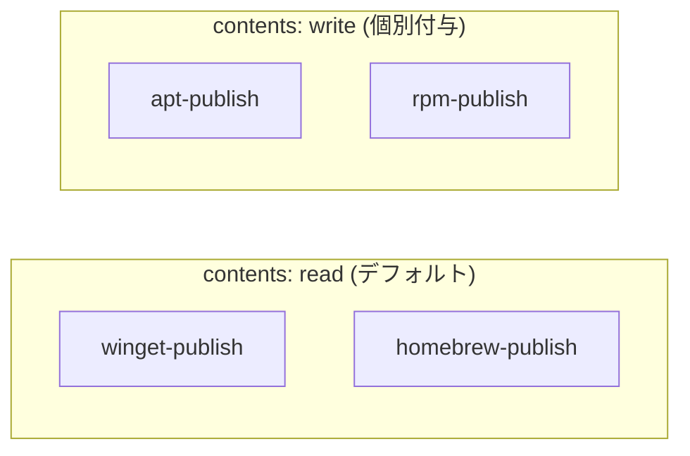
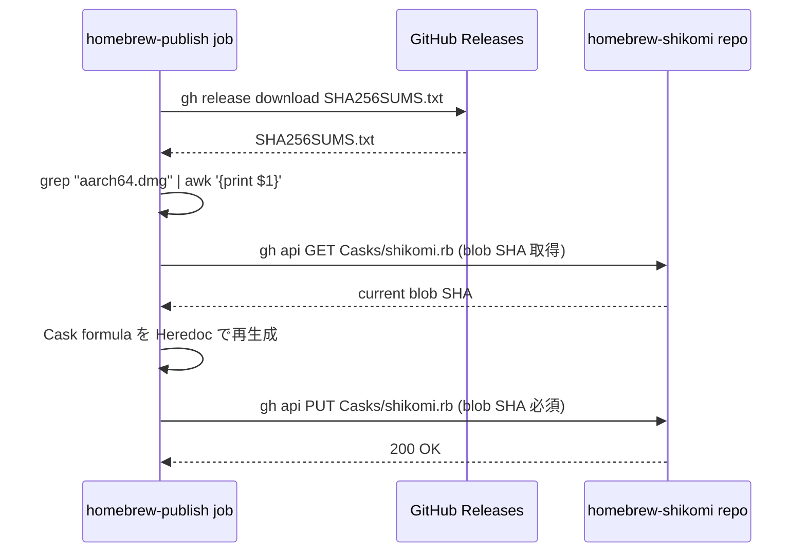

# detailed-design: package-distribution / ci

<!-- 階層 3 — sub-feature モジュール詳細設計 | Issue #154 -->

## メタデータ

| 項目 | 内容 |
|---|---|
| Sub-feature | `ci` |
| Feature | `package-distribution` |
| Issue | #154 |
| 対応 basic-design | `docs/features/package-distribution/ci/basic-design.md` |

## ワークフロー: `package-publish.yml`

### トリガ

```
on:
  release:
    types: [published]
```

`draft` / `prereleased` では動作しない。`published` 状態への遷移のみで起動する。

### パーミッション設計



最小権限原則に従い、`gh-pages` への git push が必要な `apt-publish` / `rpm-publish` にのみ `contents: write` を付与する。

### ジョブ詳細: winget-publish

| 項目 | 内容 |
|---|---|
| ランナー | `windows-latest` |
| タイムアウト | 15 分 |
| アクション | `vedantmgoyal9/winget-releaser@main` |
| インストーラー照合 | `installers-regex: \_x64\_en-US\.msi$\|\_x64-setup\.exe$` |
| 失敗挙動 | `continue-on-error: true`（`WINGET_TOKEN` 未設定時はスキップ）|

`.github/winget/` に格納された 3 点セット:

| ファイル | ManifestType | 用途 |
|---|---|---|
| `shikomi-dev.shikomi.yaml` | `version` | バージョン manifest |
| `shikomi-dev.shikomi.installer.yaml` | `installer` | MSI (x64) + NSIS exe (x64)、SHA256 固定 |
| `shikomi-dev.shikomi.locale.en-US.yaml` | `defaultLocale` | パッケージ名・説明・タグ・ライセンス |

`winget-releaser` は上記 Static マニフェストを参照し、新バージョンの installer URL と SHA256 を動的に書き換えて `winget-pkgs` へ PR を送信する。

### ジョブ詳細: homebrew-publish

| 項目 | 内容 |
|---|---|
| ランナー | `ubuntu-22.04` |
| タイムアウト | 10 分 |
| 認証 | `HOMEBREW_TAP_TOKEN`（GitHub PAT: `repo` write）|

処理フロー:



Cask formula の構造（`shikomi-dev/homebrew-shikomi/Casks/shikomi.rb`）:

| フィールド | 内容 |
|---|---|
| `version` | リリースタグから `v` プレフィックスを除いた文字列 |
| `sha256` | `SHA256SUMS.txt` から抽出した `aarch64.dmg` の SHA256 |
| `url` | `https://github.com/shikomi-dev/shikomi/releases/download/v#{version}/shikomi_#{version}_aarch64.dmg` |
| `depends_on macos` | `>= :monterey`（macOS 12 Monterey 以降） |
| `app` | `shikomi.app` |
| `uninstall quit` | `dev.shikomi.gui` |

### ジョブ詳細: apt-publish

| 項目 | 内容 |
|---|---|
| ランナー | `ubuntu-22.04` |
| タイムアウト | 15 分 |
| パーミッション | `contents: write` |

`gh-pages` ブランチ内のディレクトリ構造:

```
apt/
  stable/
    main/
      binary-amd64/
        shikomi_X.Y.Z_amd64.deb   ← ダウンロードした .deb
        Packages                   ← dpkg-scanpackages 生成
        Packages.gz                ← gzip -kf
    Release                        ← apt-ftparchive release 生成
```

ユーザー側セットアップコマンド（README 掲載）:

```bash
echo "deb [trusted=yes] https://shikomi-dev.github.io/shikomi/apt stable main" | \
  sudo tee /etc/apt/sources.list.d/shikomi.list
sudo apt update && sudo apt install shikomi
```

⚠️ `[trusted=yes]` は GPG 署名なし配布の暫定措置。Issue #130 完了後に以下へ移行する:
```bash
curl -sSL https://shikomi-dev.github.io/shikomi/apt/gpg.key | \
  sudo gpg --dearmor -o /etc/apt/trusted.gpg.d/shikomi.gpg
echo "deb [arch=amd64 signed-by=/etc/apt/trusted.gpg.d/shikomi.gpg] ..." | \
  sudo tee /etc/apt/sources.list.d/shikomi.list
```

### ジョブ詳細: rpm-publish

| 項目 | 内容 |
|---|---|
| ランナー | `ubuntu-22.04` |
| タイムアウト | 15 分 |
| パーミッション | `contents: write` |
| 追加パッケージ | `createrepo-c` |

`gh-pages` ブランチ内のディレクトリ構造:

```
rpm/
  packages/
    shikomi-X.Y.Z-1.x86_64.rpm   ← ダウンロードした .rpm
  repodata/
    repomd.xml                    ← createrepo_c 生成
    ...
  shikomi.repo                    ← ユーザーが追加するリポジトリ設定
```

生成される `shikomi.repo`:

```ini
[shikomi]
name=shikomi
baseurl=https://shikomi-dev.github.io/shikomi/rpm
enabled=1
gpgcheck=0
```

⚠️ `gpgcheck=0` は GPG 署名なし配布の暫定措置。Issue #130 完了後に `gpgcheck=1` + `gpgkey=` へ移行する。

ユーザー側セットアップコマンド（README 掲載）:

```bash
sudo dnf config-manager \
  --add-repo https://shikomi-dev.github.io/shikomi/rpm/shikomi.repo
sudo dnf install shikomi
```

## winget マニフェスト スキーマバージョン

| ファイル | スキーマ |
|---|---|
| `shikomi-dev.shikomi.yaml` | `https://aka.ms/winget-manifest.version.1.6.0.schema.json` |
| `shikomi-dev.shikomi.installer.yaml` | `https://aka.ms/winget-manifest.installer.1.6.0.schema.json` |
| `shikomi-dev.shikomi.locale.en-US.yaml` | `https://aka.ms/winget-manifest.defaultLocale.1.6.0.schema.json` |

`PackageVersion: 0.1.0` は Static 固定値。`winget-releaser` が新バージョンで動的に差し替える。

## セキュリティ: アクション固定方針

| アクション | 現状 | 目標 |
|---|---|---|
| `actions/checkout@34e114...` | コミットハッシュ固定 ✅ | 維持 |
| `vedantmgoyal9/winget-releaser@main` | タグ固定 ⚠️ | 次 PR でコミットハッシュへ固定（OWASP A08）|

## 参照ドキュメント

| リソース | URL |
|---|---|
| winget マニフェストスキーマ v1.6.0 | https://aka.ms/winget-manifest.version.1.6.0.schema.json |
| vedantmgoyal9/winget-releaser | https://github.com/vedantmgoyal9/winget-releaser |
| Homebrew Cask 命名規則 | https://docs.brew.sh/Cask-Cookbook |
| dpkg-scanpackages (1) | https://manpages.ubuntu.com/manpages/jammy/man1/dpkg-scanpackages.1.html |
| apt-ftparchive (1) | https://manpages.ubuntu.com/manpages/jammy/man1/apt-ftparchive.1.html |
| createrepo_c | https://github.com/rpm-software-management/createrepo_c |
