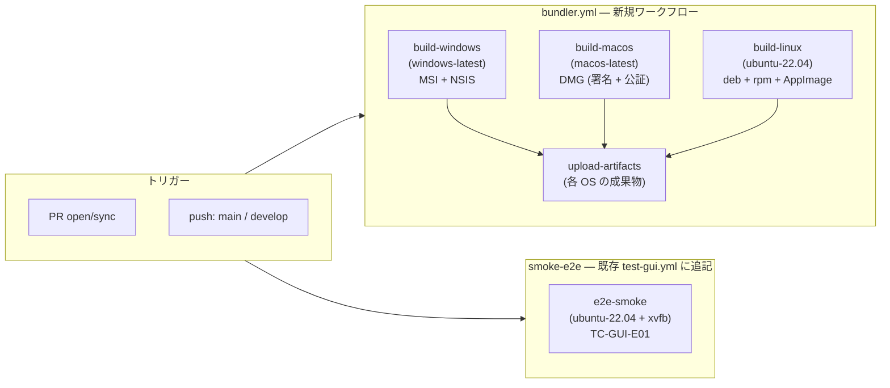
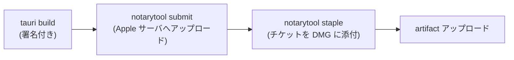

# 基本設計書 — build-ci（shikomi-gui）

<!-- feature: shikomi-gui / sub-feature: build-ci / Issue #98 -->
<!-- 配置先: docs/features/shikomi-gui/build-ci/basic-design.md -->
<!-- 疑似コード・実装コードブロック禁止 -->
<!-- 参照: docs/features/shikomi-gui/feature-spec.md（凍結済み）-->
<!-- 参照: docs/design/architecture.md §CI/CD -->
<!-- 参照: detailed-design/{index,jobs,e2e,misc}.md -->

## §モジュール契約（機能要件マッピング）

| 要件 ID | 契約 |
|---------|------|
| REQ-CI-01 | `bundler.yml` ワークフローが PR / main / develop プッシュ時に `tauri build` を 3 OS 並列実行し、各 OS の成果物を GitHub Actions artifact にアップロードする（R1-GUI-16） |
| REQ-CI-02 | macOS ジョブは Developer ID Application 証明書でコード署名し、`notarytool` で Apple の公証を取得して DMG を生成する。Gatekeeper 警告なしで起動できることを保証する（AC-GUI-09） |
| REQ-CI-03 | Windows ジョブは MSI + NSIS の 2 形式を生成する。MVP はコード署名なし（Authenticode 証明書は未取得）。実行時の SmartScreen 警告は MVP スコープとして許容し、AC-GUI-08 は手動受入とする |
| REQ-CI-04 | Linux ジョブは deb / rpm / AppImage の 3 形式を生成する。コード署名不要。AppImage がダブルクリックで起動できることを AC-GUI-10 で手動受入確認する |
| REQ-CI-05 | artifact は PR ごとに 7 日間、main / develop ブランチ成果物は 30 日間保持する。ファイル名に OS とバージョンを含める（例: `shikomi_1.0.0_x64-setup.exe`）|
| REQ-CI-06 | `cargo audit`（`audit.yml`）を `shikomi-gui` 依存に拡張する。`deny.toml` に Sub-A 時点の Tauri 間接依存 RUSTSEC 例外エントリが既存のため、`shikomi-gui` 新規依存で追加 advisory が出た場合は `ignore` に登録して理由・Issue 番号を付記する |
| REQ-CI-07 | E2E スモークテスト `TC-GUI-E01` を Linux headless 環境（xvfb）で実行する。`shikomi gui` プロセス起動 → daemon IPC 接続確立 → 正常終了を自動検証する（AC-GUI-01） |
| REQ-CI-08 | bundler ジョブは `crates/shikomi-gui/**` / `crates/shikomi-core/**` / `.github/workflows/bundler.yml` の変更がある場合のみ実行する（paths フィルタで不要ビルドを抑制）|

---

## 1. CI ジョブ構成

**既存ワークフローとの分離方針**: bundler ジョブは `bundler.yml` として独立させる。既存 `test-gui.yml` はユニット + 結合テスト専用のままとし、E2E スモークテストのみ `test-gui.yml` に `e2e-smoke` ジョブとして追記する（bundler とはジョブが独立することで E2E 失敗がビルド成果物の生成を妨げない）。

---

## 2. 成果物設計

### 2.1 成果物一覧

| OS | 形式 | Tauri `targets` 指定 | ファイル名例 |
|----|------|---------------------|------------|
| Windows | MSI | `msi` | `shikomi_1.0.0_x64-setup.msi` |
| Windows | NSIS | `nsis` | `shikomi_1.0.0_x64-setup.exe` |
| macOS | DMG | `dmg` | `shikomi_1.0.0_x64.dmg` |
| Linux | deb | `deb` | `shikomi_1.0.0_amd64.deb` |
| Linux | rpm | `rpm` | `shikomi-1.0.0-1.x86_64.rpm` |
| Linux | AppImage | `appimage` | `shikomi_1.0.0_amd64.AppImage` |

### 2.2 Artifact 保持ポリシー

| トリガー | 保持期間 | artifact 名プレフィックス |
|---------|---------|------------------------|
| PR | 7 日 | `shikomi-installer-pr{N}-{os}` |
| main / develop | 30 日 | `shikomi-installer-{sha}-{os}` |

---

## 3. macOS コード署名・公証設計

### 3.1 必要な Apple リソース

| リソース | 取得方法 | 保管場所 |
|---------|---------|---------|
| Developer ID Application 証明書 | Apple Developer Portal で発行 | GitHub Actions Secret: `APPLE_CERTIFICATE`（Base64 PEM）|
| 証明書パスワード | 証明書エクスポート時に設定 | GitHub Actions Secret: `APPLE_CERTIFICATE_PASSWORD` |
| Apple ID | Apple Developer アカウント | GitHub Actions Secret: `APPLE_ID` |
| App-specific password | appleid.apple.com で生成 | GitHub Actions Secret: `APPLE_ID_PASSWORD` |
| Team ID | Apple Developer Portal で確認 | GitHub Actions Secret: `APPLE_TEAM_ID` |

Tauri v2 の `tauri build` は `APPLE_CERTIFICATE` / `APPLE_CERTIFICATE_PASSWORD` 環境変数を読み取り、Keychain に一時的にインポートして署名を行う。公証は `notarytool` ベースの Tauri 内蔵フローで実行される。

出典: https://v2.tauri.app/distribute/sign/macos/

### 3.2 公証フロー概要

`notarytool` は非同期処理。`tauri build` の `--ci` フラグが `notarytool wait` による同期待機を自動処理する。タイムアウトは Apple サーバ側の負荷次第で最大 5 分を見込む。

---

## 4. E2E スモークテスト設計（TC-GUI-E01）

### 4.1 検証スコープ

AC-GUI-01「`shikomi gui` で GUI が起動し、daemon と IPC 接続が確立される」を自動 CI で検証する。

| 検証対象 | 方法 | 合否基準 |
|---------|------|---------|
| `shikomi gui` バイナリ起動 | プロセス起動後 10 秒以内にウィンドウハンドルを確認 | 起動失敗または 10 秒タイムアウトで FAIL |
| daemon IPC 接続 | `shikomi list --ipc` コマンドが exit 0 を返すことを確認（IPC 経路での daemon 接続証明。`--ipc` フラグで SQLite 直結経路との混同を排除） | exit code 非ゼロで FAIL |
| プロセス正常終了 | `SIGTERM` 後 5 秒以内に exit code 0 で終了 | タイムアウトまたは非ゼロ exit で FAIL |

### 4.2 headless 実行環境

| 要素 | 選択 | 根拠 |
|------|------|------|
| OS | ubuntu-22.04 | 既存 `test-gui.yml` と同一環境。GTK / WebKit2GTK インストール済みキャッシュを再利用できる |
| 仮想ディスプレイ | xvfb（`Xvfb :99 -screen 0 1280x720x24`） | CI にディスプレイがない環境で Tauri WebView の初期化を通過させる。GTK / WebKit の headless モードより確実 |
| E2E フレームワーク | `tauri-driver` + `webdriverio` は **不採用**（YAGNI）。シェルスクリプトで `shikomi gui &` → `shikomi list` → kill のシンプルな smoke check を採用 | フルセレニウムテストは現時点で要件なし（YAGNI）。アクセシビリティ検証が必要になった時点で別 Issue で設計する |

### 4.3 daemon 起動前提条件（BUG-04 由来の業務ルール）

build-ci の E2E スモークテスト（TC-GUI-E01）実行中に daemon が初回起動時にデータディレクトリ未作成でクラッシュすることが判明した（BUG-04）。本修正により以下の業務ルールが daemon 側で確立した。**設計の詳細は `docs/features/daemon-ipc/detailed-design/composition-root.md §処理順序 ステップ 5・6` を参照する**（本設計書はスコープ越境を避け参照のみとする）。

| 業務ルール | 責務の所在 |
|-----------|-----------|
| daemon 起動時に vault dir（`~/.local/share/shikomi/` 等）が存在しない場合は自動作成する | `SqliteVaultRepository::from_directory`（リポジトリ層） |
| vault ファイルが存在しない場合（初回インストール）は空の plaintext vault を生成して起動する | `SqliteVaultRepository::load_or_create_plaintext`（リポジトリ層） |
| `shikomi_daemon::run()` に `create_dir_all` / NotFound 分岐を直接書かない | コンポジションルートは組み立て責務のみ（Clean Architecture） |

### 4.4 テスト対象外（headless 制約）

| 機能 | 理由 | 代替検証 |
|------|------|---------|
| GUI 画面の描画確認 | Xvfb でウィンドウは存在するが画面キャプチャ検証は過大コスト | 手動受入 |
| macOS / Windows E2E | self-hosted runner またはクラウド macOS が必要 | AC-GUI-08/09 は手動受入 |
| 30 秒カウントダウン表示 | トレイ操作は headless で困難 | AC-GUI-07 は手動受入 |

---

## 5. セキュリティ設計

### 5.1 Secrets 管理

| Secret | スコープ | 最小権限原則 |
|--------|---------|------------|
| `APPLE_CERTIFICATE` 等 | repository secrets（Actions のみ） | PR からの fork は読み取り不可（GitHub のデフォルト）。fork PR では公証ジョブをスキップする |
| `GITHUB_TOKEN` | workflow permissions: `contents: read` のみ | artifact アップロードは write 不要（`actions/upload-artifact` は Actions API 経由）|

### 5.2 コード署名の信頼境界

Windows の SmartScreen 警告（MVP 許容）はユーザーが「詳細情報 → 実行」で回避できる。この UX コストは MVP スコープとして AC-GUI-08 の手動受入基準に明記する（Beta 前に Authenticode 証明書取得を推奨）。

### 5.3 OWASP Top 10 対応表

| # | カテゴリ | 対応状況 |
|---|---------|---------|
| A01 | Broken Access Control | fork PR では APPLE 系 Secrets が注入されない（GitHub 仕様） |
| A02 | Cryptographic Failures | 該当なし（ビルド成果物の暗号化は OS 配布チャネルが担保）|
| A03 | Injection | `tauri build` の引数は固定値のみ。ユーザー入力を CI コマンドに渡さない |
| A04 | Insecure Design | macOS 公証により改ざん防止（Gatekeeper 検証）|
| A05 | Security Misconfiguration | workflow `permissions: contents: read` に制限 |
| A06 | Vulnerable Components | `cargo audit` を `shikomi-gui` 依存に拡張（REQ-CI-06）|
| A07 | Auth Failures | 該当なし（CI 認証は GitHub Actions の OIDC / Secrets で管理）|
| A08 | Software Integrity | ① 成果物整合性: macOS Developer ID 署名 + Apple 公証（Gatekeeper 検証）で改ざんを防止。Linux GPG 署名は非スコープ（MVP）。② CI サプライチェーン保護: `.github/actions/tauri-build-setup/action.yml` 内の全外部アクション（`dtolnay/rust-toolchain`・`Swatinem/rust-cache`・`actions/setup-node` 等）は SHA ハッシュ固定参照（`uses: <owner>/<repo>@<40-char-commit-sha>`）を使用する。ブランチ参照・タグ参照は禁止。SHA の更新は Dependabot または手動 PR で差分レビューを経て行う（侵害されたアクションの任意コード実行を防止）。|
| A09 | Logging Failures | CI ログは GitHub Actions に保存。Secrets はマスクされる |
| A10 | SSRF | 該当なし（外部 HTTP 通信は `notarytool` のみ、Apple サーバへの固定通信）|

---

## 6. feature-spec との対応（R1-GUI → REQ-CI トレーサビリティ）

| R1-GUI | REQ-CI | 実装箇所 |
|--------|--------|---------|
| R1-GUI-16 | REQ-CI-01, 03, 04 | `.github/workflows/bundler.yml` |
| R1-GUI-16（macOS） | REQ-CI-02 | `bundler.yml` `build-macos` ジョブ |
| AC-GUI-01 | REQ-CI-07 | `test-gui.yml` `e2e-smoke` ジョブ |
| — | REQ-CI-05 | `bundler.yml` `upload-artifacts` ジョブ |
| — | REQ-CI-06 | `audit.yml` 拡張 |
| — | REQ-CI-08 | `bundler.yml` `paths` フィルタ |
