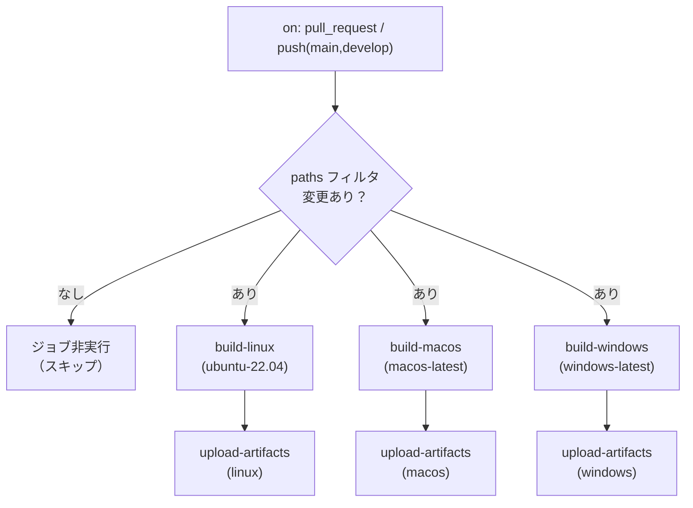
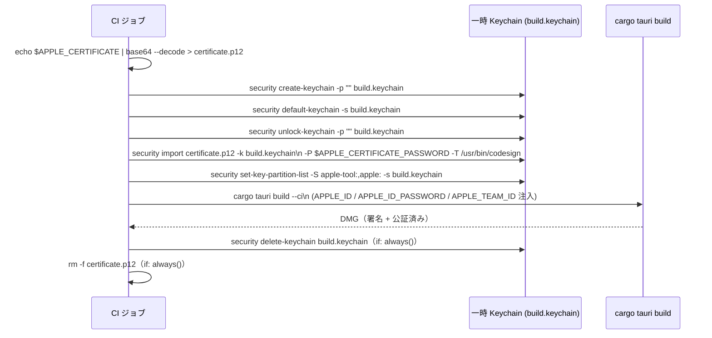
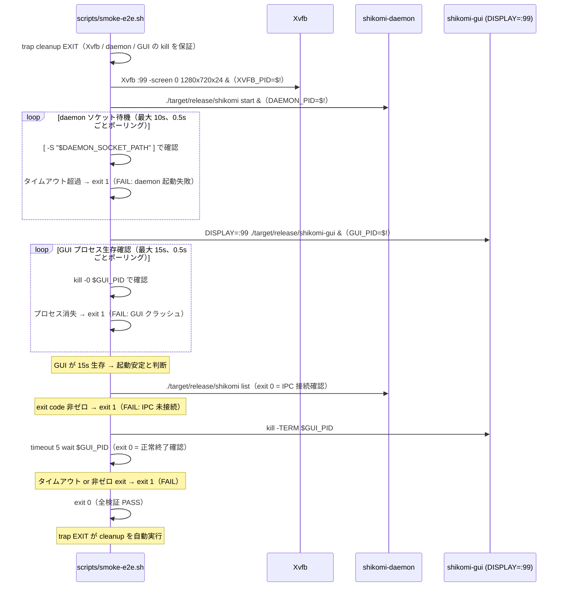
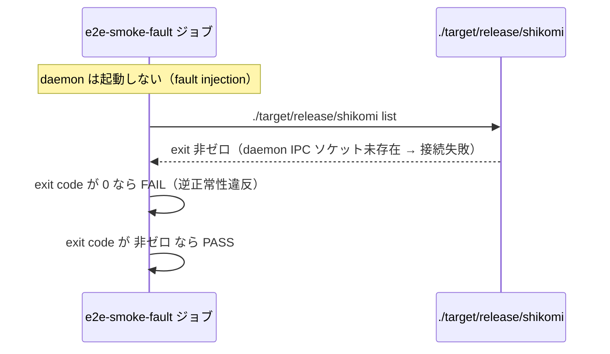
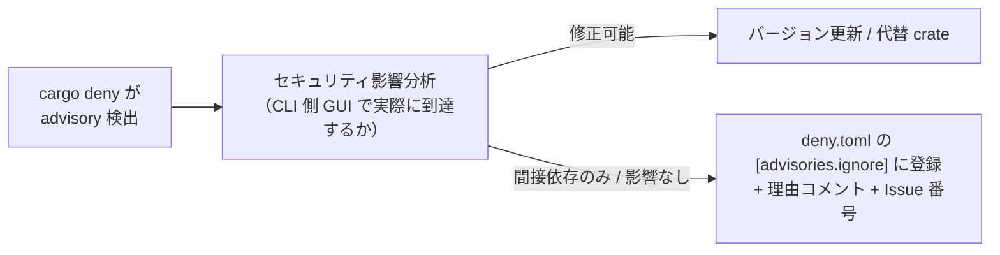
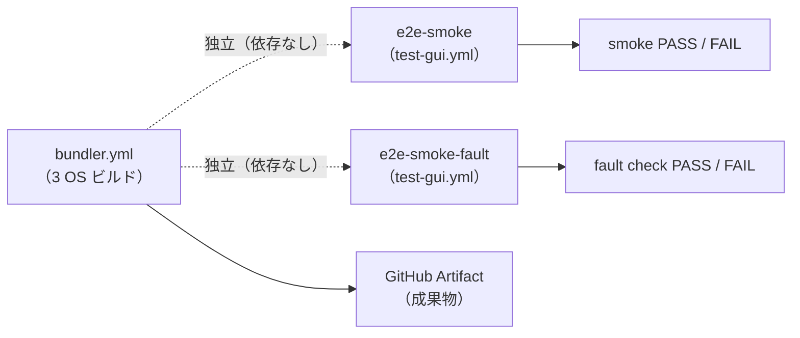

# 詳細設計書 — build-ci（shikomi-gui）

<!-- feature: shikomi-gui / sub-feature: build-ci / Issue #98 -->
<!-- 配置先: docs/features/shikomi-gui/build-ci/detailed-design.md -->
<!-- 疑似コード・実装コードブロック禁止 -->
<!-- 参照: docs/features/shikomi-gui/build-ci/basic-design.md -->
<!-- 参照: docs/features/shikomi-gui/feature-spec.md（凍結済み）-->
<!-- 参照: docs/design/architecture.md §CI/CD -->

---

## 1. `bundler.yml` — トリガー・paths フィルタ設計

### 1.1 ワークフロー全体フロー

### 1.2 paths フィルタ仕様（REQ-CI-08）

paths フィルタに一致しないプッシュ・PR ではすべてのジョブをスキップする。

| paths エントリ | 意図 |
|---------------|------|
| `crates/shikomi-gui/**` | GUI crate のソース変更 |
| `crates/shikomi-core/**` | 共通 IPC 型・定数の変更 |
| `.github/workflows/bundler.yml` | ワークフロー自体の変更 |

### 1.3 ワークフロー権限・環境設定

| 設定 | 値 | 根拠 |
|------|-----|------|
| `permissions.contents` | `read` | artifact アップロードは `actions/upload-artifact` Actions API 経由のため write 不要 |
| `permissions.id-token` | `write` | macOS 公証の OIDC 接続に不要（`notarytool` は App-specific password 方式を使用）→ **付与しない** |
| Node.js バージョン | `20` | 既存 `lint.yml` / `test-gui.yml` と統一 |
| Rust toolchain | `stable`（`dtolnay/rust-toolchain@stable`） | 既存ワークフローと統一 |
| Rust キャッシュ | `Swatinem/rust-cache@v2` | 既存ワークフローと統一 |

### 1.4 artifact 保持ポリシー実装（REQ-CI-05）

artifact 保持日数はトリガー条件で分岐する。`github.event_name == 'pull_request'` を条件とした `if` 式で `retention-days` を動的に設定する。

| トリガー | `retention-days` | artifact 名テンプレート |
|---------|-----------------|----------------------|
| pull_request | 7 | `shikomi-installer-pr${{ github.event.pull_request.number }}-{os}` |
| push (main / develop) | 30 | `shikomi-installer-{sha7}-{os}`（`sha7` の算出は §5.2 参照） |

---

## 2. build-linux ジョブ詳細（REQ-CI-04）

### 2.1 ジョブ設定

| 設定 | 値 |
|------|-----|
| `runs-on` | `ubuntu-22.04` |
| タイムアウト | 60 分（tauri build + bundle の標準所要時間） |
| 必要な Secrets | なし（Linux は署名不要） |

### 2.2 ステップ一覧

共通セットアップは composite action（§11 参照）に集約する。OS 固有の追加ステップのみ各ジョブに配置する。

| 順序 | ステップ名 | 使用アクション / コマンド | 目的 |
|------|-----------|------------------------|------|
| 1 | tauri build setup | `.github/actions/tauri-build-setup`（composite） | checkout / Rust / cache / Node.js / npm ci / tauri-cli を一括セットアップ（§11） |
| 2 | install system libraries | `apt-get install` | GTK / WebKit 依存解決（後述 §2.3） |
| 3 | tauri build (linux) | `cargo tauri build --ci` | deb / rpm / AppImage 生成（後述 §2.4） |
| 4 | upload artifacts | `actions/upload-artifact@v4` | 成果物保存（後述 §2.5） |

### 2.3 システムライブラリ一覧

既存 `test-gui.yml` の `install system libraries` ステップと同一セットを使用する（DRY: composite action でキャッシュキーを共通化）。

| パッケージ | 用途 |
|-----------|------|
| `libgtk-3-dev` | GTK3 ウィンドウシステム |
| `libwebkit2gtk-4.1-dev` | WebKit2GTK（Tauri WebView ランタイム） |
| `libappindicator3-dev` | システムトレイ（libappindicator3 ベース） |
| `librsvg2-dev` | SVG アイコンレンダリング |
| `libdbus-1-dev` | D-Bus（デスクトップ統合） |
| `libssl-dev` | TLS（cargo 依存ビルド） |
| `pkg-config` | ライブラリ検索ツール |

### 2.4 tauri build オプション

| オプション | 値 | 根拠 |
|-----------|----|------|
| `--ci` | 有効 | CI 環境向け最適化（notarytool の同期待機など。Linux では効果なし） |
| targets | `deb, rpm, appimage`（tauri.conf.json で定義済み） | 明示的な `--bundles` 指定は不要（OS が Linux の場合、他 OS ターゲットはスキップされる） |
| working directory | `crates/shikomi-gui/` | `tauri.conf.json` が存在するディレクトリ |

### 2.5 artifact アップロード対象パス

| 形式 | 相対パス（crates/shikomi-gui/ 基点） |
|------|-----------------------------------|
| deb | `target/release/bundle/deb/*.deb` |
| rpm | `target/release/bundle/rpm/*.rpm` |
| AppImage | `target/release/bundle/appimage/*.AppImage` |

---

## 3. build-macos ジョブ詳細（REQ-CI-02）

### 3.1 ジョブ設定

| 設定 | 値 |
|------|-----|
| `runs-on` | `macos-latest` |
| タイムアウト | 90 分（notarytool の非同期待機最大 5 分を含む） |
| 必要な Secrets | `APPLE_CERTIFICATE`, `APPLE_CERTIFICATE_PASSWORD`, `APPLE_ID`, `APPLE_ID_PASSWORD`, `APPLE_TEAM_ID` |

### 3.2 fork PR からのシークレット保護

GitHub のデフォルト仕様として、fork リポジトリからの PR では repository secrets が注入されない（`secrets.*` が空文字列になる）。この場合 `tauri build` のコード署名ステップが失敗するため、`if: github.event.pull_request.head.repo.full_name == github.repository` 条件でジョブ全体をスキップする（基本設計書 §5.1 参照）。

### 3.3 ステップ一覧

| 順序 | ステップ名 | 使用アクション / コマンド | 目的 |
|------|-----------|------------------------|------|
| 1 | tauri build setup | `.github/actions/tauri-build-setup`（composite） | checkout / Rust / cache / Node.js / npm ci / tauri-cli を一括セットアップ（§11） |
| 2 | import certificate to Keychain | シェルコマンド（後述 §3.4） | Developer ID 証明書のインポート |
| 3 | tauri build (macos) | `cargo tauri build --ci` | DMG 生成 + 署名 + 公証 |
| 4 | cleanup Keychain | シェルコマンド（後述 §3.4） | 一時 Keychain の削除（`if: always()` で失敗時も保証） |
| 5 | upload artifacts | `actions/upload-artifact@v4` | 成果物保存 |

### 3.4 Keychain セットアップ・クリーンアップ設計

コード署名は Tauri が内部で `codesign` CLI を呼び出す。証明書を一時 Keychain にインポートし、ジョブ終了時に削除することでランナーの永続 Keychain を汚染しない。

**Keychain 操作の詳細**:

| 操作 | コマンド | 根拠 |
|------|---------|------|
| 一時 Keychain 作成 | `security create-keychain -p "" build.keychain` | ランナー永続 Keychain を汚染しない |
| デフォルト Keychain 変更 | `security default-keychain -s build.keychain` | `codesign` がデフォルト Keychain を探索するため |
| Keychain ロック解除 | `security unlock-keychain -p "" build.keychain` | パスワードなしで即時解除 |
| 証明書インポート | `security import ... -T /usr/bin/codesign` | `codesign` のみにアクセスを制限（最小権限） |
| パーティションリスト設定 | `security set-key-partition-list -S apple-tool:,apple:` | Keychain アクセス確認ダイアログを抑制（CI では UI 不可） |
| Keychain 削除 | `security delete-keychain build.keychain` | 一時ファイル削除（`if: always()` で tauri build 失敗時も実行保証） |

**`if: always()` の対称性保証**: `cleanup Keychain` ステップ（§3.3 順序 4）に `if: always()` を付与する。これにより `tauri build` ステップが途中失敗してもランナー上に一時 Keychain が残留しない（対称性の原則）。

出典: https://v2.tauri.app/distribute/sign/macos/

### 3.5 tauri build 環境変数（公証）

`cargo tauri build --ci` 実行時に以下の環境変数を注入する。Tauri が `notarytool` を呼び出す際に使用される。

| 環境変数 | Source | 用途 |
|---------|--------|------|
| `APPLE_ID` | `${{ secrets.APPLE_ID }}` | Apple ID（notarytool 認証） |
| `APPLE_ID_PASSWORD` | `${{ secrets.APPLE_ID_PASSWORD }}` | App-specific password |
| `APPLE_TEAM_ID` | `${{ secrets.APPLE_TEAM_ID }}` | Apple Developer Team ID |

`APPLE_CERTIFICATE` / `APPLE_CERTIFICATE_PASSWORD` は §3.4 Keychain インポートステップで消費されるため、`tauri build` への直接注入は不要（Tauri は Keychain から証明書を取得する）。

### 3.6 artifact アップロード対象パス

| 形式 | 相対パス（crates/shikomi-gui/ 基点） |
|------|-----------------------------------|
| DMG | `target/release/bundle/dmg/*.dmg` |

---

## 4. build-windows ジョブ詳細（REQ-CI-03）

### 4.1 ジョブ設定

| 設定 | 値 |
|------|-----|
| `runs-on` | `windows-latest` |
| `defaults.run.shell` | `pwsh`（既存 `windows.yml` と統一） |
| タイムアウト | 60 分 |
| 必要な Secrets | なし（MVP: コード署名なし。手動受入: **AC-GUI-08**） |

**AC-GUI-08 スコープ明記**: Windows MVP では Authenticode 証明書を取得しないため、SmartScreen 警告が表示される。この UX コストは `feature-spec.md` の AC-GUI-08（手動受入基準）に明記し、Beta 前に証明書取得を推奨する。本設計書の自動テスト対象外。

### 4.2 WebView2 ランタイム依存

`windows-latest` ランナーには WebView2 Evergreen Runtime が 2022 年以降プリインストール済み。追加インストール不要。

出典: https://github.com/actions/runner-images/blob/main/images/windows/Windows2022-Readme.md

### 4.3 ステップ一覧

| 順序 | ステップ名 | 使用アクション / コマンド | 目的 |
|------|-----------|------------------------|------|
| 1 | tauri build setup | `.github/actions/tauri-build-setup`（composite） | checkout / Rust / cache / Node.js / npm ci / tauri-cli を一括セットアップ（§11） |
| 2 | tauri build (windows) | `cargo tauri build --ci` | MSI + NSIS 生成 |
| 3 | upload artifacts | `actions/upload-artifact@v4` | 成果物保存 |

### 4.4 Rust ターゲット

`windows-latest` の Rust デフォルトターゲットは `x86_64-pc-windows-msvc`。MSVC リンカは Visual Studio Build Tools と共にランナーにプリインストール済み。追加設定不要。

### 4.5 artifact アップロード対象パス

| 形式 | 相対パス（crates/shikomi-gui/ 基点） |
|------|-----------------------------------|
| MSI | `target/release/bundle/msi/*.msi` |
| NSIS | `target/release/bundle/nsis/*.exe` |

---

## 5. artifact アップロード詳細設計（REQ-CI-05）

### 5.1 `actions/upload-artifact@v4` 設定

各 OS ジョブに `upload-artifacts` ステップを持つ（独立ジョブではなく各ビルドジョブ末尾のステップとして配置）。ジョブ分離の理由: ビルドジョブが並列実行され、成果物パスが OS ごとに異なるため、単一 upload ジョブへの集約は不要（YAGNI）。

| パラメータ | PR | main / develop | 備考 |
|-----------|-----|----------------|------|
| `name` | `shikomi-installer-pr{N}-{os}` | `shikomi-installer-{sha7}-{os}` | `{os}` = linux / macos / windows |
| `path` | OS 別 artifact パス | 同左 | §2.5 / §3.6 / §4.5 参照 |
| `retention-days` | `7` | `30` | ワークフロー `if` 式で分岐 |
| `compression-level` | `6`（デフォルト） | 同左 | AppImage は圧縮済みのため高圧縮は無効果 |

### 5.2 artifact 命名の `sha7` 算出

GitHub Actions 式言語は文字列スライス構文を持たない。`sha7` はシェルステップで環境変数から抽出し、`$GITHUB_OUTPUT` 経由で後続ステップに渡す。

| ステップ順序 | 操作 | 詳細 |
|------------|------|------|
| 1（`compute-sha7` ステップ） | シェルで `echo "sha7=${GITHUB_SHA::7}" >> $GITHUB_OUTPUT` を実行 | Bash の文字列スライス構文でコミット SHA 先頭 7 文字を算出 |
| 2（`upload-artifacts` ステップ） | artifact name に `${{ steps.compute-sha7.outputs.sha7 }}` で参照 | ステップ output 変数経由で利用 |

この方式は PR トリガーと push トリガーで分岐する `if` 式と組み合わせて使用する。PR トリガーでは `sha7` ステップをスキップし PR 番号をそのまま使用する（DRY のため `compute-sha7` ステップの `if: github.event_name != 'pull_request'` 条件で制御）。

---

## 6. e2e-smoke ジョブ詳細（REQ-CI-07）

### 6.1 ジョブ配置方針

`e2e-smoke` ジョブは `test-gui.yml` に追記する。`bundler.yml` とは独立したジョブとして E2E 失敗がビルド成果物の生成を妨げない設計（基本設計書 §1 参照）。

### 6.2 ジョブ設定

| 設定 | 値 |
|------|-----|
| `runs-on` | `ubuntu-22.04` |
| タイムアウト | 15 分 |
| 必要な Secrets | なし |

### 6.3 ステップ一覧（TC-GUI-E01 実現）

smoke スクリプトは `scripts/smoke-e2e.sh` に SSoT 化する（後述 §6.4 参照）。CI ステップはスクリプトの呼び出しのみとし、ロジックの二重管理を防ぐ（DRY）。

| 順序 | ステップ名 | 使用アクション / コマンド | 目的 |
|------|-----------|------------------------|------|
| 1 | checkout | `actions/checkout@v4` | リポジトリ取得 |
| 2 | install Rust | `dtolnay/rust-toolchain@stable` | Rust ツールチェーン |
| 3 | Rust cache | `Swatinem/rust-cache@v2` | ビルドキャッシュ |
| 4 | install system libraries | `apt-get install` | GTK / WebKit + xvfb（後述 §6.5） |
| 5 | setup Node.js | `actions/setup-node@v4` | フロントエンドビルド環境 |
| 6 | npm ci (UI) | `npm ci` in `crates/shikomi-gui/ui/` | SolidJS ビルド |
| 7 | build binaries | `cargo build --release -p shikomi-daemon -p shikomi-cli -p shikomi-gui` | E2E に必要な 3 バイナリをビルド |
| 8 | e2e smoke test | `bash scripts/smoke-e2e.sh` | TC-GUI-E01 実行（§6.6 シーケンス図参照） |

### 6.4 smoke スクリプト SSoT 設計

| 項目 | 設計 |
|------|------|
| 配置先 | `scripts/smoke-e2e.sh`（リポジトリルート配下） |
| 実行権限 | `chmod +x`（コミット時に付与） |
| ローカル実行 | CI と同一経路で実行可能。xvfb インストール済み Linux であれば `bash scripts/smoke-e2e.sh` で手動実行 |
| CI 呼び出し | `e2e-smoke` ジョブ step 8 から `bash scripts/smoke-e2e.sh` を呼ぶだけ |
| 引数 `--no-daemon` | daemon を起動しないモード。IT04 自動検証用（後述 §6.8） |
| shellcheck | `lint.yml` の shellcheck ステップ対象に `scripts/smoke-e2e.sh` を追加 |

スクリプトを `test-gui.yml` インラインに書かない理由: インライン shell は `actionlint` の文字数制限・可読性低下・ローカル再現困難の 3 問題を生む。スクリプトファイルとして配置すれば shellcheck でも静的検証できる（YAGNI で inline を選ぶ理由がない）。

### 6.5 追加システムパッケージ

`test-gui.yml` の `install system libraries` ステップに以下を追記する。

| 追加パッケージ | 用途 |
|--------------|------|
| `xvfb` | 仮想ディスプレイサーバ（headless Tauri WebView 起動） |

### 6.6 smoke スクリプト設計（TC-GUI-E01・デフォルトモード）

**固定 sleep を排除し、ソケット存在確認 + プロセス生存確認のポーリングに変更する。**これにより、速い CI ランナーでの早期成功・遅いランナーでの無駄な待機の両方を防ぐ（flaky test 排除）。

**cleanup 関数（trap EXIT で保証）**:

| 対象 | 操作 |
|------|------|
| GUI プロセス（`$GUI_PID`） | `kill -TERM $GUI_PID 2>/dev/null; wait $GUI_PID 2>/dev/null` |
| daemon プロセス（`$DAEMON_PID`） | `kill -TERM $DAEMON_PID 2>/dev/null; wait $DAEMON_PID 2>/dev/null` |
| Xvfb プロセス（`$XVFB_PID`） | `kill -TERM $XVFB_PID 2>/dev/null; wait $XVFB_PID 2>/dev/null` |

`trap cleanup EXIT` はスクリプトの最初で宣言する。success / failure どちらの経路でも必ず実行されるため、Xvfb・daemon の残留プロセスを CI ランナーに残さない（macOS Keychain の `if: always()` と同等の対称性保証）。

**daemon ソケットパス**:

`DAEMON_SOCKET_PATH` は `shikomi-daemon` が作成する UDS ソケットパス（`$XDG_RUNTIME_DIR/shikomi/shikomi.sock` 等、`shikomi-core` の定数で定義）。CI 環境では環境変数 `SHIKOMI_SOCKET_PATH` で上書き可能な場合はその値を使用する。ソケットパスの SSoT は `shikomi-core::ipc::SOCKET_PATH` に従う。

### 6.7 合否判定ロジック

| 検証ポイント | 成功条件 | 失敗時の CI 挙動 |
|------------|---------|---------------|
| daemon ソケット生成確認 | 10 秒以内にソケットファイル `$DAEMON_SOCKET_PATH` が存在する | スクリプト exit 1 → ジョブ FAIL |
| GUI プロセス起動確認 | 15 秒ポーリング中 `kill -0 $GUI_PID` が一度も失敗しない | スクリプト exit 1 → ジョブ FAIL |
| daemon IPC 接続確認 | `shikomi list` が exit 0（daemon との IPC ソケット到達を証明） | スクリプト exit 1 → ジョブ FAIL |
| プロセス正常終了確認 | `timeout 5 wait $GUI_PID` が exit 0（SIGTERM 後 5 秒以内に終了） | スクリプト exit 1 → ジョブ FAIL |

**`shikomi list` の信頼性根拠**: `shikomi list` は IPC ソケットへの接続に失敗した場合（daemon 未接続）に非ゼロ exit を返す。これは TC-GUI-CI-IT04（IT04 自動化 §6.8 参照）で明示的に検証し、「IPC 接続なし → exit 非ゼロ」の動作を回帰テストで固定する。将来の実装変更でこの動作が変わった場合は IT04 が FAIL し検知できる。

### 6.8 IT04 自動化: `e2e-smoke-fault` ジョブ設計

**目的**: daemon 未起動時に smoke スクリプト（IPC 確認コマンド）が正しく exit 非ゼロを返すことを CI で自動検証する（逆正常性確認）。

| 設定 | 値 |
|------|-----|
| ジョブ名 | `e2e-smoke-fault`（`test-gui.yml` に追記） |
| `runs-on` | `ubuntu-22.04` |
| タイムアウト | 5 分（ビルド済みキャッシュ使用を前提） |

**ステップ一覧（`e2e-smoke-fault` ジョブ）**:

| 順序 | ステップ名 | コマンド | 目的 |
|------|-----------|---------|------|
| 1 | checkout | `actions/checkout@v4` | リポジトリ取得 |
| 2〜4 | Rust環境 | `dtolnay/rust-toolchain@stable` + `Swatinem/rust-cache@v2` | ビルド環境 |
| 5 | build shikomi-cli | `cargo build --release -p shikomi-cli` | テスト対象 CLI バイナリをビルド |
| 6 | fault check | `! ./target/release/shikomi list` | IPC 未接続で exit 非ゼロを返すことを検証（`!` でシェル反転） |

**`! ./target/release/shikomi list` の動作**:
- daemon が起動していない → `shikomi list` が exit 非ゼロ → `!` が反転して exit 0 → CI ステップ PASS
- daemon が誤って起動していた場合 → `shikomi list` が exit 0 → `!` が反転して exit 非ゼロ → CI ステップ FAIL（テスト前提条件違反）

このシンプルな反転チェックは smoke スクリプトに引数フラグを追加するより軽量で SSoT を保ちやすい（KISS）。

### 6.9 headless 制約（テスト対象外）

基本設計書 §4.3 の headless 制約を再掲する（実装上の注意点として）。

| 機能 | headless で検証不能な理由 |
|------|--------------------------|
| GUI レイアウト / 描画 | Xvfb でウィンドウは存在するが画面キャプチャ検証はコスト過大 |
| トレイアイコン操作 | `libappindicator3` の動作は GNOME 環境依存 |
| キーボードショートカット | 仮想ディスプレイでの入力イベント注入は scope 外 |

---

## 7. `audit.yml` 拡張設計（REQ-CI-06）

### 7.1 現状の適用範囲

既存 `audit.yml` は `just audit` → `cargo deny check` でワークスペース全体を対象にしている。`deny.toml` が Workspace メンバーを列挙しており、`shikomi-gui` crate の依存（`tauri-plugin-shell@2` 等）も自動的に対象に含まれる。

### 7.2 shikomi-gui 追加による影響

| 新規依存 | Sub-D/E で追加される理由 | 既存 deny.toml への影響 |
|---------|-------------------|----------------------|
| `tauri-plugin-shell@2` | daemon 再起動機能（Sub-D #97） | Tauri 公式 crate のため既存 `[advisories]` で問題なし |
| `tauri-driver`（不採用） | CI テストフレームワークとして検討したが YAGNI（シェルスクリプト smoke で必要十分）のため依存追加なし | — |

### 7.3 新規 RUSTSEC Advisory 発生時の対応手順

shikomi-gui の新規依存に対して `cargo deny check` が RUSTSEC advisory を検出した場合:

`deny.toml` `[advisories.ignore]` エントリの必須フィールド:

| フィールド | 内容例 |
|-----------|--------|
| `id` | `"RUSTSEC-2024-XXXX"` |
| インラインコメント | `# 間接依存（tauri-plugin-shell 経由）、GUI プロセスの外部入力到達なし。Issue #NN 参照` |

### 7.4 npm audit（UI 依存）

`audit.yml` 末尾の `npm audit (shikomi-gui/ui)` ステップは既存のまま継続する。Sub-E で UI 依存に変更がある場合は別途 `package-lock.json` を更新する（本 PR のスコープ外）。

---

## 8. Secrets 参照一覧（ジョブ別）

| Secret 名 | 使用ジョブ | ステップ | 用途 |
|-----------|---------|--------|------|
| `APPLE_CERTIFICATE` | build-macos | import certificate to Keychain | Developer ID Application 証明書（Base64 PEM） |
| `APPLE_CERTIFICATE_PASSWORD` | build-macos | import certificate to Keychain | 証明書インポートパスワード |
| `APPLE_ID` | build-macos | tauri build (macos) | notarytool 認証（Apple ID）|
| `APPLE_ID_PASSWORD` | build-macos | tauri build (macos) | App-specific password |
| `APPLE_TEAM_ID` | build-macos | tauri build (macos) | Apple Developer Team ID |
| `GITHUB_TOKEN` | 全ジョブ | actions/checkout | リポジトリ読み取り（`permissions.contents: read`） |

Windows / Linux ジョブ・e2e-smoke ジョブ・e2e-smoke-fault ジョブは repository secrets を参照しない。fork PR でもすべてのステップが実行される（macOS ジョブのみ fork PR をスキップ）。

---

## 9. エラー・失敗ハンドリング設計

### 9.1 ジョブ失敗シナリオ別対応

| 失敗シナリオ | 影響 | 対応 |
|-------------|------|------|
| `npm ci` 失敗 | フロントエンドビルド不可 → tauri build 不可 | ジョブ FAIL。`package-lock.json` の整合性確認 |
| `cargo tauri build` 失敗（Rust コンパイルエラー） | 成果物なし | ジョブ FAIL。CI ログでエラー詳細確認 |
| macOS 公証失敗（Apple サーバー負荷） | DMG 未生成 | ジョブ FAIL。手動で再実行（`workflow_dispatch`）。タイムアウトは通常 5 分以内 |
| macOS 公証失敗（証明書期限切れ） | DMG 未署名 | repository secret の更新が必要 → キャプテンに報告 |
| daemon ソケット待機タイムアウト（E2E smoke） | daemon 起動失敗 | e2e-smoke ジョブ FAIL。daemon の起動ログを確認 |
| GUI クラッシュ（E2E smoke）| GUI 起動失敗 | e2e-smoke ジョブ FAIL。shikomi-gui の初期化ログを確認 |
| `shikomi list` 失敗（E2E smoke） | daemon IPC 未接続 | e2e-smoke ジョブ FAIL。daemon の起動ログを確認 |

### 9.2 bundler.yml・e2e-smoke・e2e-smoke-fault の独立性

E2E smoke 失敗・fault 失敗は bundler の成果物生成を妨げない。

### 9.3 Keychain クリーンアップの保証（macOS）

macOS ジョブで `tauri build` ステップが失敗した場合でも Keychain 削除ステップを実行するため、`cleanup Keychain` ステップには `if: always()` 条件を付与する（§3.4 参照）。smoke スクリプトの `trap EXIT` と同じ対称性原則を CI ステップにも適用する。

---

## 10. feature-spec との対応（REQ-CI → 実装ファイルトレーサビリティ）

| REQ-CI | 実装ファイル | 詳細セクション | 自動検証方法 |
|--------|------------|-------------|------------|
| REQ-CI-01 | `.github/workflows/bundler.yml` | §1 / §2 / §3 / §4 | `bundler.yml` 実行（内部 PR）+ `actionlint`（TC-GUI-CI-UT01） |
| REQ-CI-02 | `.github/workflows/bundler.yml` (build-macos) | §3 | `bundler.yml` build-macos ジョブ実行（内部 PR）。自動 CI = ジョブ成功。**最終受入 = 手動（AC-GUI-09 Gatekeeper 検証）** |
| REQ-CI-03 | `.github/workflows/bundler.yml` (build-windows) | §4 | `bundler.yml` build-windows ジョブ実行（内部 PR）。自動 CI = ジョブ成功。**最終受入 = 手動（AC-GUI-08 SmartScreen 確認）** |
| REQ-CI-04 | `.github/workflows/bundler.yml` (build-linux) | §2 | `bundler.yml` build-linux ジョブ実行（内部 PR）+ `actionlint` |
| REQ-CI-05 | `.github/workflows/bundler.yml` (upload-artifacts) | §5 | `bundler.yml` 実行後の GitHub Actions artifact UI で目視確認（7 日 / 30 日は時間経過後） |
| REQ-CI-06 | `deny.toml` + `audit.yml` | §7 | `cargo deny check`（TC-GUI-CI-UT03）が PR CI で自動実行 |
| REQ-CI-07 | `.github/workflows/test-gui.yml` (e2e-smoke + e2e-smoke-fault) | §6 | `e2e-smoke`（TC-GUI-CI-IT01〜IT03）+ `e2e-smoke-fault`（TC-GUI-CI-IT04）が PR CI で自動実行 |
| REQ-CI-08 | `.github/workflows/bundler.yml` (on.paths) | §1.2 | `actionlint`（TC-GUI-CI-UT01）で paths フィルタ構文を静的検証 |

**REQ-CI-02/03 の自動カバレッジ補足**: macOS 署名・公証（REQ-CI-02）と Windows MSI/NSIS ビルド（REQ-CI-03）の「成果物が正常に生成される」という自動 CI カバレッジは `bundler.yml` ジョブの成功/失敗で確認する。ただし Gatekeeper 通過（AC-GUI-09）・SmartScreen 警告（AC-GUI-08）はバイナリを実際の OS で手動実行して受入確認する。この役割分担を `test-design.md §§4/7` で明示する。

---

## 11. composite action 設計（DRY: 3 OS 共通セットアップ）

### 11.1 DRY 違反の解消方針

3 つの OS ジョブ（build-linux / build-macos / build-windows）はいずれも以下の共通ステップを持つ:

1. `actions/checkout@v4`
2. `dtolnay/rust-toolchain@stable`
3. `Swatinem/rust-cache@v2`
4. `actions/setup-node@v4` (node: 20)
5. `npm ci` (in `crates/shikomi-gui/ui/`)
6. `cargo install --locked tauri-cli`

これを各ジョブに直接書くと、Node.js バージョン変更・Rust toolchain 更新・npm ci パス変更の際に 3 箇所を同期修正する必要が生じる（Boy Scout Rule 違反予備軍）。composite action として抽出することで SSoT を確保する。

### 11.2 composite action 仕様

| 項目 | 値 |
|------|-----|
| 配置先 | `.github/actions/tauri-build-setup/action.yml` |
| 種別 | composite action（`using: "composite"`） |
| inputs | なし（バージョンは action 内でハードコード。変更は action 単一箇所のみ） |
| outputs | なし |

**composite action 内ステップ**:

| 順序 | ステップ名 | action/コマンド |
|------|-----------|--------------|
| 1 | checkout | `actions/checkout@v4` |
| 2 | install Rust stable | `dtolnay/rust-toolchain@stable` |
| 3 | Rust build cache | `Swatinem/rust-cache@v2` |
| 4 | setup Node.js 20 | `actions/setup-node@v4` with `node-version: "20"` |
| 5 | npm ci (shikomi-gui UI) | `npm ci` in `crates/shikomi-gui/ui/` |
| 6 | install tauri-cli | `cargo install --locked tauri-cli` |

### 11.3 composite action を使わないステップ（OS 固有）

| OS | 固有ステップ | 理由 |
|----|------------|------|
| Linux | `apt-get install` (system libraries) | パッケージマネージャが OS 依存 |
| macOS | Keychain セットアップ / クリーンアップ | Apple 固有の署名フロー |
| Windows | 追加なし（WebView2 プリインストール済み） | — |

これらは composite action に含めず、各ジョブの OS 固有ステップとして残す。composite action は「どの OS でも同じ」ステップのみに絞る（KISS）。
