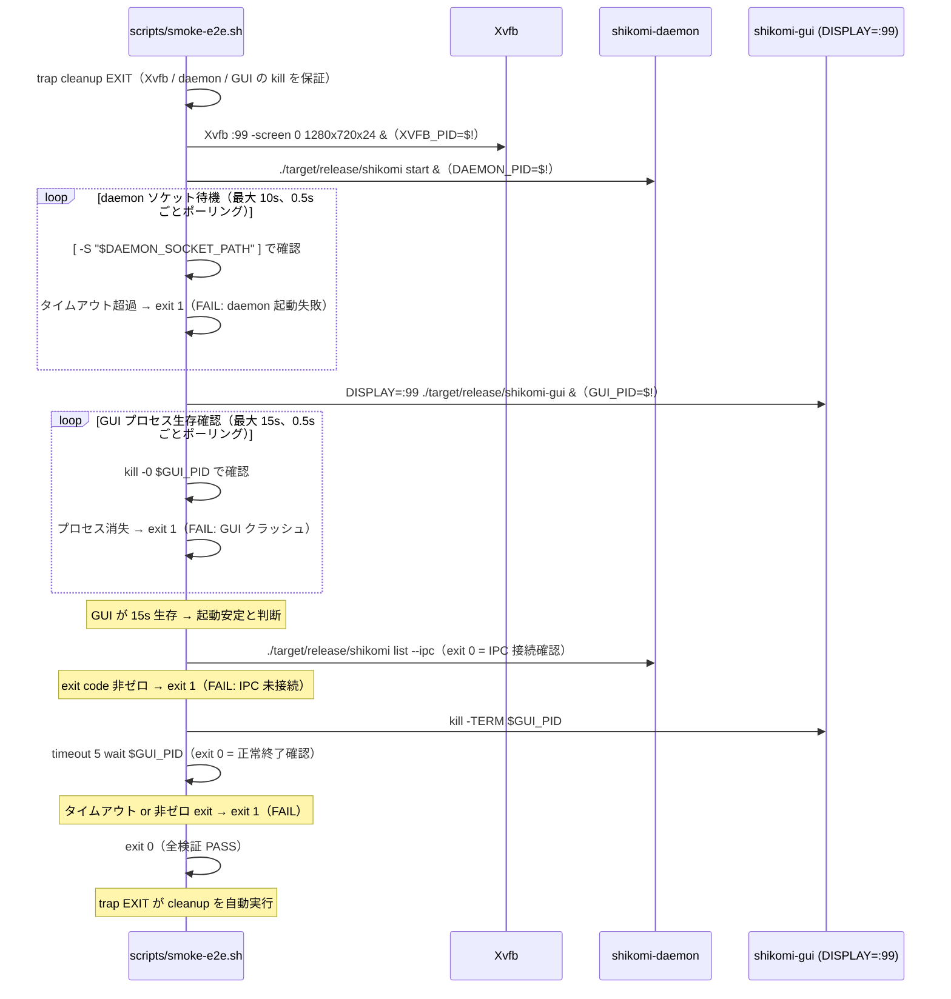
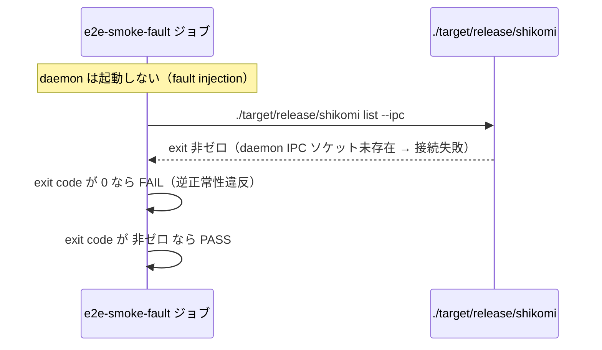
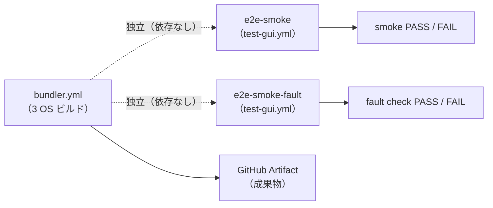

# 詳細設計書 — build-ci（shikomi-gui）: §6 e2e-smoke ジョブ / §9 エラーハンドリング

<!-- feature: shikomi-gui / sub-feature: build-ci / Issue #98 -->
<!-- 配置先: docs/features/shikomi-gui/build-ci/detailed-design/e2e.md -->
<!-- 疑似コード・実装コードブロック禁止 -->
<!-- 参照: jobs.md §3.4（macOS Keychain if: always() との対称性）-->

---

## 6. e2e-smoke ジョブ詳細（REQ-CI-07）

### 6.1 ジョブ配置方針

`e2e-smoke` ジョブは `test-gui.yml` に追記する。`bundler.yml` とは独立したジョブとして E2E 失敗がビルド成果物の生成を妨げない設計（基本設計書 §1 参照）。

### 6.2 ジョブ設定

| 設定 | 値 |
|------|-----|
| `runs-on` | `ubuntu-22.04` |
| タイムアウト | 15 分 |
| 必要な Secrets | なし |

### 6.3 ステップ一覧（TC-GUI-E01 実現）

smoke スクリプトは `scripts/smoke-e2e.sh` に SSoT 化する（後述 §6.4 参照）。CI ステップはスクリプトの呼び出しのみとし、ロジックの二重管理を防ぐ（DRY）。

| 順序 | ステップ名 | 使用アクション / コマンド | 目的 |
|------|-----------|------------------------|------|
| 1 | checkout | `actions/checkout@v4` | リポジトリ取得 |
| 2 | install Rust | `dtolnay/rust-toolchain@stable` | Rust ツールチェーン |
| 3 | Rust cache | `Swatinem/rust-cache@v2` | ビルドキャッシュ |
| 4 | install system libraries | `apt-get install` | GTK / WebKit + xvfb（後述 §6.5） |
| 5 | setup Node.js | `actions/setup-node@v4` | フロントエンドビルド環境 |
| 6 | npm ci (UI) | `npm ci` in `crates/shikomi-gui/ui/` | SolidJS ビルド |
| 7 | build binaries | `cargo build --release -p shikomi-daemon -p shikomi-cli -p shikomi-gui` | E2E に必要な 3 バイナリをビルド |
| 8 | e2e smoke test | `bash scripts/smoke-e2e.sh` | TC-GUI-E01 実行（§6.6 シーケンス図参照） |

### 6.4 smoke スクリプト SSoT 設計

| 項目 | 設計 |
|------|------|
| 配置先 | `scripts/smoke-e2e.sh`（リポジトリルート配下） |
| 実行権限 | `chmod +x`（コミット時に付与） |
| ローカル実行 | CI と同一経路で実行可能。xvfb インストール済み Linux であれば `bash scripts/smoke-e2e.sh` で手動実行 |
| CI 呼び出し | `e2e-smoke` ジョブ step 8 から `bash scripts/smoke-e2e.sh` を呼ぶだけ |
| shellcheck | `lint.yml` の shellcheck ステップ対象に `scripts/smoke-e2e.sh` を追加 |

スクリプトを `test-gui.yml` インラインに書かない理由: インライン shell は `actionlint` の文字数制限・可読性低下・ローカル再現困難の 3 問題を生む。スクリプトファイルとして配置すれば shellcheck でも静的検証できる（YAGNI で inline を選ぶ理由がない）。

### 6.5 追加システムパッケージ

`test-gui.yml` の `install system libraries` ステップに以下を追記する。

| 追加パッケージ | 用途 |
|--------------|------|
| `xvfb` | 仮想ディスプレイサーバ（headless Tauri WebView 起動） |

### 6.6 smoke スクリプト設計（TC-GUI-E01・デフォルトモード）

**固定 sleep を排除し、ソケット存在確認 + プロセス生存確認のポーリングに変更する。**これにより、速い CI ランナーでの早期成功・遅いランナーでの無駄な待機の両方を防ぐ（flaky test 排除）。

**cleanup 関数（trap EXIT で保証）**:

| 対象 | 操作 |
|------|------|
| GUI プロセス（`$GUI_PID`） | `kill -TERM $GUI_PID 2>/dev/null; wait $GUI_PID 2>/dev/null` |
| daemon プロセス（`$DAEMON_PID`） | `kill -TERM $DAEMON_PID 2>/dev/null; wait $DAEMON_PID 2>/dev/null` |
| Xvfb プロセス（`$XVFB_PID`） | `kill -TERM $XVFB_PID 2>/dev/null; wait $XVFB_PID 2>/dev/null` |

`trap cleanup EXIT` はスクリプトの最初で宣言する。success / failure どちらの経路でも必ず実行されるため、Xvfb・daemon の残留プロセスを CI ランナーに残さない（macOS Keychain の `if: always()` と同等の対称性保証）。

**daemon ソケットパス**:

`DAEMON_SOCKET_PATH` は `shikomi-daemon` が作成する UDS ソケットパス（`$XDG_RUNTIME_DIR/shikomi/shikomi.sock` 等、`shikomi-core` の定数で定義）。CI 環境では環境変数 `SHIKOMI_SOCKET_PATH` で上書き可能な場合はその値を使用する。ソケットパスの SSoT は `shikomi-core::ipc::SOCKET_PATH` に従う。

### 6.7 合否判定ロジック

| 検証ポイント | 成功条件 | 失敗時の CI 挙動 |
|------------|---------|---------------|
| daemon ソケット生成確認 | 10 秒以内にソケットファイル `$DAEMON_SOCKET_PATH` が存在する | スクリプト exit 1 → ジョブ FAIL |
| GUI プロセス起動確認 | 15 秒ポーリング中 `kill -0 $GUI_PID` が一度も失敗しない | スクリプト exit 1 → ジョブ FAIL |
| daemon IPC 接続確認 | `shikomi list --ipc` が exit 0（daemon との IPC ソケット到達を証明） | スクリプト exit 1 → ジョブ FAIL |
| プロセス正常終了確認 | `timeout 5 wait $GUI_PID` が exit 0（SIGTERM 後 5 秒以内に終了） | スクリプト exit 1 → ジョブ FAIL |

**`shikomi list --ipc` の信頼性根拠**: `shikomi list --ipc` は IPC ソケットへの接続に失敗した場合（daemon 未接続）に非ゼロ exit を返す。`--ipc` フラグで IPC 経路を明示的に指定することで、SQLite 直結経路（`shikomi list` デフォルト）との混同を設計レベルで排除する。これは TC-GUI-CI-IT04（IT04 自動化 §6.8 参照）で明示的に検証し、「IPC 接続なし → exit 非ゼロ」の動作を回帰テストで固定する。将来の実装変更でこの動作が変わった場合は IT04 が FAIL し検知できる。

### 6.8 IT04 自動化: `e2e-smoke-fault` ジョブ設計

**目的**: daemon 未起動時に IPC 確認コマンド（`shikomi list`）が正しく exit 非ゼロを返すことを CI で自動検証する（逆正常性確認）。

| 設定 | 値 |
|------|-----|
| ジョブ名 | `e2e-smoke-fault`（`test-gui.yml` に追記） |
| `runs-on` | `ubuntu-22.04` |
| タイムアウト | 5 分（ビルド済みキャッシュ使用を前提） |

**ステップ一覧（`e2e-smoke-fault` ジョブ）**:

| 順序 | ステップ名 | コマンド | 目的 |
|------|-----------|---------|------|
| 1 | checkout | `actions/checkout@v4` | リポジトリ取得 |
| 2〜4 | Rust環境 | `dtolnay/rust-toolchain@stable` + `Swatinem/rust-cache@v2` | ビルド環境 |
| 5 | build shikomi-cli | `cargo build --release -p shikomi-cli` | テスト対象 CLI バイナリをビルド |
| 6 | fault check | `! ./target/release/shikomi list --ipc` | IPC 未接続で exit 非ゼロを返すことを検証（`!` でシェル反転） |

**`! ./target/release/shikomi list --ipc` の動作**:
- daemon が起動していない → `shikomi list --ipc` が exit 非ゼロ → `!` が反転して exit 0 → CI ステップ PASS
- daemon が誤って起動していた場合 → `shikomi list --ipc` が exit 0 → `!` が反転して exit 非ゼロ → CI ステップ FAIL（テスト前提条件違反）

このシンプルな反転チェックは smoke スクリプトに引数フラグを追加するより軽量で SSoT を保ちやすい（KISS）。

### 6.9 headless 制約（テスト対象外）

基本設計書 §4.3 の headless 制約を再掲する（実装上の注意点として）。

| 機能 | headless で検証不能な理由 |
|------|--------------------------|
| GUI レイアウト / 描画 | Xvfb でウィンドウは存在するが画面キャプチャ検証はコスト過大 |
| トレイアイコン操作 | `libappindicator3` の動作は GNOME 環境依存 |
| キーボードショートカット | 仮想ディスプレイでの入力イベント注入は scope 外 |

---

## 9. エラー・失敗ハンドリング設計

### 9.1 ジョブ失敗シナリオ別対応

| 失敗シナリオ | 影響 | 対応 |
|-------------|------|------|
| `npm ci` 失敗 | フロントエンドビルド不可 → tauri build 不可 | ジョブ FAIL。`package-lock.json` の整合性確認 |
| `cargo tauri build` 失敗（Rust コンパイルエラー） | 成果物なし | ジョブ FAIL。CI ログでエラー詳細確認 |
| macOS 公証失敗（Apple サーバー負荷） | DMG 未生成 | ジョブ FAIL。手動で再実行（`workflow_dispatch`）。タイムアウトは通常 5 分以内 |
| macOS 公証失敗（証明書期限切れ） | DMG 未署名 | repository secret の更新が必要 → キャプテンに報告 |
| daemon ソケット待機タイムアウト（E2E smoke） | daemon 起動失敗 | e2e-smoke ジョブ FAIL。daemon の起動ログを確認 |
| GUI クラッシュ（E2E smoke）| GUI 起動失敗 | e2e-smoke ジョブ FAIL。shikomi-gui の初期化ログを確認 |
| `shikomi list` 失敗（E2E smoke） | daemon IPC 未接続 | e2e-smoke ジョブ FAIL。daemon の起動ログを確認 |

### 9.2 bundler.yml・e2e-smoke・e2e-smoke-fault の独立性

E2E smoke 失敗・fault 失敗は bundler の成果物生成を妨げない。

### 9.3 Keychain クリーンアップの保証（macOS）

macOS ジョブで `tauri build` ステップが失敗した場合でも Keychain 削除ステップを実行するため、`cleanup Keychain` ステップには `if: always()` 条件を付与する（`jobs.md §3.4` 参照）。smoke スクリプトの `trap EXIT` と同じ対称性原則を CI ステップにも適用する。
