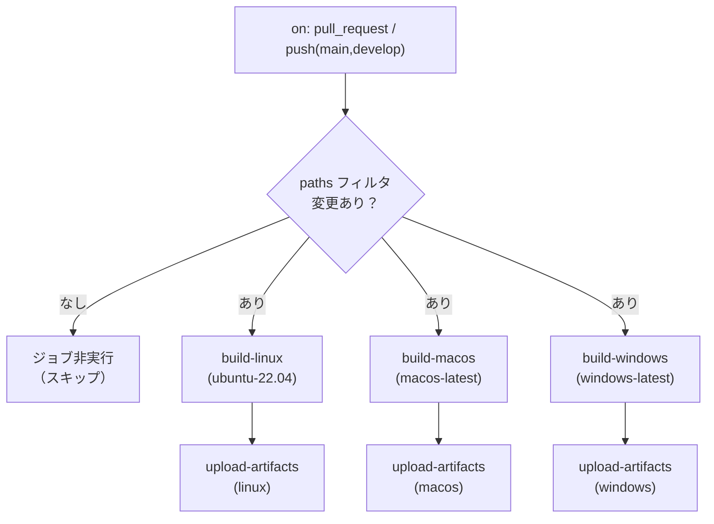

# 詳細設計書 — build-ci（shikomi-gui）: §1 ワークフロー全体 / §11 composite action

<!-- feature: shikomi-gui / sub-feature: build-ci / Issue #98 -->
<!-- 配置先: docs/features/shikomi-gui/build-ci/detailed-design/index.md -->
<!-- 疑似コード・実装コードブロック禁止 -->
<!-- 参照: docs/features/shikomi-gui/build-ci/basic-design.md -->
<!-- 参照: docs/features/shikomi-gui/feature-spec.md（凍結済み）-->
<!-- 参照: docs/design/architecture.md §CI/CD -->

> **ファイル構成**: 詳細設計は以下 4 ファイルに分割されている。
> - `index.md`（本ファイル）: §1 `bundler.yml` ワークフロー全体設計 / §11 composite action 設計
> - `jobs.md`: §2 build-linux / §3 build-macos / §4 build-windows / §5 artifact アップロード
> - `e2e.md`: §6 e2e-smoke ジョブ / §9 エラー・失敗ハンドリング
> - `misc.md`: §7 `audit.yml` 拡張 / §8 Secrets 参照一覧 / §10 トレーサビリティ

---

## 1. `bundler.yml` — トリガー・paths フィルタ設計

### 1.1 ワークフロー全体フロー

### 1.2 paths フィルタ仕様（REQ-CI-08）

paths フィルタに一致しないプッシュ・PR ではすべてのジョブをスキップする。

| paths エントリ | 意図 |
|---------------|------|
| `crates/shikomi-gui/**` | GUI crate のソース変更 |
| `crates/shikomi-core/**` | 共通 IPC 型・定数の変更 |
| `.github/workflows/bundler.yml` | ワークフロー自体の変更 |

### 1.3 ワークフロー権限・環境設定

| 設定 | 値 | 根拠 |
|------|-----|------|
| `permissions.contents` | `read` | artifact アップロードは `actions/upload-artifact` Actions API 経由のため write 不要 |
| `permissions.id-token` | `write` | macOS 公証の OIDC 接続に不要（`notarytool` は App-specific password 方式を使用）→ **付与しない** |
| Node.js バージョン | `20` | 既存 `lint.yml` / `test-gui.yml` と統一 |
| Rust toolchain | `stable`（`dtolnay/rust-toolchain@stable`） | 既存ワークフローと統一 |
| Rust キャッシュ | `Swatinem/rust-cache@v2` | 既存ワークフローと統一 |

### 1.4 artifact 保持ポリシー実装（REQ-CI-05）

artifact 保持日数はトリガー条件で分岐する。`github.event_name == 'pull_request'` を条件とした `if` 式で `retention-days` を動的に設定する。

| トリガー | `retention-days` | artifact 名テンプレート |
|---------|-----------------|----------------------|
| pull_request | 7 | `shikomi-installer-pr${{ github.event.pull_request.number }}-{os}` |
| push (main / develop) | 30 | `shikomi-installer-{sha7}-{os}`（`sha7` の算出は `jobs.md §5.2` 参照） |

---

## 11. composite action 設計（DRY: 3 OS 共通セットアップ）

### 11.1 DRY 違反の解消方針

3 つの OS ジョブ（build-linux / build-macos / build-windows）はいずれも以下の共通ステップを持つ:

1. `actions/checkout@v4`
2. `dtolnay/rust-toolchain@stable`
3. `Swatinem/rust-cache@v2`
4. `actions/setup-node@v4` (node: 20)
5. `npm ci` (in `crates/shikomi-gui/ui/`)
6. `cargo install --locked tauri-cli`

これを各ジョブに直接書くと、Node.js バージョン変更・Rust toolchain 更新・npm ci パス変更の際に 3 箇所を同期修正する必要が生じる（Boy Scout Rule 違反予備軍）。composite action として抽出することで SSoT を確保する。

### 11.2 composite action 仕様

| 項目 | 値 |
|------|-----|
| 配置先 | `.github/actions/tauri-build-setup/action.yml` |
| 種別 | composite action（`using: "composite"`） |
| inputs | なし（バージョンは action 内でハードコード。変更は action 単一箇所のみ） |
| outputs | なし |

**composite action 内ステップ**:

| 順序 | ステップ名 | action/コマンド |
|------|-----------|--------------|
| 1 | checkout | `actions/checkout@v4` |
| 2 | install Rust stable | `dtolnay/rust-toolchain@stable` |
| 3 | Rust build cache | `Swatinem/rust-cache@v2` |
| 4 | setup Node.js 20 | `actions/setup-node@v4` with `node-version: "20"` |
| 5 | npm ci (shikomi-gui UI) | `npm ci` in `crates/shikomi-gui/ui/` |
| 6 | install tauri-cli | `cargo install --locked tauri-cli` |

### 11.3 composite action を使わないステップ（OS 固有）

| OS | 固有ステップ | 理由 |
|----|------------|------|
| Linux | `apt-get install` (system libraries) | パッケージマネージャが OS 依存 |
| macOS | Keychain セットアップ / クリーンアップ | Apple 固有の署名フロー |
| Windows | 追加なし（WebView2 プリインストール済み） | — |

これらは composite action に含めず、各ジョブの OS 固有ステップとして残す。composite action は「どの OS でも同じ」ステップのみに絞る（KISS）。
