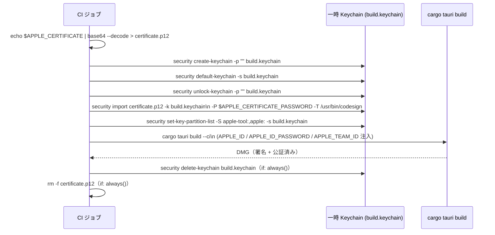

# 詳細設計書 — build-ci（shikomi-gui）: §2〜§5 各 OS ビルドジョブ / artifact

<!-- feature: shikomi-gui / sub-feature: build-ci / Issue #98 -->
<!-- 配置先: docs/features/shikomi-gui/build-ci/detailed-design/jobs.md -->
<!-- 疑似コード・実装コードブロック禁止 -->
<!-- 参照: index.md §1（ワークフロー全体）/ index.md §11（composite action）-->

---

## 2. build-linux ジョブ詳細（REQ-CI-04）

### 2.1 ジョブ設定

| 設定 | 値 |
|------|-----|
| `runs-on` | `ubuntu-22.04` |
| タイムアウト | 60 分（tauri build + bundle の標準所要時間） |
| 必要な Secrets | なし（Linux は署名不要） |

### 2.2 ステップ一覧

共通セットアップは composite action（`index.md §11` 参照）に集約する。OS 固有の追加ステップのみ各ジョブに配置する。

| 順序 | ステップ名 | 使用アクション / コマンド | 目的 |
|------|-----------|------------------------|------|
| 1 | tauri build setup | `.github/actions/tauri-build-setup`（composite） | checkout / Rust / cache / Node.js / npm ci / tauri-cli を一括セットアップ（`index.md §11`） |
| 2 | install system libraries | `apt-get install` | GTK / WebKit 依存解決（後述 §2.3） |
| 3 | tauri build (linux) | `cargo tauri build --ci` | deb / rpm / AppImage 生成（後述 §2.4） |
| 4 | upload artifacts | `actions/upload-artifact@v4` | 成果物保存（後述 §2.5） |

### 2.3 システムライブラリ一覧

既存 `test-gui.yml` の `install system libraries` ステップと同一セットを使用する（DRY: composite action でキャッシュキーを共通化）。

| パッケージ | 用途 |
|-----------|------|
| `libgtk-3-dev` | GTK3 ウィンドウシステム |
| `libwebkit2gtk-4.1-dev` | WebKit2GTK（Tauri WebView ランタイム） |
| `libappindicator3-dev` | システムトレイ（libappindicator3 ベース） |
| `librsvg2-dev` | SVG アイコンレンダリング |
| `libdbus-1-dev` | D-Bus（デスクトップ統合） |
| `libssl-dev` | TLS（cargo 依存ビルド） |
| `pkg-config` | ライブラリ検索ツール |

### 2.4 tauri build オプション

| オプション | 値 | 根拠 |
|-----------|----|------|
| `--ci` | 有効 | CI 環境向け最適化（notarytool の同期待機など。Linux では効果なし） |
| targets | `deb, rpm, appimage`（tauri.conf.json で定義済み） | 明示的な `--bundles` 指定は不要（OS が Linux の場合、他 OS ターゲットはスキップされる） |
| working directory | `crates/shikomi-gui/` | `tauri.conf.json` が存在するディレクトリ |

### 2.5 artifact アップロード対象パス

| 形式 | 相対パス（crates/shikomi-gui/ 基点） |
|------|-----------------------------------|
| deb | `target/release/bundle/deb/*.deb` |
| rpm | `target/release/bundle/rpm/*.rpm` |
| AppImage | `target/release/bundle/appimage/*.AppImage` |

---

## 3. build-macos ジョブ詳細（REQ-CI-02）

### 3.1 ジョブ設定

| 設定 | 値 |
|------|-----|
| `runs-on` | `macos-latest` |
| タイムアウト | 90 分（notarytool の非同期待機最大 5 分を含む） |
| 必要な Secrets | `APPLE_CERTIFICATE`, `APPLE_CERTIFICATE_PASSWORD`, `APPLE_ID`, `APPLE_ID_PASSWORD`, `APPLE_TEAM_ID` |

### 3.2 fork PR からのシークレット保護

GitHub のデフォルト仕様として、fork リポジトリからの PR では repository secrets が注入されない（`secrets.*` が空文字列になる）。この場合 `tauri build` のコード署名ステップが失敗するため、`if: github.event.pull_request.head.repo.full_name == github.repository` 条件でジョブ全体をスキップする（基本設計書 §5.1 参照）。

### 3.3 ステップ一覧

| 順序 | ステップ名 | 使用アクション / コマンド | 目的 |
|------|-----------|------------------------|------|
| 1 | tauri build setup | `.github/actions/tauri-build-setup`（composite） | checkout / Rust / cache / Node.js / npm ci / tauri-cli を一括セットアップ（`index.md §11`） |
| 2 | import certificate to Keychain | シェルコマンド（後述 §3.4） | Developer ID 証明書のインポート |
| 3 | tauri build (macos) | `cargo tauri build --ci` | DMG 生成 + 署名 + 公証 |
| 4 | cleanup Keychain | シェルコマンド（後述 §3.4） | 一時 Keychain の削除（`if: always()` で失敗時も保証） |
| 5 | upload artifacts | `actions/upload-artifact@v4` | 成果物保存 |

### 3.4 Keychain セットアップ・クリーンアップ設計

コード署名は Tauri が内部で `codesign` CLI を呼び出す。証明書を一時 Keychain にインポートし、ジョブ終了時に削除することでランナーの永続 Keychain を汚染しない。

**Keychain 操作の詳細**:

| 操作 | コマンド | 根拠 |
|------|---------|------|
| 一時 Keychain 作成 | `security create-keychain -p "" build.keychain` | ランナー永続 Keychain を汚染しない |
| デフォルト Keychain 変更 | `security default-keychain -s build.keychain` | `codesign` がデフォルト Keychain を探索するため |
| Keychain ロック解除 | `security unlock-keychain -p "" build.keychain` | パスワードなしで即時解除 |
| 証明書インポート | `security import ... -T /usr/bin/codesign` | `codesign` のみにアクセスを制限（最小権限） |
| パーティションリスト設定 | `security set-key-partition-list -S apple-tool:,apple:` | Keychain アクセス確認ダイアログを抑制（CI では UI 不可） |
| Keychain 削除 | `security delete-keychain build.keychain` | 一時ファイル削除（`if: always()` で tauri build 失敗時も実行保証） |

**`if: always()` の対称性保証**: `cleanup Keychain` ステップ（§3.3 順序 4）に `if: always()` を付与する。これにより `tauri build` ステップが途中失敗してもランナー上に一時 Keychain が残留しない（対称性の原則）。

出典: https://v2.tauri.app/distribute/sign/macos/

### 3.5 tauri build 環境変数（公証）

`cargo tauri build --ci` 実行時に以下の環境変数を注入する。Tauri が `notarytool` を呼び出す際に使用される。

| 環境変数 | Source | 用途 |
|---------|--------|------|
| `APPLE_ID` | `${{ secrets.APPLE_ID }}` | Apple ID（notarytool 認証） |
| `APPLE_ID_PASSWORD` | `${{ secrets.APPLE_ID_PASSWORD }}` | App-specific password |
| `APPLE_TEAM_ID` | `${{ secrets.APPLE_TEAM_ID }}` | Apple Developer Team ID |

`APPLE_CERTIFICATE` / `APPLE_CERTIFICATE_PASSWORD` は §3.4 Keychain インポートステップで消費されるため、`tauri build` への直接注入は不要（Tauri は Keychain から証明書を取得する）。

### 3.6 artifact アップロード対象パス

| 形式 | 相対パス（crates/shikomi-gui/ 基点） |
|------|-----------------------------------|
| DMG | `target/release/bundle/dmg/*.dmg` |

---

## 4. build-windows ジョブ詳細（REQ-CI-03）

### 4.1 ジョブ設定

| 設定 | 値 |
|------|-----|
| `runs-on` | `windows-latest` |
| `defaults.run.shell` | `pwsh`（既存 `windows.yml` と統一） |
| タイムアウト | 60 分 |
| 必要な Secrets | なし（MVP: コード署名なし。手動受入: **AC-GUI-08**） |

**AC-GUI-08 スコープ明記**: Windows MVP では Authenticode 証明書を取得しないため、SmartScreen 警告が表示される。この UX コストは `feature-spec.md` の AC-GUI-08（手動受入基準）に明記し、Beta 前に証明書取得を推奨する。本設計書の自動テスト対象外。

### 4.2 WebView2 ランタイム依存

`windows-latest` ランナーには WebView2 Evergreen Runtime が 2022 年以降プリインストール済み。追加インストール不要。

出典: https://github.com/actions/runner-images/blob/main/images/windows/Windows2022-Readme.md

### 4.3 ステップ一覧

| 順序 | ステップ名 | 使用アクション / コマンド | 目的 |
|------|-----------|------------------------|------|
| 1 | tauri build setup | `.github/actions/tauri-build-setup`（composite） | checkout / Rust / cache / Node.js / npm ci / tauri-cli を一括セットアップ（`index.md §11`） |
| 2 | tauri build (windows) | `cargo tauri build --ci` | MSI + NSIS 生成 |
| 3 | upload artifacts | `actions/upload-artifact@v4` | 成果物保存 |

### 4.4 Rust ターゲット

`windows-latest` の Rust デフォルトターゲットは `x86_64-pc-windows-msvc`。MSVC リンカは Visual Studio Build Tools と共にランナーにプリインストール済み。追加設定不要。

### 4.5 artifact アップロード対象パス

| 形式 | 相対パス（crates/shikomi-gui/ 基点） |
|------|-----------------------------------|
| MSI | `target/release/bundle/msi/*.msi` |
| NSIS | `target/release/bundle/nsis/*.exe` |

---

## 5. artifact アップロード詳細設計（REQ-CI-05）

### 5.1 `actions/upload-artifact@v4` 設定

各 OS ジョブに `upload-artifacts` ステップを持つ（独立ジョブではなく各ビルドジョブ末尾のステップとして配置）。ジョブ分離の理由: ビルドジョブが並列実行され、成果物パスが OS ごとに異なるため、単一 upload ジョブへの集約は不要（YAGNI）。

| パラメータ | PR | main / develop | 備考 |
|-----------|-----|----------------|------|
| `name` | `shikomi-installer-pr{N}-{os}` | `shikomi-installer-{sha7}-{os}` | `{os}` = linux / macos / windows |
| `path` | OS 別 artifact パス | 同左 | §2.5 / §3.6 / §4.5 参照 |
| `retention-days` | `7` | `30` | ワークフロー `if` 式で分岐 |
| `compression-level` | `6`（デフォルト） | 同左 | AppImage は圧縮済みのため高圧縮は無効果 |

### 5.2 artifact 命名の `sha7` 算出

GitHub Actions 式言語は文字列スライス構文を持たない。`sha7` はシェルステップで環境変数から抽出し、`$GITHUB_OUTPUT` 経由で後続ステップに渡す。

| ステップ順序 | 操作 | 詳細 |
|------------|------|------|
| 1（`compute-sha7` ステップ） | シェルで `echo "sha7=${GITHUB_SHA::7}" >> $GITHUB_OUTPUT` を実行 | Bash の文字列スライス構文でコミット SHA 先頭 7 文字を算出 |
| 2（`upload-artifacts` ステップ） | artifact name に `${{ steps.compute-sha7.outputs.sha7 }}` で参照 | ステップ output 変数経由で利用 |

この方式は PR トリガーと push トリガーで分岐する `if` 式と組み合わせて使用する。PR トリガーでは `sha7` ステップをスキップし PR 番号をそのまま使用する（DRY のため `compute-sha7` ステップの `if: github.event_name != 'pull_request'` 条件で制御）。
