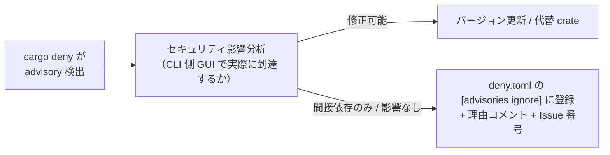

# 詳細設計書 — build-ci（shikomi-gui）: §7 audit拡張 / §8 Secrets / §10 トレーサビリティ

<!-- feature: shikomi-gui / sub-feature: build-ci / Issue #98 -->
<!-- 配置先: docs/features/shikomi-gui/build-ci/detailed-design/misc.md -->
<!-- 疑似コード・実装コードブロック禁止 -->

---

## 7. `audit.yml` 拡張設計（REQ-CI-06）

### 7.1 現状の適用範囲

既存 `audit.yml` は `just audit` → `cargo deny check` でワークスペース全体を対象にしている。`deny.toml` が Workspace メンバーを列挙しており、`shikomi-gui` crate の依存（`tauri-plugin-shell@2` 等）も自動的に対象に含まれる。

### 7.2 shikomi-gui 追加による影響

| 新規依存 | Sub-D/E で追加される理由 | 既存 deny.toml への影響 |
|---------|-------------------|----------------------|
| `tauri-plugin-shell@2` | daemon 再起動機能（Sub-D #97） | Tauri 公式 crate のため既存 `[advisories]` で問題なし |
| `tauri-driver`（不採用） | CI テストフレームワークとして検討したが YAGNI（シェルスクリプト smoke で必要十分）のため依存追加なし | — |

### 7.3 新規 RUSTSEC Advisory 発生時の対応手順

shikomi-gui の新規依存に対して `cargo deny check` が RUSTSEC advisory を検出した場合:

`deny.toml` `[advisories.ignore]` エントリの必須フィールド:

| フィールド | 内容例 |
|-----------|--------|
| `id` | `"RUSTSEC-2024-XXXX"` |
| インラインコメント | `# 間接依存（tauri-plugin-shell 経由）、GUI プロセスの外部入力到達なし。Issue #NN 参照` |

### 7.4 npm audit（UI 依存）

`audit.yml` 末尾の `npm audit (shikomi-gui/ui)` ステップは既存のまま継続する。Sub-E で UI 依存に変更がある場合は別途 `package-lock.json` を更新する（本 PR のスコープ外）。

---

## 8. Secrets 参照一覧（ジョブ別）

| Secret 名 | 使用ジョブ | ステップ | 用途 |
|-----------|---------|--------|------|
| `APPLE_CERTIFICATE` | build-macos | import certificate to Keychain | Developer ID Application 証明書（Base64 PEM） |
| `APPLE_CERTIFICATE_PASSWORD` | build-macos | import certificate to Keychain | 証明書インポートパスワード |
| `APPLE_ID` | build-macos | tauri build (macos) | notarytool 認証（Apple ID）|
| `APPLE_ID_PASSWORD` | build-macos | tauri build (macos) | App-specific password |
| `APPLE_TEAM_ID` | build-macos | tauri build (macos) | Apple Developer Team ID |
| `GITHUB_TOKEN` | 全ジョブ | actions/checkout | リポジトリ読み取り（`permissions.contents: read`） |

Windows / Linux ジョブ・e2e-smoke ジョブ・e2e-smoke-fault ジョブは repository secrets を参照しない。fork PR でもすべてのステップが実行される（macOS ジョブのみ fork PR をスキップ）。

---

## 10. feature-spec との対応（REQ-CI → 実装ファイルトレーサビリティ）

| REQ-CI | 実装ファイル | 詳細セクション | 自動検証方法 |
|--------|------------|-------------|------------|
| REQ-CI-01 | `.github/workflows/bundler.yml` | `index.md §1` / `jobs.md §2/§3/§4` | `bundler.yml` 実行（内部 PR）+ `actionlint`（TC-GUI-CI-UT01） |
| REQ-CI-02 | `.github/workflows/bundler.yml` (build-macos) | `jobs.md §3` | `bundler.yml` build-macos ジョブ実行（内部 PR）。自動 CI = ジョブ成功。**最終受入 = 手動（AC-GUI-09 Gatekeeper 検証）** |
| REQ-CI-03 | `.github/workflows/bundler.yml` (build-windows) | `jobs.md §4` | `bundler.yml` build-windows ジョブ実行（内部 PR）。自動 CI = ジョブ成功。**最終受入 = 手動（AC-GUI-08 SmartScreen 確認）** |
| REQ-CI-04 | `.github/workflows/bundler.yml` (build-linux) | `jobs.md §2` | `bundler.yml` build-linux ジョブ実行（内部 PR）+ `actionlint` |
| REQ-CI-05 | `.github/workflows/bundler.yml` (upload-artifacts) | `jobs.md §5` | `bundler.yml` 実行後の GitHub Actions artifact UI で目視確認（7 日 / 30 日は時間経過後） |
| REQ-CI-06 | `deny.toml` + `audit.yml` | `misc.md §7` | `cargo deny check`（TC-GUI-CI-UT05）が PR CI で自動実行 |
| REQ-CI-07 | `.github/workflows/test-gui.yml` (e2e-smoke + e2e-smoke-fault) | `e2e.md §6` | `e2e-smoke`（TC-GUI-CI-IT01〜IT03）+ `e2e-smoke-fault`（TC-GUI-CI-IT04）が PR CI で自動実行 |
| REQ-CI-08 | `.github/workflows/bundler.yml` (on.paths) | `index.md §1.2` | `actionlint`（TC-GUI-CI-UT01）で paths フィルタ構文を静的検証 |

**REQ-CI-02/03 の自動カバレッジ補足**: macOS 署名・公証（REQ-CI-02）と Windows MSI/NSIS ビルド（REQ-CI-03）の「成果物が正常に生成される」という自動 CI カバレッジは `bundler.yml` ジョブの成功/失敗で確認する。ただし Gatekeeper 通過（AC-GUI-09）・SmartScreen 警告（AC-GUI-08）はバイナリを実際の OS で手動実行して受入確認する。この役割分担を `test-design.md §§4/7` で明示する。
