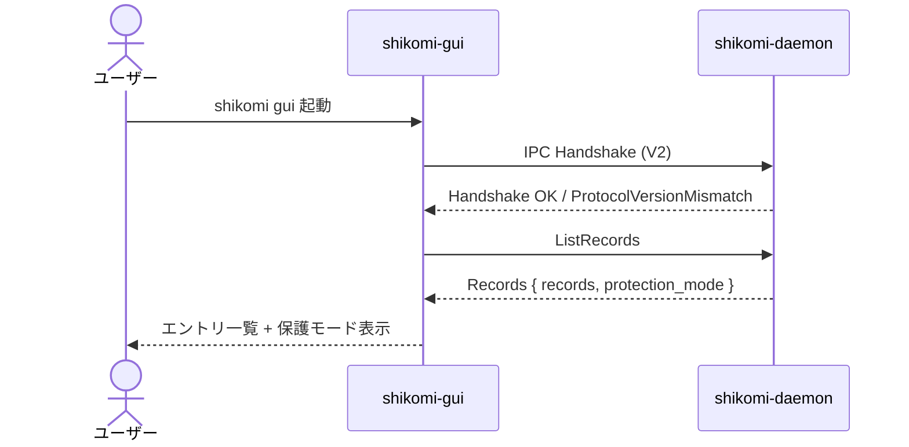

# feature-spec — shikomi-gui

<!-- feature: shikomi-gui / Issue #90 -->
<!-- 配置先: docs/features/shikomi-gui/feature-spec.md -->
<!-- 本ファイルは最初の sub-feature PR（Sub-A #94）で凍結。以降の sub-feature PR は引用のみ -->

## 1. 業務概要

shikomi の GUI フロントエンド。CLI 操作なしに vault エントリの管理・ホットキー設定・vault 暗号化オプトインをマウス操作で完結させる。ペルソナ A/C（技術知識不要層）が初めて shikomi を使い始める際の主要インターフェースとなる。

daemon との IPC 接続を通じて全操作を行い、GUI 単体では vault に直接アクセスしない。システムトレイに常駐し、機密クリップボード投入後の自動クリアカウントダウンをリアルタイムで視覚化する。

## 2. ユースケース

### UC-GUI-001: GUI を起動してエントリ一覧を確認する

| 項目 | 内容 |
|------|------|
| アクター | エンドユーザー |
| 事前条件 | daemon が起動済み |
| 基本フロー | ① `shikomi gui` を実行 ② GUI ウィンドウが開く ③ daemon と IPC ハンドシェイク確立 ④ `ListRecords` でエントリ一覧を取得して表示 |
| 代替フロー | daemon 未起動 → 「daemon が起動していません。`shikomi start` を実行してください」をインフォパネルで案内 |
| 事後条件 | エントリ一覧と vault 保護モード（平文 / 暗号化済ロック / 暗号化済アンロック）が画面に表示されている |

### UC-GUI-002: GUI でエントリを追加・編集・削除する

| 項目 | 内容 |
|------|------|
| アクター | エンドユーザー |
| 事前条件 | daemon 接続済み |
| 基本フロー A（追加）| ①「追加」ボタン ② ラベル / 値 / 種別入力 ③ 送信 → `AddRecord` IPC ④ 一覧更新 |
| 基本フロー B（編集）| ① エントリ選択 →「編集」② ラベル / 値変更 → `EditRecord` IPC ③ 一覧更新 |
| 基本フロー C（削除）| ① エントリ選択 →「削除」② 確認ダイアログ ③ `RemoveRecord` IPC ④ 一覧更新 |
| 代替フロー | vault がロック状態 → アンロック入力モーダルを先に表示 |
| 事後条件 | daemon の vault に変更が反映され、一覧が最新状態に更新されている |

### UC-GUI-003: GUI でホットキーをエントリに割り当てる

| 項目 | 内容 |
|------|------|
| アクター | エンドユーザー |
| 事前条件 | vault にエントリが存在する |
| 基本フロー | ① エントリ編集画面 ② ホットキーセレクタから `Ctrl+Alt+[1-9]` を選択 ③ `EditRecord { hotkey }` IPC ④ 一覧にホットキーバッジ表示 |
| 代替フロー | 選択ホットキーが既存エントリと競合 → `IpcErrorCode::HotkeyConflict` を受信 → 「`Ctrl+Alt+X` は別エントリ（ラベル名）に割り当て済みです」を表示 |
| 事後条件 | エントリにホットキーが紐付き、daemon が OS にホットキーを登録済み |

### UC-GUI-004: vault 暗号化をオプトインする

| 項目 | 内容 |
|------|------|
| アクター | エンドユーザー |
| 事前条件 | vault が平文モード |
| 基本フロー | ① 設定 → 暗号化セクション → 「暗号化を有効にする」② マスターパスワード入力 ③ 強度メーター表示（`zxcvbn` Feedback） ④ 強度 ≥ 3 で「暗号化」ボタンが有効化 ⑤ `Encrypt` IPC ⑥ recovery 24 語の表示・転記確認 |
| 代替フロー | 強度 < 3 → ボタン無効のまま Feedback（警告 + 改善提案）を表示 |
| 事後条件 | vault が暗号化モードに移行。recovery 24 語が一度だけ表示される |

### UC-GUI-005: システムトレイからアプリを操作する

| 項目 | 内容 |
|------|------|
| アクター | エンドユーザー |
| 事前条件 | GUI が起動中（ウィンドウ非表示可） |
| 基本フロー | ① システムトレイアイコン右クリック ② メニュー表示: ウィンドウを開く / daemon 再起動 / 終了 |
| 代替フロー A | 機密エントリ投入後 30 秒以内 → トレイアイコンに残秒カウントダウン表示 |
| 代替フロー B | ウィンドウを閉じてもトレイに常駐 |
| 事後条件 | 選択操作に応じてウィンドウ表示 / daemon 再起動 / アプリ終了のいずれかが実行される |

## 3. 機能要件

| ID | 要件 |
|----|------|
| R1-GUI-01 | `shikomi gui` コマンドで GUI を起動する。`shikomi-cli::main` から `shikomi-gui` crate のエントリポイントを呼び出す |
| R1-GUI-02 | 起動時に daemon との IPC ハンドシェイク（`IpcProtocolVersion::V2`）を確立する。失敗時は接続エラーパネルを表示し操作を無効化する |
| R1-GUI-03 | daemon 未起動時は「daemon が起動していません。`shikomi start` を実行してください」を表示し、エントリ操作ボタンを無効化する（Silent Failure 封鎖） |
| R1-GUI-04 | エントリ一覧を `IpcRequest::ListRecords` → `IpcResponse::Records { records, protection_mode }` で取得する。`protection_mode` を画面上部バナーとして表示する |
| R1-GUI-05 | エントリ追加は `IpcRequest::AddRecord`。ラベル空文字・値空文字は送信前にフォームで Fail Fast する |
| R1-GUI-06 | エントリ編集は `IpcRequest::EditRecord`。変更なし送信は行わない |
| R1-GUI-07 | エントリ削除は `IpcRequest::RemoveRecord`。削除前に確認ダイアログを表示する |
| R1-GUI-08 | ホットキー割当は `IpcRequest::EditRecord { hotkey: Some(combo) }`。ホットキー解除は `EditRecord { clear_hotkey: true }` を使う |
| R1-GUI-09 | GUI から割り当て可能なホットキーは `Ctrl+Alt+[1-9]` の 9 通り固定。セレクタ UI で選択する（自由入力は MVP 非スコープ） |
| R1-GUI-10 | vault 暗号化オプトインは `IpcRequest::Encrypt`。マスターパスワード入力時に `zxcvbn` で強度評価し Feedback（警告・改善提案）を表示する。強度 < 3 では「暗号化」ボタンを無効化する |
| R1-GUI-11 | `IpcResponse::Encrypted { disclosure }` 受信後、recovery 24 語を表示する。ユーザーが「転記完了」を確認するまで次の操作へ進めない（1 度のみ表示） |
| R1-GUI-12 | vault 復号は `IpcRequest::Decrypt`。`confirmed: true` は GUI 側で確認入力（`DECRYPT` 文字列の大文字一致）を検証してから送信する |
| R1-GUI-13 | vault がロック状態（`ProtectionModeBanner::EncryptedLocked`）での書き込み操作はアンロックモーダルを表示し、`IpcRequest::Unlock` を先行させる |
| R1-GUI-14 | システムトレイに常駐する。ウィンドウを閉じてもアプリを終了しない（トレイメニューから明示終了のみ） |
| R1-GUI-15 | daemon から機密クリップボード投入イベントを受信したとき、残秒カウントダウンをシステムトレイアイコンに表示する（Sub-D で実装） |
| R1-GUI-16 | `tauri-bundler` で MSI / NSIS（Windows）・DMG（macOS）・deb / rpm / AppImage（Linux）を生成できる |

## 4. 非機能要件（本 feature スコープ）

| 項目 | 要件 |
|------|------|
| GUI 起動時間 | 起動からエントリ一覧表示まで 2 秒以内（daemon 接続時間を含む） |
| メモリ使用量 | GUI プロセス常駐時 150 MB 以下（Tauri v2 Webview は OS 共有 WebView2/WKWebView を使用） |
| バンドルサイズ | インストーラ 30 MB 以下（SolidJS + Tauri v2 の標準的な目標値） |
| アクセシビリティ | MVP は対象外。フォーム要素に `aria-label` を付与する程度で可（Issue #90 非スコープ） |
| i18n | MVP は日本語のみ。多言語化は非スコープ |

## 5. 受入基準

| ID | 基準 |
|----|------|
| AC-GUI-01 | `shikomi gui` で GUI が起動し、daemon と IPC 接続が確立される |
| AC-GUI-02 | エントリの追加・編集・削除・ホットキー設定が GUI 上で完結し、`shikomi list` でも反映が確認できる |
| AC-GUI-03 | vault 暗号化オプトインで recovery 24 語が表示され、vault がロック状態になる |
| AC-GUI-04 | `tauri-bundler` で MSI / DMG / AppImage の 3 形式が生成できる |
| AC-GUI-05 | システムトレイに常駐し、ウィンドウを閉じてもプロセスが継続する |

## 6. スコープ外（MVP 後回し）

- i18n / アクセシビリティ対応（`aria` 全対応・スクリーンリーダー検証）
- テーマ切替（ダーク / ライトモード）
- エントリのエクスポート / インポート UI
- vault のバックアップ / リストア UI
- ホットキーのカスタム修飾キー組み合わせ（`Ctrl+Alt+[1-9]` 以外）
- Flatpak / Snap 配布
- オートアップデート（`tauri-plugin-updater`）
- OS キーチェーン経由の自動アンロック

## 7. daemon-hotkey-clipboard feature との関係

本 feature は `daemon-hotkey-clipboard`（Issue #89）の GUI クライアント実装に相当する。

| 項目 | daemon-hotkey-clipboard | shikomi-gui（本 feature） |
|------|------------------------|--------------------------|
| ホットキー登録 | daemon が OS に登録 | GUI → IPC → daemon に依頼 |
| クリップボード投入 | daemon が直接実行 | GUI は介在しない（ホットキー押下がトリガ） |
| カウントダウン表示 | `R1-HK-05` 30 秒タイマー | `R1-GUI-15` システムトレイで視覚化 |
| vault 操作 | IPC ハンドラで受理 | `IpcRequest` 全操作を GUI から呼び出し |
