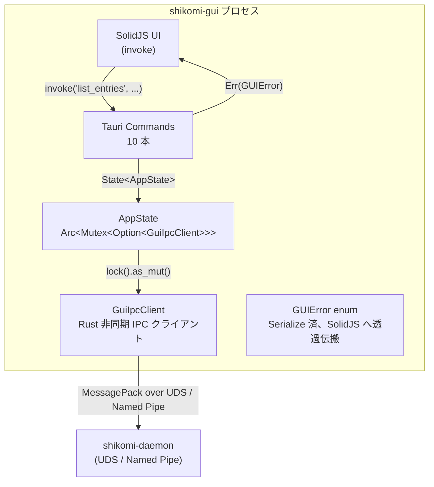

# 基本設計書 — ipc-client（shikomi-gui）

<!-- feature: shikomi-gui / sub-feature: ipc-client / Issue #95 -->
<!-- 配置先: docs/features/shikomi-gui/ipc-client/basic-design.md -->
<!-- 疑似コード・実装コードブロック禁止 -->
<!-- 参照: docs/features/shikomi-gui/feature-spec.md（凍結済み）-->
<!-- 参照: docs/architecture/tech-stack.md §2.6 -->

## §モジュール契約（機能要件マッピング）

| 要件 ID | 契約 |
|---------|------|
| REQ-IPC-01 | `list_entries` Tauri Command が `IpcRequest::ListRecords` を送信し、`IpcResponse::Records { records, protection_mode }` を SolidJS に返す（R1-GUI-04） |
| REQ-IPC-02 | `add_entry` Tauri Command が `IpcRequest::AddRecord` を送信し、`IpcResponse::Added { id }` を返す。ラベル空文字・値空文字は Rust ハンドラ側で Fail Fast する（R1-GUI-05, R1-GUI-19） |
| REQ-IPC-03 | `update_entry` Tauri Command が `IpcRequest::EditRecord` を送信し、`IpcResponse::Edited { id }` を返す。変更フィールドが全て `None` の場合は IPC 送信を省略し即時成功を返す（R1-GUI-06） |
| REQ-IPC-04 | `delete_entry` Tauri Command が `IpcRequest::RemoveRecord` を送信し、`IpcResponse::Removed { id }` を返す（R1-GUI-07） |
| REQ-IPC-05 | `assign_hotkey` Tauri Command が `IpcRequest::EditRecord { hotkey: Some(combo), clear_hotkey: false }` を送信し、`IpcResponse::Edited { id }` を返す。combo は `Ctrl+Alt+[1-9]` 形式のみ許可、Rust ハンドラ側で検証する（R1-GUI-08, R1-GUI-09, R1-GUI-19） |
| REQ-IPC-06 | `remove_hotkey` Tauri Command が `IpcRequest::EditRecord { clear_hotkey: true }` を送信し、`IpcResponse::Edited { id }` を返す（R1-GUI-08） |
| REQ-IPC-07 | `get_vault_status` Tauri Command が `IpcRequest::ListRecords` を送信し、`protection_mode` のみ SolidJS に返す。vault 状態の単独取得 API として機能する（R1-GUI-04, R1-GUI-13） |
| REQ-IPC-08 | `encrypt_vault` Tauri Command が `IpcRequest::Encrypt { master_password, accept_limits: false }` を送信し、`IpcResponse::Encrypted { disclosure }` の `disclosure`（BIP-39 24 語）を SolidJS に返す（R1-GUI-10, R1-GUI-11） |
| REQ-IPC-09 | `decrypt_vault` Tauri Command が `IpcRequest::Decrypt { master_password, confirmed }` を送信し、`IpcResponse::Decrypted` を返す。`confirmed` は JS 側チェックボックス状態をそのまま受け取り、Rust ハンドラが `confirmed == false` を Fail Fast する（R1-GUI-12, R1-GUI-19） |
| REQ-IPC-10 | `unlock_vault` Tauri Command が `IpcRequest::Unlock { master_password, recovery: None }` を送信し、`IpcResponse::Unlocked` を返す。vault がロック状態での書き込み操作前にアンロックモーダルから呼ばれる（R1-GUI-13） |
| REQ-IPC-11 | `GuiIpcClient::connect()` が UDS（Unix）/ Named Pipe（Windows）経由で daemon に接続し、`IpcProtocolVersion::V2` Handshake を確立する。接続失敗・プロトコル不一致は `GUIError` に変換して Fail Fast する（R1-GUI-02, R1-GUI-03） |
| REQ-IPC-12 | daemon 未接続状態での全 Tauri Command 呼び出しは即 `GUIError::DaemonNotRunning` を返す。サイレント失敗・リトライは行わない（tech-stack.md §2.6.2 Fail Fast 契約） |

## 1. モジュール構成

変更対象 crate: **`shikomi-gui`**

```
crates/shikomi-gui/src/
  ipc_client/
    mod.rs              ← GuiIpcClient struct + AppState 型エイリアス
    error.rs            ← GUIError enum（Serialize 実装含む）
    commands/
      mod.rs            ← invoke_handler に渡す全 Command の再エクスポート
      entries.rs        ← list_entries / add_entry / update_entry / delete_entry
      hotkey.rs         ← assign_hotkey / remove_hotkey
      vault.rs          ← get_vault_status / encrypt_vault / decrypt_vault / unlock_vault
  lib.rs                ← AppState を manage()、invoke_handler に全 Command 登録
```

## 2. コンポーネント設計



### 2.1 `GuiIpcClient`

daemon との非同期 IPC 接続を保持する構造体。CLI の `IpcClient`（`shikomi-cli::io::ipc_client`）と同一のトランスポート設計を踏襲しつつ、エラー型を `GUIError` に置き換える。

| メソッド | 説明 |
|---------|------|
| `connect(socket_path)` | UDS / Named Pipe に接続し、V2 Handshake を行う。失敗時は `GUIError` を返す |
| `round_trip(request)` | リクエスト送信 + レスポンス受信の 1 往復 helper |

**依存方針**: `shikomi-core::ipc` の型を直接使用（DRY）。`shikomi-cli::io::ipc_client` とは別実装として `shikomi-gui` 内に閉じる。詳細は `detailed-design.md §1` を参照。

### 2.2 `GUIError`

Tauri Commands の統一エラー型。`serde::Serialize` を実装し、SolidJS 側で JSON として受け取れる。

| variant | 意味 |
|---------|------|
| `DaemonNotRunning` | UDS / Named Pipe が存在しない（daemon 未起動） |
| `ConnectionFailed(String)` | 接続確立後の IO エラー |
| `ProtocolVersionMismatch { server, client }` | プロトコルバージョン不一致 |
| `Ipc(IpcErrorCode)` | daemon から返却された `IpcErrorCode` の透過伝搬 |
| `Encode(String)` | MessagePack シリアライズ失敗 |
| `Decode(String)` | MessagePack デシリアライズ失敗 |
| `UnexpectedResponse(String)` | 予期しない `IpcResponse` variant |
| `InvalidInput(String)` | Rust 側 input validation 失敗（R1-GUI-19） |
| `NotConnected` | AppState が未接続（`connect()` 未呼び出しまたは切断後） |

`GUIError` は `thiserror::Error` を derive し、`Serialize` 実装で `{ "kind": "...", "message": "..." }` 形式に写像する（詳細は `detailed-design.md §2` 参照）。

### 2.3 Tauri Commands 一覧

| Command 関数名 | 対応 IpcRequest | 正常時 IpcResponse | 機能要件 |
|---|---|---|---|
| `list_entries` | `ListRecords` | `Records { records, protection_mode }` | REQ-IPC-01 |
| `add_entry` | `AddRecord` | `Added { id }` | REQ-IPC-02 |
| `update_entry` | `EditRecord` | `Edited { id }` | REQ-IPC-03 |
| `delete_entry` | `RemoveRecord` | `Removed { id }` | REQ-IPC-04 |
| `assign_hotkey` | `EditRecord { hotkey: Some, clear_hotkey: false }` | `Edited { id }` | REQ-IPC-05 |
| `remove_hotkey` | `EditRecord { clear_hotkey: true }` | `Edited { id }` | REQ-IPC-06 |
| `get_vault_status` | `ListRecords` | `protection_mode`（`Records` から抽出） | REQ-IPC-07 |
| `encrypt_vault` | `Encrypt` | `Encrypted { disclosure }` | REQ-IPC-08 |
| `decrypt_vault` | `Decrypt` | `Decrypted` | REQ-IPC-09 |
| `unlock_vault` | `Unlock { recovery: None }` | `Unlocked` | REQ-IPC-10 |

全 Command は `async fn` で実装する（tech-stack.md §2.6.2）。

### 2.4 `AppState`（接続状態管理）

```
AppState = Arc<Mutex<Option<GuiIpcClient>>>
```

- `None`: daemon 未接続状態（起動直後 / 切断後）
- `Some(client)`: daemon 接続済み

Tauri アプリ起動時に `lib.rs::setup()` フックが `GuiIpcClient::connect()` を呼び、成功すれば `Some` に遷移させる。接続失敗は UI パネルで通知し `None` のまま保持する（R1-GUI-03）。

`AppState` は `tauri::Manager::manage()` で登録し、各 Command ハンドラが `tauri::State<AppState>` で受け取る。

## 3. feature-spec との対応（R1-GUI → REQ-IPC トレーサビリティ）

| R1-GUI | REQ-IPC | 実装 Command |
|--------|---------|-------------|
| R1-GUI-02 | REQ-IPC-11 | `GuiIpcClient::connect` |
| R1-GUI-03 | REQ-IPC-12 | 全 Commands（NotConnected ガード） |
| R1-GUI-04 | REQ-IPC-01, REQ-IPC-07 | `list_entries`, `get_vault_status` |
| R1-GUI-05 | REQ-IPC-02 | `add_entry` |
| R1-GUI-06 | REQ-IPC-03 | `update_entry` |
| R1-GUI-07 | REQ-IPC-04 | `delete_entry` |
| R1-GUI-08 | REQ-IPC-05, REQ-IPC-06 | `assign_hotkey`, `remove_hotkey` |
| R1-GUI-09 | REQ-IPC-05 | `assign_hotkey`（`Ctrl+Alt+[1-9]` 検証） |
| R1-GUI-10 | REQ-IPC-08 | `encrypt_vault` |
| R1-GUI-11 | REQ-IPC-08 | `encrypt_vault`（`disclosure` 返却） |
| R1-GUI-12 | REQ-IPC-09 | `decrypt_vault`（`confirmed` Fail Fast） |
| R1-GUI-13 | REQ-IPC-10, REQ-IPC-07 | `unlock_vault`, `get_vault_status` |
| R1-GUI-17 | 該当なし — Sub-A で `tauri.conf.json` に設定済み | — |
| R1-GUI-18 | 該当なし — Sub-C（UI コンポーネント層）の責務 | — |
| R1-GUI-19 | REQ-IPC-02, REQ-IPC-05, REQ-IPC-09 | `add_entry`, `assign_hotkey`, `decrypt_vault` の Rust 側検証 |
