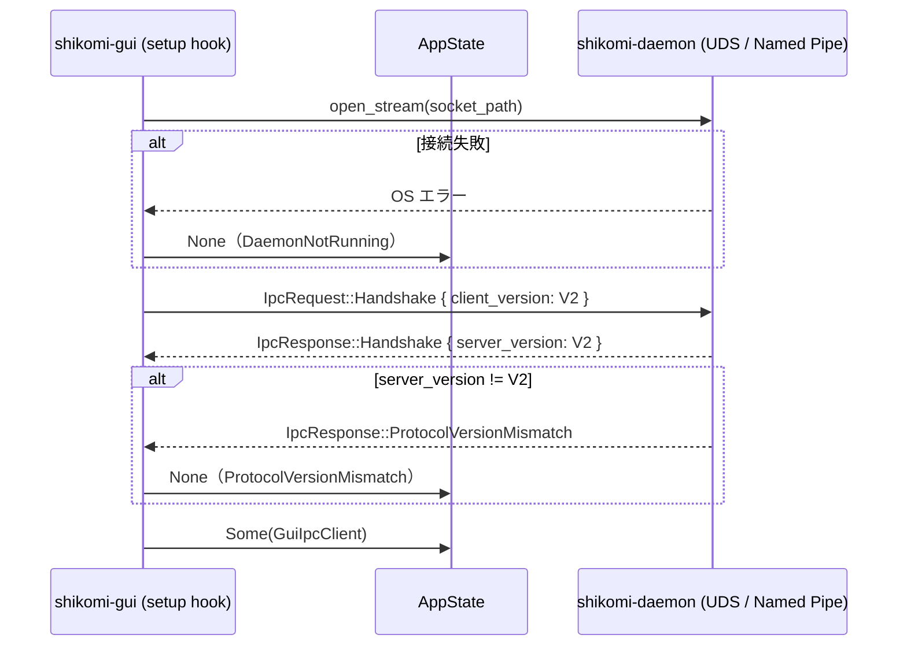
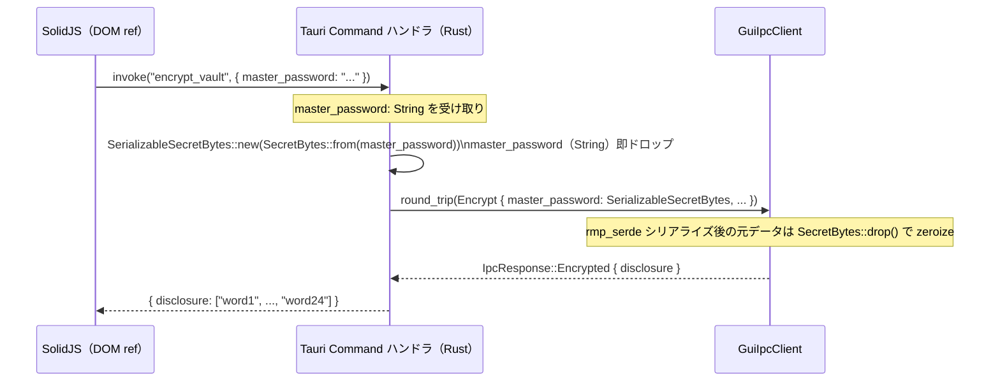
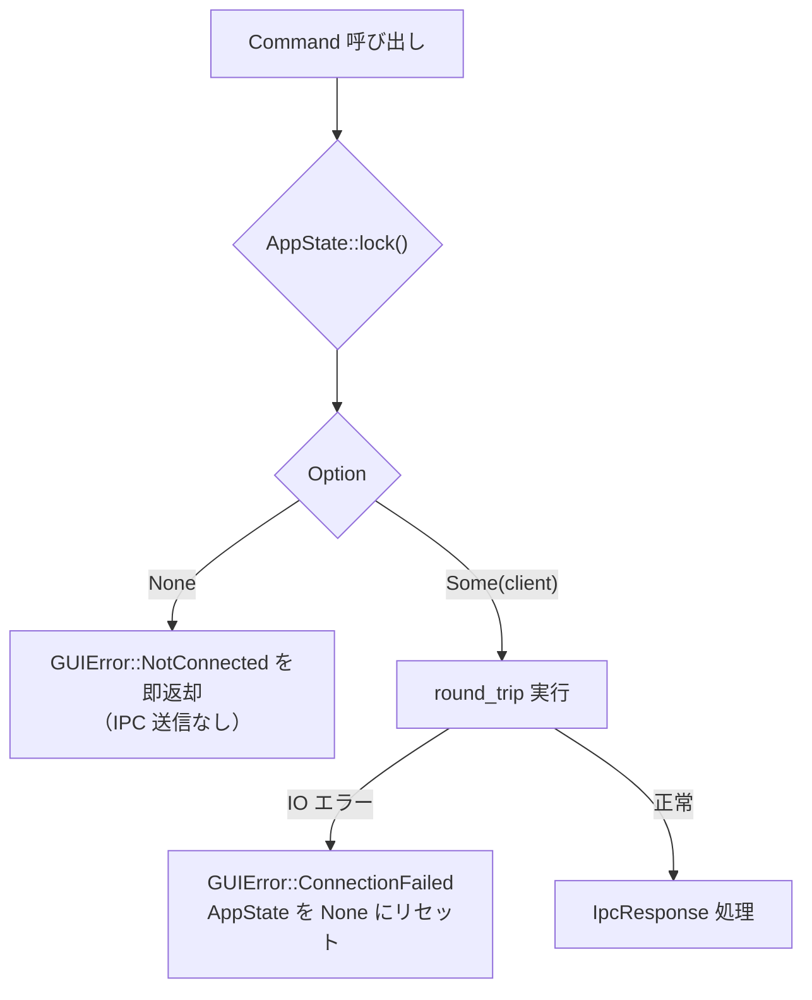

# 詳細設計書 — ipc-client（shikomi-gui）

<!-- feature: shikomi-gui / sub-feature: ipc-client / Issue #95 -->
<!-- 配置先: docs/features/shikomi-gui/ipc-client/detailed-design.md -->
<!-- 疑似コード・実装コードブロック禁止 -->
<!-- 参照: docs/features/shikomi-gui/ipc-client/basic-design.md -->
<!-- 参照: docs/features/shikomi-gui/feature-spec.md（凍結済み）-->
<!-- 参照: docs/architecture/tech-stack.md §2.6 -->
<!-- 参照: docs/architecture/context/threat-model.md §7.3 -->

## 1. `GuiIpcClient` 詳細

### 1.1 フィールド

| フィールド | 型 | 説明 |
|-----------|----|------|
| `framed` | `Framed<Stream, LengthDelimitedCodec>` | MessagePack フレーム化されたストリーム |

`Stream` は `cfg` でプラットフォーム別に切り替える：

| OS | Stream 型 |
|----|-----------|
| Unix（macOS / Linux） | `tokio::net::UnixStream` |
| Windows | `tokio::net::windows::named_pipe::NamedPipeClient` |

**セキュリティ前提（UDS ピア認証）**:

本クライアントが接続する UDS ソケットの認可（同一ユーザー UID の確認）は **daemon 側が `SO_PEERCRED` / Windows ACL で担保**している（`docs/architecture/context/threat-model.md §7` および `crates/shikomi-daemon/src/permission/` 参照）。`GuiIpcClient` はトランスポート層のみを担い、追加の認証処理は行わない。これは daemon が自身と同一 UID のクライアントのみ接続を受理する設計に依存しており、GUI プロセスが異なるユーザーで動作する場合は daemon が接続を拒否する。

### 1.2 接続・ハンドシェイクフロー



### 1.3 フレームコーデック仕様

CLI の `IpcClient` と同一仕様で実装する（共通 daemon への接続のため仕様は固定）。

| パラメータ | 値 | 根拠 |
|------------|------|------|
| バイト順 | little-endian | CLI・daemon 既存仕様に準拠（`tech-stack.md §2.1`） |
| 長さフィールド長 | 4 バイト | 同上 |
| 最大フレーム長 | 16 MiB（`MAX_FRAME_LENGTH`） | `shikomi-core::ipc::MAX_FRAME_LENGTH`（DoS 対策） |
| シリアライズ形式 | MessagePack（`rmp-serde`） | 同上 |

### 1.4 メソッド仕様

#### `connect(socket_path: &Path) → Result<Self, GUIError>`

1. `open_stream(socket_path)` で OS 別ストリームを開く。失敗時は `GUIError::DaemonNotRunning`
2. `Framed::new(stream, codec())` でフレーマを初期化
3. `IpcRequest::Handshake { client_version: IpcProtocolVersion::current() }` を `rmp_serde::to_vec` でシリアライズして送信
4. レスポンス受信 → `rmp_serde::from_slice` でデシリアライズ
5. `IpcResponse::Handshake { server_version: V2 }` 以外は `GUIError` に変換して返却

#### `round_trip(request: &IpcRequest) → Result<IpcResponse, GUIError>`

1. `rmp_serde::to_vec(request)` でシリアライズ失敗時は `GUIError::Encode`
2. `framed.send(bytes)` の IO 失敗は `GUIError::ConnectionFailed(io_error.kind().to_string())`
   — `std::io::Error` の `kind()` のみを文字列化し、OS 内部情報（ソケットパス・FD 番号等）を含む生メッセージは**使用しない**（OWASP A04 エラーメッセージ漏洩対策）
3. `framed.next()` で受信。`None`（EOF）は `GUIError::ConnectionFailed("connection closed")`
4. `rmp_serde::from_slice(&bytes)` のデシリアライズ失敗は `GUIError::Decode`
5. 成功時は `IpcResponse` を返す

### 1.5 ソケットパス解決（`IpcEndpoint`、REQ-IPC-13）

`GuiIpcClient::connect()` は呼び出し元（`lib.rs::setup()`）から `socket_path: &Path` を受け取る。パス解決ロジックは `setup()` が担い、`GuiIpcClient` 自体はパス解決を行わない（単一責務）。

**DRY 設計**: ソケットパス解決ロジックを CLI（`IpcVaultRepository::default_socket_path()`）と GUI（`lib.rs::setup()`）の2箇所に重複させない。`shikomi-infra` crate に新設する `IpcEndpoint::default_for_current_user()` に一元化し、両者がこれを呼び出す。

#### `IpcEndpoint`（`shikomi-infra::ipc::IpcEndpoint`、Sub-B で新設）

| メソッド | 戻り値 | 説明 |
|---------|--------|------|
| `IpcEndpoint::default_for_current_user()` | `Result<PathBuf, PersistenceError>` | 現ユーザーのデフォルト IPC ソケットパスを解決。優先順位は下表 |

| 優先度 | OS | パス | 条件 |
|--------|----|----|------|
| 1（Phase B 持ち越し、**本 Sub-B では未実装**） | Unix | `$SHIKOMI_VAULT_DIR/daemon.sock` | 環境変数 `SHIKOMI_VAULT_DIR` が設定されている場合。CLI の `connect_with_vault_dir` 経路として別実装済み。`IpcEndpoint` への統合は Phase B で対応予定 |
| 2 | Unix | `$XDG_RUNTIME_DIR/shikomi/daemon.sock` | 環境変数 `XDG_RUNTIME_DIR` が設定かつ非空の場合 |
| 3 | macOS | `dirs::cache_dir()/shikomi/daemon.sock` | `$XDG_RUNTIME_DIR` 未設定時のフォールバック（`~/Library/Caches/shikomi/daemon.sock` 相当） |
| 3 | Linux / その他 Unix | `dirs::runtime_dir()/shikomi/daemon.sock` | `$XDG_RUNTIME_DIR` 未設定時のフォールバック（`/run/user/{uid}/shikomi/daemon.sock` 相当） |
| — | Windows | `\\.\pipe\shikomi-daemon-{user-sid}` | SID は `ConvertSidToStringSidW` / `GetTokenInformation` で動的取得 |

**ファイル名について**: daemon は `daemon.sock` でソケットを bind する（`crates/shikomi-daemon/src/` の bind 処理と整合）。`shikomi.sock` は誤りである。

**移行計画**: CLI の `IpcVaultRepository::default_socket_path()` は本 Sub-B で `IpcEndpoint::default_for_current_user()` への委譲に書き換える（Boy Scout Rule）。

---

## 2. `GUIError` 詳細定義

### 2.1 variant 一覧

| variant | フィールド | Serialize 後の `kind` 文字列 | 意味 |
|---------|-----------|--------------------------|------|
| `DaemonNotRunning` | なし | `"daemon_not_running"` | UDS / Named Pipe ファイルが存在しない（daemon 未起動） |
| `ConnectionFailed(String)` | `message: String` | `"connection_failed"` | 接続後の IO エラー（切断含む）。`message` には `io::Error::kind().to_string()` のみを使用し、生の OS エラーメッセージ（ソケットパス・FD番号等）を含めない（OWASP A04） |
| `ProtocolVersionMismatch` | `server: String, client: String` | `"protocol_version_mismatch"` | Handshake バージョン不一致 |
| `Ipc(IpcErrorCode)` | `ipc_code: String`（`IpcErrorCode` variant の安定識別子、§2.3 参照） | `"ipc_error"` | daemon 返却 `IpcErrorCode` の透過伝搬。JSON は 3 フィールド（`kind` / `ipc_code` / `message`）、Sub-C は `ipc_code` で UI 分岐する |
| `Encode(String)` | `message: String` | `"encode_error"` | MessagePack シリアライズ失敗 |
| `Decode(String)` | `message: String` | `"decode_error"` | MessagePack デシリアライズ失敗 |
| `UnexpectedResponse(String)` | `message: String` | `"unexpected_response"` | 予期しない `IpcResponse` variant |
| `InvalidInput(String)` | `message: String` | `"invalid_input"` | Rust 側 input validation 失敗（R1-GUI-19） |
| `NotConnected` | なし | `"not_connected"` | AppState が `None`（daemon 未接続） |

### 2.2 Serialize 出力仕様

SolidJS 側が `switch` でエラー分岐できるよう、以下の JSON 構造に写像する：

**`ipc_error` 以外の全 variant（2 フィールド）**:
```
{ "kind": "<上記の kind 文字列>", "message": "<デバッグ用英語技術情報>" }
```

**`Ipc(IpcErrorCode)` variant のみ（3 フィールド）**:
```
{ "kind": "ipc_error", "ipc_code": "<§2.3 の安定識別子>", "message": "<IpcErrorCode::Display 文字列>" }
```

`ipc_code` は §2.3 で凍結する安定識別子。Sub-C はこのフィールドで UI 分岐する。
`IpcErrorCode` の `Display` 実装（`shikomi-core::ipc::error_code`）を `message` フィールドに使用する。

**`message` フィールドの用途制限**:

- `message` は**開発者向けデバッグ・ログ記録用途のみ**。ユーザーへの直接表示に使ってはならない
- Sub-C（UI 層）は `kind` フィールドを switch して**日本語メッセージを自前で表示する責務を持つ**（例: `"daemon_not_running"` → 「daemon が起動していません。`shikomi start` を実行してください」）
- `message` を画面表示すると、ペルソナ A/C（田中俊介・佐々木健二）には意味不明な英語技術文字列が表示される（personas.md §ペルソナ A/C）

### 2.3 `IpcErrorCode` の透過伝搬 — `ipc_code` 安定識別子（凍結 API 契約）

`GUIError::Ipc(IpcErrorCode)` は daemon 側エラーコードを `ipc_code` フィールドに変換して SolidJS に届ける。Sub-C（UI 層）は `kind == "ipc_error"` を検出後、`ipc_code` で UI 分岐する。**`message` のパースに依存してはならない**（デバッグ用途のみ）。

以下の `ipc_code` 文字列を**凍結 API 契約**とする。変更は本設計書の改訂 + Sub-C 更新を伴う PR で行うこと：

| `ipc_code` 値（凍結） | 対応 `IpcErrorCode` variant | 追加フィールド | Sub-C の表示責務 |
|----------------------|----------------------------|---------------|-----------------|
| `"vault_locked"` | `VaultLocked` | なし | アンロックモーダルを表示（R1-GUI-13） |
| `"hotkey_conflict"` | `HotkeyConflict { reason }` | なし | 「競合エントリ名」を表示（R1-GUI-08, UC-GUI-003） |
| `"not_found"` | `NotFound { id }` | なし | 「エントリが見つかりません」エラーダイアログ |
| `"crypto"` | `Crypto { reason }` | `"crypto_reason": "<kebab-case固定文言>"` | `crypto_reason` により分岐：`"wrong-password"` → 「パスワードが一致しません」、`"weak-password"` → 「パスワードが脆弱です」、`"nonce-limit-exceeded"` → 「再暗号化が必要です」（UC-GUI-006）。凍結許容値セットは `IpcErrorCode::Crypto.reason` 設計書 SSoT 参照 |
| `"backoff_active"` | `BackoffActive { wait_secs }` | `"wait_secs": <u32>` | **`wait_secs` フィールドの値**（秒数）を UI に表示する。`message` への依存は禁止 |
| `"recovery_required"` | `RecoveryRequired` | なし | recovery 語 入力モーダルへ誘導 |
| `"hotkey_parse_error"` | `HotkeyParseError { reason }` | なし | 「ホットキー形式が不正です」を表示 |
| `"encryption_unsupported"` | `EncryptionUnsupported` | なし | 「この操作は現在サポートされていません」エラーダイアログ |
| `"invalid_label"` | `InvalidLabel { reason }` | なし | 「ラベルが不正です」を表示 |
| `"persistence"` | `Persistence { reason }` | なし | 「データ保存エラーが発生しました」エラーダイアログ |
| `"domain"` | `Domain { reason }` | なし | 「操作を完了できませんでした」エラーダイアログ |
| `"internal"` | `Internal { reason }` | なし | 「予期しないエラーが発生しました」エラーダイアログ |
| `"protocol_downgrade"` | `ProtocolDowngrade` | なし | 「daemon との通信エラーが発生しました。再起動してください」エラーダイアログ |

**追加フィールド仕様**: `crypto` と `backoff_active` のみ標準の `kind` / `ipc_code` / `message` 3フィールドに加えて専用フィールドを持つ。完全な JSON 例：

```
// backoff_active
{ "kind": "ipc_error", "ipc_code": "backoff_active", "wait_secs": 30, "message": "unlock blocked by backoff for 30s" }

// crypto
{ "kind": "ipc_error", "ipc_code": "crypto", "crypto_reason": "wrong-password", "message": "crypto error: wrong-password" }
```

---

## 3. Tauri Commands 詳細仕様

### 3.1 `list_entries`

| 項目 | 内容 |
|------|------|
| 入力 | なし |
| 処理 | AppState から `GuiIpcClient` を取得 → `ListRecords` round_trip → `Records { records, protection_mode }` を返す |
| 出力 | `{ entries: RecordSummary[], vault_status: ProtectionModeBanner }` |
| エラー時 | `NotConnected` / `ConnectionFailed` / `Decode` / `Ipc(VaultLocked)` 等 |

### 3.2 `add_entry`

| 項目 | 内容 |
|------|------|
| 入力 | `kind: RecordKind, label: String, value: String, hotkey: Option<String>` |
| 処理 | Rust 側 validation（ラベル空文字 → `InvalidInput`、値空文字 → `InvalidInput`）→ `now = OffsetDateTime::now_utc()` 生成 → `AddRecord` round_trip → `Added { id }` |
| 出力 | `{ id: String }` |
| エラー時 | `InvalidInput` / `NotConnected` / `Ipc(InvalidLabel)` / `Ipc(HotkeyConflict)` 等 |

**注**: `value: String` は受け取り次第 `SerializableSecretBytes` に変換し、元の `String` は即ドロップする。詳細は §4.1 参照。

### 3.3 `update_entry`

| 項目 | 内容 |
|------|------|
| 入力 | `id: String, label: Option<String>, value: Option<String>` |
| 処理 | ハンドラに到達した場合は**必ず** `EditRecord` を IPC 送信する。Silent Failure（IPC 省略して `Ok` を返す）を**行わない**。Sub-C が変更なし時に `invoke` を呼ばない契約を持つ（`basic-design.md §3.3` 参照）。`id` は `RecordId::try_from_str` で検証 → 失敗時は `InvalidInput` |
| 出力 | `{ id: String }` |
| エラー時 | `InvalidInput`（不正 UUID）/ `NotConnected` / `Ipc(NotFound)` / `Ipc(InvalidLabel)` 等 |

### 3.4 `delete_entry`

| 項目 | 内容 |
|------|------|
| 入力 | `id: String` |
| 処理 | `RemoveRecord { id: RecordId::try_from_str(id) }` round_trip → `Removed { id }` |
| 出力 | `{ id: String }` |
| エラー時 | `NotConnected` / `Ipc(NotFound)` / `InvalidInput`（不正 UUID 形式） |

### 3.5 `assign_hotkey`

| 項目 | 内容 |
|------|------|
| 入力 | `id: String, combo: String` |
| 処理 | Rust 側 validation：`combo` が `Ctrl+Alt+[1-9]` 形式以外 → `InvalidInput`。`EditRecord { id, hotkey: Some(combo), clear_hotkey: false, now, label: None, value: None }` round_trip |
| 出力 | `{ id: String }` |
| エラー時 | `InvalidInput`（形式違反）/ `Ipc(HotkeyConflict)` / `Ipc(HotkeyParseError)` |

**ホットキー形式検証仕様（Rust 側、R1-GUI-09, R1-GUI-19）**:
- 正規表現パターン: `^Ctrl\+Alt\+[1-9]$`
- 一致しない場合は `GUIError::InvalidInput("hotkey must be Ctrl+Alt+[1-9]")` を即返却
- JS 側セレクタ UI（Sub-C）による事前制限とは独立した独自検証（R1-GUI-19 バイパス対策）

### 3.6 `remove_hotkey`

| 項目 | 内容 |
|------|------|
| 入力 | `id: String` |
| 処理 | `EditRecord { id, clear_hotkey: true, hotkey: None, label: None, value: None, now }` round_trip |
| 出力 | `{ id: String }` |
| エラー時 | `NotConnected` / `Ipc(NotFound)` |

### 3.7 `get_vault_status`

| 項目 | 内容 |
|------|------|
| 入力 | なし |
| 処理 | `ListRecords` round_trip → `Records { protection_mode, .. }` → `protection_mode` のみ返却 |
| 出力 | `{ vault_status: ProtectionModeBanner }` |
| エラー時 | `NotConnected` / `ConnectionFailed` / `Decode` |

### 3.8 `encrypt_vault`

| 項目 | 内容 |
|------|------|
| 入力 | `master_password: String` |
| 処理 | `master_password` を `SerializableSecretBytes` に変換後即ドロップ → `Encrypt { master_password, accept_limits: false }` round_trip → `Encrypted { disclosure }` の `disclosure`（Vec of `SerializableSecretBytes`）を `Vec<String>` に変換して返却 |
| 出力 | `{ disclosure: String[] }` — BIP-39 24 語（R1-GUI-11） |
| エラー時 | `NotConnected` / `Ipc(Crypto { reason: "weak-password" })` / `Ipc(Crypto { reason: "wrong-password" })` 等 |

**注**: `disclosure` の各語は Rust 側で `String` に変換した後、即 `Vec<String>` として返却する。SolidJS 側での表示後は R1-GUI-18 に従い変数を `null` で上書きする（Sub-C 責務）。

### 3.9 `decrypt_vault`

| 項目 | 内容 |
|------|------|
| 入力 | `master_password: String, confirmed: bool` |
| 処理 | Rust 側 validation：`confirmed == false` → `InvalidInput("decrypt confirmation required")` で Fail Fast。`master_password` を `SerializableSecretBytes` に変換後即ドロップ → `Decrypt { master_password, confirmed: true }` round_trip |
| 出力 | `{}` （成功のみ。UI は `get_vault_status()` で vault 状態を再取得） |
| エラー時 | `InvalidInput`（`confirmed == false`）/ `Ipc(Crypto { reason: "wrong-password" })` / `NotConnected` |

**`confirmed` の意味論（R1-GUI-12）**: JS 側チェックボックスが `checked == true` の場合のみ `confirmed: true` で本 Command を呼び出す。Rust ハンドラは `confirmed == false` をバイパス試行として即 Fail Fast する。

### 3.10 `unlock_vault`

| 項目 | 内容 |
|------|------|
| 入力 | `master_password: String` |
| 処理 | `master_password` を `SerializableSecretBytes` に変換後即ドロップ → `Unlock { master_password, recovery: None }` round_trip → `Unlocked` |
| 出力 | `{}` |
| エラー時 | `Ipc(Crypto { reason: "wrong-password" })` / `Ipc(BackoffActive)` / `Ipc(RecoveryRequired)` / `NotConnected` |

---

## 4. 機密情報ライフサイクル（R1-GUI-18 / R1-GUI-19）

### 4.1 JS → Rust 機密情報受け取りフロー



**Rust ハンドラ側の機密情報取り扱い原則**:

1. `String` パラメータとして受け取ったパスワード等は、最初の処理で `SerializableSecretBytes` に変換する
2. 元の `String` は変換後に即ドロップされる（Rust の所有権移動でコンパイラが保証）
3. `SerializableSecretBytes` は Drop 時に内部の `SecretBytes` が `zeroize` を呼ぶ（`shikomi-core::ipc::secret_bytes` の設計継承）
4. Tauri Command のパラメータログ出力は `tracing` の DEBUG レベル以上に**機密フィールドを含めない**（`master_password` は常にマスク表示またはログ除外）

### 4.2 Rust 側バリデーション仕様（R1-GUI-19）

JS 側バリデーションは `window.__TAURI__.invoke` 直接呼び出しでバイパス可能なため、Rust ハンドラが最終防御線となる。

| 検証対象 | 検証ルール | エラー |
|---------|------------|--------|
| `add_entry::label` | 空文字列は拒否 | `InvalidInput("label must not be empty")` |
| `add_entry::value` | 空文字列は拒否 | `InvalidInput("value must not be empty")` |
| `assign_hotkey::combo` | `Ctrl+Alt+[1-9]` 形式以外は拒否 | `InvalidInput("hotkey must be Ctrl+Alt+[1-9]")` |
| `encrypt_vault::master_password` | 空文字列は拒否 | `InvalidInput("master password must not be empty")` |
| `decrypt_vault::master_password` | 空文字列は拒否 | `InvalidInput("master password must not be empty")` |
| `decrypt_vault::confirmed` | `false` は拒否 | `InvalidInput("decrypt confirmation required")` |
| `unlock_vault::master_password` | 空文字列は拒否 | `InvalidInput("master password must not be empty")` |
| `delete_entry::id` / `update_entry::id` / `assign_hotkey::id` 等 | `RecordId::try_from_str` 失敗は拒否 | `InvalidInput("invalid record id format")` |

---

## 5. daemon 未接続時 Fail Fast（R1-GUI-02 / R1-GUI-03）

全 Tauri Command の先頭で以下のガードを実行する：



**`AppState::None` へのリセット**:

`round_trip` 中に `ConnectionFailed`（接続切断等）が発生した場合、ハンドラは `AppState` を `None` にリセットする。次回の Command 呼び出しで `NotConnected` を返すことで、切断状態が SolidJS に即通知される（Fail Fast、サイレント再接続なし）。
