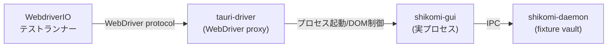

# システムテスト設計書 — shikomi-gui

<!-- feature: shikomi-gui / Issue #90 -->
<!-- 配置先: docs/features/shikomi-gui/system-test-design.md -->
<!-- システムテスト（E2E）はここにのみ記述。sub-feature の test-design.md には IT / UT のみ -->

## 1. テスト戦略概要

本 feature のシステムテストは **tauri-driver（WebDriver プロトコル）** を使用した真のブラックボックス E2E テストで実施する。テストは実際の WebView（WebView2 / WKWebView / WebKitGTK）を起動し、ユーザーが行う DOM 操作（ボタンクリック・フォーム入力・セレクタ選択）を WebDriver 経由で再現する。

**Tauri Commands の直接呼び出し（`invoke` 直接実行）はシステムテストでは禁止**とする。Tauri Commands レベルの検証は sub-feature の結合テスト（`ipc-client/test-design.md`）で行う。

| テストレベル | 担当ファイル | 主な対象 |
|------------|------------|---------|
| E2E（システムテスト）| 本ファイル | GUI 起動〜DOM 操作〜最終状態確認の全体フロー |
| 結合テスト（IT）| `ipc-client/test-design.md` | Tauri Commands ↔ daemon IPC ラウンドトリップ |
| 結合テスト（IT）| `ui/test-design.md` | SolidJS コンポーネントとストアの結合 |
| 結合テスト（IT）| `system-tray/test-design.md` | トレイイベント処理の統合動作 |
| ユニットテスト（UT）| 各 sub-feature の test-design.md | 単体関数・型の契約検証 |

**採用ツール選定根拠**:

| 要素 | 採用 | 根拠 |
|------|------|------|
| E2E テストランナー | **`WebdriverIO` v9+** | Tauri v2 公式推奨。`tauri-driver` との公式統合ガイドあり。出典: https://v2.tauri.app/develop/tests/webdriver/ |
| WebDriver プロキシ | **`tauri-driver`** | Tauri v2 公式。GUI プロセスを WebDriver セッションとして制御。`cargo install tauri-driver` で導入 |
| ヘッドレス実行（Linux CI）| **Xvfb** | WebView2/WKWebView は OSX/Windows でネイティブ動作。Linux CI は `Xvfb :1` + `DISPLAY=:1` で WebKitGTK を制御 |

出典: https://v2.tauri.app/develop/tests/webdriver/

## 2. E2E テストケース

### TC-GUI-E01: GUI 起動 → daemon 接続 → エントリ一覧表示 + 保護モードバナー

| 項目 | 内容 |
|------|------|
| テスト ID | TC-GUI-E01 |
| 対応要件 | R1-GUI-01, R1-GUI-02, R1-GUI-04 |
| 対応受入基準 | AC-GUI-01 |
| 前提 | daemon が fixture vault.db で起動済み |
| 操作手順 | ① GUI を起動する ② ウィンドウが表示されるまで待機 ③ エントリ一覧テーブルの表示を確認 ④ 画面上部保護モードバナーを確認 |
| 期待結果 | エントリ一覧が表示される。バナーに `[平文]` が表示される |
| CI 実行 | `test-gui.yml`（Ubuntu: Xvfb / macOS: ネイティブ / Windows: ネイティブ） |

### TC-GUI-E02: daemon 未起動時のエラー通知表示

| 項目 | 内容 |
|------|------|
| テスト ID | TC-GUI-E02 |
| 対応要件 | R1-GUI-02, R1-GUI-03 |
| 前提 | daemon が起動していない |
| 操作手順 | ① daemon を起動せずに GUI を起動 ② エラーパネルの表示を確認 ③ 「追加」ボタンの状態を確認 |
| 期待結果 | 「daemon が起動していません」メッセージが表示される。「追加」ボタンが無効化（`disabled`）されている |
| CI 実行 | `test-gui.yml`（daemon なし） |

### TC-GUI-E03: エントリ追加 → 一覧反映

| 項目 | 内容 |
|------|------|
| テスト ID | TC-GUI-E03 |
| 対応要件 | R1-GUI-05 |
| 対応受入基準 | AC-GUI-02 |
| 前提 | TC-GUI-E01 環境 |
| 操作手順 | ①「追加」ボタンをクリック ② ラベル入力欄に「e2e-test」と入力 ③ 値入力欄に「hello-e2e」と入力 ④「送信」ボタンをクリック ⑤ 一覧テーブルを確認 |
| 期待結果 | 一覧に「e2e-test」が表示される |
| CI 実行 | `test-gui.yml` |

### TC-GUI-E04: エントリ編集 → 一覧更新

| 項目 | 内容 |
|------|------|
| テスト ID | TC-GUI-E04 |
| 対応要件 | R1-GUI-06 |
| 対応受入基準 | AC-GUI-02 |
| 前提 | TC-GUI-E03 でエントリ「e2e-test」が存在する |
| 操作手順 | ① 「e2e-test」行の「編集」ボタンをクリック ② ラベル入力欄を「e2e-edited」に変更 ③「保存」ボタンをクリック ④ 一覧テーブルを確認 |
| 期待結果 | 「e2e-edited」に更新されている |
| CI 実行 | `test-gui.yml` |

### TC-GUI-E05: エントリ削除確認ダイアログ → 削除実行

| 項目 | 内容 |
|------|------|
| テスト ID | TC-GUI-E05 |
| 対応要件 | R1-GUI-07 |
| 対応受入基準 | AC-GUI-02 |
| 前提 | TC-GUI-E03 でエントリが存在する |
| 操作手順 | ① エントリ行の「削除」ボタンをクリック ② 確認ダイアログが表示されることを確認 ③ ダイアログの「削除する」ボタンをクリック ④ 一覧テーブルを確認 |
| 期待結果 | 確認ダイアログが表示される。「削除する」押下後に該当エントリが一覧から消える |
| CI 実行 | `test-gui.yml` |

### TC-GUI-E06: ホットキー割当

| 項目 | 内容 |
|------|------|
| テスト ID | TC-GUI-E06 |
| 対応要件 | R1-GUI-08, R1-GUI-09 |
| 対応受入基準 | AC-GUI-02 |
| 前提 | エントリ「e2e-test」が存在し、ホットキー未割当 |
| 操作手順 | ① エントリ行の「編集」ボタンをクリック ② ホットキーセレクタで「Ctrl+Alt+3」を選択 ③「保存」ボタンをクリック ④ 一覧テーブルを確認 |
| 期待結果 | エントリ行に `[Ctrl+Alt+3]` バッジが表示される |
| CI 実行 | `test-gui.yml` |

### TC-GUI-E07: ホットキー競合エラー表示

| 項目 | 内容 |
|------|------|
| テスト ID | TC-GUI-E07 |
| 対応要件 | R1-GUI-08 |
| 対応受入基準 | AC-GUI-02 |
| 前提 | `Ctrl+Alt+1` が fixture エントリに割当済み |
| 操作手順 | ① 別エントリの「編集」をクリック ② ホットキーセレクタで「Ctrl+Alt+1」を選択 ③「保存」ボタンをクリック ④ エラー表示を確認 |
| 期待結果 | 「`Ctrl+Alt+1` は別エントリに割り当て済みです」旨のエラーメッセージが表示される |
| CI 実行 | `test-gui.yml` |

### TC-GUI-E08: vault 暗号化オプトイン → recovery 24 語受信 → 転記確認ブロック

| 項目 | 内容 |
|------|------|
| テスト ID | TC-GUI-E08 |
| 対応要件 | R1-GUI-04, R1-GUI-10, R1-GUI-11 |
| 対応受入基準 | AC-GUI-03 |
| 前提 | vault が平文モード |
| 操作手順 | ① 設定 → 暗号化セクション → 「暗号化を有効にする」をクリック ② パスワード入力欄に強度 ≥ 3 のパスワードを入力 ③ 強度メーターと Feedback の表示を確認 ④「暗号化」ボタンをクリック ⑤ recovery 24 語画面を確認 ⑥「転記完了」ボタンが活性化する前に操作できないことを確認 ⑦「転記完了」をクリック |
| 期待結果 | recovery 24 語が表示される。「転記完了」前は次の操作がブロックされる。完了後バナーが `[暗号化済・ロック中]` に更新される |
| CI 実行 | `test-gui.yml` |

### TC-GUI-E09: vault 復号 → チェックボックス 2 ステップ確認

| 項目 | 内容 |
|------|------|
| テスト ID | TC-GUI-E09 |
| 対応要件 | R1-GUI-12 |
| 対応受入基準 | AC-GUI-04 |
| 前提 | vault が暗号化アンロック済み状態（TC-GUI-E08 + Unlock 実施済み） |
| 操作手順 | ① 設定 → 暗号化セクション → 「暗号化を解除する」をクリック ② マスターパスワード入力 ③ 確認チェックボックスの状態を確認（未チェック時「解除する」ボタンが無効） ④ チェックボックスをチェック ⑤ 「解除する」ボタンをクリック |
| 期待結果 | チェックボックス未チェック時「解除する」ボタンが無効（`disabled`）。チェック後に有効化。実行後バナーが `[平文]` に更新される |
| CI 実行 | `test-gui.yml` |

### TC-GUI-E10: vault ロック中書き込み操作 → アンロックモーダル表示

| 項目 | 内容 |
|------|------|
| テスト ID | TC-GUI-E10 |
| 対応要件 | R1-GUI-13 |
| 前提 | vault が暗号化ロック状態（`ProtectionModeBanner::EncryptedLocked`） |
| 操作手順 | ①「追加」ボタンをクリック ② 表示を確認 |
| 期待結果 | アンロック入力モーダルが表示される。バナーに `[暗号化済・ロック中]` が表示されている |
| CI 実行 | `test-gui.yml` |

### TC-GUI-E11: CSP 違反スクリプトの実行阻止

| 項目 | 内容 |
|------|------|
| テスト ID | TC-GUI-E11 |
| 対応要件 | R1-GUI-17 |
| 前提 | GUI が起動済み |
| 操作手順 | ① WebDriver 経由で JavaScript `eval('1+1')` の実行を試みる ② ブラウザコンソールエラーを確認 |
| 期待結果 | CSP 違反エラーが記録され、スクリプトの実行が拒否される（`unsafe-eval` が有効でないことの確認） |
| CI 実行 | `test-gui.yml` |

### TC-GUI-E12: インストーラ生成確認（Sub-E で実装）

| 項目 | 内容 |
|------|------|
| テスト ID | TC-GUI-E12 |
| 対応要件 | R1-GUI-16 |
| 対応受入基準 | AC-GUI-05 |
| 手順 | 各 OS ランナーで `cargo tauri build` を実行 |
| 期待結果 | Windows: `.msi` / `.exe` 生成 / macOS: `.dmg` 生成 / Linux: `.deb` + `.AppImage` 生成 |
| CI 実行 | `test-gui-bundle.yml`（Sub-E #98 で実装） |

## 3. 手動受入テスト（CI 自動化不可領域）

| AC | 対象 OS | 確認内容 |
|----|--------|---------|
| AC-GUI-06 | 全 OS | ウィンドウを閉じてもシステムトレイにアイコンが残り、プロセスが終了しない |
| AC-GUI-07 | 全 OS | ホットキー押下後 30 秒以内にトレイアイコンにカウントダウン数字が表示される |
| AC-GUI-08 | Windows | NSIS インストーラでインストール → `shikomi gui` が起動する |
| AC-GUI-09 | macOS | DMG マウント → Applications フォルダへコピー → Gatekeeper 警告なし |
| AC-GUI-10 | Linux | AppImage をダブルクリックで起動できる |

## 4. CI ワークフロー対応方針

- `test-gui.yml` を新規追加（TC-GUI-E01〜E11 を Ubuntu / macOS / Windows の 3 ランナーで実行）
  - Ubuntu: `Xvfb :1 &` を先行起動し `DISPLAY=:1` で WebKitGTK を制御
  - macOS / Windows: ネイティブ WebView（GUI は`--no-sandbox` 不要）
  - `tauri-driver` を CI 開始前に `cargo install tauri-driver` でインストール
  - daemon は fixture vault.db（`tests/fixtures/gui_e2e_vault.db`）を使用して別プロセスで起動
- `TC-GUI-E12`（bundler CI）は Sub-E #98 の `test-gui-bundle.yml` で実装

## 5. 外部 I/O 依存マップ

各 TC で何を実体使用し、何をモック / スタブに置き換えるかを明示する。

| 外部 I/O | TC-GUI-E01〜E10 | TC-GUI-E11 | TC-GUI-E12 |
|---------|---------------|-----------|-----------|
| **WebView（DOM）** | **実体使用**（tauri-driver で制御） | **実体使用** | 不使用 |
| **daemon IPC** | **実体使用**（fixture vault で別プロセス起動） | 実体使用 | 不使用 |
| **OS クリップボード** | 不使用 | 不使用 | 不使用 |
| **OS ホットキー** | 不使用（GUI 操作でホットキー登録のみ確認） | 不使用 | 不使用 |
| **OS トレイ** | TC-GUI-E10 以外: 不使用（TC-GUI-E10 は起動確認のみ） | 不使用 | 不使用 |
| **tauri-bundler** | 不使用 | 不使用 | **実体使用** |
| **fixture vault.db** | `tests/fixtures/gui_e2e_vault.db`（エントリ 2 件、ホットキー `ctrl+alt+1` 割当済） | 同左 | 不使用 |
| **fixture vault（暗号化）** | TC-GUI-E08〜E10: `gui_e2e_encrypted_vault.db` | 不使用 | 不使用 |

## 6. 要件 → TC トレーサビリティマトリクス

| 要件 ID | 対応 TC | テストレベル | 網羅状態 |
|---------|--------|------------|---------|
| R1-GUI-01 | TC-GUI-E01 | E2E | ✅ |
| R1-GUI-02 | TC-GUI-E01, TC-GUI-E02 | E2E | ✅ |
| R1-GUI-03 | TC-GUI-E02 | E2E | ✅ |
| R1-GUI-04 | TC-GUI-E01, TC-GUI-E08 | E2E | ✅ |
| R1-GUI-05 | TC-GUI-E03 | E2E | ✅ |
| R1-GUI-06 | TC-GUI-E04 | E2E | ✅ |
| R1-GUI-07 | TC-GUI-E05 | E2E | ✅ |
| R1-GUI-08 | TC-GUI-E06, TC-GUI-E07 | E2E | ✅ |
| R1-GUI-09 | TC-GUI-E06 | E2E | ✅ |
| R1-GUI-10 | TC-GUI-E08 | E2E | ✅ |
| R1-GUI-11 | TC-GUI-E08 | E2E | ✅ |
| R1-GUI-12 | TC-GUI-E09 | E2E | ✅ |
| R1-GUI-13 | TC-GUI-E10 | E2E | ✅ |
| R1-GUI-14 | AC-GUI-06 | 手動 | ✅ |
| R1-GUI-15 | AC-GUI-07 | 手動 | ✅ |
| R1-GUI-16 | TC-GUI-E12 | E2E (Sub-E) | ✅ |
| R1-GUI-17 | TC-GUI-E11 | E2E | ✅ |
| R1-GUI-18 | `ui/test-design.md` IT | IT | ✅（IT 層で担保） |
| R1-GUI-19 | `ipc-client/test-design.md` IT | IT | ✅（IT 層で担保） |
