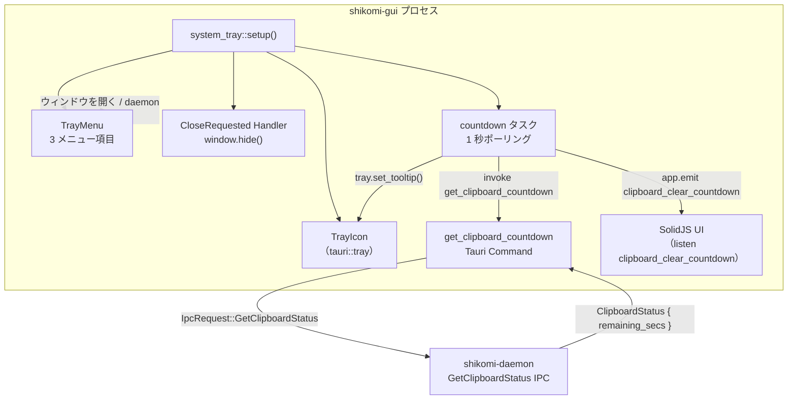

# 基本設計書 — system-tray（shikomi-gui）

<!-- feature: shikomi-gui / sub-feature: system-tray / Issue #97 -->
<!-- 配置先: docs/features/shikomi-gui/system-tray/basic-design.md -->
<!-- 疑似コード・実装コードブロック禁止 -->
<!-- 参照: docs/features/shikomi-gui/feature-spec.md（凍結済み）-->
<!-- 参照: docs/features/shikomi-gui/ipc-client/basic-design.md（Sub-B 凍結済み）-->
<!-- 参照: docs/features/shikomi-gui/ipc-client/detailed-design.md §2.3（ipc_code 凍結 API 契約）-->

## §モジュール契約（機能要件マッピング）

| 要件 ID | 契約 |
|---------|------|
| REQ-TRAY-01 | Tauri v2 `TrayIconBuilder` でシステムトレイアイコンを常駐させる。アプリ起動時に自動配置し、プロセス終了まで除去しない（R1-GUI-14） |
| REQ-TRAY-02 | `WebviewWindow::on_window_event` の `CloseRequested` イベントを `prevent_default()` で阻止し、ウィンドウを `.hide()` してトレイ常駐に切り替える。明示的な「終了」操作のみ `AppHandle::exit(0)` でプロセスを終了する（R1-GUI-14） |
| REQ-TRAY-03 | トレイアイコン右クリックメニューに「ウィンドウを開く」「daemon 再起動」「終了」の 3 項目を表示する（UC-GUI-005）。各項目の動作は §2.3 を参照 |
| REQ-TRAY-04 | `get_clipboard_countdown` Tauri Command が `ClipboardStatus { remaining_secs: Option<u64> }` を返す。daemon 側 `GetClipboardStatus` IPC 拡張との契約を §3 に定義する（R1-GUI-15） |
| REQ-TRAY-05 | `countdown` バックグラウンドタスクが 1 秒ごとに `get_clipboard_countdown` を呼び出し、`remaining_secs > 0` の間はトレイアイコンのツールチップを「shikomi — クリップボードを自動消去まで {N} 秒」に更新する。カウントダウンが終了したら「shikomi」に戻す（R1-GUI-15） |
| REQ-TRAY-06 | `countdown` タスクは同時に Tauri イベント `clipboard_clear_countdown` を SolidJS に emit する。SolidJS は本イベントを受信してカウントダウン状態を store に反映できる（R1-GUI-15、将来的なトレイアイコン視覚更新の拡張点） |

---

## 1. モジュール構成

変更対象 crate: **`shikomi-gui`**

```
crates/shikomi-gui/src/
  system_tray/
    mod.rs          ← setup() / close-to-tray イベントハンドラ（REQ-TRAY-01, 02）
    menu.rs         ← TrayMenu 構築 + メニュー項目ハンドラ（REQ-TRAY-03）
    countdown.rs    ← countdown ポーリングタスク（REQ-TRAY-04, 05, 06）
  lib.rs            ← system_tray::setup() 呼び出し追加 / get_clipboard_countdown 登録
  ipc_client/
    commands/
      tray.rs       ← get_clipboard_countdown Tauri Command（REQ-TRAY-04）
```

**追加依存パッケージ**:

| クレート | バージョン | 用途 | 根拠 |
|---------|-----------|------|------|
| `tauri-plugin-shell` | `2` | daemon 再起動: `shikomi start` を Tauri shell plugin 経由で実行 | feature-spec.md スコープ定義。ネイティブ `std::process::Command` より plugin 経由の方が Tauri の権限モデル（CSP / `shell` スコープ許可）に準拠する。出典: https://v2.tauri.app/plugin/shell/ |

**`tauri-plugin-notification` 不採用の根拠**:

OS 通知送信は daemon 側 `notify-rust`（`NotifyRustNotifier`）が担当しており、GUI 側から二重送信する必要がない。`tauri-plugin-notification` を追加すると通知の責務が分散し DRY 原則に違反する。Sub-D で GUI 独自の OS 通知が必要になった場合に限り、別 PR で追加を検討する（YAGNI）。

---

## 2. コンポーネント設計



### 2.1 `system_tray::setup()`

`lib.rs::setup()` フック内から呼び出される初期化関数。以下を行う:

| 処理 | 詳細 |
|------|------|
| トレイアイコン生成 | `TrayIconBuilder::new()` でアイコン・ツールチップ・メニューを設定し `build(app)` |
| ウィンドウ close-to-tray 設定 | `app.get_webview_window("main")` に `on_window_event` ハンドラを登録 |
| countdown タスク起動 | `tauri::async_runtime::spawn` で `countdown::run(app_handle)` を起動 |

**アイコンリソース**: 既存の `icons/32x32.png`（`tauri.conf.json` の `bundle.icon` で定義済み）を使用する。OS 別アイコン解決は `tauri::image::Image::from_path` で行い、プラットフォーム差異を吸収する。

### 2.2 close-to-tray ハンドラ（REQ-TRAY-02）

`WebviewWindow::on_window_event` に登録するクロージャ。

| イベント | 処理 |
|---------|------|
| `WindowEvent::CloseRequested { api, .. }` | `api.prevent_default()` → `window.hide()` |
| その他 | 無視 |

ユーザーが「×」ボタンを押した場合にウィンドウを非表示にし、プロセスはトレイ常駐を継続する。トレイメニューの「終了」のみが `AppHandle::exit(0)` を呼ぶ唯一の終了経路。

### 2.3 トレイメニュー項目（REQ-TRAY-03）

| メニュー項目 | ID | 実行アクション |
|-------------|-----|--------------|
| ウィンドウを開く | `"open_window"` | `app.get_webview_window("main").show()` + `set_focus()` |
| daemon 再起動 | `"restart_daemon"` | `tauri_plugin_shell::process::Command::new("shikomi").args(["start"])` 実行。既存 IPC 接続を切断し `GuiIpcClient::connect()` を再試行する（`AppState` を `None` → `Some` に遷移）|
| 終了 | `"quit"` | `app.exit(0)` |

`TrayIcon` の `on_tray_icon_event` ハンドラで `TrayIconEvent::RightButtonUp` を受け取り、`menu.popup(window)` でメニューを表示する。`MenuEvent` を `TrayMenu::on_menu_event` で受け取り ID で分岐する。

---

## 3. IPC 拡張契約（daemon 側追加実装、Sub-D スコープ）

daemon 側 `crates/shikomi-daemon/src/ipc/v2_handler.rs` と `crates/shikomi-core/src/ipc/` への追加が必要。

### 3.1 新 IPC 型定義

| 型 | 定義場所 | 内容 |
|----|---------|------|
| `IpcRequest::GetClipboardStatus` | `shikomi-core/src/ipc/request.rs` | クリップボード消去カウントダウン残秒を問い合わせる新 variant |
| `IpcResponse::ClipboardStatus { remaining_secs: Option<u64> }` | `shikomi-core/src/ipc/response.rs` | `Some(n)`: 残 n 秒でカウントダウン中 / `None`: カウントダウン非アクティブ |

### 3.2 daemon 側共有状態

`HotkeyEventLoop` 内の `ClearTimer` はプライベートだが、残秒を IPC サーバが読めるように `Arc<Mutex<Option<Instant>>>` 形式の `countdown_started_at` を `HotkeyEventLoop` と `V2Context`（IPC ハンドラコンテキスト）間で共有する。

| フィールド | 型 | 意味 |
|----------|-----|------|
| `countdown_started_at` | `Arc<Mutex<Option<Instant>>>` | Secret エントリ投入時刻。`None` はカウントダウン非アクティブ |

IPC ハンドラは `countdown_started_at` の値から `elapsed()` を計算し、`CLEAR_TIMEOUT_SECS - elapsed < 0` の場合は `None` を返す。

### 3.3 Tauri Command 契約

| Command | 入力 | 出力 | 機能要件 |
|---------|------|------|---------|
| `get_clipboard_countdown` | なし | `ClipboardCountdownResult { remaining_secs: Option<u64> }` | REQ-TRAY-04 |

`AppState` が `None`（daemon 未接続）の場合は `Ok(ClipboardCountdownResult { remaining_secs: None })` を返す（カウントダウン非アクティブ扱い）。エラーを UI に伝搬しない理由: countdown ポーリングの失敗はサイレントに扱い、接続状態表示は既存 `DaemonConnectionPanel` に委ねる（単一責務）。

---

## 4. feature-spec との対応（R1-GUI → REQ-TRAY トレーサビリティ）

| R1-GUI | REQ-TRAY | 実装箇所 |
|--------|----------|---------|
| R1-GUI-14 | REQ-TRAY-01, 02, 03 | `system_tray/mod.rs`, `system_tray/menu.rs`, `lib.rs` |
| R1-GUI-15 | REQ-TRAY-04, 05, 06 | `system_tray/countdown.rs`, `ipc_client/commands/tray.rs` |

---

## 5. UX 設計上の考慮

### 5.1 カウントダウン表示方式の選定

トレイアイコンにカウントダウンを表示する方法として以下を比較した:

| 方式 | 概要 | 採否 |
|------|------|------|
| A. ツールチップ文字列更新 | `tray.set_tooltip("shikomi — クリア残り {N} 秒")` | **採用** |
| B. 動的アイコン画像生成 | 残秒を描画した PNG を毎秒生成して `set_icon()` | 却下 |
| C. バッジ / オーバーレイ | OS バッジ API（macOS `setBadge`）で残秒表示 | 却下 |

**採用理由（A）**: 方式 B は 30 枚の PNG 動的生成が必要で CPU/メモリコストが大きい（YAGNI・KISS）。方式 C は Windows / Linux で未サポート（クロスプラットフォーム一貫性なし）。ツールチップはすべての OS で動作し、実装コストが最小。

**限界の認識**: ツールチップはユーザーがホバーしないと見えない。R1-GUI-15 MVP スコープとして許容する。アイコンアニメーションは別 Issue に先送り（YAGNI）。

### 5.2 daemon 再起動フロー

「daemon 再起動」メニュー操作時の UX: 再起動中はトレイメニューの「daemon 再起動」項目を無効化し、接続が回復したら再有効化する。接続失敗は既存 `DaemonConnectionPanel` に委ねる。`AppState` の遷移は既存 `lib.rs` の初期接続ロジックを再利用する。
