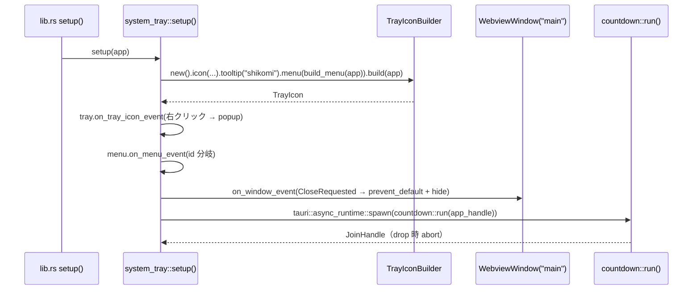
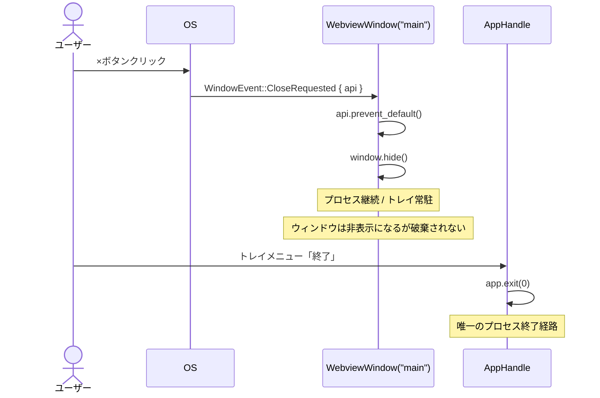
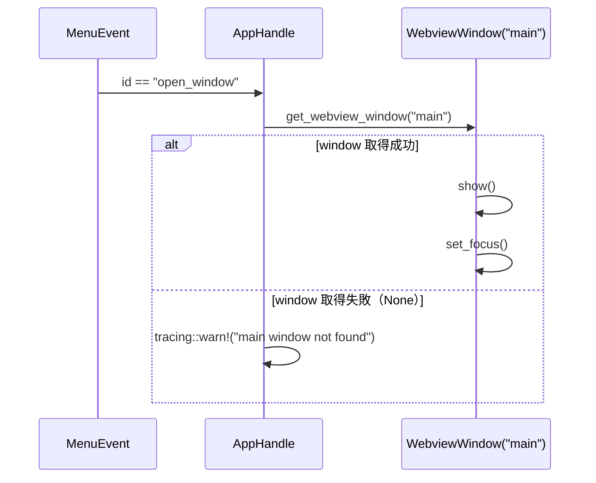
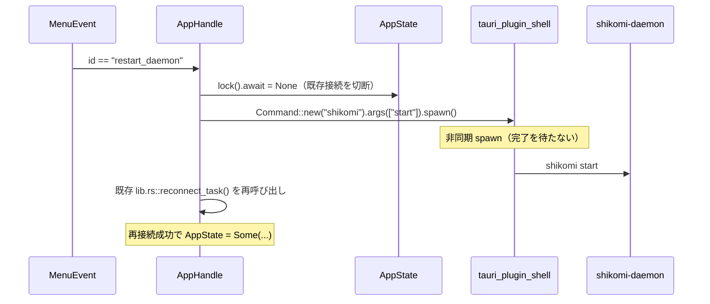
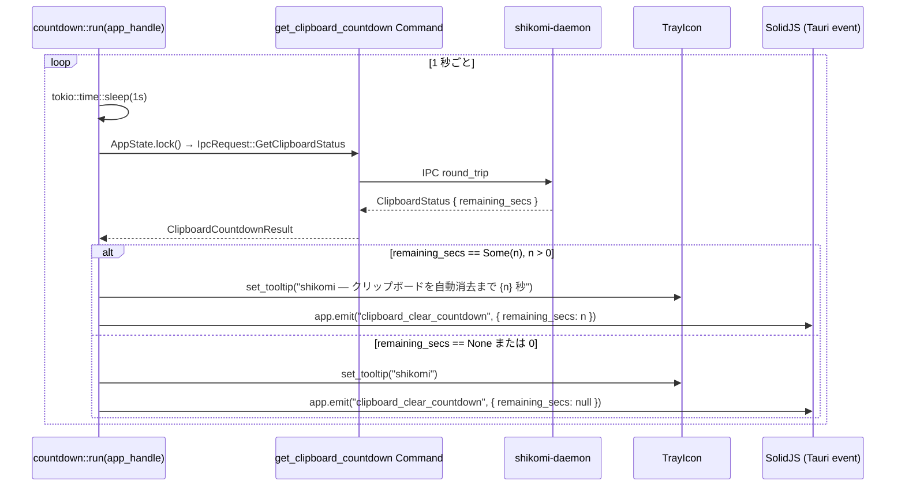

# 詳細設計書 — system-tray（shikomi-gui）

<!-- feature: shikomi-gui / sub-feature: system-tray / Issue #97 -->
<!-- 配置先: docs/features/shikomi-gui/system-tray/detailed-design.md -->
<!-- 疑似コード・実装コードブロック禁止 -->
<!-- 参照: docs/features/shikomi-gui/system-tray/basic-design.md -->
<!-- 参照: docs/features/shikomi-gui/ipc-client/basic-design.md（Sub-B 凍結済み）-->
<!-- 参照: docs/features/shikomi-gui/ipc-client/detailed-design.md §1〜2 -->
<!-- 参照: docs/features/shikomi-gui/feature-spec.md（凍結済み）-->

---

## 1. `system_tray::setup()` フロー

`setup()` は `tauri::Result<()>` を返す。`TrayIconBuilder::build` 失敗は Fail Fast（`setup()` から即エラーを返し Tauri ランタイムを停止させる）。

---

## 2. close-to-tray ハンドラ詳細（REQ-TRAY-02）

**注意事項**:

- `window.hide()` はウィンドウを非表示にするが `WebviewWindow` は破棄されない。再表示は `window.show()` + `window.set_focus()` で即時可能（再初期化コストなし）
- macOS の Dock アイコンクリックによる再表示は `WindowEvent::Focused` または `app_handle` 経由の `show()` で対応する（macOS 固有実装、詳細は §6 プラットフォーム差異を参照）
- `CloseRequested` ハンドラ内で **`app.exit(0)` を呼ばないこと**。close-to-tray と明示終了の経路が交差して意図しない終了が発生する

---

## 3. トレイメニュー項目詳細（REQ-TRAY-03）

### 3.1 `build_menu(app)` の構成

| 順序 | MenuItem ID | ラベル | 種別 |
|------|------------|--------|------|
| 1 | `"open_window"` | 「ウィンドウを開く」 | `MenuItem` |
| 2 | — | （セパレータ） | `PredefinedMenuItem::separator` |
| 3 | `"restart_daemon"` | 「daemon を再起動する」 | `MenuItem` |
| 4 | — | （セパレータ） | `PredefinedMenuItem::separator` |
| 5 | `"quit"` | 「終了」 | `MenuItem` |

### 3.2 各 MenuEvent ハンドラ詳細

#### `"open_window"` ハンドラ

#### `"restart_daemon"` ハンドラ

**`tauri-plugin-shell` スコープ許可**: `tauri.conf.json` の `plugins.shell.scope` に `{ "name": "shikomi", "cmd": "shikomi", "args": [{ "validator": "start|stop" }] }` を追加する。CSP 違反を起こさない最小スコープに限定する（R1-GUI-17）。

#### `"quit"` ハンドラ

1. `AppHandle::exit(0)` を呼び出す
2. Tauri ランタイムが各ウィンドウを `destroy` し、`AppState` 内 `GuiIpcClient` の `Drop` が実行されてソケットを閉じる（RAII）

---

## 4. countdown タスク詳細（REQ-TRAY-04, 05, 06）

### 4.1 ポーリングループ

### 4.2 エラーハンドリング

| ケース | 処理 |
|--------|------|
| `AppState` が `None`（daemon 未接続） | `ClipboardCountdownResult { remaining_secs: None }` とみなす（エラー伝搬なし）|
| IPC 通信エラー | `tracing::debug!` でログのみ。ツールチップ・SolidJS イベントは前回状態を維持（polling failure = 非アクティブ扱いは過剰 reset のリスクがある）|
| タスク panic | Tauri ランタイムが spawn タスクの panic を検知しないため、`catch_unwind` で囲み panic をログして継続する（countdown タスクの死がアプリ全体を止めない）|

### 4.3 タスクライフサイクル

`countdown::run()` は `setup()` から spawn された後、アプリ終了まで継続するインフィニットループ。`AppHandle` の weak 参照を使い、ランタイム終了後の `emit` エラーをサイレントに無視する。

---

## 5. `get_clipboard_countdown` Tauri Command 詳細（REQ-TRAY-04）

### 5.1 Command シグネチャと型

| フィールド | 型 | 説明 |
|-----------|-----|------|
| `ClipboardCountdownResult.remaining_secs` | `Option<u64>` | `Some(n)`: 残 n 秒 / `None`: 非アクティブ |

**シリアライズ**: `#[derive(Serialize)]` で `{ "remaining_secs": 15 }` または `{ "remaining_secs": null }` として SolidJS に渡る。`GUIError` は返さない（§4.2 理由）。

### 5.2 `AppState` 未接続時の挙動

daemon 未接続（`AppState == None`）の場合、IPC 呼び出しをスキップして即 `{ remaining_secs: null }` を返す。これは `not_connected` エラーを UI に見せないためのサイレントフォールバック。countdown 用の軽量ポーリングがエラーパネルを誘発しないよう設計する。

---

## 6. daemon 側 IPC 拡張詳細（Sub-D スコープ）

### 6.1 共有カウントダウン状態

`crates/shikomi-daemon/src/hotkey/event_loop.rs` の `HotkeyEventLoop` に `countdown_started_at: Arc<Mutex<Option<Instant>>>` フィールドを追加する。

| イベント | 操作 |
|---------|------|
| `RecordKind::Secret` のクリップボード投入成功 | `*countdown_started_at.lock().await = Some(Instant::now())` |
| `ClearTimer` による clipboard clear 完了 | `*countdown_started_at.lock().await = None` |
| `ClearTimer::abort()` （shutdown 時） | `*countdown_started_at.lock().await = None` |

この `Arc<Mutex<Option<Instant>>>` を `IpcServer` に渡し、`V2Context` 経由で `GetClipboardStatus` ハンドラが参照する。

### 6.2 `GetClipboardStatus` ハンドラロジック

| 条件 | `remaining_secs` |
|------|-----------------|
| `countdown_started_at == None` | `None` |
| `elapsed >= CLEAR_TIMEOUT_SECS` | `None`（タイマーが既に発火済み扱い）|
| `elapsed < CLEAR_TIMEOUT_SECS` | `Some(CLEAR_TIMEOUT_SECS - elapsed)` |

`CLEAR_TIMEOUT_SECS` は `shikomi_core::CLEAR_TIMEOUT_SECS`（= 30）を使用する（DRY）。

### 6.3 `IpcRequest` / `IpcResponse` 拡張

`shikomi-core/src/ipc/request.rs` と `response.rs` は `#[non_exhaustive]` 済みのため、新 variant 追加は非破壊変更。

---

## 7. lib.rs 変更点

`run()` 関数の `.setup()` フック内に以下を追加する:

| 追加処理 | 順序 |
|---------|------|
| `app.manage::<AppState>(...)` の既存処理の後に `system_tray::setup(app)?` を呼び出す | daemon 接続の前または後（どちらでも可。countdown タスクは daemon 未接続を `None` で扱うため） |
| `.invoke_handler` に `get_clipboard_countdown` を追加 | 既存 10 コマンドの末尾に追記 |
| `tauri_plugin_shell::init()` を `.plugin()` に追加 | daemon 再起動機能のため |

---

## 8. プラットフォーム差異

| OS | 差異 | 対応 |
|----|------|------|
| **macOS** | Dock アイコンを残すと Dock から「終了」が可能になる。Dock クリックでウィンドウを再表示したいが `AppEvent::Reopen` が必要 | `tauri::RunEvent::Reopen { ... }` を `.run(|_, event|)` クロージャで捕捉し `window.show()` を呼ぶ |
| **macOS** | トレイ右クリックではなく左クリックでメニューが開く挙動が一般的 | `TrayIconEvent::LeftButtonUp` でも `popup()` するハンドラを追加 |
| **Windows** | タスクバー通知領域アイコン。右クリックのみメニュー表示 | `RightButtonUp` のみ対応（左クリックはウィンドウ open とする）|
| **Linux** | X11 / Wayland でのトレイサポートは `libappindicator` 依存 | `tauri` v2 の `tray-icon` feature が `libappindicator` を自動リンク。`Cargo.toml` の `tray-icon` feature は Sub-A 時点で既に有効化済み |
| **Linux（Wayland）** | ツールチップ未サポートの環境がある | `set_tooltip` 呼び出しは best-effort とし、失敗時は `tracing::warn!` のみ（アプリ動作を止めない）|

---

## 9. 定数・ツールチップ文言一覧

| 状態 | ツールチップ文字列 |
|------|-----------------|
| カウントダウン非アクティブ | `"shikomi"` |
| カウントダウン中（残 n 秒） | `"shikomi — クリップボードを自動消去まで {n} 秒"` |

Tauri イベント名（凍結）: `"clipboard_clear_countdown"`

SolidJS イベントペイロード型（凍結）:

| フィールド | 型 | 値 |
|----------|-----|-----|
| `remaining_secs` | `number \| null` | 残秒数 / 非アクティブ時 `null` |
