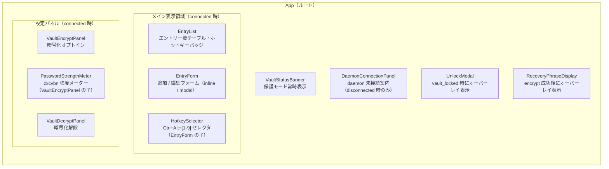
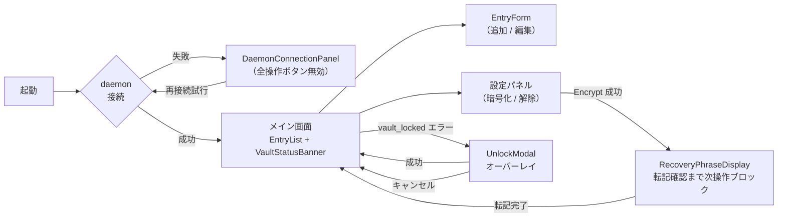

# 基本設計書 — ui（shikomi-gui）

<!-- feature: shikomi-gui / sub-feature: ui / Issue #96 -->
<!-- 配置先: docs/features/shikomi-gui/ui/basic-design.md -->
<!-- 疑似コード・実装コードブロック禁止 -->
<!-- 参照: docs/features/shikomi-gui/feature-spec.md（凍結済み）-->
<!-- 参照: docs/features/shikomi-gui/ipc-client/basic-design.md（Sub-B 凍結済み）-->
<!-- 参照: docs/features/shikomi-gui/ipc-client/detailed-design.md §2.3（ipc_code 凍結 API 契約）-->

## §モジュール契約（機能要件マッピング）

| 要件 ID | 契約 |
|---------|------|
| REQ-UI-01 | `DaemonConnectionPanel` が daemon 未接続時（`kind == "daemon_not_running"` / `"not_connected"` / `"connection_failed"`）に「daemon が起動していません。`shikomi start` を実行してください」を表示し、全操作ボタンを無効化する（R1-GUI-02, R1-GUI-03） |
| REQ-UI-02 | `EntryList` が `list_entries` 呼び出し結果を受け取り、エントリ一覧テーブルとホットキーバッジを表示する（R1-GUI-04） |
| REQ-UI-03 | `VaultStatusBanner` が `ProtectionModeBanner` を常時表示する。`plaintext` → 「[平文]」、`encrypted_locked` → 「[暗号化済・ロック中]」、`encrypted_unlocked` → 「[暗号化済・解除済]」、`unknown` → 「[不明]」（R1-GUI-04） |
| REQ-UI-04 | `EntryForm`（追加モード）がラベル・値・種別の入力フォームを提供する。空ラベル・空値は JS 側で送信前に Fail Fast する。`add_entry` 呼び出し成功後に一覧を更新する（R1-GUI-05, R1-GUI-19） |
| REQ-UI-05 | `EntryForm`（編集モード）が変更なし時は `update_entry` を呼ばない。変更あり時のみ呼び出す（R1-GUI-06、ipc-client `basic-design.md §3.3` Sub-C 契約） |
| REQ-UI-06 | エントリ削除時に確認ダイアログを表示し、確認後に `delete_entry` を呼び出す（R1-GUI-07） |
| REQ-UI-07 | `HotkeySelector` が `Ctrl+Alt+[1-9]` の 9 択セレクタを提供する。`ipc_code == "hotkey_conflict"` 時は `hotkey_conflict_entry` フィールドの値で「`Ctrl+Alt+X` は別エントリ（{競合エントリ名}）に割り当て済みです」を表示する（R1-GUI-08, R1-GUI-09） |
| REQ-UI-08 | `VaultEncryptPanel` + `PasswordStrengthMeter` がマスターパスワード入力と `zxcvbn` 強度評価（score 0〜4）を提供する。score < 3 では「暗号化」ボタンを無効化し `feedback.warning` / `feedback.suggestions` を表示する（R1-GUI-10） |
| REQ-UI-09 | `RecoveryPhraseDisplay` が `encrypt_vault` 成功後に recovery 24 語を表示し、「転記完了」ボタンクリックまで次操作をブロックする。表示後は変数を即 `null` 上書きする（R1-GUI-11, R1-GUI-18） |
| REQ-UI-10 | `VaultDecryptPanel` がチェックボックス（「vault の暗号化を解除します。登録済みのエントリが平文で保存されます」）+ 「解除する」ボタンの 2 ステップ確認を提供する。`confirmed: true` はチェックボックス状態から得る（R1-GUI-12） |
| REQ-UI-11 | `UnlockModal` が `ipc_code == "vault_locked"` 受信時に自動表示され、`unlock_vault` 成功後に元操作を再試行する（R1-GUI-13） |
| REQ-UI-12 | 全入力フォームが JS 側 validation を UX の first line として実施する（空文字・形式チェック等）。Rust 側 Fail Fast との二重防御を構成する（R1-GUI-19） |
| REQ-UI-13 | 全 Tauri Command エラーを `GUIError.kind` で switch し日本語メッセージを表示する。`ipc_code` が存在する場合は専用フィールド（`hotkey_conflict_entry` / `crypto_reason` / `wait_secs`）で補足表示する。`kind == "invalid_input"` の場合は `invalid_input_code` フィールドで switch し日本語変換する。**`message` フィールドのパースおよびユーザーへの表示を禁止する**（ipc-client `detailed-design.md §2.3` 凍結 API 契約）。`invalid_input_code` の安定識別子一覧（凍結）: `"label_empty"` / `"value_empty"` / `"password_empty"` / `"confirmation_required"` / `"id_invalid"` / `"hotkey_invalid"` |
| REQ-UI-14 | 機密変数（マスターパスワード・recovery 24 語）は DOM ref または短命変数経由のみで保持し、Tauri Command 呼び出し直後にゼロ化する。`createSignal` / `createStore` の state への格納を禁止する（R1-GUI-18） |

## 1. モジュール構成

変更対象: **`crates/shikomi-gui/ui/src/`**（Sub-A 骨格を Sub-C で拡張）

```
crates/shikomi-gui/ui/src/
  index.tsx                     ← エントリポイント（既存）
  App.tsx                       ← ルートコンポーネント（Sub-A 骨格 → 画面切替・ストア接続に拡張）
  App.css                       ← グローバルスタイル（既存 → Sub-C で拡張）
  components/
    DaemonConnectionPanel.tsx   ← daemon 未接続案内（REQ-UI-01）
    VaultStatusBanner.tsx       ← 保護モードバナー（REQ-UI-03）
    EntryList.tsx               ← エントリ一覧テーブル + ホットキーバッジ（REQ-UI-02, REQ-UI-06）
    EntryForm.tsx               ← エントリ追加・編集フォーム（REQ-UI-04, REQ-UI-05）
    HotkeySelector.tsx          ← ホットキー割当セレクタ（REQ-UI-07）
    VaultEncryptPanel.tsx       ← 暗号化オプトインパネル（REQ-UI-08）
    PasswordStrengthMeter.tsx   ← zxcvbn 強度メーター（VaultEncryptPanel の子、REQ-UI-08）
    VaultDecryptPanel.tsx       ← 暗号化解除パネル（REQ-UI-10）
    RecoveryPhraseDisplay.tsx   ← recovery 24 語表示（REQ-UI-09）
    UnlockModal.tsx             ← アンロックモーダル（REQ-UI-11）
  store/
    vault.ts                    ← vault 状態・エントリリスト リアクティブストア
  lib/
    ipc.ts                      ← invoke 型付き wrapper
    errors.ts                   ← GUIError.kind / ipc_code → 日本語メッセージ変換（REQ-UI-13）
```

**追加依存パッケージ**（`package.json` に追加）:

| パッケージ | 用途 | 根拠 |
|-----------|------|------|
| `zxcvbn ^4.4` | マスターパスワード強度評価（score 0〜4 + feedback） | feature-spec R1-GUI-10。出典: https://github.com/dropbox/zxcvbn |
| `@types/zxcvbn ^4.4` | TypeScript 型定義 | 上記の型補完 |

### zxcvbn 採用根拠と意思決定記録

**CVE 調査結果**: npm advisory データベース（https://www.npmjs.com/advisories）および NIST NVD 照会（2026-05-11 時点）において、`zxcvbn` に対する既知の CVE は確認されていない。同ライブラリはネットワーク通信・ファイル I/O・OS API を一切使用しない純粋計算ライブラリであり、攻撃サーフェスが極小であることが無脆弱性の主因と評価する。

**9 年間未更新の認識**: 最終公開バージョン 4.4.2（2017 年）以降、本家リポジトリ（https://github.com/dropbox/zxcvbn）は実質メンテナンス停止状態である。新規 PR・Issue への応答がなく、Node.js 依存の更新も行われていない。この事実を採用チームは認識した上で以下の比較を経て採用を決定した。

**`@zxcvbn-ts/core` との比較**:

| 観点 | `zxcvbn ^4.4` | `@zxcvbn-ts/core ^3` |
|------|--------------|----------------------|
| 最終更新 | 2017（9 年前） | 2023（活発）|
| TypeScript ネイティブ | ✗（`@types/zxcvbn` 必要）| ✓（型同梱）|
| score インターフェース | `result.score`（0〜4）| 互換（同一）|
| feedback | `result.feedback.warning/suggestions` | 互換（同一）|
| バンドルサイズ（minified）| 約 383 KB | 約 147 KB（本体のみ）|
| 移行コスト | ゼロ（現状）| import パス変更のみ |

**採用決定**: MVP では `zxcvbn ^4.4` を採用する。理由は以下の通り：

1. **リスクが限定的**: score 表示は UX の補助指標に過ぎず、実際のパスワード強度強制は Rust バックエンドが担う（ipc-client `detailed-design.md §2.3` `crypto_reason: "weak-password"`）。攻撃者が zxcvbn の脆弱性を悪用しても暗号強度に直接影響しない。
2. **API 互換性**: 将来 `@zxcvbn-ts/core` へ移行する際の変更コストは import パス変更のみ。移行リスクが低い。
3. **YAGNI**: `@zxcvbn-ts/core` の追加機能（カスタム辞書・言語対応）は本 MVP では不要。

**移行方針**: Sub-D 以降の Issue で `@zxcvbn-ts/core` への移行を検討する。現時点でのリスク評価は「低」。

## 2. コンポーネント設計

### 2.1 コンポーネント階層



### 2.2 画面遷移



## 3. Sub-B IPC API との接続方針

本 sub-feature（ui）は Sub-B（ipc-client）の Tauri Commands のみを通じて daemon と通信する。UI コンポーネントが直接 `window.__TAURI__.invoke` を呼び出す場合、`lib/ipc.ts` の型付き wrapper を必ず経由する。

### 3.1 Command → コンポーネント対応

| Tauri Command | 呼び出しコンポーネント | 用途 |
|---|---|---|
| `list_entries` | `App`（初期化・更新時）| エントリ一覧 + vault 状態取得 |
| `get_vault_status` | `App`（起動時軽量確認）| vault 状態のみ取得（エントリ不要時）|
| `add_entry` | `EntryForm`（追加モード）| エントリ追加 |
| `update_entry` | `EntryForm`（編集モード）| エントリ編集（変更あり時のみ呼出） |
| `delete_entry` | `EntryList` | エントリ削除 |
| `assign_hotkey` | `HotkeySelector` | ホットキー割当 |
| `remove_hotkey` | `HotkeySelector` | ホットキー解除 |
| `encrypt_vault` | `VaultEncryptPanel` | vault 暗号化 |
| `decrypt_vault` | `VaultDecryptPanel` | vault 復号 |
| `unlock_vault` | `UnlockModal` | vault アンロック |

### 3.2 エラーハンドリング方針（`lib/errors.ts` 一元変換）

`errors.ts` が `GUIError.kind` / `ipc_code` → 日本語メッセージ変換の単一責務を持つ。各コンポーネントはこのモジュール経由でのみメッセージを取得する。**`message` フィールドをユーザーに表示してはならない**（ipc-client `detailed-design.md §2.2`）。

| `kind` | `ipc_code` / 補足フィールド | 表示場所 | 日本語メッセージ |
|--------|---------------------------|---------|----------------|
| `daemon_not_running` | — | `DaemonConnectionPanel` | 「daemon が起動していません。`shikomi start` を実行してください」 |
| `not_connected` | — | インラインエラー | 「接続が切断されました。アプリを再起動してください」 |
| `ipc_error` | `vault_locked` | `UnlockModal`（自動表示） | — （モーダル表示がメッセージ代替） |
| `ipc_error` | `hotkey_conflict` + `hotkey_conflict_entry` | `HotkeySelector` インライン | 「`Ctrl+Alt+X` は別エントリ（`{hotkey_conflict_entry}`）に割り当て済みです」 |
| `ipc_error` | `crypto` + `crypto_reason == "wrong-password"` | フォームインライン | 「パスワードが一致しません」 |
| `ipc_error` | `crypto` + `crypto_reason == "weak-password"` | `VaultEncryptPanel` インライン | 「パスワードが脆弱すぎます」 |
| `ipc_error` | `crypto` + `crypto_reason == "nonce-limit-exceeded"` | エラーダイアログ | 「vault の再暗号化が必要です。`shikomi vault rekey` を実行してください」 |
| `ipc_error` | `backoff_active` + `wait_secs` | `UnlockModal` インライン | 「試行回数の上限に達しました。`{wait_secs}` 秒後に再試行してください」 |
| `ipc_error` | `recovery_required` | `UnlockModal` インライン | 「パスワードによるアンロックができません。recovery 語でアンロックしてください（Sub-D 対応予定）」 |
| `invalid_input` | `invalid_input_code`（構造化フィールド） | 操作元フォームインライン | `invalid_input_code` で switch した日本語（`errors.ts` マッピング表）。**`message` パース禁止**（詳細: `detailed-design/ux-and-visual.md §6`）|

## 4. feature-spec との対応（R1-GUI → REQ-UI トレーサビリティ）

| R1-GUI | REQ-UI | 実装コンポーネント |
|--------|--------|--------------------|
| R1-GUI-02 | REQ-UI-01 | `DaemonConnectionPanel` |
| R1-GUI-03 | REQ-UI-01 | `DaemonConnectionPanel` |
| R1-GUI-04 | REQ-UI-02, REQ-UI-03 | `EntryList`, `VaultStatusBanner` |
| R1-GUI-05 | REQ-UI-04 | `EntryForm`（追加モード）|
| R1-GUI-06 | REQ-UI-05 | `EntryForm`（編集モード）|
| R1-GUI-07 | REQ-UI-06 | `EntryList`（削除確認）|
| R1-GUI-08 | REQ-UI-07 | `HotkeySelector` |
| R1-GUI-09 | REQ-UI-07 | `HotkeySelector`（9 択セレクタ）|
| R1-GUI-10 | REQ-UI-08 | `VaultEncryptPanel` + `PasswordStrengthMeter` |
| R1-GUI-11 | REQ-UI-09 | `RecoveryPhraseDisplay` |
| R1-GUI-12 | REQ-UI-10 | `VaultDecryptPanel` |
| R1-GUI-13 | REQ-UI-11 | `UnlockModal` |
| R1-GUI-14 | 該当なし — Sub-D（system-tray）スコープ | — |
| R1-GUI-15 | 該当なし — Sub-D（system-tray）スコープ | — |
| R1-GUI-16 | 該当なし — Sub-E（build CI）スコープ | — |
| R1-GUI-17 | 該当なし — Sub-A で `tauri.conf.json` に設定済み | — |
| R1-GUI-18 | REQ-UI-14 | `RecoveryPhraseDisplay`, `VaultEncryptPanel`, `VaultDecryptPanel`, `UnlockModal` |
| R1-GUI-19 | REQ-UI-04, REQ-UI-12 | `EntryForm`, `HotkeySelector`, 全入力フォーム |
