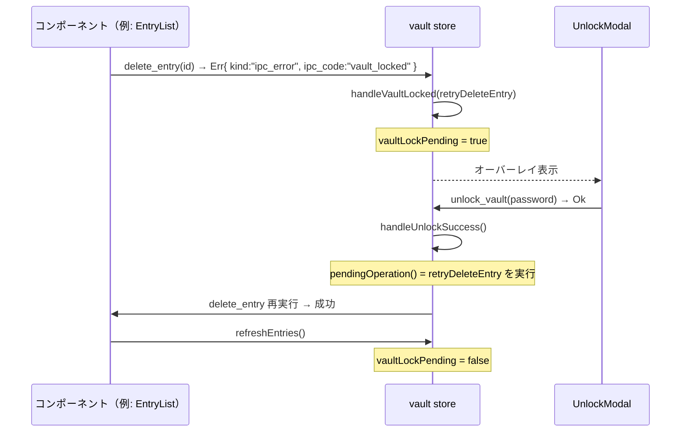

# 詳細設計書 — ui（shikomi-gui）

<!-- feature: shikomi-gui / sub-feature: ui / Issue #96 -->
<!-- 配置先: docs/features/shikomi-gui/ui/detailed-design.md -->
<!-- 疑似コード・実装コードブロック禁止 -->
<!-- 参照: docs/features/shikomi-gui/ui/basic-design.md -->
<!-- 参照: docs/features/shikomi-gui/ipc-client/detailed-design.md §2.3 -->
<!-- 参照: docs/features/shikomi-gui/feature-spec.md（凍結済み）-->

## 1. コンポーネント詳細仕様

### 1.1 `App`（ルート）

| 項目 | 内容 |
|------|------|
| 役割 | ルートコンポーネント。daemon 接続状態・vault 状態を `store/vault.ts` で管理し、子コンポーネントへ配布する |
| リアクティブ状態 | `connectionStatus: "connecting" \| "connected" \| "disconnected"` / `activeView: "main" \| "settings"` |
| 初期化フロー | マウント時に `list_entries` を呼び出す → 成功: `connected` に遷移、エントリ + vault 状態をストアに設定 → 失敗（`daemon_not_running` / `not_connected` 等）: `disconnected` に遷移、`DaemonConnectionPanel` を表示 |
| 条件表示 | `connectionStatus == "disconnected"` → `DaemonConnectionPanel` のみ表示。`"connected"` → `VaultStatusBanner` + メイン領域 + 設定パネルタブ。`vaultLockPending == true` → `UnlockModal` オーバーレイ追加 |

### 1.2 `DaemonConnectionPanel`

| 項目 | 内容 |
|------|------|
| 入力（props）| `errorKind: string` — `GUIError.kind` 値 |
| 表示 | `lib/errors.ts` で `errorKind` → 日本語メッセージ変換して表示。「再接続」ボタンが `list_entries` を再試行し成功時に `connected` 遷移 |
| ボタン無効化責務 | 本コンポーネントは案内表示専任。全操作ボタンの無効化は親 `App` が `connectionStatus != "connected"` 判定で行う |

### 1.3 `VaultStatusBanner`

| 項目 | 内容 |
|------|------|
| 入力（props）| `mode: "plaintext" \| "encrypted_locked" \| "encrypted_unlocked" \| "unknown"` |
| 表示文言 | `plaintext` → 「[平文]」 / `encrypted_locked` → 「[暗号化済・ロック中]」 / `encrypted_unlocked` → 「[暗号化済・解除済]」 / `unknown` → 「[不明]」 |
| 配置 | 画面最上部に常時固定表示。`mode` 変化時にリアクティブ更新 |
| 色覚対応 | 文字単独でも状態判別可能な文言（`ProtectionModeBanner.label()` の設計を踏襲、ANSI カラーなし）|

### 1.4 `EntryList`

| 項目 | 内容 |
|------|------|
| 入力（props）| `entries: RecordSummary[]` / `onEdit: (id: string) => void` / `onDelete: (id: string) => void` |
| 表示列 | ラベル / 種別（`text` → 「テキスト」/ `secret` → 「シークレット」）/ ホットキーバッジ（`Ctrl+Alt+X`、未設定時は空欄）/ 操作（編集・削除ボタン）|
| 削除フロー | 削除ボタン押下 → 確認ダイアログ「{ラベル名} を削除しますか？」→ 確認後 `delete_entry(id)` → 成功後 `list_entries` で一覧更新 |
| エラー処理 | `ipc_code == "not_found"` → 「エントリが見つかりません（一覧を更新します）」表示後 `list_entries` 再取得 |

### 1.5 `EntryForm`

| 項目 | 内容 |
|------|------|
| モード | `mode: "add" \| "edit"` |
| 入力（props）| `mode` / `entry?: RecordSummary`（編集時の初期値）/ `onSuccess: () => void` / `onCancel: () => void` |
| フォームフィールド | ラベル（テキスト）/ 値（`<input type="password">` DOM ref、表示切替可）/ 種別（`text` / `secret` セレクト）/ `HotkeySelector`（子コンポーネント） |
| JS 側 validation | ラベル空文字 → 「ラベルを入力してください」フィールド直下表示・送信ブロック。値空文字 → 「値を入力してください」同様 |
| 送信処理（追加）| `add_entry(label, value, kind, hotkey?)` → 成功後 `onSuccess()`。値フィールドの DOM ref を `""` 上書きして即破棄（R1-GUI-18）|
| 送信処理（編集）| 初期値から変更がない場合は `update_entry` を呼ばず `onCancel()` へ（ipc-client §3.3 Sub-C 契約）。変更あり時のみ `update_entry(id, label?, value?)` → 成功後 `onSuccess()`。値フィールドは `invoke` 後即破棄 |

### 1.6 `HotkeySelector`

| 項目 | 内容 |
|------|------|
| 入力（props）| `entryId: string` / `currentHotkey: string \| null` / `onChanged: () => void` |
| 表示 | `Ctrl+Alt+1` 〜 `Ctrl+Alt+9` の 9 択 `<select>` + 「解除」ボタン。現在の割当値を選択状態で初期表示 |
| 割当 | セレクタ変更 → `assign_hotkey(entryId, combo)` → 成功後 `onChanged()` |
| 解除 | 「解除」ボタン → `remove_hotkey(entryId)` → 成功後 `onChanged()` |
| 競合エラー | `ipc_code == "hotkey_conflict"` → `hotkey_conflict_entry` の値を使い「`{combo}` は別エントリ（`{hotkey_conflict_entry}`）に割り当て済みです」をセレクタ直下に表示。`message` は使用しない |

### 1.7 `VaultEncryptPanel`

| 項目 | 内容 |
|------|------|
| 入力（props）| `onEncrypted: (phrases: string[]) => void` |
| フォームフィールド | マスターパスワード（`<input type="password">` DOM ref）/ `PasswordStrengthMeter`（入力変化ごとに評価） |
| ボタン状態 | `zxcvbn` score < 3 → 「暗号化」ボタン `disabled`。score ≥ 3 → 有効 |
| 送信処理 | DOM ref から値を取得 → `encrypt_vault(password)` → 成功後 ref を `""` 上書き → `onEncrypted(phrases)` で親に recovery 24 語と表示を委譲 |
| エラー処理 | `ipc_code == "crypto"` + `crypto_reason == "weak-password"` → 「パスワードが脆弱すぎます」をインライン表示。その他 `crypto` → 汎用暗号エラーダイアログ |

### 1.8 `PasswordStrengthMeter`

| 項目 | 内容 |
|------|------|
| 入力（props）| `password: string`（リアルタイム評価対象）/ `onScore: (score: number) => void` |
| 評価 | `zxcvbn(password)` を呼び出し、`score` / `feedback.warning` / `feedback.suggestions` を利用。空文字の場合は評価なし（score 0 扱い）|
| プログレスバー | score 0〜4 を 5 段階で表示。各ラベル: 0「非常に脆弱」/ 1「脆弱」/ 2「普通」/ 3「強い」/ 4「非常に強い」|
| Feedback 表示 | `feedback.warning` が非空なら警告テキストを表示。`feedback.suggestions` が非空なら改善提案リストを表示（ペルソナ A/C 向け日本語表示は `errors.ts` 外のローカル変換で対応）|
| score 通知 | `onScore(score)` を呼び出し、親 `VaultEncryptPanel` がボタン有効 / 無効を制御する |

### 1.9 `VaultDecryptPanel`

| 項目 | 内容 |
|------|------|
| 入力（props）| `onDecrypted: () => void` |
| フォームフィールド | マスターパスワード（DOM ref）/ チェックボックス（「vault の暗号化を解除します。登録済みのエントリが平文で保存されます」） |
| ボタン状態 | チェックボックス未チェック → 「解除する」ボタン `disabled` |
| 送信処理 | DOM ref から値を取得 → `decrypt_vault(password, confirmed: true)` → 成功後 ref を `""` 上書き → `onDecrypted()` |
| エラー処理 | `ipc_code == "crypto"` + `crypto_reason == "wrong-password"` → 「パスワードが一致しません」をフォーム直下に表示 |

### 1.10 `UnlockModal`

| 項目 | 内容 |
|------|------|
| 表示トリガー | 任意の Tauri Command が `ipc_code == "vault_locked"` を返した場合に親 `App` が `vaultLockPending = true` をセット → オーバーレイ表示 |
| 入力（props）| `onUnlocked: () => void` / `onCancel: () => void` |
| フォームフィールド | マスターパスワード（DOM ref） |
| 送信処理 | `unlock_vault(password)` → 成功後 ref を `""` 上書き → `onUnlocked()` で親が元操作を再試行する |
| エラー処理 | `ipc_code == "crypto"` + `crypto_reason == "wrong-password"` → 「パスワードが一致しません」をインライン表示 / `ipc_code == "backoff_active"` → 「試行回数の上限に達しました。`{wait_secs}` 秒後に再試行してください」/ `ipc_code == "recovery_required"` → 「recovery 語でアンロックしてください（Sub-D 対応予定）」|

### 1.11 `RecoveryPhraseDisplay`

| 項目 | 内容 |
|------|------|
| 表示トリガー | `VaultEncryptPanel` が `onEncrypted(phrases)` を呼び出すことで親 `App` がオーバーレイ表示 |
| 入力（props）| `phrases: string[]`（24 語）/ `onConfirmed: () => void` |
| 表示形式 | 24 語を番号付きで 4×6 または 3×8 グリッドに表示 |
| 確認フロー | 「転記完了」ボタン押下 → `onConfirmed()` → 親がフラグを `false` にリセット → **コンポーネントがマウント解除され `phrases` 参照が消える** |
| 機密変数扱い | 親 `App` は `onEncrypted(phrases)` を受け取った直後に自身の変数を `null` 上書きし、`RecoveryPhraseDisplay` の props 経由でのみ保持させる（R1-GUI-18）|

---

## 2. リアクティブストア設計（`store/vault.ts`）

### 2.1 状態構造

| 状態フィールド | 型 | 説明 |
|---|---|---|
| `connectionStatus` | `"connecting" \| "connected" \| "disconnected"` | daemon 接続状態 |
| `entries` | `RecordSummary[]` | エントリ一覧（`list_entries` 最終結果） |
| `vaultMode` | `"plaintext" \| "encrypted_locked" \| "encrypted_unlocked" \| "unknown"` | 保護モード |
| `vaultLockPending` | `boolean` | `vault_locked` エラーを受けて `UnlockModal` 表示中 |
| `pendingOperation` | `(() => Promise<void>) \| null` | `UnlockModal` 解除後に再試行する操作 |

### 2.2 ストア操作

| 操作 | トリガー | 副作用 |
|------|---------|-------|
| `refreshEntries()` | 追加・編集・削除・アンロック成功後 | `list_entries` 呼び出し → `entries` + `vaultMode` 更新 |
| `handleVaultLocked(operation)` | 任意 Command が `vault_locked` を返した時 | `pendingOperation` にセット、`vaultLockPending = true` |
| `handleUnlockSuccess()` | `unlock_vault` 成功後 | `pendingOperation()` 再試行、`vaultLockPending = false`、`refreshEntries()` |
| `handleDisconnect()` | `connection_failed` / `not_connected` 受信時 | `connectionStatus = "disconnected"` |

---

## 3. vault_locked フロー詳細

---

## 4. 機密情報ライフサイクル（R1-GUI-18）

JS 側での機密値の扱いは以下に従う。**`createSignal` / `createStore` の state に機密値を格納してはならない**（デバッグツール経由のメモリ読出しリスク）。

| コンポーネント | 機密フィールド | 取得方法 | 破棄タイミング |
|---|---|---|---|
| `VaultEncryptPanel` | マスターパスワード | `<input>` DOM ref | `invoke` 呼び出し直後に `ref.value = ""` |
| `VaultDecryptPanel` | マスターパスワード | DOM ref | `invoke` 呼び出し直後に `ref.value = ""` |
| `UnlockModal` | マスターパスワード | DOM ref | `invoke` 呼び出し直後に `ref.value = ""` |
| `RecoveryPhraseDisplay` | recovery 24 語 | props 経由（`phrases: string[]`） | コンポーネントのマウント解除時に自動消失。親は渡した直後に自身の変数を `null` 上書き |

---

## 5. `zxcvbn` 強度評価仕様（R1-GUI-10）

`zxcvbn(password)` の出力オブジェクトから以下を使用する。

| 出力フィールド | 用途 |
|---|---|
| `score` (0〜4) | プログレスバー + ボタン有効 / 無効制御 |
| `feedback.warning` (string) | 警告テキスト表示（非空時のみ） |
| `feedback.suggestions` (string[]) | 改善提案リスト表示（非空時のみ） |

| `score` | 強度ラベル | 「暗号化」ボタン |
|---------|-----------|--------------|
| 0 | 非常に脆弱 | disabled |
| 1 | 脆弱 | disabled |
| 2 | 普通 | disabled |
| 3 | 強い | **enabled** |
| 4 | 非常に強い | **enabled** |

**スコア閾値の根拠**: `zxcvbn` の score ≥ 3 は "safely unguessable" に相当（出典: https://github.com/dropbox/zxcvbn#readme）。feature-spec R1-GUI-10 の「強度 ≥ 3 でボタン有効化」と整合。

---

## 6. `lib/errors.ts` — エラー変換責務

`errors.ts` が `GUIError` オブジェクトを受け取り、Sub-C が表示すべき日本語メッセージ（または `null`、制御フロー用エラー種別）を返す単一変換モジュール。

| 入力 | 戻り値の種類 | 備考 |
|------|------------|------|
| `{ kind: "daemon_not_running" }` | 日本語文字列 | 「daemon が起動していません…」 |
| `{ kind: "ipc_error", ipc_code: "vault_locked" }` | 制御フロー信号 | コンポーネントは `UnlockModal` 表示に切り替える |
| `{ kind: "ipc_error", ipc_code: "hotkey_conflict", hotkey_conflict_entry: "..." }` | 日本語文字列 | 競合エントリ名を文字列補間 |
| `{ kind: "ipc_error", ipc_code: "crypto", crypto_reason: "..." }` | 日本語文字列 | `crypto_reason` で分岐 |
| `{ kind: "ipc_error", ipc_code: "backoff_active", wait_secs: N }` | 日本語文字列 | `wait_secs` を文字列補間 |
| `{ kind: "invalid_input" }` | 日本語文字列 | `message` の内容から変換（`errors.ts` 内マッピング表）|

**`message` フィールドを戻り値に含めてはならない**。`errors.ts` が変換責務を一手に担い、コンポーネントは変換後の文字列のみを受け取る。

---

## 7. UX 上の考慮

### 7.1 ペルソナ A/C への配慮

田中俊介（ペルソナ A）・佐々木健二（ペルソナ C）はいずれも技術知識不要層。以下を遵守する:
- 英語技術文字列（`message` フィールド・UUID・エラーコード等）を画面に表示しない
- 「vault」「IPC」等の技術用語は「shikomi のデータ」「パスワード保護」等の平易表現に言い換える
- エラー回復方法（「`shikomi start` を実行してください」等）を必ず添えて表示する

### 7.2 MVP 非スコープ

| 項目 | 理由 |
|------|------|
| アクセシビリティ（WCAG 2.1 AA / `aria-*`）| feature-spec §6 で別 Issue 扱いと確定 |
| i18n / 多言語対応 | feature-spec §4（MVP は日本語 UI のみ）|
| ダーク / ライトモード切替 | feature-spec §6 MVP 後回し |
