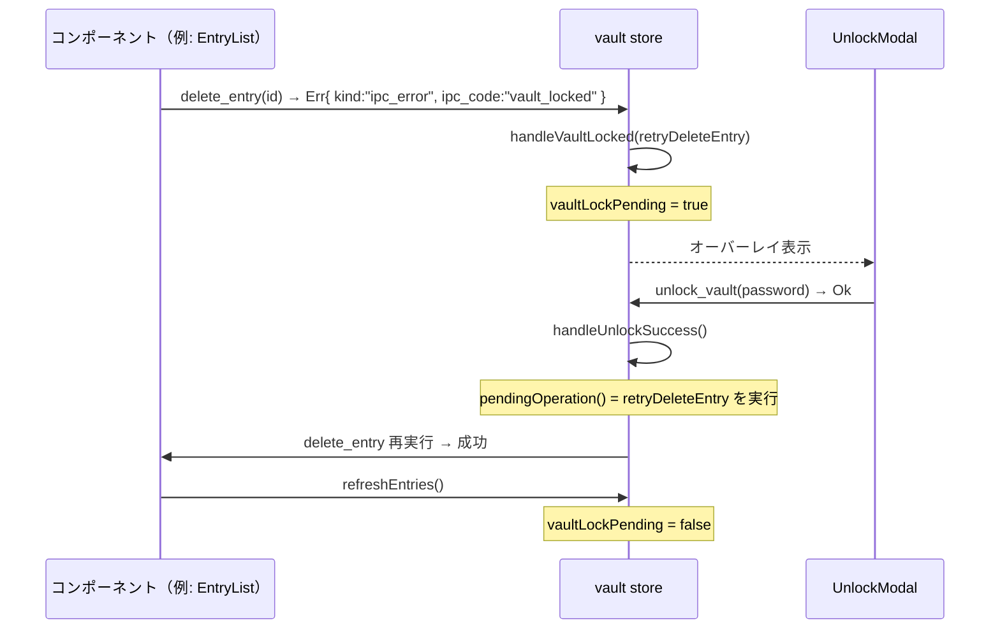

# 詳細設計書 — ui（shikomi-gui）§2〜4 ストア・フロー・機密ライフサイクル

<!-- feature: shikomi-gui / sub-feature: ui / Issue #96 -->
<!-- 配置先: docs/features/shikomi-gui/ui/detailed-design/store-and-flows.md -->
<!-- 疑似コード・実装コードブロック禁止 -->
<!-- 参照: docs/features/shikomi-gui/ui/basic-design.md -->
<!-- 参照: docs/features/shikomi-gui/ui/detailed-design/components.md（§1）-->
<!-- 参照: docs/features/shikomi-gui/ui/detailed-design/ux-and-visual.md（§5〜8）-->
<!-- 参照: docs/features/shikomi-gui/ipc-client/detailed-design.md §2.3 -->
<!-- 参照: docs/features/shikomi-gui/feature-spec.md（凍結済み）-->

## 2. リアクティブストア設計（`store/vault.ts`）

### 2.1 状態構造

| 状態フィールド | 型 | 説明 |
|---|---|---|
| `connectionStatus` | `"connecting" \| "connected" \| "disconnected"` | daemon 接続状態 |
| `entries` | `RecordSummary[]` | エントリ一覧（`list_entries` 最終結果） |
| `vaultMode` | `"plaintext" \| "encrypted_locked" \| "encrypted_unlocked" \| "unknown"` | 保護モード |
| `vaultLockPending` | `boolean` | `vault_locked` エラーを受けて `UnlockModal` 表示中 |
| `pendingOperation` | `(() => Promise<void>) \| null` | `UnlockModal` 解除後に再試行する操作。**機密値を含むクロージャの格納を禁止する**（REQ-UI-14）。`add_entry` / `update_entry` が `vault_locked` を返した場合は格納せずフォームクローズ（→ §2.2 参照）|

### 2.2 ストア操作

| 操作 | トリガー | 副作用 |
|------|---------|-------|
| `refreshEntries()` | 追加・編集・削除・アンロック成功後 | `list_entries` 呼び出し → `entries` + `vaultMode` 更新 |
| `handleVaultLocked(operation)` | `delete_entry` / `assign_hotkey` / `remove_hotkey` / vault 操作系 Command が `vault_locked` を返した時 | `pendingOperation` にセット、`vaultLockPending = true`。**機密値を含まないクロージャのみ格納可** |
| `handleVaultLockedEntryForm()` | `EntryForm`（`add_entry` / `update_entry`）が `vault_locked` を返した時 | `pendingOperation` に格納 **しない**。フォームをクローズし「vault がロックされています。アンロック後、エントリを再入力してください」を表示する。`vaultLockPending = true` はセットし `UnlockModal` を表示する（REQ-UI-14：機密値クロージャのシグナル格納禁止）|
| `handleUnlockSuccess()` | `unlock_vault` 成功後 | `pendingOperation()` 再試行、`vaultLockPending = false`、`refreshEntries()` |
| `handleDisconnect()` | `connection_failed` / `not_connected` 受信時 | `connectionStatus = "disconnected"` |

---

## 3. vault_locked フロー詳細

---

## 4. 機密情報ライフサイクル（R1-GUI-18）

JS 側での機密値の扱いは以下に従う。**`createSignal` / `createStore` の state に機密値を格納してはならない**（デバッグツール経由のメモリ読出しリスク）。

| コンポーネント | 機密フィールド | 取得方法 | 破棄タイミング |
|---|---|---|---|
| `VaultEncryptPanel` | マスターパスワード | `<input>` DOM ref | `invoke` 呼び出し直後に `ref.value = ""` |
| `VaultDecryptPanel` | マスターパスワード | DOM ref | `invoke` 呼び出し直後に `ref.value = ""` |
| `UnlockModal` | マスターパスワード | DOM ref | `invoke` 呼び出し直後に `ref.value = ""` |
| `RecoveryPhraseDisplay` | recovery 24 語 | props 経由（`phrases: string[]`） | コンポーネントのマウント解除時に自動消失。親は渡した直後に自身の変数を `null` 上書き |
