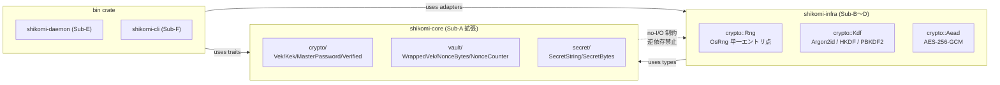

# 基本設計書

<!-- 詳細設計書とは別ファイル。統合禁止 -->
<!-- feature: vault-encryption / Epic #37 -->
<!-- 配置先: docs/features/vault-encryption/basic-design.md -->
<!-- 本書は Sub-A (#39) 着手時に新規作成。Sub-A スコープ（shikomi-core 暗号ドメイン型 + ゼロ化契約）の基本設計を確定する。
     Sub-B〜F の本文は各 Sub の設計工程で本ファイルを READ → EDIT で追記する。 -->

## 記述ルール（必ず守ること）

基本設計に**疑似コード・サンプル実装（python/ts/go等の言語コードブロック）を書くな**。
ソースコードと二重管理になりメンテナンスコストしか生まない。

## モジュール構成

本 Sub-A は `shikomi-core` crate 内の暗号ドメイン型を確定する。Issue #7（vault feature）で **`KdfSalt` / `WrappedVek` / `CipherText` / `Aad` / `NonceBytes` / `NonceCounter` / `SecretString` / `SecretBytes` / `VekProvider` trait は既に実装済**。本 Sub では**鍵階層上位型（`Vek` / `Kek` / `MasterPassword` / `RecoveryMnemonic`）と Fail-Secure 型（`Verified<T>` / `Plaintext`）を新規追加**し、Sub-0 凍結整合のため**既存 `NonceCounter` の責務を再定義**する（Boy Scout Rule）。

| 機能ID | モジュール | ディレクトリ | 責務 | Sub-A での扱い |
|--------|----------|------------|------|--------------|
| REQ-S02 | `shikomi_core::crypto::key` | `crates/shikomi-core/src/crypto/key.rs` | `Vek` / `Kek<KekKindPw>` / `Kek<KekKindRecovery>` の鍵階層型 | **新規追加** |
| REQ-S02 | `shikomi_core::crypto::password` | `crates/shikomi-core/src/crypto/password.rs` | `MasterPassword`（強度検証契約付き） / `PasswordStrengthGate` trait | **新規追加** |
| REQ-S02 | `shikomi_core::crypto::recovery` | `crates/shikomi-core/src/crypto/recovery.rs` | `RecoveryMnemonic`（24 語、再表示不可契約） | **新規追加** |
| REQ-S17 | `shikomi_core::crypto::verified` | `crates/shikomi-core/src/crypto/verified.rs` | `Verified<T>` / `Plaintext` Fail-Secure newtype | **新規追加** |
| REQ-S02 | `shikomi_core::crypto::header_aead` | `crates/shikomi-core/src/crypto/header_aead.rs` | `HeaderAeadKey` 型（Sub-0 凍結のヘッダ AEAD = KEK_pw 流用契約の型表現） | **新規追加** |
| REQ-S14 | `shikomi_core::vault::nonce` | `crates/shikomi-core/src/vault/nonce.rs` | `NonceCounter` の責務再定義（暗号化回数監視のみ）、`NonceBytes::from_random([u8;12])` 追加 | **既存改訂**（Boy Scout Rule） |
| REQ-S02 | `shikomi_core::vault::crypto_data` | `crates/shikomi-core/src/vault/crypto_data.rs` | `WrappedVek` 内部構造の分離型化（ciphertext + nonce + tag） | **既存改訂**（Boy Scout Rule） |
| REQ-S08（trait のみ） | `shikomi_core::crypto::password` | 同上 | `PasswordStrengthGate` trait シグネチャ確定（実装は Sub-D） | **新規追加（trait のみ）** |
| 全 Sub | `shikomi_core::crypto` | `crates/shikomi-core/src/crypto/mod.rs` | 暗号ドメイン型のエントリ。`shikomi_core` ルートから再エクスポート | **新規追加** |

```
ディレクトリ構造（Sub-A 完了時点、+ が新規、~ が改訂）:
crates/shikomi-core/src/
  lib.rs                  ~  pub use crypto::* を追記
  error.rs                ~  CryptoError バリアント追加（WeakPassword / NonceLimitExceeded / VerifyRequired）
  secret/
    mod.rs                    既存（無変更）
  vault/
    mod.rs                    既存（VekProvider trait 拡張のみ）
    crypto_data.rs        ~  WrappedVek の内部構造を分離型化
    nonce.rs              ~  NonceCounter 責務再定義 + NonceBytes::from_random 追加
    header.rs / record/        既存（無変更）
  crypto/                +  本 Sub-A 新規モジュール
    mod.rs               +  鍵階層・Verified・PasswordStrengthGate の再エクスポート
    key.rs               +  Vek / Kek<KekKindPw> / Kek<KekKindRecovery> 鍵階層型
    password.rs          +  MasterPassword / PasswordStrengthGate trait / WeakPasswordFeedback
    recovery.rs          +  RecoveryMnemonic（24 語）
    verified.rs          +  Verified<T> / Plaintext Fail-Secure newtype
    header_aead.rs       +  HeaderAeadKey 型（Sub-0 凍結のヘッダ AEAD 鍵経路）
```

**モジュール設計方針**:

- 暗号ドメイン型は `shikomi_core::crypto` 配下に集約。**`shikomi_core::vault` は vault 集約・レコード・ヘッダなどの「データ集約」を担当**、`shikomi_core::crypto` は「鍵階層と暗号操作の型契約」を担当する責務分離（Clean Architecture / SRP）
- 既存の `vault::crypto_data` / `vault::nonce` は **「vault ヘッダ / レコードの構成データ」として `vault` 配下に残し**、新規 `crypto::key` 等は「鍵階層」として独立させる。`Vek` は vault データではなく**鍵そのもの**であり、`crypto` 配下に置くのが意味論的に正しい
- shikomi-core は **pure Rust / no-I/O 制約を維持**。`rand_core::OsRng` 呼出は禁止。CSPRNG が必要な構築（`KdfSalt` / `Vek` / `NonceBytes`）は呼び出し側（`shikomi-infra::crypto::Rng` 単一エントリ点、Sub-B で実装）から供給される **`[u8;N]` 配列**を受け取る純粋コンストラクタのみ提供
- **Sub-0 凍結文言「`KdfSalt::generate()` 単一コンストラクタ」の Clean Architecture 整合的再解釈**: `shikomi-core` 側は raw bytes 受取コンストラクタ（既存 `KdfSalt::try_new(&[u8])`）のみ提供、**`shikomi-infra::crypto::Rng::generate_kdf_salt() -> KdfSalt`** が「単一エントリ点」を担う。本 Sub-A 設計書で**契約として固定**し、ad-hoc な byte 配列からの構築は CI grep + clippy lint で検出する（具体ルールは Sub-B / Sub-D 設計時に確定）
- 不変条件（構築時検証）を持つ型は**別ファイル**に分けてファイル粒度を揃える（Issue #7 の方針継承）。テストも同ファイルに併置（`#[cfg(test)] mod tests`）

## クラス設計（概要）

Sub-A 完了時の暗号ドメイン型と既存 vault ドメイン型の関係を Mermaid クラス図で示す。メソッドシグネチャは詳細設計書を参照。


## 処理フロー

### REQ-S02 / REQ-S17: 暗号ドメイン型の構築・破棄ライフサイクル（Sub-A 主機能）

本 Sub-A 自体は I/O を持たない型ライブラリのため、ユースケース処理フローは**型の構築〜破棄経路**として記述する。実暗号操作のフロー（`unwrap_with_password` 等）は Sub-B〜D 設計時に追記。

#### F-A1: マスターパスワード構築フロー（呼び出し側 = Sub-D / Sub-E）

1. CLI / GUI からユーザ入力された生 `String` を受け取る（呼び出し側）
2. **`MasterPassword::new(s, &gate)` を呼ぶ** — `gate` は `PasswordStrengthGate` 実装（Sub-D の zxcvbn 実装）
3. `gate.validate(&s)` が `Ok(())` を返すなら `MasterPassword` を構築（内部は `SecretBytes`）
4. `gate.validate(&s)` が `Err(WeakPasswordFeedback { warning, suggestions })` を返すなら `MasterPassword` 構築失敗、呼び出し側はそのまま MSG-S08 に変換してユーザに提示（Fail Kindly）
5. `MasterPassword` の `Drop` 時に `zeroize` で内部秘密値を消去

#### F-A2: VEK 構築フロー（呼び出し側 = Sub-B / Sub-D）

1. **新規 vault 作成時**: `shikomi-infra::crypto::Rng::generate_vek()` が `[u8;32]` を CSPRNG から生成 → `Vek::from_array([u8;32])` で構築
2. **既存 vault 読込時**: `wrap` 状態の `WrappedVek` を `unwrap_with_password` 経路で復号 → 結果を `Vek::from_array([u8;32])` で構築
3. `Vek` は `Clone` 不可（一度構築したら同じ実体しか存在しない）、`Debug` は `[REDACTED VEK]` 固定
4. `Vek` の `Drop` 時に `zeroize` で内部 32B を消去

#### F-A3: KEK 構築フロー（呼び出し側 = Sub-B）

1. **`KekPw` の場合**: KDF（Argon2id）の出力 `[u8;32]` を `Kek::<KekKindPw>::from_array([u8;32])` で構築
2. **`KekRecovery` の場合**: HKDF-SHA256 の出力 `[u8;32]` を `Kek::<KekKindRecovery>::from_array([u8;32])` で構築
3. **phantom-typed**: `KekPw` と `KekRecovery` は **型レベルで区別**され、取り違えがコンパイルエラーになる
4. KEK の `Drop` 時に `zeroize` で内部 32B を消去
5. wrap/unwrap 完了後即座に `Drop` させる（呼び出し側責務、Sub-B 詳細設計で明記）

#### F-A4: AEAD 復号成功時の `Verified<Plaintext>` 構築フロー（呼び出し側 = Sub-C）

1. AEAD 復号関数が ciphertext + nonce + AAD + tag を受け取る
2. AES-256-GCM 復号 + GMAC タグ検証
3. **タグ検証成功時のみ** `Verified::<Plaintext>::new_from_aead_decrypt(...)` で構築（コンストラクタは `pub(crate)` 限定 = `shikomi-infra` の AEAD 実装からのみ呼出可能）
4. **タグ検証失敗時** `CryptoError::AeadTagMismatch` を返し、`Plaintext` 自体を構築しない（型レベルで「未検証 ciphertext を平文として扱う事故」を禁止）
5. 呼び出し側は `Verified<Plaintext>::into_inner()` で `Plaintext` を取り出せる（取り出し後の使用は呼び出し側責任、`Plaintext` 自身も `SecretBytes` ベースで `Drop` 時 zeroize）

#### F-A5: NonceCounter 暗号化回数監視フロー（Boy Scout Rule で責務再定義）

1. **vault unlock 時**: vault ヘッダから `nonce_counter: u64` を読み込み `NonceCounter::resume(count)` で構築
2. **レコード暗号化のたびに**: `NonceCounter::increment()` を呼ぶ → 上限 $2^{32}$ 未満なら `Ok(())`、上限到達なら `Err(DomainError::NonceLimitExceeded)`
3. **per-record nonce 値そのものは別経路**: `shikomi-infra::crypto::Rng::generate_nonce_bytes() -> NonceBytes` で完全 random 12B を取得（`NonceBytes::from_random([u8;12])` 受取コンストラクタ）。`NonceCounter` は nonce 値生成に**関与しない**
4. **vault save 時**: `NonceCounter::current()` で現在のカウント値を取り出しヘッダに保存
5. **上限到達時**: 呼び出し側（Sub-D / Sub-F）は `vault rekey` フローを起動（Vault::rekey_with(VekProvider) 既存メソッド経路、Issue #7 完了済）

### Sub-B〜F の処理フロー

各 Sub の設計工程で本ファイルを READ → EDIT で追記する。

- F-B*: KDF 経路（Argon2id / BIP-39+PBKDF2+HKDF）— Sub-B
- F-C*: AEAD 経路（AES-256-GCM per-record + ヘッダ独立 AEAD タグ）— Sub-C
- F-D*: 暗号化 vault リポジトリ + 平文⇄暗号化マイグレーション — Sub-D
- F-E*: VEK キャッシュ + IPC V2 — Sub-E
- F-F*: vault 管理サブコマンド — Sub-F

## シーケンス図

Sub-A スコープは型ライブラリで I/O 不在のため、メイン処理シーケンスは Sub-B〜D で初めて成立する。本書では **Sub-A 型の使用パターン（呼び出し側との境界）** のみ示す。

```mermaid
sequenceDiagram
    participant CLI as shikomi-cli (Sub-F)
    participant Daemon as shikomi-daemon (Sub-E)
    participant Infra as shikomi-infra (Sub-B〜D)
    participant Core as shikomi-core::crypto (Sub-A)

    Note over CLI,Core: 暗号化モード unlock の代表シナリオ

    CLI->>Daemon: IPC Unlock { master_password: SecretBytes }
    Daemon->>Infra: unwrap_vek(master_password, kdf_salt, wrapped_vek_by_pw)
    Infra->>Core: MasterPassword::new(s, &gate)
    Core-->>Infra: Ok(MasterPassword) or Err(WeakPasswordFeedback)
    Infra->>Infra: Argon2id(master_password, kdf_salt) -> [u8;32]
    Infra->>Core: Kek::<KekKindPw>::from_array([u8;32])
    Core-->>Infra: Kek<KekKindPw>
    Infra->>Infra: AES-GCM unwrap(wrapped_vek_by_pw, kek_pw)
    alt タグ検証成功
        Infra->>Core: Verified::<Plaintext>::new_from_aead_decrypt(vek_bytes)
        Core-->>Infra: Verified<Plaintext>
        Infra->>Core: Vek::from_array(verified.into_inner().as_bytes())
        Core-->>Infra: Vek
        Infra-->>Daemon: Ok(Vek)
        Note over Core: KekPw / Verified / Plaintext は<br/>スコープ抜けで全て zeroize
    else タグ検証失敗
        Infra-->>Daemon: Err(CryptoError::AeadTagMismatch)
        Note over Core: KekPw / MasterPassword は<br/>スコープ抜けで zeroize
    end
    Daemon->>Daemon: VEK キャッシュへ保存（Sub-E 責務）
    Daemon-->>CLI: IPC Response（成功 or MSG-S09 カテゴリ別ヒント）
```

## アーキテクチャへの影響

`docs/architecture/` への変更は**なし**（Sub-A スコープでは tech-stack の crate 追加なし、`secrecy` / `zeroize` は §4.3.2 既存登録、`rand_core` / `getrandom` も同様）。

ただし、**Clean Architecture 依存方向の追加経路**を明示:



- shikomi-core は **OS / I/O / 乱数 syscall を持たない**
- `shikomi-infra::crypto::Rng` が **OsRng 単一エントリ点**を保有し、`generate_vek()` / `generate_kdf_salt()` / `generate_nonce_bytes()` を提供（Sub-B 設計時に詳細化）
- ad-hoc な byte 配列からの `Vek::from_array` 等の直接構築は**テストモジュール以外で禁止**（Sub-B / Sub-D で CI grep + clippy lint ルール確定）

## 外部連携

該当なし — 理由: Sub-A は shikomi-core の暗号ドメイン型ライブラリで、外部 API / OS / DB / network への発信は一切行わない（pure Rust / no-I/O 制約継承）。

## UX設計

該当なし — 理由: Sub-A は内部型ライブラリで UI 不在。ただし `MasterPassword::new` の構築失敗時に返す `WeakPasswordFeedback { warning, suggestions }` は **Sub-D で MSG-S08 ユーザ提示（Fail Kindly）に直接渡される構造データ**として設計する。詳細設計書 §クラス設計（詳細）参照。

## セキュリティ設計

### 脅威モデル

`requirements-analysis.md` §脅威モデル §4 攻撃者能力 L1〜L4 を**正本**とする。本セクションは**Sub-A スコープに閉じた対応**を整理。

| 想定攻撃者 | 攻撃経路 | 保護資産 | Sub-A 型レベル対策 |
|-----------|---------|---------|------------------|
| **L1**: 同ユーザ別プロセス | vault.db 改竄、IPC スプーフィング（Sub-E 担当） | `wrapped_VEK_*` / `kdf_params` / records ciphertext | `Verified<T>` newtype で「未検証 ciphertext を `Plaintext` として扱う」事故を**型レベル禁止**。AEAD 復号関数（Sub-C 実装）のみが `Verified::new_from_aead_decrypt` を呼べる `pub(crate)` コンストラクタ可視性で実装ミス経路を**構造的封鎖** |
| **L2**: メモリスナップショット | コアダンプ / ハイバネーションファイル / スワップから VEK / KEK / MasterPassword / 平文抽出 | `Vek` / `Kek` / `MasterPassword` / `RecoveryMnemonic` / `Plaintext` | 全て `secrecy::SecretBox` ベース、`Drop` 連鎖で**派生集約も連動消去**。`Clone` を**意図的に未実装**（誤コピーで滞留時間延長を構造禁止）。`Debug` は `[REDACTED ...]` 固定、`Display` 未実装、`serde::Serialize` 未実装（コンパイル時に誤シリアライズを排除） |
| **L3**: 物理ディスク奪取 | offline brute force | `wrapped_VEK_*`（KDF 作業証明依存） | Sub-A 型レベル対策**なし**（KDF 計算は Sub-B、AEAD 計算は Sub-C 担当）。ただし `MasterPassword::new` で `PasswordStrengthGate` 通過を**型コンストラクタ要件**として強制し、弱パスワードを構造的に Sub-D の Argon2id 入力から排除（**KDF 強度の前提条件を型で担保**） |
| **L4**: 同ユーザ root / OS 侵害 | ptrace / kernel keylogger / `/proc/<pid>/mem` 等 | 全て | **対象外**（`requirements-analysis.md` §脅威モデル §4 L4 / §5 スコープ外）。型レベルで防御不能、Sub-A は対策追加せず |

### Fail-Secure 型レベル強制（REQ-S17 主担当）

`requirements-analysis.md` §脅威モデル §6 Fail-Secure 哲学の 5 種類を Sub-A で**型システムに焼き付ける**:

| パターン | Sub-A 実装 | 効果 |
|--------|----------|------|
| **`Verified<T>` newtype** | `Verified::new_from_aead_decrypt(t: T) -> Verified<T>` を `pub(crate)` 可視性で実装、外部 crate からは構築不可 | AEAD 復号成功経路でのみ `Verified<Plaintext>` が得られる。「未検証 ciphertext を平文として扱う」事故を**型レベル禁止** |
| **`MasterPassword::new` の構築時強度検証** | 構築時に `&dyn PasswordStrengthGate` を要求、Sub-D の zxcvbn 実装が `validate(&s) -> Result<(), WeakPasswordFeedback>` を返す | 弱パスワードでの `MasterPassword` 構築を**入口で禁止**、Sub-B Argon2id 入力に到達させない |
| **`NonceCounter::increment` の `Result` 返却** | 上限 $2^{32}$ 到達時 `Err(DomainError::NonceLimitExceeded)`、`#[must_use]` で結果無視を clippy lint で検出 | 上限到達後の暗号化を**構造的に禁止**、rekey 強制経路（Sub-F）へ誘導 |
| **`match` 暗号アーム第一パターン** | Sub-A 提供型 `enum CryptoOutcome { TagMismatch, NonceLimit, KdfFailed, Verified(Plaintext) }` で**未検証ケース第一**の網羅 match を Sub-C / Sub-D 実装で強制 | 部分検証で先に進む実装ミスを排除（Issue #33 `(_, Ipc) => Secret` パターン同型） |
| **`Drop` 連鎖** | `Vek` / `Kek<_>` / `MasterPassword` / `RecoveryMnemonic` / `Plaintext` / `HeaderAeadKey` 全てに `Drop` 経路、内包する `SecretBox` の zeroize が transitive に発火 | L2 メモリスナップショット対策の**型レベル担保**、忘却型による zeroize 漏れを禁止 |

### OWASP Top 10 対応

| # | カテゴリ | 対応状況 |
|---|---------|---------|
| A01 | Broken Access Control | 該当なし — 理由: Sub-A はドメイン型ライブラリで、認可境界は持たない。アクセス制御は IPC（Sub-E）/ OS パーミッション（既存 `vault-persistence`）担当 |
| A02 | Cryptographic Failures | **主担当**。`Verified<T>` newtype で AEAD 検証 bypass を型禁止、`Vek` / `Kek<_>` / `MasterPassword` / `RecoveryMnemonic` / `Plaintext` を `secrecy` + `zeroize` で滞留時間最小化、`Clone` 禁止で誤コピー排除、`Debug` 秘匿で誤ログ漏洩排除、`PasswordStrengthGate` で弱鍵禁止 |
| A03 | Injection | 該当なし — 理由: shikomi-core は SQL / shell / HTML を扱わない |
| A04 | Insecure Design | **主担当**。Fail-Secure を**型システムで強制**する設計（`Verified<T>` / `pub(crate)` 可視性 / phantom-typed `Kek<Kind>` 取り違え禁止 / `#[must_use]` 結果無視検出）。Issue #33 の `(_, Ipc) => Secret` 思想を継承し、暗号化境界も型で fail-secure |
| A05 | Security Misconfiguration | 該当なし — 理由: 設定値は Sub-B（KDF パラメータ）/ Sub-C（nonce 上限）担当 |
| A06 | Vulnerable Components | 該当なし — 理由: 本 Sub で新規導入する crate は**ない**（`secrecy` / `zeroize` / `thiserror` / `time` は Issue #7 で導入済、§4.3.2 暗号クリティカル登録済） |
| A07 | Auth Failures | 部分担当。`MasterPassword` の強度検証契約のみ確定（実装は Sub-D zxcvbn）、リトライ回数管理は Sub-E |
| A08 | Data Integrity Failures | 該当なし — 理由: ヘッダ AEAD タグの実検証は Sub-C / Sub-D 担当、Sub-A は `HeaderAeadKey` 型と `Verified<T>` 契約のみ提供 |
| A09 | Logging Failures | **主担当**。`Debug` を `[REDACTED VEK]` / `[REDACTED KEK]` / `[REDACTED MASTER PASSWORD]` / `[REDACTED MNEMONIC]` / `[REDACTED PLAINTEXT]` の固定文字列に統一、`tracing` で誤った構造化ログを出さない契約。`Display` / `serde::Serialize` 未実装で誤シリアライズを**コンパイル時禁止** |
| A10 | SSRF | 該当なし — 理由: shikomi-core はネットワーク I/O を持たない |

## ER図

Sub-A 型の集約関係（暗号メタデータ ER）。永続化スキーマは Sub-D で確定するため、本書では**型相互の関係**のみ示す。

```mermaid
erDiagram
    VAULT ||--o| HEADER_ENCRYPTED : has
    HEADER_ENCRYPTED ||--|| KDF_SALT : contains
    HEADER_ENCRYPTED ||--|| WRAPPED_VEK_PW : contains
    HEADER_ENCRYPTED ||--|| WRAPPED_VEK_RECOVERY : contains
    HEADER_ENCRYPTED ||--|| NONCE_COUNTER : tracks
    WRAPPED_VEK_PW ||--|| NONCE_BYTES : uses
    WRAPPED_VEK_RECOVERY ||--|| NONCE_BYTES : uses
    RECORD ||--|| ENCRYPTED_PAYLOAD : has
    ENCRYPTED_PAYLOAD ||--|| CIPHER_TEXT : contains
    ENCRYPTED_PAYLOAD ||--|| NONCE_BYTES : contains
    ENCRYPTED_PAYLOAD ||--|| AAD : contains

    VAULT {
        VaultHeader header
        Vec_Record records
    }
    HEADER_ENCRYPTED {
        VaultVersion version
        OffsetDateTime created_at
        KdfSalt kdf_salt
        WrappedVek wrapped_vek_by_pw
        WrappedVek wrapped_vek_by_recovery
        NonceCounter nonce_counter
    }
    WRAPPED_VEK_PW {
        Vec_u8 ciphertext
        NonceBytes nonce
        16B tag
    }
    NONCE_COUNTER {
        u64 encryption_count
        constraint upper_bound_2_pow_32
    }
    NONCE_BYTES {
        12B random_from_OsRng
    }
    KDF_SALT {
        16B from_OsRng
    }
```

**揮発鍵階層型（永続化されない、ER 図対象外）**:

- `Vek`（32B、daemon RAM のみ、unlock〜lock 間滞留）
- `Kek<KekKindPw>`（32B、Argon2id 完了 → wrap/unwrap 完了で zeroize、滞留 < 1 秒）
- `Kek<KekKindRecovery>`（32B、HKDF 完了 → wrap/unwrap 完了で zeroize、滞留 < 1 秒）
- `HeaderAeadKey`（32B、KEK_pw 流用、ヘッダ AEAD 検証完了で zeroize）
- `MasterPassword`（任意長 SecretBytes、入力 → KDF 完了で zeroize）
- `RecoveryMnemonic`（24 語、生成 → 表示完了 → zeroize、再表示不可）
- `Plaintext`（任意長 SecretBytes、レコード復号 → 投入完了 → 30 秒クリップボードクリア後 zeroize）
- `Verified<Plaintext>`（`Plaintext` のラッパ、寿命は内包する `Plaintext` に従属）

## エラーハンドリング方針

Sub-A で **`DomainError` の拡張**として暗号特化エラーを追加（`shikomi_core::error::DomainError` の variant 追加、または独立 `CryptoError` 型を `DomainError::Crypto(...)` で内包）。詳細な variant 仕様は詳細設計書参照。

| 例外種別 | 処理方針 | ユーザーへの通知 |
|---------|---------|----------------|
| `CryptoError::WeakPassword(WeakPasswordFeedback)` | `MasterPassword::new` の構築失敗。呼び出し側（Sub-D）が `Feedback` をそのまま MSG-S08 に変換 | MSG-S08「パスワード強度不足」+ zxcvbn の `warning` / `suggestions`（Fail Kindly） |
| `CryptoError::AeadTagMismatch` | AEAD 復号失敗。**`Verified<Plaintext>` を構築せず**、Sub-D が即拒否 → vault.db 改竄の可能性をユーザに通知 | MSG-S10「vault.db 改竄の可能性、バックアップから復元を案内」 |
| `CryptoError::NonceLimitExceeded` | `NonceCounter::increment` の上限到達。Sub-D が即 `vault rekey` フロー（Sub-F）へ誘導 | MSG-S11「nonce 上限到達、`vault rekey` 実行を案内」 |
| `CryptoError::KdfFailed { kind, source }` | Argon2id / HKDF / PBKDF2 計算失敗（メモリ不足 / 入力長不正等）。Sub-B が即拒否、リトライしない（KDF 失敗は決定論的バグまたはリソース枯渇のため） | MSG-S09 カテゴリ「(c) キャッシュ揮発タイムアウト」隣接の「KDF 失敗」カテゴリ（Sub-B / Sub-E で文言確定） |
| `CryptoError::VerifyRequired` | `Plaintext` を `Verified` 経由なしで直接構築しようとした（`pub(crate)` 可視性で**コンパイルエラーになる経路**だが、テストでの構築シナリオに限り runtime 検出の余地） | 開発者向けエラー、ユーザ通知なし（`tracing` で audit log のみ） |
| 既存 `DomainError::NonceOverflow` | **Sub-A で `NonceLimitExceeded` に名称統一**（Boy Scout Rule、責務再定義に整合）。後方互換は Issue #7 時点で本 variant を呼ぶ箇所なし、安全に rename | 同上 |

**Fail-Secure 哲学の徹底**: 上記いずれのエラーも **「中途半端な状態を呼び出し側に渡さない」**（`Result::Err` のみで返す、`Option::None` で曖昧化しない、panic で巻戻さない）。Issue #33 の `(_, Ipc) => Secret` パターン継承。
