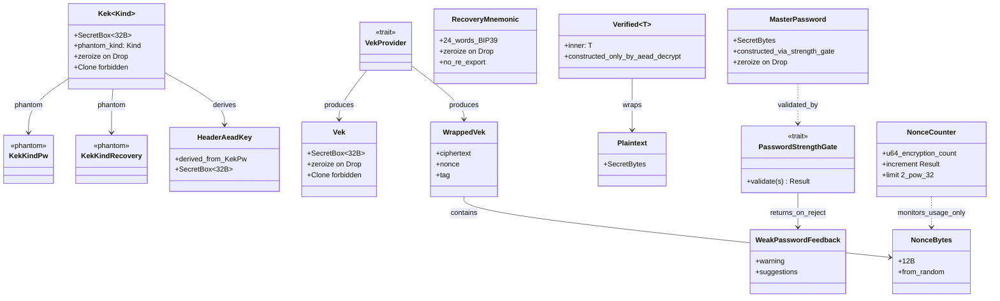
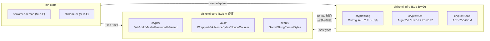

# 基本設計書

<!-- 詳細設計書（detailed-design/ ディレクトリ）とは別ファイル。統合禁止 -->
<!-- 詳細設計は Sub-A Rev1 で 4 分冊化: detailed-design/{index,crypto-types,password,nonce-and-aead,errors-and-contracts}.md -->
<!-- feature: vault-encryption / Epic #37 -->
<!-- 配置先: docs/features/vault-encryption/basic-design.md -->
<!-- 本書は Sub-A (#39) 着手時に新規作成。Sub-A スコープ（shikomi-core 暗号ドメイン型 + ゼロ化契約）の基本設計を確定する。
     Sub-B〜F の本文は各 Sub の設計工程で本ファイルを READ → EDIT で追記する。 -->

## 記述ルール（必ず守ること）

基本設計に**疑似コード・サンプル実装（python/ts/go等の言語コードブロック）を書くな**。
ソースコードと二重管理になりメンテナンスコストしか生まない。

## モジュール構成

本 Sub-A は `shikomi-core` crate 内の暗号ドメイン型を確定する。Issue #7（vault feature）で **`KdfSalt` / `WrappedVek` / `CipherText` / `Aad` / `NonceBytes` / `NonceCounter` / `SecretString` / `SecretBytes` / `VekProvider` trait は既に実装済**。本 Sub では**鍵階層上位型（`Vek` / `Kek` / `MasterPassword` / `RecoveryMnemonic`）と Fail-Secure 型（`Verified<T>` / `Plaintext`）を新規追加**し、Sub-0 凍結整合のため**既存 `NonceCounter` の責務を再定義**する（Boy Scout Rule）。

| 機能ID | モジュール | ディレクトリ | 責務 | Sub-A での扱い |
|--------|----------|------------|------|--------------|
| REQ-S02 | `shikomi_core::crypto::key` | `crates/shikomi-core/src/crypto/key.rs` | `Vek` / `Kek<KekKindPw>` / `Kek<KekKindRecovery>` の鍵階層型 | **新規追加** |
| REQ-S02 | `shikomi_core::crypto::password` | `crates/shikomi-core/src/crypto/password.rs` | `MasterPassword`（強度検証契約付き） / `PasswordStrengthGate` trait | **新規追加** |
| REQ-S02 | `shikomi_core::crypto::recovery` | `crates/shikomi-core/src/crypto/recovery.rs` | `RecoveryMnemonic`（24 語、再表示不可契約） | **新規追加** |
| REQ-S17 | `shikomi_core::crypto::verified` | `crates/shikomi-core/src/crypto/verified.rs` | `Verified<T>` / `Plaintext` Fail-Secure newtype | **新規追加** |
| REQ-S02 | `shikomi_core::crypto::header_aead` | `crates/shikomi-core/src/crypto/header_aead.rs` | `HeaderAeadKey` 型（Sub-0 凍結のヘッダ AEAD = KEK_pw 流用契約の型表現） | **新規追加** |
| REQ-S14 | `shikomi_core::vault::nonce` | `crates/shikomi-core/src/vault/nonce.rs` | `NonceCounter` の責務再定義（暗号化回数監視のみ）、`NonceBytes::from_random([u8;12])` 追加 | **既存改訂**（Boy Scout Rule） |
| REQ-S02 | `shikomi_core::vault::crypto_data` | `crates/shikomi-core/src/vault/crypto_data.rs` | `WrappedVek` 内部構造の分離型化（ciphertext + nonce + tag） | **既存改訂**（Boy Scout Rule） |
| REQ-S08（trait のみ） | `shikomi_core::crypto::password` | 同上 | `PasswordStrengthGate` trait シグネチャ確定（**実装は Sub-B、Boy Scout Rule で旧 Sub-D 担当を再分配**） | **新規追加（trait のみ）** |
| 全 Sub | `shikomi_core::crypto` | `crates/shikomi-core/src/crypto/mod.rs` | 暗号ドメイン型のエントリ。`shikomi_core` ルートから再エクスポート | **新規追加** |
| REQ-S03 | `shikomi_infra::crypto::kdf::argon2id` | `crates/shikomi-infra/src/crypto/kdf/argon2id.rs` | `Argon2idAdapter`（パスワード → KEK_pw、`m=19456, t=2, p=1`、RFC 9106 KAT、criterion p95 1 秒） | **Sub-B 新規追加** |
| REQ-S04 | `shikomi_infra::crypto::kdf::bip39_pbkdf2_hkdf` | `crates/shikomi-infra/src/crypto/kdf/bip39_pbkdf2_hkdf.rs` | `Bip39Pbkdf2Hkdf`（24 語 → seed → KEK_recovery、HKDF info `b"shikomi-kek-v1"`、trezor + RFC 5869 KAT） | **Sub-B 新規追加** |
| REQ-S02 / 全 Sub | `shikomi_infra::crypto::rng` | `crates/shikomi-infra/src/crypto/rng.rs` | `Rng`（`rand_core::OsRng` + `getrandom` バックエンド、`generate_kdf_salt` / `generate_vek` / `generate_nonce_bytes` / `generate_mnemonic_entropy` の単一エントリ点、Sub-0 凍結文言「`KdfSalt::generate()` 単一コンストラクタ」の Clean Arch 整合的物理実装） | **Sub-B 新規追加** |
| REQ-S08（実装） | `shikomi_infra::crypto::password::zxcvbn_gate` | `crates/shikomi-infra/src/crypto/password/zxcvbn_gate.rs` | `ZxcvbnGate`（zxcvbn 強度 ≥ 3、英語 raw `Feedback` をそのまま運ぶ、i18n は呼出側責務） | **Sub-B 新規追加（旧 Sub-D 担当の Boy Scout Rule 再分配）** |
| REQ-S05 | `shikomi_core::crypto::aead_key` | `crates/shikomi-core/src/crypto/aead_key.rs` | `AeadKey` trait（`with_secret_bytes` クロージャインジェクション、Sub-B Rev2 可視性ポリシー差別化との整合） | **Sub-C 新規追加（Boy Scout Rule、shikomi-core 側に trait のみ、impl は `Vek` / `Kek<_>` / `HeaderAeadKey`）** |
| REQ-S05 | `shikomi_infra::crypto::aead::aes_gcm` | `crates/shikomi-infra/src/crypto/aead/aes_gcm.rs` | `AesGcmAeadAdapter`（AES-256-GCM、`encrypt_record` / `decrypt_record` / `wrap_vek` / `unwrap_vek` 4 メソッド、AAD = `Aad::to_canonical_bytes()` 26B、NIST CAVP KAT、`Zeroizing<Vec<u8>>` 中間バッファ） | **Sub-C 新規追加** |
| REQ-S05 / REQ-S14 | `shikomi_core::crypto::key` / `shikomi_core::crypto::header_aead` | 上記 `key.rs` / `header_aead.rs` | `Vek` / `Kek<KekKindPw>` / `Kek<KekKindRecovery>` への `AeadKey` impl 追加（**`expose_within_crate` の `pub(crate)` 可視性は変更せず**、trait 経由のみ外部 crate に開放） | **Sub-C で Boy Scout 改訂**（`HeaderAeadKey` impl は Sub-D で同形パターン追加） |
| REQ-S06 | `shikomi_core::vault::header` | `crates/shikomi-core/src/vault/header.rs` | `VaultEncryptedHeader`（version / created_at / kdf_salt / wrapped_vek_by_pw / wrapped_vek_by_recovery / nonce_counter / kdf_params / header_aead_envelope）/ `KdfParams { m, t, p }`（`Argon2idParams::FROZEN_OWASP_2024_05` の永続化形）/ `HeaderAeadEnvelope { ciphertext, nonce, tag }`（ヘッダ独立 AEAD タグ） | **Sub-D 新規追加 / Boy Scout**（既存 `VaultHeader::Encrypted` skeleton を完成形に） |
| REQ-S06 | `shikomi_core::vault::record` | `crates/shikomi-core/src/vault/record.rs` | `EncryptedRecord` 追加（既存 `PlaintextRecord` と並列、`Record::Encrypted(EncryptedRecord)` variant）| **Sub-D 新規追加 / Boy Scout** |
| REQ-S13 | `shikomi_core::vault::recovery_disclosure` | `crates/shikomi-core/src/vault/recovery_disclosure.rs` | `RecoveryDisclosure` / `RecoveryWords`（24 語初回 1 度表示の型レベル強制、`disclose(self)` 所有権消費 + `Display` / `Serialize` 未実装で永続化禁止）| **Sub-D 新規追加** |
| REQ-S05 | `shikomi_core::crypto::header_aead` | 上記 `header_aead.rs` | `HeaderAeadKey` への `AeadKey` impl 追加（Sub-C で予告した Boy Scout 完成）| **Sub-D で Boy Scout 改訂** |
| REQ-S06 / REQ-S07 | `shikomi_infra::persistence::vault_migration` | `crates/shikomi-infra/src/persistence/vault_migration/{mod,encrypt_flow,decrypt_flow,rekey_flow}.rs` | `VaultMigration` service（`encrypt_vault` / `decrypt_vault` / `unlock_with_password` / `unlock_with_recovery` / `rekey` / `change_password` の 6 メソッド、`Argon2idHkdfVekProvider` + `AesGcmAeadAdapter` + `Rng` + `ZxcvbnGate` を組合せ）| **Sub-D 新規追加** |
| REQ-S07 | `shikomi_infra::persistence::sqlite::*` | 既存 `mod.rs` / `mapping.rs` / `schema.rs` | 暗号化モード分岐の解禁（`UnsupportedYet` 即 return 削除、`VaultEncryptedHeader` ↔ vault_header 行 / `EncryptedRecord` ↔ records 行の `Mapping` 拡張、`PRAGMA user_version` bump で `kdf_params` / `header_aead_*` カラム追加）| **Sub-D で改訂**（横断的変更、`vault-persistence` feature への影響） |
| REQ-S06 | `shikomi_core::error` | 既存 `error.rs` | `MigrationError` 列挙型追加（`WeakPassword` / `Crypto` / `Persistence` / `AtomicWriteFailed` / `ConfirmationRequired` / `PlaintextNotUtf8` / `RecoveryAlreadyConsumed`）+ `DecryptConfirmation` 型レベル二段確認証跡 | **Sub-D 新規追加** |

```
ディレクトリ構造（Sub-A 完了時点、+ が新規、~ が改訂）:
crates/shikomi-core/src/
  lib.rs                  ~  pub use crypto::* を追記
  error.rs                ~  CryptoError バリアント追加（WeakPassword / NonceLimitExceeded / VerifyRequired）
  secret/
    mod.rs                    既存（無変更）
  vault/
    mod.rs                    既存（VekProvider trait 拡張のみ）
    crypto_data.rs        ~  WrappedVek の内部構造を分離型化
    nonce.rs              ~  NonceCounter 責務再定義 + NonceBytes::from_random 追加
    header.rs / record/        既存（無変更）
  crypto/                +  本 Sub-A 新規モジュール
    mod.rs               +  鍵階層・Verified・PasswordStrengthGate の再エクスポート
    key.rs               +  Vek / Kek<KekKindPw> / Kek<KekKindRecovery> 鍵階層型
    password.rs          +  MasterPassword / PasswordStrengthGate trait / WeakPasswordFeedback
    recovery.rs          +  RecoveryMnemonic（24 語）
    verified.rs          +  Verified<T> / Plaintext Fail-Secure newtype
    header_aead.rs       +  HeaderAeadKey 型（Sub-0 凍結のヘッダ AEAD 鍵経路）

ディレクトリ構造（Sub-B 完了時点、+ が新規）:
crates/shikomi-infra/src/
  lib.rs                  ~  pub use crypto::* を追記
  crypto/                +  本 Sub-B 新規モジュール（暗号アダプタ層）
    mod.rs               +  rng / kdf / password の再エクスポート
    rng.rs               +  Rng (OsRng 単一エントリ点) / generate_kdf_salt / generate_vek / generate_nonce_bytes / generate_mnemonic_entropy
    kdf/                 +  KDF アダプタ
      mod.rs             +  Argon2idAdapter / Bip39Pbkdf2Hkdf 再エクスポート
      argon2id.rs        +  Argon2idAdapter + Argon2idParams::FROZEN_OWASP_2024_05 const
      bip39_pbkdf2_hkdf.rs +  Bip39Pbkdf2Hkdf + HKDF_INFO const (b"shikomi-kek-v1")
      kat.rs             +  RFC 9106 / trezor / RFC 5869 KAT データ (test cfg)
    password/            +  パスワード強度ゲート
      mod.rs             +  ZxcvbnGate 再エクスポート
      zxcvbn_gate.rs     +  ZxcvbnGate (PasswordStrengthGate 具象実装、min_score = 3)
    vek_provider.rs      +  Argon2idHkdfVekProvider (shikomi_core::VekProvider 具象実装、Sub-C/D で wrap 経路を結合)
  benches/                + 
    argon2id.rs          +  criterion benchmark (p95 ≤ 1.0 秒、CI bench-kdf job で必須 pass)

ディレクトリ構造（Sub-C 完了時点、+ が新規、~ が改訂）:
crates/shikomi-core/src/
  crypto/
    aead_key.rs          +  AeadKey trait（with_secret_bytes クロージャインジェクション、Sub-C 新規）
    key.rs               ~  Vek / Kek<_> に AeadKey impl 追加（Boy Scout、expose_within_crate は pub(crate) 維持）
    header_aead.rs       ~  HeaderAeadKey に AeadKey impl 追加は Sub-D 担当（Boy Scout 予告のみ）
    mod.rs               ~  pub use aead_key::AeadKey を追記
crates/shikomi-infra/src/
  crypto/
    aead/                +  本 Sub-C 新規モジュール
      mod.rs             +  AesGcmAeadAdapter 再エクスポート
      aes_gcm.rs         +  AesGcmAeadAdapter（encrypt_record / decrypt_record / wrap_vek / unwrap_vek 4 メソッド、Zeroizing<Vec<u8>> 中間バッファ）
      kat.rs             +  NIST CAVP gcmEncryptExtIV256.rsp / gcmDecrypt256.rsp 抜粋 const 配列（test cfg、各 8 件以上）
    vek_provider.rs      ~  derive_new_wrapped_pw / derive_new_wrapped_recovery の AES-GCM wrap 経路を AesGcmAeadAdapter::wrap_vek 経由で確定（Sub-B 段階の TBD を Sub-C で完成）
  Cargo.toml             ~  aes-gcm minor pin + rand_core minor pin + subtle major pin v2.5+ を [dependencies] に追加
```

**モジュール設計方針**:

- 暗号ドメイン型は `shikomi_core::crypto` 配下に集約。**`shikomi_core::vault` は vault 集約・レコード・ヘッダなどの「データ集約」を担当**、`shikomi_core::crypto` は「鍵階層と暗号操作の型契約」を担当する責務分離（Clean Architecture / SRP）
- 既存の `vault::crypto_data` / `vault::nonce` は **「vault ヘッダ / レコードの構成データ」として `vault` 配下に残し**、新規 `crypto::key` 等は「鍵階層」として独立させる。`Vek` は vault データではなく**鍵そのもの**であり、`crypto` 配下に置くのが意味論的に正しい
- shikomi-core は **pure Rust / no-I/O 制約を維持**。`rand_core::OsRng` 呼出は禁止。CSPRNG が必要な構築（`KdfSalt` / `Vek` / `NonceBytes`）は呼び出し側（`shikomi-infra::crypto::Rng` 単一エントリ点、Sub-B で実装）から供給される **`[u8;N]` 配列**を受け取る純粋コンストラクタのみ提供
- **Sub-0 凍結文言「`KdfSalt::generate()` 単一コンストラクタ」の Clean Architecture 整合的再解釈**: `shikomi-core` 側は raw bytes 受取コンストラクタ（既存 `KdfSalt::try_new(&[u8])`）のみ提供、**`shikomi-infra::crypto::Rng::generate_kdf_salt() -> KdfSalt`** が「単一エントリ点」を担う。本 Sub-A 設計書で**契約として固定**し、ad-hoc な byte 配列からの構築は CI grep + clippy lint で検出する（具体ルールは Sub-B / Sub-D 設計時に確定）
- 不変条件（構築時検証）を持つ型は**別ファイル**に分けてファイル粒度を揃える（Issue #7 の方針継承）。テストも同ファイルに併置（`#[cfg(test)] mod tests`）

## クラス設計（概要）

Sub-A 完了時の暗号ドメイン型と既存 vault ドメイン型の関係を Mermaid クラス図で示す。メソッドシグネチャは詳細設計書（`detailed-design/index.md` および各分冊 `crypto-types.md` / `password.md` / `nonce-and-aead.md` / `errors-and-contracts.md`）を参照。



## 処理フロー

### REQ-S02 / REQ-S17: 暗号ドメイン型の構築・破棄ライフサイクル（Sub-A 主機能）

本 Sub-A 自体は I/O を持たない型ライブラリのため、ユースケース処理フローは**型の構築〜破棄経路**として記述する。実暗号操作のフロー（`unwrap_with_password` 等）は Sub-B〜D 設計時に追記。

#### F-A1: マスターパスワード構築フロー（呼び出し側 = Sub-D / Sub-E）

1. CLI / GUI からユーザ入力された生 `String` を受け取る（呼び出し側）
2. **`MasterPassword::new(s, &gate)` を呼ぶ** — `gate` は `PasswordStrengthGate` 実装（Sub-D の zxcvbn 実装）
3. `gate.validate(&s)` が `Ok(())` を返すなら `MasterPassword` を構築（内部は `SecretBytes`）
4. `gate.validate(&s)` が `Err(WeakPasswordFeedback { warning, suggestions })` を返すなら `MasterPassword` 構築失敗、呼び出し側はそのまま MSG-S08 に変換してユーザに提示（Fail Kindly）
5. `MasterPassword` の `Drop` 時に `zeroize` で内部秘密値を消去

#### F-A2: VEK 構築フロー（呼び出し側 = Sub-B / Sub-D）

1. **新規 vault 作成時**: `shikomi-infra::crypto::Rng::generate_vek()` が `[u8;32]` を CSPRNG から生成 → `Vek::from_array([u8;32])` で構築
2. **既存 vault 読込時**: `wrap` 状態の `WrappedVek` を `unwrap_with_password` 経路で復号 → 結果を `Vek::from_array([u8;32])` で構築
3. `Vek` は `Clone` 不可（一度構築したら同じ実体しか存在しない）、`Debug` は `[REDACTED VEK]` 固定
4. `Vek` の `Drop` 時に `zeroize` で内部 32B を消去

#### F-A3: KEK 構築フロー（呼び出し側 = Sub-B）

1. **`KekPw` の場合**: KDF（Argon2id）の出力 `[u8;32]` を `Kek::<KekKindPw>::from_array([u8;32])` で構築
2. **`KekRecovery` の場合**: HKDF-SHA256 の出力 `[u8;32]` を `Kek::<KekKindRecovery>::from_array([u8;32])` で構築
3. **phantom-typed**: `KekPw` と `KekRecovery` は **型レベルで区別**され、取り違えがコンパイルエラーになる
4. KEK の `Drop` 時に `zeroize` で内部 32B を消去
5. wrap/unwrap 完了後即座に `Drop` させる（呼び出し側責務、Sub-B 詳細設計で明記）

#### F-A4: AEAD 復号成功時の `Verified<Plaintext>` 構築フロー（呼び出し側 = Sub-C）

1. AEAD 復号関数が ciphertext + nonce + AAD + tag を受け取る
2. AES-256-GCM 復号 + GMAC タグ検証
3. **タグ検証成功時のみ** `Verified::<Plaintext>::new_from_aead_decrypt(...)` で構築（コンストラクタは `pub(crate)` 限定 = `shikomi-infra` の AEAD 実装からのみ呼出可能）
4. **タグ検証失敗時** `CryptoError::AeadTagMismatch` を返し、`Plaintext` 自体を構築しない（型レベルで「未検証 ciphertext を平文として扱う事故」を禁止）
5. 呼び出し側は `Verified<Plaintext>::into_inner()` で `Plaintext` を取り出せる（取り出し後の使用は呼び出し側責任、`Plaintext` 自身も `SecretBytes` ベースで `Drop` 時 zeroize）

#### F-A5: NonceCounter 暗号化回数監視フロー（Boy Scout Rule で責務再定義）

1. **vault unlock 時**: vault ヘッダから `nonce_counter: u64` を読み込み `NonceCounter::resume(count)` で構築
2. **レコード暗号化のたびに**: `NonceCounter::increment()` を呼ぶ → 上限 $2^{32}$ 未満なら `Ok(())`、上限到達なら `Err(DomainError::NonceLimitExceeded)`
3. **per-record nonce 値そのものは別経路**: `shikomi-infra::crypto::Rng::generate_nonce_bytes() -> NonceBytes` で完全 random 12B を取得（`NonceBytes::from_random([u8;12])` 受取コンストラクタ）。`NonceCounter` は nonce 値生成に**関与しない**
4. **vault save 時**: `NonceCounter::current()` で現在のカウント値を取り出しヘッダに保存
5. **上限到達時**: 呼び出し側（Sub-D / Sub-F）は `vault rekey` フローを起動（Vault::rekey_with(VekProvider) 既存メソッド経路、Issue #7 完了済）

### REQ-S03 / REQ-S04 / REQ-S08（実装）: KDF + Rng + ZxcvbnGate（Sub-B 主機能）

#### F-B1: パスワード経路 KEK_pw 導出フロー（呼び出し側 = Sub-D の `vault unlock` / `vault encrypt`）

1. CLI / GUI からユーザ入力された生 `String` を受け取る（Sub-D / Sub-F 責務）
2. `let gate = ZxcvbnGate::default();`（`min_score = 3` 凍結値、shikomi-infra）
3. `MasterPassword::new(s, &gate)?` で構築（Sub-A `crypto::password`、内部で `gate.validate(&s)` を呼び `zxcvbn::zxcvbn(s, &[]).score() >= 3` を判定、未達なら `Err(CryptoError::WeakPassword(Box::new(WeakPasswordFeedback)))`）
4. **vault encrypt 初回**: `let salt = rng.generate_kdf_salt();`（shikomi-infra `Rng`、`OsRng::fill_bytes` で 16B を `KdfSalt` にラップ）。**vault unlock**: vault ヘッダから既存 `KdfSalt::try_new(stored_bytes)?` で復元
5. `let kek_pw = Argon2idAdapter::default().derive_kek_pw(&master_password, &salt)?;`（shikomi-infra `kdf::argon2id`、`Argon2id m=19456 t=2 p=1 → [u8;32]` を `Kek<KekKindPw>` にラップ）
6. `kek_pw` で AEAD wrap/unwrap（Sub-C で結合）。`master_password` / `kek_pw` / 中間バッファ全て scope 抜けで `Drop` 連鎖 zeroize

#### F-B2: リカバリ経路 KEK_recovery 導出フロー（呼び出し側 = Sub-D の `vault unlock --recovery`）

1. CLI / GUI からユーザ入力 24 語 `[String; 24]` を受け取る（Sub-D / Sub-F 責務）
2. `RecoveryMnemonic::from_words(words)?` で軽量検証（Sub-A、長さ + ASCII 性のみ）
3. `let kek_recovery = Bip39Pbkdf2Hkdf.derive_kek_recovery(&mnemonic)?;`（shikomi-infra `kdf::bip39_pbkdf2_hkdf`）
   - 内部: `bip39::Mnemonic::parse_in(English, joined)` で wordlist + checksum 検証 → 失敗時 `Err(CryptoError::InvalidMnemonic)`
   - 内部: `mnemonic.to_seed("")` で 64B seed 生成（PBKDF2-HMAC-SHA512 2048iter）
   - 内部: `Hkdf::<Sha256>::new(None, &seed).expand(b"shikomi-kek-v1", &mut [u8;32])` で KEK_recovery 導出
4. `kek_recovery` で AEAD unwrap（Sub-C で結合）。中間 seed 64B + KEK 32B 全て `Zeroizing` で囲み `Drop` 時 zeroize

#### F-B3: VEK / Mnemonic Entropy 生成フロー（呼び出し側 = Sub-D の `vault encrypt` 初回）

1. `let rng = Rng::default();`（無状態 struct、構築コストゼロ）
2. `let vek = rng.generate_vek();`（`OsRng` で 32B 生成 → `Vek::from_array` でラップ）
3. `let entropy = rng.generate_mnemonic_entropy();`（`OsRng` で 32B `Zeroizing<[u8;32]>` を生成）
4. `let mnemonic = bip39::Mnemonic::from_entropy(&entropy[..])?;` → `RecoveryMnemonic::from_words(mnemonic.words())?` で型化（Sub-D で結合、初回 1 度きり表示）
5. 後続: VEK で `wrap_with_kek_pw` / `wrap_with_kek_recovery` の wrap 経路（Sub-C 結合）

#### F-B4: ZxcvbnGate `warning=None` 経路（Sub-D へのフォールバック責務移譲）

1. ユーザ入力パスワードが zxcvbn 強度 < 3 だが、`zxcvbn::Feedback::warning()` が `None` を返した
2. `ZxcvbnGate::validate` が `Err(WeakPasswordFeedback { warning: None, suggestions: vec![...] })` を返す（Sub-B、英語 raw のまま）
3. **Sub-D の MSG-S08 文言層**で `warning.is_none()` を検出 → フォールバック警告文（既定文言 / `suggestions[0]` / 強度スコア値のいずれか）を提示（`detailed-design/password.md` §`warning=None` 時の代替警告文契約）
4. `WeakPasswordFeedback` を IPC 経由で daemon → CLI / GUI に渡し、ユーザ提示まで Fail Kindly 維持

### REQ-S05 / REQ-S14（実装結合）: AEAD 経路（Sub-C 主機能）

#### F-C1: per-record 暗号化フロー（呼び出し側 = Sub-D の `vault encrypt` レコード追加 / 更新）

1. Sub-D の vault リポジトリ層で **`nonce_counter.increment()?`** を実行（上限 $2^{32}$ チェック、`Err(NonceLimitExceeded)` なら fail fast → MSG-S11）
2. `let nonce = rng.generate_nonce_bytes();`（Sub-B `Rng`、12B random、衝突確率 ≤ $2^{-32}$ で運用範囲内）
3. `let aad = Aad::new(record_id, vault_version, record_created_at)?;`（既存 `shikomi_core::vault::crypto_data::Aad`、26B 正規化）
4. `let aead = AesGcmAeadAdapter::default();`（Sub-C、無状態 unit struct）
5. `let (ciphertext, tag) = aead.encrypt_record(&vek, &nonce, &aad, plaintext)?;`（Sub-C、`vek.with_secret_bytes(|bytes| Aes256Gcm::new(bytes).encrypt_in_place_detached(...))` 経由）
6. `EncryptedRecord { ciphertext, nonce, aad, tag }` を構築（Sub-D の永続化型、本ファイル §データモデルで Sub-D が確定）
7. **AEAD 中間バッファ**: 手順 5 内部の `Zeroizing<Vec<u8>>` は scope 抜けで Drop 連鎖 zeroize（C-16 / L2 対策）
8. **Vek の Drop**: vault unlock セッションが続く限り `Vek` は daemon RAM に滞留（Sub-E `tokio::sync::RwLock<Option<Vek>>`、最大アイドル 15min）

#### F-C2: per-record 復号フロー（呼び出し側 = Sub-D の `vault unlock` 後のレコード読出）

1. SQLite から `EncryptedRecord { ciphertext, nonce, aad_components, tag }` を読み出し（Sub-D `vault-persistence`）
2. `let aad = Aad::new(record_id, vault_version, record_created_at)?;`（永続化された components から再構築）
3. `let aead = AesGcmAeadAdapter::default();`
4. `let verified = aead.decrypt_record(&vek, &nonce, &aad, &ciphertext, &tag)?;`（Sub-C）
   - 内部: `vek.with_secret_bytes(|bytes| Aes256Gcm::new(bytes).decrypt_in_place_detached(...))` でタグ検証、成功時のみ `verify_aead_decrypt(|| Ok(Plaintext::new_within_module(buf)))` で `Verified<Plaintext>` 構築
   - **タグ検証失敗時**: `Err(CryptoError::AeadTagMismatch)` → MSG-S10「vault.db 改竄の可能性」、`Plaintext` は構築されない（C-14）
5. `let plaintext = verified.into_inner();`（Sub-A `Verified::into_inner`）
6. plaintext を呼出側に渡す（Sub-D / Sub-E でクリップボード投入 30 秒タイマー、L2 対策）

#### F-C3: VEK wrap 経路（呼び出し側 = Sub-D の `vault encrypt` 初回 / `change-password` / `rekey`）

1. `let vek = rng.generate_vek();`（初回のみ、Sub-B `Rng`）または既存 `vek`（change-password 時）
2. `let kek_pw = argon2.derive_kek_pw(&master_password, &salt)?;`（Sub-B `Argon2idAdapter`）
3. `let nonce = rng.generate_nonce_bytes();`（Sub-B `Rng`）
4. `let aead = AesGcmAeadAdapter::default();`
5. `let wrapped = aead.wrap_vek(&kek_pw, &nonce, &vek)?;`（Sub-C、AAD は空 `&[]`、ciphertext 32B + tag 16B = `WrappedVek { ciphertext, nonce, tag }`）
6. **KEK_pw の Drop**: 手順 5 完了で scope 抜け、`SecretBox<Zeroizing<[u8;32]>>` が Drop 連鎖 zeroize（滞留 < 1 秒、L2 対策）
7. recovery 経路は同形（`Bip39Pbkdf2Hkdf::derive_kek_recovery` で `Kek<KekKindRecovery>` を導出 → `wrap_vek` の `key` 引数に渡す、phantom-typed の C-6 契約は `WrappedVek` 受け側の関数シグネチャで担保）

#### F-C4: VEK unwrap 経路（呼び出し側 = Sub-D の `vault unlock`）

1. SQLite から `wrapped_VEK_by_pw: WrappedVek` を読み出し（Sub-D）
2. `let kek_pw = argon2.derive_kek_pw(&master_password, &salt)?;`（Sub-B）
3. `let aead = AesGcmAeadAdapter::default();`
4. `let verified = aead.unwrap_vek(&kek_pw, &wrapped_vek_by_pw)?;`（Sub-C、AAD は空、戻り値は `Verified<Plaintext>`）
5. `let bytes: [u8;32] = verified.into_inner().expose_secret().try_into().map_err(|_| CryptoError::AeadTagMismatch)?;`（Sub-D 側で 32B 長さ検証 Fail Fast）
6. `let vek = Vek::from_array(bytes);`（Sub-A）
7. **Drop 連鎖**: `Plaintext` / `bytes` / `kek_pw` は scope 抜けで全 zeroize（L2 対策）
8. `vek` を Sub-E の VEK キャッシュに格納（`tokio::sync::RwLock<Option<Vek>>`、unlock〜lock 間滞留）

### REQ-S06 / REQ-S07 / REQ-S13: 暗号化 Vault リポジトリ + マイグレーション（Sub-D 主機能）

詳細は `detailed-design/repository-and-migration.md` 参照。本書では概要フローのみ。

#### F-D1: `vault encrypt`（平文 → 暗号化、片方向昇格）

1. `MasterPassword::new(plaintext_password, &gate)?` 強度ゲート（Sub-A/B、強度 ≥ 3、失敗時 MSG-S08）
2. `KdfSalt` / VEK / mnemonic entropy / nonce を CSPRNG（Sub-B `Rng`）で生成
3. KEK_pw（`Argon2idAdapter::derive_kek_pw`）/ KEK_recovery（`Bip39Pbkdf2Hkdf::derive_kek_recovery`）導出（Sub-B）
4. `wrapped_VEK_by_pw` / `wrapped_VEK_by_recovery` を `AesGcmAeadAdapter::wrap_vek` で構築（Sub-C）
5. 既存平文 vault 読込 → 各 record を `encrypt_record` で AEAD 暗号化（Sub-C、AAD = `Aad::Record { record_id, vault_version, created_at }`）
6. ヘッダ AEAD タグ envelope 構築（`HeaderAeadKey::from_kek_pw` + `Aad::HeaderEnvelope(canonical_bytes)`、ヘッダ全フィールド改竄を 1 variant 検出、契約 C-17/C-18）
7. `SqliteVaultRepository::save(&encrypted_vault)?`（vault-persistence の atomic write、`.new` → fsync → rename）
8. `RecoveryDisclosure` 返却（呼出側 = Sub-E daemon / Sub-F CLI が**1 度だけ** `disclose` してユーザに表示、再表示禁止を型レベル強制 C-19）
9. KEK / VEK / MasterPassword / mnemonic は scope 抜けで Drop 連鎖 zeroize（L2 対策）

#### F-D2: `vault unlock`（暗号化 vault の復号・メモリロード）

1. `MasterPassword::new` 強度ゲート（再入力、再構築失敗で MSG-S08 経路）
2. `SqliteVaultRepository::load(&self)?` で `EncryptedVault` 読込
3. **ヘッダ AEAD タグ検証**: `HeaderAeadKey::from_kek_pw(&kek_pw)` で AEAD 鍵派生 → `decrypt_record` で AAD = `Aad::HeaderEnvelope(canonical_bytes)` のタグ検証、失敗時 MSG-S10
4. `wrapped_VEK_by_pw` を `unwrap_vek` で復号 → 32B 長さ検証 → `Vek::from_array` 復元（Sub-C `unwrap_vek_with_password` 同型）
5. `(Vault, Vek)` を Sub-E daemon に返却 → daemon は `Vek` を `tokio::sync::RwLock<Option<Vek>>` でキャッシュ（Sub-E 詳細）

#### F-D3: `vault decrypt`（暗号化 → 平文、片方向降格、リスク方向）

1. CLI / GUI で MSG-S14 確認モーダル（暗号保護除去のリスク 3 点明示）
2. ユーザに `"DECRYPT"` キーワード入力 + パスワード再入力を要求
3. `DecryptConfirmation::confirm("DECRYPT", &reentered, &master_password)?` で型レベル証跡構築（C-20、`--force` でも省略不可）
4. `unlock_with_password` で復号 + VEK 取得
5. 全 `EncryptedRecord` を `decrypt_record` で復号（タグ失敗時 MSG-S10）→ `PlaintextRecord` 構築
6. `SqliteVaultRepository::save(&plaintext_vault)?`（atomic write、`protection_mode='plaintext'` に切替）
7. **`save` 失敗時**: `.new` cleanup で原状（暗号化 vault）復帰、MSG-S13

#### F-D4: `rekey`（VEK 入替、nonce overflow / 明示 rekey）

1. **トリガ**: `NonceCounter::increment` が `Err(NonceLimitExceeded)` → MSG-S11 で `vault rekey` 案内 → ユーザ実行（自動）、または `shikomi vault rekey` 明示実行（手動）
2. `unlock_with_password` で旧 VEK 取得
3. 新 VEK / 新 nonce 生成 → 全 record を旧 VEK で復号 → 新 VEK で再暗号化
4. `wrapped_VEK_by_pw` / `wrapped_VEK_by_recovery` を新 VEK で wrap し直し
5. `nonce_counter` を `NonceCounter::new()` でリセット
6. ヘッダ AEAD envelope を新 wrapped + 新 nonce_counter で再構築
7. `SqliteVaultRepository::save` で atomic write、MSG-S07 で再暗号化レコード数表示

#### F-D5: `change-password`（マスターパスワード変更、O(1)、VEK 不変）

1. `unlock_with_password(current)` で旧パスワードで復号、VEK 保持
2. `MasterPassword::new(new, &gate)?` 新パスワード強度ゲート
3. **新 `KdfSalt` 生成**（旧 salt の流用禁止、salt-password ペア更新で旧 brute force 進捗を無効化）
4. 新 KEK_pw を Argon2id 導出 → `wrapped_VEK_by_pw` のみ新 KEK_pw で wrap し直し
5. **`wrapped_VEK_by_recovery` / `nonce_counter` は変更しない**（VEK 不変、リカバリ経路維持、record AEAD nonce 衝突確率変化なし）
6. ヘッダ AEAD envelope を**新 kdf_salt / 新 wrapped_VEK_by_pw**で再構築
7. `SqliteVaultRepository::save` で atomic write、MSG-S05 で完了通知

### Sub-E〜F の処理フロー

各 Sub の設計工程で本ファイルを READ → EDIT で追記する。

- F-E*: VEK キャッシュ + IPC V2 — Sub-E
- F-F*: vault 管理サブコマンド + `vault rekey` フロー — Sub-F

## シーケンス図

Sub-A スコープは型ライブラリで I/O 不在のため、メイン処理シーケンスは Sub-B〜D で初めて成立する。本書では **Sub-A 型の使用パターン（呼び出し側との境界）** のみ示す。

```mermaid
sequenceDiagram
    participant CLI as shikomi-cli (Sub-F)
    participant Daemon as shikomi-daemon (Sub-E)
    participant Infra as shikomi-infra (Sub-B〜D)
    participant Core as shikomi-core::crypto (Sub-A)

    Note over CLI,Core: 暗号化モード unlock の代表シナリオ

    CLI->>Daemon: IPC Unlock { master_password: SecretBytes }
    Daemon->>Infra: unwrap_vek(master_password, kdf_salt, wrapped_vek_by_pw)
    Infra->>Core: MasterPassword::new(s, &gate)
    Core-->>Infra: Ok(MasterPassword) or Err(WeakPasswordFeedback)
    Infra->>Infra: Argon2id(master_password, kdf_salt) -> [u8;32]
    Infra->>Core: Kek::<KekKindPw>::from_array([u8;32])
    Core-->>Infra: Kek<KekKindPw>
    Infra->>Infra: AES-GCM unwrap(wrapped_vek_by_pw, kek_pw)
    alt タグ検証成功
        Infra->>Core: Verified::<Plaintext>::new_from_aead_decrypt(vek_bytes)
        Core-->>Infra: Verified<Plaintext>
        Infra->>Core: Vek::from_array(verified.into_inner().as_bytes())
        Core-->>Infra: Vek
        Infra-->>Daemon: Ok(Vek)
        Note over Core: KekPw / Verified / Plaintext は<br/>スコープ抜けで全て zeroize
    else タグ検証失敗
        Infra-->>Daemon: Err(CryptoError::AeadTagMismatch)
        Note over Core: KekPw / MasterPassword は<br/>スコープ抜けで zeroize
    end
    Daemon->>Daemon: VEK キャッシュへ保存（Sub-E 責務）
    Daemon-->>CLI: IPC Response（成功 or MSG-S09 カテゴリ別ヒント）
```

## アーキテクチャへの影響

`docs/architecture/` 本文への変更は**なし**（Sub-B でも tech-stack の version pin / crate 候補は §4.7 で既に確定済、新規 crate 導入なし、`argon2` / `pbkdf2` / `hkdf` / `bip39` / `rand_core` / `getrandom` / `zxcvbn` は §4.3.2 暗号クリティカル登録済）。**`shikomi-infra/Cargo.toml` への dependency 追加のみ**（実装工程で実施）。

ただし、**Clean Architecture 依存方向の追加経路**を明示:



- shikomi-core は **OS / I/O / 乱数 syscall を持たない**
- `shikomi-infra::crypto::Rng` が **OsRng 単一エントリ点**を保有し、`generate_vek()` / `generate_kdf_salt()` / `generate_nonce_bytes()` を提供（Sub-B 設計時に詳細化）
- ad-hoc な byte 配列からの `Vek::from_array` 等の直接構築は**テストモジュール以外で禁止**（Sub-B / Sub-D で CI grep + clippy lint ルール確定）

## 外部連携

該当なし — 理由: Sub-A は shikomi-core の暗号ドメイン型ライブラリで、外部 API / OS / DB / network への発信は一切行わない（pure Rust / no-I/O 制約継承）。

## UX設計

該当なし — 理由: Sub-A は内部型ライブラリで UI 不在。ただし `MasterPassword::new` の構築失敗時に返す `WeakPasswordFeedback { warning, suggestions }` は **Sub-D で MSG-S08 ユーザ提示（Fail Kindly）に直接渡される構造データ**として設計する。**`warning=None` 時の代替警告文契約 + i18n 戦略責務分離（Sub-A は英語 raw のみ運ぶ、Sub-D が i18n 層を挟む）** は `detailed-design/password.md` §`warning=None` 契約 / §i18n 戦略責務分離 を参照。

## セキュリティ設計

### 脅威モデル

`requirements-analysis.md` §脅威モデル §4 攻撃者能力 L1〜L4 を**正本**とする。本セクションは**Sub-A スコープに閉じた対応**を整理。

| 想定攻撃者 | 攻撃経路 | 保護資産 | Sub-A 型レベル対策 |
|-----------|---------|---------|------------------|
| **L1**: 同ユーザ別プロセス | vault.db 改竄、IPC スプーフィング（Sub-E 担当） | `wrapped_VEK_*` / `kdf_params` / records ciphertext | `Verified<T>` newtype で「未検証 ciphertext を `Plaintext` として扱う」事故を**三段防御で構造封鎖**: (1) `Verified::new_from_aead_decrypt` が `pub(crate)` 可視性で外部 crate から構築不可、(2) `Plaintext::new_within_module` が `pub(in crate::crypto::verified)` 可視性で `Verified` を実装する同一モジュール内からのみ構築可、(3) Sub-C PR レビューで `verify_aead_decrypt(\|\| ...)` クロージャ内が AEAD 検証を実装しているか必須確認。**型レベル完全保証ではなく caller-asserted マーカー契約**（`detailed-design/nonce-and-aead.md` §`verify_aead_decrypt` ラッパ関数の契約 参照）。**Sub-C 追加対策**: (a) `AesGcmAeadAdapter::decrypt_record` / `unwrap_vek` で AEAD 検証失敗時に `Plaintext` を構築しない（C-14 構造禁止）、(b) `Aad::to_canonical_bytes()` 26B（record_id + version + created_at）を AAD として GMAC 計算に組み込み、AAD 入れ替え攻撃を tag 不一致で検出、(c) random nonce 12B（Sub-B `Rng::generate_nonce_bytes`）+ `NonceCounter::increment` 上限 $2^{32}$ で衝突確率 ≤ $2^{-32}$ 維持、上限到達時 `vault rekey` 強制（Sub-F、`detailed-design/nonce-and-aead.md` §nonce_counter 統合契約） |
| **L2**: メモリスナップショット | コアダンプ / ハイバネーションファイル / スワップから VEK / KEK / MasterPassword / 平文抽出 | `Vek` / `Kek` / `MasterPassword` / `RecoveryMnemonic` / `Plaintext` | 全て `secrecy::SecretBox` ベース、`Drop` 連鎖で**派生集約も連動消去**。`Clone` を**意図的に未実装**（誤コピーで滞留時間延長を構造禁止）。`Debug` は `[REDACTED ...]` 固定、`Display` 未実装、`serde::Serialize` 未実装（コンパイル時に誤シリアライズを排除） |
| **L3**: 物理ディスク奪取 | offline brute force | `wrapped_VEK_*`（KDF 作業証明依存） | Sub-A 型レベル対策**なし**（KDF 計算は Sub-B、AEAD 計算は Sub-C 担当）。ただし `MasterPassword::new` で `PasswordStrengthGate` 通過を**型コンストラクタ要件**として強制し、弱パスワードを構造的に Sub-D の Argon2id 入力から排除（**KDF 強度の前提条件を型で担保**） |
| **L4**: 同ユーザ root / OS 侵害 | ptrace / kernel keylogger / `/proc/<pid>/mem` 等 | 全て | **対象外**（`requirements-analysis.md` §脅威モデル §4 L4 / §5 スコープ外）。型レベルで防御不能、Sub-A は対策追加せず |

### Fail-Secure 型レベル強制（REQ-S17 主担当）

`requirements-analysis.md` §脅威モデル §6 Fail-Secure 哲学の 5 種類を Sub-A で**型システムに焼き付ける**:

| パターン | Sub-A 実装 | 効果 |
|--------|----------|------|
| **`Verified<T>` newtype** | `Verified::new_from_aead_decrypt(t: T) -> Verified<T>` を `pub(crate)` 可視性で実装 + `Plaintext::new_within_module` を `pub(in crate::crypto::verified)` 可視性で同一モジュール内に閉じる二段防御 | AEAD 復号成功経路でのみ `Verified<Plaintext>` が得られる。「未検証 ciphertext を平文として扱う」事故を**三段防御で構造封鎖**（型レベル可視性 + モジュール内可視性 + Sub-C PR レビュー）。**caller-asserted マーカーであり、AEAD 検証 bypass の完全な型レベル保証ではない**点に注意（`detailed-design/nonce-and-aead.md` §設計判断の補足 参照） |
| **`MasterPassword::new` の構築時強度検証** | 構築時に `&dyn PasswordStrengthGate` を要求、Sub-D の zxcvbn 実装が `validate(&s) -> Result<(), WeakPasswordFeedback>` を返す | 弱パスワードでの `MasterPassword` 構築を**入口で禁止**、Sub-B Argon2id 入力に到達させない |
| **`NonceCounter::increment` の `Result` 返却** | 上限 $2^{32}$ 到達時 `Err(DomainError::NonceLimitExceeded)`、`#[must_use]` で結果無視を clippy lint で検出 | 上限到達後の暗号化を**構造的に禁止**、rekey 強制経路（Sub-F）へ誘導 |
| **`match` 暗号アーム第一パターン** | Sub-A 提供型 `enum CryptoOutcome { TagMismatch, NonceLimit, KdfFailed, Verified(Plaintext) }` で**未検証ケース第一**の網羅 match を Sub-C / Sub-D 実装で強制 | 部分検証で先に進む実装ミスを排除（Issue #33 `(_, Ipc) => Secret` パターン同型） |
| **`Drop` 連鎖** | `Vek` / `Kek<_>` / `MasterPassword` / `RecoveryMnemonic` / `Plaintext` / `HeaderAeadKey` 全てに `Drop` 経路、内包する `SecretBox` の zeroize が transitive に発火 | L2 メモリスナップショット対策の**型レベル担保**、忘却型による zeroize 漏れを禁止 |

### OWASP Top 10 対応

| # | カテゴリ | 対応状況 |
|---|---------|---------|
| A01 | Broken Access Control | 該当なし — 理由: Sub-A はドメイン型ライブラリで、認可境界は持たない。アクセス制御は IPC（Sub-E）/ OS パーミッション（既存 `vault-persistence`）担当 |
| A02 | Cryptographic Failures | **主担当**。`Verified<T>` newtype + `Plaintext::new_within_module` の二段可視性 + Sub-C PR レビューで AEAD 検証 bypass を**三段防御で構造封鎖**（caller-asserted マーカー契約）、`Vek` / `Kek<_>` / `MasterPassword` / `RecoveryMnemonic` / `Plaintext` / `HeaderAeadKey` を `secrecy` + `zeroize` で滞留時間最小化、`Clone` 禁止で誤コピー排除、`Debug` 秘匿で誤ログ漏洩排除、`PasswordStrengthGate` で弱鍵禁止。**Sub-C 追加**: `AeadKey` trait（クロージャインジェクション）で鍵バイトを shikomi-infra に**借用越境のみ**で渡し、所有権は shikomi-core 側に保持（Sub-B Rev2 可視性ポリシー差別化との整合）、AEAD 中間バッファを `Zeroizing<Vec<u8>>` で囲み Drop 時 zeroize（C-16）、`subtle` v2.5+ の constant-time 比較に委譲（自前 `==` 禁止） |
| A03 | Injection | 該当なし — 理由: shikomi-core は SQL / shell / HTML を扱わない |
| A04 | Insecure Design | **主担当**。Fail-Secure を**型システムで強制**する設計（`Verified<T>` / `pub(crate)` 可視性 / phantom-typed `Kek<Kind>` 取り違え禁止 / `#[must_use]` 結果無視検出）。Issue #33 の `(_, Ipc) => Secret` 思想を継承し、暗号化境界も型で fail-secure |
| A05 | Security Misconfiguration | 該当なし — 理由: 設定値は Sub-B（KDF パラメータ）/ Sub-C（nonce 上限）担当 |
| A06 | Vulnerable Components | **Sub-C 追加**: `aes-gcm`（RustCrypto、minor pin、`tech-stack.md` §4.7 凍結）+ `subtle` v2.5+（major pin、constant-time 比較）+ `rand_core` minor pin（既存導入済）。すべて §4.3.2 暗号クリティカル ignore 禁止リスト対象。NIST CAVP テストベクトルで Sub-C 工程4 KAT を CI 必須実行 |
| A07 | Auth Failures | 部分担当。`MasterPassword` の強度検証契約のみ確定（実装は Sub-D zxcvbn）、リトライ回数管理は Sub-E |
| A08 | Data Integrity Failures | 該当なし — 理由: ヘッダ AEAD タグの実検証は Sub-C / Sub-D 担当、Sub-A は `HeaderAeadKey` 型と `Verified<T>` 契約のみ提供 |
| A09 | Logging Failures | **主担当**。`Debug` を `[REDACTED VEK]` / `[REDACTED KEK]` / `[REDACTED MASTER PASSWORD]` / `[REDACTED MNEMONIC]` / `[REDACTED PLAINTEXT]` の固定文字列に統一、`tracing` で誤った構造化ログを出さない契約。`Display` / `serde::Serialize` 未実装で誤シリアライズを**コンパイル時禁止** |
| A10 | SSRF | 該当なし — 理由: shikomi-core はネットワーク I/O を持たない |

## ER図

Sub-A 型の集約関係（暗号メタデータ ER）。永続化スキーマは Sub-D で確定するため、本書では**型相互の関係**のみ示す。

```mermaid
erDiagram
    VAULT ||--o| HEADER_ENCRYPTED : has
    HEADER_ENCRYPTED ||--|| KDF_SALT : contains
    HEADER_ENCRYPTED ||--|| WRAPPED_VEK_PW : contains
    HEADER_ENCRYPTED ||--|| WRAPPED_VEK_RECOVERY : contains
    HEADER_ENCRYPTED ||--|| NONCE_COUNTER : tracks
    WRAPPED_VEK_PW ||--|| NONCE_BYTES : uses
    WRAPPED_VEK_RECOVERY ||--|| NONCE_BYTES : uses
    RECORD ||--|| ENCRYPTED_PAYLOAD : has
    ENCRYPTED_PAYLOAD ||--|| CIPHER_TEXT : contains
    ENCRYPTED_PAYLOAD ||--|| NONCE_BYTES : contains
    ENCRYPTED_PAYLOAD ||--|| AAD : contains

    VAULT {
        VaultHeader header
        Vec_Record records
    }
    HEADER_ENCRYPTED {
        VaultVersion version
        OffsetDateTime created_at
        KdfSalt kdf_salt
        WrappedVek wrapped_vek_by_pw
        WrappedVek wrapped_vek_by_recovery
        NonceCounter nonce_counter
    }
    WRAPPED_VEK_PW {
        Vec_u8 ciphertext
        NonceBytes nonce
        16B tag
    }
    NONCE_COUNTER {
        u64 encryption_count
        constraint upper_bound_2_pow_32
    }
    NONCE_BYTES {
        12B random_from_OsRng
    }
    KDF_SALT {
        16B from_OsRng
    }
```

**揮発鍵階層型（永続化されない、ER 図対象外）**:

- `Vek`（32B、daemon RAM のみ、unlock〜lock 間滞留）
- `Kek<KekKindPw>`（32B、Argon2id 完了 → wrap/unwrap 完了で zeroize、滞留 < 1 秒）
- `Kek<KekKindRecovery>`（32B、HKDF 完了 → wrap/unwrap 完了で zeroize、滞留 < 1 秒）
- `HeaderAeadKey`（32B、KEK_pw 流用、ヘッダ AEAD 検証完了で zeroize）
- `MasterPassword`（任意長 SecretBytes、入力 → KDF 完了で zeroize）
- `RecoveryMnemonic`（24 語、生成 → 表示完了 → zeroize、再表示不可）
- `Plaintext`（任意長 SecretBytes、レコード復号 → 投入完了 → 30 秒クリップボードクリア後 zeroize）
- `Verified<Plaintext>`（`Plaintext` のラッパ、寿命は内包する `Plaintext` に従属）

## エラーハンドリング方針

Sub-A で **`DomainError` の拡張**として暗号特化エラーを追加（`shikomi_core::error::DomainError` の variant 追加、または独立 `CryptoError` 型を `DomainError::Crypto(...)` で内包）。詳細な variant 仕様は `detailed-design/errors-and-contracts.md` を参照。

| 例外種別 | 処理方針 | ユーザーへの通知 |
|---------|---------|----------------|
| `CryptoError::WeakPassword(WeakPasswordFeedback)` | `MasterPassword::new` の構築失敗。呼び出し側（Sub-D）が `Feedback` をそのまま MSG-S08 に変換 | MSG-S08「パスワード強度不足」+ zxcvbn の `warning` / `suggestions`（Fail Kindly） |
| `CryptoError::AeadTagMismatch` | AEAD 復号失敗。**`Verified<Plaintext>` を構築せず**、Sub-D が即拒否 → vault.db 改竄の可能性をユーザに通知。**Sub-C 発火経路**: `AesGcmAeadAdapter::{decrypt_record, unwrap_vek}` 内の `aes_gcm::aead::AeadInPlace::decrypt_in_place_detached` が `Err(aes_gcm::Error)` を返した時に変換。タグ不一致 / AAD 不一致 / nonce-key 取り違え / ciphertext 改竄を**全て本 variant に統一**（内部詳細秘匿、攻撃者へのオラクル排除） | MSG-S10「vault.db 改竄の可能性、バックアップから復元を案内」 |
| `CryptoError::NonceLimitExceeded` | `NonceCounter::increment` の上限到達。Sub-D が即 `vault rekey` フロー（Sub-F）へ誘導 | MSG-S11「nonce 上限到達、`vault rekey` 実行を案内」 |
| `CryptoError::KdfFailed { kind, source }` | Argon2id / HKDF / PBKDF2 計算失敗（メモリ不足 / 入力長不正等）。Sub-B が即拒否、リトライしない（KDF 失敗は決定論的バグまたはリソース枯渇のため） | MSG-S09 カテゴリ「(c) キャッシュ揮発タイムアウト」隣接の「KDF 失敗」カテゴリ（Sub-B / Sub-E で文言確定） |
| `CryptoError::VerifyRequired` | `Plaintext` を `Verified` 経由なしで直接構築しようとした（`pub(crate)` 可視性で**コンパイルエラーになる経路**だが、テストでの構築シナリオに限り runtime 検出の余地） | 開発者向けエラー、ユーザ通知なし（`tracing` で audit log のみ） |
| 既存 `DomainError::NonceOverflow` | **Sub-A で `NonceLimitExceeded` に名称統一**（Boy Scout Rule、責務再定義に整合）。後方互換は Issue #7 時点で本 variant を呼ぶ箇所なし、安全に rename | 同上 |

**Fail-Secure 哲学の徹底**: 上記いずれのエラーも **「中途半端な状態を呼び出し側に渡さない」**（`Result::Err` のみで返す、`Option::None` で曖昧化しない、panic で巻戻さない）。Issue #33 の `(_, Ipc) => Secret` パターン継承。
