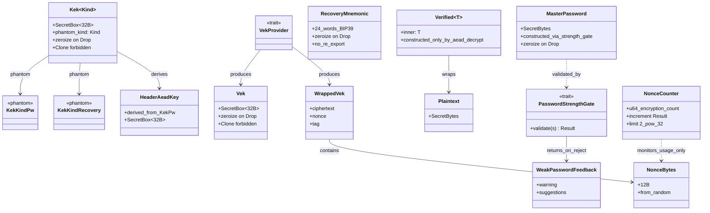
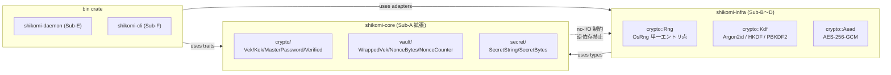

# 基本設計書

<!-- 詳細設計書（detailed-design/ ディレクトリ）とは別ファイル。統合禁止 -->
<!-- 詳細設計は Sub-A Rev1 で 4 分冊化: detailed-design/{index,crypto-types,password,nonce-and-aead,errors-and-contracts}.md -->
<!-- feature: vault-encryption / Epic #37 -->
<!-- 配置先: docs/features/vault-encryption/basic-design.md -->
<!-- 本書は Sub-A (#39) 着手時に新規作成。Sub-A スコープ（shikomi-core 暗号ドメイン型 + ゼロ化契約）の基本設計を確定する。
     Sub-B〜F の本文は各 Sub の設計工程で本ファイルを READ → EDIT で追記する。 -->

## 記述ルール（必ず守ること）

基本設計に**疑似コード・サンプル実装（python/ts/go等の言語コードブロック）を書くな**。
ソースコードと二重管理になりメンテナンスコストしか生まない。

## モジュール構成

本 Sub-A は `shikomi-core` crate 内の暗号ドメイン型を確定する。Issue #7（vault feature）で **`KdfSalt` / `WrappedVek` / `CipherText` / `Aad` / `NonceBytes` / `NonceCounter` / `SecretString` / `SecretBytes` / `VekProvider` trait は既に実装済**。本 Sub では**鍵階層上位型（`Vek` / `Kek` / `MasterPassword` / `RecoveryMnemonic`）と Fail-Secure 型（`Verified<T>` / `Plaintext`）を新規追加**し、Sub-0 凍結整合のため**既存 `NonceCounter` の責務を再定義**する（Boy Scout Rule）。

| 機能ID | モジュール | ディレクトリ | 責務 | Sub-A での扱い |
|--------|----------|------------|------|--------------|
| REQ-S02 | `shikomi_core::crypto::key` | `crates/shikomi-core/src/crypto/key.rs` | `Vek` / `Kek<KekKindPw>` / `Kek<KekKindRecovery>` の鍵階層型 | **新規追加** |
| REQ-S02 | `shikomi_core::crypto::password` | `crates/shikomi-core/src/crypto/password.rs` | `MasterPassword`（強度検証契約付き） / `PasswordStrengthGate` trait | **新規追加** |
| REQ-S02 | `shikomi_core::crypto::recovery` | `crates/shikomi-core/src/crypto/recovery.rs` | `RecoveryMnemonic`（24 語、再表示不可契約） | **新規追加** |
| REQ-S17 | `shikomi_core::crypto::verified` | `crates/shikomi-core/src/crypto/verified.rs` | `Verified<T>` / `Plaintext` Fail-Secure newtype | **新規追加** |
| REQ-S02 | `shikomi_core::crypto::header_aead` | `crates/shikomi-core/src/crypto/header_aead.rs` | `HeaderAeadKey` 型（Sub-0 凍結のヘッダ AEAD = KEK_pw 流用契約の型表現） | **新規追加** |
| REQ-S14 | `shikomi_core::vault::nonce` | `crates/shikomi-core/src/vault/nonce.rs` | `NonceCounter` の責務再定義（暗号化回数監視のみ）、`NonceBytes::from_random([u8;12])` 追加 | **既存改訂**（Boy Scout Rule） |
| REQ-S02 | `shikomi_core::vault::crypto_data` | `crates/shikomi-core/src/vault/crypto_data.rs` | `WrappedVek` 内部構造の分離型化（ciphertext + nonce + tag） | **既存改訂**（Boy Scout Rule） |
| REQ-S08（trait のみ） | `shikomi_core::crypto::password` | 同上 | `PasswordStrengthGate` trait シグネチャ確定（**実装は Sub-B、Boy Scout Rule で旧 Sub-D 担当を再分配**） | **新規追加（trait のみ）** |
| 全 Sub | `shikomi_core::crypto` | `crates/shikomi-core/src/crypto/mod.rs` | 暗号ドメイン型のエントリ。`shikomi_core` ルートから再エクスポート | **新規追加** |
| REQ-S03 | `shikomi_infra::crypto::kdf::argon2id` | `crates/shikomi-infra/src/crypto/kdf/argon2id.rs` | `Argon2idAdapter`（パスワード → KEK_pw、`m=19456, t=2, p=1`、RFC 9106 KAT、criterion p95 1 秒） | **Sub-B 新規追加** |
| REQ-S04 | `shikomi_infra::crypto::kdf::bip39_pbkdf2_hkdf` | `crates/shikomi-infra/src/crypto/kdf/bip39_pbkdf2_hkdf.rs` | `Bip39Pbkdf2Hkdf`（24 語 → seed → KEK_recovery、HKDF info `b"shikomi-kek-v1"`、trezor + RFC 5869 KAT） | **Sub-B 新規追加** |
| REQ-S02 / 全 Sub | `shikomi_infra::crypto::rng` | `crates/shikomi-infra/src/crypto/rng.rs` | `Rng`（`rand_core::OsRng` + `getrandom` バックエンド、`generate_kdf_salt` / `generate_vek` / `generate_nonce_bytes` / `generate_mnemonic_entropy` の単一エントリ点、Sub-0 凍結文言「`KdfSalt::generate()` 単一コンストラクタ」の Clean Arch 整合的物理実装） | **Sub-B 新規追加** |
| REQ-S08（実装） | `shikomi_infra::crypto::password::zxcvbn_gate` | `crates/shikomi-infra/src/crypto/password/zxcvbn_gate.rs` | `ZxcvbnGate`（zxcvbn 強度 ≥ 3、英語 raw `Feedback` をそのまま運ぶ、i18n は呼出側責務） | **Sub-B 新規追加（旧 Sub-D 担当の Boy Scout Rule 再分配）** |
| REQ-S05 | `shikomi_core::crypto::aead_key` | `crates/shikomi-core/src/crypto/aead_key.rs` | `AeadKey` trait（`with_secret_bytes` クロージャインジェクション、Sub-B Rev2 可視性ポリシー差別化との整合） | **Sub-C 新規追加（Boy Scout Rule、shikomi-core 側に trait のみ、impl は `Vek` / `Kek<_>` / `HeaderAeadKey`）** |
| REQ-S05 | `shikomi_infra::crypto::aead::aes_gcm` | `crates/shikomi-infra/src/crypto/aead/aes_gcm.rs` | `AesGcmAeadAdapter`（AES-256-GCM、`encrypt_record` / `decrypt_record` / `wrap_vek` / `unwrap_vek` 4 メソッド、AAD = `Aad::to_canonical_bytes()` 26B、NIST CAVP KAT、`Zeroizing<Vec<u8>>` 中間バッファ） | **Sub-C 新規追加** |
| REQ-S05 / REQ-S14 | `shikomi_core::crypto::key` / `shikomi_core::crypto::header_aead` | 上記 `key.rs` / `header_aead.rs` | `Vek` / `Kek<KekKindPw>` / `Kek<KekKindRecovery>` への `AeadKey` impl 追加（**`expose_within_crate` の `pub(crate)` 可視性は変更せず**、trait 経由のみ外部 crate に開放） | **Sub-C で Boy Scout 改訂**（`HeaderAeadKey` impl は Sub-D で同形パターン追加） |
| REQ-S06 | `shikomi_core::vault::header` | `crates/shikomi-core/src/vault/header.rs` | `VaultEncryptedHeader`（version / created_at / kdf_salt / wrapped_vek_by_pw / wrapped_vek_by_recovery / nonce_counter / kdf_params / header_aead_envelope）/ `KdfParams { m, t, p }`（`Argon2idParams::FROZEN_OWASP_2024_05` の永続化形）/ `HeaderAeadEnvelope { ciphertext, nonce, tag }`（ヘッダ独立 AEAD タグ） | **Sub-D 新規追加 / Boy Scout**（既存 `VaultHeader::Encrypted` skeleton を完成形に） |
| REQ-S06 | `shikomi_core::vault::record` | `crates/shikomi-core/src/vault/record.rs` | `EncryptedRecord` 追加（既存 `PlaintextRecord` と並列、`Record::Encrypted(EncryptedRecord)` variant）| **Sub-D 新規追加 / Boy Scout** |
| REQ-S13 | `shikomi_core::vault::recovery_disclosure` | `crates/shikomi-core/src/vault/recovery_disclosure.rs` | `RecoveryDisclosure` / `RecoveryWords`（24 語初回 1 度表示の型レベル強制、`disclose(self)` 所有権消費 + `Display` / `Serialize` 未実装で永続化禁止）| **Sub-D 新規追加** |
| REQ-S05 | `shikomi_core::crypto::header_aead` | 上記 `header_aead.rs` | `HeaderAeadKey` への `AeadKey` impl 追加（Sub-C で予告した Boy Scout 完成）| **Sub-D で Boy Scout 改訂** |
| REQ-S06 / REQ-S07 | `shikomi_infra::persistence::vault_migration` | `crates/shikomi-infra/src/persistence/vault_migration/{mod,encrypt_flow,decrypt_flow,rekey_flow}.rs` | `VaultMigration` service（`encrypt_vault` / `decrypt_vault` / `unlock_with_password` / `unlock_with_recovery` / `rekey` / `change_password` の 6 メソッド、`Argon2idHkdfVekProvider` + `AesGcmAeadAdapter` + `Rng` + `ZxcvbnGate` を組合せ）| **Sub-D 新規追加** |
| REQ-S07 | `shikomi_infra::persistence::sqlite::*` | 既存 `mod.rs` / `mapping.rs` / `schema.rs` | 暗号化モード分岐の解禁（`UnsupportedYet` 即 return 削除、`VaultEncryptedHeader` ↔ vault_header 行 / `EncryptedRecord` ↔ records 行の `Mapping` 拡張、`PRAGMA user_version` bump で `kdf_params` / `header_aead_*` カラム追加）| **Sub-D で改訂**（横断的変更、`vault-persistence` feature への影響） |
| REQ-S06 | `shikomi_infra::persistence::vault_migration::error` | `crates/shikomi-infra/src/persistence/vault_migration/error.rs` | `MigrationError` 列挙型追加（**9 variants** + `#[non_exhaustive]`）: `Crypto(#[from] CryptoError)` / `Persistence(#[from] PersistenceError)` / `Domain(#[from] DomainError)` / `AlreadyEncrypted` / `NotEncrypted` / `PlaintextNotUtf8` / `RecoveryAlreadyConsumed` / `AtomicWriteFailed { stage: AtomicWriteStage, source: io::Error }` / `RecoveryRequired`。`AtomicWriteStage` は vault-persistence 既存型（**6 値**: `PrepareNew` / `WriteTemp` / `FsyncTemp` / `FsyncDir` / `Rename` / `CleanupOrphan`）を transitive 利用。+ `DecryptConfirmation` 型レベル二段確認証跡（`_private: ()` 非可視性 + `confirm() -> Self` 引数ゼロ、確認ロジックは Sub-F 責務、`detailed-design/repository-and-migration.md` §`DecryptConfirmation` 参照）| **Sub-D 新規追加** |

```
ディレクトリ構造（Sub-A 完了時点、+ が新規、~ が改訂）:
crates/shikomi-core/src/
  lib.rs                  ~  pub use crypto::* を追記
  error.rs                ~  CryptoError バリアント追加（WeakPassword / NonceLimitExceeded / VerifyRequired）
  secret/
    mod.rs                    既存（無変更）
  vault/
    mod.rs                    既存（VekProvider trait 拡張のみ）
    crypto_data.rs        ~  WrappedVek の内部構造を分離型化
    nonce.rs              ~  NonceCounter 責務再定義 + NonceBytes::from_random 追加
    header.rs / record/        既存（無変更）
  crypto/                +  本 Sub-A 新規モジュール
    mod.rs               +  鍵階層・Verified・PasswordStrengthGate の再エクスポート
    key.rs               +  Vek / Kek<KekKindPw> / Kek<KekKindRecovery> 鍵階層型
    password.rs          +  MasterPassword / PasswordStrengthGate trait / WeakPasswordFeedback
    recovery.rs          +  RecoveryMnemonic（24 語）
    verified.rs          +  Verified<T> / Plaintext Fail-Secure newtype
    header_aead.rs       +  HeaderAeadKey 型（Sub-0 凍結のヘッダ AEAD 鍵経路）

ディレクトリ構造（Sub-B 完了時点、+ が新規）:
crates/shikomi-infra/src/
  lib.rs                  ~  pub use crypto::* を追記
  crypto/                +  本 Sub-B 新規モジュール（暗号アダプタ層）
    mod.rs               +  rng / kdf / password の再エクスポート
    rng.rs               +  Rng (OsRng 単一エントリ点) / generate_kdf_salt / generate_vek / generate_nonce_bytes / generate_mnemonic_entropy
    kdf/                 +  KDF アダプタ
      mod.rs             +  Argon2idAdapter / Bip39Pbkdf2Hkdf 再エクスポート
      argon2id.rs        +  Argon2idAdapter + Argon2idParams::FROZEN_OWASP_2024_05 const
      bip39_pbkdf2_hkdf.rs +  Bip39Pbkdf2Hkdf + HKDF_INFO const (b"shikomi-kek-v1")
      kat.rs             +  RFC 9106 / trezor / RFC 5869 KAT データ (test cfg)
    password/            +  パスワード強度ゲート
      mod.rs             +  ZxcvbnGate 再エクスポート
      zxcvbn_gate.rs     +  ZxcvbnGate (PasswordStrengthGate 具象実装、min_score = 3)
    vek_provider.rs      +  Argon2idHkdfVekProvider (shikomi_core::VekProvider 具象実装、Sub-C/D で wrap 経路を結合)
  benches/                + 
    argon2id.rs          +  criterion benchmark (p95 ≤ 1.0 秒、CI bench-kdf job で必須 pass)

ディレクトリ構造（Sub-C 完了時点、+ が新規、~ が改訂）:
crates/shikomi-core/src/
  crypto/
    aead_key.rs          +  AeadKey trait（with_secret_bytes クロージャインジェクション、Sub-C 新規）
    key.rs               ~  Vek / Kek<_> に AeadKey impl 追加（Boy Scout、expose_within_crate は pub(crate) 維持）
    header_aead.rs       ~  HeaderAeadKey に AeadKey impl 追加は Sub-D 担当（Boy Scout 予告のみ）
    mod.rs               ~  pub use aead_key::AeadKey を追記
crates/shikomi-infra/src/
  crypto/
    aead/                +  本 Sub-C 新規モジュール
      mod.rs             +  AesGcmAeadAdapter 再エクスポート
      aes_gcm.rs         +  AesGcmAeadAdapter（encrypt_record / decrypt_record / wrap_vek / unwrap_vek 4 メソッド、Zeroizing<Vec<u8>> 中間バッファ）
      kat.rs             +  NIST CAVP gcmEncryptExtIV256.rsp / gcmDecrypt256.rsp 抜粋 const 配列（test cfg、各 8 件以上）
    vek_provider.rs      ~  derive_new_wrapped_pw / derive_new_wrapped_recovery の AES-GCM wrap 経路を AesGcmAeadAdapter::wrap_vek 経由で確定（Sub-B 段階の TBD を Sub-C で完成）
  Cargo.toml             ~  aes-gcm minor pin + rand_core minor pin + subtle major pin v2.5+ を [dependencies] に追加
```

**モジュール設計方針**:

- 暗号ドメイン型は `shikomi_core::crypto` 配下に集約。**`shikomi_core::vault` は vault 集約・レコード・ヘッダなどの「データ集約」を担当**、`shikomi_core::crypto` は「鍵階層と暗号操作の型契約」を担当する責務分離（Clean Architecture / SRP）
- 既存の `vault::crypto_data` / `vault::nonce` は **「vault ヘッダ / レコードの構成データ」として `vault` 配下に残し**、新規 `crypto::key` 等は「鍵階層」として独立させる。`Vek` は vault データではなく**鍵そのもの**であり、`crypto` 配下に置くのが意味論的に正しい
- shikomi-core は **pure Rust / no-I/O 制約を維持**。`rand_core::OsRng` 呼出は禁止。CSPRNG が必要な構築（`KdfSalt` / `Vek` / `NonceBytes`）は呼び出し側（`shikomi-infra::crypto::Rng` 単一エントリ点、Sub-B で実装）から供給される **`[u8;N]` 配列**を受け取る純粋コンストラクタのみ提供
- **Sub-0 凍結文言「`KdfSalt::generate()` 単一コンストラクタ」の Clean Architecture 整合的再解釈**: `shikomi-core` 側は raw bytes 受取コンストラクタ（既存 `KdfSalt::try_new(&[u8])`）のみ提供、**`shikomi-infra::crypto::Rng::generate_kdf_salt() -> KdfSalt`** が「単一エントリ点」を担う。本 Sub-A 設計書で**契約として固定**し、ad-hoc な byte 配列からの構築は CI grep + clippy lint で検出する（具体ルールは Sub-B / Sub-D 設計時に確定）
- 不変条件（構築時検証）を持つ型は**別ファイル**に分けてファイル粒度を揃える（Issue #7 の方針継承）。テストも同ファイルに併置（`#[cfg(test)] mod tests`）

## クラス設計（概要）

Sub-A 完了時の暗号ドメイン型と既存 vault ドメイン型の関係を Mermaid クラス図で示す。メソッドシグネチャは詳細設計書（`detailed-design/index.md` および各分冊 `crypto-types.md` / `password.md` / `nonce-and-aead.md` / `errors-and-contracts.md`）を参照。



## アーキテクチャへの影響

`docs/architecture/` 本文への変更は**なし**（Sub-B でも tech-stack の version pin / crate 候補は §4.7 で既に確定済、新規 crate 導入なし、`argon2` / `pbkdf2` / `hkdf` / `bip39` / `rand_core` / `getrandom` / `zxcvbn` は §4.3.2 暗号クリティカル登録済）。**`shikomi-infra/Cargo.toml` への dependency 追加のみ**（実装工程で実施）。

ただし、**Clean Architecture 依存方向の追加経路**を明示:



- shikomi-core は **OS / I/O / 乱数 syscall を持たない**
- `shikomi-infra::crypto::Rng` が **OsRng 単一エントリ点**を保有し、`generate_vek()` / `generate_kdf_salt()` / `generate_nonce_bytes()` を提供（Sub-B 設計時に詳細化）
- ad-hoc な byte 配列からの `Vek::from_array` 等の直接構築は**テストモジュール以外で禁止**（Sub-B / Sub-D で CI grep + clippy lint ルール確定）

## ER図

Sub-A 型の集約関係（暗号メタデータ ER）。永続化スキーマは Sub-D で確定するため、本書では**型相互の関係**のみ示す。

```mermaid
erDiagram
    VAULT ||--o| HEADER_ENCRYPTED : has
    HEADER_ENCRYPTED ||--|| KDF_SALT : contains
    HEADER_ENCRYPTED ||--|| WRAPPED_VEK_PW : contains
    HEADER_ENCRYPTED ||--|| WRAPPED_VEK_RECOVERY : contains
    HEADER_ENCRYPTED ||--|| NONCE_COUNTER : tracks
    WRAPPED_VEK_PW ||--|| NONCE_BYTES : uses
    WRAPPED_VEK_RECOVERY ||--|| NONCE_BYTES : uses
    RECORD ||--|| ENCRYPTED_PAYLOAD : has
    ENCRYPTED_PAYLOAD ||--|| CIPHER_TEXT : contains
    ENCRYPTED_PAYLOAD ||--|| NONCE_BYTES : contains
    ENCRYPTED_PAYLOAD ||--|| AAD : contains

    VAULT {
        VaultHeader header
        Vec_Record records
    }
    HEADER_ENCRYPTED {
        VaultVersion version
        OffsetDateTime created_at
        KdfSalt kdf_salt
        WrappedVek wrapped_vek_by_pw
        WrappedVek wrapped_vek_by_recovery
        NonceCounter nonce_counter
    }
    WRAPPED_VEK_PW {
        Vec_u8 ciphertext
        NonceBytes nonce
        16B tag
    }
    NONCE_COUNTER {
        u64 encryption_count
        constraint upper_bound_2_pow_32
    }
    NONCE_BYTES {
        12B random_from_OsRng
    }
    KDF_SALT {
        16B from_OsRng
    }
```

**揮発鍵階層型（永続化されない、ER 図対象外）**:

- `Vek`（32B、daemon RAM のみ、unlock〜lock 間滞留）
- `Kek<KekKindPw>`（32B、Argon2id 完了 → wrap/unwrap 完了で zeroize、滞留 < 1 秒）
- `Kek<KekKindRecovery>`（32B、HKDF 完了 → wrap/unwrap 完了で zeroize、滞留 < 1 秒）
- `HeaderAeadKey`（32B、KEK_pw 流用、ヘッダ AEAD 検証完了で zeroize）
- `MasterPassword`（任意長 SecretBytes、入力 → KDF 完了で zeroize）
- `RecoveryMnemonic`（24 語、生成 → 表示完了 → zeroize、再表示不可）
- `Plaintext`（任意長 SecretBytes、レコード復号 → 投入完了 → 30 秒クリップボードクリア後 zeroize）
- `Verified<Plaintext>`（`Plaintext` のラッパ、寿命は内包する `Plaintext` に従属）

