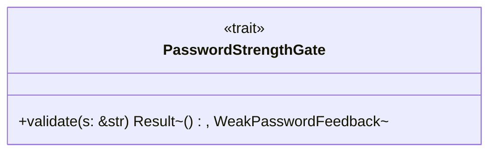
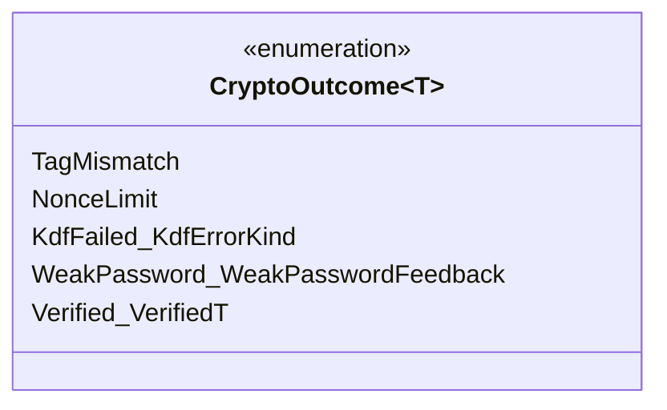
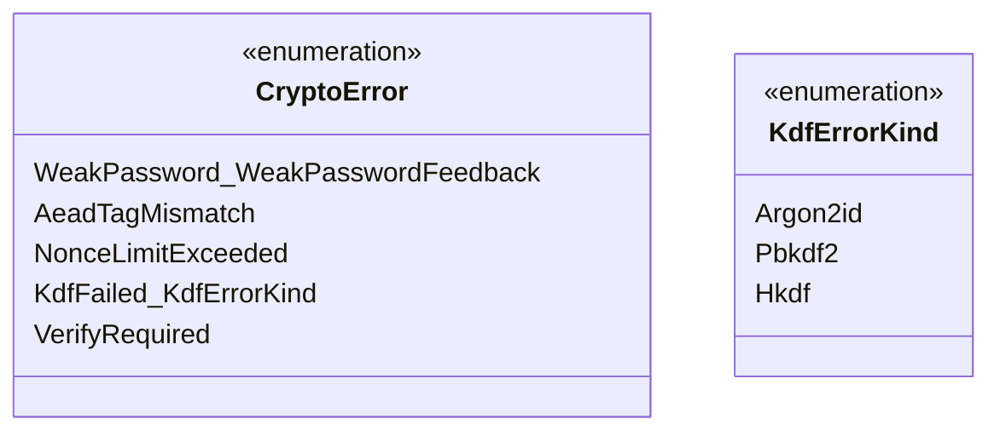

# 詳細設計書

<!-- 基本設計書とは別ファイル。統合禁止 -->
<!-- feature: vault-encryption / Epic #37 -->
<!-- 配置先: docs/features/vault-encryption/detailed-design.md -->
<!-- 本書は Sub-A (#39) 着手時に新規作成。Sub-A スコープの詳細設計を確定する。
     Sub-B〜F の本文は各 Sub の設計工程で本ファイルを READ → EDIT で追記する。 -->

## 記述ルール（必ず守ること）

詳細設計に**疑似コード・サンプル実装（python/ts/go等の言語コードブロック）を書くな**。
ソースコードと二重管理になりメンテナンスコストしか生まない。

## クラス設計（詳細）

### Sub-A 暗号ドメイン型の全 public API

```mermaid
classDiagram
    class Vek {
        -inner: SecretBox~ZeroizingArray32~
        +from_array(bytes: [u8;32]) Vek
        +expose_within_crate() &[u8;32]
        +Drop : zeroize 32B
        +Debug : '[REDACTED VEK]' fixed
        +Clone : NOT IMPLEMENTED
        +Display : NOT IMPLEMENTED
        +Serialize : NOT IMPLEMENTED
    }
    class Kek~Kind~ {
        -inner: SecretBox~ZeroizingArray32~
        -kind: PhantomData~Kind~
        +from_array(bytes: [u8;32]) Kek~Kind~
        +expose_within_crate() &[u8;32]
        +Drop : zeroize 32B
        +Debug : '[REDACTED KEK]' fixed
        +Clone : NOT IMPLEMENTED
    }
    class KekKindPw {
        <<phantom marker>>
    }
    class KekKindRecovery {
        <<phantom marker>>
    }
    class HeaderAeadKey {
        -inner: SecretBox~ZeroizingArray32~
        +from_kek_pw(kek: &Kek~KekKindPw~) HeaderAeadKey
        +expose_within_crate() &[u8;32]
        +Drop : zeroize 32B
    }
    class MasterPassword {
        -inner: SecretBytes
        +new(s: String, gate: &dyn PasswordStrengthGate) Result~MasterPassword, CryptoError~
        +expose_secret_bytes_within_crate() &[u8]
        +Drop : zeroize via SecretBytes
        +Debug : '[REDACTED MASTER PASSWORD]' fixed
    }
    class PasswordStrengthGate {
        <<trait>>
        +validate(s: &str) Result~(), WeakPasswordFeedback~
    }
    class WeakPasswordFeedback {
        +warning: Option~String~
        +suggestions: Vec~String~
    }
    class RecoveryMnemonic {
        -words: SecretBox~Zeroizing24Words~
        +from_words(words: [String; 24]) Result~RecoveryMnemonic, CryptoError~
        +expose_words_within_crate() &[String; 24]
        +Drop : zeroize each word
        +Debug : '[REDACTED MNEMONIC]' fixed
        +Clone : NOT IMPLEMENTED
    }
    class Plaintext {
        -inner: SecretBytes
        +Drop : zeroize via SecretBytes
        +Debug : '[REDACTED PLAINTEXT]' fixed
    }
    class Verified~T~ {
        -inner: T
        +new_from_aead_decrypt(t: T) Verified~T~
        +into_inner() T
        +Debug : delegates to inner T
    }
    class CryptoOutcome~T~ {
        <<enumeration>>
        TagMismatch
        NonceLimit
        KdfFailed_KdfErrorKind
        WeakPassword_WeakPasswordFeedback
        Verified_VerifiedT
    }
    class NonceCounter {
        -count: u64
        +new() NonceCounter
        +resume(count: u64) NonceCounter
        +increment() Result~(), DomainError~
        +current() u64
    }
    class NonceBytes {
        -inner: [u8; 12]
        +try_new(bytes: &[u8]) Result~NonceBytes, DomainError~
        +from_random(bytes: [u8; 12]) NonceBytes
        +as_array() &[u8; 12]
    }
    class WrappedVek {
        -ciphertext: Vec~u8~
        -nonce: NonceBytes
        -tag: AuthTag
        +new(ct: Vec~u8~, nonce: NonceBytes, tag: AuthTag) Result~WrappedVek, DomainError~
        +ciphertext() &[u8]
        +nonce() &NonceBytes
        +tag() &AuthTag
    }
    class AuthTag {
        -inner: [u8; 16]
        +try_new(bytes: &[u8]) Result~AuthTag, DomainError~
    }

    Kek~Kind~ ..> KekKindPw : phantom
    Kek~Kind~ ..> KekKindRecovery : phantom
    MasterPassword ..> PasswordStrengthGate : requires
    PasswordStrengthGate --> WeakPasswordFeedback : Err
    HeaderAeadKey ..> Kek~KekKindPw~ : derives
    Verified~T~ --> Plaintext : wraps
    CryptoOutcome~T~ --> Verified~T~ : variant
    CryptoOutcome~T~ --> WeakPasswordFeedback : variant
    WrappedVek --> NonceBytes : owns
    WrappedVek --> AuthTag : owns
```

### 設計判断の補足

#### なぜ `Vek` を独立 newtype にするか（既存 `SecretBytes` で済まさない）

- **意味論的区別**: `SecretBytes` は「任意長の秘密バイト列」。`Vek` は「**32 byte 固定の VEK 本体**」。型シグネチャ上で「VEK を渡す」と「任意秘密を渡す」が混同されると、Sub-B の `wrap_with_kek_pw(vek: &SecretBytes, kek: &Kek<KekKindPw>) -> WrappedVek` のような関数でうっかり `MasterPassword` を渡しても通ってしまう
- **Drop 時 zeroize の経路保証**: `SecretBytes` の Drop は内部 `String` の zeroize を経由する間接経路。`Vek` は **`[u8;32]` を直接 `Zeroizing<[u8;32]>` で保持**することで、`Drop` 時の zeroize 範囲が静的に確定する（ヒープ上の連続 32 byte のみ）
- **`expose_within_crate()` の境界制御**: `Vek` 内部の `[u8;32]` 取り出しは `pub(crate)` 可視性に制限。**外部 crate からは取り出せない**ため、誤って `bin` crate（CLI / GUI）が VEK 生バイトを触る経路を**型レベルで禁止**。Sub-B / Sub-D の AEAD 操作実装のみが crate 内アクセス可能

#### なぜ `Kek<Kind>` を phantom-typed にするか

- **取り違え禁止**: KEK_pw（Argon2id 由来）と KEK_recovery（PBKDF2+HKDF 由来）は同じ 32 byte の鍵だが、**用途が異なる**。`wrapped_VEK_by_pw` は `KekPw` でしか復号してはいけない、`wrapped_VEK_by_recovery` は `KekRecovery` でしか復号してはいけない。実装ミスで取り違えると、復号は AEAD タグ検証で失敗するが、エラー文言が「タグ不一致」となり**真因（鍵経路の取り違え）が隠蔽される**
- **コンパイルエラーで弾く**: `unwrap_with(wrapped: &WrappedVek, kek: &Kek<KekKindPw>)` のような関数シグネチャに `Kek<KekKindRecovery>` を渡すと**コンパイルエラー**になる
- **代替案との比較**: enum `enum Kek { Pw([u8;32]), Recovery([u8;32]) }` 案も検討したが、(a) match のたびに「これは Pw か Recovery か」の runtime 分岐が増える、(b) フィールド型は同じなので enum での区別は意味論のみで型安全性ゼロ、(c) phantom-typed なら関数シグネチャで型を確定でき DRY、の 3 点で phantom-typed を採用

#### なぜ `MasterPassword::new` が `&dyn PasswordStrengthGate` を要求するか

- **Clean Architecture**: zxcvbn 実装を `shikomi-core` に持ち込むと「pure Rust / no-I/O」の制約と整合しなくなる（zxcvbn 自体は no-I/O だが、辞書データを抱えバイナリサイズ影響大、§4.7 で `shikomi-infra` 配置確定）。trait 抽象で **shikomi-core 側は契約のみ**を持ち、実装は `shikomi-infra::crypto::ZxcvbnGate` が提供する依存性逆転
- **テスト容易性**: テストで `AlwaysAcceptGate` / `AlwaysRejectGate` を差し込み、`MasterPassword::new` の経路網羅を I/O なしで検証可能
- **strict gate / lenient gate の交換可能性**: 将来「企業ポリシーで強度 ≥ 4 を要求する deployment」が出た場合、ゲート実装を交換するだけで済む
- **`Box<dyn Trait>` ではなく `&dyn Trait`**: 構築毎にゲート所有権を移動させる必要はなく、参照で十分。zero-cost に近い

#### なぜ `Verified<T>` のコンストラクタを `pub(crate)` にするか

- **構築可能経路の限定**: `Verified<Plaintext>` を構築できるのは `shikomi-core` crate 内の関数のみ。`shikomi-core::crypto::aead_decrypt(...)` 相当の関数（実装は Sub-C の `shikomi-infra` から `shikomi-core` の `pub(crate)` 経路を呼ぶ形）でしか構築されない
- **ただし AEAD 計算自体は `shikomi-infra`**: ここに矛盾があるように見えるが、解決策は **`shikomi-core::crypto::verified` 内に `pub(crate) fn new_verified_from_aead_result(t: T) -> Verified<T>` を置き、`shikomi-infra` がこの関数を呼ぶには `shikomi-core` を経由する必要がある**。具体的には:
  - shikomi-core 側に `pub fn verify_aead_decrypt<F>(decrypt_fn: F) -> Result<Verified<Plaintext>, CryptoError> where F: FnOnce() -> Result<Plaintext, CryptoError>` のような**ラッパ関数**を提供
  - shikomi-infra 側は `shikomi_core::verify_aead_decrypt(|| do_aes_gcm_decrypt(...))` という形で呼ぶ
  - こうすると `Verified::new_from_aead_decrypt` は `shikomi-core` 内部からしか呼ばれない経路を保証できる
- **代替案**: `Verified::new_unchecked` を `pub` にして「呼び出し側に検証義務を注意書き」する設計は **コメントベース安全性**で型保証がゼロ。本設計は型保証を取る

#### なぜ `WrappedVek` の内部構造を分離型化するか（Boy Scout Rule）

- **既存 `WrappedVek` の問題**: 内部が `Vec<u8>` 単一フィールド（ciphertext + nonce + tag を連結）。Sub-D の AEAD 復号時に「tag は末尾 16 byte、nonce は手前 12 byte、残りが ciphertext」のような **byte offset 演算が呼び出し側に漏れ出す**
- **改善後**: `WrappedVek { ciphertext: Vec<u8>, nonce: NonceBytes, tag: AuthTag }` の 3 フィールド構造。byte offset 演算は **`WrappedVek::new` / `into_parts` に閉じる**（Tell, Don't Ask）
- **後方互換**: Issue #7 時点で `WrappedVek` を実際に AEAD 復号に使った呼出元は **存在しない**（永続化層 `vault-persistence` は `WrappedVek` を生バイトとして読み書きするのみ）。Sub-A 時点での破壊変更は安全
- **永続化フォーマット**: SQLite カラムは引き続き `wrapped_vek_pw BLOB` 単一カラムで OK（Sub-D で `WrappedVek` 全体を 1 BLOB にシリアライズ / デシリアライズする経路を確定）

#### なぜ `NonceCounter` の責務を再定義するか（Boy Scout Rule）

- **Sub-0 凍結との不整合**: 既存実装は「8B random prefix + 4B u32 counter」で nonce 値そのものを生成する設計。一方 Sub-0 凍結は **「random nonce 12B + 別軸の暗号化回数監視カウンタ」**
- **新しい責務**: `NonceCounter` は「**この VEK で何回暗号化したか**を u64 で数えるだけ」。nonce 値生成には**関与しない**
- **API 破壊変更**: `NonceCounter::next() -> Result<NonceBytes, DomainError>` を削除し、`NonceCounter::increment() -> Result<(), DomainError>` に置換。`new()` / `resume()` / `current()` は維持（u32 → u64 型変更）
- **既存呼出元なし**: Issue #7 時点で `NonceCounter::next()` を呼ぶ実装は存在しない（テスト除く）。Sub-A 時点で安全に書き換え可能
- **永続化との整合**: vault ヘッダの `nonce_counter` カラムは Sub-D で **`u32` → `u64` に拡張**（既存は未使用カラムなので破壊変更影響なし）

## データ構造

| 名前 | 型 | 用途 | デフォルト値 |
|------|---|------|------------|
| `Vek` 内部表現 | `SecretBox<Zeroizing<[u8; 32]>>` | VEK 本体（AES-256 鍵） | コンストラクタで明示供給（CSPRNG 経由 / unwrap 結果経由） |
| `Kek<Kind>` 内部表現 | `(SecretBox<Zeroizing<[u8; 32]>>, PhantomData<Kind>)` | KEK 本体（KDF 出力） | コンストラクタで明示供給 |
| `HeaderAeadKey` 内部表現 | `SecretBox<Zeroizing<[u8; 32]>>` | ヘッダ AEAD タグ検証用鍵 | `Kek<KekKindPw>` から `from_kek_pw` で派生（同じ鍵バイトを持つが**用途別の型**として分離、`expose` 経路は `pub(crate)` のみ） |
| `MasterPassword` 内部表現 | `SecretBytes` | ユーザ入力パスワード | コンストラクタで明示供給（強度ゲート通過後のみ） |
| `RecoveryMnemonic` 内部表現 | `SecretBox<Zeroizing<[String; 24]>>` | BIP-39 24 語 | コンストラクタで明示供給（BIP-39 検証通過後のみ、Sub-B で詳細化） |
| `Plaintext` 内部表現 | `SecretBytes` | レコード復号後の平文 | `Verified<Plaintext>::into_inner()` 経由でのみ取り出し可 |
| `Verified<T>` 内部表現 | `T`（ジェネリクス） | AEAD 検証済みマーカ | `pub(crate) fn new_from_aead_decrypt(t: T)` でのみ構築 |
| `WeakPasswordFeedback` フィールド | `{ warning: Option<String>, suggestions: Vec<String> }` | zxcvbn の `feedback` 構造をそのまま運ぶ | `PasswordStrengthGate::validate` の `Err` 内 |
| `NonceCounter::count` | `u64` | この VEK での暗号化回数 | `0`（`NonceCounter::new()`） |
| `NonceCounter::LIMIT` | `u64` 定数 | 上限値 | `1u64 << 32`（= $2^{32}$） |
| `NonceBytes::inner` | `[u8; 12]` | per-record AEAD nonce | コンストラクタ供給（`from_random` / `try_new`） |
| `WrappedVek::ciphertext` | `Vec<u8>` | AEAD 暗号文 | `WrappedVek::new` |
| `WrappedVek::tag` | `AuthTag([u8; 16])` | GCM 認証タグ | `WrappedVek::new` |
| `KdfSalt::inner` | `[u8; 16]` | Argon2id 入力 salt | 既存維持（`KdfSalt::try_new`） |

## ビジュアルデザイン

該当なし — 理由: UIなし

---

## Sub-A クラス・関数仕様

### `shikomi_core::crypto::key::Vek`

#### コンストラクタ

| 関数名 | 可視性 | シグネチャ概要 | 不変条件 / 契約 |
|-------|------|------------|--------------|
| `Vek::from_array` | `pub` | `[u8; 32]` を受取り `Vek` を返す。失敗しない（型レベルで 32B 強制） | 受取った `[u8; 32]` は内部 `SecretBox<Zeroizing<[u8;32]>>` に**ムーブ**される（呼び出し側のローカル変数も即 zeroize 対象に入るよう、呼び出し側は `[u8; 32]` を構築直後に `Vek::from_array` へ渡し、ローカルを `Zeroizing` でラップしておくこと。Sub-B 設計時に呼び出し側パターンを明示） |

#### 公開しない経路

- `expose_within_crate(&self) -> &[u8; 32]`: `pub(crate)` 可視性。`shikomi-core` 内部からのみ呼出可。`shikomi-infra` の AEAD 実装は本関数を呼べないが、Sub-C 設計時に「**`shikomi-core::crypto` 経由のラッパ関数**経由で間接アクセスする経路」を確定する（外部 crate に生バイトを渡す API は提供しない、`Verified<Plaintext>` で抽象化）

#### Drop 契約

- `Drop` 実装は内部 `SecretBox<Zeroizing<[u8;32]>>` の `Drop` に委譲。`Zeroizing` の `Drop` で 32B 全 zeroize
- `Drop` 順序保証: Rust 標準のドロップ順序（フィールド宣言順の逆順）。`Vek` は単一フィールドなので順序依存なし

#### 禁止トレイト

- `Clone`: **未実装**。複製禁止により VEK のメモリ滞留範囲を1箇所に限定
- `Copy`: 未実装（`Drop` 持つため不可、保証）
- `Display`: 未実装。誤フォーマット出力を**コンパイル時禁止**
- `serde::Serialize` / `serde::Deserialize`: 未実装。誤シリアライズを**コンパイル時禁止**
- `PartialEq` / `Eq`: 未実装（VEK 比較は `subtle::ConstantTimeEq` を Sub-B/C で使う、通常 `==` を**コンパイル時禁止**）

#### 提供トレイト

- `Debug`: `[REDACTED VEK]` 固定文字列を出力
- `Drop`: 上記

### `shikomi_core::crypto::key::Kek<Kind>`

#### 型定義

- `pub struct Kek<Kind: KekKind>(SecretBox<Zeroizing<[u8;32]>>, PhantomData<Kind>);`
- `pub trait KekKind: 'static + Sealed {}` — Sealed トレイトパターンで外部 crate での `KekKind` 実装を**禁止**
- `pub struct KekKindPw;` / `pub struct KekKindRecovery;` — 各々 `KekKind` を実装

#### コンストラクタ

| 関数名 | 可視性 | シグネチャ概要 | 不変条件 |
|-------|------|------------|--------|
| `Kek::<KekKindPw>::from_array` | `pub` | `[u8; 32]` 受取 | 32B 強制、`Vek` と同様 |
| `Kek::<KekKindRecovery>::from_array` | `pub` | `[u8; 32]` 受取 | 同上 |

#### 公開しない経路 / 禁止トレイト / 提供トレイト

- `Vek` と同等。`Debug` は `[REDACTED KEK<Pw>]` / `[REDACTED KEK<Recovery>]` のように**型パラメータごとに区別**して出力（Sub-D 設計時に Debug 文字列の機械検証ルール確定）

### `shikomi_core::crypto::header_aead::HeaderAeadKey`

#### 型定義 + コンストラクタ

- `pub struct HeaderAeadKey(SecretBox<Zeroizing<[u8;32]>>);`
- `pub fn from_kek_pw(kek: &Kek<KekKindPw>) -> HeaderAeadKey` — **同じ鍵バイトをコピー**して構築（`expose_within_crate` 経由で `[u8;32]` を読み出し、`HeaderAeadKey` 内に新 `SecretBox` を作る）
- 受け取り元の `Kek<KekKindPw>` は呼び出し側のスコープで生き続ける（参照のみ取る）。`HeaderAeadKey` の Drop は独立に発火し、`HeaderAeadKey` 用の 32B が独立に zeroize される

#### Sub-0 凍結の型表現

- Sub-0 §脅威モデル §4 L1 §対策(c) で凍結した「**ヘッダ AEAD タグの鍵 = KEK_pw 流用**、kdf_params 改竄は KDF 出力変化で間接検出」を**型レベルで強制**
- 具体的には: ヘッダ AEAD 検証関数（Sub-D 実装）は `unverify_header(&HeaderAeadKey, &EncryptedHeader) -> Result<Verified<DecryptedHeader>, CryptoError>` のシグネチャを取り、**`Kek<KekKindPw>` 直接ではなく `HeaderAeadKey` を要求**する。これにより「ヘッダ復号には KEK_pw 派生鍵」という設計制約が型レベルで明示される

### `shikomi_core::crypto::password::MasterPassword`

#### コンストラクタ

| 関数名 | 可視性 | シグネチャ概要 | 不変条件 |
|-------|------|------------|--------|
| `MasterPassword::new` | `pub` | `(s: String, gate: &dyn PasswordStrengthGate) -> Result<MasterPassword, CryptoError>` | `gate.validate(&s)` が `Ok(())` を返した場合のみ `MasterPassword` を構築。`Err` の場合 `CryptoError::WeakPassword(WeakPasswordFeedback)` を返し、入力 `s` は呼び出し直後に `zeroize` 推奨（呼び出し側責務、Sub-D 設計時に明示） |

#### 公開しない経路

- `expose_secret_bytes_within_crate(&self) -> &[u8]`: `pub(crate)`、Sub-B の Argon2id 入力に渡す経路用

#### 提供トレイト

- `Debug`: `[REDACTED MASTER PASSWORD]` 固定
- `Drop`: 内部 `SecretBytes` の zeroize 経路に委譲

#### 禁止トレイト

- `Clone` / `Display` / `serde::Serialize` 等は `Vek` と同等に未実装

### `shikomi_core::crypto::password::PasswordStrengthGate` trait

- **唯一のメソッド**: `fn validate(&self, password: &str) -> Result<(), WeakPasswordFeedback>;`
- **実装場所**: shikomi-core では trait シグネチャと `WeakPasswordFeedback` 型のみ定義。**実装（zxcvbn 呼出）は Sub-D の `shikomi-infra::crypto::ZxcvbnGate` 担当**（REQ-S08 の zxcvbn 呼出は Sub-D に残置 — Sub-A は trait のみ）
- **強度判定基準**: trait 自体は基準を持たない（実装が決定）。Sub-D の `ZxcvbnGate` 実装は zxcvbn 強度 ≥ 3 を採用（`tech-stack.md` §4.7 `zxcvbn` 行 / Sub-0 REQ-S08）

### `shikomi_core::crypto::password::WeakPasswordFeedback`

| フィールド | 型 | 用途 |
|----------|---|------|
| `warning` | `Option<String>` | zxcvbn の `feedback.warning`（単一の警告文）。「これは推測されやすいパスワードです」等の主要原因 |
| `suggestions` | `Vec<String>` | zxcvbn の `feedback.suggestions`（複数の改善提案）。「大文字を加えてください」「8 文字以上にしてください」等 |

- **Fail Kindly 契約**: Sub-D が `WeakPasswordFeedback` をそのまま MSG-S08 に渡す。文言加工（i18n / 抽象化）は Sub-D / Sub-F 設計で確定するが、**`warning` と `suggestions` の両方を必ずユーザに提示**する
- **派生**: `Debug` / `Clone`（フィードバック自体は秘密でない）/ `serde::Serialize`（IPC 経由で daemon → CLI / GUI に渡すため）

### `shikomi_core::crypto::recovery::RecoveryMnemonic`

#### 型定義

- `pub struct RecoveryMnemonic { words: SecretBox<Zeroizing<[String; 24]>> }` — 24 語固定長
- 各 `String` は BIP-39 wordlist 内の単語（検証は Sub-B の `bip39` crate 連携で実施、Sub-A では「24 語の文字列であること」のみ強制）

#### コンストラクタ

| 関数名 | 可視性 | シグネチャ概要 | 不変条件 |
|-------|------|------------|--------|
| `RecoveryMnemonic::from_words` | `pub` | `[String; 24]` を受取り `Result<RecoveryMnemonic, CryptoError>` | 配列長は型で 24 強制。各単語の BIP-39 wordlist 検証 / チェックサム検証は Sub-B（`bip39` crate）に委譲（Sub-A の `from_words` は文字列長 / ASCII 性のみ軽量検証） |

#### Drop 契約

- `Zeroizing<[String; 24]>` の `Drop` で各 `String` のヒープバッファが zeroize される
- **再構築不可**: 一度 `Drop` した `RecoveryMnemonic` は復元不能（永続化されない、Sub-0 REQ-S13 「初回 1 度のみ表示」契約を Sub-A 型レベルで担保）

#### 禁止トレイト / 提供トレイト

- `Clone` 未実装（誤コピーで滞留延長を禁止）、`Display` 未実装
- `Debug`: `[REDACTED MNEMONIC]` 固定

### `shikomi_core::crypto::verified::Verified<T>` / `Plaintext`

#### `Plaintext`

- `pub struct Plaintext { inner: SecretBytes }`
- コンストラクタ `pub(crate) fn new_within_crate(bytes: Vec<u8>) -> Plaintext`：`shikomi-core::crypto::verified` モジュール内のみで構築可
- 取り出し `pub fn expose_secret(&self) -> &[u8]`：`Plaintext` 自体は外部 crate で扱える（クリップボード投入時等に必要）が、構築経路を限定

#### `Verified<T>`

- `pub struct Verified<T> { inner: T }`
- コンストラクタ `pub(crate) fn new_from_aead_decrypt(inner: T) -> Verified<T>`：crate 内のみ
- `pub fn into_inner(self) -> T`：`Verified` を消費して中身を取り出す
- `pub fn as_inner(&self) -> &T`：参照アクセス（zeroize 前にレコード投入する経路で利用）

#### Sub-C 経由の構築経路（`shikomi-infra` 用）

- shikomi-core が提供するラッパ関数:
  - `pub fn verify_aead_decrypt<F, T, E>(decrypt_fn: F) -> Result<Verified<T>, E> where F: FnOnce() -> Result<T, E>`
- `shikomi-infra` の `aes_gcm` 復号は本関数の `decrypt_fn` クロージャ内で実行 → 成功時に `Verified<T>` で包まれて返る
- **副作用**: AEAD 検証 bypass の構造禁止（コンストラクタが crate 外から呼べないため、`shikomi-infra` も `verify_aead_decrypt` 経由でしか `Verified` を取得できない）

### `shikomi_core::crypto::verified::CryptoOutcome<T>` enum

- **目的**: Sub-C / Sub-D 実装で `match` 暗号アーム第一パターンを強制するための列挙型
- **記述順序**: `TagMismatch` / `NonceLimit` / `KdfFailed` / `WeakPassword` / `Verified(Verified<T>)` の **失敗バリアント先頭** で並べる。`Verified` 第一パターンの実装は clippy lint または PR レビューで却下（Boy Scout Rule）
- **ジェネリクス**: `T = Plaintext` を主用途、汎用化のため `T` でパラメタライズ
- **`Display`**: 各バリアントを `MSG-S0X` 系識別子に対応する文字列で出力（i18n は呼び出し側）

### `shikomi_core::vault::nonce::NonceCounter`（責務再定義、Boy Scout Rule）

#### 型定義（変更後）

- `pub struct NonceCounter { count: u64 }`
- 既存の `random_prefix: [u8; 8]` フィールドを**削除**（per-record nonce は完全 random 12B、prefix 共有しない）

#### メソッド

| 関数名 | 可視性 | シグネチャ | 仕様 |
|-------|------|----------|------|
| `NonceCounter::new` | `pub` | `() -> NonceCounter` | `count = 0` で初期化 |
| `NonceCounter::resume` | `pub` | `(count: u64) -> NonceCounter` | vault ヘッダから読み込んだ値で再開 |
| `NonceCounter::increment` | `pub` | `(&mut self) -> Result<(), DomainError>` | `count < LIMIT` なら `count += 1; Ok(())`、`count >= LIMIT` なら `Err(DomainError::NonceLimitExceeded)`、結果は `#[must_use]` |
| `NonceCounter::current` | `pub` | `(&self) -> u64` | 永続化用に現在値を返す |
| `NonceCounter::LIMIT` | `pub` 定数 | `u64` | `1u64 << 32`（= $2^{32}$、NIST SP 800-38D §8.3 random nonce birthday bound） |

#### 既存 `next() -> Result<NonceBytes, DomainError>` の扱い

- **削除**（Boy Scout Rule）。代替として `NonceBytes::from_random([u8;12])` を使用
- 既存テストコード（`nonce.rs::tests`）は **`NonceCounter::increment` ベースに書き換え**

### `shikomi_core::vault::nonce::NonceBytes`（拡張）

#### 既存維持

- `try_new(bytes: &[u8]) -> Result<NonceBytes, DomainError>` 既存維持（永続化からの復元用）

#### 新規追加

- `from_random(bytes: [u8; 12]) -> NonceBytes`：CSPRNG 呼出側（`shikomi-infra::crypto::Rng::generate_nonce_bytes`）が完全 random 12B を渡して構築
  - **失敗しない**: `[u8; 12]` の型レベルで長さ強制
  - **意味論明示**: `from_random` という名前で「これは CSPRNG 由来である」契約を呼び出し側に課す（ad-hoc な `[0u8; 12]` 等の決定論値構築をテスト以外で禁止、CI grep で検出）

### `shikomi_core::vault::crypto_data::WrappedVek`（内部構造分離型化、Boy Scout Rule）

#### 型定義（変更後）

- `pub struct WrappedVek { ciphertext: Vec<u8>, nonce: NonceBytes, tag: AuthTag }`

#### `AuthTag` 新規型

- `pub struct AuthTag { inner: [u8; 16] }`
- AES-GCM 認証タグ専用。長さ 16B 固定（GCM 仕様）
- `try_new(bytes: &[u8]) -> Result<AuthTag, DomainError>`：長さ検証
- `as_array(&self) -> &[u8; 16]`

#### メソッド

| 関数名 | 可視性 | シグネチャ | 仕様 |
|-------|------|----------|------|
| `WrappedVek::new` | `pub` | `(ciphertext: Vec<u8>, nonce: NonceBytes, tag: AuthTag) -> Result<WrappedVek, DomainError>` | ciphertext 空なら `Err(WrappedVekEmpty)`、ciphertext 長 < 32B（VEK 32B が最小、tag は別フィールドなので含まない）なら `Err(WrappedVekTooShort)` |
| `WrappedVek::ciphertext` | `pub` | `(&self) -> &[u8]` | フィールドアクセサ |
| `WrappedVek::nonce` | `pub` | `(&self) -> &NonceBytes` | 同上 |
| `WrappedVek::tag` | `pub` | `(&self) -> &AuthTag` | 同上 |
| `WrappedVek::into_parts` | `pub` | `(self) -> (Vec<u8>, NonceBytes, AuthTag)` | 解体（永続化シリアライズ用） |

#### 永続化との対応

- SQLite カラムは Sub-D で `wrapped_vek_pw BLOB` 単一カラムに **`WrappedVek` 全体を `bincode` または手書きフォーマットでシリアライズ**して保存
- Sub-A はシリアライズ実装を持たず、`WrappedVek::into_parts` / `WrappedVek::new` の境界 API のみ提供

### `shikomi_core::error::DomainError`（拡張、Boy Scout Rule）

#### 既存 variant の扱い

- `DomainError::NonceOverflow` を **`DomainError::NonceLimitExceeded` に rename**（Sub-0 凍結の文言と整合）
- `#[error("nonce counter limit exceeded; rekey required")]` に文言更新

#### 新規 variant

| variant | `#[error(...)]` 文言 | 用途 |
|--------|------------------|------|
| `DomainError::Crypto(CryptoError)` | `#[error(transparent)]` | 暗号系エラーを内包 |

#### `CryptoError` 新規列挙型

| variant | `#[error(...)]` 文言 | 説明 |
|--------|------------------|------|
| `WeakPassword(WeakPasswordFeedback)` | `#[error("weak password rejected by strength gate")]` | `MasterPassword::new` 構築失敗 |
| `AeadTagMismatch` | `#[error("AEAD authentication tag verification failed")]` | AEAD 復号タグ不一致 |
| `NonceLimitExceeded` | `#[error("nonce counter exceeded {limit}; rekey required")]` | `NonceCounter::increment` 上限到達（`limit = 1u64 << 32`） |
| `KdfFailed { kind: KdfErrorKind, source: Box<dyn std::error::Error + Send + Sync> }` | `#[error("KDF computation failed: {kind:?}")]` | Sub-B の Argon2id / PBKDF2 / HKDF 失敗を内包 |
| `VerifyRequired` | `#[error("Plaintext requires Verified<_> wrapper")]` | テスト経路で `Plaintext` を `Verified` 経由なしで構築しようとした場合の runtime 検出（通常は型レベルで防がれる） |

### `shikomi_core::vault::VekProvider` trait（既存、本 Sub では拡張なし）

- 既存の `new_vek` / `reencrypt_all` / `derive_new_wrapped_pw` / `derive_new_wrapped_recovery` は維持
- ただし、引数型の `&SecretBytes` を **`&Vek` に置き換える**（Sub-A 新規 `Vek` 型導入に伴う精度向上、Boy Scout Rule）
- 影響範囲: Sub-B 実装時に `VekProvider` の具象実装を新設するため、置換コストはゼロ
- 詳細な変更後シグネチャは Sub-B 設計時に detailed-design.md へ追記

---

## 不変条件・契約サマリ（Sub-A の検証可能条件）

| 契約 | 強制方法 | 検証手段（Sub-A 担当範囲） |
|-----|--------|----------------------|
| C-1: Tier-1 揮発型は `Drop` 時 zeroize される | 内部 `SecretBox<Zeroizing<...>>` / `SecretBytes` の `Drop` 経路 | ユニットテスト: `Drop` 後のメモリパターン検証（Sub-A test-design.md 担当） |
| C-2: Tier-1 揮発型は `Clone` 不可 | `Clone` 未実装 | コンパイル失敗テスト（compile_fail doc test） |
| C-3: Tier-1 揮発型は `Debug` で秘密値を出さない | `Debug` 実装が `[REDACTED ...]` 固定 | ユニットテスト: `format!("{:?}", vek)` の戻り値検証 |
| C-4: Tier-1 揮発型は `Display` 不可 | `Display` 未実装 | compile_fail doc test |
| C-5: Tier-1 揮発型は `serde::Serialize` 不可 | `Serialize` 未実装 | compile_fail doc test |
| C-6: `Kek<KekKindPw>` と `Kek<KekKindRecovery>` は混合不可 | phantom-typed + Sealed trait | compile_fail doc test |
| C-7: `Verified<T>` は AEAD 復号関数からのみ構築可 | コンストラクタ `pub(crate)` 可視性 | 外部 crate からの構築 compile_fail doc test |
| C-8: `MasterPassword::new` は `PasswordStrengthGate::validate` 通過必須 | コンストラクタが `&dyn PasswordStrengthGate` を要求 | ユニットテスト: `AlwaysRejectGate` で `Err(WeakPassword)` を確認、`AlwaysAcceptGate` で `Ok(MasterPassword)` |
| C-9: `NonceCounter::increment` は上限到達で `Err(NonceLimitExceeded)` | `if count >= LIMIT` 分岐 | ユニットテスト: `LIMIT - 1` まで OK、`LIMIT` で `Err` |
| C-10: `NonceBytes::from_random` は失敗しない（型レベル長さ強制） | 引数 `[u8; 12]` | コンパイラ強制（テスト不要だが回帰テストで `from_random([0u8;12])` が構築できることを確認） |
| C-11: `WrappedVek::new` は ciphertext 空 / 短すぎを拒否 | `ciphertext.is_empty()` / `ciphertext.len() < 32` | ユニットテスト: 各境界条件 |
| C-12: `RecoveryMnemonic::from_words` は 24 語固定（型レベル） | 引数 `[String; 24]` | コンパイラ強制 |
| C-13: 既存 `DomainError::NonceOverflow` は `NonceLimitExceeded` に rename されている | grep + cargo check | CI で variant 名の一致検証（Sub-A test-design.md 担当） |

## 後続 Sub-B〜F の TBD ブロック

各 Sub の設計工程で本ファイルを READ → EDIT で以下を追記する。

- **Sub-B**: KDF アダプタの詳細クラス図（`Argon2idAdapter` / `Bip39Pbkdf2Hkdf` / `RngEntryPoint`）、`PasswordStrengthGate` の `ZxcvbnGate` 実装詳細、KAT データ取得経路
- **Sub-C**: AEAD アダプタの詳細クラス図（`AesGcmAdapter`）、`verify_aead_decrypt` ラッパ関数の呼び出し経路、ヘッダ AEAD 検証関数 `unverify_header`
- **Sub-D**: `EncryptedSqliteVaultRepository` の SQLite スキーマ、平文⇄暗号化マイグレーション手順、`vault encrypt` 入口の `MasterPassword::new` 経路、ヘッダ独立 AEAD タグの永続化フォーマット
- **Sub-E**: VEK キャッシュの `tokio::sync::RwLock<Option<Vek>>` 設計、IPC V2 `IpcRequest` variant 追加、アンロック失敗バックオフ実装、`change-password` の `wrapped_VEK_by_pw` 単独更新フロー
- **Sub-F**: `shikomi vault {encrypt, decrypt, unlock, lock, change-password, recovery-show, rekey}` の clap サブコマンド構造、IPC V2 リクエスト発行経路、MSG-S* 文言テーブル
