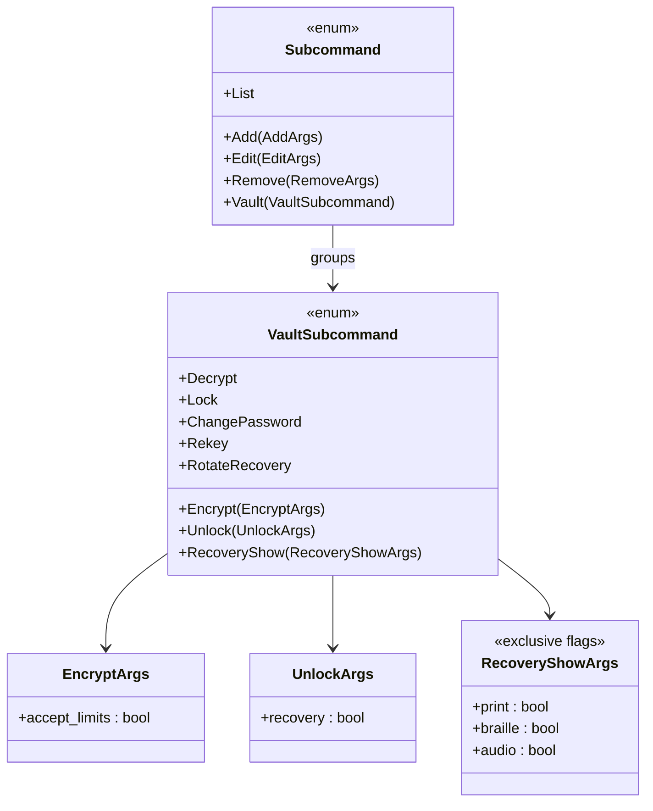

# 詳細設計書 — CLI vault サブコマンド（`cli-subcommands`）

<!-- 親: docs/features/vault-encryption/detailed-design/index.md -->
<!-- 配置先: docs/features/vault-encryption/detailed-design/cli-subcommands.md -->
<!-- 主担当: Sub-F (#44)。Sub-A〜E で凍結された IPC V2 ハンドラ + 応答スキーマ + MSG 指針 + 契約 C-19/C-20/C-22〜C-32 を CLI 経路で具現化する。 -->
<!-- 依存: Sub-E `vek-cache-and-ipc.md`（IPC V2 ハンドラ）、Sub-D `repository-and-migration.md`（DecryptConfirmation / RecoveryDisclosure）、Sub-A〜B `password.md` / `crypto-types.md`（MasterPassword / Vek） -->
<!-- 横断的変更: 本書は vault-encryption feature の詳細設計だが、`daemon-ipc` feature の `IpcResponse::Records` 拡張（`protection_mode` 同梱）と双方向参照する。 -->

## 対象型

- `shikomi_cli::cli::Subcommand::Vault(VaultSubcommand)`（**Sub-F 新規**、clap 派生型）
- `shikomi_cli::cli::VaultSubcommand` enum（**Sub-F 新規**、8 サブコマンド variant）
- `shikomi_cli::usecase::vault::{encrypt, decrypt, unlock, lock, change_password, recovery_show, rekey, rotate_recovery}`（**Sub-F 新規**、8 usecase）
- `shikomi_cli::presenter::{success, error, warning, prompt}`（**既存**、Sub-F で MSG-S03〜S20 文言経路を追加）
- `shikomi_cli::presenter::recovery_disclosure`（**Sub-F 新規**、24 語表示 + zeroize 連鎖専用 presenter）
- `shikomi_cli::presenter::mode_banner`（**Sub-F 新規**、`[plaintext]` / `[encrypted, locked]` / `[encrypted, unlocked]` バナー、REQ-S16）
- `shikomi_cli::io::ipc_client::IpcClient`（**既存**、handshake V2 確認 + send_request / recv_response、Sub-F は V2 variant 5 件を呼出す利用側）
- `shikomi_cli::input::{password_prompt, mnemonic_prompt, decrypt_confirmation_prompt}`（**Sub-F 新規**、TTY 非エコー読取 + paste 抑制 + `subtle::ConstantTimeEq`）
- `shikomi_cli::accessibility::{print_pdf, braille_brf, audio_tts}`（**Sub-F 新規**、MSG-S18 代替経路）
- `shikomi_core::ipc::IpcResponse::Records`（**横断的変更**、`Vec<RecordSummary>` → `{ records, protection_mode }` 構造体化、`#[non_exhaustive]` 経路で後方互換、`daemon-ipc` feature と双方向同期）

## モジュール配置と責務

```
crates/shikomi-cli/src/                    ~ Sub-F で大規模拡張
  cli.rs                                   ~  Subcommand に Vault(VaultSubcommand) を追加
  lib.rs                                   ~  run() の match 分岐に vault 8 variant を追加
  input/                                   + Sub-F 新規（既存 input.rs を分冊化、Boy Scout）
    mod.rs                                 +
    password.rs                            +  TTY 非エコー読取 + 強度ゲート前段
    mnemonic.rs                            +  24 語入力プロンプト + bip39 検証
    decrypt_confirmation.rs                +  DECRYPT 二段確認 + paste 抑制 + ConstantTimeEq
  presenter/
    mod.rs                                 ~
    recovery_disclosure.rs                 +  24 語 1 度表示 + Drop zeroize 連鎖（C-19）
    mode_banner.rs                         +  保護モードバナー（REQ-S16、ANSI カラー + 文字二重符号化）
    cache_relocked_warning.rs              +  MSG-S20 連結表示 + 再 unlock 案内（C-32）
  usecase/
    mod.rs                                 ~
    vault/                                 + Sub-F 新規サブモジュール
      mod.rs                               +
      encrypt.rs                           +  vault encrypt
      decrypt.rs                           +  vault decrypt
      unlock.rs                            +  vault unlock（password / --recovery 二経路）
      lock.rs                              +  vault lock
      change_password.rs                   +  vault change-password
      recovery_show.rs                     +  vault recovery-show + accessibility 分岐
      rekey.rs                             +  vault rekey + cache_relocked 分岐
      rotate_recovery.rs                   +  vault rotate-recovery + cache_relocked 分岐
  accessibility/                           + Sub-F 新規（MSG-S18）
    mod.rs                                 +
    print_pdf.rs                           +  --print PDF 出力
    braille_brf.rs                         +  --braille BRF 出力
    audio_tts.rs                           +  --audio OS TTS パイプ
  i18n/                                    + Sub-F 新規
    mod.rs                                 +
    locales/                               +
      ja-JP/messages.toml                  +  日本語文言辞書（MSG-S01〜S20）
      en-US/messages.toml                  +  英語文言辞書（同上）
crates/shikomi-core/src/ipc/               ~ 横断的変更（daemon-ipc feature 側 SSoT、本書は消費側）
  response.rs                              ~  IpcResponse::Records 構造体化、protection_mode 同梱
  protocol.rs                              ~  ProtectionModeBanner enum 新設
```

**Clean Architecture の依存方向**:

- shikomi-cli は shikomi-core（IPC スキーマ）と shikomi-infra（`PersistenceError` 等の透過のみ）に依存。**Sub-F で shikomi-infra への新規依存追加なし**（CLI は IPC 経由でのみ daemon と対話、vault に直接触らない、Phase 2 規定）
- `subtle` crate は既存 dev-dependencies → Sub-F で main dependency に昇格（C-20 二段確認 + paste 抑制で利用、`tech-stack.md` §4.7 凍結値内）
- `bip39` crate は既存 shikomi-core 経由で間接利用、CLI からの直接 import なし（Sub-A 24 語入力検証経路は `MnemonicValidator` trait 抽象を介す、Boy Scout で trait 化を Sub-F 提案）
- `printpdf` / `braille-rs` 等の追加 crate は MSG-S18 経路で必要。Sub-F PR レビューで `tech-stack.md` §4.7 に minor pin で追加（候補比較は §設計判断 §アクセシビリティ crate 選定）

## 設計判断: vault サブコマンドのグループ化（3 案比較）

| 案 | 説明 | 採否 |
|---|------|------|
| **A: トップレベル `Subcommand::Encrypt` / `Decrypt` / ...** | 既存 `Add` / `List` / `Edit` / `Remove` と同じ階層に 8 variant を平坦に追加 | **却下**: 既存 V1 サブコマンド（CRUD）と Sub-F V2 サブコマンド（vault 管理）が同列に並び、ユーザが「vault encrypt」と「list」が**異なる責務領域**であることを認識しづらい。`shikomi --help` が肥大化、grep 容易性も劣化 |
| **B: `Subcommand::Vault(VaultSubcommand)` でグループ化（採用）** | `shikomi vault {encrypt,decrypt,unlock,lock,change-password,recovery-show,rekey,rotate-recovery}` のサブコマンドネスト | **採用**: 責務領域が CLI 構造で明確化、`shikomi vault --help` で 8 サブコマンドが一覧化される。Issue #44 仕様の「vault 管理サブコマンド」と命名整合、田中ペルソナにも理解しやすい |
| **C: 別バイナリ `shikomi-vault` として独立** | shikomi-cli とは別 crate / 別バイナリで vault 管理ツールを独立 | **却下**: ユーザが 2 つの実行ファイルを使い分ける必要があり UX 劣化。配布も複雑化。Sub-F の責務範囲（既存 shikomi-cli への vault 管理追加）と乖離 |

**採用根拠**: B 案が Issue #44 仕様と一致、CLI 構造で責務領域を明示し、`shikomi vault --help` が単一エントリ点として機能する。

## 設計判断: 24 語の zeroize 経路（C-19 同型）

`IpcResponse::RecoveryRotated.words` / `Rekeyed.words` の `Vec<SerializableSecretBytes>` を CLI 層で受領した後、以下の 4 段防衛で zeroize 連鎖を強制する:

| 段 | 強制方法 | 対象 |
|---|------|------|
| (a) | `presenter::recovery_disclosure::display(words: Vec<SerializableSecretBytes>)` で**所有権を消費**、関数内で stdout に書き出し → 関数戻り直前に `mem::replace(&mut words, vec![])` で取り出して即 Drop | `Vec<SerializableSecretBytes>` |
| (b) | `SerializableSecretBytes::Drop` 実装で内包バッファを `zeroize`（Sub-A `RecoveryWords` 同型、Sub-E daemon 側でも同経路、Sub-A `Vek` 哲学継承）| `SerializableSecretBytes` |
| (c) | `tracing::debug!` / `info!` / `error!` のいずれにも `words` の Debug 出力を含めない（`SerializableSecretBytes::Debug = REDACTED` 固定、Sub-A 同型）| ログ経路全面 |
| (d) | `--print` / `--braille` / `--audio` 経路で外部プロセスにパイプする場合も、本プロセス内バッファは Drop 連鎖 zeroize、外部プロセスの責務は MSG-S18 案内で明示（録音禁止プレイヤー優先順位）| 外部プロセス境界 |

## 設計判断: `cache_relocked: false` 経路の CLI 表示分岐（C-32 整合）

ペガサス工程5 致命指摘で凍結された Lie-Then-Surprise 防止を CLI 層で具現化する:

1. `IpcResponse::Rekeyed { records_count, words, cache_relocked }` または `RecoveryRotated { words, cache_relocked }` を usecase が受領
2. `presenter::recovery_disclosure::display` で **24 語を先に表示**（rekey/rotate_recovery の主目的を尊重、ux-and-msg.md §cache_relocked: false §文言の不変条件 (c)）
3. **`cache_relocked == true` 時**: MSG-S07 / S19 完了文言のみ → 終了コード 0
4. **`cache_relocked == false` 時**: MSG-S07 / S19 完了文言 + `presenter::cache_relocked_warning::display` で MSG-S20 連結表示 + 「次の操作前に `shikomi vault unlock` を再度実行してください」案内 → 終了コード 0（C-31、operation 成功）
5. **C-32 能動的提示**: CLI が **次の操作を呼ぶ前にユーザに再 unlock を促す**責務。実装方針は (a) 静的提示（メッセージ末尾の案内文のみ）、(b) インタラクティブ TTY なら `vault unlock` 自動起動プロンプト（オプション、`--auto-relock` フラグ）の 2 段。Sub-F 工程5 で UX レビュー後に最終確定

## 設計判断: 保護モードバナー実装（REQ-S16）

| 案 | 説明 | 採否 |
|---|------|------|
| **A: 別 IPC `Status` variant を追加して `vault status` で問い合わせ** | `IpcRequest::Status` / `IpcResponse::Status { protection_mode, cache_state }` を新設 | **却下**: `shikomi list` 実行ごとに 2 往復 IPC が必要（status + records）、レイテンシ劣化。Sub-E で MSG-S03 CLI 経路に「`shikomi vault status` で確認可能」と記述があるが、これは別経路（補助コマンド）で、`list` 内では同梱が筋 |
| **B: `IpcResponse::Records` を構造体化して `protection_mode` を同梱（採用）** | `Records(Vec<RecordSummary>)` → `Records { records: Vec<RecordSummary>, protection_mode: ProtectionModeBanner }` | **採用**: 1 往復で `list` 実行可能、`#[non_exhaustive]` 経路で V1 互換性は serde の Default + skip_serializing_if で吸収。`daemon-ipc` feature 側 `protocol-types.md` も Sub-F PR で双方向同期 |
| **C: CLI が vault.db のヘッダを直接読む** | shikomi-infra `SqliteVaultRepository` 等を CLI 層で再利用 | **却下**: Phase 2 規定「CLI は vault に直接触らない」違反、Clean Arch も崩壊 |

**採用根拠**: B 案が Tell-Don't-Ask 整合、daemon が「保護モードを教える」責務を持ち、CLI は受領して presenter で表示するのみ。`#[non_exhaustive]` で V1 互換性も維持。

### `ProtectionModeBanner` enum

`shikomi-core::ipc::ProtectionModeBanner` を新設（`#[non_exhaustive]`）:

| variant | 表示文字 | ANSI カラー | 二重符号化（色覚多様性） |
|---|---|---|---|
| `Plaintext` | `[plaintext]` | 灰色（cyan dim）| 文字単独で「平文」と判別可 |
| `EncryptedLocked` | `[encrypted, locked]` | 橙色（yellow）| 文字単独で「Locked」と判別可 |
| `EncryptedUnlocked` | `[encrypted, unlocked]` | 緑色（green）| 文字単独で「Unlocked」と判別可 |
| `Unknown` | `[unknown]` | 赤色（red）| Fail-Secure 経路、終了コード 3 で fail fast（REQ-S16） |

`NO_COLOR` 環境変数 / 非 TTY / `--quiet` 時はカラー無効化、文字のみ表示。

## clap 派生型構造（Subcommand 拡張）



clap の `#[command(subcommand)]` ネスト機構を利用。`RecoveryShowArgs` は `#[arg(group = "format", required = false)]` で `--print` / `--braille` / `--audio` の排他指定を強制（複数指定時は clap が `clap::Error::ArgumentConflict` で fail fast）。

## 処理フロー詳細（F-F1〜F-F8）

ハイレベルフロー（番号付き）は `basic-design/processing-flows.md` §F-F1〜F-F8 を SSoT とする。本書では各フローの **clap 派生型 / IPC variant / presenter / 終了コード** の対応のみ表化:

| Flow ID | サブコマンド | clap variant | IPC Request | IPC Response（成功）| presenter | 終了コード（成功 / 失敗）|
|---|---|---|---|---|---|---|
| **F-F1** | `vault encrypt` | `Vault(Encrypt(EncryptArgs))` | `Encrypt { master_password, accept_limits }` | `Encrypted { disclosure }` | `recovery_disclosure::display` + MSG-S01 / S06 / S16 | 0 / 1 / 2 |
| **F-F2** | `vault decrypt` | `Vault(Decrypt)` | `Decrypt { master_password, confirmation }` | `Decrypted` | `success::display(MSG-S02)` | 0 / 1 |
| **F-F3** | `vault unlock` | `Vault(Unlock(UnlockArgs))` | `Unlock { master_password, recovery: Option<RecoveryMnemonic> }` | `Unlocked` | `success::display(MSG-S03)` | 0 / 2 / 5 |
| **F-F4** | `vault lock` | `Vault(Lock)` | `Lock` | `Locked` | `success::display(MSG-S04)` | 0 |
| **F-F5** | `vault change-password` | `Vault(ChangePassword)` | `ChangePassword { old, new }` | `PasswordChanged` | `success::display(MSG-S05)` | 0 / 1 |
| **F-F6** | `vault recovery-show` | `Vault(RecoveryShow(RecoveryShowArgs))` | （IPC を呼ばない、`encrypt` 直後に F-F1 で取得済の `disclosure` を消費）| - | `recovery_disclosure::display` + accessibility 分岐 | 0 / 1（2 度目以降）|
| **F-F7** | `vault rekey` | `Vault(Rekey)` | `Rekey { master_password }` | `Rekeyed { records_count, words, cache_relocked }` | `recovery_disclosure::display` + MSG-S07 + （`cache_relocked == false` 時）`cache_relocked_warning::display` | 0（C-31）|
| **F-F8** | `vault rotate-recovery` | `Vault(RotateRecovery)` | `RotateRecovery { master_password }` | `RecoveryRotated { words, cache_relocked }` | `recovery_disclosure::display` + MSG-S19 + （`cache_relocked == false` 時）`cache_relocked_warning::display` | 0（同上）|

## 既存サブコマンドのロック時挙動（REQ-S16 整合）

| usecase | 暗号化モード Locked 検出方法 | 表示 MSG | 終了コード |
|---|---|---|---|
| `usecase::add` | `IpcResponse::Error(IpcErrorCode::VaultLocked)` 受信 | MSG-S09(c) + `vault unlock` 誘導 | 3 |
| `usecase::list` | `IpcResponse::Error(IpcErrorCode::VaultLocked)` 受信 | 同上 | 3 |
| `usecase::edit` | 同上 | 同上 | 3 |
| `usecase::remove` | 同上 | 同上 | 3 |
| `usecase::list`（成功時、`Records.protection_mode` 受領）| - | `mode_banner::display(protection_mode)` 先頭行 + レコード一覧 | 0 |

ロック時のメッセージにレコード内容 / ID / ラベルを**含めない**（情報漏洩防止、Issue #44 仕様）。

## アクセシビリティ代替経路（MSG-S18、WCAG 2.1 AA）

`vault recovery-show` の `--print` / `--braille` / `--audio` フラグの実装方針:

| 経路 | 出力先 | 実装方針 | crate 候補（Sub-F PR で確定）|
|---|---|---|---|
| `--print` | stdout（PDF バイナリ）| ハイコントラスト PDF（黒地白文字、最大 36pt、各語に番号付与）| `printpdf` v0.7+（major pin） / `lopdf` v0.32+ |
| `--braille` | stdout（`.brf` テキスト）| Braille Ready Format、Grade 2 英語点字標準 | `louis-rs`（liblouis bindings）/ 自前 wordlist 変換（軽量）|
| `--audio` | OS TTS への直接パイプ | macOS `say` / Windows `SAPI` (PowerShell) / Linux `espeak`、録音可能アプリ経由禁止 | `std::process::Command` のみ（追加 crate なし）|

**自動切替経路**: `SHIKOMI_ACCESSIBILITY=1` 環境変数 / OS スクリーンリーダー検出（macOS `defaults read com.apple.universalaccess` / Windows `Narrator.exe` プロセス検出 / Linux Orca DBus 経路）/ 明示フラグのいずれかで `recovery-show` 出力経路を自動切替。

## i18n 戦略責務分離（Sub-F 確定）

| 階層 | 責務 | 実装場所 |
|------|------|----|
| **Sub-A** | 英語 raw `WeakPasswordFeedback`（zxcvbn 由来）を運ぶ純粋データ構造 | `shikomi-core::crypto::password::WeakPasswordFeedback` |
| **Sub-D** | MSG-S08 翻訳辞書キー定義（`weak_password.warning_key` 等）| `password.md` §i18n 戦略責務分離 |
| **Sub-E** | MSG-S03 / S04 / S05 / S07 / S09 / S15 / S19 / S20 の翻訳キー定義 + 文言指針 | `requirements.md` MSG 表 + `ux-and-msg.md` |
| **Sub-F** | i18n 翻訳辞書 `messages.toml` 実装 + `shikomi_cli::i18n::Localizer` ロード経路 + ロケール選択（`SHIKOMI_LOCALE` env / `sys-locale` crate / fallback to en-US）| `shikomi-cli/src/i18n/locales/{ja-JP,en-US}/messages.toml` |

**辞書ファイル形式**: TOML（`toml` crate v0.8+ で読込、`tech-stack.md` §4.7 既存依存）。キーは MSG ID + 経路サフィックス（`s07_cli` / `s07_gui` / `s07_completed_records_count` 等）。フォールバック順: 指定ロケール → `en-US` → ハードコード fallback（`detailed-design/cli-subcommands.md` でキー欠落時のパニック禁止、Sub-F 不変条件 C-33）。

## 不変条件・契約（Sub-F 新規 C-33〜C-37）

| 契約 | 強制方法 | 検証手段 |
|---|---|---|
| **C-33**: i18n 辞書キー欠落時もパニックさせず英語 fallback で fail-soft（Sub-F 新規）| `shikomi_cli::i18n::Localizer::translate(key)` が `Result<String, MissingKey>` ではなく `String` を返し、欠落時は `format!("[missing:{key}]")` を返す | ユニットテスト: 存在しないキーで `translate` 呼出 → `[missing:foo]` 返却、パニックなし |
| **C-34**: `vault decrypt` 二段確認 paste 抑制（Sub-F 新規）| `decrypt_confirmation::prompt` が連続入力時刻差を計測、30ms 以内連続入力時に `CliError::PasteSuspected` で fail fast | integration test: 模擬 paste（30ms 以内 2 回入力）→ `Err(PasteSuspected)`、終了コード 1 |
| **C-35**: `recovery-show` 二度目以降は CLI 層で fail fast（Sub-F 新規、C-19 整合）| daemon 側で `RecoveryDisclosure` 構築済フラグを持ち、CLI からの 2 度目の `RecoveryShow` IPC 要求に `IpcErrorCode::Internal { reason: "recovery-already-disclosed" }` で拒否 → CLI 経路で MSG-S09 系に変換 | integration test: encrypt → recovery-show → recovery-show（2 度目）→ 失敗、終了コード 1 |
| **C-36**: `cache_relocked: false` 経路で終了コード 0、Err 終了コードを返さない（Sub-F 新規、C-31 整合）| `usecase::vault::rekey` / `rotate_recovery` が `Rekeyed { cache_relocked: false }` 受領時に `Ok(ExitCode::SUCCESS)` を返す | integration test: fault-injection で `cache_relocked: false` を再現 → 終了コード 0 + MSG-S20 stderr 表示 |
| **C-37**: 保護モードバナーの隠蔽オプションを提供しない（Sub-F 新規、REQ-S16 強制）| clap 派生型に `--no-mode-banner` フラグを定義しない、grep gate で実装にも該当文字列が無いことを機械検証 | grep 静的検査（TC-F-S* で `no-mode-banner` / `no_mode_banner` の文字列不在を網羅確認）|

## 双方向同期（daemon-ipc feature への横断的変更）

本書は vault-encryption feature の詳細設計だが、以下の `daemon-ipc` feature ファイルとの**双方向同期**が必須（Sub-F 工程2 で同時更新）:

| daemon-ipc 側ファイル | 同期内容 |
|---|---|
| `requirements.md` | `IpcResponse::Records` 構造体化、`ProtectionModeBanner` enum 追加 |
| `detailed-design/protocol-types.md` | 構造体化詳細、後方互換性方針（`#[non_exhaustive]` + serde Default）|
| `test-design/integration.md` | V1 client が新構造体応答を decode できる後方互換 TC 追加 |

**SSoT 凍結**: `IpcResponse` / `IpcRequest` / `IpcError` の variant 列挙は **`daemon-ipc/detailed-design/protocol-types.md` を SSoT** とし、本書は消費側として参照する。Sub-D Rev3 で凍結した「実装直読 SSoT」原則を継承（grep gate で機械検証する場合は Sub-F 静的検査 `sub-f-static-checks.sh` で `IpcRequest` variant 数を実装と一致確認）。

## Sub-F → 後続 GUI feature への引継ぎ

1. **Tauri WebView 起動経路**: 後続 GUI feature（Issue 未発番）で本書の usecase 層を再利用。`shikomi_cli::usecase::vault::*` を `shikomi_gui` から呼出可能にするため、`pub` 公開範囲を Sub-F PR で確定（Boy Scout）
2. **MSG-S17 GUI バッジ**: 後続 GUI feature で実装、本書では `requirements.md` MSG-S17 の TBD のまま（Sub-F は CLI 経路のみ）
3. **i18n 辞書共有**: `messages.toml` を CLI / GUI 両方で参照、辞書ファイル配置を `shared/i18n/` 等に再配置する Boy Scout を後続 GUI feature 工程2 で検討
